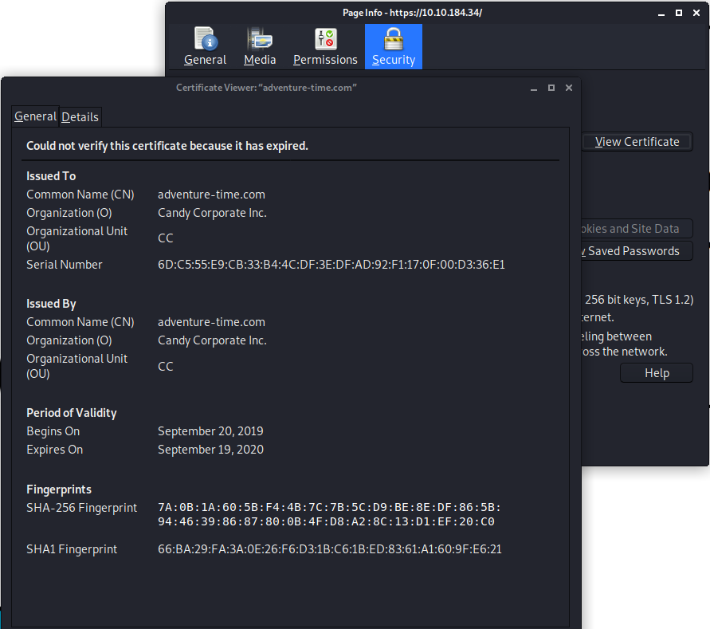

# Adventure Time

A CTF based challenge to get your blood pumping...

[Adventure Time](https://tryhackme.com/room/adventuretime)

## Topic's

- Network Enumeration
- FTP Enumeration
- Bash Scripting (Loop)
- Staganography
- Web Poking
- Web Enumeration
- SSL Enumeration
- Cryptography
  - Base32
  - ROT11
  - Binary
  - Morse Code
  - AES
  - Vigenère
  - Spoon
- Brute Forcing (SSH)

## Appendix archive

Password: `1 kn0w 1 5h0uldn'7!`

## Task 1 Adventure Time


Time to go on an adventure. Do you have what it takes to help Finn and Jake find BMO's reset code?
Help solve puzzles and try harder to the max....

This is not a real world challenge, but fun and game only (and maybe learn a thing or two along the way).

```
kali@kali:~/CTFs/tryhackme/Adventure Time$ sudo nmap -p- -Pn -sS -sC -sV -O 10.10.184.34
[sudo] password for kali:
Starting Nmap 7.80 ( https://nmap.org ) at 2020-10-07 20:05 CEST
Nmap scan report for 10.10.184.34
Host is up (0.083s latency).
Not shown: 65530 closed ports
PORT      STATE SERVICE  VERSION
21/tcp    open  ftp      vsftpd 3.0.3
| ftp-anon: Anonymous FTP login allowed (FTP code 230)
| -r--r--r--    1 ftp      ftp       1401357 Sep 21  2019 1.jpg
| -r--r--r--    1 ftp      ftp        233977 Sep 21  2019 2.jpg
| -r--r--r--    1 ftp      ftp        524615 Sep 21  2019 3.jpg
| -r--r--r--    1 ftp      ftp        771076 Sep 21  2019 4.jpg
| -r--r--r--    1 ftp      ftp       1644395 Sep 21  2019 5.jpg
|_-r--r--r--    1 ftp      ftp         40355 Sep 21  2019 6.jpg
| ftp-syst:
|   STAT:
| FTP server status:
|      Connected to ::ffff:10.8.106.222
|      Logged in as ftp
|      TYPE: ASCII
|      No session bandwidth limit
|      Session timeout in seconds is 300
|      Control connection is plain text
|      Data connections will be plain text
|      At session startup, client count was 3
|      vsFTPd 3.0.3 - secure, fast, stable
|_End of status
22/tcp    open  ssh      OpenSSH 7.6p1 Ubuntu 4 (Ubuntu Linux; protocol 2.0)
| ssh-hostkey:
|   256 db:87:9e:06:43:c7:6e:00:7b:c3:bc:a1:97:dd:5e:83 (ECDSA)
|_  256 6b:40:84:e6:9c:bc:1c:a8:de:b2:a1:8b:a3:6a:ef:f0 (ED25519)
80/tcp    open  http     Apache httpd 2.4.29
|_http-server-header: Apache/2.4.29 (Ubuntu)
|_http-title: 404 Not Found
443/tcp   open  ssl/http Apache httpd 2.4.29 ((Ubuntu))
|_http-server-header: Apache/2.4.29 (Ubuntu)
|_http-title: 400 Bad Request
| ssl-cert: Subject: commonName=adventure-time.com/organizationName=Candy Corporate Inc./stateOrProvinceName=Candy Kingdom/countryName=CK
| Not valid before: 2019-09-20T08:29:36
|_Not valid after:  2020-09-19T08:29:36
|_ssl-date: TLS randomness does not represent time
| tls-alpn:
|_  http/1.1
31337/tcp open  Elite?
| fingerprint-strings:
|   DNSStatusRequestTCP, RPCCheck, SSLSessionReq:
|     Hello Princess Bubblegum. What is the magic word?
|     magic word is not
|   DNSVersionBindReqTCP:
|     Hello Princess Bubblegum. What is the magic word?
|     magic word is not
|     version
|     bind
|   GenericLines, NULL:
|     Hello Princess Bubblegum. What is the magic word?
|   GetRequest:
|     Hello Princess Bubblegum. What is the magic word?
|     magic word is not GET / HTTP/1.0
|   HTTPOptions:
|     Hello Princess Bubblegum. What is the magic word?
|     magic word is not OPTIONS / HTTP/1.0
|   Help:
|     Hello Princess Bubblegum. What is the magic word?
|     magic word is not HELP
|   RTSPRequest:
|     Hello Princess Bubblegum. What is the magic word?
|     magic word is not OPTIONS / RTSP/1.0
|   SIPOptions:
|     Hello Princess Bubblegum. What is the magic word?
|     magic word is not OPTIONS sip:nm SIP/2.0
|     Via: SIP/2.0/TCP nm;branch=foo
|     From: <sip:nm@nm>;tag=root
|     <sip:nm2@nm2>
|     Call-ID: 50000
|     CSeq: 42 OPTIONS
|     Max-Forwards: 70
|     Content-Length: 0
|     Contact: <sip:nm@nm>
|_    Accept: application/sdp
1 service unrecognized despite returning data. If you know the service/version, please submit the following fingerprint at https://nmap.org/cgi-bin/submit.cgi?new-service :
SF-Port31337-TCP:V=7.80%I=7%D=10/7%Time=5F7E03FE%P=x86_64-pc-linux-gnu%r(N
SF:ULL,32,"Hello\x20Princess\x20Bubblegum\.\x20What\x20is\x20the\x20magic\
SF:x20word\?\n")%r(GetRequest,57,"Hello\x20Princess\x20Bubblegum\.\x20What
SF:\x20is\x20the\x20magic\x20word\?\nThe\x20magic\x20word\x20is\x20not\x20
SF:GET\x20/\x20HTTP/1\.0\n")%r(SIPOptions,124,"Hello\x20Princess\x20Bubble
SF:gum\.\x20What\x20is\x20the\x20magic\x20word\?\nThe\x20magic\x20word\x20
SF:is\x20not\x20OPTIONS\x20sip:nm\x20SIP/2\.0\r\nVia:\x20SIP/2\.0/TCP\x20n
SF:m;branch=foo\r\nFrom:\x20<sip:nm@nm>;tag=root\r\nTo:\x20<sip:nm2@nm2>\r
SF:\nCall-ID:\x2050000\r\nCSeq:\x2042\x20OPTIONS\r\nMax-Forwards:\x2070\r\
SF:nContent-Length:\x200\r\nContact:\x20<sip:nm@nm>\r\nAccept:\x20applicat
SF:ion/sdp\n")%r(GenericLines,32,"Hello\x20Princess\x20Bubblegum\.\x20What
SF:\x20is\x20the\x20magic\x20word\?\n")%r(HTTPOptions,5B,"Hello\x20Princes
SF:s\x20Bubblegum\.\x20What\x20is\x20the\x20magic\x20word\?\nThe\x20magic\
SF:x20word\x20is\x20not\x20OPTIONS\x20/\x20HTTP/1\.0\n")%r(RTSPRequest,5B,
SF:"Hello\x20Princess\x20Bubblegum\.\x20What\x20is\x20the\x20magic\x20word
SF:\?\nThe\x20magic\x20word\x20is\x20not\x20OPTIONS\x20/\x20RTSP/1\.0\n")%
SF:r(RPCCheck,75,"Hello\x20Princess\x20Bubblegum\.\x20What\x20is\x20the\x2
SF:0magic\x20word\?\nThe\x20magic\x20word\x20is\x20not\x20\x80\0\0\(r\xfe\
SF:x1d\x13\0\0\0\0\0\0\0\x02\0\x01\x86\xa0\0\x01\x97\|\0\0\0\0\0\0\0\0\0\0
SF:\0\0\0\0\0\0\0\0\0\0\n")%r(DNSVersionBindReqTCP,69,"Hello\x20Princess\x
SF:20Bubblegum\.\x20What\x20is\x20the\x20magic\x20word\?\nThe\x20magic\x20
SF:word\x20is\x20not\x20\0\x1e\0\x06\x01\0\0\x01\0\0\0\0\0\0\x07version\x0
SF:4bind\0\0\x10\0\x03\n")%r(DNSStatusRequestTCP,57,"Hello\x20Princess\x20
SF:Bubblegum\.\x20What\x20is\x20the\x20magic\x20word\?\nThe\x20magic\x20wo
SF:rd\x20is\x20not\x20\0\x0c\0\0\x10\0\0\0\0\0\0\0\0\0\n")%r(Help,4D,"Hell
SF:o\x20Princess\x20Bubblegum\.\x20What\x20is\x20the\x20magic\x20word\?\nT
SF:he\x20magic\x20word\x20is\x20not\x20HELP\n")%r(SSLSessionReq,A1,"Hello\
SF:x20Princess\x20Bubblegum\.\x20What\x20is\x20the\x20magic\x20word\?\nThe
SF:\x20magic\x20word\x20is\x20not\x20\x16\x03\0\0S\x01\0\0O\x03\0\?G\xd7\x
SF:f7\xba,\xee\xea\xb2`~\xf3\0\xfd\x82{\xb9\xd5\x96\xc8w\x9b\xe6\xc4\xdb<=
SF:\xdbo\xef\x10n\0\0\(\0\x16\0\x13\0\n\0f\0\x05\0\x04\0e\0d\0c\0b\0a\0`\0
SF:\x15\0\x12\0\t\0\x14\0\x11\0\x08\0\x06\0\x03\x01\0\n");
No exact OS matches for host (If you know what OS is running on it, see https://nmap.org/submit/ ).
TCP/IP fingerprint:
OS:SCAN(V=7.80%E=4%D=10/7%OT=21%CT=1%CU=41787%PV=Y%DS=2%DC=I%G=Y%TM=5F7E04E
OS:B%P=x86_64-pc-linux-gnu)SEQ(SP=103%GCD=1%ISR=108%TI=Z%CI=Z%II=I%TS=A)OPS
OS:(O1=M508ST11NW6%O2=M508ST11NW6%O3=M508NNT11NW6%O4=M508ST11NW6%O5=M508ST1
OS:1NW6%O6=M508ST11)WIN(W1=68DF%W2=68DF%W3=68DF%W4=68DF%W5=68DF%W6=68DF)ECN
OS:(R=Y%DF=Y%T=40%W=6903%O=M508NNSNW6%CC=Y%Q=)T1(R=Y%DF=Y%T=40%S=O%A=S+%F=A
OS:S%RD=0%Q=)T2(R=N)T3(R=N)T4(R=Y%DF=Y%T=40%W=0%S=A%A=Z%F=R%O=%RD=0%Q=)T5(R
OS:=Y%DF=Y%T=40%W=0%S=Z%A=S+%F=AR%O=%RD=0%Q=)T6(R=Y%DF=Y%T=40%W=0%S=A%A=Z%F
OS:=R%O=%RD=0%Q=)T7(R=Y%DF=Y%T=40%W=0%S=Z%A=S+%F=AR%O=%RD=0%Q=)U1(R=Y%DF=N%
OS:T=40%IPL=164%UN=0%RIPL=G%RID=G%RIPCK=G%RUCK=G%RUD=G)IE(R=Y%DFI=N%T=40%CD
OS:=S)

Network Distance: 2 hops
Service Info: Host: 127.0.1.1; OSs: Unix, Linux; CPE: cpe:/o:linux:linux_kernel

OS and Service detection performed. Please report any incorrect results at https://nmap.org/submit/ .
Nmap done: 1 IP address (1 host up) scanned in 378.44 seconds
```

```
kali@kali:~/CTFs/tryhackme/Adventure Time$ ftp 10.10.184.34
Connected to 10.10.184.34.
220 (vsFTPd 3.0.3)
Name (10.10.184.34:kali): anonymous
230 Login successful.
Remote system type is UNIX.
Using binary mode to transfer files.
ftp> ls -la
200 PORT command successful. Consider using PASV.
150 Here comes the directory listing.
drwxr-xr-x    2 ftp      ftp          4096 Sep 21  2019 .
drwxr-xr-x    2 ftp      ftp          4096 Sep 21  2019 ..
-r--r--r--    1 ftp      ftp       1401357 Sep 21  2019 1.jpg
-r--r--r--    1 ftp      ftp        233977 Sep 21  2019 2.jpg
-r--r--r--    1 ftp      ftp        524615 Sep 21  2019 3.jpg
-r--r--r--    1 ftp      ftp        771076 Sep 21  2019 4.jpg
-r--r--r--    1 ftp      ftp       1644395 Sep 21  2019 5.jpg
-r--r--r--    1 ftp      ftp         40355 Sep 21  2019 6.jpg
226 Directory send OK.
ftp> mget *
mget 1.jpg?
200 PORT command successful. Consider using PASV.
150 Opening BINARY mode data connection for 1.jpg (1401357 bytes).
226 Transfer complete.
1401357 bytes received in 1.40 secs (975.6602 kB/s)
mget 2.jpg?
200 PORT command successful. Consider using PASV.
150 Opening BINARY mode data connection for 2.jpg (233977 bytes).
226 Transfer complete.
233977 bytes received in 0.35 secs (650.8608 kB/s)
mget 3.jpg?
200 PORT command successful. Consider using PASV.
150 Opening BINARY mode data connection for 3.jpg (524615 bytes).
226 Transfer complete.
524615 bytes received in 0.60 secs (860.5303 kB/s)
mget 4.jpg?
200 PORT command successful. Consider using PASV.
150 Opening BINARY mode data connection for 4.jpg (771076 bytes).
226 Transfer complete.
771076 bytes received in 1.14 secs (662.1747 kB/s)
mget 5.jpg?
200 PORT command successful. Consider using PASV.
150 Opening BINARY mode data connection for 5.jpg (1644395 bytes).
226 Transfer complete.
1644395 bytes received in 1.83 secs (877.1753 kB/s)
mget 6.jpg?
200 PORT command successful. Consider using PASV.
150 Opening BINARY mode data connection for 6.jpg (40355 bytes).
226 Transfer complete.
40355 bytes received in 0.17 secs (238.6237 kB/s)
ftp> exit
221 Goodbye.
```

```
kali@kali:~/CTFs/tryhackme/Adventure Time$ for i in {1..6}; do exiftool $i.jpg | grep "XP Comment" | cut -d ":" -f2;done
 01111001 01101111 01110101 00100000
 01110010 01100101 01100001 01101100 01101100 01111001 00100000
 01101100 01101001 01101011 01100101 00100000
 01110100 01101111 00100000
 01110000 01110101 01111010 01111010 01101100 01100101 00100000
 01100100 01101111 01101110 00100111 01110100 00100000 01111001 01100001
```

`you really like to puzzle don't ya`

- [https://10.10.184.34/](https://10.10.184.34/)

```html
<!DOCTYPE html>
<html>
  <head>
    <title>You found Finn</title>
  </head>
  <body>
    <div id="container" align="center">
      
    </div>
  </body>
</html>
```


```
kali@kali:~/CTFs/tryhackme/Adventure Time$ gobuster dir -u https://192.168.245.132 -w /usr/share/wordlists/dirbuster/directory-list-lowercase-2.3-medium.txt -k -f -s 200
===============================================================
Gobuster v3.0.1
by OJ Reeves (@TheColonial) & Christian Mehlmauer (@_FireFart_)
===============================================================
[+] Url:            https://192.168.245.132
[+] Threads:        10
[+] Wordlist:       /usr/share/wordlists/dirbuster/directory-list-lowercase-2.3-medium.txt
[+] Status codes:   200
[+] User Agent:     gobuster/3.0.1
[+] Add Slash:      true
[+] Timeout:        10s
===============================================================
2019/09/23 17:12:05 Starting gobuster
===============================================================
/candybar/ (Status: 200)
===============================================================
2019/09/23 17:12:32 Finished
===============================================================
```




```
E = bubblegum@land-of-ooo.com
CN = adventure-time.com
OU = CC
O = Candy Corporate Inc.
ST = Candy Kingdom
C = CK
```

Add `10.10.184.34 land-of-ooo.com adventure-time.com` to `/etc/hosts`

- [https://land-of-ooo.com/](https://land-of-ooo.com/)

```html
<!DOCTYPE html>
<html>
  <head>
    <title>You found Jake</title>
  </head>
  <body>
    <div id="container" align="center">
      
    </div>
  </body>
</html>
```


```
kali@kali:~/CTFs/tryhackme/Adventure Time$ gobuster dir -u https://land-of-ooo.com -w /usr/share/wordlists/dirbuster/directory-list-lowercase-2.3-medium.txt -k -f -s 200
===============================================================
Gobuster v3.0.1
by OJ Reeves (@TheColonial) & Christian Mehlmauer (@_FireFart_)
===============================================================
[+] Url:            https://land-of-ooo.com/
[+] Threads:        10
[+] Wordlist:       /usr/share/wordlists/dirbuster/directory-list-lowercase-2.3-medium.txt
[+] Status codes:   200
[+] User Agent:     gobuster/3.0.1
[+] Add Slash:      true
[+] Timeout:        10s
===============================================================
2019/09/23 17:20:41 Starting gobuster
===============================================================
/yellowdog/ (Status: 200)
===============================================================
2019/09/23 17:21:10 Finished
===============================================================
```

- [https://land-of-ooo.com/yellowdog/](https://land-of-ooo.com/yellowdog/)

```html
<!DOCTYPE html>
<html>
  <head>
    <title>To find a password</title>
  </head>
  <body>
    <div id="container" align="center">
      
    </div>
  </body>
</html>
```


```
kali@kali:~/CTFs/tryhackme/Adventure Time$ gobuster dir -u https://land-of-ooo.com/yellowdog/ -w /usr/share/wordlists/dirbuster/directory-list-lowercase-2.3-medium.txt -k -f -s 200
===============================================================
Gobuster v3.0.1
by OJ Reeves (@TheColonial) & Christian Mehlmauer (@_FireFart_)
===============================================================
[+] Url:            https://land-of-ooo.com/yellowdog/
[+] Threads:        10
[+] Wordlist:       /usr/share/wordlists/dirbuster/directory-list-lowercase-2.3-medium.txt
[+] Status codes:   200
[+] User Agent:     gobuster/3.0.1
[+] Add Slash:      true
[+] Timeout:        10s
===============================================================
2019/09/23 17:23:17 Starting gobuster
===============================================================
/bananastock/ (Status: 200)
===============================================================
2019/09/23 17:23:44 Finished
===============================================================
```

- [https://land-of-ooo.com/yellowdog/bananastock/](https://land-of-ooo.com/yellowdog/bananastock/)

```html
<!DOCTYPE html>
<html>
  <head>
    <title>Those banana guards are not really smart</title>
  </head>
  <body>
    <div id="container" align="center">
      
    </div>

    <!-- _/..../.\_.../._/_./._/_./._/...\._/._./.\_/..../.\_..././.../_/_._.__/_._.__/_._.__ -->
  </body>
</html>
```


- [Code Morse](https://www.dcode.fr/code-morse)

`THE BANANAS ARE THE BEST!!!`

```
kali@kali:~/CTFs/tryhackme/Adventure Time$ gobuster dir -u https://land-of-ooo.com/yellowdog/bananastock/ -w /usr/share/wordlists/dirbuster/directory-list-lowercase-2.3-medium.txt -k -f -s 200
===============================================================
Gobuster v3.0.1
by OJ Reeves (@TheColonial) & Christian Mehlmauer (@_FireFart_)
===============================================================
[+] Url:            https://land-of-ooo.com/yellowdog/bananastock/
[+] Threads:        10
[+] Wordlist:       /usr/share/wordlists/dirbuster/directory-list-lowercase-2.3-medium.txt
[+] Status codes:   200
[+] User Agent:     gobuster/3.0.1
[+] Add Slash:      true
[+] Timeout:        10s
===============================================================
2019/09/23 17:25:54 Starting gobuster
===============================================================
/princess/ (Status: 200)
===============================================================
2019/09/23 17:26:25 Finished
===============================================================
```

- [https://land-of-ooo.com/yellowdog/bananastock/princess/](https://land-of-ooo.com/yellowdog/bananastock/princess/)

```
<!DOCTYPE html>
<html>
<head>
<title>What secret safe?</title>
</head>
<body>
    <div id="container" align="center">
        
    </div>

    <!--
    Secrettext = 0008f1a92d287b48dccb5079eac18ad2a0c59c22fbc7827295842f670cdb3cb645de3de794320af132ab341fe0d667a85368d0df5a3b731122ef97299acc3849cc9d8aac8c3acb647483103b5ee44166
    Key = my cool password
    IV = abcdefghijklmanopqrstuvwxyz
    Mode = CBC
    Input = hex
    Output = raw
    -->

</body>
</html>
```

- Secrettext = 0008f1a92d287b48dccb5079eac18ad2a0c59c22fbc7827295842f670cdb3cb645de3de794320af132ab341fe0d667a85368d0df5a3b731122ef97299acc3849cc9d8aac8c3acb647483103b5ee44166
- Key = my cool password
- IV = abcdefghijklmanopqrstuvwxyz
- Mode = CBC
- Input = hex
- Output = raw

- [ASCII Text to Hex Code Converter](https://www.rapidtables.com/convert/number/ascii-to-hex.html)
  - `abcdefghijklmanopqrstuvwxyz` > `61 62 63 64 65 66 67 68 69 6a 6b 6c 6d 61 6e 6f 70 71 72 73 74 75 76 77 78 79 7a`


```
t	h	e		m	a	g	i	c		s	a	f	e		i
s		a	c	c	e	s	s	i	b	e	l		a	t
p	o	r	t		3	1	3	3	7	.		t	h	e
m	a	g	i	c		w	o	r	d		i	s	:		r
i	c	a	r	d	i	o	.	.	.	.	.	.	.	.	.
```

`31337`

`ricardio`

```
31337/tcp open  Elite?
| fingerprint-strings:
|   DNSStatusRequestTCP, RPCCheck, SSLSessionReq:
|     Hello Princess Bubblegum. What is the magic word?
|     magic word is not
|   DNSVersionBindReqTCP:
|     Hello Princess Bubblegum. What is the magic word?
|     magic word is not
|     version
|     bind
|   GenericLines, NULL:
|     Hello Princess Bubblegum. What is the magic word?
|   GetRequest:
|     Hello Princess Bubblegum. What is the magic word?
|     magic word is not GET / HTTP/1.0
|   HTTPOptions:
|     Hello Princess Bubblegum. What is the magic word?
|     magic word is not OPTIONS / HTTP/1.0
|   Help:
|     Hello Princess Bubblegum. What is the magic word?
|     magic word is not HELP
|   RTSPRequest:
|     Hello Princess Bubblegum. What is the magic word?
|     magic word is not OPTIONS / RTSP/1.0
|   SIPOptions:
|     Hello Princess Bubblegum. What is the magic word?
|     magic word is not OPTIONS sip:nm SIP/2.0
|     Via: SIP/2.0/TCP nm;branch=foo
|     From: <sip:nm@nm>;tag=root
|     <sip:nm2@nm2>
|     Call-ID: 50000
|     CSeq: 42 OPTIONS
|     Max-Forwards: 70
|     Content-Length: 0
|     Contact: <sip:nm@nm>
|_    Accept: application/sdp
```

```
kali@kali:~/CTFs/tryhackme/Adventure Time$ nc 10.10.201.194 31337
Hello Princess Bubblegum. What is the magic word?
ricardio
The new username is: apple-guards
```

`THE BANANAS ARE THE BEST!!!`

```
kali@kali:~/CTFs/tryhackme/Adventure Time$ ssh apple-guards@10.10.201.194
The authenticity of host '10.10.201.194 (10.10.201.194)' can't be established.
ECDSA key fingerprint is SHA256:xbyqQlD2bMFloDbi6VJNgAlut193WbcnAnRm+ZWvRyE.
Are you sure you want to continue connecting (yes/no/[fingerprint])? yes
Warning: Permanently added '10.10.201.194' (ECDSA) to the list of known hosts.
apple-guards@10.10.201.194's password:
Welcome to Ubuntu 18.04.3 LTS (GNU/Linux 4.15.0-62-generic x86_64)

 * Documentation:  https://help.ubuntu.com
 * Management:     https://landscape.canonical.com
 * Support:        https://ubuntu.com/advantage


 * Canonical Livepatch is available for installation.
   - Reduce system reboots and improve kernel security. Activate at:
     https://ubuntu.com/livepatch

1 package can be updated.
0 updates are security updates.

No mail.
Last login: Sat Sep 21 20:51:11 2019 from 192.168.245.129
apple-guards@at:~$
```

```
apple-guards@at:~$ cat flag.txt
Good job!!!!


tryhackme{2e37796b2bd0eae4b20c36cb359610ad}

apple-guards@at:~$ cat flag1
tryhackme{Th1s1sJustTh3St4rt}
```

```
apple-guards@at:~$ cat mbox
From marceline@at  Fri Sep 20 16:39:54 2019
Return-Path: <marceline@at>
X-Original-To: apple-guards@at
Delivered-To: apple-guards@at
Received: by at.localdomain (Postfix, from userid 1004)
        id 6737B24261C; Fri, 20 Sep 2019 16:39:54 +0200 (CEST)
Subject: Need help???
To: <apple-guards@at>
X-Mailer: mail (GNU Mailutils 3.4)
Message-Id: <20190920143954.6737B24261C@at.localdomain>
Date: Fri, 20 Sep 2019 16:39:54 +0200 (CEST)
From: marceline@at

Hi there bananaheads!!!
I heard Princess B revoked your access to the system. Bummer!
But I'll help you guys out.....doesn't cost you a thing.....well almost nothing.

I hid a file for you guys. If you get the answer right, you'll get better access.
Good luck!!!!
```

```
apple-guards@at:~$ find / -user marceline -type f 2>/dev/null
/etc/fonts/helper
```

```
======================================
      BananaHead Access Pass
       created by Marceline
======================================

Hi there bananaheads!!!
So you found my file?
But it won't help you if you can't answer this question correct.
What? I told you guys I would help and that it wouldn't cost you a thing....
Well I lied hahahaha

Ready for the question?

The key to solve this puzzle is gone
And you need the key to get this readable: Gpnhkse

Did you solve the puzzle? yes

What is the word I'm looking for? Abadeer

That's it!!!! You solved my puzzle
Don't tell princess B I helped you guys!!!
My password is 'My friend Finn'
```

`My friend Finn`

```
apple-guards@at:~$ su marceline
Password:
marceline@at:/home/apple-guards$ cd ~
marceline@at:~$ ls -la
total 40
drwxr-x---  4 marceline marceline 4096 sep 23  2019 .
drwxr-xr-x 10 root      root      4096 sep 20  2019 ..
-rw-r--r--  1 marceline marceline  220 apr  4  2018 .bash_logout
-rw-r--r--  1 marceline marceline 3771 apr  4  2018 .bashrc
drwx------  2 marceline marceline 4096 sep 20  2019 .cache
-rw-r-----  1 marceline marceline   24 sep 22  2019 flag2
drwx------  3 marceline marceline 4096 sep 20  2019 .gnupg
-rw-rw-r--  1 marceline marceline 1287 sep 21  2019 I-got-a-secret.txt
-rw-r--r--  1 marceline marceline  807 apr  4  2018 .profile
-rw-------  1 marceline marceline 2462 sep 21  2019 .viminfo
marceline@at:~$ cat flag2
tryhackme{N1c30n3Sp0rt}
```

```
marceline@at:~$ cat I-got-a-secret.txt
Hello Finn,

I heard that you pulled a fast one over the banana guards.
B was very upset hahahahaha.
I also heard you guys are looking for BMO's resetcode.
You guys broke him again with those silly games?

You know I like you Finn, but I don't want to anger B too much.
So I will help you a little bit...

But you have to solve my little puzzle. Think you're up for it?
Hahahahaha....I know you are.

111111111100100010101011101011111110101111111111011011011011000001101001001011111111111111001010010111100101000000000000101001101111001010010010111111110010100000000000000000000000000000000000000010101111110010101100101000000000000000000000101001101100101001001011111111111111111111001010000000000000000000000000001010111001010000000000000000000000000000000000000000000001010011011001010010010111111111111111111111001010000000000000000000000000000000001010111111001010011011001010010111111111111100101001000000000000101001111110010100110010100100100000000000000000000010101110010100010100000000000000010100000000010101111100101001111001010011001010010000001010010100101011100101001101100101001011100101001010010100110110010101111111111111111111111111111111110010100100100000000000010100010100111110010100000000000000000000000010100111111111111111110010100101111001010000000000000001010
```

- [Spoon](https://www.dcode.fr/langage-spoon)

`The magic word you are looking for is ApplePie`

```
kali@kali:~/CTFs/tryhackme/Adventure Time$ nc 10.10.201.194 31337Hello Princess Bubblegum. What is the magic word?
ApplePie
The password of peppermint-butler is: That Black Magic

kali@kali:~/CTFs/tryhackme/Adventure Time$
```

```
peppermint-butler@at:~$ ls -la
total 116
drwxr-x---  4 peppermint-butler peppermint-butler  4096 sep 23  2019 .
drwxr-xr-x 10 root              root               4096 sep 20  2019 ..
-rw-r--r--  1 peppermint-butler peppermint-butler   220 apr  4  2018 .bash_logout
-rw-r--r--  1 peppermint-butler peppermint-butler  3771 apr  4  2018 .bashrc
-rw-------  1 peppermint-butler peppermint-butler 85555 sep 21  2019 butler-1.jpg
drwx------  2 peppermint-butler peppermint-butler  4096 sep 20  2019 .cache
-rw-r-----  1 peppermint-butler peppermint-butler    28 sep 22  2019 flag3
drwx------  3 peppermint-butler peppermint-butler  4096 sep 20  2019 .gnupg
-rw-r--r--  1 peppermint-butler peppermint-butler   807 apr  4  2018 .profile
peppermint-butler@at:~$ cat flag3
tryhackme{N0Bl4ckM4g1cH3r3}
```

```
kali@kali:~/CTFs/tryhackme/Adventure Time$ scp peppermint-butler@10.10.217.61:/home/peppermint-butler/butler-1.jpg .
The authenticity of host '10.10.217.61 (10.10.217.61)' can't be established.
ECDSA key fingerprint is SHA256:xbyqQlD2bMFloDbi6VJNgAlut193WbcnAnRm+ZWvRyE.
Are you sure you want to continue connecting (yes/no/[fingerprint])? yes
Warning: Permanently added '10.10.217.61' (ECDSA) to the list of known hosts.
peppermint-butler@10.10.217.61's password:
butler-1.jpg                                                                                                                              100%   84KB  76.6KB/s   00:01
```

```
peppermint-butler@at:~$ find / -type f -user peppermint-butler 2>/dev/null | head
/usr/share/xml/steg.txt
/etc/php/zip.txt
/proc/1779/task/1779/fdinfo/0
/proc/1779/task/1779/fdinfo/1
/proc/1779/task/1779/fdinfo/2
/proc/1779/task/1779/fdinfo/255
/proc/1779/task/1779/environ
/proc/1779/task/1779/auxv
/proc/1779/task/1779/status
/proc/1779/task/1779/personality
peppermint-butler@at:~$ cat /usr/share/xml/steg.txt
I need to keep my secrets safe.
There are people in this castle who can't be trusted.
Those banana guards are not the smartest of guards.
And that Marceline is a friend of princess Bubblegum,
but I don't trust her.

So I need to keep this safe.

The password of my secret file is 'ToKeepASecretSafe'

peppermint-butler@at:~$ cat /etc/php/zip.txt
I need to keep my secrets safe.
There are people in this castle who can't be trusted.
Those banana guards are not the smartest of guards.
And that Marceline is a friend of princess Bubblegum,
but I don't trust her.

So I need to keep this safe.

The password of my secret file is 'ThisIsReallySave'
```

```
kali@kali:~/CTFs/tryhackme/Adventure Time$ steghide extract -sf butler-1.jpg
Enter passphrase:
wrote extracted data to "secrets.zip".
kali@kali:~/CTFs/tryhackme/Adventure Time$ unzip secrets.zip
Archive:  secrets.zip
[secrets.zip] secrets.txt password:
 extracting: secrets.txt
kali@kali:~/CTFs/tryhackme/Adventure Time$ cat secrets.txt
[0200 hours][upper stairs]
I was looking for my arch nemesis Peace Master,
but instead I saw that cowering little puppet from the Ice King.....gunter.
What was he up to, I don't know.
But I saw him sneaking in the secret lab of Princess Bubblegum.
To be able to see what he was doing I used my spell 'the evil eye' and saw him.
He was hacking the secret laptop with something small like a duck of rubber.
I had to look closely, but I think I saw him type in something.
It was unclear, but it was something like 'The Ice King s????'.
The last 4 letters where a blur.

Should I tell princess Bubblegum or see how this all plays out?
I don't know.......
```

`The Ice King s????`

```
kali@kali:~/CTFs/tryhackme/Adventure Time$ hydra -l gunter -P passwords.txt ssh://10.10.19.177
Hydra v9.0 (c) 2019 by van Hauser/THC - Please do not use in military or secret service organizations, or for illegal purposes.

Hydra (https://github.com/vanhauser-thc/thc-hydra) starting at 2020-06-07 17:39:09
[WARNING] Many SSH configurations limit the number of parallel tasks, it is recommended to reduce the tasks: use -t 4
[WARNING] Restorefile (you have 10 seconds to abort... (use option -I to skip waiting)) from a previous session found, to prevent overwriting, ./hydra.restore
[DATA] max 16 tasks per 1 server, overall 16 tasks, 1564 login tries (l:1/p:1564), ~98 tries per task
[DATA] attacking ssh://10.10.8.146:22/
[STATUS] 181.00 tries/min, 181 tries in 00:01h, 1388 to do in 00:08h, 16 active
[STATUS] 124.00 tries/min, 372 tries in 00:03h, 1197 to do in 00:10h, 16 active
[STATUS] 117.57 tries/min, 823 tries in 00:07h, 748 to do in 00:07h, 16 active
[STATUS] 115.25 tries/min, 1383 tries in 00:12h, 188 to do in 00:02h, 16 active
[22][ssh] host: 10.10.8.146   login: gunter   password: The Ice King sucks
1 of 1 target successfully completed, 1 valid password found
[WARNING] Writing restore file because 7 final worker threads did not complete until end.
[ERROR] 7 targets did not resolve or could not be connected
[ERROR] 0 targets did not complete
Hydra (https://github.com/vanhauser-thc/thc-hydra) finished at 2020-06-07 17:51:33
```

```
peppermint-butler@at:/home$ su gunter
Password:
gunter@at:/home$ cd
gunter@at:~$ pwd
/home/gunter
gunter@at:~$ ll
total 36
drwxr-x---  4 gunter gunter 4096 sep 23  2019 ./
drwxr-xr-x 10 root   root   4096 sep 20  2019 ../
-rw-r--r--  1 gunter gunter  220 apr  4  2018 .bash_logout
-rw-r--r--  1 gunter gunter 3771 apr  4  2018 .bashrc
drwx------  2 gunter gunter 4096 sep 20  2019 .cache/
-rw-r-----  1 gunter gunter   25 sep 22  2019 flag4
drwx------  3 gunter gunter 4096 sep 20  2019 .gnupg/
-rw-r--r--  1 gunter gunter  807 apr  4  2018 .profile
-rw-------  1 gunter gunter 1627 sep 22  2019 .viminfo
gunter@at:~$ cat /home/gunter/flag4
tryhackme{P1ngu1nsRul3!}
```

1. Content of flag1 – format is tryhackme{****\*\*\*\*****}

```
apple-guards@at:~$ cat flag1
tryhackme{Th1s1sJustTh3St4rt}
```

`tryhackme{Th1s1sJustTh3St4rt}`

2. Content of flag2 – format is tryhackme{****\*\*\*\*****}

```
marceline@at:~$ cat flag2
tryhackme{N1c30n3Sp0rt}
```

`tryhackme{N1c30n3Sp0rt}`

3. Content of flag3 – format is tryhackme{****\*\*\*\*****}

```
peppermint-butler@at:~$ cat flag3
tryhackme{N0Bl4ckM4g1cH3r3}
```

`tryhackme{N0Bl4ckM4g1cH3r3}`

4. Content of flag4 – format is tryhackme{****\*\*\*\*****}

```
gunter@at:~$ cat /home/gunter/flag4
tryhackme{P1ngu1nsRul3!}
```

5. Content of flag5 – format is tryhackme{****\*\*\*\*****}
