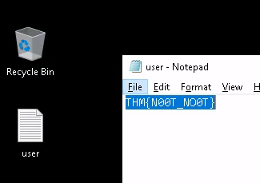
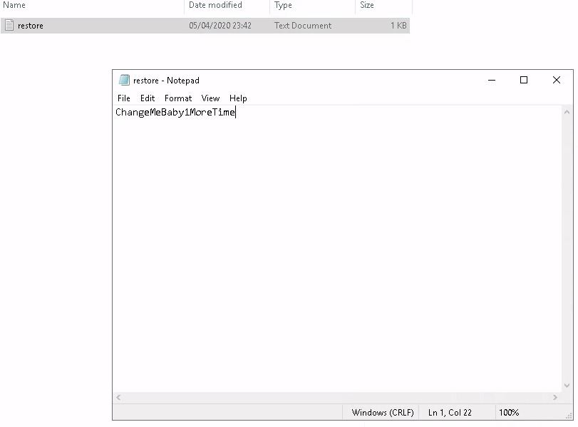
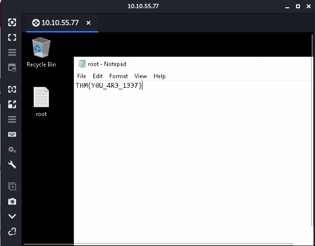

# Anthem

Exploit a Windows machine in this beginner level challenge.

[Anthem](https://tryhackme.com/room/anthem)

## Topic's

- Network Enumeration
- Web Poking
- OSINT
- Security Misconfiguration
- Backup Poking

## Appendix archive

Password: `1 kn0w 1 5h0uldn'7!`

## Website Analysis

This task involves you, paying attention to details and finding the 'keys to the castle'.

This room is designed for beginners, however, everyone is welcomed to try it out!

Enjoy the Anthem.

In this room, you don't need to brute force any login page. Just your preferred browser and Remote Desktop.

Please give the box up to 5 minutes to boot and configure.

1. Let's run nmap and check what ports are open.

`No answer needed`

2. What port is for the web server?

```
kali@kali:~/CTFs/tryhackme/Anthem$ sudo nmap -sC -sV -p- 10.10.247.201
[sudo] password for kali:
Starting Nmap 7.80 ( https://nmap.org ) at 2020-10-05 10:53 CEST
Nmap scan report for 10.10.247.201
Host is up (0.033s latency).
Not shown: 65521 closed ports
PORT      STATE SERVICE       VERSION
80/tcp    open  http          Microsoft HTTPAPI httpd 2.0 (SSDP/UPnP)
135/tcp   open  msrpc         Microsoft Windows RPC
139/tcp   open  netbios-ssn   Microsoft Windows netbios-ssn
445/tcp   open  microsoft-ds?
3389/tcp  open  ms-wbt-server Microsoft Terminal Services
| rdp-ntlm-info:
|   Target_Name: WIN-LU09299160F
|   NetBIOS_Domain_Name: WIN-LU09299160F
|   NetBIOS_Computer_Name: WIN-LU09299160F
|   DNS_Domain_Name: WIN-LU09299160F
|   DNS_Computer_Name: WIN-LU09299160F
|   Product_Version: 10.0.17763
|_  System_Time: 2020-10-05T08:55:48+00:00
| ssl-cert: Subject: commonName=WIN-LU09299160F
| Not valid before: 2020-10-04T08:53:12
|_Not valid after:  2021-04-05T08:53:12
|_ssl-date: 2020-10-05T08:56:39+00:00; +1s from scanner time.
5985/tcp  open  http          Microsoft HTTPAPI httpd 2.0 (SSDP/UPnP)
|_http-server-header: Microsoft-HTTPAPI/2.0
|_http-title: Not Found
47001/tcp open  http          Microsoft HTTPAPI httpd 2.0 (SSDP/UPnP)
|_http-server-header: Microsoft-HTTPAPI/2.0
|_http-title: Not Found
49664/tcp open  msrpc         Microsoft Windows RPC
49665/tcp open  msrpc         Microsoft Windows RPC
49666/tcp open  msrpc         Microsoft Windows RPC
49667/tcp open  msrpc         Microsoft Windows RPC
49669/tcp open  msrpc         Microsoft Windows RPC
49670/tcp open  msrpc         Microsoft Windows RPC
49671/tcp open  msrpc         Microsoft Windows RPC
Service Info: OS: Windows; CPE: cpe:/o:microsoft:windows

Host script results:
| smb2-security-mode:
|   2.02:
|_    Message signing enabled but not required
| smb2-time:
|   date: 2020-10-05T08:55:49
|_  start_date: N/A

Service detection performed. Please report any incorrect results at https://nmap.org/submit/ .
Nmap done: 1 IP address (1 host up) scanned in 164.41 seconds
```

`80`

4. What port is for remote desktop service?

`3389`

5. What is a possible password in one of the pages web crawlers check for?

- [http://10.10.247.201/robots.txt](http://10.10.247.201/robots.txt)

```
UmbracoIsTheBest!

# Use for all search robots
User-agent: *

# Define the directories not to crawl
Disallow: /bin/
Disallow: /config/
Disallow: /umbraco/
Disallow: /umbraco_client/
```

`UmbracoIsTheBest!`

6. What CMS is the website using?

`umbraco`

1. What is the domain of the website?


`Anthem.com`

8. What's the name of the Administrator

- [A cheers to our IT department](http://10.10.247.201/archive/a-cheers-to-our-it-department/)


`Solomon Grundy`

9.  Can we find find the email address of the administrator?

- [We are hiring](http://10.10.247.201/archive/we-are-hiring/)


`Solomon Grundy`

`sg@anthem.com`

## Spot the flags

Our beloved admin left some flags behind that we require to gather before we proceed to the next task..

1. What is flag 1?

- [view-source:http://10.10.247.201/archive/we-are-hiring/](view-source:http://10.10.247.201/archive/we-are-hiring/)

```html
<meta content="THM{L0L_WH0_US3S_M3T4}" property="og:description" />
```

`THM{L0L_WH0_US3S_M3T4}`

2. What is flag 2?

- [view-source:http://10.10.247.201/blog/](view-source:http://10.10.247.201/blog/)

```html
<form method="get" action="/blog/search">
  <input type="text" name="term" placeholder="Search... 								THM{G!T_G00D}" />
  <button type="submit" class="fa fa-search fa"></button>
</form>
```

`THM{G!T_G00D}`

3. What is flag 3?

- [http://10.10.55.77/authors/jane-doe/](http://10.10.55.77/authors/jane-doe/)

`THM{L0L_WH0_D15}`

4. What is flag 4?

- [view-source:http://10.10.247.201/archive/a-cheers-to-our-it-department/](view-source:http://10.10.247.201/archive/a-cheers-to-our-it-department/)

```html
<meta content="THM{AN0TH3R_M3TA}" property="og:description" />
```

`THM{AN0TH3R_M3TA}`

## Final stage

Let's get into the box using the intel we gathered.

1. Let's figure out the username and password to log in to the box.(The box is not on a domain)

`No answer needed`

2. Gain initial access to the machine, what is the contents of user.txt?



`THM{N00T_NO0T}`

3. Can we spot the admin password?




`ChangeMeBaby1MoreTime`

4. Escalate your privileges to root, what is the contents of root.txt?



`THM{Y0U_4R3_1337}`
