# Biohazard

A CTF room based on the old-time survival horror game, Resident Evil. Can you survive until the end?

[Biohazard](https://tryhackme.com/room/biohazard)

## Topic's

- Network Enumeration
- Web Poking
- Cryptography
  - Base64
  - Base32
  - Vigenère
  - ROT13
  - Base58
  - Binary
  - Hex
- FTP Enumeration
- Steganography
- Stored Passwords & Keys

## Appendix archive

Password: `1 kn0w 1 5h0uldn'7!`

## Introduction

Welcome to Biohazard room, a puzzle-style CTF. Collecting the item, solving the puzzle and escaping the nightmare is your top priority. Can you survive until the end?

If you have any question, do not hesitate to DM me on the discord channel.

1. Deploy the machine and start the nightmare

`No answer needed`

2. How many open ports?

```
kali@kali:~/CTFs/tryhackme/Biohazard$ sudo nmap -A -p- -sS -sC -sV 10.10.55.102
[sudo] password for kali:
Starting Nmap 7.80 ( https://nmap.org ) at 2020-10-04 01:35 CEST
Nmap scan report for 10.10.55.102
Host is up (0.031s latency).
Not shown: 65532 closed ports
PORT   STATE SERVICE VERSION
21/tcp open  ftp     vsftpd 3.0.3
22/tcp open  ssh     OpenSSH 7.6p1 Ubuntu 4ubuntu0.3 (Ubuntu Linux; protocol 2.0)
| ssh-hostkey:
|   2048 c9:03:aa:aa:ea:a9:f1:f4:09:79:c0:47:41:16:f1:9b (RSA)
|   256 2e:1d:83:11:65:03:b4:78:e9:6d:94:d1:3b:db:f4:d6 (ECDSA)
|_  256 91:3d:e4:4f:ab:aa:e2:9e:44:af:d3:57:86:70:bc:39 (ED25519)
80/tcp open  http    Apache httpd 2.4.29 ((Ubuntu))
|_http-server-header: Apache/2.4.29 (Ubuntu)
|_http-title: Beginning of the end
No exact OS matches for host (If you know what OS is running on it, see https://nmap.org/submit/ ).
TCP/IP fingerprint:
OS:SCAN(V=7.80%E=4%D=10/4%OT=21%CT=1%CU=42835%PV=Y%DS=2%DC=T%G=Y%TM=5F790AF
OS:F%P=x86_64-pc-linux-gnu)SEQ(SP=107%GCD=1%ISR=10C%TI=Z%CI=I%II=I%TS=A)OPS
OS:(O1=M508ST11NW6%O2=M508ST11NW6%O3=M508NNT11NW6%O4=M508ST11NW6%O5=M508ST1
OS:1NW6%O6=M508ST11)WIN(W1=68DF%W2=68DF%W3=68DF%W4=68DF%W5=68DF%W6=68DF)ECN
OS:(R=Y%DF=Y%T=40%W=6903%O=M508NNSNW6%CC=Y%Q=)T1(R=Y%DF=Y%T=40%S=O%A=S+%F=A
OS:S%RD=0%Q=)T2(R=N)T3(R=N)T4(R=Y%DF=Y%T=40%W=0%S=A%A=Z%F=R%O=%RD=0%Q=)T5(R
OS:=Y%DF=Y%T=40%W=0%S=Z%A=S+%F=AR%O=%RD=0%Q=)T6(R=Y%DF=Y%T=40%W=0%S=A%A=Z%F
OS:=R%O=%RD=0%Q=)T7(R=Y%DF=Y%T=40%W=0%S=Z%A=S+%F=AR%O=%RD=0%Q=)U1(R=Y%DF=N%
OS:T=40%IPL=164%UN=0%RIPL=G%RID=G%RIPCK=G%RUCK=G%RUD=G)IE(R=Y%DFI=N%T=40%CD
OS:=S)

Network Distance: 2 hops
Service Info: OSs: Unix, Linux; CPE: cpe:/o:linux:linux_kernel

TRACEROUTE (using port 3389/tcp)
HOP RTT      ADDRESS
1   31.10 ms 10.8.0.1
2   31.22 ms 10.10.55.102

OS and Service detection performed. Please report any incorrect results at https://nmap.org/submit/ .
Nmap done: 1 IP address (1 host up) scanned in 74.59 seconds
```

`3`

3. What is the team name in operation

- [The nightmare begin](http://10.10.55.102/)

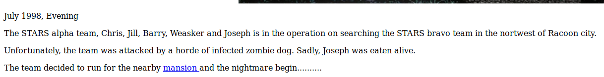

`STARS alpha team`

## The Mansion

Collect all necessary items and advanced to the next level. The format of the Item flag:

**Item_name{32 character}**

Some of the doors are locked. Use the item flag to unlock the door.

Tips: It is better to record down all the information inside a notepad

---

### Main hall

- [Main hall](http://10.10.55.102/mansionmain/)


```html
<!doctype html>
        <head>
                <title>Main hall</title>
                <h1 align="center">Main hall</h1>
        </head>

        <body>
        

        <p>The team reach the mansion safe and sound. However, it appear that Chris is missing</p>
    <p>Jill try to open the door but stopped by Weasker</p>
        <p>Suddenly, a gunshot can be heard in the nearby room. Weaker order Jill to make an investigate on the gunshot. Where is the room?</p>
    <!-- It is in the /diningRoom/ -->
        </body>

</html>
```

### Dining room

- [Dining room](http://10.10.55.102/diningRoom/)
- [Dining room - Source](view-source:http://10.10.55.102/diningRoom/)

```html
<html>
  <head>
    <title>Dining room</title>
    <h1 align="center">Dining room</h1>
  </head>

  <body>
    

    <p>After reaching the room, Jill and Barry started their investigation</p>
    <p>
      Blood stein can be found near the fireplace. Hope it is not belong to
      Chris.
    </p>
    <p>
      After a short investigation with barry, Jill can't find any empty shell.
      Maybe another room?
    </p>
    <!-- SG93IGFib3V0IHRoZSAvdGVhUm9vbS8= -->
  </body>

  <p>
    <b>There is an emblem on the wall, will you take it? </b
    ><a href="emblem.php">YES</a>
  </p>
</html>
```

- [Dining room - emblem](http://10.10.55.102/diningRoom/emblem.php)

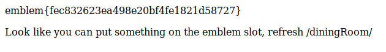

```
emblem{fec832623ea498e20bf4fe1821d58727}

Look like you can put something on the emblem slot, refresh /diningRoom/
```

```
kali@kali:~/CTFs/tryhackme/Biohazard$ echo 'SG93IGFib3V0IHRoZSAvdGVhUm9vbS8=' | base64 -d
How about the /teaRoom/
```

### Tea Room

- [Tea Room](http://10.10.55.102/teaRoom/)

### Art room

- [Art room](http://10.10.55.102/artRoom/)
- [MansionMap](http://10.10.55.102/artRoom/MansionMap.html)

**Look like a map**

**Location:**

- `/diningRoom/`
- `/teaRoom/`
- `/artRoom/`
- `/barRoom/`
- `/diningRoom2F/`
- `/tigerStatusRoom/`
- `/galleryRoom/`
- `/studyRoom/`
- `/armorRoom/`
- `/attic/`

```
echo '/diningRoom/
> /teaRoom/
> /artRoom/
> /barRoom/
> /diningRoom2F/
> /tigerStatusRoom/
> /galleryRoom/
> /studyRoom/
> /armorRoom/
> /attic/' > MansionMap.txt
```

`for i in $(cat MansionMap.txt); do curl -s http://10.10.55.102$i && echo -e '---------------------------------------\n'; done > MansionMap.html`

### Bar room entrance

- [Bar room entrance](http://10.10.55.102/barRoom/)

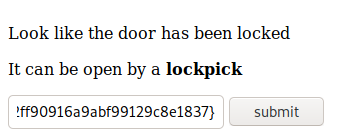

### Bar room

- [Bar room](http://10.10.55.102/barRoom357162e3db904857963e6e0b64b96ba7/)
- [Look like a music note](http://10.10.55.102/barRoom357162e3db904857963e6e0b64b96ba7/musicNote.html)

`NV2XG2LDL5ZWQZLFOR5TGNRSMQ3TEZDFMFTDMNLGGVRGIYZWGNSGCZLDMU3GCMLGGY3TMZL5`

```
kali@kali:~/CTFs/tryhackme/Biohazard$ echo 'NV2XG2LDL5ZWQZLFOR5TGNRSMQ3TEZDFMFTDMNLGGVRGIYZWGNSGCZLDMU3GCMLGGY3TMZL5' | base32 -d
music_sheet{362d72deaf65f5bdc63daece6a1f676e}
```

`music_sheet{362d72deaf65f5bdc63daece6a1f676e}`

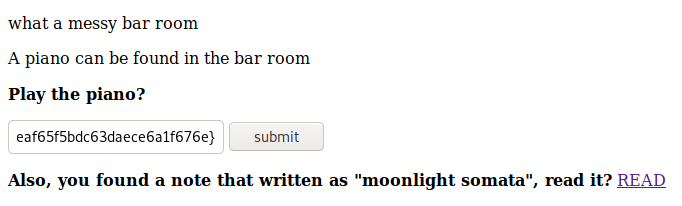

- [Secret bar room](http://10.10.55.102/barRoom357162e3db904857963e6e0b64b96ba7/barRoomHidden.php)
- [gold_emblem](http://10.10.55.102/barRoom357162e3db904857963e6e0b64b96ba7/gold_emblem.php)

```
gold_emblem{58a8c41a9d08b8a4e38d02a4d7ff4843}

Look like you can put something on the emblem slot, refresh the previous page
```

- [rebecca](http://10.10.55.102/barRoom357162e3db904857963e6e0b64b96ba7/emblem_slot.php)

`rebecca`

### Dining room

- [Dining room](http://10.10.55.102/diningRoom/)

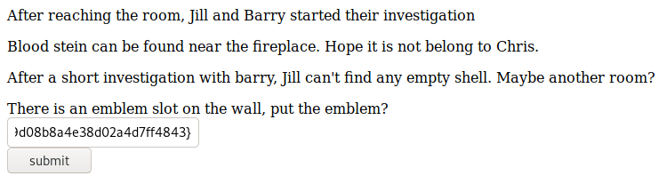

- [emblem_slot](http://10.10.55.102/diningRoom/emblem_slot.php)

`klfvg ks r wimgnd biz mpuiui ulg fiemok tqod. Xii jvmc tbkg ks tempgf tyi_hvgct_jljinf_kvc`


- [Vigenere Tool](https://www.boxentriq.com/code-breaking/vigenere-cipher)

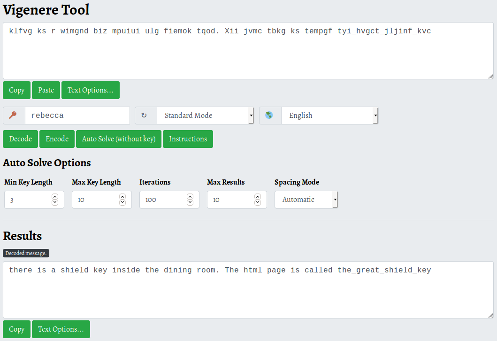

> there is a shield key inside the dining room. The html page is called the_great_shield_key

- [http://10.10.55.102/diningRoom/the_great_shield_key.html](http://10.10.55.102/diningRoom/the_great_shield_key.html)

`shield_key{48a7a9227cd7eb89f0a062590798cbac}`

### Dining room 2F

- [Dining room 2F](http://10.10.55.102/diningRoom2F/)
- [view-source:http://10.10.55.102/diningRoom2F/](view-source:http://10.10.55.102/diningRoom2F/)

```html
<html>
  <head>
    <title>Dining room 2F</title>
    <h1 align="center">Dining room 2F</h1>
  </head>

  <body>
    

    <p>
      Once Jill reach the room, she saw a tall status with a shiining blue gem
      on top of it. However, she can't reach it
    </p>
    <!-- Lbh trg gur oyhr trz ol chfuvat gur fgnghf gb gur ybjre sybbe. Gur trz vf ba gur qvavatEbbz svefg sybbe. Ivfvg fnccuver.ugzy -->
  </body>
</html>
```

`Lbh trg gur oyhr trz ol chfuvat gur fgnghf gb gur ybjre sybbe. Gur trz vf ba gur qvavatEbbz svefg sybbe. Ivfvg fnccuver.ugzy`

```
kali@kali:~/CTFs/tryhackme/Biohazard$ echo "Lbh trg gur oyhr trz ol chfuvat gur fgnghf gb gur ybjre sybbe. Gur trz vf ba gur qvavatEbbz svefg sybbe. Ivfvg fnccuver.ugzy" | tr '[A-Za-z]' '[N-ZA-Mn-za-m]'
You get the blue gem by pushing the status to the lower floor. The gem is on the diningRoom first floor. Visit sapphire.html
```

`You get the blue gem by pushing the status to the lower floor. The gem is on the diningRoom first floor. Visit sapphire.html`

- [http://10.10.55.102/diningRoom/sapphire.html](http://10.10.55.102/diningRoom/sapphire.html)

`blue_jewel{e1d457e96cac640f863ec7bc475d48aa}`

### Tiger status room

- [Tiger status room](http://10.10.55.102/tigerStatusRoom/)
- [http://10.10.55.102/tigerStatusRoom/gem.php](http://10.10.55.102/tigerStatusRoom/gem.php)

```
crest 1:
S0pXRkVVS0pKQkxIVVdTWUpFM0VTUlk9
Hint 1: Crest 1 has been encoded twice
Hint 2: Crest 1 contanis 14 letters
Note: You need to collect all 4 crests, combine and decode to reavel another path
The combination should be crest 1 + crest 2 + crest 3 + crest 4. Also, the combination is a type of encoded base and you need to decode it
```

```
kali@kali:~/CTFs/tryhackme/Biohazard$ echo 'S0pXRkVVS0pKQkxIVVdTWUpFM0VTUlk9' | base64 -d | base32 -d
RlRQIHVzZXI6IG
```

### Gallerty

- [Gallerty](http://10.10.55.102/galleryRoom/)
- [http://10.10.55.102/galleryRoom/note.txt](http://10.10.55.102/galleryRoom/note.txt)

```
crest 2:
GVFWK5KHK5WTGTCILE4DKY3DNN4GQQRTM5AVCTKE
Hint 1: Crest 2 has been encoded twice
Hint 2: Crest 2 contanis 18 letters
Note: You need to collect all 4 crests, combine and decode to reavel another path
The combination should be crest 1 + crest 2 + crest 3 + crest 4. Also, the combination is a type of encoded base and you need to decode it
```

```
kali@kali:~/CTFs/tryhackme/Biohazard$ echo 'GVFWK5KHK5WTGTCILE4DKY3DNN4GQQRTM5AVCTKE' | base32 -d | base58 -d
h1bnRlciwgRlRQIHBh
```

### Study room entrance

- [Study room entrance](http://10.10.55.102/studyRoom/)

### Armor room entrance

- [Armor room entrance](http://10.10.55.102/armorRoom/)

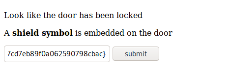

### Armor room

- [Armor room](http://10.10.55.102/armorRoom547845982c18936a25a9b37096b21fc1/)
- [http://10.10.55.102/armorRoom547845982c18936a25a9b37096b21fc1/note.txt](http://10.10.55.102/armorRoom547845982c18936a25a9b37096b21fc1/note.txt)

```
crest 3:
MDAxMTAxMTAgMDAxMTAwMTEgMDAxMDAwMDAgMDAxMTAwMTEgMDAxMTAwMTEgMDAxMDAwMDAgMDAxMTAxMDAgMDExMDAxMDAgMDAxMDAwMDAgMDAxMTAwMTEgMDAxMTAxMTAgMDAxMDAwMDAgMDAxMTAxMDAgMDAxMTEwMDEgMDAxMDAwMDAgMDAxMTAxMDAgMDAxMTEwMDAgMDAxMDAwMDAgMDAxMTAxMTAgMDExMDAwMTEgMDAxMDAwMDAgMDAxMTAxMTEgMDAxMTAxMTAgMDAxMDAwMDAgMDAxMTAxMTAgMDAxMTAxMDAgMDAxMDAwMDAgMDAxMTAxMDEgMDAxMTAxMTAgMDAxMDAwMDAgMDAxMTAwMTEgMDAxMTEwMDEgMDAxMDAwMDAgMDAxMTAxMTAgMDExMDAwMDEgMDAxMDAwMDAgMDAxMTAxMDEgMDAxMTEwMDEgMDAxMDAwMDAgMDAxMTAxMDEgMDAxMTAxMTEgMDAxMDAwMDAgMDAxMTAwMTEgMDAxMTAxMDEgMDAxMDAwMDAgMDAxMTAwMTEgMDAxMTAwMDAgMDAxMDAwMDAgMDAxMTAxMDEgMDAxMTEwMDAgMDAxMDAwMDAgMDAxMTAwMTEgMDAxMTAwMTAgMDAxMDAwMDAgMDAxMTAxMTAgMDAxMTEwMDA=
Hint 1: Crest 3 has been encoded three times
Hint 2: Crest 3 contanis 19 letters
Note: You need to collect all 4 crests, combine and decode to reavel another path
The combination should be crest 1 + crest 2 + crest 3 + crest 4. Also, the combination is a type of encoded base and you need to decode it
```

```
kali@kali:~/CTFs/tryhackme/Biohazard$ echo 'MDAxMTAxMTAgMDAxMTAwMTEgMDAxMDAwMDAgMDAxMTAwMTEgMDAxMTAwMTEgMDAxMDAwMDAgMDAxMTAxMDAgMDExMDAxMDAgMDAxMDAwMDAgMDAxMTAwMTEgMDAxMTAxMTAgMDAxMDAwMDAgMDAxMTAxMDAgMDAxMTEwMDEgMDAxMDAwMDAgMDAxMTAxMDAgMDAxMTEwMDAgMDAxMDAwMDAgMDAxMTAxMTAgMDExMDAwMTEgMDAxMDAwMDAgMDAxMTAxMTEgMDAxMTAxMTAgMDAxMDAwMDAgMDAxMTAxMTAgMDAxMTAxMDAgMDAxMDAwMDAgMDAxMTAxMDEgMDAxMTAxMTAgMDAxMDAwMDAgMDAxMTAwMTEgMDAxMTEwMDEgMDAxMDAwMDAgMDAxMTAxMTAgMDExMDAwMDEgMDAxMDAwMDAgMDAxMTAxMDEgMDAxMTEwMDEgMDAxMDAwMDAgMDAxMTAxMDEgMDAxMTAxMTEgMDAxMDAwMDAgMDAxMTAwMTEgMDAxMTAxMDEgMDAxMDAwMDAgMDAxMTAwMTEgMDAxMTAwMDAgMDAxMDAwMDAgMDAxMTAxMDEgMDAxMTEwMDAgMDAxMDAwMDAgMDAxMTAwMTEgMDAxMTAwMTAgMDAxMDAwMDAgMDAxMTAxMTAgMDAxMTEwMDA=' | base64 -d
00110110 00110011 00100000 00110011 00110011 00100000 00110100 01100100 00100000 00110011 00110110 00100000 00110100 00111001 00100000 00110100 00111000 00100000 00110110 01100011 00100000 00110111 00110110 00100000 00110110 00110100 00100000 00110101 00110110 00100000 00110011 00111001 00100000 00110110 01100001 00100000 00110101 00111001 00100000 00110101 00110111 00100000 00110011 00110101 00100000 00110011 00110000 00100000 00110101 00111000 00100000 00110011 00110010 00100000 00110110 00111000
```

- [Binary to Text Translator](https://www.rapidtables.com/convert/number/binary-to-ascii.html)

`63 33 4d 36 49 48 6c 76 64 56 39 6a 59 57 35 30 58 32 68`

- [Hex to ASCII Text Converter](https://www.rapidtables.com/convert/number/hex-to-ascii.html)

`c3M6IHlvdV9jYW50X2h`

### Attic entrance

- [Attic entrance](http://10.10.55.102/attic/)

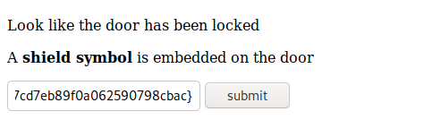

- [http://10.10.55.102/attic909447f184afdfb352af8b8a25ffff1d/](http://10.10.55.102/attic909447f184afdfb352af8b8a25ffff1d/)
- [http://10.10.55.102/attic909447f184afdfb352af8b8a25ffff1d/note.txt](http://10.10.55.102/attic909447f184afdfb352af8b8a25ffff1d/note.txt)

```
crest 4:
gSUERauVpvKzRpyPpuYz66JDmRTbJubaoArM6CAQsnVwte6zF9J4GGYyun3k5qM9ma4s
Hint 1: Crest 2 has been encoded twice
Hint 2: Crest 2 contanis 17 characters
Note: You need to collect all 4 crests, combine and decode to reavel another path
The combination should be crest 1 + crest 2 + crest 3 + crest 4. Also, the combination is a type of encoded base and you need to decode it
```

```
kali@kali:~/CTFs/tryhackme/Biohazard$ echo 'gSUERauVpvKzRpyPpuYz66JDmRTbJubaoArM6CAQsnVwte6zF9J4GGYyun3k5qM9ma4s' | base58 -d
70 5a 47 56 66 5a 6d 39 79 5a 58 5a 6c 63 67 3d 3d
```

`70 5a 47 56 66 5a 6d 39 79 5a 58 5a 6c 63 67 3d 3d`

- [Hex to ASCII Text Converter](https://www.rapidtables.com/convert/number/hex-to-ascii.html)

`pZGVfZm9yZXZlcg==`

- crest 1: `RlRQIHVzZXI6IG`
- crest 2: `h1bnRlciwgRlRQIHBh`
- crest 3: `c3M6IHlvdV9jYW50X2h`
- crest 4: `pZGVfZm9yZXZlcg==`
- `RlRQIHVzZXI6IGh1bnRlciwgRlRQIHBhc3M6IHlvdV9jYW50X2hpZGVfZm9yZXZlcg==`

```
kali@kali:~/CTFs/tryhackme/Biohazard$ echo 'RlRQIHVzZXI6IGh1bnRlciwgRlRQIHBhc3M6IHlvdV9jYW50X2hpZGVfZm9yZXZlcg==' | base64 -d
FTP user: hunter, FTP pass: you_cant_hide_forever
```

---

1. What is the emblem flag

- [http://10.10.55.102/diningRoom/emblem.php](http://10.10.55.102/diningRoom/emblem.php)

`emblem{fec832623ea498e20bf4fe1821d58727}`

2. What is the lock pick flag

- [http://10.10.55.102/teaRoom/master_of_unlock.html](http://10.10.55.102/teaRoom/master_of_unlock.html)

`lock_pick{037b35e2ff90916a9abf99129c8e1837}`

3. What is the music sheet flag

- [http://10.10.55.102/barRoom357162e3db904857963e6e0b64b96ba7/musicNote.html](http://10.10.55.102/barRoom357162e3db904857963e6e0b64b96ba7/musicNote.html)

`music_sheet{362d72deaf65f5bdc63daece6a1f676e}`

4. What is the gold emblem flag

- [http://10.10.55.102/barRoom357162e3db904857963e6e0b64b96ba7/gold_emblem.php](http://10.10.55.102/barRoom357162e3db904857963e6e0b64b96ba7/gold_emblem.php)

`gold_emblem{58a8c41a9d08b8a4e38d02a4d7ff4843}`

5. What is the shield key flag

- [http://10.10.55.102/diningRoom/the_great_shield_key.html](http://10.10.55.102/diningRoom/the_great_shield_key.html)

`shield_key{48a7a9227cd7eb89f0a062590798cbac}`

6. What is the blue gem flag

- [http://10.10.55.102/diningRoom/sapphire.html](http://10.10.55.102/diningRoom/sapphire.html)

`blue_jewel{e1d457e96cac640f863ec7bc475d48aa}`

7. What is the FTP username

`hunter`

8. What is the FTP password

`you_cant_hide_forever`

## The guard house

After gaining access to the FTP server, you need to solve another puzzle.

1. Where is the hidden directory mentioned by Barry

```
kali@kali:~/CTFs/tryhackme/Biohazard$ ftp 10.10.55.102
Connected to 10.10.55.102.
220 (vsFTPd 3.0.3)
Name (10.10.55.102:kali): hunter
331 Please specify the password.
Password:
230 Login successful.
Remote system type is UNIX.
Using binary mode to transfer files.
ftp> mget *
mget 001-key.jpg?
200 PORT command successful. Consider using PASV.
150 Opening BINARY mode data connection for 001-key.jpg (7994 bytes).
226 Transfer complete.
7994 bytes received in 0.00 secs (110.4880 MB/s)
mget 002-key.jpg?
200 PORT command successful. Consider using PASV.
150 Opening BINARY mode data connection for 002-key.jpg (2210 bytes).
226 Transfer complete.
2210 bytes received in 0.00 secs (1.6414 MB/s)
mget 003-key.jpg?
200 PORT command successful. Consider using PASV.
150 Opening BINARY mode data connection for 003-key.jpg (2146 bytes).
226 Transfer complete.
2146 bytes received in 0.00 secs (2.0569 MB/s)
mget helmet_key.txt.gpg?
200 PORT command successful. Consider using PASV.
150 Opening BINARY mode data connection for helmet_key.txt.gpg (121 bytes).
226 Transfer complete.
121 bytes received in 0.07 secs (1.7105 kB/s)
mget important.txt?
200 PORT command successful. Consider using PASV.
150 Opening BINARY mode data connection for important.txt (170 bytes).
226 Transfer complete.
170 bytes received in 0.00 secs (3.5244 MB/s)
ftp>
```

```
kali@kali:~/CTFs/tryhackme/Biohazard$ cat important.txt
Jill,

I think the helmet key is inside the text file, but I have no clue on decrypting stuff. Also, I come across a /hidden_closet/ door but it was locked.

From,
Barry
```

### 001-key.jpg

```
kali@kali:~/CTFs/tryhackme/Biohazard$ steghide extract -sf 001-key.jpg
Enter passphrase:
wrote extracted data to "key-001.txt".
kali@kali:~/CTFs/tryhackme/Biohazard$ cat key-001.txt
cGxhbnQ0Ml9jYW
```

`cGxhbnQ0Ml9jYW`

### 002-key.jpg

```
kali@kali:~/CTFs/tryhackme/Biohazard$ exiftool 002-key.jpg
ExifTool Version Number         : 12.06
File Name                       : 002-key.jpg
Directory                       : .
File Size                       : 2.2 kB
File Modification Date/Time     : 2020:10:04 03:35:03+02:00
File Access Date/Time           : 2020:10:04 03:35:44+02:00
File Inode Change Date/Time     : 2020:10:04 03:35:03+02:00
File Permissions                : rw-r--r--
File Type                       : JPEG
File Type Extension             : jpg
MIME Type                       : image/jpeg
JFIF Version                    : 1.01
Resolution Unit                 : None
X Resolution                    : 1
Y Resolution                    : 1
Comment                         : 5fYmVfZGVzdHJveV9
Image Width                     : 100
Image Height                    : 80
Encoding Process                : Progressive DCT, Huffman coding
Bits Per Sample                 : 8
Color Components                : 3
Y Cb Cr Sub Sampling            : YCbCr4:2:0 (2 2)
Image Size                      : 100x80
Megapixels                      : 0.008
```

`5fYmVfZGVzdHJveV9`

### 003-key.jpg

```
kali@kali:~/CTFs/tryhackme/Biohazard$ exiftool 003-key.jpg
ExifTool Version Number         : 12.06
File Name                       : 003-key.jpg
Directory                       : .
File Size                       : 2.1 kB
File Modification Date/Time     : 2020:10:04 03:35:04+02:00
File Access Date/Time           : 2020:10:04 03:35:46+02:00
File Inode Change Date/Time     : 2020:10:04 03:35:04+02:00
File Permissions                : rw-r--r--
File Type                       : JPEG
File Type Extension             : jpg
MIME Type                       : image/jpeg
JFIF Version                    : 1.01
Resolution Unit                 : None
X Resolution                    : 1
Y Resolution                    : 1
Comment                         : Compressed by jpeg-recompress
Image Width                     : 100
Image Height                    : 80
Encoding Process                : Progressive DCT, Huffman coding
Bits Per Sample                 : 8
Color Components                : 3
Y Cb Cr Sub Sampling            : YCbCr4:2:0 (2 2)
Image Size                      : 100x80
Megapixels                      : 0.008
```

```
kali@kali:~/CTFs/tryhackme/Biohazard$ binwalk 003-key.jpg -e

DECIMAL       HEXADECIMAL     DESCRIPTION
--------------------------------------------------------------------------------
0             0x0             JPEG image data, JFIF standard 1.01
1930          0x78A           Zip archive data, at least v2.0 to extract, uncompressed size: 14, name: key-003.txt
2124          0x84C           End of Zip archive, footer length: 22
```

```
kali@kali:~/CTFs/tryhackme/Biohazard$ cat key-003.txt
3aXRoX3Zqb2x0
```

`3aXRoX3Zqb2x0`

`cGxhbnQ0Ml9jYW5fYmVfZGVzdHJveV93aXRoX3Zqb2x0`

```
kali@kali:~/CTFs/tryhackme/Biohazard$ echo -n 'cGxhbnQ0Ml9jYW5fYmVfZGVzdHJveV93aXRoX3Zqb2x0' | base64 -d
plant42_can_be_destroy_with_vjolt
```

2. Password for the encrypted file

`plant42_can_be_destroy_with_vjolt`

3. What is the helmet key flag

```
kali@kali:~/CTFs/tryhackme/Biohazard$ cat helmet_key.txt
helmet_key{458493193501d2b94bbab2e727f8db4b}
```

`helmet_key{458493193501d2b94bbab2e727f8db4b}`

### Study room entrance

- [Study room entrance](http://10.10.55.102/studyRoom/)

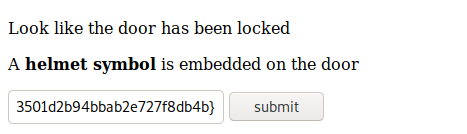

- [Study room](http://10.10.55.102/studyRoom28341c5e98c93b89258a6389fd608a3c/)

```
kali@kali:~/CTFs/tryhackme/Biohazard$ tar xfvz doom.tar.gz
eagle_medal.txt

kali@kali:~/CTFs/tryhackme/Biohazard$ cat eagle_medal.txt
SSH user: umbrella_guest
```

### Closet room entrance

`/hidden_closet/`

- [Closet room entrance](http://10.10.55.102/hidden_closet/)

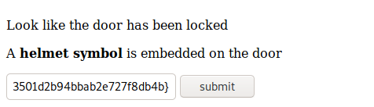

- [Closet room](http://10.10.55.102/hiddenCloset8997e740cb7f5cece994381b9477ec38/)

- [http://10.10.55.102/hiddenCloset8997e740cb7f5cece994381b9477ec38/wolf_medal.txt](http://10.10.55.102/hiddenCloset8997e740cb7f5cece994381b9477ec38/wolf_medal.txt)

`SSH password: T_virus_rules`

## The Revisit

Done with the puzzle? There are places you have explored before but yet to access.

1. What is the SSH login username

`umbrella_guest`

2. What is the SSH login password

`T_virus_rules`

3. Who the STARS bravo team leader

- [Closet room](http://10.10.55.102/hiddenCloset8997e740cb7f5cece994381b9477ec38/)

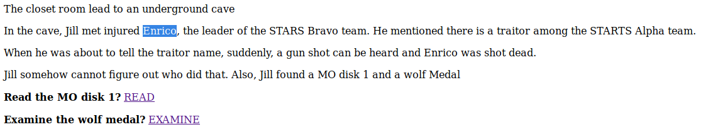

`Enrico`

## Underground laboratory

Time for the final showdown. Can you escape the nightmare?

```
umbrella_guest@umbrella_corp:~$ ls -la
total 64
drwxr-xr-x  8 umbrella_guest umbrella 4096 Sep 20  2019 .
drwxr-xr-x  5 root           root     4096 Sep 20  2019 ..
-rw-r--r--  1 umbrella_guest umbrella  220 Sep 19  2019 .bash_logout
-rw-r--r--  1 umbrella_guest umbrella 3771 Sep 19  2019 .bashrc
drwxrwxr-x  6 umbrella_guest umbrella 4096 Sep 20  2019 .cache
drwxr-xr-x 11 umbrella_guest umbrella 4096 Sep 19  2019 .config
-rw-r--r--  1 umbrella_guest umbrella   26 Sep 19  2019 .dmrc
drwx------  3 umbrella_guest umbrella 4096 Sep 19  2019 .gnupg
-rw-------  1 umbrella_guest umbrella  346 Sep 19  2019 .ICEauthority
drwxr-xr-x  2 umbrella_guest umbrella 4096 Sep 20  2019 .jailcell
drwxr-xr-x  3 umbrella_guest umbrella 4096 Sep 19  2019 .local
-rw-r--r--  1 umbrella_guest umbrella  807 Sep 19  2019 .profile
drwx------  2 umbrella_guest umbrella 4096 Sep 20  2019 .ssh
-rw-------  1 umbrella_guest umbrella  109 Sep 19  2019 .Xauthority
-rw-------  1 umbrella_guest umbrella 7546 Sep 19  2019 .xsession-errors

umbrella_guest@umbrella_corp:~/.jailcell$ ls -la
total 12
drwxr-xr-x 2 umbrella_guest umbrella 4096 Sep 20  2019 .
drwxr-xr-x 8 umbrella_guest umbrella 4096 Sep 20  2019 ..
-rw-r--r-- 1 umbrella_guest umbrella  501 Sep 20  2019 chris.txt

umbrella_guest@umbrella_corp:~/.jailcell$ cat chris.txt
Jill: Chris, is that you?
Chris: Jill, you finally come. I was locked in the Jail cell for a while. It seem that weasker is behind all this.
Jil, What? Weasker? He is the traitor?
Chris: Yes, Jill. Unfortunately, he play us like a damn fiddle.
Jill: Let's get out of here first, I have contact brad for helicopter support.
Chris: Thanks Jill, here, take this MO Disk 2 with you. It look like the key to decipher something.
Jill: Alright, I will deal with him later.
Chris: see ya.

MO disk 2: albert
```

- [Closet room](http://10.10.55.102/hiddenCloset8997e740cb7f5cece994381b9477ec38/)
- [http://10.10.55.102/hiddenCloset8997e740cb7f5cece994381b9477ec38/MO_DISK1.txt](http://10.10.55.102/hiddenCloset8997e740cb7f5cece994381b9477ec38/MO_DISK1.txt)

`MO disk 2: albert`

`wpbwbxr wpkzg pltwnhro, txrks_xfqsxrd_bvv_fy_rvmexa_ajk`

`weasker login password, stars_members_are_my_guinea_pig`

```
weasker@umbrella_corp:/home/umbrella_guest/.jailcell$ cd ~
weasker@umbrella_corp:~$ ls -la
total 80
drwxr-xr-x  9 weasker weasker 4096 Sep 20  2019 .
drwxr-xr-x  5 root    root    4096 Sep 20  2019 ..
-rw-------  1 weasker weasker   18 Sep 20  2019 .bash_history
-rw-r--r--  1 weasker weasker  220 Sep 18  2019 .bash_logout
-rw-r--r--  1 weasker weasker 3771 Sep 18  2019 .bashrc
drwxrwxr-x 10 weasker weasker 4096 Sep 20  2019 .cache
drwxr-xr-x 11 weasker weasker 4096 Sep 20  2019 .config
drwxr-xr-x  2 weasker weasker 4096 Sep 19  2019 Desktop
drwx------  3 weasker weasker 4096 Sep 19  2019 .gnupg
-rw-------  1 weasker weasker  346 Sep 20  2019 .ICEauthority
drwxr-xr-x  3 weasker weasker 4096 Sep 19  2019 .local
drwx------  5 weasker weasker 4096 Sep 19  2019 .mozilla
-rw-r--r--  1 weasker weasker  807 Sep 18  2019 .profile
drwx------  2 weasker weasker 4096 Sep 19  2019 .ssh
-rw-r--r--  1 weasker weasker    0 Sep 20  2019 .sudo_as_admin_successful
-rw-r--r--  1 root    root     534 Sep 20  2019 weasker_note.txt
-rw-------  1 weasker weasker  109 Sep 20  2019 .Xauthority
-rw-------  1 weasker weasker 5548 Sep 20  2019 .xsession-errors
-rw-------  1 weasker weasker 6749 Sep 20  2019 .xsession-errors.old
weasker@umbrella_corp:~$ cat weasker_note.txt
Weaker: Finally, you are here, Jill.
Jill: Weasker! stop it, You are destroying the  mankind.
Weasker: Destroying the mankind? How about creating a 'new' mankind. A world, only the strong can survive.
Jill: This is insane.
Weasker: Let me show you the ultimate lifeform, the Tyrant.

(Tyrant jump out and kill Weasker instantly)
(Jill able to stun the tyrant will a few powerful magnum round)

Alarm: Warning! warning! Self-detruct sequence has been activated. All personal, please evacuate immediately. (Repeat)
Jill: Poor bastard
```

```
weasker@umbrella_corp:~$ sudo su -
[sudo] password for weasker:
root@umbrella_corp:~# ls -la
total 36
drwx------  4 root root 4096 Sep 20  2019 .
drwxr-xr-x 24 root root 4096 Sep 18  2019 ..
-rw-------  1 root root   76 Sep 20  2019 .bash_history
-rw-r--r--  1 root root 3106 Apr  9  2018 .bashrc
drwx------  2 root root 4096 Apr 26  2018 .cache
drwxr-xr-x  3 root root 4096 Sep 19  2019 .local
-rw-r--r--  1 root root  148 Aug 17  2015 .profile
-rw-r--r--  1 root root  493 Sep 20  2019 root.txt
-rw-r--r--  1 root root  207 Sep 19  2019 .wget-hsts
root@umbrella_corp:~# cat root.txt
In the state of emergency, Jill, Barry and Chris are reaching the helipad and awaiting for the helicopter support.

Suddenly, the Tyrant jump out from nowhere. After a tough fight, brad, throw a rocket launcher on the helipad. Without thinking twice, Jill pick up the launcher and fire at the Tyrant.

The Tyrant shredded into pieces and the Mansion was blowed. The survivor able to escape with the helicopter and prepare for their next fight.

The End

flag: 3c5794a00dc56c35f2bf096571edf3bf
root@umbrella_corp:~#
```

1. Where you found Chris

`jailcell`

2. Who is the traitor

`Weasker`

3. The login password for the traitor

`stars_members_are_my_guinea_pig`

4. The name of the ultimate form

> Weasker: Let me show you the ultimate lifeform, the Tyrant.

`Tyrant`

5. The root flag

`3c5794a00dc56c35f2bf096571edf3bf`
