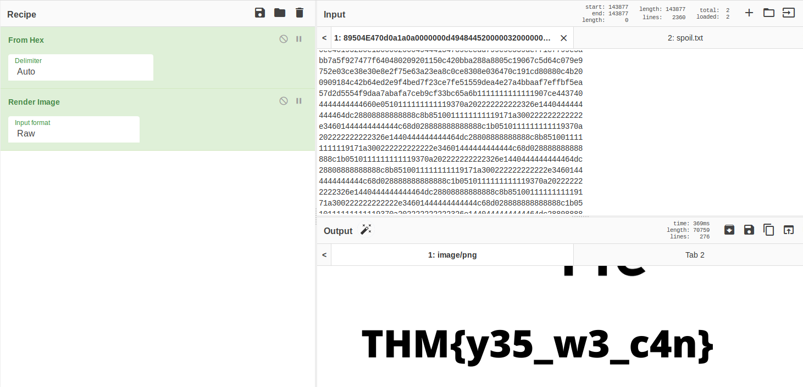
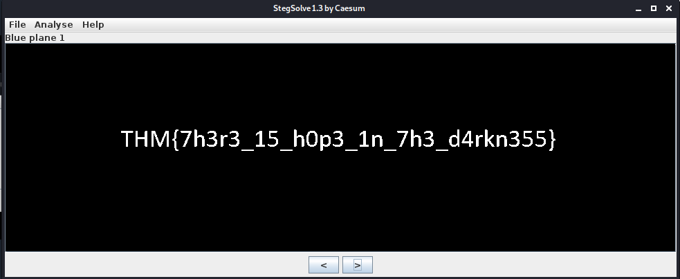
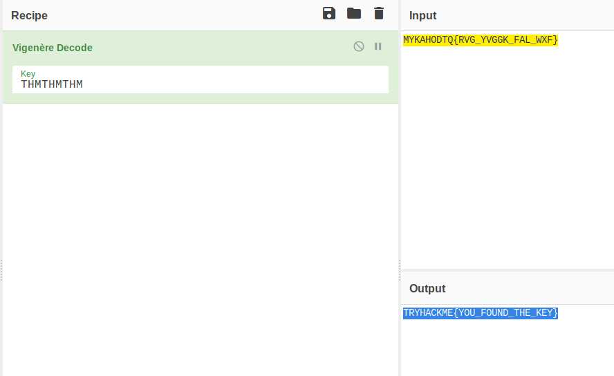

# CTF collection Vol.1

Sharpening up your CTF skill with the collection. The first volume is designed for beginner.

[CTF collection Vol.1](https://tryhackme.com/room/ctfcollectionvol1)

## Topic's

- Cryptography
  - Base64
  - Base58
  - ROT13
  - Caesar
  - Brainfuck
  - Hex
  - Vigenère
  - Decimal
- Steganography
- Revers Engineering
- Web Poking

## Appendix archive

Password: `1 kn0w 1 5h0uldn'7!`

## Author note

Just another random CTF room created by me. Well, the main objective of the room is to test your CTF skills. For your information, vol.1 consists of 20 tasks and all the challenges are extremely easy. Stay calm and Capture the flag. :)

Note: All the challenges flag are formatted as THM{flag}, unless stated otherwise

1. High five!

## What does the base said?

Can you decode the following? `VEhNe2p1NTdfZDNjMGQzXzdoM19iNDUzfQ==`

```
kali@kali:~/CTFs/tryhackme/CTF collection Vol.1$ echo -n 'VEhNe2p1NTdfZDNjMGQzXzdoM19iNDUzfQ==' | base64 -d
THM{ju57_d3c0d3_7h3_b453}
```

1. Feed me the flag!

`THM{ju57_d3c0d3_7h3_b453}`

## Meta meta

Meta! meta! meta! meta...................................

1. I'm hungry, I need the flag.

```
kali@kali:~/CTFs/tryhackme/CTF collection Vol.1$ exiftool Findme.jpg
ExifTool Version Number         : 12.06
File Name                       : Findme.jpg
Directory                       : .
File Size                       : 34 kB
File Modification Date/Time     : 2020:10:04 16:25:35+02:00
File Access Date/Time           : 2020:10:04 16:26:02+02:00
File Inode Change Date/Time     : 2020:10:04 16:26:02+02:00
File Permissions                : rw-r--r--
File Type                       : JPEG
File Type Extension             : jpg
MIME Type                       : image/jpeg
JFIF Version                    : 1.01
X Resolution                    : 96
Y Resolution                    : 96
Exif Byte Order                 : Big-endian (Motorola, MM)
Resolution Unit                 : inches
Y Cb Cr Positioning             : Centered
Exif Version                    : 0231
Components Configuration        : Y, Cb, Cr, -
Flashpix Version                : 0100
Owner Name                      : THM{3x1f_0r_3x17}
Comment                         : CREATOR: gd-jpeg v1.0 (using IJG JPEG v62), quality = 60.
Image Width                     : 800
Image Height                    : 480
Encoding Process                : Progressive DCT, Huffman coding
Bits Per Sample                 : 8
Color Components                : 3
Y Cb Cr Sub Sampling            : YCbCr4:2:0 (2 2)
Image Size                      : 800x480
Megapixels                      : 0.384
```

`THM{3x1f_0r_3x17}`

## Mon, are we going to be okay?

Something is hiding. That's all you need to know.

1. It is sad. Feed me the flag.

```
kali@kali:~/CTFs/tryhackme/CTF collection Vol.1$ steghide extract -sf Extinction.jpg
Enter passphrase:
wrote extracted data to "Final_message.txt".
kali@kali:~/CTFs/tryhackme/CTF collection Vol.1$ cat Final_message.txt
It going to be over soon. Sleep my child.

THM{500n3r_0r_l473r_17_15_0ur_7urn}
```

`THM{500n3r_0r_l473r_17_15_0ur_7urn}`

## Erm......Magick

Huh, where is the flag? THM{wh173_fl46}

1. Did you find the flag?

`THM{wh173_fl46}`

## QRrrrr

Such technology is quite reliable.

1. More flag please!

```
kali@kali:~/CTFs/tryhackme/CTF collection Vol.1$ qtqr QR.png
qt5ct: using qt5ct plugin
Qt: Session management error: Authentication Rejected, reason : None of the authentication protocols specified are supported and host-based authentication failed
text:b'THM{qr_m4k3_l1f3_345y}'
```

`THM{qr_m4k3_l1f3_345y}`

## Reverse it or read it?

Both works, it's all up to you.

1. Found the flag?

```
kali@kali:~/CTFs/tryhackme/CTF collection Vol.1$ file hello.hello
hello.hello: ELF 64-bit LSB shared object, x86-64, version 1 (SYSV), dynamically linked, interpreter /lib64/ld-linux-x86-64.so.2, BuildID[sha1]=02900338a56c3c8296f8ef7a8cf5df8699b18696, for GNU/Linux 3.2.0, not stripped
kali@kali:~/CTFs/tryhackme/CTF collection Vol.1$ strings hello.hello
/lib64/ld-linux-x86-64.so.2
libc.so.6
puts
printf
__cxa_finalize
__libc_start_main
GLIBC_2.2.5
_ITM_deregisterTMCloneTable
__gmon_start__
_ITM_registerTMCloneTable
u/UH
[]A\A]A^A_
THM{345y_f1nd_345y_60}
Hello there, wish you have a nice day
;*3$"
GCC: (Debian 9.2.1-21) 9.2.1 20191130
crtstuff.c
deregister_tm_clones
__do_global_dtors_aux
completed.7447
__do_global_dtors_aux_fini_array_entry
frame_dummy
__frame_dummy_init_array_entry
hello.c
__FRAME_END__
__init_array_end
_DYNAMIC
__init_array_start
__GNU_EH_FRAME_HDR
_GLOBAL_OFFSET_TABLE_
__libc_csu_fini
skip
_ITM_deregisterTMCloneTable
puts@@GLIBC_2.2.5
_edata
printf@@GLIBC_2.2.5
__libc_start_main@@GLIBC_2.2.5
__data_start
__gmon_start__
__dso_handle
_IO_stdin_used
__libc_csu_init
__bss_start
main
__TMC_END__
_ITM_registerTMCloneTable
__cxa_finalize@@GLIBC_2.2.5
.symtab
.strtab
.shstrtab
.interp
.note.gnu.build-id
.note.ABI-tag
.gnu.hash
.dynsym
.dynstr
.gnu.version
.gnu.version_r
.rela.dyn
.rela.plt
.init
.plt.got
.text
.fini
.rodata
.eh_frame_hdr
.eh_frame
.init_array
.fini_array
.dynamic
.got.plt
.data
.bss
.comment
```

`THM{345y_f1nd_345y_60}`

## Another decoding stuff

Can you decode it? `3agrSy1CewF9v8ukcSkPSYm3oKUoByUpKG4L`

1. Oh, Oh, Did you get it?

- [Base 58 Cipher](https://www.dcode.fr/base-58-cipher)

`THM{17_h45_l3553r_l3773r5}`

## Left or right

Left, right, left, right... Rot 13 is too mainstream. Solve this `MAF{atbe_max_vtxltk}`

1. What did you get?

- [caesar cipher decoder](https://cryptii.com/pipes/caesar-cipher)

`THM{hail_the_caesar}`

## Make a comment

No downloadable file, no ciphered or encoded text. Huh .......

1. I'm hungry now... I need the flag

```html
<div class="room-task-desc-data">
  <p>No downloadable file, no ciphered or encoded text. Huh .......<br /></p>
  <p style="display:none;">THM{4lw4y5_ch3ck_7h3_c0m3mn7}</p>
</div>
```

`THM{4lw4y5_ch3ck_7h3_c0m3mn7}`

## Can you fix it?

I accidentally messed up with this PNG file. Can you help me fix it? Thanks, ^^

1. What is the content?

- [https://gchq.github.io/CyberChef/#recipe=From_Hex('Auto')Render_Image('Raw')](<https://gchq.github.io/CyberChef/#recipe=From_Hex('Auto')Render_Image('Raw')>)

```
kali@kali:~/CTFs/tryhackme/CTF collection Vol.1$ head spoil.txt
2333445f0d0a1a0a0000000d4948445200000320000003200806000000db
700668000000017352474200aece1ce9000000097048597300000ec40000
0ec401952b0e1b0000200049444154789cecdd799c9c559deff1cf799e5a
bb7a5f927477f640480209201150c420bba288a8805c19067c5d64c079e9
752e03ce38e30e8e2f75e63a23ea8c0ce8308e036470c191cd80880c4b20
0909184c42b64ed2e9f4bed7f23ce7fe51559dea4e27a4bbaaf7effbf5ea
57d2d5554f9daa7abafa7ceb9cf33bc65a6b1111111111111907ce443740
4444444444660e0510111111111119370a202222222222326e1440444444
444464dc28808888888888c8b8510011111111119171a300222222222222
e34601444444444444c68d028888888888888c1b0510111111111119370a
```

```
kali@kali:~/CTFs/tryhackme/CTF collection Vol.1$ head spoil.txt
89504E470d0a1a0a0000000d4948445200000320000003200806000000db
700668000000017352474200aece1ce9000000097048597300000ec40000
0ec401952b0e1b0000200049444154789cecdd799c9c559deff1cf799e5a
bb7a5f927477f640480209201150c420bba288a8805c19067c5d64c079e9
752e03ce38e30e8e2f75e63a23ea8c0ce8308e036470c191cd80880c4b20
0909184c42b64ed2e9f4bed7f23ce7fe51559dea4e27a4bbaaf7effbf5ea
57d2d5554f9daa7abafa7ceb9cf33bc65a6b1111111111111907ce443740
4444444444660e0510111111111119370a202222222222326e1440444444
444464dc28808888888888c8b8510011111111119171a300222222222222
e34601444444444444c68d028888888888888c1b0510111111111119370a
```



`THM{y35_w3_c4n}`

## Read it

Some hidden flag inside Tryhackme social account.

1. Did you found the hidden flag?

- [New room Coming soon!](https://www.reddit.com/r/tryhackme/comments/eizxaq/new_room_coming_soon/)

`THM{50c14l_4cc0un7_15_p4r7_0f_051n7}`

## Spin my head

What is this?

`++++++++++[>+>+++>+++++++>++++++++++<<<<-]>>>++++++++++++++.------------.+++++.>+++++++++++++++++++++++.<<++++++++++++++++++.>>-------------------.---------.++++++++++++++.++++++++++++.<++++++++++++++++++.+++++++++.<+++.+.>----.>++++.`

1. Can you decode it?

- [Brainfuck](https://www.dcode.fr/brainfuck-language)

`THM{0h_my_h34d}`

## An exclusive!

Exclusive strings for everyone!

S1: 44585d6b2368737c65252166234f20626d
S2: 1010101010101010101010101010101010

1. Did you crack it? Feed me now!

```py
s1 = "44585d6b2368737c65252166234f20626d"
s2 = "1010101010101010101010101010101010"

a = hex(int(s1, 16) ^ int(s2, 16))[2:]
print(bytes.fromhex(a).decode('utf-8'))
```

```
kali@kali:~/CTFs/tryhackme/CTF collection Vol.1$ python3 strings_everyone.py
THM{3xclu51v3_0r}
```

`THM{3xclu51v3_0r}`

## Binary walk

Please exfiltrate my file :)

1. Flag! Flag! Flag!

```
kali@kali:~/CTFs/tryhackme/CTF collection Vol.1$ binwalk -e hell.jpg

DECIMAL       HEXADECIMAL     DESCRIPTION
--------------------------------------------------------------------------------
0             0x0             JPEG image data, JFIF standard 1.02
30            0x1E            TIFF image data, big-endian, offset of first image directory: 8
265845        0x40E75         Zip archive data, at least v2.0 to extract, uncompressed size: 69, name: hello_there.txt
266099        0x40F73         End of Zip archive, footer length: 22
kali@kali:~/CTFs/tryhackme/CTF collection Vol.1$ cat _hell.jpg.extracted/hello_there.txt
Thank you for extracting me, you are the best!

THM{y0u_w4lk_m3_0u7}
```

`THM{y0u_w4lk_m3_0u7}`

## Darkness

There is something lurking in the dark.

1. What does the flag said?



`THM{7h3r3_15_h0p3_1n_7h3_d4rkn355}`

## A sounding QR

How good is your listening skill? P/S: The flag formatted as THM{Listened Flag}, the flag should be in All CAPS

1. What does the bot said?

`THM{SOUNDINGQR}`

## Dig up the past

Sometimes we need a 'machine' to dig the past

Targetted website: https://www.embeddedhacker.com/
Targetted time: 2 January 2020

1. Did you found my past?

- [https://web.archive.org/web/20200102131252/https://www.embeddedhacker.com/](https://web.archive.org/web/20200102131252/https://www.embeddedhacker.com/)

`THM{ch3ck_th3_h4ckb4ck}`

## Uncrackable!

Can you solve the following? By the way, I lost the key. Sorry >.<

MYKAHODTQ{RVG_YVGGK_FAL_WXF}

Flag format: TRYHACKME{FLAG IN ALL CAP}

1. The deciphered text

- [https://gchq.github.io/CyberChef/#recipe=Vigen%C3%A8re_Decode('THMTHMTHM')&input=TVlLQUhPRFRRe1JWR19ZVkdHS19GQUxfV1hGfQ](<https://gchq.github.io/CyberChef/#recipe=Vigen%C3%A8re_Decode('THMTHMTHM')&input=TVlLQUhPRFRRe1JWR19ZVkdHS19GQUxfV1hGfQ>)



`TRYHACKME{YOU_FOUND_THE_KEY}`

## Small bases

Decode the following text. `581695969015253365094191591547859387620042736036246486373595515576333693`

1. What is the flag?

- [Decimal to Hexadecimal converter](https://www.rapidtables.com/convert/number/decimal-to-hex.html)
- [Hex to ASCII Text Converter](https://www.rapidtables.com/convert/number/hex-to-ascii.html)

`THM{17_ju57_4n_0rd1n4ry_b4535}`

## Read the packet

I just hacked my neighbor's WiFi and try to capture some packet. He must be up to no good. Help me find it.

1. Did you captured my neighbor's flag?

`THM{d0_n07_574lk_m3}`
