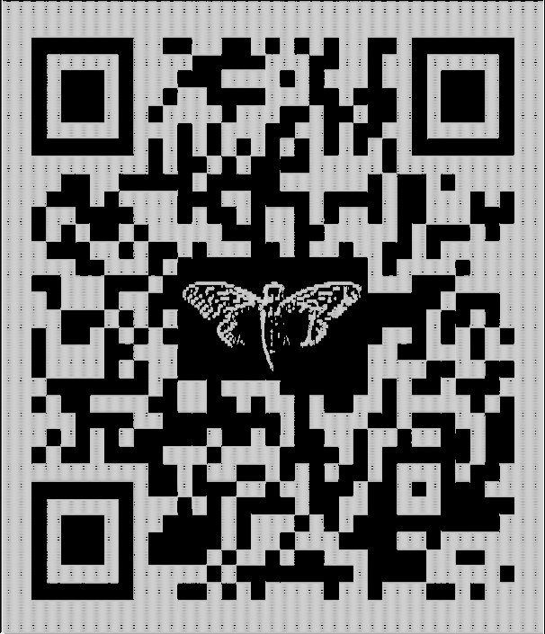

# Cicada-3301 Vol:1

A basic steganography and cryptography challenge room based on the Cicada 3301 challenges

[Cicada-3301 Vol:1](https://tryhackme.com/room/cicada3301vol1)

## Topic's

- Steganography
- Cryptography
  - Base64
  - Vigenère

## Appendix archive

Password: `1 kn0w 1 5h0uldn'7!`

## Task 1 Download!

Hello, We are looking for highly intelligent individuals. To find them, we have devised a test.
There is a message hidden in this image Download and unzip the folder given to begin

Good Luck
-3301

1. Download and unzip the given folder

## Task 2 Analyze The Audio

Web Browsers are useless here

Welcome.

Good Luck

-3301

Use Sonic Visualizer to analyze the audio

1. What is the link inside of the audio?



```
kali@kali:~/CTFs/tryhackme/Cicada-3301 Vol.1$ qtqr 2020-10-13_18-19.png
qt5ct: using qt5ct plugin
url:b'https://pastebin.com/wphPq0Aa'
```

`https://pastebin.com/wphPq0Aa`

```
Passphrase: SG01Ul80X1A0NTVtaHA0NTMh
Key: Q2ljYWRh
```

## Task 3 Decode the Passphrase

Welcome.

Good Luck.

-3301

Use various encryption methods and ciphers to decode the passphrase and access the metadata of Welcome.jpg

1. Find and Decrypt the passphrase and key

`No answer needed`

2. What is the decrypted passphrase?

```
kali@kali:~/CTFs/tryhackme/Cicada-3301 Vol.1$ echo SG01Ul80X1A0NTVtaHA0NTMh | base64 -d
Hm5R_4_P455mhp453!
```

`Hm5R_4_P455mhp453!`

3. What is the decrypted key?

```
kali@kali:~/CTFs/tryhackme/Cicada-3301 Vol.1$ echo Q2ljYWRh | base64 -d
Cicada
```

`Cicada`

4. Still looks funny? Find and use a cipher along with the key to decipher the passphrase

`No answer needed`

5. What is the final passphrase

`Ju5T_4_P455phr453!`

## Task 4 Gather Metadata

Good Luck

-3301

Use Steganography tools to gather metadata from Welcome.jpg as well as find the hidden message inside of the image file.

1. Using the found passphrase along with Stego tools find the secret message

`No answer needed`

2. What link is given?

```
kali@kali:~/CTFs/tryhackme/Cicada-3301 Vol.1$ steghide extract -sf welcome.jpg
Enter passphrase:
wrote extracted data to "invitation.txt".
kali@kali:~/CTFs/tryhackme/Cicada-3301 Vol.1$ cat invitation.txt
https://imgur.com/a/c0ZSZga
```

`https://imgur.com/a/c0ZSZga`

## Task 5 Find Hidden Files

I am surprised you have made it this far...

I doubt you will make it any further.

-3301

Use Stego tools to find the hidden files inside of the image

1. Using stego tools find the hidden file inside of the image

`No answer needed`

2. What tool did you use to find the hidden file

```
kali@kali:~/CTFs/tryhackme/Cicada-3301 Vol.1$ outguess -r 8S8OaQw.jpg bope
Reading 8S8OaQw.jpg....
Extracting usable bits:   29035 bits
Steg retrieve: seed: 38, len: 1351
kali@kali:~/CTFs/tryhackme/Cicada-3301 Vol.1$ cat bope
-----BEGIN PGP SIGNED MESSAGE-----
Hash: SHA1

Welcome again.

Here is a book code.  To find the book, break this hash:

b6a233fb9b2d8772b636ab581169b58c98bd4b8df25e452911ef75561df649edc8852846e81837136840f3aa453e83d86323082d5b6002a16bc20c1560828348

Use positive integers to go forward in the text use negative integers to go backwards in the text.

I:1:6
I:2:15
I:3:26
I:5:4
I:6:15
I:10:26
/
/
I:13:5
I:13:1
I:14:7
I:3:29
I:19:8
I:22:25
/
I:23:-1
I:19:-1
I:2:21
I:5:9
I:24:-2
I:22:1
I:38:1


Good luck.

3301

-----BEGIN PGP SIGNATURE-----
Version: GnuPG v1.4.11 (GNU/Linux)

iQIcBAEBAgAGBQJQ5QoZAAoJEBgfAeV6NQkPf2IQAKWgwI5EC33Hzje+YfeaLf6m
sLKjpc2Go98BWGReikDLS4PpkjX962L4Q3TZyzGenjJSUAEcyoHVINbqvK1sMvE5
9lBPmsdBMDPreA8oAZ3cbwtI3QuOFi3tY2qI5sJ7GSfUgiuI6FVVYTU/iXhXbHtL
boY4Sql5y7GaZ65cmH0eA6/418d9KL3Qq3qkTcM/tRAHhOZFMZfT42nsbcvZ2sWi
YyrAT5C+gs53YhODxEY0T9M2fam5AgUIWrMQa3oTRHSoNAefrDuOE7YtPy40j7kk
5/5RztmAzeEdRd8QS1ktHMezXEhdDP/DEdIJCLT5eA27VnTY4+x1Ag9tsDFuitY4
2kEaVtCrf/36JAAwEcwOg2B/stdjXe10RHFStY0N9wQdReW3yAOBohvtOubicbYY
mSCS1Bx91z7uYOo2QwtRaxNs69beSSy+oWBef4uTir8Q6WmgJpmzgmeG7ttEHquj
69CLSOWOm6Yc6qixsZy7ZkYDrSVrPwpAZdEXip7OHST5QE/Rd1M8RWCOODba16Lu
URKvgl0/nZumrPQYbB1roxAaCMtlMoIOvwcyldO0iOQ/2iD4Y0L4sTL7ojq2UYwX
bCotrhYv1srzBIOh+8vuBhV9ROnf/gab4tJII063EmztkBJ+HLfst0qZFAPHQG22
41kaNgYIYeikTrweFqSK
=Ybd6
-----END PGP SIGNATURE-----
```

`outguess`

## Task 6 Book Cipher

We have one last challenge to find our individuals

Find the last clue, crack the hash, decipher the message

Good Luck

-3301

Use Hash cracking tools to reveal the text to the text

Use methods like Cicada to decipher the message

1. Crack the Hash

`No answer needed`

2. What is the Hash type?

```
kali@kali:~/CTFs/tryhackme/Cicada-3301 Vol.1$ hash-identifier b6a233fb9b2d8772b636ab581169b58c98bd4b8df25e452911ef75561df649edc8852846e81837136840f3aa453e83d86323082d5b6002a16bc20c1560828348
   #########################################################################
   #     __  __                     __           ______    _____           #
   #    /\ \/\ \                   /\ \         /\__  _\  /\  _ `\         #
   #    \ \ \_\ \     __      ____ \ \ \___     \/_/\ \/  \ \ \/\ \        #
   #     \ \  _  \  /'__`\   / ,__\ \ \  _ `\      \ \ \   \ \ \ \ \       #
   #      \ \ \ \ \/\ \_\ \_/\__, `\ \ \ \ \ \      \_\ \__ \ \ \_\ \      #
   #       \ \_\ \_\ \___ \_\/\____/  \ \_\ \_\     /\_____\ \ \____/      #
   #        \/_/\/_/\/__/\/_/\/___/    \/_/\/_/     \/_____/  \/___/  v1.2 #
   #                                                             By Zion3R #
   #                                                    www.Blackploit.com #
   #                                                   Root@Blackploit.com #
   #########################################################################
--------------------------------------------------

Possible Hashs:
[+] SHA-512
[+] Whirlpool

Least Possible Hashs:
[+] SHA-512(HMAC)
[+] Whirlpool(HMAC)
--------------------------------------------------
```

`SHA512`

3. What is the Link from the hash?


`https://pastebin.com/6FNiVLh5`

4. Decipher the message

```
Chapter I
1. Had! The manifestation of Nuit.

2. The unveiling of the company of heaven.

3. Every man and every woman is a star.

4. Every number is infinite; there is no difference.

5. Help me, o warrior lord of Thebes, in my unveiling before the Children of men!

6. Be thou Hadit, my secret centre, my heart & my tongue!

7. Behold! it is revealed by Aiwass the minister of Hoor-paar-kraat.

8. The Khabs is in the Khu, not the Khu in the Khabs.

9. Worship then the Khabs, and behold my light shed over you!

10. Let my servants be few & secret: they shall rule the many & the known.

11. These are fools that men adore; both their Gods & their men are fools.

12. Come forth, o children, under the stars, & take your fill of love!

13. I am above you and in you. My ecstasy is in yours. My joy is to see your joy.

14. Above, the gemmed azure is
The naked splendour of Nuit;
She bends in ecstasy to kiss
The secret ardours of Hadit.
The winged globe, the starry blue,
Are mine, O Ankh-af-na-khonsu!
15. Now ye shall know that the chosen priest & apostle of infinite space is the prince-priest the Beast; and in his woman called the Scarlet Woman is all power given. They shall gather my children into their fold: they shall bring the glory of the stars into the hearts of men.

16. For he is ever a sun, and she a moon. But to him is the winged secret flame, and to her the stooping starlight.

17. But ye are not so chosen.

18. Burn upon their brows, o splendrous serpent!

19. O azure-lidded woman, bend upon them!

20. The key of the rituals is in the secret word which I have given unto him.

21. With the God & the Adorer I am nothing: they do not see me. They are as upon the earth; I am Heaven, and there is no other God than me, and my lord Hadit.

22. Now, therefore, I am known to ye by my name Nuit, and to him by a secret name which I will give him when at last he knoweth me. Since I am Infinite Space, and the Infinite Stars thereof, do ye also thus. Bind nothing! Let there be no difference made among you between any one thing & any other thing; for thereby there cometh hurt.

23. But whoso availeth in this, let him be the chief of all!

24. I am Nuit, and my word is six and fifty.

25. Divide, add, multiply, and understand.

26. Then saith the prophet and slave of the beauteous one: Who am I, and what shall be the sign? So she answered him, bendingdown, a lambent flame of blue, all-touching, all penetrant, her lovely hands upon the black earth, & her lithe body arched for love, and her soft feet not hurting the little flowers: Thou knowest! And the sign shall be my ecstasy, the consciousness of the continuity of existence, the omnipresence of my body.

27. Then the priest answered & said unto the Queen of Space, kissing her lovely brows, and the dew of her light bathing his whole body in a sweet-smelling perfume of sweat: O Nuit, continuous one of Heaven, let it be ever thus; that men speak not of Thee as One but as None; and let them speak not of thee at all, since thou art continuous!

28. None, breathed the light, faint & faery, of the stars, and two.

29. For I am divided for love's sake, for the chance of union.

30. This is the creation of the world, that the pain of division is as nothing, and the joy of dissolution all.

31. For these fools of men and their woes care not thou at all! They feel little; what is, is balanced by weak joys; but ye are my chosen ones.

32. Obey my prophet! follow out the ordeals of my knowledge! seek me only! Then the joys of my love will redeem ye from all pain. This is so: I swear it by the vault of my body; by my sacred heart and tongue; by all I can give, by all I desire of ye all.

33. Then the priest fell into a deep trance or swoon, & said unto the Queen of Heaven; Write unto us the ordeals; write unto us the rituals; write unto us the law!

34. But she said: the ordeals I write not: the rituals shall be half known and half concealed: the Law is for all.

35. This that thou writest is the threefold book of Law.

36. My scribe Ankh-af-na-khonsu, the priest of the princes, shall not in one letter change this book; but lest there be folly, he shall comment thereupon by the wisdom of Ra-Hoor-Khuit.

37. Also the mantras and spells; the obeah and the wanga; the work of the wand and the work of the sword; these he shall learn and teach.

38. He must teach; but he may make severe the ordeals.

39. The word of the Law is THELEMA.

40. Who calls us Thelemites will do no wrong, if he look but close into the word. For there are therein Three Grades, the Hermit, and the Lover, and the man of Earth. Do what thou wilt shall be the whole of the Law.

41. The word of Sin is Restriction. O man! refuse not thy wife, if she will! O lover, if thou wilt, depart! There is no bond that can unite the divided but love: all else is a curse. Accursed! Accursed be it to the aeons! Hell.

42. Let it be that state of manyhood bound and loathing. So with thy all; thou hast no right but to do thy will.

43. Do that, and no other shall say nay.

44. For pure will, unassuaged of purpose, delivered from the lust of result, is every way perfect.

45. The Perfect and the Perfect are one Perfect and not two; nay, are none!

46. Nothing is a secret key of this law. Sixty-one the Jews call it; I call it eight, eighty, four hundred & eighteen.

47. But they have the half: unite by thine art so that all disappear.

48. My prophet is a fool with his one, one, one; are not they the Ox, and none by the Book?

49. Abrogate are all rituals, all ordeals, all words and signs. Ra-Hoor-Khuit hath taken his seat in the East at the Equinox of the Gods; and let Asar be with Isa, who also are one. But they are not of me. Let Asar be the adorant, Isa the sufferer; Hoor in his secret name and splendour is the Lord initiating.

50. There is a word to say about the Hierophantic task. Behold! there are three ordeals in one, and it may be given in three ways. The gross must pass through fire; let the fine be tried in intellect, and the lofty chosen ones in the highest. Thus ye have star & star, system & system; let not one know well the other!

51. There are four gates to one palace; the floor of that palace is of silver and gold; lapis lazuli & jasper are there; and all rare scents; jasmine & rose, and the emblems of death. Let him enter in turn or at once the four gates; let him stand on the floor of the palace. Will he not sink? Amn. Ho! warrior, if thy servant sink? But there are means and means. Be goodly therefore: dress ye all in fine apparel; eat rich foods and drink sweet wines and wines that foam! Also, take your fill and will of love as ye will, when, where and with whom ye will! But always unto me.

52. If this be not aright; if ye confound the space-marks, saying: They are one; or saying, They are many; if the ritual be not ever unto me: then expect the direful judgments of Ra Hoor Khuit!

53. This shall regenerate the world, the little world my sister, my heart & my tongue, unto whom I send this kiss. Also, o scribe and prophet, though thou be of the princes, it shall not assuage thee nor absolve thee. But ecstasy be thine and joy of earth: ever To me! To me!

54. Change not as much as the style of a letter; for behold! thou, o prophet, shalt not behold all these mysteries hidden therein.

55. The child of thy bowels, he shall behold them.

56. Expect him not from the East, nor from the West; for from no expected house cometh that child. Aum! All words are sacred and all prophets true; save only that they understand a little; solve the first half of the equation, leave the second unattacked. But thou hast all in the clear light, and some, though not all, in the dark.

57. Invoke me under my stars! Love is the law, love under will. Nor let the fools mistake love; for there are love and love. There is the dove, and there is the serpent. Choose ye well! He, my prophet, hath chosen, knowing the law of the fortress, and the great mystery of the House of God.

All these old letters of my Book are aright; but [Tzaddi] is not the Star. This also is secret: my prophet shall reveal it to the wise.

58. I give unimaginable joys on earth: certainty, not faith, while in life, upon death; peace unutterable, rest, ecstasy; nor do I demand aught in sacrifice.

59. My incense is of resinous woods & gums; and there is no blood therein: because of my hair the trees of Eternity.

60. My number is 11, as all their numbers who are of us. The Five Pointed Star, with a Circle in the Middle, & the circle is Red. My colour is black to the blind, but the blue & gold are seen of the seeing. Also I have asecret glory for them that love me.

61. But to love me is better than all things: if under the night stars in the desert thou presently burnest mine incense before me, invoking me with a pure heart, and the Serpent flame therein, thou shalt come a little to lie in my bosom. For one kiss wilt thou then be willing to give all; but whoso gives one particle of dust shall lose all in that hour. Ye shall gather goods and store of women and spices; ye shall wear rich jewels; ye shall exceed the nations of the earth in spendour & pride; but always in the love of me, and so shall ye come to my joy. I charge you earnestly to come before me in a single robe, and covered with a rich headdress. I love you! I yearn to you! Pale or purple, veiled or voluptuous, I who am all pleasure and purple, and drunkenness of the innermost sense, desire you. Put on the wings, and arouse the coiled splendour within you: come unto me!

62. At all my meetings with you shall the priestess say -- and her eyes shall burn with desire as she stands bare and rejoicing in my secret temple -- To me! To me! calling forth the flame of the hearts of all in her love-chant.

63. Sing the rapturous love-song unto me! Burn to me perfumes! Wear to me jewels! Drink to me, for I love you! I love you!

64. I am the blue-lidded daughter of Sunset; I am the naked brilliance of the voluptuous night-sky.

65. To me! To me!

66. The Manifestation of Nuit is at an end.
```

`No answer needed`

5. What is the link?

`https://bit.ly/39pw2NH`

## Task 7 The Final Song

We have found the individuals we sought

-3301

1. What is the song linked?

`https://soundcloud.com/user-984804993/the-instar-emergence`

`The Instar Emergence`
