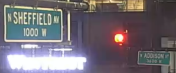
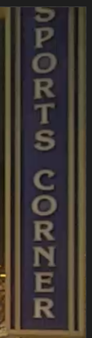
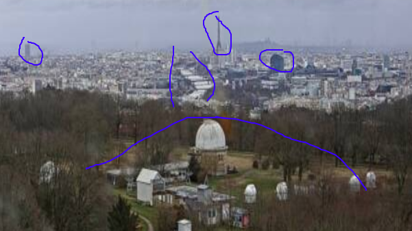

# Geolocating Images

Room to understand how to geolocate images

[Geolocating Images](https://tryhackme.com/room/geolocatingimages)

## Topic's

- Geolocating
- OSINT

## Appendix archive

Password: `1 kn0w 1 5h0uldn'7!`

## Task 1 Getting Started

This tutorial will show you how to geolocate images, from easy things to much harder things.

Our first thought about geolocating images is "where does this image appear on the internet?"

After all, an image may be on a website named "[ILoveEgypt.com](http://iloveegypt.com/)"!

To do this, we use a reverse image searching program. There are many out there on the internet, but the order from how good they are to worst goes:

1. Yandex
2. Yandex
3. Yandex
   ...
4. Yandex
5. Bing
6. Google

The reason why Google is 103 and not in the first 101 results is that Yandex is a million times better.

Yandex is to Google what a formula 1 racing car is to the $200 car you brought off your friend Ivan who claims the car isn't stolen but you've had police tailing you all week.

It really is night and day. There is no comparison to be made. Use Yandex first, and then a hundred more times. Then after Yandex, use Bing. Then Google. I cannot stress enough how much of a joke Google reverse image search is. `It should be your last resort`.

When you reverse image search with Google, Google tries to find the exact match of that image. With Yandex, it's almost as if Yandex knows what your image is of straight away and shows you other images of the same thing to reinforce the idea that it knows.

Here's a fun experiment. Take a picture of yourself right now. You must have other pictures online of yourself. Google reverse image search will likely never find you if you have never uploaded the image.

Yandex can likely work out who you are and show you other images of yourself.

Yandex uses AI to reverse image search, whereas it feels like Google is doing a simple "if IMG_0657 = [Position 1 of image database]: return" against all the images it has.

For more on Yandex vs Bing vs Google, check out Bellingcat's analysis:

https://www.bellingcat.com/resources/how-tos/2019/12/26/guide-to-using-reverse-image-search-for-investigations/

All images needed for this walkthrough are in the zip folder.

1. Download the zip file

`No answer needed`

## Task 2 Getting our feet wet - where is this?

Where is image 1?

(Use Google Reverse Search and revel in all the airplanes it shows you, which by the way, isn't the right answer).

Try Yandex Reverse Image search. Look at the differences!

1. Where in the world is image 1? The answer is the country name.

- [Google](https://www.google.com/search?tbs=sbi:AMhZZitBtJ8Ax9lb2YdOfIqAzfNfXM6bRhBKmGQdgUOYiNjRB6SZVNsbGodIqFdFM-6WgG4AlMFHTQ8huUqE7XcSa8EaRQomeG_1bcpAu4DznrQv6Yv8LgavS--ZWiVg-Ze5nztKQjaEQ2XITcbf7c_1Uv-ZSk9OS6egg7ZU3cIOh7GXTtmXH1Nvnb2zk-Xb731p39uTmKFfzNYAdwzUaNa5frV6t7uNALYD1wFZeDg-z2rK6c4txCT3nO5fCgIcPwg-lcAgqQyXNmJVGXHPAG52q_1Wy8QTlfvNHmw6873c440VejZaoICDfIucK6HGy9w94gh-pvb8Jaa&hl=de)
- [Yandex](https://yandex.com/images/search?rpt=imageview&url=https%3A%2F%2Favatars.mds.yandex.net%2Fget-images-cbir%2F4330558%2F_y2SfqKOC95dEPuTFJEvRA%2Forig&cbir_id=4330558%2F_y2SfqKOC95dEPuTFJEvRA)

`China`

## Task 3 Geolocating Images 101

Okay, now we know what reverse image searching program to use. Let's try to actually look at the picture now to figure out where it is!

Let's say we have a webcam we found on [Shodan.io](http://shodan.io/): [https://padcam.liverpool.ac.uk/cgi-bin/guestimage.html](https://padcam.liverpool.ac.uk/cgi-bin/guestimage.html)

Where is this camera?

The first thing we notice is the weird crest & title with a black bar (and possibly text) underneath it.

Second thing is the logo, "Kaplan".

The third thing is that there is a glass building next to a concrete building.

And finally, we have what appears to be a highway next to the glass building. Because it's a webcam, we can see cars moving quickly!

Putting this into a reverse image search program shows nothing.

Now, something important to note is the name of the webcam. The URL points to [Liverpool.ac.uk](http://liverpool.ac.uk/), which is a university in Liverpool.

If we just had an IP address, we could try to geolocate it using an online tool, checking the ASN number or finding it on Shodan.

Googling "Kaplan University of Liverpool" leads us to a news article about a new building. If we take a look at the image, it looks approximately similar to the one we saw.

Rows of long glasses with a little bit of overhang.

Luckily for us, Liverpool have captioned the image.

"`The proposed new Liverpool International College facility`"

If we google Liverpool International College we get: [https://www.google.com/maps/place/University+of+Liverpool+International+College/@53.4062447,-2.9625347,17z/data=!4m5!3m4!1s0x487b211eda1b2f5f:0xc226c2ccfb209504!8m2!3d53.4060784!4d-2.9605928](https://www.google.com/maps/place/University+of+Liverpool+International+College/@53.4062447,-2.9625347,17z/data=!4m5!3m4!1s0x487b211eda1b2f5f:0xc226c2ccfb209504!8m2!3d53.4060784!4d-2.9605928)

Which is our building! But it's not built yet... What gives?

In the bottom right hand corner, Google tells us the image was captured in June 2019.

So Google maps hasn't updated yet.

If we turn the camera around on Google maps, we can see where the live webcam should be.

Somewhere on this building!

When geolocating an image, we want to point out big landmarks we can easily find on a map. Road layouts, business names, The Empire States Building.

1.

`No answer needed`

## Task 4 Now your turn

Where was image 2 taken? Specifically, I'm looking for the name of the place that has likely set up the webcam. You'll know it when you see it!

Please do not use reverse image searches for this!

1. Where was image 2 taken?

`North Sheffield Avenue West Addison Street`

[Google Maps](https://www.google.com/maps/@41.9472324,-87.6543431,3a,75y,153.27h,88.82t/data=!3m7!1e1!3m5!1s2Gf-tk8-0EdjcnHfVAw_WA!2e0!6s%2F%2Fgeo0.ggpht.com%2Fcbk%3Fpanoid%3D2Gf-tk8-0EdjcnHfVAw_WA%26output%3Dthumbnail%26cb_client%3Dmaps_sv.tactile.gps%26thumb%3D2%26w%3D203%26h%3D100%26yaw%3D116.67729%26pitch%3D0%26thumbfov%3D100!7i16384!8i8192)

Google: `Wrigleyville Sports`

## Task 5 Helpful tips for geolocating

Wow, congrats! I found a webcam on Shodan.io and took this screenshot, you just geolocated your first image 😎

It's important to know what is and isn't likely to be in a country. For example, it is unlikely for a regular Catholic church to appear in places where Budhism / islam is the most popular religeion.

The language used on the shops and vehicles matter too. We can use Google translate to predict what language it could be.

Which side of the road the cars are on, the license plates (you normally can find out what country or state the license plate is from), the markings on the road (different countries have different markings), the style of traffic lights, the clothing choices of those walking around.

To be good at geolocation, we've got to open our eyes to all that could be. In your country, for example, it may be common to wear coats during the winter periods. However, in other countries it may not be (think Australia).

Even the smallest of things that we wouldn't normally think twice about can reveal to us the possible location.

One of the more obvious ways we can geolocate an image is to look at the image details. Does it contain EXIF data?

What about where it was posted - is there a location tagged on social media?

1. Read the above material

`No answer needed`

## Task 6 Your turn, again!

Please do not try to use reverse image searches for this one! Pay close attention to what is in the image.

I want you to answer with the name of the place the webcam is facing.

Note: the name of this location on Google Maps is not the right answer. If you take that location name and paste it back into search, you'll find out there's about a million of them. To make this harder, I'm looking for the name that specifically identifies this location. When you enter this name, it'll be the only one that turns up on Google Maps.

1. Where was image 3 taken?

[Google Maps](https://www.google.com/maps/place/Paris+Observatory/@48.8048888,2.2303288,382m/data=!3m1!1e3!4m13!1m7!3m6!1s0x47e6701f7e8337b5:0xa2cb58dd28914524!2sEiffel+Tower,+Paris,+Frankreich!3b1!8m2!3d48.8560934!4d2.2930458!3m4!1s0x47e67bb35aca5441:0xd722bb94066588eb!8m2!3d48.8050232!4d2.2311708)

`5 Place Jules Janssen, 92190 Meudon, Frankreich`

`Meudon Observatory`

## Task 7 Your turn, what can you see?

Look at image 4. What do you see? What can you observe?

1. Where is image 4 taken?

`abbey road`

## Task 8 You're done!

And that's it!

Check out Bellingcat for more on geolocation: https://www.bellingcat.com/news/2020/01/21/geolocating-venezuelan-lawmakers-in-europe

Alternatively, play a lot of Geoguesser!

https://geoguessr.com/

1. Check out the links above!

`No answer needed`
