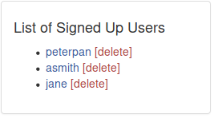

# Getting Started

Get started with TryHackMe by hacking a fake social media website!

[Getting Started](https://tryhackme.com/room/gettingstarted)

## Topic's

* TryHackMe Tutorial
* Web Poking

## Task 1 Information Disclosure On BFFs Social Media Website

On TryHackMe you'll learn by deploying and hacking virtual machines. Let's start out by attacking the BFFs social media website. With the rise of the internet, it's apparently very easy to create new social media platforms, but not everyone is aware of securing coding practices.

Lets deploy your AttackBox, a web-based machine used to attack other machines.

1. Click the blue "Start AttackBox" button at the top of this room As a free user you can only deploy the AttackBox for 1 hour per day - [Subscribe](https://tryhackme.com/profile#subscribe) to remove this limit.
2. Deploy the machine shown on this task and wait 1 minute for it to configure.

Enter the IP address of the deployed machine on your web browser - it should be MACHINE_IP


Once you enter that IP address into the browser, a page will load. It's very common for developers to leave comments about how the application works on the web page source. Sometimes this information can include usernames, passwords and even hidden pages that users are not usually supposed to have access to. Let's check the page source by right clicking on the page in the browser and selecting the view page source option as shown below:


The comments on a web page usually begin with the `<!--` character. Go through the source and identify and comments.

1. What is the name of the hidden admin page?

[](view-source:http://10.10.114.199/)

```html
  <!-- ./nav -->

  <!-- main -->
  <!-- don't forget to remove admin page on /test-admin -->
```

`/test-admin`

## Task 2 Default Credentials

You'll now notice that there's a login form on the hidden admin page. This login form may take you to the administrator portal of the BFFs platform. It's dangerous for an attacker to get access to pages like this as there would be dangerous functionality on there such as:

* accessing sensitive user information (names, addresses)
* modifying users profiles

It's very common for applications to use default credentials. These credentials tend to be easy to guess and are provided by third party applications when they are installed. Common username and passwords include (in the format username:password):

* admin:admin
* admin:password
* administrator:password123

Try these default credentials to gain access to the administrator portal.

Now that you've learnt some common misconfiguration about web applications, why not carry on your cyber security journey!

Start by searching for a security topic to learn about on the [Hacktivities](https://tryhackme.com/hacktivities) page.

Don't forget to check out our [Pathways](https://tryhackme.com/paths) for a more guided learning experience.

Other interesting offerings:

 We release weekly security challenges and walkthroughs
 You can upload your own VMs and make [your own rooms](https://tryhackme.com/develop-rooms)
 Come join our [Discord](https://discord.gg/tryhackme) community and say hi!
 
1. What is the username and password in the form username:password?


`admin:admin`

2. How many user are signed up to the application?



`3`
