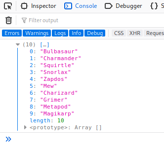

# Gotta Catch'em All!

This room is based on the original Pokemon series. Can you obtain all the Pokemon in this room?

[Gotta Catch'em All!](https://tryhackme.com/room/pokemon)

## Topic's

- Network Enumeration
- Web Poking
- Cryptography
  - Hex
  - ROT13 (Amount 14)
  - Base64
- Reverse Enigeering

## Appendix archive

Password: `1 kn0w 1 5h0uldn'7!`

## Task 1 Can You Catch'em All?

Remember to connect to the VPN network using OpenVPN, It may take some time for the machine to properly deploy.

You can also deploy your own Kali Linux machine, and control it in your browser using the provided [Kali machine](https://tryhackme.com/room/kali) (Subscription Required).

Enjoy the room!

```
kali@kali:~/CTFs/tryhackme/Gotta Catchem All$ sudo nmap -A -sC -sS -sV -O 10.10.212.160
[sudo] password for kali:
Starting Nmap 7.80 ( https://nmap.org ) at 2020-10-10 19:39 CEST
Nmap scan report for 10.10.212.160
Host is up (0.075s latency).
Not shown: 998 closed ports
PORT   STATE SERVICE VERSION
22/tcp open  ssh     OpenSSH 7.2p2 Ubuntu 4ubuntu2.8 (Ubuntu Linux; protocol 2.0)
| ssh-hostkey:
|   2048 58:14:75:69:1e:a9:59:5f:b2:3a:69:1c:6c:78:5c:27 (RSA)
|   256 23:f5:fb:e7:57:c2:a5:3e:c2:26:29:0e:74:db:37:c2 (ECDSA)
|_  256 f1:9b:b5:8a:b9:29:aa:b6:aa:a2:52:4a:6e:65:95:c5 (ED25519)
80/tcp open  http    Apache httpd 2.4.18 ((Ubuntu))
|_http-server-header: Apache/2.4.18 (Ubuntu)
|_http-title: Can You Find Them All?
No exact OS matches for host (If you know what OS is running on it, see https://nmap.org/submit/ ).
TCP/IP fingerprint:
OS:SCAN(V=7.80%E=4%D=10/10%OT=22%CT=1%CU=43194%PV=Y%DS=2%DC=T%G=Y%TM=5F81F1
OS:FB%P=x86_64-pc-linux-gnu)SEQ(SP=107%GCD=1%ISR=10C%TI=Z%CI=Z%II=I%TS=A)SE
OS:Q(SP=107%GCD=1%ISR=10C%TI=Z%CI=Z%TS=A)OPS(O1=M508ST11NW6%O2=M508ST11NW6%
OS:O3=M508NNT11NW6%O4=M508ST11NW6%O5=M508ST11NW6%O6=M508ST11)WIN(W1=F4B3%W2
OS:=F4B3%W3=F4B3%W4=F4B3%W5=F4B3%W6=F4B3)ECN(R=Y%DF=Y%T=40%W=F507%O=M508NNS
OS:NW6%CC=Y%Q=)T1(R=Y%DF=Y%T=40%S=O%A=S+%F=AS%RD=0%Q=)T2(R=N)T3(R=N)T4(R=Y%
OS:DF=Y%T=40%W=0%S=A%A=Z%F=R%O=%RD=0%Q=)T5(R=Y%DF=Y%T=40%W=0%S=Z%A=S+%F=AR%
OS:O=%RD=0%Q=)T6(R=Y%DF=Y%T=40%W=0%S=A%A=Z%F=R%O=%RD=0%Q=)T7(R=Y%DF=Y%T=40%
OS:W=0%S=Z%A=S+%F=AR%O=%RD=0%Q=)U1(R=Y%DF=N%T=40%IPL=164%UN=0%RIPL=G%RID=G%
OS:RIPCK=G%RUCK=G%RUD=G)IE(R=Y%DFI=N%T=40%CD=S)

Network Distance: 2 hops
Service Info: OS: Linux; CPE: cpe:/o:linux:linux_kernel

TRACEROUTE (using port 23/tcp)
HOP RTT      ADDRESS
1   32.40 ms 10.8.0.1
2   91.98 ms 10.10.212.160

OS and Service detection performed. Please report any incorrect results at https://nmap.org/submit/ .
Nmap done: 1 IP address (1 host up) scanned in 31.81 seconds
```

```html
<pokemon
  >:<hack_the_pokemon>
    <!--(Check console for extra surprise!)--></hack_the_pokemon
  ></pokemon
>
```



```js
0: "Bulbasaur"​
1: "Charmander"​
2: "Squirtle"​
3: "Snorlax"​
4: "Zapdos"​
5: "Mew"​
6: "Charizard"​
7: "Grimer"​
8: "Metapod"​
9: "Magikarp"
```

```
kali@kali:~/CTFs/tryhackme/Gotta Catchem All$ ssh pokemon@10.10.212.160
The authenticity of host '10.10.212.160 (10.10.212.160)' can't be established.
ECDSA key fingerprint is SHA256:mXXTCQORSu35gV+cSi+nCjY/W0oabQFNjxuXUDrsUHI.
Are you sure you want to continue connecting (yes/no/[fingerprint])? yes
Warning: Permanently added '10.10.212.160' (ECDSA) to the list of known hosts.
pokemon@10.10.212.160's password:
Permission denied, please try again.
pokemon@10.10.212.160's password:
Welcome to Ubuntu 16.04.6 LTS (GNU/Linux 4.15.0-112-generic x86_64)

 * Documentation:  https://help.ubuntu.com
 * Management:     https://landscape.canonical.com
 * Support:        https://ubuntu.com/advantage

84 packages can be updated.
0 updates are security updates.


The programs included with the Ubuntu system are free software;
the exact distribution terms for each program are described in the
individual files in /usr/share/doc/*/copyright.

Ubuntu comes with ABSOLUTELY NO WARRANTY, to the extent permitted by
applicable law.

pokemon@root:~$
```

```
kali@kali:~/CTFs/tryhackme/Gotta Catchem All$ wget http://10.10.212.160:8000/P0kEmOn.zip
--2020-10-10 19:50:13--  http://10.10.212.160:8000/P0kEmOn.zip
Connecting to 10.10.212.160:8000... connected.
HTTP request sent, awaiting response... 200 OK
Length: 383 [application/zip]
Saving to: ‘P0kEmOn.zip’

P0kEmOn.zip              100%[================================>]     383  --.-KB/s    in 0s

2020-10-10 19:50:13 (7.88 MB/s) - ‘P0kEmOn.zip’ saved [383/383]

kali@kali:~/CTFs/tryhackme/Gotta Catchem All$ wget http://10.10.212.160:8000/Could_this_be_what_Im_looking_for?.cplusplus
--2020-10-10 19:51:20--  http://10.10.212.160:8000/Could_this_be_what_Im_looking_for?.cplusplus
Connecting to 10.10.212.160:8000... connected.
HTTP request sent, awaiting response... 404 File not found
2020-10-10 19:51:20 ERROR 404: File not found.

kali@kali:~/CTFs/tryhackme/Gotta Catchem All$ wget http://10.10.212.160:8000/Could_this_be_what_Im_looking_for?.cplusplus
--2020-10-10 19:52:14--  http://10.10.212.160:8000/Could_this_be_what_Im_looking_for?.cplusplus
Connecting to 10.10.212.160:8000... connected.
HTTP request sent, awaiting response... 404 File not found
2020-10-10 19:52:14 ERROR 404: File not found.

kali@kali:~/CTFs/tryhackme/Gotta Catchem All$ unzip P0kEmOn.zip
Archive:  P0kEmOn.zip
   creating: P0kEmOn/
  inflating: P0kEmOn/grass-type.txt
kali@kali:~/CTFs/tryhackme/Gotta Catchem All$ cat P0kEmOn
P0kEmOn/     P0kEmOn.zip
kali@kali:~/CTFs/tryhackme/Gotta Catchem All$ cat P0kEmOn/grass-type.txt
50 6f 4b 65 4d 6f 4e 7b 42 75 6c 62 61 73 61 75 72 7d
```

`PoKeMoN{Bulbasaur}`

```
pokemon@root:~/Videos/Gotta/Catch/Them/ALL!$ strings Could_this_be_what_Im_looking_for\?.cplusplus
# include <iostream>
int main() {
        std::cout << "ash : pikapika"
        return 0;
```

```
pokemon@root:/home$ su ash
Password:
To run a command as administrator (user "root"), use "sudo <command>".
See "man sudo_root" for details.

bash: /home/ash/.bashrc: Permission denied
ash@root:/home$ cat roots-pokemon.txt
Pikachu!

Pikachu!ash@root:/home$ cd /var/www/html/
ash@root:/var/www/html$ ls -la
total 24
drwxr-xr-x 2 root    root  4096 Jun 22 22:51 .
drwxr-xr-x 3 root    root  4096 Jun 22 22:23 ..
-rw-r--r-- 1 root    root 11217 Jun 24 14:36 index.html
-rw-r--r-- 1 pokemon root    24 Jun 22 22:51 water-type.txt
ash@root:/var/www/html$ cat water-type.txt
Ecgudfxq_EcGmP{Ecgudfxq}
```

[https://gchq.github.io/CyberChef/#recipe=ROT13(true,true,14)&input=RWNndWRmeHFfRWNHbVB7RWNndWRmeHF9](<https://gchq.github.io/CyberChef/#recipe=ROT13(true,true,14)&input=RWNndWRmeHFfRWNHbVB7RWNndWRmeHF9>)

```
root@root:~# find / -name '*fire-type*' -type f 2>/dev/null | grep -ivE "(firefox|firewall)"
/etc/why_am_i_here?/fire-type.txt
root@root:~# cat /etc/why_am_i_here?/fire-type.txt
UDBrM20wbntDaGFybWFuZGVyfQ==
root@root:~# echo 'UDBrM20wbntDaGFybWFuZGVyfQ==' | base64 -d
P0k3m0n{Charmander}
```

1. Find the Grass-Type Pokemon

`PoKeMoN{Bulbasaur}`

2. Find the Water-Type Pokemon

`Squirtle_SqUaD{Squirtle}`

3. Find the Fire-Type Pokemon

`P0k3m0n{Charmander}`

4. Who is Root's Favorite Pokemon?

`Pikachu!`

5. Congratulations! Thank You So Much For Completing The Pokemon Room!
