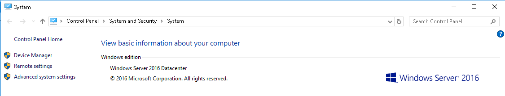
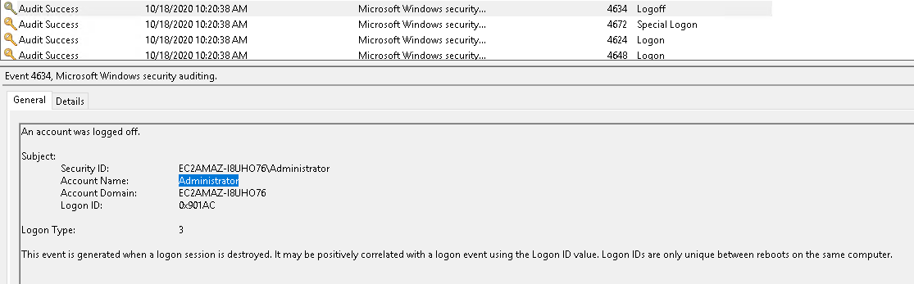
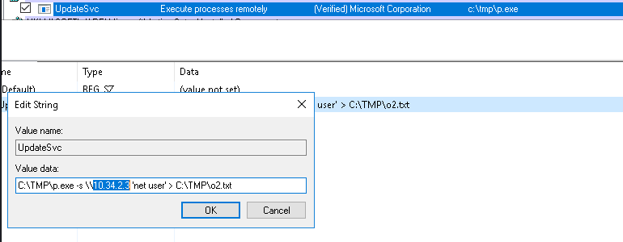
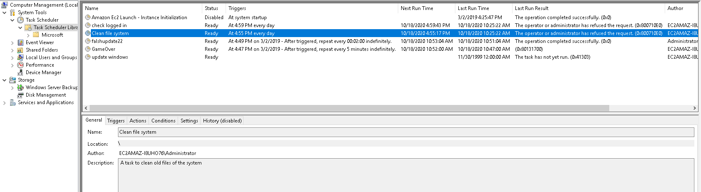
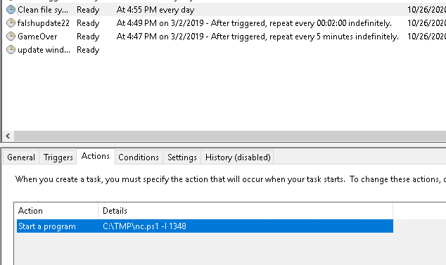
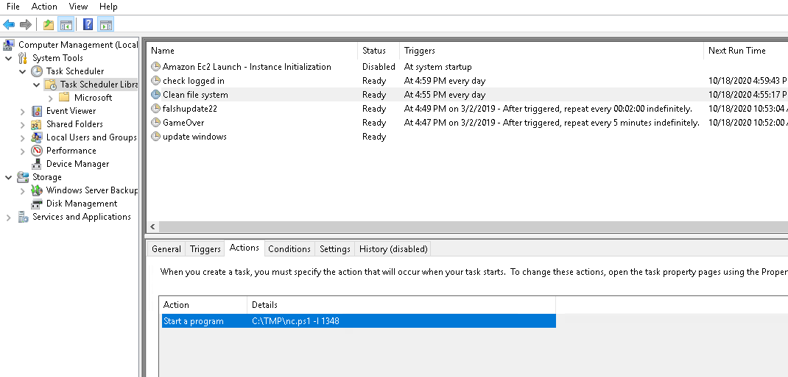
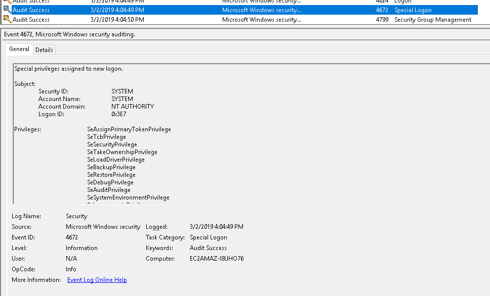
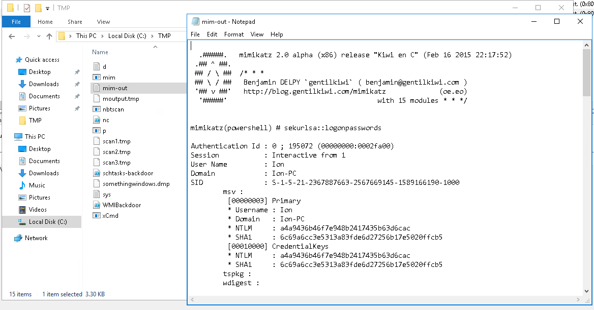
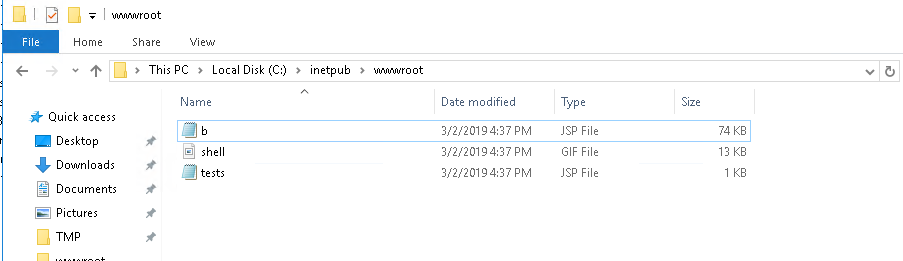

# Investigating Windows

A windows machine has been hacked, its your job to go investigate this windows machine and find clues to what the hacker might have done.

- [Investigating Windows](https://tryhackme.com/room/investigatingwindows)

## Appendix archive

Password: `1 kn0w 1 5h0uldn'7!`

## Task 1 Investigating Windows

This is a challenge that is exactly what is says on the tin, there are a few challenges around investigating a windows machine that has been previously compromised.

Connect to the machine using RDP. The credentials the machine are as follows:

Username: **Administrator**
Password: **letmein123!**

Please note that this machine does not respond to ping (ICMP) and may take a few minutes to boot up.

1. Whats the version and year of the windows machine?



`Windows Server 2016`

2. Which user logged in last?



`Administrator`

3. When did John log onto the system last? Answer format: MM/DD/YYYY H:MM:SS AM/PM


`03/02/2019 5:48:32 PM`

4. What IP does the system connect to when it first starts?



`10.34.2.3`

5. What two accounts had administrative privileges (other than the Administrator user)? Answer format: username1, username2

```
PS C:\Users\Administrator> net localgroup administrators
Alias name     administrators
Comment        Administrators have complete and unrestricted access to the computer/domain

Members

-------------------------------------------------------------------------------
Administrator
Guest
Jenny
The command completed successfully.

PS C:\Users\Administrator>
```

`Jenny, Guest`

6. Whats the name of the scheduled task that is malicous.



`Clean File System`

7. What file was the task trying to run daily?



`nc.ps1`

8.  What port did this file listen locally for?



`1348`

9. When did Jenny last logon?

```
C:\Users\Administrator>net user jenny | findstr /B /C:"Last logon"
Last logon                   Never
```

`Never`

1.  At what date did the compromise take place? Answer format: MM/DD/YY

`03/02/2019`

11. At what time did Windows first assign special privileges to a new logon? Answer format: MM/DD/YYYY HH:MM:SS AM/PM



`03/02/2019 4:04:49 PM`

12. What tool was used to get Windows passwords?



`mimikatz`

14. What was the attackers external control and command servers IP?

```cmd
Microsoft Windows [Version 10.0.14393]
(c) 2016 Microsoft Corporation. All rights reserved.

C:\Users\Administrator>ipconfig /displaydns

Windows IP Configuration


    google.com
    ----------------------------------------
    No records of type AAAA


    google.com
    ----------------------------------------
    Record Name . . . . . : google.com
    Record Type . . . . . : 1
    Time To Live  . . . . : 86400
    Data Length . . . . . : 4
    Section . . . . . . . : Answer
    A (Host) Record . . . : 76.32.97.132


C:\Users\Administrator>
```

`76.32.97.132`

15. What was the extension name of the shell uploaded via the servers website?



`.jsp`

16. What was the last port the attacker opened?

`1337`

17. Check for DNS poisoning, what site was targeted?

`google.com`
