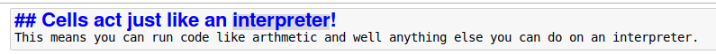
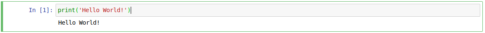
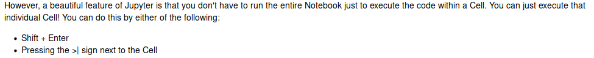
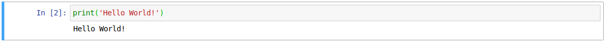
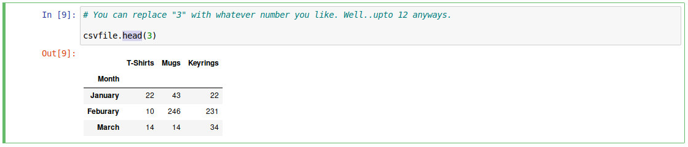
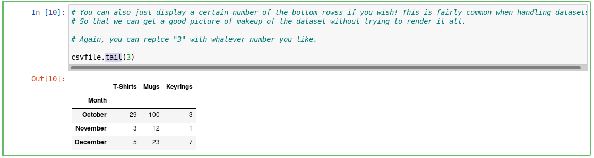
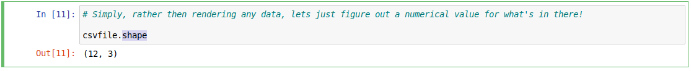
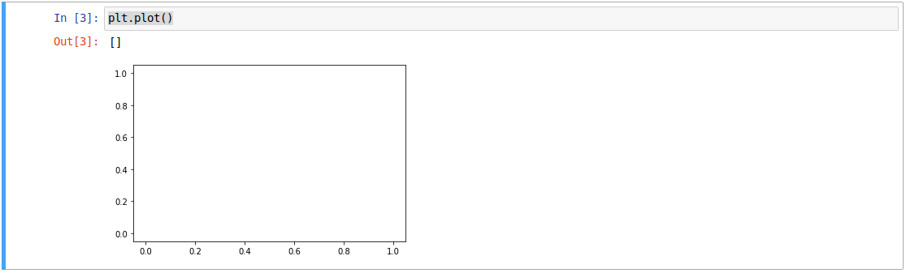
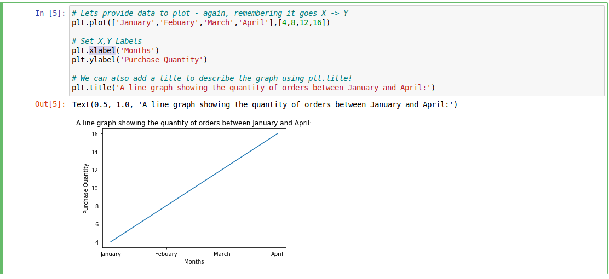
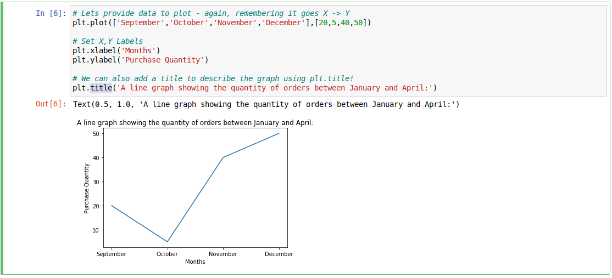

# Jupyter 101

A friendly introduction into using the Jupyter Notebook environment. Learn to process and visualise data!

* [Jupyter 101](https://tryhackme.com/room/jupyter101)

## Preface

Data science is a very broad, enormous topic that isn't (in my opinion) easy to approach and much harder to master. It has a huge variety of uses across all types of industries! To name a few real-world examples of where data science can be found day-to-day:

* Recommendations of content on Netflix and YouTube based upon your previous viewing history
* Fraud detection in Banking
* Intrusion Detection for Cyber Security
* Weather Forecasting / Prediction
* Metrics of a Business' sales performance
* Route planning in Google Maps.

It is also goes hand-in-hand with Machine Learning / Artificial Intelligence.

Despite the following room using Python, I have tried to explain any code as much as possible. The code itself is fairly simple, so if you're not familiar with Python, you can still follow along just fine!

Hopefully the following room provides a friendly introduction into the "Jupyter Notebook" environment which is an extremely useful application in the world of data science.

Moreover, I hope the tasks below are a practical and engaging approach into the very common "Pandas" library, which is where the data is crunched. Finally, the "Matplotlib" framework - which is my favourite part, where we can visualise all of the data we have handled!

This is my first room release, so please excuse me if I have overlooked anything. **If there is an interest about the topics from this Room,** I'll create further content where we will go much more in depth and apply knowledge to solve practical problems (assuming my University studies permits, alongside being generally super-hectic) But in the meanwhile, I hope you enjoy!

For any and all feedback, questions, problems or future ideas you'd like to be covered - please get in touch:

[Discord](https://discord.gg/YDMUKwf): **@CMNatic#9812**

I frequent the TryHackMe Discord often, but regardlessly, please feel more than free to ping me in that Discord!

So long and thanks for all the fish!

[~CMNatic](https://cmnatic.co.uk/)

Shout out to MuirlandOracle for his valuable feedback during testing!

1. Lets' ago!

`No answer needed`

## What is Jupyter?

Jupyter is a web-based platform often used for data analytics / plotting, machine learning, where code is stored in "Notebooks" whom can imported/exported and shared in many formats such as LaTex, HTML, PDF and many more!

I have created a pretty useful introductory post on my blog, annotating how to interact with Jupyter. Feel free to figure your way around the interface yourself! The interface is fairly intuitive itself, but if you're new to it, I'd **very strongly recommend** going through it to get familiar. It's only a minute or two read. 

[Read the support material here!](https://oldblog.cmnatic.co.uk/posts/thm-room-jupyter101-support-material/)

The Jupyter Notebook environment isn't the easiest thing to install and deploy in the world. Normally you have to provide configuration files, Python environments and all sorts of fun things. I've done the leg-work here and made a cloud-friendly deploy of Jupyter that launches on boot.

Jupyter is great because you are able to import/export any Notebooks that you create or any other [Notebooks that people have made](https://github.com/jupyter/jupyter/wiki/A-gallery-of-interesting-Jupyter-Notebooks).

Due to the nature of Jupyter, it's pretty hard to break anything. But if you wish to restore the provided Notebooks - you can simply redeploy the instance!

1. Read the supporting material.

`No answer needed`

## Deploying Instance & Logging In

Firstly, deploy the instance by pressing the **"Deploy"** icon on the top right of this box.

**Please wait 5 minutes for the Instance to fully boot before trying to access it. If you cannot access it after 5 minutes, please "Terminate" and re"Deploy"**

When you launch the instance and navigate to it, you will be presented with a login screen like so:

Jupyter uses authentication protocols and tokens for user management, which are a pain to manage. I couldn't find a workable solution to completely remove this, so I have done my best to work around it.

**Use the password: tryhackme**

If you have logged in successfully, you will be presented with the following:

**You're ready to go!**

Excerpt from the [supporting material](https://oldblog.cmnatic.co.uk/posts/thm-room-jupyter101-support-material/):

"Jupyter directly interacts with the Operating Systems filesystem (assuming the user it is running as has the necessary permissions!). This means you can create and upload files and traverse folders - as if you would on the host itself. Similarly, anything you delete on the host - gets deleted on Jupyter...you get the picture..."

We'll be exploring this later...

1. I have logged in!

`No answer needed`

## Let's Learn More About Jupyter

Enter the **"WhatIsJupyter"** directory and launch **"WhatIsJupyter.ipynb"** and have a read through.

There's no questions, but I detail some use cases of Jupyter and why someone might use it over an IDLE such as PyCharm!

1. Launch Jupyter

`No answer needed`

## Understanding how Jupyter Notebooks Run

Navigate into the "UnderstandingJupyterNotebooks" directory and launch "UnderstandingHowJupyterExecutes.ipynb" and read the annotations I have made to understand how to answer this.

1. What do "Cells" act like?

`interpreter`

2. What would be the In[#] value of the first Cell when it is ran for the first time? (Where # would be the numerical value)

`1`

3. What keyboard shortcut can you press to execute a cell?

`Shift + Enter`

4. If you was to execute the first Cell again, what would the value of In[#] now become? (Where # would be the numerical value)

`2`

## Interacting With the Filesystem!

As previously mentioned throughout the walkthrough, Jupyter directly interacts with the Operating System's filesystem. For example, making files, folders and/or Notebooks.

These files are reflected on the Operating System that Jupyter is running on. The directory that you are shown after logging into Jupyter is for all intents and purposes, the "root" directory of Jupyter. 

However, just because it is the "root" directory, it does not mean it is the Operating Systems /root/ directory. It is simply the directory of wherever Jupyter was launched upon / or told to set to during configuration.

In this case, I have told Jupyter to launch within the "thm" users home directory, where you will later log into and see for yourself.

Lets log into the Instance, replacing any IP address in the pictures below with that of the Instance you have deployed.

* Username: thm
* Password: tryhackme
* Port: 22

You can login via Linux:

Or via a Windows application such as Putty

Now, after successful login, lets see what's going on, using `ls`.

We then create a new file using `touch` in this case, "LookAtMe.Txt"

Returning back to the Jupyter instance in your web browser, we can now see the file we have just created is visible within Jupyter.!

When opening the file, I've put written in some text using Jupyter:

Lets review this change (after saving it in File -> Save) if it hasn't done so automatically

Ta-dah! And there we have it.

Jupyter directly uses Linux' User permissions. So you will only be able to read/write/modify the files that the you (the user the Jupyter Server is running as) within the directory (that has either been specified in configuration, or from where it is launched)

1. Follow the instructions above.

`No answer needed`

## Handling Data With Pandas

Pandas is a fantastic library for data wrangling. It allows us to read data from a wide variety of formats such as CSV files, JSONs, Databases and more!

Datasets are often very large. Whilst the contents of them might be useful to us, these contents may not be in the exact format we need! Nor may we need every single value - only a select few. Let's get started...

Navigate to the **"IntroToPandas" directory** on the Jupyter instance and **run "IntroToPandas.ipynb" please read the annotations.**

1. What are the two main types of data within Pandas?

`Series and Dataframes`

2. What is the name of the Pandas function that reads a CSV file?

`read_csv`

3. Name the Pandas function you would use if you only wanted to display the first few rows

`head`

4. Name the Pandas function you would use if you only wanted to display the last few rows

`tail`

5. What Pandas function will give you a numerical count of the amount of columns and rows the dataset contains?

`shape`

## Visualising Data With Matplotlib

Navigate to the **"IntroToMatplotlib" directory** on the Jupyter Instance and run **"IntroToMatplotlib.ipynb" please read the annotations.**

1. How do you display a plot?

`plot()`

2. How would you label the "x" axis on a plot? Note: do not add the brackets () for this answer

`xlabel`

3. How would you label the "y" axis on a plot? Note: do not add the brackets () for this answer

`ylabel`

4. How would you add a "Title" to a plot? Note: do not add the brackets () for this answer

`title`

5. What word would you use to change the color of the plot?

`color`

6. How would you label the "z" axis on a plot? Note: do not add the brackets () for this answer

`zlabel`
