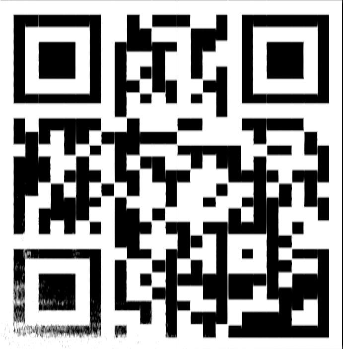

# Musical Stego

This audio file is hiding some things, are you able to extract enough data to reveal the flag?

[Musical Stego](https://tryhackme.com/room/musicalstego)

## Topic's

- Steganography

## Appendix archive

Password: `1 kn0w 1 5h0uldn'7!`

## Musical Steganography Challenge


Download and listen to the audio file. Can you complete this challenge?

Struggling? Complete the [CCStego](https://tryhackme.com/room/ccstego) room first.

1. Download the file

`No answer needed`

2. Who remixed the song?

```
exiftool Language\ Arts\ -\ DEF\ CON\ 27-\ The\ Official\ Soundtrack\ -\ 02\ Luckiness\ \(Kilmanjaro\ Remix\).wav

ExifTool Version Number         : 12.06
File Name                       : Language Arts - DEF CON 27- The Official Soundtrack - 02 Luckiness (Kilmanjaro Remix).wav
Directory                       : .
File Size                       : 45 MB
File Modification Date/Time     : 2020:09:30 00:28:57+02:00
File Access Date/Time           : 2020:09:30 00:29:32+02:00
File Inode Change Date/Time     : 2020:09:30 00:29:32+02:00
File Permissions                : rw-r--r--
File Type                       : WAV
File Type Extension             : wav
MIME Type                       : audio/x-wav
Encoding                        : Microsoft PCM
Num Channels                    : 2
Sample Rate                     : 44100
Avg Bytes Per Sec               : 176400
Bits Per Sample                 : 16
Title                           : Luckiness (Kilmanjaro Remix)
Product                         : DEF CON 27: The Official Soundtrack
Artist                          : Language Arts
Comment                         : Visit http://defconcommunications.bandcamp.com
Date Created                    : 2019
Duration                        : 0:04:29
```

`Kilmanjaro`

3. What link is hiding in the music?



```
qtqr 2020-09-30_00-46.png
qt5ct: using qt5ct plugin
url:b'https://voca.ro/imPgJC013AW'
```

`https://voca.ro/imPgJC013AW`

4. What does the found audio convert to? [CHECK HINT, LINK IS DEAD]

[https://morsecode.world/international/decoder/audio-decoder-adaptive.html](https://morsecode.world/international/decoder/audio-decoder-adaptive.html)

`TGASTEBIN.COM/LZKTB4ET`

`https://pastbin.com/LZKTB4ET`

5. What was the found password?

> https://github.com/m00-git/XXXXXXXX Replace the last 8 characters of the github link with the last 8 characters of the pastebin link found in the audio. Sorry about the less than ideal solution, "Paste will never expire" just doesn't mean what it used to I guess.

`https://github.com/m00-git/LZKTB4ET`

`S3CR3T_P455`

6. What is the final flag?

```
steghide extract -sf Language\ Arts\ -\ DEF\ CON\ 27-\ The\ Official\ Soundtrack\ -\ 02\ Luckiness\ \(Kilmanjaro\ Remix\).wav -p S3CR3T_P455 -xf flag.txt

cat flag.txt
THM{f0und_m3!}
```

`THM{f0und_m3!}`
