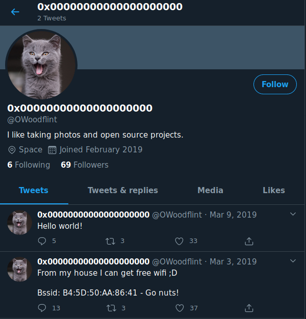
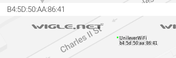
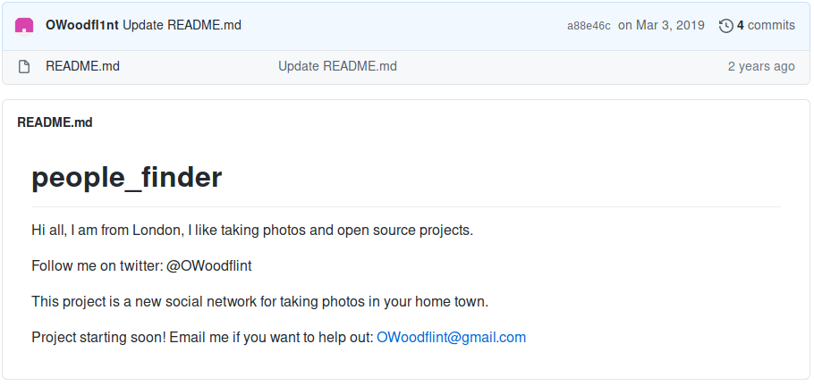

# OhSINT

Are you able to use open source intelligence to solve this challenge?

[OhSINT](https://tryhackme.com/room/ohsint)

## Topic's

- OSINT
- Steganography
- Passive Web Enumeration

## Appendix archive

Password: `1 kn0w 1 5h0uldn'7!`

## OhSINT

What information can you possible get with just one photo?

`exiftool WindowsXP.jpg`

```
ExifTool Version Number         : 12.06
File Name                       : WindowsXP.jpg
Directory                       : .
File Size                       : 229 kB
File Modification Date/Time     : 2020:09:27 19:15:39+02:00
File Access Date/Time           : 2020:09:27 19:16:08+02:00
File Inode Change Date/Time     : 2020:09:27 19:16:08+02:00
File Permissions                : rw-r--r--
File Type                       : JPEG
File Type Extension             : jpg
MIME Type                       : image/jpeg
XMP Toolkit                     : Image::ExifTool 11.27
GPS Latitude                    : 54 deg 17' 41.27" N
GPS Longitude                   : 2 deg 15' 1.33" W
Copyright                       : OWoodflint
Image Width                     : 1920
Image Height                    : 1080
Encoding Process                : Baseline DCT, Huffman coding
Bits Per Sample                 : 8
Color Components                : 3
Y Cb Cr Sub Sampling            : YCbCr4:2:0 (2 2)
Image Size                      : 1920x1080
Megapixels                      : 2.1
GPS Latitude Ref                : North
GPS Longitude Ref               : West
GPS Position                    : 54 deg 17' 41.27" N, 2 deg 15' 1.33" W
```

> Copyright : `OWoodflint`

- [Google Web Search](https://www.google.com/search?q=OWoodflint)
  - [Wordpress Blog](https://oliverwoodflint.wordpress.com/author/owoodflint/)
  - [Twitter Profil](https://twitter.com/owoodflint)
  - [GitHub Profil](https://github.com/OWoodfl1nt/people_finder)

1. What is this users avatar of?



`cat`

2. What city is this person in?

- Found BSSID on Twitter Profile: B4:5D:50:AA:86:41
- [Search BSSID: B4:5D:50:AA:86:41](https://wigle.net/mapsearch?maplat=51.25117512555836&maplon=0.847217358825052&mapzoom=8)

`London`

1. Whats the SSID of the WAP he connected to?



`UnileverWiFi`

1. What is his personal email address?



`OWoodflint@gmail.com`

5. What site did you find his email address on?

- [GitHub Profil](https://github.com/OWoodfl1nt/people_finder)

`Github`

1. Where has he gone on holiday?

- [Oliver Woodflint Blog](https://oliverwoodflint.wordpress.com/2019/03/03/the-journey-begins/)

`New York`

7. What is this persons password?

- [view-source](view-source:https://oliverwoodflint.wordpress.com/author/owoodflint/)

```html
<p style="color:#ffffff;" class="has-text-color">pennYDr0pper.!</p>
```

`pennYDr0pper.!`
