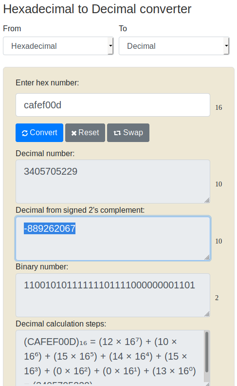

# Reversing ELF

Room for beginner Reverse Engineering CTF players

[Reversing ELF](https://tryhackme.com/room/reverselfiles)

## Topic's

- Reverse Engineering
- Cryptography
  - Base64
  - Hex

## Appendix archive

Password: `1 kn0w 1 5h0uldn'7!`

```
kali@kali:~/CTFs/tryhackme/Reversing ELF$ chmod +x crackme*
kali@kali:~/CTFs/tryhackme/Reversing ELF$ ls -la
total 92
drwxr-xr-x   2 kali kali 4096 Oct 18 20:24 .
drwxr-xr-x 150 kali kali 4096 Oct 18 20:20 ..
-rwxr-xr-x   1 kali kali 7192 Oct 18 20:21 crackme1
-rwxr-xr-x   1 kali kali 5884 Oct 18 20:22 crackme2
-rwxr-xr-x   1 kali kali 9632 Oct 18 20:24 crackme3
-rwxr-xr-x   1 kali kali 8740 Oct 18 20:24 crackme4
-rwxr-xr-x   1 kali kali 8968 Oct 18 20:24 crackme5
-rwxr-xr-x   1 kali kali 8635 Oct 18 20:24 crackme6
-rwxr-xr-x   1 kali kali 6372 Oct 18 20:23 crackme7
-rwxr-xr-x   1 kali kali 5884 Oct 18 20:23 crackme8
-rw-r--r--   1 kali kali  956 Oct 18 20:23 README.md
```

## Task 1 Crackme1

Let's start with a basic warmup, can you run the binary?

1. What is the flag?

```
kali@kali:~/CTFs/tryhackme/Reversing ELF$ ./crackme1
flag{not_that_kind_of_elf}
```

`flag{not_that_kind_of_elf}`

## Task 2 Crackme2

Find the super-secret password! and use it to obtain the flag

```
kali@kali:~/CTFs/tryhackme/Reversing ELF$ strings crackme2
/lib/ld-linux.so.2
libc.so.6
_IO_stdin_used
puts
printf
memset
strcmp
__libc_start_main
/usr/local/lib:$ORIGIN
__gmon_start__
GLIBC_2.0
PTRh
j3jA
[^_]
UWVS
t$,U
[^_]
Usage: %s password
super_secret_password
Access denied.
Access granted.
;*2$"(
GCC: (Ubuntu 5.4.0-6ubuntu1~16.04.9) 5.4.0 20160609
crtstuff.c
__JCR_LIST__
deregister_tm_clones
__do_global_dtors_aux
completed.7209
__do_global_dtors_aux_fini_array_entry
frame_dummy
__frame_dummy_init_array_entry
conditional1.c
giveFlag
__FRAME_END__
__JCR_END__
__init_array_end
_DYNAMIC
__init_array_start
__GNU_EH_FRAME_HDR
_GLOBAL_OFFSET_TABLE_
__libc_csu_fini
strcmp@@GLIBC_2.0
_ITM_deregisterTMCloneTable
__x86.get_pc_thunk.bx
printf@@GLIBC_2.0
_edata
__data_start
puts@@GLIBC_2.0
__gmon_start__
__dso_handle
_IO_stdin_used
__libc_start_main@@GLIBC_2.0
__libc_csu_init
memset@@GLIBC_2.0
_fp_hw
__bss_start
main
_Jv_RegisterClasses
__TMC_END__
_ITM_registerTMCloneTable
.symtab
.strtab
.shstrtab
.interp
.note.ABI-tag
.note.gnu.build-id
.gnu.hash
.dynsym
.dynstr
.gnu.version
.gnu.version_r
.rel.dyn
.rel.plt
.init
.plt.got
.text
.fini
.rodata
.eh_frame_hdr
.eh_frame
.init_array
.fini_array
.jcr
.dynamic
.got.plt
.data
.bss
.comment
```

1. What is the super secret password ?

`super_secret_password`

2. What is the flag ?

```
kali@kali:~/CTFs/tryhackme/Reversing ELF$ ./crackme2 super_secret_password
Access granted.
flag{if_i_submit_this_flag_then_i_will_get_points}
```

`flag{if_i_submit_this_flag_then_i_will_get_points}`

## Task 3 Crackme3

Use basic reverse engineering skills to obtain the flag

```
kali@kali:~/CTFs/tryhackme/Reversing ELF$ strings crackme3
/lib/ld-linux.so.2
__gmon_start__
libc.so.6
_IO_stdin_used
puts
strlen
malloc
stderr
fwrite
fprintf
strcmp
__libc_start_main
GLIBC_2.0
PTRh
iD$$
D$,;D$
UWVS
[^_]
Usage: %s PASSWORD
malloc failed
ZjByX3kwdXJfNWVjMG5kX2xlNTVvbl91bmJhc2U2NF80bGxfN2gzXzdoMW5nNQ==
Correct password!
Come on, even my aunt Mildred got this one!
ABCDEFGHIJKLMNOPQRSTUVWXYZabcdefghijklmnopqrstuvwxyz0123456789+/
;*2$"8
GCC: (Ubuntu/Linaro 4.6.3-1ubuntu5) 4.6.3
.shstrtab
.interp
.note.ABI-tag
.note.gnu.build-id
.gnu.hash
.dynsym
.dynstr
.gnu.version
.gnu.version_r
.rel.dyn
.rel.plt
.init
.text
.fini
.rodata
.eh_frame_hdr
.eh_frame
.ctors
.dtors
.jcr
.dynamic
.got
.got.plt
.data
.bss
.comment
```

1. What is the flag?

```
kali@kali:~/CTFs/tryhackme/Reversing ELF$ echo 'ZjByX3kwdXJfNWVjMG5kX2xlNTVvbl91bmJhc2U2NF80bGxfN2gzXzdoMW5nNQ==' | base64 -d
f0r_y0ur_5ec0nd_le55on_unbase64_4ll_7h3_7h1ng5
```

`f0r_y0ur_5ec0nd_le55on_unbase64_4ll_7h3_7h1ng5`

## Task 4 Crackme4

Analyze and find the password for the binary?

```
kali@kali:~/CTFs/tryhackme/Reversing ELF$ r2 -d crackme4
Process with PID 16212 started...
= attach 16212 16212
bin.baddr 0x00400000
Using 0x400000
asm.bits 64
Warning: r_bin_file_hash: file exceeds bin.hashlimit
[0x7faccdd68090]> aaa
[x] Analyze all flags starting with sym. and entry0 (aa)
[x] Analyze function calls (aac)
[x] Analyze len bytes of instructions for references (aar)
[x] Check for objc references
[x] Check for vtables
[TOFIX: aaft can't run in debugger mode.ions (aaft)
[x] Type matching analysis for all functions (aaft)
[x] Propagate noreturn information
[x] Use -AA or aaaa to perform additional experimental analysis.
[0x7faccdd68090]> afl
0x00400540    1 41           entry0
0x00400510    1 6            sym.imp.__libc_start_main
0x00400570    4 41           sym.deregister_tm_clones
0x004005a0    4 57           sym.register_tm_clones
0x004005e0    3 28           entry.fini0
0x00400600    4 45   -> 42   entry.init0
0x004007d0    1 2            sym.__libc_csu_fini
0x0040062d    4 77           sym.get_pwd
0x004007d4    1 9            sym._fini
0x0040067a    6 156          sym.compare_pwd
0x00400760    4 101          sym.__libc_csu_init
0x00400716    4 74           main
0x004004b0    3 26           sym._init
0x00400530    1 6            loc.imp.__gmon_start
0x004004e0    1 6            sym.imp.puts
0x004004f0    1 6            sym.imp.__stack_chk_fail
0x00400500    1 6            sym.imp.printf
0x00400520    1 6            sym.imp.strcmp
[0x7faccdd68090]> pdf @main
            ; DATA XREF from entry0 @ 0x40055d
┌ 74: int main (int argc, char **argv, char **envp);
│           ; var int64_t var_10h @ rbp-0x10
│           ; var int64_t var_4h @ rbp-0x4
│           ; arg int argc @ rdi
│           ; arg char **argv @ rsi
│           0x00400716      55             push rbp
│           0x00400717      4889e5         mov rbp, rsp
│           0x0040071a      4883ec10       sub rsp, 0x10
│           0x0040071e      897dfc         mov dword [var_4h], edi     ; argc
│           0x00400721      488975f0       mov qword [var_10h], rsi    ; argv
│           0x00400725      837dfc02       cmp dword [var_4h], 2
│       ┌─< 0x00400729      741b           je 0x400746
│       │   0x0040072b      488b45f0       mov rax, qword [var_10h]
│       │   0x0040072f      488b00         mov rax, qword [rax]
│       │   0x00400732      4889c6         mov rsi, rax
│       │   0x00400735      bf10084000     mov edi, str.Usage_:__s_password__This_time_the_string_is_hidden_and_we_used_strcmp ; 0x400810 ; "Usage : %s password\nThis time the string is hidden and we used strcmp\n"
│       │   0x0040073a      b800000000     mov eax, 0
│       │   0x0040073f      e8bcfdffff     call sym.imp.printf         ; int printf(const char *format)
│      ┌──< 0x00400744      eb13           jmp 0x400759
│      │└─> 0x00400746      488b45f0       mov rax, qword [var_10h]
│      │    0x0040074a      4883c008       add rax, 8
│      │    0x0040074e      488b00         mov rax, qword [rax]
│      │    0x00400751      4889c7         mov rdi, rax
│      │    0x00400754      e821ffffff     call sym.compare_pwd
│      │    ; CODE XREF from main @ 0x400744
│      └──> 0x00400759      b800000000     mov eax, 0
│           0x0040075e      c9             leave
└           0x0040075f      c3             ret
[0x7faccdd68090]> psf @ sym.
sym..comment                sym..interp                 sym..note.ABI_tag           sym..note.gnu.build_id      sym..gnu.hash
sym..dynsym                 sym..dynstr                 sym..gnu.version            sym..gnu.version_r          sym..rela.dyn
sym..rela.plt               sym..init                   sym._init                   sym..plt                    sym.imp.puts
sym.imp.__stack_chk_fail    sym.imp.printf              sym.imp.__libc_start_main   sym.imp.strcmp              sym..text
sym._start                  sym.deregister_tm_clones    sym.register_tm_clones      sym.__do_global_dtors_aux   sym.frame_dummy
sym.get_pwd                 sym.compare_pwd             sym.main                    sym.__libc_csu_init         sym.__libc_csu_fini
sym..fini                   sym._fini                   sym..rodata                 sym..eh_frame_hdr           sym..eh_frame
sym..init_array             sym..fini_array             sym..jcr                    sym..dynamic                sym..got
sym..got.plt                sym..data                   sym..bss
[0x7faccdd68090]> psf @ sym.compare_pwd
UH\x89\xe5H\x83\xec0H\x89}\xd8dH\x8b\x04%(
[0x7faccdd68090]> pdf @sym.compare_pwd
            ; CALL XREF from main @ 0x400754
┌ 156: sym.compare_pwd (int64_t arg1);
│           ; var int64_t var_28h @ rbp-0x28
│           ; var int64_t var_20h @ rbp-0x20
│           ; var int64_t var_18h @ rbp-0x18
│           ; var int64_t var_10h @ rbp-0x10
│           ; var int64_t var_eh @ rbp-0xe
│           ; var int64_t var_8h @ rbp-0x8
│           ; arg int64_t arg1 @ rdi
│           0x0040067a      55             push rbp
│           0x0040067b      4889e5         mov rbp, rsp
│           0x0040067e      4883ec30       sub rsp, 0x30
│           0x00400682      48897dd8       mov qword [var_28h], rdi    ; arg1
│           0x00400686      64488b042528.  mov rax, qword fs:[0x28]
│           0x0040068f      488945f8       mov qword [var_8h], rax
│           0x00400693      31c0           xor eax, eax
│           0x00400695      48b8495d7b49.  movabs rax, 0x7b175614497b5d49
│           0x0040069f      488945e0       mov qword [var_20h], rax
│           0x004006a3      48b857414751.  movabs rax, 0x547b175651474157
│           0x004006ad      488945e8       mov qword [var_18h], rax
│           0x004006b1      66c745f05340   mov word [var_10h], 0x4053  ; 'S@'
│           0x004006b7      c645f200       mov byte [var_eh], 0
│           0x004006bb      488d45e0       lea rax, qword [var_20h]
│           0x004006bf      4889c7         mov rdi, rax
│           0x004006c2      e866ffffff     call sym.get_pwd
│           0x004006c7      488b55d8       mov rdx, qword [var_28h]
│           0x004006cb      488d45e0       lea rax, qword [var_20h]
│           0x004006cf      4889d6         mov rsi, rdx
│           0x004006d2      4889c7         mov rdi, rax
│           0x004006d5      e846feffff     call sym.imp.strcmp         ; int strcmp(const char *s1, const char *s2)
│           0x004006da      85c0           test eax, eax
│       ┌─< 0x004006dc      750c           jne 0x4006ea
│       │   0x004006de      bfe8074000     mov edi, str.password_OK    ; 0x4007e8 ; "password OK"
│       │   0x004006e3      e8f8fdffff     call sym.imp.puts           ; int puts(const char *s)
│      ┌──< 0x004006e8      eb16           jmp 0x400700
│      │└─> 0x004006ea      488b45d8       mov rax, qword [var_28h]
│      │    0x004006ee      4889c6         mov rsi, rax
│      │    0x004006f1      bff4074000     mov edi, str.password___s__not_OK ; 0x4007f4 ; "password \"%s\" not OK\n"
│      │    0x004006f6      b800000000     mov eax, 0
│      │    0x004006fb      e800feffff     call sym.imp.printf         ; int printf(const char *format)
│      │    ; CODE XREF from sym.compare_pwd @ 0x4006e8
│      └──> 0x00400700      488b45f8       mov rax, qword [var_8h]
│           0x00400704      644833042528.  xor rax, qword fs:[0x28]
│       ┌─< 0x0040070d      7405           je 0x400714
│       │   0x0040070f      e8dcfdffff     call sym.imp.__stack_chk_fail ; void __stack_chk_fail(void)
│       └─> 0x00400714      c9             leave
└           0x00400715      c3             ret
[0x7faccdd68090]> db 0x004006d2
[0x7faccdd68090]> dc
Usage : ./crackme4 password
This time the string is hidden and we used strcmp
[0x7faccdc54759]> ood 'argument'
PTRACE_CONT: No such process
child received signal 9
Process with PID 16229 started...
= attach 16229 16229
File dbg:///home/kali/CTFs/tryhackme/Reversing\ ELF/crackme4  'argument' reopened in read-write mode
Unable to find filedescriptor 3
Unable to find filedescriptor 3
16229
[0x7f7aadbef090]> db 0x004006d2
Breakpoint already set at this address.
Cannot set breakpoint at '0x004006d2'
[0x7f7aadbef090]> dc
hit breakpoint at: 4006d2
[0x004006d2]> px @rdi
- offset -       0 1  2 3  4 5  6 7  8 9  A B  C D  E F  0123456789ABCDEF
0x7ffd78dbed10  6d79 5f6d 3072 335f 7365 6375 7233 5f70  my_m0r3_secur3_p
0x7ffd78dbed20  7764 0000 0000 0000 00a9 aa1f 41f1 ea4a  wd..........A..J
0x7ffd78dbed30  50ed db78 fd7f 0000 5907 4000 0000 0000  P..x....Y.@.....
0x7ffd78dbed40  48ee db78 fd7f 0000 0000 0000 0200 0000  H..x............
0x7ffd78dbed50  6007 4000 0000 0000 ca6c a3ad 7a7f 0000  `.@......l..z...
0x7ffd78dbed60  48ee db78 fd7f 0000 0000 0000 0200 0000  H..x............
0x7ffd78dbed70  1607 4000 0000 0000 0000 0000 0000 0000  ..@.............
0x7ffd78dbed80  0000 0000 0000 0000 720d 5f63 5ce5 f87a  ........r._c\..z
0x7ffd78dbed90  4005 4000 0000 0000 0000 0000 0000 0000  @.@.............
0x7ffd78dbeda0  0000 0000 0000 0000 0000 0000 0000 0000  ................
0x7ffd78dbedb0  720d 5fb7 6b14 0285 720d 99b4 9abe 0d84  r._.k...r.......
0x7ffd78dbedc0  0000 0000 0000 0000 0000 0000 0000 0000  ................
0x7ffd78dbedd0  0000 0000 0000 0000 0000 0000 0000 0000  ................
0x7ffd78dbede0  0000 0000 0000 0000 0000 0000 0000 0000  ................
0x7ffd78dbedf0  0000 0000 0000 0000 0000 0000 0000 0000  ................
0x7ffd78dbee00  0000 0000 0000 0000 4005 4000 0000 0000  ........@.@.....
```

1. What is the password ?

`my_m0r3_secur3_pwd`

## Task 5 Crackme5

What will be the input of the file to get output Good game ?

```
kali@kali:~/CTFs/tryhackme/Reversing ELF$ ./crackme5
Enter your input:
test
Always dig deeper
```

```
kali@kali:~/CTFs/tryhackme/Reversing ELF$ r2 -d crackme5
Process with PID 16279 started...
= attach 16279 16279
bin.baddr 0x00400000
Using 0x400000
asm.bits 64
Warning: r_bin_file_hash: file exceeds bin.hashlimit
[0x7f2bf6774090]> aaa
[x] Analyze all flags starting with sym. and entry0 (aa)
[x] Analyze function calls (aac)
[x] Analyze len bytes of instructions for references (aar)
[x] Check for objc references
[x] Check for vtables
[TOFIX: aaft can't run in debugger mode.ions (aaft)
[x] Type matching analysis for all functions (aaft)
[x] Propagate noreturn information
[x] Use -AA or aaaa to perform additional experimental analysis.
[0x7f2bf6774090]> afl
0x004005e0    1 41           entry0
0x004005a0    1 6            sym.imp.__libc_start_main
0x00400610    4 50   -> 41   sym.deregister_tm_clones
0x00400650    4 58   -> 55   sym.register_tm_clones
0x00400690    3 28           entry.fini0
0x004006b0    4 38   -> 35   entry.init0
0x00400940    1 2            sym.__libc_csu_fini
0x00400944    1 9            sym._fini
0x004006d6    7 157          sym.strcmp
0x004008d0    4 101          sym.__libc_csu_init
0x00400773    6 251          main
0x0040086e    4 93           sym.check
0x00400528    3 26           sym._init
0x00400560    1 6            sym.imp.strncmp
0x00400570    1 6            sym.imp.puts
0x00400580    1 6            sym.imp.strlen
0x00400590    1 6            sym.imp.__stack_chk_fail
0x004005b0    1 6            sym.imp.atoi
0x004005c0    1 6            sym.imp.__isoc99_scanf
[0x7f2bf6774090]> pdf @main
            ; DATA XREF from entry0 @ 0x4005fd
            ; CALL XREF from sym.check @ 0x4008c3
┌ 251: int main (int argc, char **argv, char **envp);
│           ; var int64_t var_70h @ rbp-0x70
│           ; var int64_t var_64h @ rbp-0x64
│           ; var int64_t var_54h @ rbp-0x54
│           ; var int64_t var_50h @ rbp-0x50
│           ; var int64_t var_30h @ rbp-0x30
│           ; var int64_t var_2fh @ rbp-0x2f
│           ; var int64_t var_2eh @ rbp-0x2e
│           ; var int64_t var_2dh @ rbp-0x2d
│           ; var int64_t var_2ch @ rbp-0x2c
│           ; var int64_t var_2bh @ rbp-0x2b
│           ; var int64_t var_2ah @ rbp-0x2a
│           ; var int64_t var_29h @ rbp-0x29
│           ; var int64_t var_28h @ rbp-0x28
│           ; var int64_t var_27h @ rbp-0x27
│           ; var int64_t var_26h @ rbp-0x26
│           ; var int64_t var_25h @ rbp-0x25
│           ; var int64_t var_24h @ rbp-0x24
│           ; var int64_t var_23h @ rbp-0x23
│           ; var int64_t var_22h @ rbp-0x22
│           ; var int64_t var_21h @ rbp-0x21
│           ; var int64_t var_20h @ rbp-0x20
│           ; var int64_t var_1fh @ rbp-0x1f
│           ; var int64_t var_1eh @ rbp-0x1e
│           ; var int64_t var_1dh @ rbp-0x1d
│           ; var int64_t var_1ch @ rbp-0x1c
│           ; var int64_t var_1bh @ rbp-0x1b
│           ; var int64_t var_1ah @ rbp-0x1a
│           ; var int64_t var_19h @ rbp-0x19
│           ; var int64_t var_18h @ rbp-0x18
│           ; var int64_t var_17h @ rbp-0x17
│           ; var int64_t var_16h @ rbp-0x16
│           ; var int64_t var_15h @ rbp-0x15
│           ; var int64_t var_8h @ rbp-0x8
│           ; arg int argc @ rdi
│           ; arg char **argv @ rsi
│           0x00400773      55             push rbp
│           0x00400774      4889e5         mov rbp, rsp
│           0x00400777      4883ec70       sub rsp, 0x70
│           0x0040077b      897d9c         mov dword [var_64h], edi    ; argc
│           0x0040077e      48897590       mov qword [var_70h], rsi    ; argv
│           0x00400782      64488b042528.  mov rax, qword fs:[0x28]
│           0x0040078b      488945f8       mov qword [var_8h], rax
│           0x0040078f      31c0           xor eax, eax
│           0x00400791      c645d04f       mov byte [var_30h], 0x4f    ; 'O' ; 79
│           0x00400795      c645d166       mov byte [var_2fh], 0x66    ; 'f' ; 102
│           0x00400799      c645d264       mov byte [var_2eh], 0x64    ; 'd' ; 100
│           0x0040079d      c645d36c       mov byte [var_2dh], 0x6c    ; 'l' ; 108
│           0x004007a1      c645d444       mov byte [var_2ch], 0x44    ; 'D' ; 68
│           0x004007a5      c645d553       mov byte [var_2bh], 0x53    ; 'S' ; 83
│           0x004007a9      c645d641       mov byte [var_2ah], 0x41    ; 'A' ; 65
│           0x004007ad      c645d77c       mov byte [var_29h], 0x7c    ; '|' ; 124
│           0x004007b1      c645d833       mov byte [var_28h], 0x33    ; '3' ; 51
│           0x004007b5      c645d974       mov byte [var_27h], 0x74    ; 't' ; 116
│           0x004007b9      c645da58       mov byte [var_26h], 0x58    ; 'X' ; 88
│           0x004007bd      c645db62       mov byte [var_25h], 0x62    ; 'b' ; 98
│           0x004007c1      c645dc33       mov byte [var_24h], 0x33    ; '3' ; 51
│           0x004007c5      c645dd32       mov byte [var_23h], 0x32    ; '2' ; 50
│           0x004007c9      c645de7e       mov byte [var_22h], 0x7e    ; '~' ; 126
│           0x004007cd      c645df58       mov byte [var_21h], 0x58    ; 'X' ; 88
│           0x004007d1      c645e033       mov byte [var_20h], 0x33    ; '3' ; 51
│           0x004007d5      c645e174       mov byte [var_1fh], 0x74    ; 't' ; 116
│           0x004007d9      c645e258       mov byte [var_1eh], 0x58    ; 'X' ; 88
│           0x004007dd      c645e340       mov byte [var_1dh], 0x40    ; '@' ; 64
│           0x004007e1      c645e473       mov byte [var_1ch], 0x73    ; 's' ; 115
│           0x004007e5      c645e558       mov byte [var_1bh], 0x58    ; 'X' ; 88
│           0x004007e9      c645e660       mov byte [var_1ah], 0x60    ; '`' ; 96
│           0x004007ed      c645e734       mov byte [var_19h], 0x34    ; '4' ; 52
│           0x004007f1      c645e874       mov byte [var_18h], 0x74    ; 't' ; 116
│           0x004007f5      c645e958       mov byte [var_17h], 0x58    ; 'X' ; 88
│           0x004007f9      c645ea74       mov byte [var_16h], 0x74    ; 't' ; 116
│           0x004007fd      c645eb7a       mov byte [var_15h], 0x7a    ; 'z' ; 122
│           0x00400801      bf54094000     mov edi, str.Enter_your_input: ; 0x400954 ; "Enter your input:"
│           0x00400806      e865fdffff     call sym.imp.puts           ; int puts(const char *s)
│           0x0040080b      488d45b0       lea rax, qword [var_50h]
│           0x0040080f      4889c6         mov rsi, rax
│           0x00400812      bf66094000     mov edi, 0x400966
│           0x00400817      b800000000     mov eax, 0
│           0x0040081c      e89ffdffff     call sym.imp.__isoc99_scanf ; int scanf(const char *format)
│           0x00400821      488d55d0       lea rdx, qword [var_30h]
│           0x00400825      488d45b0       lea rax, qword [var_50h]
│           0x00400829      4889d6         mov rsi, rdx
│           0x0040082c b    4889c7         mov rdi, rax
│           0x0040082f      e8a2feffff     call sym.strcmp             ; int strcmp(const char *s1, const char *s2)
│           0x00400834      8945ac         mov dword [var_54h], eax
│           0x00400837      837dac00       cmp dword [var_54h], 0
│       ┌─< 0x0040083b      750c           jne 0x400849
│       │   0x0040083d      bf69094000     mov edi, str.Good_game      ; 0x400969 ; "Good game"
│       │   0x00400842      e829fdffff     call sym.imp.puts           ; int puts(const char *s)
│      ┌──< 0x00400847      eb0a           jmp 0x400853
│      │└─> 0x00400849      bf73094000     mov edi, str.Always_dig_deeper ; 0x400973 ; "Always dig deeper"
│      │    0x0040084e      e81dfdffff     call sym.imp.puts           ; int puts(const char *s)
│      │    ; CODE XREF from main @ 0x400847
│      └──> 0x00400853      b800000000     mov eax, 0
│           0x00400858      488b4df8       mov rcx, qword [var_8h]
│           0x0040085c      6448330c2528.  xor rcx, qword fs:[0x28]
│       ┌─< 0x00400865      7405           je 0x40086c
│       │   0x00400867      e824fdffff     call sym.imp.__stack_chk_fail ; void __stack_chk_fail(void)
│       └─> 0x0040086c      c9             leave
└           0x0040086d      c3             ret
[0x7f2bf6774090]> db 0x0040082c
[0x7f2bf6774090]> dc
Enter your input:
test
hit breakpoint at: 40082c
[0x0040082c]> px @rsi
- offset -       0 1  2 3  4 5  6 7  8 9  A B  C D  E F  0123456789ABCDEF
0x7ffceb8b40e0  4f66 646c 4453 417c 3374 5862 3332 7e58  OfdlDSA|3tXb32~X
0x7ffceb8b40f0  3374 5840 7358 6034 7458 747a 0000 0000  3tX@sX`4tXtz....
0x7ffceb8b4100  0042 8beb fc7f 0000 003b dea8 9703 1c9d  .B.......;......
0x7ffceb8b4110  d008 4000 0000 0000 cabc 5bf6 2b7f 0000  ..@.......[.+...
0x7ffceb8b4120  0842 8beb fc7f 0000 0000 0000 0100 0000  .B..............
0x7ffceb8b4130  7307 4000 0000 0000 0000 0000 0000 0000  s.@.............
0x7ffceb8b4140  0000 0000 0000 0000 ba8c 3f6a f4d1 8b6a  ..........?j...j
0x7ffceb8b4150  e005 4000 0000 0000 0000 0000 0000 0000  ..@.............
0x7ffceb8b4160  0000 0000 0000 0000 0000 0000 0000 0000  ................
0x7ffceb8b4170  ba8c dff9 6206 7295 ba8c 9902 c33d dc94  ....b.r......=..
0x7ffceb8b4180  0000 0000 0000 0000 0000 0000 0000 0000  ................
0x7ffceb8b4190  0000 0000 0000 0000 0000 0000 0000 0000  ................
0x7ffceb8b41a0  0000 0000 0000 0000 0000 0000 0000 0000  ................
0x7ffceb8b41b0  0000 0000 0000 0000 0000 0000 0000 0000  ................
0x7ffceb8b41c0  0000 0000 0000 0000 e005 4000 0000 0000  ..........@.....
0x7ffceb8b41d0  0042 8beb fc7f 0000 0000 0000 0000 0000  .B..............
```

1. What is the input ?

```
kali@kali:~/CTFs/tryhackme/Reversing ELF$ ./crackme5
Enter your input:
OfdlDSA|3tXb32~X3tX@sX`4tXtz
Good game
```

`OfdlDSA|3tXb32~X3tX@sX`4tXtz`

## Task 6 Crackme6

Analyze the binary for the easy password

```
kali@kali:~/CTFs/tryhackme/Reversing ELF$ r2 -d crackme6
Process with PID 16349 started...
= attach 16349 16349
bin.baddr 0x00400000
Using 0x400000
asm.bits 64
Warning: r_bin_file_hash: file exceeds bin.hashlimit
[0x7ff486423090]> aaa
[x] Analyze all flags starting with sym. and entry0 (aa)
[x] Analyze function calls (aac)
[x] Analyze len bytes of instructions for references (aar)
[x] Check for objc references
[x] Check for vtables
[TOFIX: aaft can't run in debugger mode.ions (aaft)
[x] Type matching analysis for all functions (aaft)
[x] Propagate noreturn information
[x] Use -AA or aaaa to perform additional experimental analysis.
[0x7ff486423090]> afl
0x00400490    1 41           entry0
0x00400470    1 6            sym.imp.__libc_start_main
0x004004c0    4 41           sym.deregister_tm_clones
0x004004f0    4 57           sym.register_tm_clones
0x00400530    3 28           entry.fini0
0x00400550    4 45   -> 42   entry.init0
0x004007d0    1 2            sym.__libc_csu_fini
0x004007d4    1 9            sym._fini
0x004006d1    4 64           sym.compare_pwd
0x00400760    4 101          sym.__libc_csu_init
0x00400711    4 74           main
0x0040057d   28 340          sym.my_secure_test
0x00400418    3 26           sym._init
0x00400480    1 6            loc.imp.__gmon_start
0x00400450    1 6            sym.imp.puts
0x00400460    1 6            sym.imp.printf
[0x7ff486423090]> pdf @main
            ; DATA XREF from entry0 @ 0x4004ad
┌ 74: int main (int argc, char **argv, char **envp);
│           ; var int64_t var_10h @ rbp-0x10
│           ; var int64_t var_4h @ rbp-0x4
│           ; arg int argc @ rdi
│           ; arg char **argv @ rsi
│           0x00400711      55             push rbp
│           0x00400712      4889e5         mov rbp, rsp
│           0x00400715      4883ec10       sub rsp, 0x10
│           0x00400719      897dfc         mov dword [var_4h], edi     ; argc
│           0x0040071c      488975f0       mov qword [var_10h], rsi    ; argv
│           0x00400720      837dfc02       cmp dword [var_4h], 2
│       ┌─< 0x00400724      741b           je 0x400741
│       │   0x00400726      488b45f0       mov rax, qword [var_10h]
│       │   0x0040072a      488b00         mov rax, qword [rax]
│       │   0x0040072d      4889c6         mov rsi, rax
│       │   0x00400730      bf10084000     mov edi, str.Usage_:__s_password__Good_luck__read_the_source ; 0x400810 ; "Usage : %s password\nGood luck, read the source\n"
│       │   0x00400735      b800000000     mov eax, 0
│       │   0x0040073a      e821fdffff     call sym.imp.printf         ; int printf(const char *format)
│      ┌──< 0x0040073f      eb13           jmp 0x400754
│      │└─> 0x00400741      488b45f0       mov rax, qword [var_10h]
│      │    0x00400745      4883c008       add rax, 8
│      │    0x00400749      488b00         mov rax, qword [rax]
│      │    0x0040074c      4889c7         mov rdi, rax
│      │    0x0040074f      e87dffffff     call sym.compare_pwd
│      │    ; CODE XREF from main @ 0x40073f
│      └──> 0x00400754      b800000000     mov eax, 0
│           0x00400759      c9             leave
└           0x0040075a      c3             ret
[0x7ff486423090]> pdf @sym.comare_pwd
Invalid address (sym.comare_pwd)
|ERROR| Invalid command 'pdf @sym.comare_pwd' (0x70)
[0x7ff486423090]> pdf @sym.compare_pwd
            ; CALL XREF from main @ 0x40074f
┌ 64: sym.compare_pwd (int64_t arg1);
│           ; var int64_t var_8h @ rbp-0x8
│           ; arg int64_t arg1 @ rdi
│           0x004006d1      55             push rbp
│           0x004006d2      4889e5         mov rbp, rsp
│           0x004006d5      4883ec10       sub rsp, 0x10
│           0x004006d9      48897df8       mov qword [var_8h], rdi     ; arg1
│           0x004006dd      488b45f8       mov rax, qword [var_8h]
│           0x004006e1      4889c7         mov rdi, rax
│           0x004006e4      e894feffff     call sym.my_secure_test
│           0x004006e9      85c0           test eax, eax
│       ┌─< 0x004006eb      750c           jne 0x4006f9
│       │   0x004006ed      bfe8074000     mov edi, str.password_OK    ; 0x4007e8 ; "password OK"
│       │   0x004006f2      e859fdffff     call sym.imp.puts           ; int puts(const char *s)
│      ┌──< 0x004006f7      eb16           jmp 0x40070f
│      │└─> 0x004006f9      488b45f8       mov rax, qword [var_8h]
│      │    0x004006fd      4889c6         mov rsi, rax
│      │    0x00400700      bff4074000     mov edi, str.password___s__not_OK ; 0x4007f4 ; "password \"%s\" not OK\n"
│      │    0x00400705      b800000000     mov eax, 0
│      │    0x0040070a      e851fdffff     call sym.imp.printf         ; int printf(const char *format)
│      │    ; CODE XREF from sym.compare_pwd @ 0x4006f7
│      └──> 0x0040070f      c9             leave
└           0x00400710      c3             ret
[0x7ff486423090]> pdf @sym.my_secure_test
            ; CALL XREF from sym.compare_pwd @ 0x4006e4
┌ 340: sym.my_secure_test (int64_t arg1);
│           ; var int64_t var_8h @ rbp-0x8
│           ; arg int64_t arg1 @ rdi
│           0x0040057d      55             push rbp
│           0x0040057e      4889e5         mov rbp, rsp
│           0x00400581      48897df8       mov qword [var_8h], rdi     ; arg1
│           0x00400585      488b45f8       mov rax, qword [var_8h]
│           0x00400589      0fb600         movzx eax, byte [rax]
│           0x0040058c      84c0           test al, al
│       ┌─< 0x0040058e      740b           je 0x40059b
│       │   0x00400590      488b45f8       mov rax, qword [var_8h]
│       │   0x00400594      0fb600         movzx eax, byte [rax]
│       │   0x00400597      3c31           cmp al, 0x31                ; 49
│      ┌──< 0x00400599      740a           je 0x4005a5
│      │└─> 0x0040059b      b8ffffffff     mov eax, 0xffffffff         ; -1
│      │┌─< 0x004005a0      e92a010000     jmp 0x4006cf
│      └──> 0x004005a5      488b45f8       mov rax, qword [var_8h]
│       │   0x004005a9      4883c001       add rax, 1
│       │   0x004005ad      0fb600         movzx eax, byte [rax]
│       │   0x004005b0      84c0           test al, al
│      ┌──< 0x004005b2      740f           je 0x4005c3
│      ││   0x004005b4      488b45f8       mov rax, qword [var_8h]
│      ││   0x004005b8      4883c001       add rax, 1
│      ││   0x004005bc      0fb600         movzx eax, byte [rax]
│      ││   0x004005bf      3c33           cmp al, 0x33                ; 51
│     ┌───< 0x004005c1      740a           je 0x4005cd
│     │└──> 0x004005c3      b8ffffffff     mov eax, 0xffffffff         ; -1
│     │┌──< 0x004005c8      e902010000     jmp 0x4006cf
│     └───> 0x004005cd      488b45f8       mov rax, qword [var_8h]
│      ││   0x004005d1      4883c002       add rax, 2
│      ││   0x004005d5      0fb600         movzx eax, byte [rax]
│      ││   0x004005d8      84c0           test al, al
│     ┌───< 0x004005da      740f           je 0x4005eb
│     │││   0x004005dc      488b45f8       mov rax, qword [var_8h]
│     │││   0x004005e0      4883c002       add rax, 2
│     │││   0x004005e4      0fb600         movzx eax, byte [rax]
│     │││   0x004005e7      3c33           cmp al, 0x33                ; 51
│    ┌────< 0x004005e9      740a           je 0x4005f5
│    │└───> 0x004005eb      b8ffffffff     mov eax, 0xffffffff         ; -1
│    │┌───< 0x004005f0      e9da000000     jmp 0x4006cf
│    └────> 0x004005f5      488b45f8       mov rax, qword [var_8h]
│     │││   0x004005f9      4883c003       add rax, 3
│     │││   0x004005fd      0fb600         movzx eax, byte [rax]
│     │││   0x00400600      84c0           test al, al
│    ┌────< 0x00400602      740f           je 0x400613
│    ││││   0x00400604      488b45f8       mov rax, qword [var_8h]
│    ││││   0x00400608      4883c003       add rax, 3
│    ││││   0x0040060c      0fb600         movzx eax, byte [rax]
│    ││││   0x0040060f      3c37           cmp al, 0x37                ; 55
│   ┌─────< 0x00400611      740a           je 0x40061d
│   │└────> 0x00400613      b8ffffffff     mov eax, 0xffffffff         ; -1
│   │┌────< 0x00400618      e9b2000000     jmp 0x4006cf
│   └─────> 0x0040061d      488b45f8       mov rax, qword [var_8h]
│    ││││   0x00400621      4883c004       add rax, 4
│    ││││   0x00400625      0fb600         movzx eax, byte [rax]
│    ││││   0x00400628      84c0           test al, al
│   ┌─────< 0x0040062a      740f           je 0x40063b
│   │││││   0x0040062c      488b45f8       mov rax, qword [var_8h]
│   │││││   0x00400630      4883c004       add rax, 4
│   │││││   0x00400634      0fb600         movzx eax, byte [rax]
│   │││││   0x00400637      3c5f           cmp al, 0x5f                ; 95
│  ┌──────< 0x00400639      740a           je 0x400645
│  │└─────> 0x0040063b      b8ffffffff     mov eax, 0xffffffff         ; -1
│  │┌─────< 0x00400640      e98a000000     jmp 0x4006cf
│  └──────> 0x00400645      488b45f8       mov rax, qword [var_8h]
│   │││││   0x00400649      4883c005       add rax, 5
│   │││││   0x0040064d      0fb600         movzx eax, byte [rax]
│   │││││   0x00400650      84c0           test al, al
│  ┌──────< 0x00400652      740f           je 0x400663
│  ││││││   0x00400654      488b45f8       mov rax, qword [var_8h]
│  ││││││   0x00400658      4883c005       add rax, 5
│  ││││││   0x0040065c      0fb600         movzx eax, byte [rax]
│  ││││││   0x0040065f      3c70           cmp al, 0x70                ; 112
│ ┌───────< 0x00400661      7407           je 0x40066a
│ │└──────> 0x00400663      b8ffffffff     mov eax, 0xffffffff         ; -1
│ │┌──────< 0x00400668      eb65           jmp 0x4006cf
│ └───────> 0x0040066a      488b45f8       mov rax, qword [var_8h]
│  ││││││   0x0040066e      4883c006       add rax, 6
│  ││││││   0x00400672      0fb600         movzx eax, byte [rax]
│  ││││││   0x00400675      84c0           test al, al
│ ┌───────< 0x00400677      740f           je 0x400688
│ │││││││   0x00400679      488b45f8       mov rax, qword [var_8h]
│ │││││││   0x0040067d      4883c006       add rax, 6
│ │││││││   0x00400681      0fb600         movzx eax, byte [rax]
│ │││││││   0x00400684      3c77           cmp al, 0x77                ; 119
│ ────────< 0x00400686      7407           je 0x40068f
│ └───────> 0x00400688      b8ffffffff     mov eax, 0xffffffff         ; -1
│ ┌───────< 0x0040068d      eb40           jmp 0x4006cf
│ ────────> 0x0040068f      488b45f8       mov rax, qword [var_8h]
│ │││││││   0x00400693      4883c007       add rax, 7
│ │││││││   0x00400697      0fb600         movzx eax, byte [rax]
│ │││││││   0x0040069a      84c0           test al, al
│ ────────< 0x0040069c      740f           je 0x4006ad
│ │││││││   0x0040069e      488b45f8       mov rax, qword [var_8h]
│ │││││││   0x004006a2      4883c007       add rax, 7
│ │││││││   0x004006a6      0fb600         movzx eax, byte [rax]
│ │││││││   0x004006a9      3c64           cmp al, 0x64                ; 100
│ ────────< 0x004006ab      7407           je 0x4006b4
│ ────────> 0x004006ad      b8ffffffff     mov eax, 0xffffffff         ; -1
│ ────────< 0x004006b2      eb1b           jmp 0x4006cf
│ ────────> 0x004006b4      488b45f8       mov rax, qword [var_8h]
│ │││││││   0x004006b8      4883c008       add rax, 8
│ │││││││   0x004006bc      0fb600         movzx eax, byte [rax]
│ │││││││   0x004006bf      84c0           test al, al
│ ────────< 0x004006c1      7407           je 0x4006ca
│ │││││││   0x004006c3      b8ffffffff     mov eax, 0xffffffff         ; -1
│ ────────< 0x004006c8      eb05           jmp 0x4006cf
│ ────────> 0x004006ca      b800000000     mov eax, 0
│ │││││││   ; XREFS: CODE 0x004005a0  CODE 0x004005c8  CODE 0x004005f0  CODE 0x00400618  CODE 0x00400640  CODE 0x00400668
│ │││││││   ; XREFS: CODE 0x0040068d  CODE 0x004006b2  CODE 0x004006c8
│ └└└└└└└─> 0x004006cf      5d             pop rbp
└           0x004006d0      c3             ret
```

1. What is the password ?

```py
0x31
0x33
0x33
0x37
0x5f
0x70
0x77
0x64
```

```
kali@kali:~/CTFs/tryhackme/Reversing ELF$ ./crackme6 1337_pwd
password OK
```

`1337_pwd`

## Task 7 Crackme7

Analyze the binary to get the flag

```
kali@kali:~/CTFs/tryhackme/Reversing ELF$ r2 -d -A crackme7
Process with PID 16809 started...
= attach 16809 16809
bin.baddr 0x08048000
Using 0x8048000
asm.bits 32
glibc.fc_offset = 0x00148
Warning: r_bin_file_hash: file exceeds bin.hashlimit
[x] Analyze all flags starting with sym. and entry0 (aa)
[x] Analyze function calls (aac)
[x] Analyze len bytes of instructions for references (aar)
[x] Check for objc references
[x] Check for vtables
[TOFIX: aaft can't run in debugger mode.ions (aaft)
[x] Type matching analysis for all functions (aaft)
[x] Propagate noreturn information
[x] Use -AA or aaaa to perform additional experimental analysis.
[0xf7ee50b0]> pdf @main
            ; DATA XREF from entry0 @ 0x80483d7
┌ 491: int main (int argc, char **argv, char **envp);
│           ; var int32_t var_78h @ ebp-0x78
│           ; var int32_t var_14h @ ebp-0x14
│           ; var int32_t var_10h @ ebp-0x10
│           ; var int32_t var_ch @ ebp-0xc
│           ; var int32_t var_8h @ ebp-0x8
│           ; arg int32_t arg_4h @ esp+0x94
│           0x080484bb      8d4c2404       lea ecx, dword [arg_4h]
│           0x080484bf      83e4f0         and esp, 0xfffffff0
│           0x080484c2      ff71fc         push dword [ecx - 4]
│           0x080484c5      55             push ebp
│           0x080484c6      89e5           mov ebp, esp
│           0x080484c8      57             push edi
│           0x080484c9      51             push ecx
│           0x080484ca      83ec70         sub esp, 0x70
│           ; CODE XREFS from main @ 0x8048590, 0x8048643
│      ┌┌─> 0x080484cd      83ec0c         sub esp, 0xc
│      ╎╎   0x080484d0      68e0870408     push str.Menu:_____1__Say_hello___2__Add_numbers___3__Quit ; 0x80487e0 ; "Menu:\n\n[1] Say hello\n[2] Add numbers\n[3] Quit"
│      ╎╎   0x080484d5      e896feffff     call sym.imp.puts           ; int puts(const char *s)
│      ╎╎   0x080484da      83c410         add esp, 0x10
│      ╎╎   0x080484dd      83ec0c         sub esp, 0xc
│      ╎╎   0x080484e0      680e880408     push str.                   ; 0x804880e ; "\n[>] "
│      ╎╎   0x080484e5      e876feffff     call sym.imp.printf         ; int printf(const char *format)
│      ╎╎   0x080484ea      83c410         add esp, 0x10
│      ╎╎   0x080484ed      83ec08         sub esp, 8
│      ╎╎   0x080484f0      8d45f4         lea eax, dword [var_ch]
│      ╎╎   0x080484f3      50             push eax
│      ╎╎   0x080484f4      6814880408     push 0x8048814
│      ╎╎   0x080484f9      e8a2feffff     call sym.imp.__isoc99_scanf ; int scanf(const char *format)
│      ╎╎   0x080484fe      83c410         add esp, 0x10
│      ╎╎   0x08048501      83f801         cmp eax, 1                  ; 1
│     ┌───< 0x08048504      741a           je 0x8048520
│     │╎╎   0x08048506      83ec0c         sub esp, 0xc
│     │╎╎   0x08048509      6817880408     push str.Unknown_input      ; 0x8048817 ; "Unknown input!"
│     │╎╎   0x0804850e      e85dfeffff     call sym.imp.puts           ; int puts(const char *s)
│     │╎╎   0x08048513      83c410         add esp, 0x10
│     │╎╎   0x08048516      b801000000     mov eax, 1
│    ┌────< 0x0804851b      e97c010000     jmp 0x804869c
│    │└───> 0x08048520      8b45f4         mov eax, dword [var_ch]
│    │ ╎╎   0x08048523      83f801         cmp eax, 1                  ; 1
│    │┌───< 0x08048526      756d           jne 0x8048595
│    ││╎╎   0x08048528      83ec0c         sub esp, 0xc
│    ││╎╎   0x0804852b      6826880408     push str.What_is_your_name  ; 0x8048826 ; "What is your name? "
│    ││╎╎   0x08048530      e82bfeffff     call sym.imp.printf         ; int printf(const char *format)
│    ││╎╎   0x08048535      83c410         add esp, 0x10
│    ││╎╎   0x08048538      8d5588         lea edx, dword [var_78h]
│    ││╎╎   0x0804853b      b800000000     mov eax, 0
│    ││╎╎   0x08048540      b919000000     mov ecx, 0x19               ; 25
│    ││╎╎   0x08048545      89d7           mov edi, edx
│    ││╎╎   0x08048547      f3ab           rep stosd dword es:[edi], eax
│    ││╎╎   0x08048549      83ec08         sub esp, 8
│    ││╎╎   0x0804854c      8d4588         lea eax, dword [var_78h]
│    ││╎╎   0x0804854f      50             push eax
│    ││╎╎   0x08048550      683a880408     push str.99s                ; 0x804883a ; "%99s"
│    ││╎╎   0x08048555      e846feffff     call sym.imp.__isoc99_scanf ; int scanf(const char *format)
│    ││╎╎   0x0804855a      83c410         add esp, 0x10
│    ││╎╎   0x0804855d      83f801         cmp eax, 1                  ; 1
│   ┌─────< 0x08048560      741a           je 0x804857c
│   │││╎╎   0x08048562      83ec0c         sub esp, 0xc
│   │││╎╎   0x08048565      683f880408     push str.Unable_to_read_name ; 0x804883f ; "Unable to read name!"
│   │││╎╎   0x0804856a      e801feffff     call sym.imp.puts           ; int puts(const char *s)
│   │││╎╎   0x0804856f      83c410         add esp, 0x10
│   │││╎╎   0x08048572      b801000000     mov eax, 1
│  ┌──────< 0x08048577      e920010000     jmp 0x804869c
│  │└─────> 0x0804857c      83ec08         sub esp, 8
│  │ ││╎╎   0x0804857f      8d4588         lea eax, dword [var_78h]
│  │ ││╎╎   0x08048582      50             push eax
│  │ ││╎╎   0x08048583      6854880408     push str.Hello___s          ; 0x8048854 ; "Hello, %s!\n"
│  │ ││╎╎   0x08048588      e8d3fdffff     call sym.imp.printf         ; int printf(const char *format)
│  │ ││╎╎   0x0804858d      83c410         add esp, 0x10
│  │ ││└──< 0x08048590      e938ffffff     jmp 0x80484cd
│  │ │└───> 0x08048595      8b45f4         mov eax, dword [var_ch]
│  │ │  ╎   0x08048598      83f802         cmp eax, 2                  ; 2
│  │ │ ┌──< 0x0804859b      0f85a7000000   jne 0x8048648
│  │ │ │╎   0x080485a1      83ec0c         sub esp, 0xc
│  │ │ │╎   0x080485a4      6860880408     push str.Enter_first_number: ; 0x8048860 ; "Enter first number: "
│  │ │ │╎   0x080485a9      e8b2fdffff     call sym.imp.printf         ; int printf(const char *format)
│  │ │ │╎   0x080485ae      83c410         add esp, 0x10
│  │ │ │╎   0x080485b1      83ec08         sub esp, 8
│  │ │ │╎   0x080485b4      8d45f0         lea eax, dword [var_10h]
│  │ │ │╎   0x080485b7      50             push eax
│  │ │ │╎   0x080485b8      6875880408     push 0x8048875
│  │ │ │╎   0x080485bd      e8defdffff     call sym.imp.__isoc99_scanf ; int scanf(const char *format)
│  │ │ │╎   0x080485c2      83c410         add esp, 0x10
│  │ │ │╎   0x080485c5      83f801         cmp eax, 1                  ; 1
│  │ │┌───< 0x080485c8      741a           je 0x80485e4
│  │ │││╎   0x080485ca      83ec0c         sub esp, 0xc
│  │ │││╎   0x080485cd      6878880408     push str.Unable_to_read_number ; 0x8048878 ; "Unable to read number!"
│  │ │││╎   0x080485d2      e899fdffff     call sym.imp.puts           ; int puts(const char *s)
│  │ │││╎   0x080485d7      83c410         add esp, 0x10
│  │ │││╎   0x080485da      b801000000     mov eax, 1
│  │┌─────< 0x080485df      e9b8000000     jmp 0x804869c
│  │││└───> 0x080485e4      83ec0c         sub esp, 0xc
│  │││ │╎   0x080485e7      688f880408     push str.Enter_second_number: ; 0x804888f ; "Enter second number: "
│  │││ │╎   0x080485ec      e86ffdffff     call sym.imp.printf         ; int printf(const char *format)
│  │││ │╎   0x080485f1      83c410         add esp, 0x10
│  │││ │╎   0x080485f4      83ec08         sub esp, 8
│  │││ │╎   0x080485f7      8d45ec         lea eax, dword [var_14h]
│  │││ │╎   0x080485fa      50             push eax
│  │││ │╎   0x080485fb      6875880408     push 0x8048875
│  │││ │╎   0x08048600      e89bfdffff     call sym.imp.__isoc99_scanf ; int scanf(const char *format)
│  │││ │╎   0x08048605      83c410         add esp, 0x10
│  │││ │╎   0x08048608      83f801         cmp eax, 1                  ; 1
│  │││┌───< 0x0804860b      7417           je 0x8048624
│  │││││╎   0x0804860d      83ec0c         sub esp, 0xc
│  │││││╎   0x08048610      6878880408     push str.Unable_to_read_number ; 0x8048878 ; "Unable to read number!"
│  │││││╎   0x08048615      e856fdffff     call sym.imp.puts           ; int puts(const char *s)
│  │││││╎   0x0804861a      83c410         add esp, 0x10
│  │││││╎   0x0804861d      b801000000     mov eax, 1
│ ┌───────< 0x08048622      eb78           jmp 0x804869c
│ ││││└───> 0x08048624      8b55f0         mov edx, dword [var_10h]
│ ││││ │╎   0x08048627      8b45ec         mov eax, dword [var_14h]
│ ││││ │╎   0x0804862a      8d0c02         lea ecx, dword [edx + eax]
│ ││││ │╎   0x0804862d      8b55ec         mov edx, dword [var_14h]
│ ││││ │╎   0x08048630      8b45f0         mov eax, dword [var_10h]
│ ││││ │╎   0x08048633      51             push ecx
│ ││││ │╎   0x08048634      52             push edx
│ ││││ │╎   0x08048635      50             push eax
│ ││││ │╎   0x08048636      68a5880408     push str.d____d____d        ; 0x80488a5 ; "%d + %d = %d\n"
│ ││││ │╎   0x0804863b      e820fdffff     call sym.imp.printf         ; int printf(const char *format)
│ ││││ │╎   0x08048640      83c410         add esp, 0x10
│ ││││ │└─< 0x08048643      e985feffff     jmp 0x80484cd
│ ││││ └──> 0x08048648      8b45f4         mov eax, dword [var_ch]
│ ││││      0x0804864b      83f803         cmp eax, 3                  ; 3
│ ││││  ┌─< 0x0804864e      7512           jne 0x8048662
│ ││││  │   0x08048650      83ec0c         sub esp, 0xc
│ ││││  │   0x08048653      68b3880408     push str.Goodbye            ; 0x80488b3 ; "Goodbye!"
│ ││││  │   0x08048658      e813fdffff     call sym.imp.puts           ; int puts(const char *s)
│ ││││  │   0x0804865d      83c410         add esp, 0x10
│ ││││ ┌──< 0x08048660      eb35           jmp 0x8048697
│ ││││ │└─> 0x08048662      8b45f4         mov eax, dword [var_ch]
│ ││││ │    0x08048665      3d697a0000     cmp eax, 0x7a69
│ ││││ │┌─< 0x0804866a      7517           jne 0x8048683
│ ││││ ││   0x0804866c      83ec0c         sub esp, 0xc
│ ││││ ││   0x0804866f      68bc880408     push str.Wow_such_h4x0r     ; 0x80488bc ; "Wow such h4x0r!"
│ ││││ ││   0x08048674      e8f7fcffff     call sym.imp.puts           ; int puts(const char *s)
│ ││││ ││   0x08048679      83c410         add esp, 0x10
│ ││││ ││   0x0804867c      e825000000     call sym.giveFlag
│ ││││┌───< 0x08048681      eb14           jmp 0x8048697
│ ││││││└─> 0x08048683      8b45f4         mov eax, dword [var_ch]
│ ││││││    0x08048686      83ec08         sub esp, 8
│ ││││││    0x08048689      50             push eax
│ ││││││    0x0804868a      68cc880408     push str.Unknown_choice:__d ; 0x80488cc ; "Unknown choice: %d\n"
│ ││││││    0x0804868f      e8ccfcffff     call sym.imp.printf         ; int printf(const char *format)
│ ││││││    0x08048694      83c410         add esp, 0x10
│ ││││││    ; CODE XREFS from main @ 0x8048660, 0x8048681
│ ││││└└──> 0x08048697      b800000000     mov eax, 0
│ ││││      ; CODE XREFS from main @ 0x804851b, 0x8048577, 0x80485df, 0x8048622
│ └└└└────> 0x0804869c      8d65f8         lea esp, dword [var_8h]
│           0x0804869f      59             pop ecx
│           0x080486a0      5f             pop edi
│           0x080486a1      5d             pop ebp
│           0x080486a2      8d61fc         lea esp, dword [ecx - 4]
└           0x080486a5      c3             ret
```

```
│ ││││ │    0x08048665      3d697a0000     cmp eax, 0x7a69
│ ││││ │┌─< 0x0804866a      7517           jne 0x8048683
│ ││││ ││   0x0804866c      83ec0c         sub esp, 0xc
│ ││││ ││   0x0804866f      68bc880408     push str.Wow_such_h4x0r     ; 0x80488bc ; "Wow such h4x0r!"
```

1. What is the flag ?

```
kali@kali:~/CTFs/tryhackme/Reversing ELF$ python3
Python 3.8.2 (default, Apr  1 2020, 15:52:55)
[GCC 9.3.0] on linux
Type "help", "copyright", "credits" or "license" for more information.
>>> bytes.fromhex('7a69').decode('utf-8')
>>> print(int('7a69', 16))
31337
>>>
```

```
kali@kali:~/CTFs/tryhackme/Reversing ELF$ ./crackme7
Menu:

[1] Say hello
[2] Add numbers
[3] Quit

[>] zi
Unknown input!
kali@kali:~/CTFs/tryhackme/Reversing ELF$ ./crackme7
Menu:

[1] Say hello
[2] Add numbers
[3] Quit

[>] 31337
Wow such h4x0r!
flag{much_reversing_very_ida_wow}
```

`flag{much_reversing_very_ida_wow}`

## Task 8 Crackme8

Analyze the binary and obtain the flag

```
[0xf7ef50b0]> pdf @main
            ; DATA XREF from entry0 @ 0x80483b7
┌ 137: int main (int argc, char **argv, char **envp);
│           ; var int32_t var_4h @ ebp-0x4
│           ; arg int32_t arg_4h @ esp+0x24
│           0x0804849b      8d4c2404       lea ecx, dword [arg_4h]
│           0x0804849f      83e4f0         and esp, 0xfffffff0
│           0x080484a2      ff71fc         push dword [ecx - 4]
│           0x080484a5      55             push ebp
│           0x080484a6      89e5           mov ebp, esp
│           0x080484a8      51             push ecx
│           0x080484a9      83ec04         sub esp, 4
│           0x080484ac      89c8           mov eax, ecx
│           0x080484ae      833802         cmp dword [eax], 2
│       ┌─< 0x080484b1      741d           je 0x80484d0
│       │   0x080484b3      8b4004         mov eax, dword [eax + 4]
│       │   0x080484b6      8b00           mov eax, dword [eax]
│       │   0x080484b8      83ec08         sub esp, 8
│       │   0x080484bb      50             push eax
│       │   0x080484bc      6860860408     push str.Usage:__s_password ; 0x8048660 ; "Usage: %s password\n"
│       │   0x080484c1      e87afeffff     call sym.imp.printf         ; int printf(const char *format)
│       │   0x080484c6      83c410         add esp, 0x10
│       │   0x080484c9      b801000000     mov eax, 1
│      ┌──< 0x080484ce      eb4c           jmp 0x804851c
│      │└─> 0x080484d0      8b4004         mov eax, dword [eax + 4]
│      │    0x080484d3      83c004         add eax, 4
│      │    0x080484d6      8b00           mov eax, dword [eax]
│      │    0x080484d8      83ec0c         sub esp, 0xc
│      │    0x080484db      50             push eax
│      │    0x080484dc      e89ffeffff     call sym.imp.atoi           ; int atoi(const char *str)
│      │    0x080484e1      83c410         add esp, 0x10
│      │    0x080484e4      3d0df0feca     cmp eax, 0xcafef00d
│      │┌─< 0x080484e9      7417           je 0x8048502
│      ││   0x080484eb      83ec0c         sub esp, 0xc
│      ││   0x080484ee      6874860408     push str.Access_denied.     ; 0x8048674 ; "Access denied."
│      ││   0x080484f3      e858feffff     call sym.imp.puts           ; int puts(const char *s)
│      ││   0x080484f8      83c410         add esp, 0x10
│      ││   0x080484fb      b801000000     mov eax, 1
│     ┌───< 0x08048500      eb1a           jmp 0x804851c
│     ││└─> 0x08048502      83ec0c         sub esp, 0xc
│     ││    0x08048505      6883860408     push str.Access_granted.    ; 0x8048683 ; "Access granted."
│     ││    0x0804850a      e841feffff     call sym.imp.puts           ; int puts(const char *s)
│     ││    0x0804850f      83c410         add esp, 0x10
│     ││    0x08048512      e80d000000     call sym.giveFlag
│     ││    0x08048517      b800000000     mov eax, 0
│     ││    ; CODE XREFS from main @ 0x80484ce, 0x8048500
│     └└──> 0x0804851c      8b4dfc         mov ecx, dword [var_4h]
│           0x0804851f      c9             leave
│           0x08048520      8d61fc         lea esp, dword [ecx - 4]
└           0x08048523      c3             ret
```

```
│      │    0x080484dc      e89ffeffff     call sym.imp.atoi           ; int atoi(const char *str)
│      │    0x080484e1      83c410         add esp, 0x10
│      │    0x080484e4      3d0df0feca     cmp eax, 0xcafef00d
```

1. What is the flag ?

[https://www.rapidtables.com/convert/number/hex-to-decimal.html](https://www.rapidtables.com/convert/number/hex-to-decimal.html)



```
kali@kali:~/CTFs/tryhackme/Reversing ELF$ ./crackme8 -889262067
Access granted.
flag{at_least_this_cafe_wont_leak_your_credit_card_numbers}
```

`flag{at_least_this_cafe_wont_leak_your_credit_card_numbers}`
