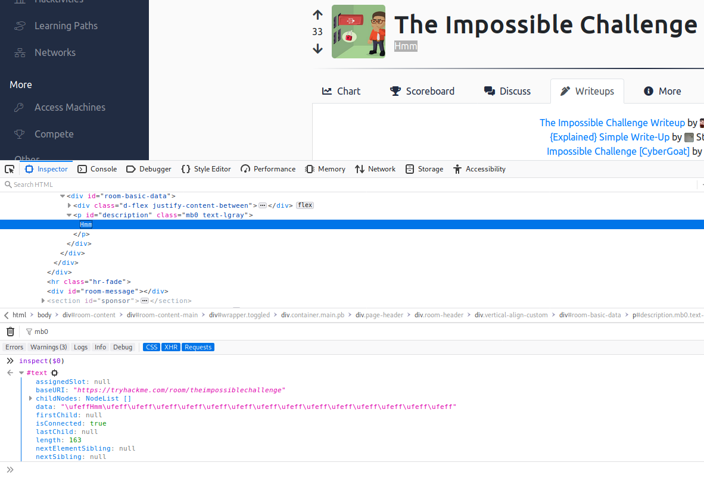
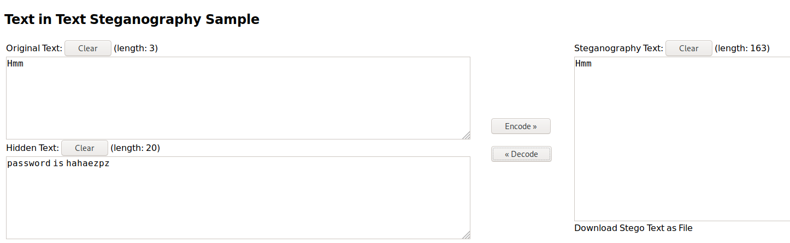

# The Impossible Challenge

‌‌Hmm‌‌‌‌‍

[The Impossible Challenge](https://tryhackme.com/room/theimpossiblechallenge)

## Topic's

- Cryptography
  - ROT13
  - ROT47
  - Hex
  - Base64
- Web Poking
- Steganography

## Appendix archive

Password: `1 kn0w 1 5h0uldn'7!`

## Task 1 Submit the flag

Download the file, and find the Flag!

```
qo qt q` r6 ro su pn s_ rn r6 p6 s_ q2 ps qq rs rp ps rt r4 pu pt qn r4 rq pt q` so pu ps r4 sq pu ps q2 su rn on oq o_ pu ps ou r5 pu pt r4 sr rp qt pu rs q2 qt r4 r4 ro su pq o5
```

[CyberChef](<https://gchq.github.io/CyberChef/#recipe=ROT13(true,true,13)ROT47(47)From_Hex('Auto')From_Base64('A-Za-z0-9%2B/%3D',true)&input=cW8gcXQgcWAgcjYgcm8gc3UgcG4gc18gcm4gcjYgcDYgc18gcTIgcHMgcXEgcnMgcnAgcHMgcnQgcjQgcHUgcHQgcW4gcjQgcnEgcHQgcWAgc28gcHUgcHMgcjQgc3EgcHUgcHMgcTIgc3Ugcm4gb24gb3Egb18gcHUgcHMgb3UgcjUgcHUgcHQgcjQgc3IgcnAgcXQgcHUgcnMgcTIgcXQgcjQgcjQgcm8gc3UgcHEgbzU>)

```
ROT13(true,true,13)
ROT47(47)
From_Hex('Auto')
From_Base64('A-Za-z0-9+/=',true)
```

`It's inside the text, in front of your eyes!`



```css

inspect($0)
#text
​
assignedSlot: null
baseURI: "https://tryhackme.com/room/theimpossiblechallenge"
childNodes: NodeList []
data: "‌‌‌‌‍\ufeff‌‌Hmm‌‌‌‌‍‬‌‍‌‌‌‌‍\ufeff‌\ufeff‌‌‌‌‍\ufeff‌\ufeff‌‌‌‌‍\ufeff‍\ufeff‌‌‌‌‍‬\ufeff\ufeff‌‌‌‌‍\ufeff‌‬‌‌‌‌‍‬‍‌‌‌‌‌‌‬‌‌‌‌‌‌‍‬‬‍‌‌‌‌‍\ufeff‌\ufeff‌‌‌‌‌‌‌‍‬‬‌‌‌‌‌‍‬‌‍‌‌‌‌‍‬‬‌‌‌‌‌‍‬‌‍‌‌‌‌‍‬‍‍‌‌‌‌‍\ufeff‬‬‌‌‌‌‍\ufeff‌‌‌‌‌‌‍\ufeff‬‬"
firstChild: null
isConnected: true
lastChild: null
length: 163
nextElementSibling: null
nextSibling: null
nodeName: "#text"
nodeType: 3
nodeValue: "‌‌‌‌‍\ufeff‌‌Hmm‌‌‌‌‍‬‌‍‌‌‌‌‍\ufeff‌\ufeff‌‌‌‌‍\ufeff‌\ufeff‌‌‌‌‍\ufeff‍\ufeff‌‌‌‌‍‬\ufeff\ufeff‌‌‌‌‍\ufeff‌‬‌‌‌‌‍‬‍‌‌‌‌‌‌‬‌‌‌‌‌‌‍‬‬‍‌‌‌‌‍\ufeff‌\ufeff‌‌‬‌‌‌‌‌‌‍‬‬‌‌‌‌‌‍‬‌‍‌‌‌‌‍‬‬‌‌‌‌‌‍‬‌‍‌‌‌‌‍‬‍‍‌‌‌‌‍\ufeff‬‬‌‌‌‌‍\ufeff‌‌‌‌‌‌‍\ufeff‬‬"
ownerDocument: HTMLDocument https://tryhackme.com/room/theimpossiblechallenge
parentElement: <p id="description" class="mb0 text-lgray">​
parentNode: <p id="description" class="mb0 text-lgray">
previousElementSibling: null
previousSibling: null
textContent:  "‌‌‌‌‍\ufeff‌‌Hmm‌‌‌‌‍‬‌‍‌‌‌‌‍\ufeff‌\ufeff‌‌‌‌‍\ufeff‌\ufeff‌‌‌‌‍\ufeff‍\ufeff‌‌‌‌‍‬\ufeff\ufeff‌‌‌‌‍\ufeff‌‬‌‌‌‌‍‬‍‌‌‌‌‌‌‬‌‌‌‌‌‌‍‬‬‍‌‌‌‌‍\ufeff‌\ufeff‌‌‌‌‌‬‌‌‌‌‌‌‍‬‬‌‌‌‌‌‍‬‌‍‌‌‌‌‍‬‬‌‌‌‌‌‍‬‌‍‌‌‌‌‍‬‍‍‌‌‌‌‍\ufeff‬‬‌‌‌‌‍\ufeff‌‌‌‌‌‌‍\ufeff‬‬"
wholeText:
"‌‌‌‌‍\ufeff‌‌Hmm‌‌‌‌‍‬‌‍‌‌‌‌‍\ufeff‌\ufeff‌‌‌‌‍\ufeff‌\ufeff‌‌‌‌‍\ufeff‍\ufeff‌‌‌‌‍‬\ufeff\ufeff‌‌‌‌‍\ufeff‌‬‌‌‌‌‍‬‍‌‌‌‌‌‌‬‌‌‌‌‌‌‍‬‬‍‌‌‌‌‍\ufeff‌\ufeff‌‌‌‌‌‬‌‌‌‌‌‌‍‬‬‌‌‌‌‌‍‬‌‍‌‌‌‌‍‬‬‌‌‌‌‌‍‬‌‍‌‌‌‌‍‬‍‍‌‌‌‌‍\ufeff‬‬‌‌‌‌‍\ufeff‌‌‌‌‌‌‍\ufeff‬‬"​
<prototype>: TextPrototype { splitText: splitText(), wholeText: Getter, assignedSlot: Getter, … }
```

[Use Zero-Width Characters to Hide Secret Messages in Text (& Even Reveal Leaks)](https://null-byte.wonderhowto.com/how-to/use-zero-width-characters-hide-secret-messages-text-even-reveal-leaks-0198692/)

[https://330k.github.io/misc_tools/unicode_steganography.html](https://330k.github.io/misc_tools/unicode_steganography.html)



`password is hahaezpz`

```
kali@kali:~/CTFs/tryhackme/The Impossible Challenge$ unzip Impossible.zip
Archive:  Impossible.zip
[Impossible.zip] flag.txt password:
  inflating: flag.txt
kali@kali:~/CTFs/tryhackme/The Impossible Challenge$ cat flag.txt
You have solved the Impossible Challenge! Here is your flag THM{Zero_Width_Characters_EZPZ}
```

1. flag is in the format THM{}

`THM{Zero_Width_Characters_EZPZ}`
