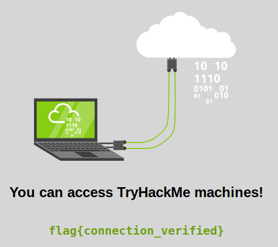

# Tutorial

Learn how to use a TryHackMe room to start your upskilling in cyber security.

* [Tutorial](https://tryhackme.com/room/tutorial)

## Topic's

* TryHackMe Tutorial

## Deploy your first machine

On TryHackMe you'll learn by deploying and hacking virtual machines

Lets deploy your AttackBox, a web-based machine used to attack other machines.

1. Click the blue "Start AttackBox" button at the top of this room As a free user you can only deploy the AttackBox for 1 hour per day - [Subscribe](https://tryhackme.com/profile#subscribe) to remove this limit.
2. Deploy the machine shown on this task and wait 1 minute for it to configure.
3. Copy the IP of the machine that you deployed on this task.

4. Paste the IP into the AttackBox machine's Firefox.

Access the machine via [OpenVPN](https://tryhackme.com/connect?o=vpn)

Alternatively, you can use an OpenVPN connection and use your own computer. Follow the steps on the [OpenVPN page](https://tryhackme.com/connect?o=vpn) for further instructions on connecting. Once connected to our network via OpenVPN, deploy the machine on this task and paste its IP into your own browser.

1. What is the flag text shown on the website of the machine you deployed on this task?

`flag{connection_verified}`

## Next Steps

Now you've managed to deploy and access a TryHackMe machine, search for a security topic to learn about on the [Hacktivities](https://tryhackme.com/hacktivities) page.

Don't forget to check out our [Pathways](https://tryhackme.com/paths) for a more guided learning experience.

Other interesting offerings:

* We release weekly security challenges and walkthroughs
* You can upload your own VMs and [make your own rooms](https://tryhackme.com/develop-rooms)
* Come join our [Discord](https://discord.gg/F7ERYzz) community and say hi!

1. Read the above and explore TryHackMe! 

`No answer needed`
