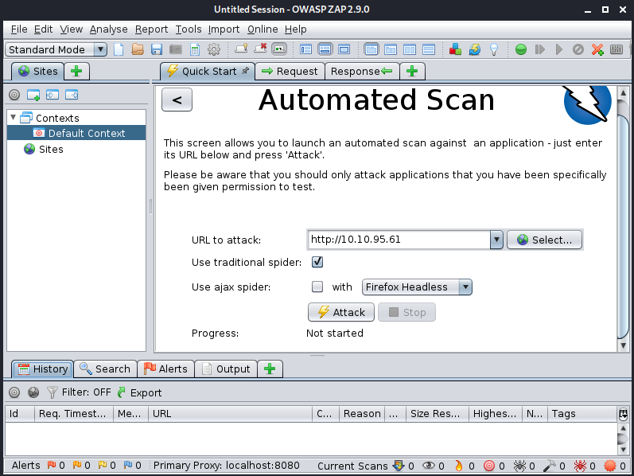
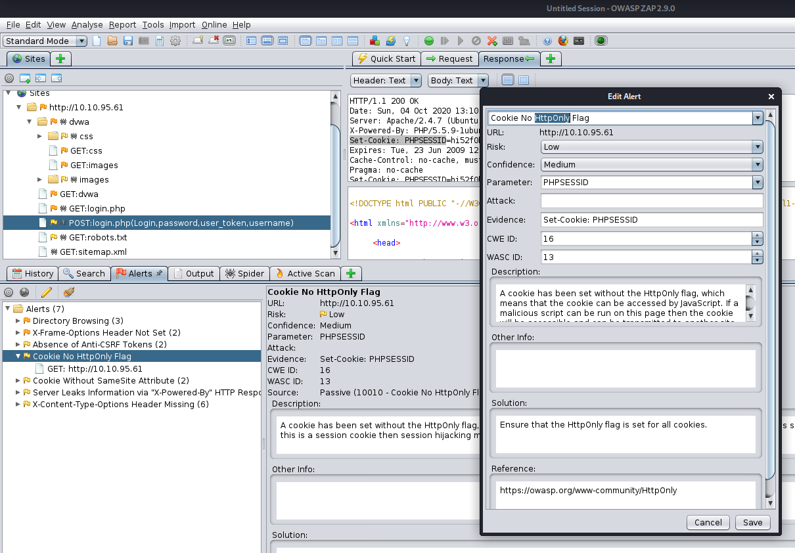
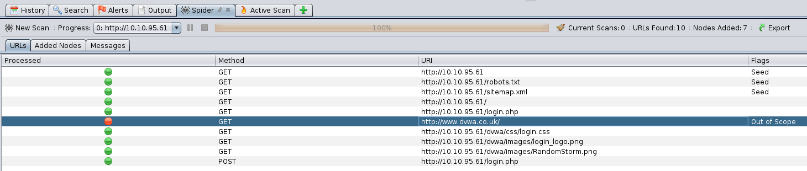

# Web Scanning

Part of the Red Primer series, intro to web scanning.

[Web Scanning](https://tryhackme.com/room/rpwebscanning)

## Topic's

* Web Application Analysis

## Pull the lever, Kronk!

Web scanning represents one of the core constructs of modern pen testing. Quite simply, most of what we interact with on a daily basis is the internet, and therein there is a multitude of ever-widening number of vulnerabilities. Within this room, we will investigate two of the most common scanners: Nikto and Zap. 

----------------------------------------------------

Enjoy the room! For future rooms and write-ups, follow @darkstar7471 on Twitter.

1. Deploy the machine!

`No answer needed`

## ...I'm supposed to scan with that?

A short quiz over the various switches used with Nikto as well as a quick scan against our target. All you'll need for this is the help menu for nikto. Include all parts of the switch unless otherwise specified, this includes

```
kali@kali:~/CTFs/tryhackme/Web Scanning$ nikto -h
Option host requires an argument

       -config+            Use this config file
       -Display+           Turn on/off display outputs
       -dbcheck            check database and other key files for syntax errors
       -Format+            save file (-o) format
       -Help               Extended help information
       -host+              target host/URL
       -id+                Host authentication to use, format is id:pass or id:pass:realm
       -list-plugins       List all available plugins
       -output+            Write output to this file
       -nossl              Disables using SSL
       -no404              Disables 404 checks
       -Plugins+           List of plugins to run (default: ALL)
       -port+              Port to use (default 80)
       -root+              Prepend root value to all requests, format is /directory
       -ssl                Force ssl mode on port
       -Tuning+            Scan tuning
       -timeout+           Timeout for requests (default 10 seconds)
       -update             Update databases and plugins from CIRT.net
       -Version            Print plugin and database versions
       -vhost+             Virtual host (for Host header)
                + requires a value

        Note: This is the short help output. Use -H for full help text.
```

1. First and foremost, what switch do we use to set the target host?

`-h`

2. Websites don't always properly redirect to their secure transport port and can sometimes have different issues depending on the manner in which they are scanned. How do we disable secure transport?

> -nossl              Disables using SSL

`-nossl`

1. How about the opposite, how do we force secure transport?

> -ssl                Force ssl mode on port

`-ssl`

1. What if we want to set a specific port to scan?

> -port+              Port to use (default 80)

`-p`

2. As the web is constantly evolving, so is Nikto. A database of vulnerabilities represents a core component to this web scanner, how do we verify that this database is working and free from error?

> -dbcheck            check database and other key files for syntax errors

`-dbcheck`

1. If instructed to, Nitko will attempt to guess and test both files within directories as well as usernames. Which switch and numerical value do we use to set Nikto to enumerate usernames in Apache? Keep in mind, this option is deprecated in favor of plugins, however, it's still a great option to be aware of for situational usage.

```
-mutate
Specify mutation technique. A mutation will cause Nikto to combine tests or attempt to guess values. These techniques may cause a tremendous amount of tests to be launched against the target. Use the reference number to specify the type, multiple may be used:
1 – Test all files with all root directories
2 – Guess for password file names
3 – Enumerate user names via Apache (/~user type requests)
4 – Enumerate user names via cgiwrap (/cgi-bin/cgiwrap/~user type requests)
5 – Attempt to brute force sub-domain names, assume that the host name is the parent domain
6 – Attempt to guess directory names from the supplied dictionary file
```

`-mutate 3`

2. Suppose we know the username and password for a web forum, how do we set Nikto to do a credentialed check? Suppose the username is admin and the password is PrettyAwesomePassword1234

> -id+                Host authentication to use, format is id:pass or id:pass:realm

`-id admin:PrettyAwesomePassword1234`

1. Let's scan our target machine, what web server do we discover and what version is it?

```
kali@kali:~/CTFs/tryhackme/Web Scanning$ nikto -h 10.10.95.61
- Nikto v2.1.6
---------------------------------------------------------------------------
+ Target IP:          10.10.95.61
+ Target Hostname:    10.10.95.61
+ Target Port:        80
+ Start Time:         2020-10-04 14:50:17 (GMT2)
---------------------------------------------------------------------------
+ Server: Apache/2.4.7 (Ubuntu)
+ Retrieved x-powered-by header: PHP/5.5.9-1ubuntu4.26
+ The anti-clickjacking X-Frame-Options header is not present.
+ The X-XSS-Protection header is not defined. This header can hint to the user agent to protect against some forms of XSS
+ The X-Content-Type-Options header is not set. This could allow the user agent to render the content of the site in a different fashion to the MIME type
+ Cookie PHPSESSID created without the httponly flag
+ Root page / redirects to: login.php
+ No CGI Directories found (use '-C all' to force check all possible dirs)
+ Apache/2.4.7 appears to be outdated (current is at least Apache/2.4.37). Apache 2.2.34 is the EOL for the 2.x branch.
+ OSVDB-3268: /config/: Directory indexing found.
+ /config/: Configuration information may be available remotely.
+ OSVDB-3268: /docs/: Directory indexing found.
+ OSVDB-3233: /icons/README: Apache default file found.
+ /login.php: Admin login page/section found.
+ 7889 requests: 0 error(s) and 11 item(s) reported on remote host
+ End Time:           2020-10-04 14:56:35 (GMT2) (378 seconds)
---------------------------------------------------------------------------
+ 1 host(s) tested
```

`Apache/2.4.7`

2.  This box is vulnerable to very poor directory control due to it's web server version, what directory is indexed that really shouldn't be?

`config`

3.  Nikto scans can take a while to fully complete, which switch do we set in order to limit the scan to end at a certain time?

```
-until
Run until the specified time or duration, then pause.
```

`-until`

4.  But wait, there's more! How do we list all of the plugins are available?

```
-list-plugins
Will list all plugins that Nikto can run against targets and then will exit without performing a scan. These can be tuned for a session using the -Plugins option.
```

`-list-plugins`

5.  On the flip-side of the database, plugins represent another core component to Nikto. Which switch do we use to instruct Nikto to use plugin checks to find out of date software on the target host? Keep in mind that when testing this command we need to specify the host we intend to run this against. For submitting your answer, use only the base command with the out of date option.

```
kali@kali:~/CTFs/tryhackme/Web Scanning$ nikto -list-plugins | grep outdated
Plugin: outdated
```

`-Plugins outdated`

6.  Finally, what if we'd like to use our plugins to run a series of standard tests against the target host?

`-Plugins tests`

## Zip ZAP!

A brief quiz and tutorial over using the OWASP Zap Scanner

1. Let's start simple and launch zap. This can be done in a number of ways (Commands: owasp-zap, zaproxy) or through launching it in the Kali gui.

`No answer needed`

2. Launch ZAP, what option to we set in order to specify what we are attacking?



`URL to attack`

3. Launch the attack against our target! Throughout the course of this attack you may notice this is very similar to Nikto. Similar to Nessus vs. OpenVAS, Nikto and ZAP and both offer different perspectives on a host and, as such, it's useful to know how to leverage both scanning tools in order to maximize your own visibility in a situation wherein 'noise' doesn't particularly matter.

`No answer needed`

4. ZAP will discover a file that typically contains pages which well-behaved web indexing engines will read in order to know which sections of a site to avoid. What is the name of this file? (Lucky for us, our scanner isn't what we would call 'well-behaved'!)


`/robots.txt`

5. One entry is included in the disallow section of this file, what is it?

* [http://10.10.95.61/robots.txt](http://10.10.95.61/robots.txt)

```
User-agent: *
Disallow: /
```

`/`

1. ZAP will find a directory that contains images for our application, what is the path for that directory? (This is what will follows the name/ip of the website)

`/dvwa/images/`

2. This website doesn't force a secure connection by default and ZAP isn't pleased with it. Which related cookie is ZAP upset about?



`HttpOnly`

3. Featured in various rooms on TryHackMe, Cross-Site Scripting is a vicious attack that is becoming ever more common on the open web. What Alert does ZAP produce to let us know that this site is vulnerable to XSS? Note, there are often a couple warnings produced for this, look for one more so directly related to the web client.

`Web Browser XSS Protection Not Enabled`

4.  The ZAP proxy spider represents the component responsible for 'crawling' the site. What site is found to be out of scope?



`http://www.dvwa.co.uk`

5.  ZAP will use primarily two methods in order to scan a website, which of these two HTTP methods requests content?

`GET`

6.  Which option attempts to submit content to the website?

`POST`
