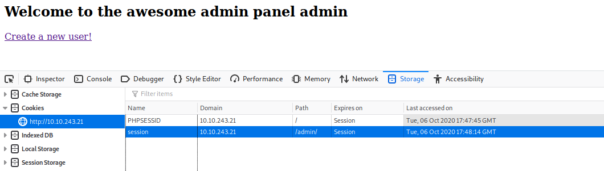
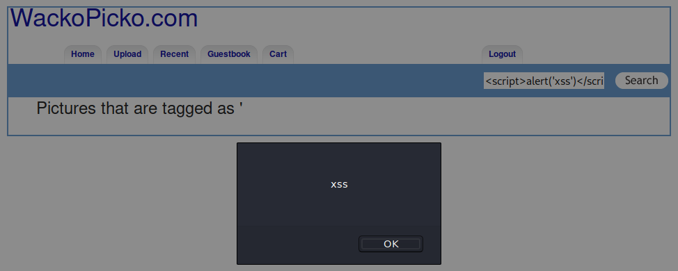

# WebAppSec 101

In this room, we will walk through how to testing an application in the perspective of a hacker/penetration tester

[WebAppSec 101](https://tryhackme.com/room/webappsec101)

## Topic's

- Network Enumeration
- Web Poking
- Security Misconfiguration
- Cross-site Scripting
- Injection
- Logic Flaws

## Appendix archive

Password: `1 kn0w 1 5h0uldn'7!`

## Task 1 Basic Description & Objectives

This room is a small vulnerable web application. In the OWASP Juice shop, we looked at how some basic vulnerabilities worked. In this room, we'll walk though the methodology and approach of testing a web application. As an ethical hacker, you need to test the web application from the perspective of an attacker. We'll be using this mindset to establish a strategy to look for weaknesses in the web application.

Credits to [Adam Doupe](https://adamdoupe.com/) for creating this.

1. Connect to the network using openvpn and deploy the machine

   `No answer needed`

## Task 2 Walking through the application

To discover vulnerabilities for any application, we need to understand how the application works. Why don't you click through the links on the application and try identify the functionality. The best way to identify links or particular functionality is by running a web crawler/spider. A web spider will follow every link on every page on the web site(including inputting data into some forms). This can be good because it will help you generate a list of all the pages of the application(so you know what to test and don't miss anything), but it can also be bad because sometimes it might miss functionality or input malformed/incorrect data that may break the application. The Burp tool comes with a spider you can use to crawl through the website.

Some vulnerabilities are particular to some functionality, for example:

- When you see a login page, can you brute force or guess the credentials?
- If there is a user login, can there be an administrator login?
- Can you upload restricted content using upload functionality?
- If input is generated from a textbox, can you perform XSS?

During this phase, it's also important to look at what technologies are being used, along with their version numbers. For example, Do particular versions of servers have public exploits available?

1. What version of Apache is being used?

```
kali@kali:~/CTFs/tryhackme/WebAppSec 101$ sudo nmap -p- -sS -sC -sV -O -A 10.10.243.21
Starting Nmap 7.80 ( https://nmap.org ) at 2020-10-06 19:38 CEST
Nmap scan report for 10.10.243.21
Host is up (0.033s latency).
Not shown: 65531 closed ports
PORT      STATE SERVICE VERSION
22/tcp    open  ssh     OpenSSH 7.4 (protocol 2.0)
| ssh-hostkey:
|   2048 84:d0:84:08:dd:b6:38:ed:03:09:28:7a:4d:bf:ca:c4 (RSA)
|   256 b7:5c:c3:a5:94:2e:3c:90:15:5d:bb:5f:7a:fe:44:80 (ECDSA)
|_  256 a2:73:85:b4:4a:50:f4:36:82:ed:6e:68:9e:44:58:81 (ED25519)
80/tcp    open  http    Apache httpd 2.4.7 ((Ubuntu))
| http-cookie-flags:
|   /:
|     PHPSESSID:
|_      httponly flag not set
|_http-server-header: Apache/2.4.7 (Ubuntu)
|_http-title: WackoPicko.com
111/tcp   open  rpcbind 2-4 (RPC #100000)
| rpcinfo:
|   program version    port/proto  service
|   100000  2,3,4        111/tcp   rpcbind
|   100000  2,3,4        111/udp   rpcbind
|   100000  3,4          111/tcp6  rpcbind
|   100000  3,4          111/udp6  rpcbind
|   100024  1          35757/tcp   status
|   100024  1          46276/udp6  status
|   100024  1          48483/tcp6  status
|_  100024  1          50737/udp   status
35757/tcp open  status  1 (RPC #100024)
No exact OS matches for host (If you know what OS is running on it, see https://nmap.org/submit/ ).
TCP/IP fingerprint:
OS:SCAN(V=7.80%E=4%D=10/6%OT=22%CT=1%CU=37463%PV=Y%DS=2%DC=T%G=Y%TM=5F7CABF
OS:0%P=x86_64-pc-linux-gnu)SEQ(SP=100%GCD=1%ISR=10D%TI=Z%CI=Z%II=I%TS=A)OPS
OS:(O1=M508ST11NW6%O2=M508ST11NW6%O3=M508NNT11NW6%O4=M508ST11NW6%O5=M508ST1
OS:1NW6%O6=M508ST11)WIN(W1=68DF%W2=68DF%W3=68DF%W4=68DF%W5=68DF%W6=68DF)ECN
OS:(R=Y%DF=Y%T=FF%W=6903%O=M508NNSNW6%CC=Y%Q=)T1(R=Y%DF=Y%T=FF%S=O%A=S+%F=A
OS:S%RD=0%Q=)T2(R=N)T3(R=N)T4(R=Y%DF=Y%T=FF%W=0%S=A%A=Z%F=R%O=%RD=0%Q=)T5(R
OS:=Y%DF=Y%T=FF%W=0%S=Z%A=S+%F=AR%O=%RD=0%Q=)T6(R=Y%DF=Y%T=FF%W=0%S=A%A=Z%F
OS:=R%O=%RD=0%Q=)T7(R=Y%DF=Y%T=FF%W=0%S=Z%A=S+%F=AR%O=%RD=0%Q=)U1(R=Y%DF=N%
OS:T=FF%IPL=164%UN=0%RIPL=G%RID=G%RIPCK=G%RUCK=G%RUD=G)IE(R=Y%DFI=N%T=FF%CD
OS:=S)

Network Distance: 2 hops

TRACEROUTE (using port 993/tcp)
HOP RTT      ADDRESS
1   32.59 ms 10.8.0.1
2   33.17 ms 10.10.243.21

OS and Service detection performed. Please report any incorrect results at https://nmap.org/submit/ .
Nmap done: 1 IP address (1 host up) scanned in 63.26 seconds
```

`2.4.7`

2. What language was used to create the website?

```
kali@kali:~/CTFs/tryhackme/WebAppSec 101$ curl -s -D header.txt 10.10.243.21 > /dev/null
kali@kali:~/CTFs/tryhackme/WebAppSec 101$ cat header.txt
HTTP/1.1 200 OK
Date: Tue, 06 Oct 2020 17:42:11 GMT
Server: Apache/2.4.7 (Ubuntu)
X-Powered-By: PHP/5.5.9-1ubuntu4.24
Set-Cookie: PHPSESSID=a50hunj03im164dnbuq036lnt3; path=/
Expires: Thu, 19 Nov 1981 08:52:00 GMT
Cache-Control: no-store, no-cache, must-revalidate, post-check=0, pre-check=0
Pragma: no-cache
Vary: Accept-Encoding
Content-Length: 3246
Content-Type: text/htm
```

`PHP`

3. What version of this language is used?

`5.5.9`

## Task 3 Establishing a methodology

Now that we've walked through the application and know the functionality and technologies, how do we actually test it. There are 2 particular ways to test a web application for security vulnerabilities:

The first way is by going through every page and testing all the functionality. This would involve going through every page on the application, and depending on the functionality, testing for all the bugs/vulnerabilities that apply to the page. In this case, if we start off at the home page, we would try see what functionality we can exploit on the home page, and then move on to every page.

The second way is by breaking down the testing into different stages(including but not limited to):

- Authorization
- Authentication
- Injection
- Client Side Controls
- Application Logic

In this room, we'll be approaching testing through these particular topics. In general testing can be done in a combination of both the approaches mentioned above.

1. Make sure you understand the pro's and con's of each methodology

## Task 4 Authentication

Authentication involves testing mechanisms and logic that allow users to log in to an application(either as a regular user, or those with elevated privileges). The process of authentication usually involves verifying a user, and this is done when the user provides correct credentials(in most cases usernames and passwords). Authentication can be tested in the following ways:

- Brute Forcing/Weak Credentials: In most cases, users usually pick common passwords that are easy to guess. This could be anything from the username to the names of animals. Attackers can use weak passwords to their advantage by using a list to guess possible users passwords.
- Session Management: Sessions are the mechanism by which the server retains state about the application. This is necessary in applications that need to remember users for transactions. In some cases, sessions(which are stored in cookies) store information about users such as their privilege level. This state can be manipulated and sent back to the server.

1. What is the admin username?

`admin`

2. What is the admin password?

`admin`

3. What is the name of the cookie that can be manipulated?



`session`

4. What is the username of a logged on user?

- [http://10.10.243.21/users/view.php?userid=11](http://10.10.243.21/users/view.php?userid=11)

`bryce`

1. What is the corresponding password to the username?

`bryce`

## Task 5 Cross Site Scripting (XSS)

XSS is a vulnerability that involves injecting malicious javascript in trusted websites. Once an attacker has injected malicious javascript, sometimes a browser will not know whether to trust it, and it will run the script. Using this exploit an attacker can:

- steal session information through cookies
- arbitrarily redirect users to their own pages(for phishing)

There are a few different types of XSS attacks:

- Persistent/Non-Reflected - Here the XSS payload has been stored in the database, and once the server/framework passes the data from the database into the webpage, the script/payload is executed
- Non Persistent/Reflected - Here the XSS payload is usually crafted using a malicious link. It is not stored.

You can cause javascript to execute using different payloads and HTML tags- this is a good list of resources for payloads.

1. Test for XSS on the search bar

```html
<script>
  alert("xss");
</script>
```



2. Test for XSS on the guestbook page
3. Test for XSS behind the flash form on the home page

## Task 6 Injection

Injection attacks occur when users input data and this data is being processed/interpreted by the server. Injection is most common when user supplied data is not validated/sanitised by the server. Common injection attacks include:

- SQL Injection - These attacks occur when users provide malicious data that is processed by SQL statements on the server. SQL statements are usually used to interact with databases; by providing malicious input, users can read, modify and even delete data in these databases. These attacks are usually prevalent because developers do not use parameterized queries. More information about SQL Information can be found here.
- Command Injection - These attacks usually occur when users provide malicious data that is processed as system commands on the web server. With this attack, users can execute arbitrary command on the system and carry out malicious actions like reading password hashes and private keys. More information can be found here.

Injection attacks usually involve passing input to the application. In most cases, this input can be through a text field in a form, but in other cases it can be anything that the user has access to(and is interpreted by the server) e.g. HTTP Headers, disabled input fields.

1. Perform command injection on the check password field
2. Check for SQLi on the application

## Task 7 Miscellaneous & Logic Flaws

Applications can also have vulnerabilities because of flawed logic; a certain part of the application may not work as expected due to mistakes in how it was programmed. The way these flaws can be discovered is by testing these components and trying to understand how they are supposed to operate. After doing this, test these components in ways that the developer did not intend them to be used(e.g. passing in numbers instead of letters, trying to iterate through a range of numbers and etc).

In addition, applications may have other vulnerabilities:

- Parameter Manipulation: Parameters are usually values passed to queries. For example in the url: www.evil.com/photos?id=1 the parameter is id and the value is 1. Sometimes developers may not correctly map resources using parameters, so an attacker can try different values and access resources that they should not access.
- Directory Traversal: An attacker may be able to access files outside the web root directory(due to incorrect access control) by manipulating variables that may take a file path(adding ../ can navigate to the upper directory). More information can be found here
- Forceful Browsing: Here an attacker can access restricted content(that also may be unmapped by the application) by brute forcing through different URLs and links. This can be done using set dictionaries or wordlists using tools like Dirsearch. More information can be found here.

1. Find a parameter manipulation vulnerability
2. Find a directory traversal vulnerability
3. Find a forceful browsing vulnerability
4. Logic flaw: try get an item for free
