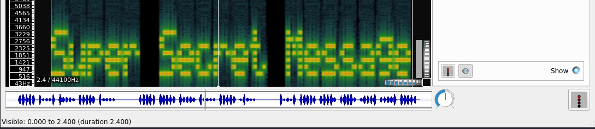

# c4ptur3-th3-fl4g

A beginner level CTF challenge

[c4ptur3-th3-fl4g](https://tryhackme.com/room/c4ptur3th3fl4g)

## Topic's

- Cryptography
  - L33t
  - Binary
  - Base32
  - Base64
  - Hex
  - ROT13
  - ROT47
  - Morse Code
  - Decimal
- Steganography

## Appendix archive

Password: `1 kn0w 1 5h0uldn'7!`

## Translation & Shifting

Translate, shift and decode the following; Answers are all case sensitive.

1. `c4n y0u c4p7u23 7h3 f149?`

`can you capture the flag?`

2. `01101100 01100101 01110100 01110011 00100000 01110100 01110010 01111001 00100000 01110011 01101111 01101101 01100101 00100000 01100010 01101001 01101110 01100001 01110010 01111001 00100000 01101111 01110101 01110100 00100001`

- [Binary to Text Translator](https://www.rapidtables.com/convert/number/binary-to-ascii.html)

`lets try some binary out!`

3. `MJQXGZJTGIQGS4ZAON2XAZLSEBRW63LNN5XCA2LOEBBVIRRHOM======`

```
kali@kali:~/CTFs/tryhackme/c4ptur3-th3-fl4g$ echo -n 'MJQXGZJTGIQGS4ZAON2XAZLSEBRW63LNN5XCA2LOEBBVIRRHOM======' | base32 -d
base32 is super common in CTF's
```

`base32 is super common in CTF's`

4. `RWFjaCBCYXNlNjQgZGlnaXQgcmVwcmVzZW50cyBleGFjdGx5IDYgYml0cyBvZiBkYXRhLg==`

```
kali@kali:~/CTFs/tryhackme/c4ptur3-th3-fl4g$ echo -n 'RWFjaCBCYXNlNjQgZGlnaXQgcmVwcmVzZW50cyBleGFjdGx5IDYgYml0cyBvZiBkYXRhLg==' | base64 -d
Each Base64 digit represents exactly 6 bits of data.
```

`Each Base64 digit represents exactly 6 bits of data.`

5. `68 65 78 61 64 65 63 69 6d 61 6c 20 6f 72 20 62 61 73 65 31 36 3f`

- [Hex to ASCII Text Converter](https://www.rapidtables.com/convert/number/hex-to-ascii.html)

`hexadecimal or base16?`

6. `Ebgngr zr 13 cynprf!`

```
kali@kali:~/CTFs/tryhackme/c4ptur3-th3-fl4g$ echo -n 'Ebgngr zr 13 cynprf!' | tr '[A-Za-z]' '[N-ZA-Mn-za-m]'
Rotate me 13 places!
```

`Rotate me 13 places!`

7. `*@F DA:? >6 C:89E C@F?5 323J C:89E C@F?5 Wcf E:>6DX`

- [ROT-47 Cipher](https://www.dcode.fr/rot-47-cipher)

`You spin me right round baby right round (47 times)`

8. `- . .-.. . -.-. --- -- -- ..- -. .. -.-. .- - .. --- -. . -. -.-. --- -.. .. -. --.`

- [Morse Code Translator](https://morsecode.world/international/translator.html)

`TELECOMMUNICATION ENCODING`

1.  `85 110 112 97 99 107 32 116 104 105 115 32 66 67 68`

- [ASCII,Hex,Binary,Decimal,Base64 converter](https://www.rapidtables.com/convert/number/ascii-hex-bin-dec-converter.html)

`Unpack this BCD`

2.  `LS0tLS0gLi0tLS0gLi0tLS0gLS0tLS0gLS0tLS0gLi0tLS0gLi0tLS0gLS0tLS0KLS0tLS0gLi0tLS0gLi0tLS0gLS0tLS0gLS0tLS0gLi0tLS0gLS0tLS0gLi0tLS0KLS0tLS0gLS0tLS0gLi0tLS0gLS0tLS0gLS0tLS0gLS0tLS0gLS0tLS0gLS0tLS0KLS0tLS0gLi0tLS0gLi0tLS0gLS0tLS0gLS0tLS0gLS0tLS0gLS0tLS0gLS0tLS0KLS0tLS0gLi0tLS0gLS0tLS0gLi0tLS0gLi0tLS0gLi0tLS0gLi0tLS0gLi0tLS0KLS0tLS0gLi0tLS0gLi0tLS0gLS0tLS0gLS0tLS0gLS0tLS0gLS0tLS0gLS0tLS0KLS0tLS0gLS0tLS0gLi0tLS0gLS0tLS0gLS0tLS0gLS0tLS0gLS0tLS0gLS0tLS0KLS0tLS0gLi0tLS0gLi0tLS0gLS0tLS0gLS0tLS0gLS0tLS0gLS0tLS0gLS0tLS0KLS0tLS0gLi0tLS0gLi0tLS0gLS0tLS0gLS0tLS0gLS0tLS0gLS0tLS0gLS0tLS0KLS0tLS0gLi0tLS0gLi0tLS0gLS0tLS0gLS0tLS0gLi0tLS0gLS0tLS0gLi0tLS0KLS0tLS0gLS0tLS0gLi0tLS0gLS0tLS0gLS0tLS0gLS0tLS0gLS0tLS0gLS0tLS0KLS0tLS0gLi0tLS0gLi0tLS0gLS0tLS0gLS0tLS0gLS0tLS0gLi0tLS0gLS0tLS0KLS0tLS0gLi0tLS0gLi0tLS0gLS0tLS0gLi0tLS0gLS0tLS0gLS0tLS0gLS0tLS0KLS0tLS0gLS0tLS0gLi0tLS0gLS0tLS0gLS0tLS0gLS0tLS0gLS0tLS0gLS0tLS0KLS0tLS0gLi0tLS0gLi0tLS0gLS0tLS0gLS0tLS0gLS0tLS0gLS0tLS0gLS0tLS0KLS0tLS0gLi0tLS0gLi0tLS0gLS0tLS0gLS0tLS0gLS0tLS0gLS0tLS0gLS0tLS0KLS0tLS0gLi0tLS0gLi0tLS0gLS0tLS0gLS0tLS0gLi0tLS0gLS0tLS0gLS0tLS0KLS0tLS0gLS0tLS0gLi0tLS0gLS0tLS0gLS0tLS0gLS0tLS0gLS0tLS0gLS0tLS0KLS0tLS0gLi0tLS0gLi0tLS0gLS0tLS0gLS0tLS0gLS0tLS0gLi0tLS0gLS0tLS0KLS0tLS0gLi0tLS0gLi0tLS0gLS0tLS0gLS0tLS0gLS0tLS0gLS0tLS0gLi0tLS0KLS0tLS0gLS0tLS0gLi0tLS0gLS0tLS0gLS0tLS0gLS0tLS0gLS0tLS0gLS0tLS0KLS0tLS0gLi0tLS0gLi0tLS0gLS0tLS0gLS0tLS0gLS0tLS0gLS0tLS0gLS0tLS0KLS0tLS0gLi0tLS0gLS0tLS0gLi0tLS0gLi0tLS0gLi0tLS0gLi0tLS0gLi0tLS0KLS0tLS0gLi0tLS0gLi0tLS0gLS0tLS0gLi0tLS0gLS0tLS0gLS0tLS0gLS0tLS0KLS0tLS0gLS0tLS0gLi0tLS0gLS0tLS0gLS0tLS0gLS0tLS0gLS0tLS0gLS0tLS0KLS0tLS0gLi0tLS0gLi0tLS0gLS0tLS0gLi0tLS0gLS0tLS0gLS0tLS0gLS0tLS0KLS0tLS0gLi0tLS0gLi0tLS0gLS0tLS0gLS0tLS0gLi0tLS0gLi0tLS0gLS0tLS0KLS0tLS0gLS0tLS0gLi0tLS0gLS0tLS0gLS0tLS0gLS0tLS0gLS0tLS0gLS0tLS0KLS0tLS0gLi0tLS0gLi0tLS0gLS0tLS0gLS0tLS0gLS0tLS0gLS0tLS0gLS0tLS0KLS0tLS0gLi0tLS0gLS0tLS0gLi0tLS0gLi0tLS0gLi0tLS0gLi0tLS0gLi0tLS0KLS0tLS0gLi0tLS0gLi0tLS0gLS0tLS0gLS0tLS0gLi0tLS0gLi0tLS0gLS0tLS0KLS0tLS0gLS0tLS0gLi0tLS0gLS0tLS0gLS0tLS0gLS0tLS0gLS0tLS0gLS0tLS0KLS0tLS0gLi0tLS0gLi0tLS0gLS0tLS0gLS0tLS0gLS0tLS0gLS0tLS0gLS0tLS0KLS0tLS0gLi0tLS0gLS0tLS0gLi0tLS0gLi0tLS0gLi0tLS0gLi0tLS0gLi0tLS0KLS0tLS0gLi0tLS0gLi0tLS0gLS0tLS0gLS0tLS0gLS0tLS0gLS0tLS0gLS0tLS0KLS0tLS0gLS0tLS0gLi0tLS0gLS0tLS0gLS0tLS0gLS0tLS0gLS0tLS0gLS0tLS0KLS0tLS0gLi0tLS0gLi0tLS0gLS0tLS0gLS0tLS0gLS0tLS0gLi0tLS0gLS0tLS0KLS0tLS0gLi0tLS0gLi0tLS0gLS0tLS0gLS0tLS0gLS0tLS0gLS0tLS0gLi0tLS0KLS0tLS0gLS0tLS0gLi0tLS0gLS0tLS0gLS0tLS0gLS0tLS0gLS0tLS0gLS0tLS0KLS0tLS0gLi0tLS0gLi0tLS0gLS0tLS0gLS0tLS0gLS0tLS0gLS0tLS0gLS0tLS0KLS0tLS0gLi0tLS0gLi0tLS0gLS0tLS0gLS0tLS0gLS0tLS0gLS0tLS0gLS0tLS0KLS0tLS0gLi0tLS0gLi0tLS0gLS0tLS0gLS0tLS0gLi0tLS0gLS0tLS0gLi0tLS0KLS0tLS0gLS0tLS0gLi0tLS0gLS0tLS0gLS0tLS0gLS0tLS0gLS0tLS0gLS0tLS0KLS0tLS0gLi0tLS0gLi0tLS0gLS0tLS0gLS0tLS0gLS0tLS0gLS0tLS0gLS0tLS0KLS0tLS0gLi0tLS0gLS0tLS0gLi0tLS0gLi0tLS0gLi0tLS0gLi0tLS0gLi0tLS0KLS0tLS0gLi0tLS0gLi0tLS0gLS0tLS0gLS0tLS0gLS0tLS0gLi0tLS0gLi0tLS0KLS0tLS0gLS0tLS0gLi0tLS0gLS0tLS0gLS0tLS0gLS0tLS0gLS0tLS0gLS0tLS0KLS0tLS0gLi0tLS0gLi0tLS0gLS0tLS0gLS0tLS0gLS0tLS0gLS0tLS0gLS0tLS0KLS0tLS0gLi0tLS0gLS0tLS0gLi0tLS0gLi0tLS0gLi0tLS0gLi0tLS0gLi0tLS0KLS0tLS0gLi0tLS0gLi0tLS0gLS0tLS0gLS0tLS0gLi0tLS0gLS0tLS0gLS0tLS0KLS0tLS0gLS0tLS0gLi0tLS0gLS0tLS0gLS0tLS0gLS0tLS0gLS0tLS0gLS0tLS0KLS0tLS0gLi0tLS0gLi0tLS0gLS0tLS0gLS0tLS0gLS0tLS0gLS0tLS0gLS0tLS0KLS0tLS0gLi0tLS0gLi0tLS0gLS0tLS0gLS0tLS0gLS0tLS0gLS0tLS0gLS0tLS0KLS0tLS0gLi0tLS0gLi0tLS0gLS0tLS0gLS0tLS0gLi0tLS0gLS0tLS0gLS0tLS0KLS0tLS0gLS0tLS0gLi0tLS0gLS0tLS0gLS0tLS0gLS0tLS0gLS0tLS0gLS0tLS0KLS0tLS0gLi0tLS0gLi0tLS0gLS0tLS0gLS0tLS0gLS0tLS0gLi0tLS0gLS0tLS0KLS0tLS0gLi0tLS0gLi0tLS0gLS0tLS0gLS0tLS0gLS0tLS0gLS0tLS0gLi0tLS0KLS0tLS0gLS0tLS0gLi0tLS0gLS0tLS0gLS0tLS0gLS0tLS0gLS0tLS0gLS0tLS0KLS0tLS0gLi0tLS0gLi0tLS0gLS0tLS0gLi0tLS0gLS0tLS0gLS0tLS0gLS0tLS0KLS0tLS0gLi0tLS0gLi0tLS0gLS0tLS0gLS0tLS0gLi0tLS0gLi0tLS0gLS0tLS0KLS0tLS0gLS0tLS0gLi0tLS0gLS0tLS0gLS0tLS0gLS0tLS0gLS0tLS0gLS0tLS0KLS0tLS0gLi0tLS0gLi0tLS0gLS0tLS0gLS0tLS0gLS0tLS0gLi0tLS0gLS0tLS0KLS0tLS0gLi0tLS0gLi0tLS0gLS0tLS0gLS0tLS0gLS0tLS0gLS0tLS0gLi0tLS0KLS0tLS0gLS0tLS0gLi0tLS0gLS0tLS0gLS0tLS0gLS0tLS0gLS0tLS0gLS0tLS0KLS0tLS0gLi0tLS0gLi0tLS0gLS0tLS0gLi0tLS0gLS0tLS0gLS0tLS0gLS0tLS0KLS0tLS0gLi0tLS0gLi0tLS0gLS0tLS0gLS0tLS0gLi0tLS0gLi0tLS0gLi0tLS0KLS0tLS0gLS0tLS0gLi0tLS0gLS0tLS0gLS0tLS0gLS0tLS0gLS0tLS0gLS0tLS0KLS0tLS0gLi0tLS0gLi0tLS0gLS0tLS0gLS0tLS0gLS0tLS0gLS0tLS0gLS0tLS0KLS0tLS0gLi0tLS0gLS0tLS0gLi0tLS0gLi0tLS0gLi0tLS0gLi0tLS0gLi0tLS0KLS0tLS0gLi0tLS0gLi0tLS0gLS0tLS0gLS0tLS0gLi0tLS0gLS0tLS0gLS0tLS0KLS0tLS0gLS0tLS0gLi0tLS0gLS0tLS0gLS0tLS0gLS0tLS0gLS0tLS0gLS0tLS0KLS0tLS0gLi0tLS0gLi0tLS0gLS0tLS0gLS0tLS0gLS0tLS0gLS0tLS0gLS0tLS0KLS0tLS0gLi0tLS0gLi0tLS0gLS0tLS0gLS0tLS0gLS0tLS0gLS0tLS0gLS0tLS0KLS0tLS0gLi0tLS0gLi0tLS0gLS0tLS0gLS0tLS0gLi0tLS0gLS0tLS0gLi0tLS0KLS0tLS0gLS0tLS0gLi0tLS0gLS0tLS0gLS0tLS0gLS0tLS0gLS0tLS0gLS0tLS0KLS0tLS0gLi0tLS0gLi0tLS0gLS0tLS0gLS0tLS0gLS0tLS0gLi0tLS0gLS0tLS0KLS0tLS0gLi0tLS0gLi0tLS0gLS0tLS0gLS0tLS0gLS0tLS0gLS0tLS0gLi0tLS0KLS0tLS0gLS0tLS0gLi0tLS0gLS0tLS0gLS0tLS0gLS0tLS0gLS0tLS0gLS0tLS0KLS0tLS0gLi0tLS0gLi0tLS0gLS0tLS0gLS0tLS0gLS0tLS0gLS0tLS0gLS0tLS0KLS0tLS0gLi0tLS0gLi0tLS0gLS0tLS0gLS0tLS0gLS0tLS0gLS0tLS0gLS0tLS0KLS0tLS0gLi0tLS0gLi0tLS0gLS0tLS0gLS0tLS0gLi0tLS0gLS0tLS0gLi0tLS0KLS0tLS0gLS0tLS0gLi0tLS0gLS0tLS0gLS0tLS0gLS0tLS0gLS0tLS0gLS0tLS0KLS0tLS0gLi0tLS0gLi0tLS0gLS0tLS0gLS0tLS0gLS0tLS0gLS0tLS0gLS0tLS0KLS0tLS0gLi0tLS0gLi0tLS0gLS0tLS0gLS0tLS0gLS0tLS0gLS0tLS0gLS0tLS0KLS0tLS0gLi0tLS0gLi0tLS0gLS0tLS0gLS0tLS0gLS0tLS0gLi0tLS0gLi0tLS0KLS0tLS0gLS0tLS0gLi0tLS0gLS0tLS0gLS0tLS0gLS0tLS0gLS0tLS0gLS0tLS0KLS0tLS0gLi0tLS0gLi0tLS0gLS0tLS0gLS0tLS0gLS0tLS0gLS0tLS0gLS0tLS0KLS0tLS0gLi0tLS0gLS0tLS0gLi0tLS0gLi0tLS0gLi0tLS0gLi0tLS0gLi0tLS0KLS0tLS0gLi0tLS0gLi0tLS0gLS0tLS0gLS0tLS0gLi0tLS0gLS0tLS0gLS0tLS0KLS0tLS0gLS0tLS0gLi0tLS0gLS0tLS0gLS0tLS0gLS0tLS0gLS0tLS0gLS0tLS0KLS0tLS0gLi0tLS0gLi0tLS0gLS0tLS0gLi0tLS0gLS0tLS0gLS0tLS0gLS0tLS0KLS0tLS0gLi0tLS0gLi0tLS0gLS0tLS0gLi0tLS0gLS0tLS0gLS0tLS0gLS0tLS0KLS0tLS0gLS0tLS0gLi0tLS0gLS0tLS0gLS0tLS0gLS0tLS0gLS0tLS0gLS0tLS0KLS0tLS0gLi0tLS0gLi0tLS0gLS0tLS0gLS0tLS0gLS0tLS0gLS0tLS0gLS0tLS0KLS0tLS0gLi0tLS0gLS0tLS0gLi0tLS0gLi0tLS0gLi0tLS0gLi0tLS0gLi0tLS0KLS0tLS0gLi0tLS0gLi0tLS0gLS0tLS0gLS0tLS0gLi0tLS0gLi0tLS0gLS0tLS0KLS0tLS0gLS0tLS0gLi0tLS0gLS0tLS0gLS0tLS0gLS0tLS0gLS0tLS0gLS0tLS0KLS0tLS0gLi0tLS0gLi0tLS0gLS0tLS0gLS0tLS0gLS0tLS0gLS0tLS0gLS0tLS0KLS0tLS0gLi0tLS0gLS0tLS0gLi0tLS0gLi0tLS0gLi0tLS0gLi0tLS0gLi0tLS0KLS0tLS0gLi0tLS0gLi0tLS0gLS0tLS0gLS0tLS0gLi0tLS0gLS0tLS0gLS0tLS0KLS0tLS0gLS0tLS0gLi0tLS0gLS0tLS0gLS0tLS0gLS0tLS0gLS0tLS0gLS0tLS0KLS0tLS0gLi0tLS0gLi0tLS0gLS0tLS0gLS0tLS0gLS0tLS0gLS0tLS0gLS0tLS0KLS0tLS0gLi0tLS0gLS0tLS0gLi0tLS0gLi0tLS0gLi0tLS0gLi0tLS0gLi0tLS0KLS0tLS0gLi0tLS0gLi0tLS0gLS0tLS0gLS0tLS0gLS0tLS0gLS0tLS0gLS0tLS0KLS0tLS0gLS0tLS0gLi0tLS0gLS0tLS0gLS0tLS0gLS0tLS0gLS0tLS0gLS0tLS0KLS0tLS0gLi0tLS0gLi0tLS0gLS0tLS0gLS0tLS0gLS0tLS0gLS0tLS0gLS0tLS0KLS0tLS0gLi0tLS0gLi0tLS0gLS0tLS0gLS0tLS0gLS0tLS0gLS0tLS0gLS0tLS0KLS0tLS0gLi0tLS0gLi0tLS0gLS0tLS0gLS0tLS0gLS0tLS0gLi0tLS0gLi0tLS0KLS0tLS0gLS0tLS0gLi0tLS0gLS0tLS0gLS0tLS0gLS0tLS0gLS0tLS0gLS0tLS0KLS0tLS0gLi0tLS0gLi0tLS0gLS0tLS0gLS0tLS0gLS0tLS0gLi0tLS0gLi0tLS0KLS0tLS0gLi0tLS0gLi0tLS0gLS0tLS0gLS0tLS0gLi0tLS0gLS0tLS0gLi0tLS0KLS0tLS0gLS0tLS0gLi0tLS0gLS0tLS0gLS0tLS0gLS0tLS0gLS0tLS0gLS0tLS0KLS0tLS0gLi0tLS0gLi0tLS0gLS0tLS0gLS0tLS0gLS0tLS0gLi0tLS0gLi0tLS0KLS0tLS0gLi0tLS0gLi0tLS0gLS0tLS0gLS0tLS0gLi0tLS0gLS0tLS0gLi0tLS0KLS0tLS0gLS0tLS0gLi0tLS0gLS0tLS0gLS0tLS0gLS0tLS0gLS0tLS0gLS0tLS0KLS0tLS0gLi0tLS0gLi0tLS0gLS0tLS0gLS0tLS0gLS0tLS0gLi0tLS0gLi0tLS0KLS0tLS0gLi0tLS0gLi0tLS0gLS0tLS0gLS0tLS0gLi0tLS0gLS0tLS0gLi0tLS0=`

### Base64 to Morse

```
----- .---- .---- ----- ----- .---- .---- -----
----- .---- .---- ----- ----- .---- ----- .----
----- ----- .---- ----- ----- ----- ----- -----
----- .---- .---- ----- ----- ----- ----- -----
----- .---- ----- .---- .---- .---- .---- .----
----- .---- .---- ----- ----- ----- ----- -----
----- ----- .---- ----- ----- ----- ----- -----
----- .---- .---- ----- ----- ----- ----- -----
----- .---- .---- ----- ----- ----- ----- -----
----- .---- .---- ----- ----- .---- ----- .----
----- ----- .---- ----- ----- ----- ----- -----
----- .---- .---- ----- ----- ----- .---- -----
----- .---- .---- ----- .---- ----- ----- -----
----- ----- .---- ----- ----- ----- ----- -----
----- .---- .---- ----- ----- ----- ----- -----
----- .---- .---- ----- ----- ----- ----- -----
----- .---- .---- ----- ----- .---- ----- -----
----- ----- .---- ----- ----- ----- ----- -----
----- .---- .---- ----- ----- ----- .---- -----
----- .---- .---- ----- ----- ----- ----- .----
----- ----- .---- ----- ----- ----- ----- -----
----- .---- .---- ----- ----- ----- ----- -----
----- .---- ----- .---- .---- .---- .---- .----
----- .---- .---- ----- .---- ----- ----- -----
----- ----- .---- ----- ----- ----- ----- -----
----- .---- .---- ----- .---- ----- ----- -----
----- .---- .---- ----- ----- .---- .---- -----
----- ----- .---- ----- ----- ----- ----- -----
----- .---- .---- ----- ----- ----- ----- -----
----- .---- ----- .---- .---- .---- .---- .----
----- .---- .---- ----- ----- .---- .---- -----
----- ----- .---- ----- ----- ----- ----- -----
----- .---- .---- ----- ----- ----- ----- -----
----- .---- ----- .---- .---- .---- .---- .----
----- .---- .---- ----- ----- ----- ----- -----
----- ----- .---- ----- ----- ----- ----- -----
----- .---- .---- ----- ----- ----- .---- -----
----- .---- .---- ----- ----- ----- ----- .----
----- ----- .---- ----- ----- ----- ----- -----
----- .---- .---- ----- ----- ----- ----- -----
----- .---- .---- ----- ----- ----- ----- -----
----- .---- .---- ----- ----- .---- ----- .----
----- ----- .---- ----- ----- ----- ----- -----
----- .---- .---- ----- ----- ----- ----- -----
----- .---- ----- .---- .---- .---- .---- .----
----- .---- .---- ----- ----- ----- .---- .----
----- ----- .---- ----- ----- ----- ----- -----
----- .---- .---- ----- ----- ----- ----- -----
----- .---- ----- .---- .---- .---- .---- .----
----- .---- .---- ----- ----- .---- ----- -----
----- ----- .---- ----- ----- ----- ----- -----
----- .---- .---- ----- ----- ----- ----- -----
----- .---- .---- ----- ----- ----- ----- -----
----- .---- .---- ----- ----- .---- ----- -----
----- ----- .---- ----- ----- ----- ----- -----
----- .---- .---- ----- ----- ----- .---- -----
----- .---- .---- ----- ----- ----- ----- .----
----- ----- .---- ----- ----- ----- ----- -----
----- .---- .---- ----- .---- ----- ----- -----
----- .---- .---- ----- ----- .---- .---- -----
----- ----- .---- ----- ----- ----- ----- -----
----- .---- .---- ----- ----- ----- .---- -----
----- .---- .---- ----- ----- ----- ----- .----
----- ----- .---- ----- ----- ----- ----- -----
----- .---- .---- ----- .---- ----- ----- -----
----- .---- .---- ----- ----- .---- .---- .----
----- ----- .---- ----- ----- ----- ----- -----
----- .---- .---- ----- ----- ----- ----- -----
----- .---- ----- .---- .---- .---- .---- .----
----- .---- .---- ----- ----- .---- ----- -----
----- ----- .---- ----- ----- ----- ----- -----
----- .---- .---- ----- ----- ----- ----- -----
----- .---- .---- ----- ----- ----- ----- -----
----- .---- .---- ----- ----- .---- ----- .----
----- ----- .---- ----- ----- ----- ----- -----
----- .---- .---- ----- ----- ----- .---- -----
----- .---- .---- ----- ----- ----- ----- .----
----- ----- .---- ----- ----- ----- ----- -----
----- .---- .---- ----- ----- ----- ----- -----
----- .---- .---- ----- ----- ----- ----- -----
----- .---- .---- ----- ----- .---- ----- .----
----- ----- .---- ----- ----- ----- ----- -----
----- .---- .---- ----- ----- ----- ----- -----
----- .---- .---- ----- ----- ----- ----- -----
----- .---- .---- ----- ----- ----- .---- .----
----- ----- .---- ----- ----- ----- ----- -----
----- .---- .---- ----- ----- ----- ----- -----
----- .---- ----- .---- .---- .---- .---- .----
----- .---- .---- ----- ----- .---- ----- -----
----- ----- .---- ----- ----- ----- ----- -----
----- .---- .---- ----- .---- ----- ----- -----
----- .---- .---- ----- .---- ----- ----- -----
----- ----- .---- ----- ----- ----- ----- -----
----- .---- .---- ----- ----- ----- ----- -----
----- .---- ----- .---- .---- .---- .---- .----
----- .---- .---- ----- ----- .---- .---- -----
----- ----- .---- ----- ----- ----- ----- -----
----- .---- .---- ----- ----- ----- ----- -----
----- .---- ----- .---- .---- .---- .---- .----
----- .---- .---- ----- ----- .---- ----- -----
----- ----- .---- ----- ----- ----- ----- -----
----- .---- .---- ----- ----- ----- ----- -----
----- .---- ----- .---- .---- .---- .---- .----
----- .---- .---- ----- ----- ----- ----- -----
----- ----- .---- ----- ----- ----- ----- -----
----- .---- .---- ----- ----- ----- ----- -----
----- .---- .---- ----- ----- ----- ----- -----
----- .---- .---- ----- ----- ----- .---- .----
----- ----- .---- ----- ----- ----- ----- -----
----- .---- .---- ----- ----- ----- .---- .----
----- .---- .---- ----- ----- .---- ----- .----
----- ----- .---- ----- ----- ----- ----- -----
----- .---- .---- ----- ----- ----- .---- .----
----- .---- .---- ----- ----- .---- ----- .----
----- ----- .---- ----- ----- ----- ----- -----
----- .---- .---- ----- ----- ----- .---- .----
----- .---- .---- ----- ----- .---- ----- .----
```

### Morse to Binary

```
011001100110010100100000011000000101111101100000001000000110000001100000011001010010000001100010011010000010000001100000011000000110010000100000011000100110000100100000011000000101111101101000001000000110100001100110001000000110000001011111011001100010000001100000010111110110000000100000011000100110000100100000011000000110000001100101001000000110000001011111011000110010000001100000010111110110010000100000011000000110000001100100001000000110001001100001001000000110100001100110001000000110001001100001001000000110100001100111001000000110000001011111011001000010000001100000011000000110010100100000011000100110000100100000011000000110000001100101001000000110000001100000011000110010000001100000010111110110010000100000011010000110100000100000011000000101111101100110001000000110000001011111011001000010000001100000010111110110000000100000011000000110000001100011001000000110001101100101001000000110001101100101001000000110001101100101
```

### Ascii to ROT47

```
fe `_` ``e bh ``d ba `_h hf `_f `_` ba ``e `_c `_d ``d ba hf ba hg `_d ``e ba ``e ``c `_d hh `_f `_d `_` ``c ce ce ce
```

### ROT47 to Decimal (bytes)

```
76 101 116 39 115 32 109 97 107 101 32 116 104 105 115 32 97 32 98 105 116 32 116 114 105 99 107 105 101 114 46 46 46
```

### Decimal (bytes) to Acsii

```
Let's make this a bit trickier...
```

## Spectrograms

A spectrogram is a visual representation of the spectrum of frequencies of a signal as it varies with time. When applied to an audio signal, spectrograms are sometimes called sonographs, voiceprints, or voicegrams. When the data is represented in a 3D plot they may be called waterfalls.

1. Download the file



`Super Secret Message`

## Steganography

```
kali@kali:~/CTFs/tryhackme/c4ptur3-th3-fl4g$ steghide extract -sf stegosteg.jpg
Enter passphrase:
wrote extracted data to "steganopayload2248.txt".
kali@kali:~/CTFs/tryhackme/c4ptur3-th3-fl4g$ cat steganopayload2248.txt
SpaghettiSteg
```

`SpaghettiSteg`

## Security through obscurity

Security through obscurity is the reliance in security engineering on the secrecy of the design or implementation as the main method of providing security for a system or component of a system.

```
C��#��]ٗ�4*�o�f���}X�r�+*��I��IAiZ�.��Á��LA)�#�ˑ��,e��&��d�Ƈ�d��i��a�LӘ2$Es��DnӚiS�i2Mc���y��j�qIEND�B`�"AHH_YOU_FOUND_ME!"
�\�?���QO��y3�+/��A*�+�+ ���
�hackerchat.png
��U��wVQ
```

1. Download and get 'inside' the file. What is the first filename & extension?

`hackerchat.png`

2. Get inside the archive and inspect the file carefully. Find the hidden text.

kali@kali:~/CTFs/tryhackme/c4ptur3-th3-fl4g$ cat meme.jpg > meme.txt

`AHH_YOU_FOUND_ME!`
